# 3.3贷前准入阶段风险管理

# 3.3.1贷前风险识别

W 银行贷前准入阶段的风险识别主要体现在对多头借贷风险的识别方面，多头借贷风险是指借款人向两家及以上金融机构同时存在借贷行为。

多头借贷者存在较大的还款压力，其还款风险较大，主要体现在两个方面。其一，借款人流动资金紧张且资金需求较大，一个平台的授信额度无法满足其资金需求，因此选择多头借贷；其二，借款人无法及时偿付临近逾期的贷款，又不想自身信用状况

受到损失，选择“拆东墙补西墙”的做法。

W 银行基于大数据技术与区块链技术，从第三方金融机构或有合作的相关企业数据库中调取借款人的借款、分期、逾期资料，另外还会运用区块链的数据共享功能，从腾讯系的数据库中定向采集潜在客户的个人数据，并且运用区块链技术对数据进行筛选，去除其中与征信无关的“杂质”。识别出多头借贷类型借款人并不会选择直接忽略，而是将其输入信用评估模型中加以分析，分析其借款性质、金额大小、偿还能力，例如：一存在借款人同时在花呗与抖音月付进行借贷行为，但其每月按时全额还款，且借款金额相较其授信额度较小，这时系统依然会选择将其加入“白名单”。

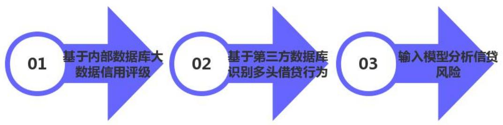  
图3-2多头借贷识别流程

# 3.3.2 贷前风险评估

W 银行贷前准入阶段的风险评估主要体现大数据信用评级。大数据信用评级识别出的优质客户会加入“白名单”并进入下一环节，而非优质客户则会持续监测其信用评级状况。

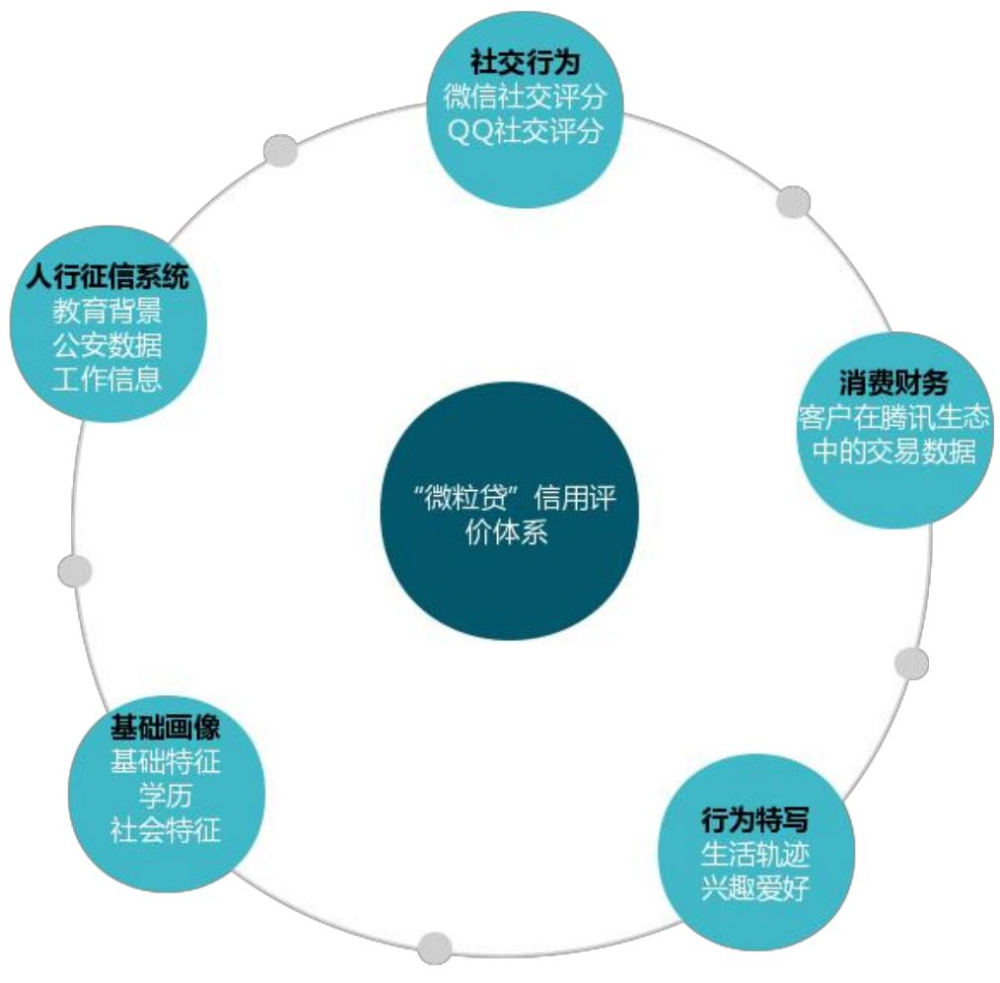  
图3-3“微粒贷”信用评价体系

微信月活用户12.99 亿，QQ月活用户 5.69 亿，如此庞大的个人潜在客户基数，从资金体量与风险控制的角度出发，无法全部对其进行授信。因此，利用大数据风控技术对客户进行信用评级，其综合考虑多方因素，例如：资产收益状况、资产变动状况、账单流水、教育背景、工作信息、生活轨迹、手机型号、所在地等，不仅包含深层数据，浅层数据也有其相应的权重。对信用评分较高的优质客户会邀请其加入“白名单准入”，给予其授信额度并匹配其偏好推荐适合的金融产品，受邀用户能在微信钱包中看到相应的贷款服务入口（见图3-4），而未受邀用户则没有该入口（见图3-5），这是W 银行贷款产品的第一道风控屏障。

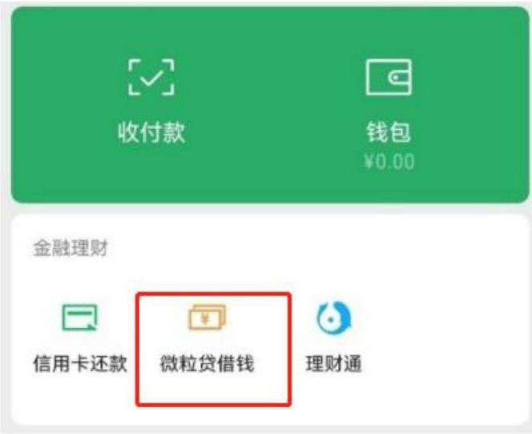  
图3-4受邀用户微信支付窗口

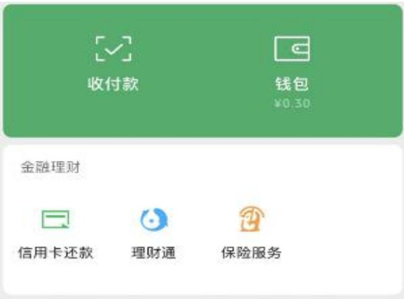  
图3-5未受邀用户微信支付窗口

对企业用户而言，W银行通过“筛选规则 $^ +$ 量化模型”的方式构建信用评级体系。其中，筛选规则主要从所在区域、企业规模、所属行业、纳税类别等维度设定；量化模型主要考虑偿债能力、盈利能力、所处行业成长性、资金配置、杠杆风险承受能力、运营能力六个维度。二者结合，能对小微企业基本信息与信用状况有充分的了解，筛选出评分较高的优质用户，邀请其加入“白名单”，在提升放贷规模做到普惠金融的同时，做好风险管理。

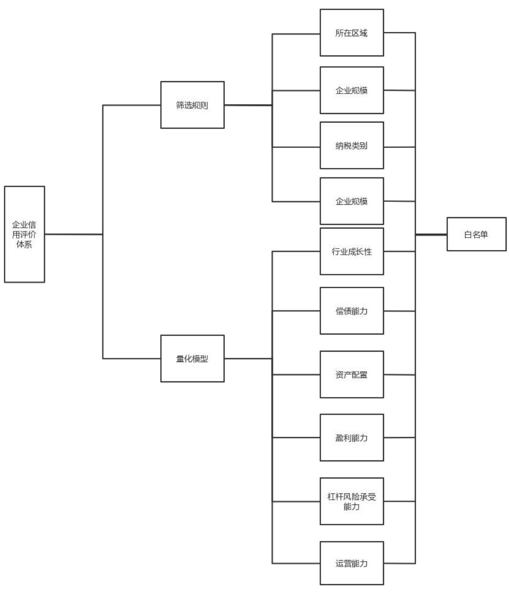  
图3-6“微粒贷”信用评价体系

# 3.3.3 贷前风险控制

W 银行贷前阶段的风险控制是基于贷前风险识别与风险评估进行的准入限制与二次筛选。

准入限制是指对风险识别中不符合加入“白名单”条件的个人和企业从目标客户群体中剔除，关闭其相应的信贷业务办理入口，从根源上消除该类风险较大的客户可能给银行带来的潜在违约风险。其间不仅需要大数据收集尽可能全面的数据与区块链技术对数据进行加密、筛选，在剔除无效数据的同时确保数据的安全性、准确性，更需要基于全面有效的信用评估模型。

二次筛选是指对不符合“白名单”邀请条件的用户以及达到“白名单”邀请标准但尚未接受邀请的用户进行定期重新评估，根据重新评估的情况，若之前不符合条件的用户达到标准则加入“白名单”并发出邀请，若之前达到“白名单”邀请标准但尚未接受邀请的用户再次评估中不再符合标准，则会关闭其信贷业务办理入口，该评估结果的改变可能是评估因子权重变更或个人相关数据发生变化导致的。定期重新评估有三种触发机制：一是用户账户出现重大变化；二是信用评估模型更新；三是固定时间段。

# 3.4贷中审批阶段风险管理

W 银行在贷中审批阶段会对贷款人信息进行的动态识别确认，还会结合大数据技术、区块链技术、生物识别技术对是否存在欺诈风险进行识别。在贷中阶段还会结合腾讯云数据与央行征信数据对借款人的还款能力进行判断，确认授信额度。在放款阶段，是在区块链交易网络下进行的，很好地保证了交易的安全性。

# 3.4.1贷中风险识别

在贷中审批的过程中可能存在欺诈风险、信用风险以及操作风险，金融科技在贷中风险识别中的应用主要体现在对欺诈风险的识别方面，W 银行采用“动态交易防护 $^ +$ 生物信息识别”的方式确认借款人身份，保障交易安全。

W银行的动态交易防护主要对借款人交易环境、交易设备型号、交易号码、资金流向等信息进行横向对比确认。在具体操作层面，W 银行首先对客户日常数据进行收集，如用户手机型号、用户所在地、用户交易时常用的手机号码、交易对手身份等信息，并为各项数据匹配相应的安全值，当交易发生时，系统会自动将交易时的实时数据与相对应的安全值进行对比，对其偏离程度进行判断，若不存在偏离，则交易完成；若存在小幅偏离，则会进行短信验证；若偏离幅度较大，则需进行人脸识别或语音识别。

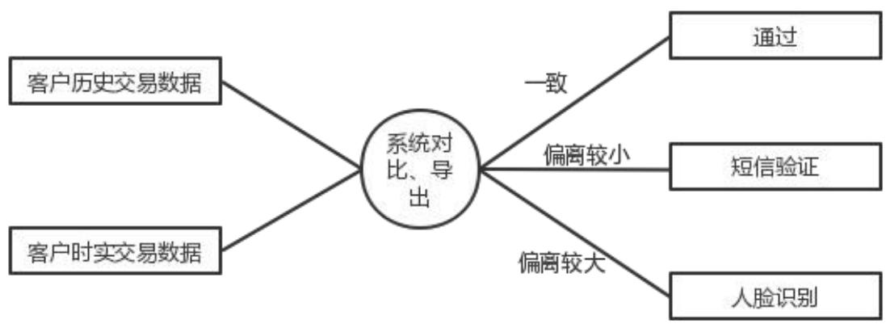  
图3-7W银行动态交易防护流程

W银行人脸识别技术采用的是“极光守卫生物识别技术”，该技术可对人脸进行全方位扫描，并将人脸的 3D 信息以及质感信息转化成可被简易识别的数据信息，该技术的好处是安全性较高，且能快速对人脸数据进行核对以确定用户身份。人脸识别一般仅适用于初次办理贷款服务，但是若后续操作中交易数据偏离程度较大（如更换设备）也会触发人脸识别。

# 3.4.2 贷中风险评估

W 银行贷中风险评估中主要体现在运用大数据信息结合相应的风险模型、信用模型确认授信额度方面。根据白名单用户的综合评分不同，其授信额度间也存在较大差异，该设置因人而异很好地控制了个人或企业因贷款额度超出其还款能力造成的信用风险。W银行对个人的授信额度通常在 500-30万元间，且单笔借贷最高不超过4万元，而同类型的网商银行单笔额度在20 万-500万元。

在贷前阶段，W 银行仅对潜在用户信用进行了初步判断，在对优质用户发出邀请且其受邀加入“白名单”后，才会对客户的授信额度进行正式的评估。在确认授信额度时，会运用大数据技术对接腾讯云数据与央行征信数据，对借款人的还款能力进行判断，而在贷前阶段的信用评估主要是对潜在客户的还款意愿进行判断。还款能力主要是对客户的资产状况、负债状况、交易数据等导入风险模型进行综合评估，确保整体违约损失可控。

# 3.4.3贷中风险控制

贷中审批的最后阶段是进行放款，但W 银行不同与传统的商业银行放贷模式，由于其与资金合作方保持2：8 比例联合放款，并且支持跨行收款，交易信息在多机构间传递，无形间增加的数据安全风险。因此，W 银行基于区块链技术构建了安全交易网络如图3-8所示。

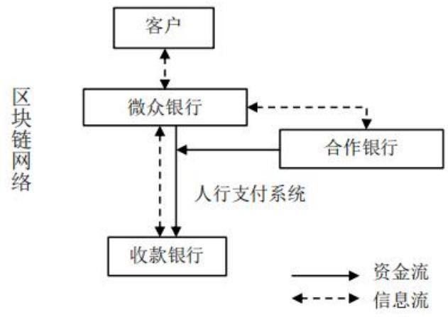  
图3-8区块链网络流程图

W银行通过区块链技术，将图 3-8 中参与交易的5 方所包含信息节点都归入区块链网络中，以该网络为媒介，实现实时信息共享与信息核验。举例来说，在传统的信贷业务中，个人贷款用户可能与银行内部人员勾结，通过篡改合同、伪造信用评级等方式牟利，但在该区块链交易网络中，W 银行信用评级数据通过大数据和区块链技术直接从系统数据库与第三方数据库中提取，不存在人为篡改的可能；其次，在区块链网络中的节点数据是互通的，信息的录入需要获得其他节点中超过半数的同意，且流程的推进也需要各节点数据校验无误才能进行，更加确保了数据的真实性。并且，录入的信息会经过时间戳与密钥的双重加密，避免了其在传递与使用的过程中被篡改的可能，从根本上保证了数据与交易过程的安全性。

传统银行普遍使用的IT框架是“IOE”框架，这种框架有三个问题：首先，其成本较高且技术被国外公司垄断；其次，其仅能处理结构化数据，对于W 银行信用评价模型中运用的众多非结构化数据无能为力；最后，其是单数据中心运行，若数据遗失或被攻击，难以保证数据完整性。而W 银行整个交易流程都建立在区块链交易网络上，采用一种建立在云计算基础上的去“IOE”框架，W 银行是我国第一家采取该框架的银行，该框架各节点间数据互通，若某个某个节点数据遗失或受损，可调取其他节点数据，降低成本的同时很好的确保了数据的完整性，降低信息安全风险。

# 3.5贷后管理阶段风险管理

在贷后管理中，W银行为鼓励客户按时还款，采取刚柔并济的策略。“柔”是指W银行为无法按时一次性偿还贷款的客户提供了分期还款选项，借款人可选择 5/10/20期等额本息的方式进行还款，该方式提高了该类借款人还款的积极性，降低逾期风险的同时也提高了银行的利息收益；“刚”是指客户一旦出现逾期行为，W银行会上报逾期记录至央行征信系统且加收逾期金额应付利息 $50 \%$ 的额外逾期费用。例如：一客户逾期期间产生利息费用1万元，那么他现在不仅需要偿还本金与1万元利息，还需要额外偿还5千元逾期费用。

# 3.5.1贷后风险识别

W 银行贷后风险识别主要体现在通过大数据技术对客户信息持续进行动态监测，从而做到监控预警与对风险的前瞻性识别。

动态监测主要通过构建行为模型与信息补全两种方式实现。构建行为模型是指，通过构建行为风险预警模型，对贷后客户存在的异常行为进行识别并分析可能的原因，根据分析结果给出相应的解决对策。异常行为包括，客户在 W 银行贷款后，又去多家金融机构办理贷款业务的多头借贷行为；客户在其他第三方金融机构的贷款出现逾期；客户的所有贷款总额度大于流动资产总额等。信息补全是指持续运用大数据技术对用户信息进行收集，并利用区块链技术剔除与征信无关的“杂质”，仅保留影响还款能力与还款意愿的资产数据、信用数据、社交数据、违章数据等。补全的信息会导入风险模型进行处理，模型若认定还款人还款能力出现问题会提前进行还款提醒与分期提醒，若客户出现逾期行为，系统会立刻进行警示，并进行AI催收。

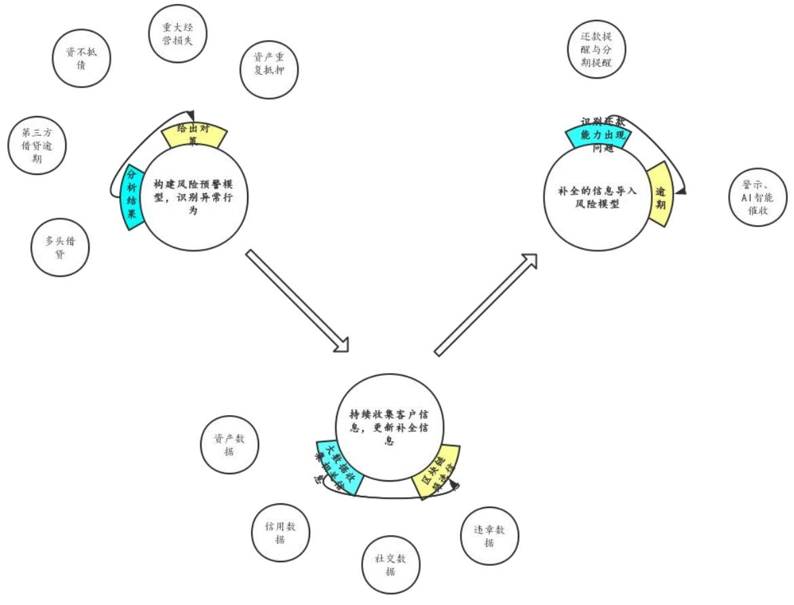  
图3-9动态监测流程

# 3.5.2贷后风险评估

在贷后风险评估中，对于系统识别出的风险会导入风险评估模型中，W 银行以风险评估模型为基础，运用大数据技术实时抓取更新模型所需数据，运用人工智能实时分析政策变化、市场环境变化、经济环境变化以调整风险评估模型中各数据的权重。

W 银行信贷风险评估以定量分析为主，即对识别出的潜在风险中的各风险要素以特定权重并量化表示，最终以数值的形式反馈来反映该风险的大小以及该采取何种对策以控制风险。对于个人用户与小微企业，W 银行采取的模型不同，所需信息种类与权重也都不尽相同，但其整体评估方法是一致的。以小微企业为例，若系统识别出其某小微企业客户存在风险，首先区分其识别出的风险类型，根据风险类型的不同，人工智能会对各要素权重做出调整，最终形成量化反馈，根据反馈结果推荐合适的风险控制方式。例如，系统识别出的风险类型为政策风险，人工智能会针对政策的改变对该行业的影响、借款企业的影响进行分析，根据分析结果，适当调高政策因素在风险评估模型中的权重，调低企业素质、偿债能力、经营能力、盈利能力、创新能力等因素权重。在选择风险控制方式方面，在未实际发生违约前，对于低风险客户通常不会采取特定的措施；对于高风险客户，会根据实际情况选择还款提醒、风险提示、协商优惠利率提前还款等方式。若实际发生违约，则会根据违约时间、违约金额等选择 AI催收、委外人工催收、诉讼等方式。

# 3.5.3贷后风险控制

W 银行贷后风险控制主要体现在逾期贷款催收方面，W 银行逾期贷款催收有 AI催收与委外人工催收两种方式，且系统会自动对逾期贷款根据逾期时间、逾期金额、逾期风险等级进行分类，根据分类自动分配合适的催收方式。

对于系统识别出的高风险客户以及早期逾期客户（一般为3个月以内），W银行采用 AI催收，AI催收机器人会以微信消息以及电话的方式提醒客户还款。AI催收相比人工催收效率高、成本低，且流程标准化，不会发生暴力催收等乱象，据统计，对于还款意愿较高的客户，达到相同的催收效果，人工催收成本是 AI催收的 15 倍，大大节省了催收成本。而对于AI催收失败、逾期金额较大、逾期时间较长、形成不良贷款概率较大的逾期贷款，W 银行则采用委托合作催收机构的方式，合作催收结构通常会采取短信、电话、上门等方式。若两种催收方式长时间都无法取得成效，W 银行会采取诉讼手段。两种催收方式灵活结合，降低了催收成本、提高了催收效率，将逾期损失降到最低，有效的对风险进行控制。

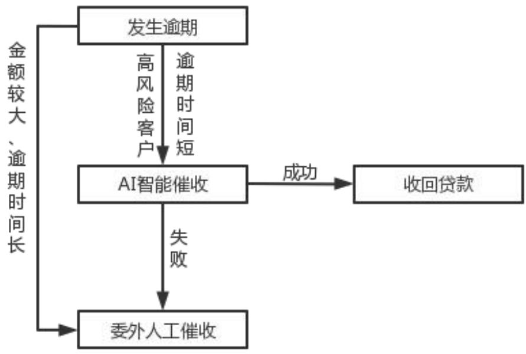  
图3-10W银行逾期贷款催收流程

W 银行的个人信贷业务与传统商业银行不同，是以个人信用担保，而非实物抵押，这就使其面临更大的风险。W 银行在客户受到贷款后，通过区块链数据关联功能，将贷款信息与客户其他信息关联绑定，若在 AI提醒后的 24 小时内仍发生违约行为，违约信息会通过区块链系统与客户其他信息同步，且传输至央行征信系统，对借款人的信用造成影响，限制其后续的贷款及出行，以此降低贷款人违规意愿，控制违规风险。

为控制风险，W 银行在 2018 年联合广州仲裁委与杭州亦笔科技共同研发推出以区块链技术为基础的“仲裁链”，通过其可实现快速维权，强制违约客户还款，降低违约损失。“仲裁链”基于数据加密与分布式存储技术，实时整合业务数据，并形成独立、真实、完整、合法的证据链条。若违约进入诉讼阶段，仲裁机构可以利用通过“仲裁链”直接获取证据链，并与原始数据信息进行核对，确认其真实性，从而快速做出有效判决，有效控制了违约造成的资金损失风险。

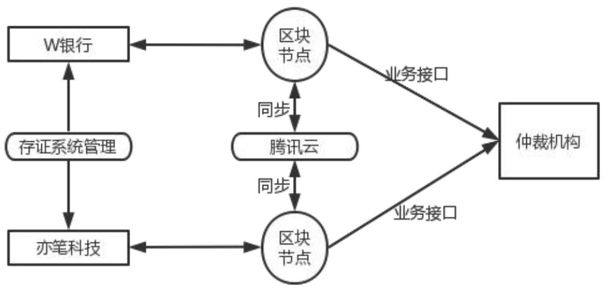  
图3-11“仲裁链“架构

# 4基于金融科技的 W 银行信贷风险管理评价

# 4.1 W 银行金融科技应用效果分析

本文对W 银行金融科技应用效果分析主要从信贷业务以及信贷风险管理相关指标方面入手。影响银行相关指标的因素有很多，比如信贷产品的变更、信贷策略变更、宏观经济环境变化等，但W 银行作为一家互联网银行，自成立以来，其科技人员占比一直超过总人数的一半，且其策略中明确表示，未来科技人员占比会一直保持总人数的一半以上，因此金融科技对其各方面指标发挥着至关重要的作用，在其他条件变化不大的情况下，可以合理认为其经营效果的变化中金融科技的发展发挥着核心作用。为进一步论证其取得的成果与其金融科技的发展相关，本文还选取工农中建四大国有银行以及同类龙头银行网商银行的同期数据纵向对比，进一步验证分析结论的合理性。

# 4.1.1对于W 银行信贷业务应用效果分析

W银行2018年个人有效贷款用户成功突破1亿人次，在2019 年增长 $100 \%$ ，达到2 亿人，后续几年保持较平稳的增长速度，2022 年末其个人有效贷款用户数量达到 3.6亿人。其企业贷款用户主要来源于产品“微业贷”，该产品2017 年11月上线，主要服务小微企业，在增速方面，从18年到 21年，其贷款用户增长速度一直超过 $100 \%$ ,直到 2022 年，增速才放缓，但依然保持 $3 7 \%$ 的增长速度；在用户规模方面，其从18年末的 6.8 万户，仅用时四年，达到 22 年末的 340 万户。W 银行用户规模具体情况见图4-1。

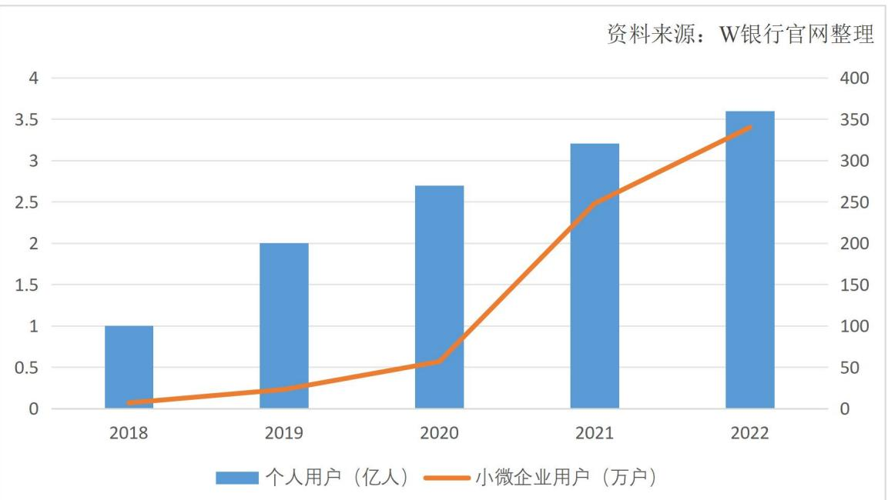  
图4-1近5年W银行用户规模

在放贷规模方面，18 年末其发放贷款和点款总额近1198 亿元，持续保持增长，在22 年末达到接近3370 亿元。W银行18 年开始运营“微业贷”产品，从专重个人信贷业务到个人与小微企业信贷业务并重，当年其发放贷款和垫款总额增长率达到 $1 5 1 \%$ ,后续持续保持增长趋势，且增长率趋于稳定，在 $20 \% { - } 3 5 \%$ 之间浮动。W银行近5年W银行发放贷款和点款总额及其增长情况如图4-2。

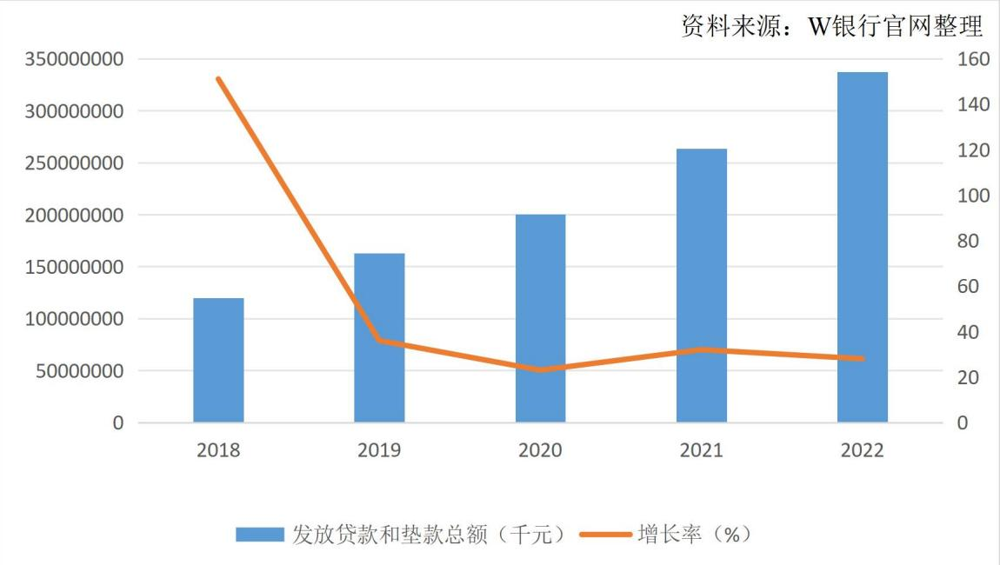  
图4-2近5年W银行发放贷款和垫款总额及其增长情况

随着放贷规模与用户规模的快速增长，对W 银行的业务处理能力与风控能力都提出了更高的要求。面对单日上亿笔的贷款申请，人工处理难以满足审核需求且面临成本过高的问题，但W银行基于金融科技技术建立审核网络，持续打磨优化基于“Openhive开放蜂巢”技术的全分布式核心系统架构，通过推进 POD 架构改造、增加大数据非批量基础引擎生产集群数、建立全覆盖长效容量管控流程等举措，在支撑单日金融交易笔数突破 8.4 亿笔的同时，户均IT 运维成本进一步降至 2 元。面对后疫情时代可能面对的更大规模、更多场景、更个性化的服务需求，W 银行牵头完成 FISCOBCOS v3.0 系列选代优化新增区块链可信轻节点、区块链分布式网关等多项创新功能，将其性能上限提升1倍。

在我国整体经济情况面临困难的当下，银行业面临更大的违约风险，因此对信贷风险管理能力提出了更高的要求，W 银行成功建立了百万级指标算法检测和业务指标实例级预警能力，打造出以图分析算法为主的可自学习的新一代根因分析系统，根因定位准确率超 $91 \%$ ,

# 4.1.2对于W 银行信贷风险管理应用效果分析

于商业银行而言，贷款类型包括正常贷款与不良贷款，而其中不良贷款包括次级类贷款、可疑类贷款与损失类贷款，一般以不良贷款余额与不良贷款率（即不良贷款与贷款总额的比值）来衡量一家商业银行的风险管理情况。

从图 4-2 与图 4-3 结合可以看出，随着贷款规模的不断增长，W 银行的不良贷款余额也是逐年增长的。其中18 年贷款余额增长率与不良贷款增长率都有较大幅度的增长，且贷款余额增长率大于不良贷款增长率，由于不良贷款具有一定的滞后性，因此18 年的部分不良贷款可能尚未在当年数据中完全体现。19 年不良贷款增长率远高于贷款余额增长率，一方面是由于 18 年贷款余额快速增长的滞后反应，另一方面是由于W银行收紧了不良贷款认定标准，次级类贷款认定从逾期 90 天调整为逾期 60 天，这两方面原因导致 19 年不良贷款增长率较高。20、21 年即便在新冠疫情的影响下，不良贷款增长率与贷款余额增长率基本持平，取得了较为优秀的控制成果。但 22 年，不良贷款率明显高于贷款余额增长率，主要是由于 22 年 W 银行调整了放贷策略，将有限的信贷资源向小微市场主体倾斜，约 $60 \%$ 的当年表内贷款增量投向小微企业和个体工商户，使得企业贷款占比从 $3 7 \%$ 提高到了 $45 \%$ ，在经济疲软的大环境下，这无疑放大了风险。总体来说，W 银行信贷风险始终处于较低水平，即便整体信贷风险提升较大，但其基于金融科技的信贷风险控制仍取得了不错成果。

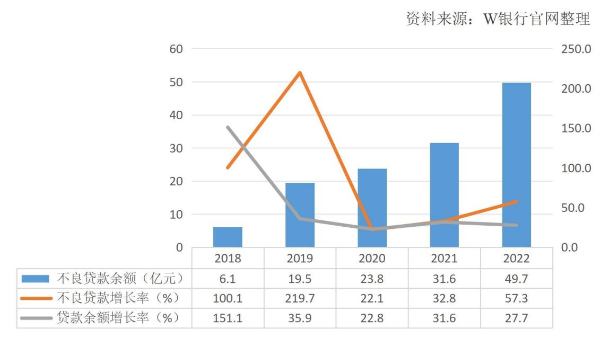  
图4-3W银行不良贷款情况

从W 银行的不良贷款率数据来看，2018-2022 年其不良贷款率一直保持 $1 . 5 \%$ 以下，皆优于银行业平均不良贷款率。在提高不良贷款率界定标准之前，其不良贷款率仅有$0 . 5 1 \%$ ，在其提高标准之后，其不良贷款率也控制在 $1 . 2 0 \%$ 左右。W 银行的战略定位决定其客户以“微”、“众”为主，即“小微企业”与“普罗大众”，该客户群体构成较为复杂，导致W 银行风险识别与风险评估难度更大，且该客户群体风险承受能力较差，意味着W 银行面对更大的风险。从该角度出发，W 银行信贷风险管理难度高于一般商业银行，但从近5 年数据来看，W 银行不良贷款率优于银行业平均不良贷款率，且与服务优质客户四大国有银行对比，仅有22 年不良贷款率高于四大行，但这是其 22年进一步扩大小微企业放贷规模所致。W 银行与四大行、银行业平均不良贷款率对比见图4-5。另外，与同类型中资产规模相当的网商银行相比，近5 年W银行不良贷款率均更低，一定程度上说明其信贷风险管理效果更好。W 银行与网商银行不良贷款率对比见图 4-4。总体来说，W 银行在信贷风险识别与评估方面对比传统银行有其独特优势，且其风险控制能力在同类型企业中也有着领先优势。

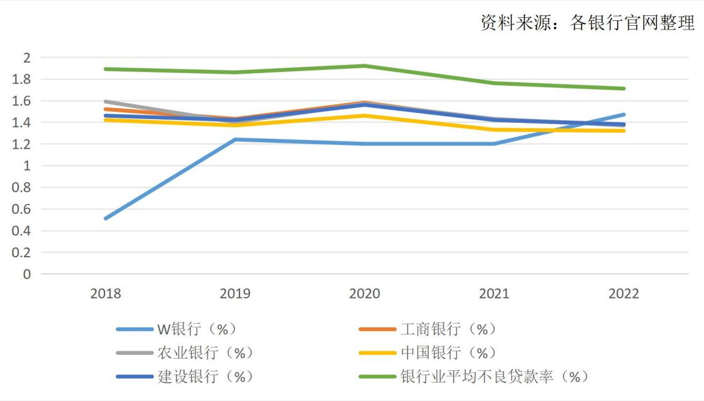  
图4-4W银行与网商银行、银行业平均不良贷款率对比

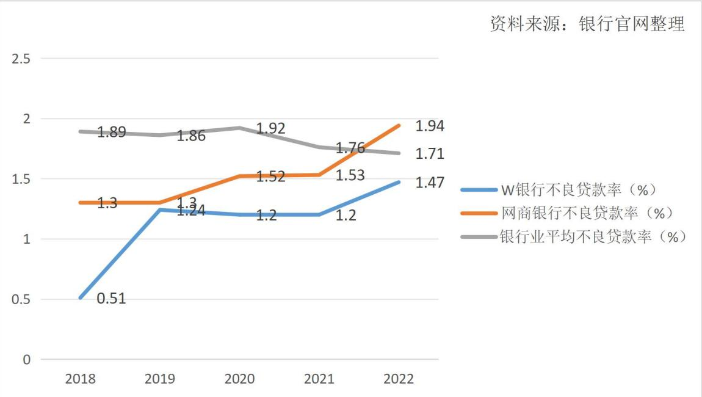  
图4-5W银行与四大行、银行业平均不良贷款率对比

W 银行取得的信贷风险管理成绩与其坚持发展金融科技息息相关。W 银行坚定走高水平科技自主自立自强的发展道路，在人工智能、区块链、云计算、大数据等领域核心技术研用方面持续深入和发力，着手打造新的科技能力矩阵重视风控安全，坚持以科技来防控风险，其研发投入占营业收入较高且研发费用始终保持 $20 \%$ 以上增速，科技人员占比始终保持 $50 \%$ 以上。W银行研发投入情况见图4-6。因此其基于金融科技的信贷风险管理能力不断完善，基本上能保证在贷款规模增长的情况下，稳定不良贷款率，信贷风险管理取得了不错的成绩。

综合所述，金融科技在W 银行信贷风险管理中的应用越发完善、稳定，且在一定程度上是能够有效地控制信贷风险。

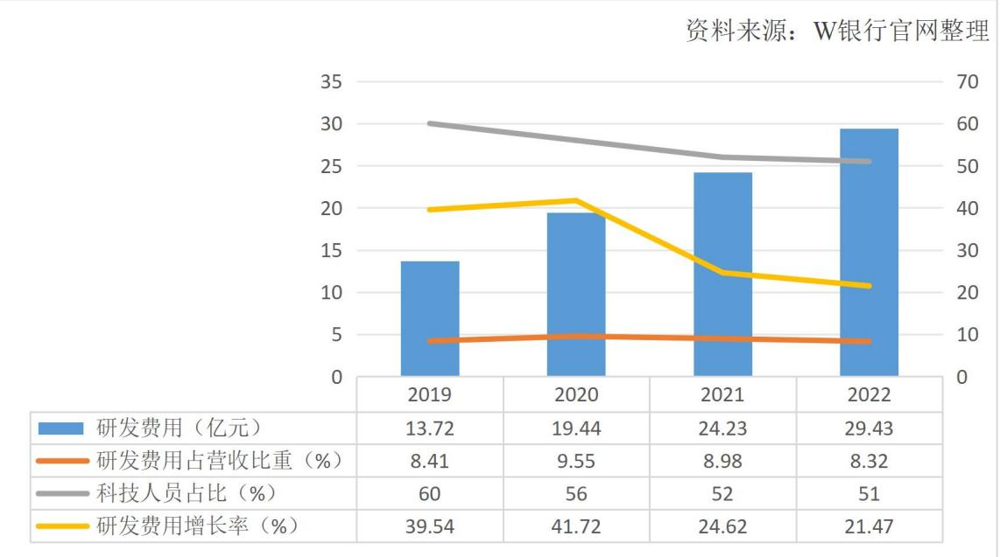  
图4-6W银行研发投入情况

# 4.2 W 银行信贷风险管理先进做法

# 4.2.1金融科技技术为贷款审批提供量化决策建议

在贷款流程中，审批人员扮演着关键角色，对信贷风险的敏感性有着重大影响。分析W 银行的情况可以看出，通过使用系统模型和算法进行在线审批，相比传统商业银行更多依赖人工审批，可以有效降低操作风险。然而，传统银行在信贷业务发展中，更依赖审批人的决策，需要逐步过渡到更综合的决策模式。审批人员的知识和经验有其局限性，可能无法全面掌握所有风险点。对某些领域的不熟悉或对某些行业的不了解可能导致信贷风险管理的盲点，影响银行前端风险管理。金融科技凭借其高效的信息搜集、存储和计算能力，能够为审批人提供行业发展趋势分析、关键指标、借款人数据和市场比较分析、信用情况、相关政策和行业标准更新、抵押物状况以及区域经济评估等，帮助建立决策辅助模型，为审批决策提供量化的风险提示，助力审批人员从更高视角做出全面的审批决策。

# 4.2.2 运用金融科技实现精准识别潜在客户

信息不对称导致商业银行难以准确了解小微企业的实际情况。考虑到小微企业众多且各自规模较小，所处的行业较多、所在地区市场具体情况较为复杂，对它们进行细致调查既耗时又成本高。W 银行运用金融科技对收集的客户信息进行分析，进一步识别其风险偏好、金融服务需求，构建全方位用户画像，从而实现精准推送客户所需要的金融服务。

在实践中，W 银行坚持客户至上的原则，提供定制化的金融服务，基于小微客户的经营和财务数据，既满足了他们的现实需求，也考虑了潜在需求。以“微业贷”为例，W 银行对小微企业信息进行实时追踪，基于模型优化用户画像，并以此为依据，提供定制化的贷款服务，包括适当的贷款额度、差异化的利率及还款方式。与传统放贷方式相比，“微业贷”借助大数据和人工智能，实现了低成本、精准的客户获取。这不仅大幅降低了小微企业的融资门槛和成本，还解决了金融机构与小微企业间的信息不对称问题，有效控制信用风险。最终，这些措施有助于小微企业商业模式的可持续发展，并促进金融服务更好地支持实体经济。

# 4.2.3基于区块链技术建立数据共享网络

区块链技术的加密和共享特性极大地保障了数据的安全性和完整性，有效防止了数据篡改和丢失。W 银行利用区块链技术建立的数据共享网络，确保交易过程中各参与方的数据一致性，从而增强了交易的安全性。此外，区块链网络加速了交易数据的传输和处理，提高了交易效率的同时确保了安全。

在W 银行的信贷风险管理中，区块链应用主要体现在两个方面：其一，在贷款放款阶段，银行通过区块链网络与合作方进行安全的数据交换，实现了信息的双重加密和多方验证，这确保了传输数据安全、有效。其二，在违约维权阶段，W 银行通过基于区块链技术的“仲裁链”能够进行快速维权。“仲裁链”使得交易过程中的数据可以形成清晰完整的证据链，若发生违约且判定需要进入仲裁阶段，其能将证据链快速传递给仲裁机构，有效防止了因违约造成的资金损失，节省了仲裁的时间成本，增强了仲裁的有效性。

# 4.2.4 提供多渠道贷款催收方式

目前我国信贷业务催收方式包括线上渠道、电话、信函、上门、委外和司法催收等，这些方法是我国金融机构、法律机构、欠款人三方博弈产生的结果，其有效性经过了长期的实践验证，但其依然无法解决中长期借款中，借款人为逃避欠款更换联系方式及居住地的难题。

随着金融科技以及互联网的发展，银行能通过网络捕捉借款人信息，根据其网络足迹锁定其现实位置。特别是W 银行，有着更多社交属性的信息，W 银行通过提取和筛选这些信息，能够大致勾勒出借款人的社交圈、生活习惯、常住地、联系方式和常用路线，从而实时更新客户信息，保持多层面的沟通，为贷后管理提供了基础。此外，运用大数据、云计算、区块链和人工智能等金融科技，银行不仅能收集借款人信息，还能与政府、相关公共管理机构共享，通过这些机构对借款人的行为进行约束，从而促使其还款。

# 4.3 W 银行信贷风险管理存在的问题

# 4.3.1贷前阶段信用评级数据类型受限

W 银行在信用评级过程中有着央行征信数据与腾讯系数据两种数据源。腾讯在我国社交软件领域处于绝对领先地位，有着 QQ与微信两大现象级明星产品。根据腾讯最新年报披露，两款产品的年均活跃用户数已达13 亿。可见，腾讯系数据库能为W银行信用评估提供大量社交属性数据。这是 W 银行信用数据的特有优势，但不应因此忽视从其他渠道获取更全面数据的重要性。需要指出的是，社交数据通常不包含信用评估所需的金融属性信息，而且社交数据本身较为复杂多变，大多数情况下都是非结构化数据。

相较于 W 银行，阿里巴巴旗下的芝麻信用在数据源方面展现出独特之处。除了采纳与 W 银行类似的外部数据外，芝麻信用还充分挖掘了六大内部数据源。这些数据涵盖了多个维度：首先是花呗和借呗的还款数据，记录了用户的借贷及偿还行为；其次是电商数据，来源于阿里巴巴旗下的天猫和淘宝平台的销售信息；再次是线下合作商户的经营数据，反映了实体商业活动的状况；接下来是支付宝内的交易流水，揭示了用户的支付行为和习惯；此外，还包括诸如租车、租房等多样化生活消费数据；最后，还有其他各类内部数据资源。与W 银行相比，芝麻信用的内部数据更侧重于金融层面，与其信贷业务紧密相连。然而，这并不意味着金融属性数据在个人信用评估中一定比社交属性数据更有效，这仍然需要时间和实践来验证。总的来说，W 银行和阿里巴巴芝麻信用都有其独特的数据来源，用于信贷业务评估，综合使用不同类型的数据可能更有利于准确评估个人信用。

# 4.3.2 贷中阶段大数据风控安全存在隐患

大数据风控以海量的用户数据为基础，大量且真实完整的数据才能确保大数据风控充分发挥其作用。然而，收集的信息中包含大量隐私数据，其中不乏诸多国外已经列为隐私数据，明令禁止企业使用、泄露该类数据，但在国内尚没有明确规定其用途。该类数据的使用伴随着很大的风险，并且未来是否可收集、使用存在很大的不确定性，若发生数据泄露，会极大的损害客户的权力，并且造成银行的信用危机。

根据2022 年《数据资产泄露报告》显示，数据资产泄露事件在借贷行业占比最高，达到了 $3 8 \%$ ，而在23 年一季度，该数据飙升至 $51 \%$ 。这些数据并不能表明W 银行存在数据泄露事件，但其毫无疑问表明 W 银行同样面临着很大的数据泄露风险。23 年Q1 金融行业细分领域数据泄露情况如图 4-7。可以看到借贷、银行是金融行业中数据泄露的主力军，并且信息通信管理局连续两年因违规收集个人信息通报了两家互联网银行的 APP，其中之一就属于 W 银行，且两次通报都找到了W 银行APP 的身影，在某种程度上可以说明W 银行存在一定的数据安全问题。因此，我们非常需要去重视、去关注W银行的数据安全问题。

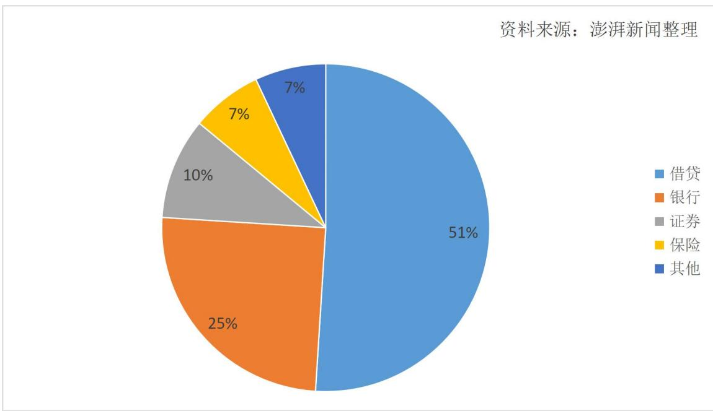  
图4-723年Q1金融行业细分领域数据泄露情况

# 4.3.3贷后阶段贷款用途智能跟踪管理不足

W银行虽然通过互联网提供贷款服务，但在其信贷业务流程中存在一个显著的问题，即缺少对贷款用途的智能化追踪管理。具体来说，该系统既未明确设定贷款用途的规范与限制，也未对客户资金的使用流向进行有效追踪。客户可以自由地将资金转移到任意账户并提现使用，而系统并不对资金的后续使用情况进行监控。这种情况可能源于W 银行个人信贷业务的广泛性和复杂性。W 银行的客户群体众多，主要提供小额消费贷款服务，其资金来源也是多元化的，包括 $20 \%$ 的自有资金和 $80 \%$ 的合作银行资金。这种多元化的资金来源可能增加了资金追踪管理的难度和成本。

然而，值得注意的是，W银行个人信贷业务的约 $46 \%$ 客户来自三线及以下城市，其中逾 $8 1 \%$ 为非白领从业人员，约 $8 5 \%$ 的客户具有大专及以下学历，还有约 $1 7 \%$ 的客户之前没有人行信贷征信记录。这些客户属于相对高风险群体，人工跟踪管理效率低，成本高，质量难以保证。因此，有必要引入智能贷款用途跟踪管理，以提高风险控制效率。

W银行个人信贷的主要客户群体是年轻、低收入和低学历的人群，他们通常对风险认知有限，风险控制意识薄弱，容易进行高风险的贷款投资和多头借贷。此外，W银行个人信贷业务还涉及到大额客户（最高额度30万元），如果因缺乏贷款跟踪管理而导致资金滥用等问题，将给客户和银行都带来巨大风险和损失，可能导致客户流失和本息无法正常收回，同时增加轻资产运营的经营风险。此外，智能贷款用途跟踪管理的不足还会增加客户二次贷款时信用错估的风险，进一步加剧信息不对称问题，可能形成恶性循环，增加信贷风险。

# 5研究启示与建议

# 5.1研究W银行得到的启示

# 5.1.1建立智能化信用评级系统

经过多年的发展，几乎所有银行都有着一套相对成熟的信用评级系统，但随着大数据时代的到来，银行可获取的数据类型以及数据总量迎来爆炸式增长，且时代的高速发展，往往会有新的数据类型出现，传统的信用评级系统面对复杂的数据类型时往往不能全面充分的评估其价值，且无法及时对新数据类型做出反应，影响信用评级效果。近年来，金融科技技术迎来了高速发展期，尤其是在人工智能领域取得了突破性进展，Chatgpt 的产生掀起了新一轮的人工智能热潮。因此，建立一套能实时根据外部外在条件。其能更好的适应当下的业务环境，全面统筹利用数据资源，更好的应对外部环境变化，做出更为合理有效的信用评级。

# 5.1.2与金融科技企业展开合作

各类银行在多年的发展中往往更专注于客户的积累与金融服务方面的提升，在技术层面的积淀相对较少，在将金融科技与信贷风险管理相结合的过程中难免涉及到很多复杂的技术应用，从零开始的研发不仅会承担较大的经济成本，还会损失较大的机会成本。而金融科技企业，在金融科技技术方面相对成熟、先进，但其在金融行业属于初入者，客户基础不够牢固、金融服务不够成熟、金融产品不够全面，二者相结合，互相取长补短，会产生相得益彰的效果。通过合作，银行能更好的运用大数据技术收集整合信息，并通过区块链技术加密、筛选，更加安全的保留优质数据，基于此建立的风险管理模型也将更好的评估客户的信用，逐步改善过度依赖实物抵押的信贷现状；并且，通过合作，银行能获取拓展在线业务、服务的技术支持，全面发展线上业务办理，在充分控制风险的情况下，达到降本增效、优化客户体验的效果。

# 5.1.3优化信贷风险管理模型

基于金融科技的W银行信贷风险管理模型为银行业该如何构建信贷风险管理模型以及如何运用信贷风险管理模型优化信贷流程提供了思路。首先，风险管理模型要根据外部环境的变化及时调整参数权重以做出更有效的评估，该过程需要高水平的人工智能予以支持；其次，针对不同类型不同行业的企业，要根据实际情况，灵活调整风险模型所需要的参数，以对企业客户的风险、信用情况作出更真实、有效的评估；最后，信贷风险管理模型是为信贷业务服务的，通过完善模型，要起到优化信贷审批流程的作用，在控制风险的前提下，提升管理效率与审批效率。

# 5.1.4构建金融科技人才风控团队

为了提高金融科技下的银行信贷风险管理能力，在人才存量上，不仅要重视日常业务与金融科技应用能力的培训，还要加强复杂业务各部门间合作能力的培训，在复杂业务中合理利用金融科技技术，简化工作、提高效率，打造高素质人才队伍；在人才增量上，要加强金融科技技术算法、架构人才的引进和建设，专门设立新的金融科技风险管理部门，负责将金融科技技术融入到日常风险管理中，在加强科技融入风险管理的同时，也要立足实际，针对业务需求与人员学习能力，开发实用、易上手的应用程序。

# 5.1.5自建金融科技子公司

借鉴互联网银行金融科技的发展模式，银行业可以通过自建金融科技子公司的方式来推进金融科技的发展。首先，银行业能更好的与金融科技公司展开技术合作，提高合作效率与自主性，共同开发新的金融产品与管理服务应用；其次，更有利于定向招募、培养金融科技相关人才，培养内部团队的技术和数字化能力，以适应不断变化的金融科技环境。最后，科技技术发展日新月异，通过建立子公司的方式能更灵活的调整內部政策以适应发展需要，采用多元化政策鼓励內部创新，积极构建科技技术解决金融问题的服务方案。

# 5.2W 银行信贷风险管理优化建议

# 5.2.1拓展数据源且增添金融属性数据

拥有腾讯系的数据源是 W 银行信贷风险管理的一大特色，腾讯数据源所含数据类型较广，同时包含社交、电商、消费、金融相关数据，其中主要以社交类型数据为主，这是W 银行区别于其他银行的地方，同时从取得的信贷风险管理成果来看，这也是W银行的一大优势，因此要在保持自身特有优势的基础上，积极完善自身不足且深度开发该优势的更多可能性。

首先，W 银行可以构建更为全面的风控体系，通过与更多优质企业和金融机构进行合作，以现有的数据类型为基础，重点拓展较为薄弱的数据类型，比如信贷、电商、经营、理财、保险、消费等更具金融属性的数据。其次，W 银行的社交数据具有很强的逻辑性，而这些逻辑性的背后代表着更深层次的信息，充分分析挖掘这些信息将为信贷风险管理提供更为专业的保障。最后，W 银行可以通过建立更广泛多元的信贷场景的方式以获取更多样化的数据，如针对大学生与职场人士的消费金融服务，从不同角度深度丰富、挖掘数据，以此来提升数据的深度和广度。

# 5.2.2 构建全面数据安全保护体系

数据安全对于W 银行来说至关重要，它直接关联到银行的声誉和客户信任，也涉及到多方面法律问题。若无法确保数据的安全性，银行便可能面临失去客户信任、违规处罚的风险。尽管W 银行目前未遭遇严重的数据安全挑战，但这仍是一个不容忽视的领域。

为了加强数据安全，W 银行需要增加投资。这包括财务投资，用于购置先进的软件和硬件设施及招募技术专家。先进的技术设备和专业人员是确保数据安全的关键，只有充分的投入才能确保及时且有效地检测和修补数据漏洞，防止数据泄露。同时，对数据安全的关注也需持续不断，只要银行继续在线上运营，就必须不断关注这一问题。此外，W 银行还应当加强信息公开，及时向客户通报数据安全相关的情况。尽管无法完全保证数据安全问题永不发生，但银行能够对这些问题进行迅速的响应和处理、透明地公布问题处理结果，可以展示 W 银行对待数据安全的态度，能很大程度的增强客户对W银行的信心。

# 5.2.3增加智能贷款跟踪管理流程

在W 银行的微粒贷个人信贷业务中，并没有对贷款用途做要求或限制，允许客户自由选择贷款接收账户，随用随贷的模式为客户提供了极大的便利，为W 银行贷款规模快速增长创造了空间，但其缺少对贷款使用的跟踪和管理，使其面临更大的违约风险。这与传统银行的贷后管理核心环节不同，该环节不仅对确保本金及利息回收意义重大，还对客户的再次贷款信用评估产生影响。因此，W 银行需在其区块链业务流程中融入客户贷款用途的智能信息收集及贷款使用的智能跟踪管理。可考虑以下两种方法：

（1）放贷至W银行虚拟账户：

W 银行与传统银行一样，支持存取款业务，但该业务是通过线上app 实现的。W银行没有实体卡，因此其基于区块链技术，开发了虚拟账户，以支持存取款业务。考虑到微粒贷业务与W 银行存取款业务均基于区块链，支持线上操作，建议将微粒贷贷款发放至客户的W 银行虚拟账户。这样，贷款使用必须通过虚拟账户进行，方便收集客户的贷款用途信息，对账户异常交易进行限制。同时，运用区块链技术对贷款的使用实施实时、全面、持续监控，将贷款的使用范围限制在虚拟账户中，不允许客户提现、转账，保障跟踪管理的有效性。

（2）与区块链系统内合作银行建立信息共享：

W 银行还可以利用其与区块链系统内其他银行的合作关系。将虚拟账户收款放宽至这些银行账户，并建立信息共享机制。通过区块链技术实时监控客户贷款流向，实现有效的贷款跟踪管理。

