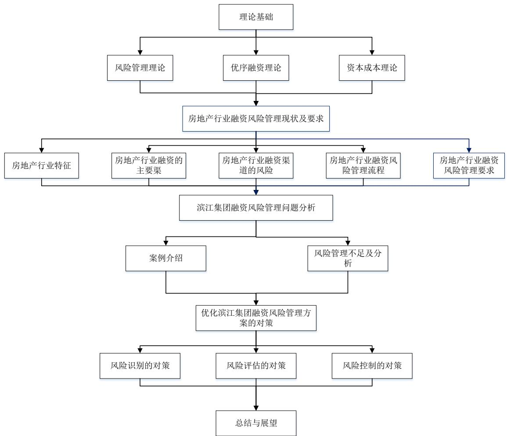

# 第一章绪论

# 1.1 研究背景

房地产作为中国经济发展火车头，带动了经济的全方面发展，体量庞大、关联的行业多与产业链条较长等特点决定了房地产行业对宏观经济的影响长期处于主导地位。从产业链的角度看，房地产行业对上游的城市规划、政府工地到下游的建材市场、劳动供给、装修、物业等方面均有较大影响，其兴隆与低迷会直接对上下游产业带来积极与消极的反馈。近年来，房地产行业不断扩大规模，主要通过增加土地储备与开发项目的方式，二者均需企业自身强大的现金流作为支持，随着融资总额的增加，相应的融资风险也会变高。因此，为了保障房地产企业的长期稳定发展，应对房地产的融资端进行严格把控，限制房地产企业的融资行为并做好风险管理。2020 年 8 月20 日，央行和住房和城乡建设部关于房地产行业的“三道红线”政策，“三道红线”是指房地产企业的现金短债比小于1倍、净负债比大于 $100 \%$ 并且取消预收款后的资产负债率超过$70 \%$ 。该政策出台后便成为2020 年房地产企业融资端最大的事件，引起了各地房地产企业的充分关注。在2022 年，政府为防止房地产企业因债务违约而破产，加强了对房地产企业融资活动的监管，促进了房地产企业的合法合规。2023年与2024 年国家对于房地产行业的政策逐渐有了由紧到松的态势，无论是房贷利率下调还是“认房不认贷”、多地区解除住房限购政策的颁布对于房地产行业都是利好的态势，房地产企业需通过融资来进行战略部署，以应对需求端的增长。

基于上述宏观背景，房地产企业开发经营以响应政策需要大量资金，融资需求较大。因此，融资问题已成为房地产企业关注的焦点。这无疑给房地产企业带来了巨大的压力，房地产企业为了快速发展，导致表内财务数据大幅增加。截止 2023 年底，房地产企业债务违约频发，市场对房地产企业融资风险的担忧更加明显。部分财务表现较好的房地产企业也会存在高杠杆的情况，债务违约的风险继续增加。据中指研究院数据显示，2022 年房地产行业非银行融资金额为 8457.4 亿元，该数据相比 2022 年度的17652.2 亿元有了明显的下降。由此可见，房地产行业融资紧缩的趋势更加明显，房地产企业获得融资资金的难度也在增加。

因此，对于房地产企业来说，及时响应政策调整战略以更好的发展十分重要，同时在整体融资情况较为困难的情况下，如何合理安排自己的资金需求，在融资最大化的情况下有效防控融资风险是所有房地产企业应关注的问题。

# 1.2 研究意义

在低碳发展和碳达峰和碳中和的目标背景下，企业在实施经济发展的同时，必须兼顾环境保护，减少碳排放，减缓气候变化的共同责任。滨江集团股份有限公司是一家房地产企业，其融资风险管理是指该公司在融资过程中对所面临的各种风险采取相应措施进行管理和控制的过程。随着滨江集团股份有限公司的综合排名稳步提高，其融资规模逐年增长，公司的债务水平也在逐年上升，2022 年末的流动负债总额高达1800亿元。此外，公司经营现金流呈现下降趋势，2022 年的自由现金流为负值，显示出融资风险的存在。2018 年，该公司在发行债券过程中遇到了信用评级下调的情况，导致债券价格下跌，融资成本增加，给公司带来了一定程度的融资风险。另外，在2019 年，该公司的部分项目开发周期延长，导致资金周转不畅，面临了项目资金紧缺的风险。这些案例反映了滨江集团股份有限公司在融资过程中所面临的实际挑战和风险。加强对滨江集团股份有限公司融资风险的管理，以确保公司在 2023 和 2024 年政策逐渐利好的背景下可持续发展。随着响应低碳、环保的发展以及自身的融资需求不断增加，传统房地产企业面临着融资渠道的收窄和成本的上升，需要更加有效地管理融资风险，确保资金的稳定供给。加强融资风险管理符合国家经济金融政策的要求，可以为企业提供更好的发展环境和条件，因此，本文对滨江集团股份有限公司融资风险管理的研究具有重要现实意义。

本文从理论角度来看，滨江集团股份有限公司融资风险管理的研究将填补当前相关领域的研究空白。首先，随着房地产政策不断调整，融资要求不断提高，公司面临的风险也将不断演变和增加。研究滨江集团股份有限公司的融资风险管理将有助于深入理解在这一背景下，企业面临的风险及其管理方面存在的问题，并提出相应的解决对策。其次，通过对滨江集团股份有限公司融资风险管理进行研究，可以为相关理论提供实证研究的范例，丰富和完善相关理论体系。

本文从实践角度来看，研究滨江集团股份有限公司融资风险管理对于公司管理层具有重要的指导意义。首先，通过深入研究滨江集团股份有限公司的融资风险管理情况，可以发现当前存在的问题和不足之处，并提出相应的改进措施，以提高公司的融资风险管理水平。其次，研究结果对于其他房地产类公司以及其他行业的企业也具有借鉴意义，可以为融资风险管理提供参考和借鉴。

滨江集团在2023 年的中国房地产排名为13名，其并非房地产行业内的龙头企业，但其企业规模处于行业平均水平或稍偏中上游，且没有采用多元化的经营模式，对“双碳”背景下的一些政策、环保意识的关注度有限，因此该案例相对具有典型性，应对其风险所提出的解决方案和分析可作为大多数房地产

企业的参考。

# 1.3 国内外文献综述

# 1.3.1融资风险概念

随着世界经济的全球化与我国经济的不断发展，行业的规模与其融资风险不断呈正相关的走势，对于中国 GDP 贡献率较高的房地产企业，融资风险在过去的研究中，受到更多学者的关注。

外国学者AngrainiDP（2020）[1]提到微观经济与宏观环境共同作用于企业的融资风险。学者Zenios SA（2021）[2]的研究表明在宏观经济以及金融和政策不确定性下，企业可以通过优化融资结构的方式来降低融资风险。

国内学者很早就引入了融资风险的概念，近年来根据市场规模与经济发展，国内学者对于融资风险的分析有了新的总结。李敏（2016）[3]根据风险程度的不同将融资方式分为了企业内源融资、股权融资与债权融资，李敏支持企业内源融资的风险较小，其次是股权融资，风险最大的为债券融资。张金鑫（2023）[4]基于 39 个国家 1992 年至 2021 年的数据作为样本进行研究，得到公司增长率与公司的冒险行为会影响企业的融资风险的结论。

通过整理以上文献研究发现，目前国内外融资风险的概念正在不断地扩展，并且与经济形势相适配，并且逐渐与企业的环保水平相联系。作为房地产企业，目前受政策与市场影响较大的，其融资风险可以分为股权融资风险与债权融资风险，随着融资风险的概念延伸，其对应的风险管理方法也应进行调整与完善。

# 1.3.2 融资风险管理

风险管理是目的，内部控制是手段，在降低融资风险的方法选择上，多数企业目前采用优化内部控制的方式。对此，学者的既往研究将其分为了三大方面，分别为风险识别、风险评估与风险控制。蔡婧（2023）[5]在其文章中讨论了房地产企业建立融资风险评估体系的重要性，讨论了在市场下行状态下，融资风险评估的重要价值。葛福婷等（2023）[6]指出目前多数企业通过在海外发行不同币种债券的形式融资，海外债逐渐变为重要的融资渠道。目前中国的债券市场的发展速度与相关制度建立速度并不匹配，国内发行制度的完整性、合规性与风险认知管理方面还与许多发达国家存在较大的差距。评级漏洞、偿债期过于集中以及过度偿债，同时还包括汇率与价格波动等汇率与流动性风险的存在，导致债券违约风险不断上升。对于此种情况应加强对融资风险管理，基于风险管理理论从风险识别、评估与控制方面分别进行完善。

在风险识别方面，国外学者的观点如下，ZhouX（2022）[7]认为目前的融资风险识别模型仅根据企业的财务状况进行识别。风险指标的局限性影响识别的准确性，对于不同行业的企业有很大的局限性。LiuC（2022）[8]利用人工智能算法对能源企业的国际进出口贸易中的融资风险进行识别，多方面降低了企业的融资风险。国内学者认为，在风险识别类别的方面主要分为财务风险和非财务风险，谢文静等（2020）[9]指出了风险是影响供应链融资当前发展的重要难题，其将风险识别分为了四个方面宏观政策与行业、商业银行影响因素、电商平台影响因素以及企业自身的信用与融资水平，选取五家典型企业运用直觉模糊层次分析法确定权重并进行综合评价与比较。雷鸣等（2022）[10]探讨了基础设施REITs 融资风险，在风险识别过程中，其将风险分为了政策、法律、市场、不可抗力、等等，强调了非财务指标对于融资风险的影响，利用交互作用矩阵实现量化分析。万晓莉，张冰涛（2023）[1]在研究高校融资风险的评估中选取了三个大类的指标，分别是资金清偿能力、资金利用能力以及债务的结构，在选取完指标后采用功效系数法进行评价。陈玲玲（2023）[12]在融资风险管理的研究中，使用了政策风险、市场风险与信用风险作为非财务风险方面指标的选取，对于财务指标选取了代表企业资金使用、资金偿还、以及自身发展相关的指标，基于分析，提出了风险防范措施。在非财务指标中，企业环保水平逐渐进入投资者的视野，李建军（2023）[13]从企业的信贷融资角度出发，选取了2011-2020 年的A 股上市公司作为样本，最终发现良好的 ESG 表现有助于提高其融资能力从而降低融资风险。

在风险评估方面，国外学者LiJ（2022）[14]在构建风险评价指标体系时关注了很多非财务指标例如企业组织特点与工艺特点并利用GA-PSO 算法对风险进行评价。ZhangT（2023）[15]等人基于 DS-XGBoost 模型建立了一套新的风险评估机制，能够更加精准的评估不同企业的融资风险情况。国内学者对于风险评估的研究也十分丰富，郭贯成等（2020）[16]研究了经济发达地区通过土地抵押的融资风险评估，在选取指标方面与前几篇文章相同，也选取了非财务指标例如市场、信用与政策等等，在评估过程中使用了熵值法进行权重的计算，最后利用混合聚类模型将结果分为五个等级用于解释结论。潘雅琼等（2015）[17]采用层次分析法进行研究，将影响融资风险的宏观指标与企业自身微观指标融入体系中，结果发现国家宏观调控政策与行业的法律限制等对企业融资风险的影响最大。对于风险评估方法上，翁逍逍（2023）[18]在对中小企业进行融资风险评估时，引入了AHP 和云模型，利用层次分析法构建了中小企业融资风险评估体系。南星恒等（2019）[19]研究了通过质押融资流程的产权产生的融资风险，其将风险分为了三部分，贷款企业、知识产权与当前的宏观因素，与风险识别部分相同，分为了财务指标与非财务指标，运用层次分析法构建了一套科学合理的风险评估指标体系。王强（2021）[20]在其文章中探讨了企业的融资风险评估过程，采取了功效系数法来评估企业的融资风险。提出了优化资产质量，提高营运资金流动性，改善融资渠道,优化融资决策等融资风险防范策略,为企业融资风险评估提供了参考。

在风险控制方面，国内外所采取的主流方式不同，国外的风险控制重点在于利用先进的模型在事前对风险进行预测并加以控制，而国内更强调风险事前的管理，通过管理手段对风险进行控制。

国外学者ZhuJ（2020）[21]提出在企业的融资风险控制的方法中，宏观政策发挥了很大的作用。DuG等（2023）[22]认为在大数据时代背景下信用风险控制可以依靠大数据技术形成有效的互联网信用预警和预防，此举拓宽了神经网络在融资领域的应用。MaZ等（2023）[23]认为一个能够有效预测企业融资风险的科学框架，既可以促进企业管理，又可以降低金融机构的风险成本。其建立了基于改进的极限学习机模型的预测模块实现了更高的预测精度；评估模块利用中国中小企业和所有沪深A股上市企业的数据，对所提出的混合预测框架进行合理、科学的评估，结果表明，所提出的混合预测框架优于其他比较模型，是预测企业融资风险的可靠工具。

国内学者，朱丽娜（2023）[24]提到资金是企业运营的基础，对于企业而言融资是必然结果，文章研究了供应链应收账款的融资风险，在风险控制方面，作者提到首先应加强企业内部人员的风险管理意识，采用定期人员培训以及相关风险知识宣传的方式提升专业人员的业务能力与素质水平，其次建立相关的风险控制体系，针对风险问题各部门及时反映并共同防范，最后加强以往的风险数据统计也是十分重要的风险控制途径。崔润琼（2021）[25]研究了关于PPP项目融资风险的风险控制，在应对措施中提到了设置风险数据库的方式，根据关键数据来确定预警指标，以此达到风险监控的目的，对于存在风险的指标及时进行预警并进行风险防范。韩风芹等（2020）[26]研究当前中小企业的融资困境，在风险控制方面提到了政府的政策对于风险控制起到了重要作用，如风险补偿与信贷激励。彭志敏（2017）[27]在融资风险控制的探讨中指出应建立健全的风险控制制度与科学的风险控制流程，优化融资结构并及时设立财务预警指标体系，利用先进的技术与模型把控融资风险。张牧青（2023）[28]分析了近年来我国房地产企业融资风险控制能力的情况，作者通过研究认为企业的融资风险控制能力有了一定的提升，融资风险在一定程度上被缓解了，但仍需强化专业团队建设，提升融资风险控制的水平。曹耀威等（2023）[29]基于“三道红线的政策背景下，为房地产企业建立了包含产业共性与企业个性的融资错配风险预警指标作为风险控制的方法。陈中飞等（2022）[30]研究表明，数字化转型可以有效降低企业的融资成本。段华友的（2023）[31]与任晓姝（2024）[32]同样指出，企业的数字化转型可以减少融资约束并提高企业的创新水平，任晓姝的研究还指出了发行绿色债券会提高企业ESG 表现，从而影响融资。

通过以上文献整理发现，在风险识别方面，国内外逐渐从财务指标选取变化到了财务与非财务指标共同选取，来对融资风险进行防范。在风险评估方面，国内外近年来均选取了模型的方式作为风险评估的手段，如AHP 层次分析法、熵值法、功效系数法等等，在风险控制方面，国外更倾向利用先进的技术手段，国内力求提高管理水平来应对融资风险，同时，国内更倾向于用数字化转型来降低企业的融资约束。

# 1.3.3 房地产行业融资风险管理研究

陈卫东等（2023）[33]指出目前我国房地产行业具有业务结构单一、杠杆水平较高以及营运能力偏弱等特点，黄娴静等（2023）[34]指出房地产行业的投融资行为受宏观政策影响较大。在此基础上，我国房地产行业融资风险的特点有以下几个方面：杠杆水平较高、开发资金中自由出资份额低、民营房地产的综合融资成本高、大量运用表外隐性债务粉饰杠杆。此外，我国房地产企业的资金流动风险也较高，具体体现在资产负债期限错配程度较高，对“预售款”资金池进行运作等方面，陈卫东等（2023）[35]。李光春（2022）[36]在研究中将房地产行业的融资风险归集于外部政策、内部管理、资产负债以及融资结构四个方面，造成这些风险的原因在于房地产融资的高增长以及多元化。在房地产企业融资风险控制的研究中，樊光义等（2022）[37]认为在国家政策宏观调控的影响下，申请融资的条件越来越严苛，融资成本不断升高、融资渠道的收紧、融资门槛的提高等都是房地产企业所面临的难题。针对以上风险，国内学者近年来研究房地产行业融资风险管理取得了很多成果，林湛雄（2023）[38]综合考虑宏观政策因素，提出了房地产企业融资应从当前阶段经济形势入手的看法，房地产企业要想降低融资风险，需要采取适当的投融资策略，从而让企业实现稳步发展。

综上所述，国内外对于融资风险的研究已经很多，结合房地产企业的行业特点来看，房地产企业的融资风险识别与评估应在关注自身财务指标的同时，增加市场、信用、环保水平等非财务指标进行风险的识别与评估的建模，同时在对策上注重企业自身技术的研发同时提高内部的管理能力，设立单独的团队，以实现房地产企业的融资风险管理。

# 1.4 研究内容及方法

# 1.4.1 研究内容

本文主要研究了滨江集团股份有限公司的融资风险管理，运用定性和定量的研究方式，分析了该公司的融资环境和融资模式，分析了其融资风险管理的不足之处，提出了优化滨江房产集团融资风险识别、评估和控制的对策，旨在帮助滨江集团股份有限公司更好地管理融资风险，保障企业的可持续发展。论文框架如下：

第一章绪论，对研究背景和意义进行了阐述，对国内外相关文献进行了综述，说明了本文的研究方法与创新点。

第二章是理论基础。介绍了风险管理理论、优序融资理论、资本成本理论，为之后文章的研究与论述打下基础。

第三章对房地产行业的特征和融资渠道进行了介绍，同时整理了房地产企业融资风险影响因素与相关管理制度。

第四章对研究对象滨江集团进行了介绍，对企业的融资风险管理问题以及不足之处进行了分析。

第五章采用熵值法、功效系数法相结合的方式，对滨江集团财务数据进行定量分析，分别就风险识别、风险评估、风险控制三个方面，提出了优化滨江集团风险管理方案的对策。此外本章节还对房地产行业最新融资政策及环境进行剖析，定量分析与定性分析相结合，进一步深入解决滨江集团融资风险问题。

第六章为结论与不足。本文结论为房地产行业当前的政策导向需要企业进行融资拓宽市场，但在三道红线的导向作用下，房地产企业的融资风险尤为重要。国内房地产企业应注重自己内部管理的方式去降低企业融资风险，并参考国外企业的先进模型及技术，二者相结合的方式为企业的融资风险管理保驾护航。部分研究方法采用了专家打分的方式，因此可能存在较为主观的情况。

  
图1-1研究内容

# 1.4.2 研究方法

（1）文献研究法

通过阅览、总结、归纳风险管理以及房地产融资风险相关的文献，掌握当前房地产行业的融资渠道以及可能存在的风险，梳理国内外目前对融资风险采取的应对手段，为本文的研究打下理论基础。

# （2）案例研究法

本文的第四章与第五章采用案例研究法对滨江集团融资风险管理现状进行研究。通过识别滨江集团融资存在的风险，针对风险识别、风险评估、风险控制三个环节，结合房地产行业当前的法规，寻找问题并提出解决措施。

# （3）熵值法

本文的第五章采用熵值法对滨江集团的各个指标进行研究。通过计算滨江集团各指标的信息熵来确定权重，在根据熵值法得出各指标权重后，筛选出融资风险的关键评价指标，从而降低主观因素对指标选取造成的影响。

# （4）功效系数法

本文的第五章采用功效系数法对滨江集团融资风险评估体系中的关键指标进行标准化评分。根据指标性质差异，将其划分为极大型变量、极小型变量与区间型变量。最后，基于Z计分模型得出各年融资风险综合得分以及各指标的得分。

# 1.5创新点

本文的创新点主要体现在以下两个方面，首先从研究角度来看，以往文献更多关注房地产企业自身的财务指标，而本课题增加了对房地产行业相关非财务指标的关注。在指标的选取中保留以往的财务指标基础上加入ESG、企业信用、政策打分等非财务相关联的指标，对滨江集团融资风险管理进行优化。其次从研究方法来看，综合运用多种方法，在研究中，选择适合的研究方法如熵值法与功效系数法相结合的方式，减少了人为干预，提高了评价体系的客观性与合理性，便于对房地产企业融资风险评估体系构建提供参考。
