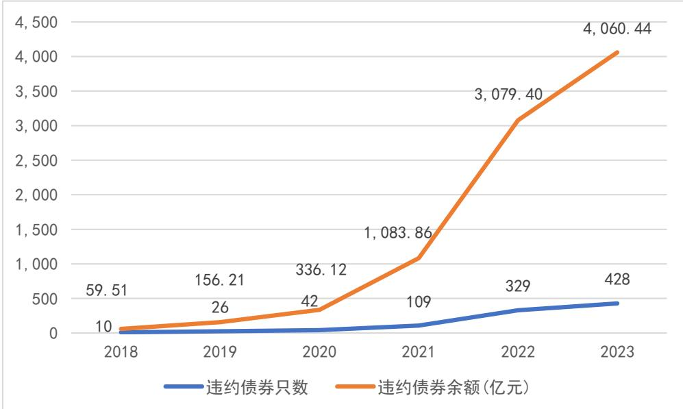
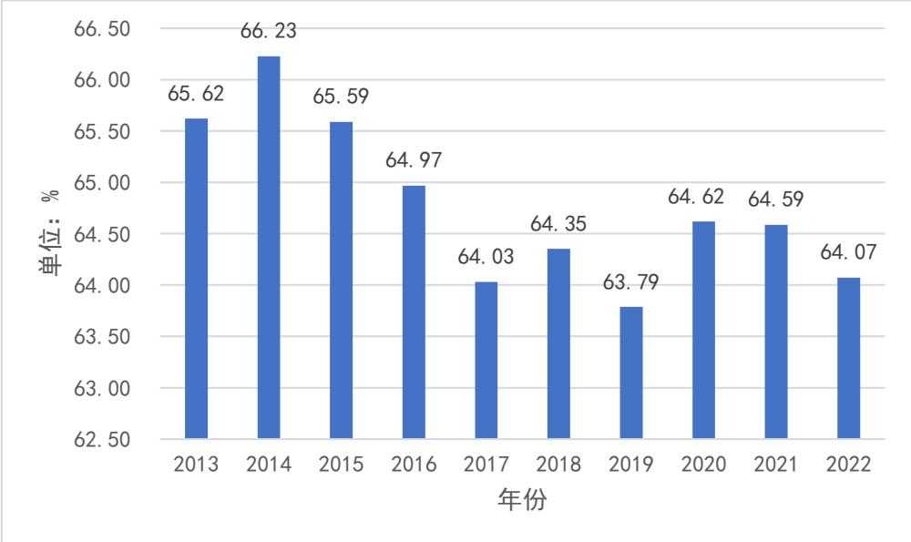
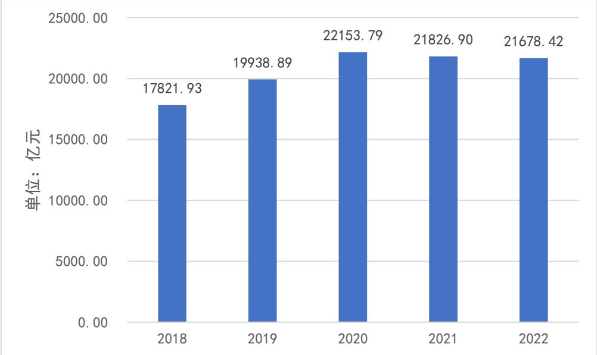
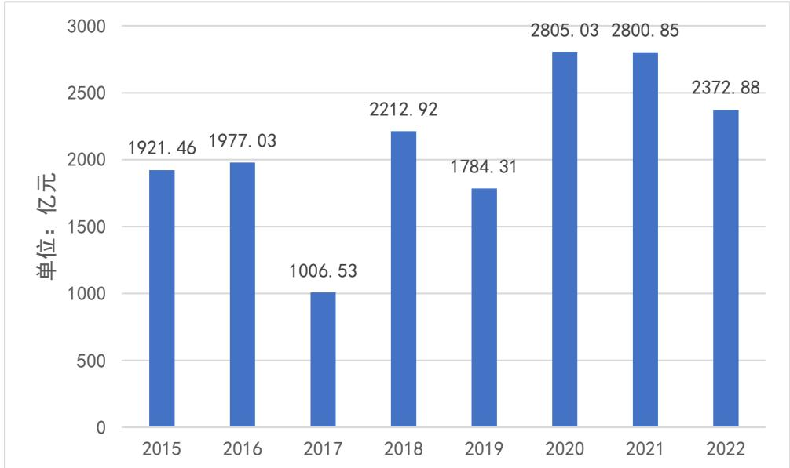
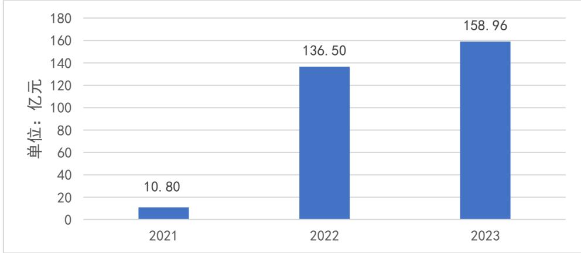
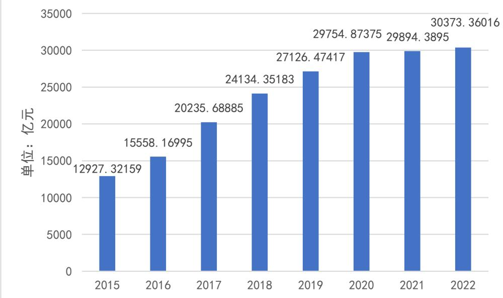
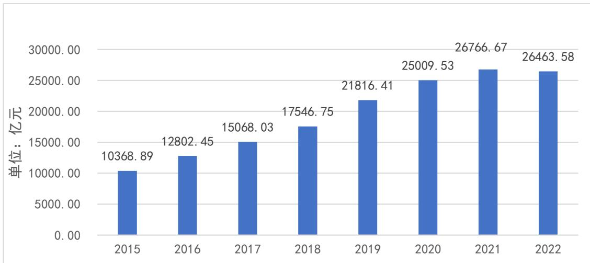
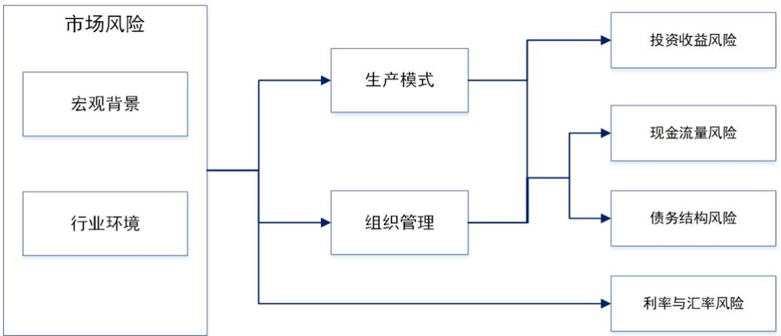
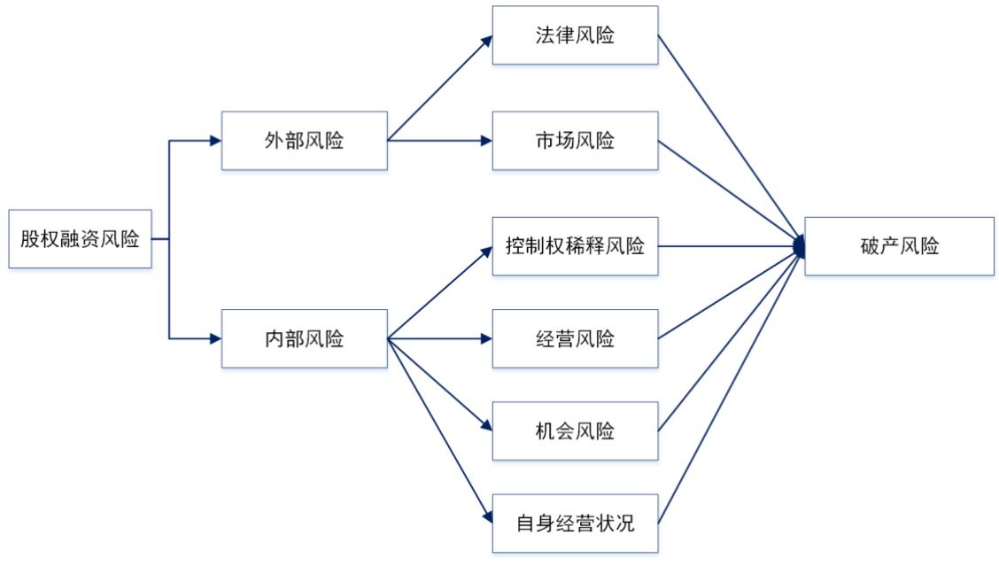

# 第三章 房地产行业融资风险管理现状及要求

# 3.1 房地产行业特征

房地产企业属于资金密集型企业，其牵扯的产业链较长，能够影响到多个经济领域，在各个国家的经济领域中都处于比较特殊的地位。与房地产相关的行业包括但不限于钢铁、水泥、建材、家电、物业管理等多个行业，对整体国民经济具有巨大的拉动作用，对于就业与民生有着特殊意义。在我国普遍存在安土重迁思想，使得房地产成为了一种特殊的刚性需求，让房地产行业成为了一种特殊行业。

# 3.1.1 房地产行业受政策影响较大

房地产行业受政策影响较大，市场波动较大，政府对于土地的审批非常严格，这些都使得房地产业要面临着更高的融资风险，所以付出的融资成本也就更多。除此之外由于不同地区的政策存在区别，各个不同地区的房地产情况也不同，有些地区会进行限购，而另一些地区则会降低购买门槛。所以房地产行业也具有明显的区域性特征。

# 3.1.2 房地产行业整体信用风险上升

房地产行业融资整体依赖自身信用，在债务重压不断加剧的同时，房地产企业的信用风险日益显现。越来越多的房企信用等级被下调，这一趋势愈发明显。根据 Wind 行业分类标准，目前有 194 家房地产企业面临评级预警，其中61 家的评级被调低。这一数字仅次于工业企业（262 家和74 家）和金融行业（219家和64家），成为高信用风险行业的典型代表，具体数据详见表3-1。

表3-12022年典型高信用风险行业  

<table><tr><td>序号</td><td>行业</td><td>合计</td><td>评级调低</td><td>评级展望调低</td><td>评级展望负面</td><td>列入评级观察</td></tr><tr><td>1</td><td>工业</td><td>262</td><td>74</td><td>67</td><td>107</td><td>14</td></tr><tr><td>2</td><td>金融</td><td>219</td><td>64</td><td>64</td><td>85</td><td>6</td></tr><tr><td>3</td><td>房地产</td><td>194</td><td>61</td><td>44</td><td>87</td><td>2</td></tr><tr><td>4</td><td>可选消费</td><td>127</td><td>39</td><td>29</td><td>56</td><td>3</td></tr><tr><td>5</td><td>材料</td><td>77</td><td>22</td><td>24</td><td>28</td><td>3</td></tr><tr><td>6</td><td>公用事业</td><td>75</td><td>19</td><td>21</td><td>35</td><td>0</td></tr></table>

续表3-12022年典型高信用风险行业  

<table><tr><td>序号</td><td>行业</td><td>合计</td><td>评级调低</td><td>评级展望调低</td><td>评级展望负面</td><td>列入评级观察</td></tr><tr><td>7</td><td>日常消费</td><td>69</td><td>17</td><td>24</td><td>27</td><td>1</td></tr><tr><td>8</td><td>信息技术</td><td>68</td><td>23</td><td>21</td><td>24</td><td>0</td></tr><tr><td>9</td><td>医疗保健</td><td>49</td><td>16</td><td>15</td><td>16</td><td>2</td></tr><tr><td>10</td><td>能源</td><td>40</td><td>12</td><td>13</td><td>15</td><td>0</td></tr><tr><td>11</td><td>电信服务</td><td>40</td><td>18</td><td>7</td><td>15</td><td>0</td></tr></table>

数据来源：Wind数据库

在房企信用风险不断攀升的情况下，债券违约的金额依然居高不下。自从2014年“超日债”事件引发公募债券刚性兑付的破裂以来，房地产业已经逐渐成为债券违约的重灾区。到了2021 年，由于一些知名房企如恒大等出现违约行为，房企的融资情况变得更加困难。房地产行业近五年来的债券违约情况逐年上升，无论从信用评级角度还是从债券违约角度来讲房地产企业整体的信用风险正在上升。至 2022 年，329 只房地产债券出现违约，涉及总金额高达 3079.4亿元。

  
图3-1房地产行业近五年债券违约情况  
数据来源：Wind数据库

# 3.1.3 房地产行业依赖举债经营

房地产行业的经营模式大多为举债经营，因为房地产对于资金的需求量大。随着近年来房价的大幅度波动，房地产行业成为了备受关注的焦点议题。房地产业从拿到投标土地开始，到成功将房子销售为止，整个过程中需要大量的资金，竞标一片土地根据土地所处的地方情况，要付出高昂的资金作为代价，在一线城市中价格可以达到几十亿之多。在获得土地之后，设计小区、房屋、室内都需要投入大量资金，在开工建设时还需要采购大量建材，雇佣建筑工人，经历一段时间的建设才能完成。一直到房子成功卖给业主，这一过程都需要大量资金进行支持。因为投入资金巨大，房屋建设需要一定的时间，所以房地产行业存在很大的风险，容易出现资金断裂的情况。为了让资金周转更加顺利，房地产企业往往会采用特殊的融资方式，一般情况下房地产企业会尽量使得资金来源多样化，通过多个渠道获得资金。除了通过银行进行贷款之外，还会利用信托、债券等多种手段进行筹款。房地产行业整体的资产负债率都很高如图3-2 所示，从2016年开始，稳定在 $64 \%$ 上下浮动，比较接近政策上的第一条“红线” $70 \%$ 的标准。由于当前政策导向对市场有利好的趋势，房地产企业目前资金需求量有很大，这就使得资产负债率进一步上升，房地产行业的成本和收入确认具有特殊性，会计角度确认收入的时点要远远晚于商品房预售计入业绩的时点，加大了企业的资本运营压力。

  
图3-2房地产行业平均资产负债率  
数据来源：Wind数据库

# 3.2 房地产行业融资的主要渠道

# 3.2.1债权融资

通过银行贷款进行融资是房地产企业的一种债权融资渠道，也是目前房地产企业首选的债权融资渠道，其中包括有开发贷款和按揭贷款。在整个地产项目的运营过程之中，银行贷款以多种方式存在，从融资总额来看，房地产企业目前较为依赖银行贷款。另外一大主要资金来源是客户的购买资金也就是房地产企业的销售收入，但目前很多买房人都会进行按揭贷款，以此来交齐购买房屋所需的资金，所以银行对于房地产行业的融资是一个重要的渠道。从图 3-3中可以看到，房地产上市公司的整体银行贷款数量从 2020 年开始一直保持较高的规模。

  
图3-3上市公司银行贷款余额  
数据来源：Wind数据库

房地产企业还可以通过发行债券的方式进行债权融资，以一种相对较低的成本获得稳定的资金来源，房地产企业确定债券发行计划，依据这一计划来向投资人发行债券，定期支付利息到期还付全部本金。在债券发行过程之中，房地产公司会受到相关法律的约束，综合考虑债券的评级情况，控制自身企业的风险情况，让企业的债券评级提升，这样投资者会更愿意进行购买。房地产企业需要考虑债券的种类、期限、利率、发行方式等因素。在选择债券种类时，房地产企业需要根据自身的实际情况来决定。从债券发行的情况来看，房地产行业发行债券的情况一直处于波动状态，在2020 年达到峰值，并在“三道红线”的影响下，逐年下降，如图3-4所示。

  
图3-4上市公司债券发行明细  
数据来源：Wind数据库

在环保理念日益受到重视的当下，政府为了进一步提升企业的环保意识，推出了绿色债券这一重要融资手段。绿色债券，如其名称所示，是指将募集的资金专门用于支持符合规定条件的绿色产业、绿色项目或绿色经济活动的有价证券。根据法定的发行条件和约定的还本付息条款，绿色债券成为了一种具有固定收益性质的证券融资方式。通过发行不同类型的绿色债券，不仅可以促进绿色产业的发展，还可以为企业提供稳定的融资渠道，从而实现经济与环境的和谐共生。这些债券的发行有助于推动绿色经济的发展，降低碳排放，缓解气候变化的影响。如果房地产企业能够保证使用的建材符合绿色材料标准，应用可再生材料，物流过程绿色环保。或者对已有建筑进行绿色改造，都可以利用绿色债券进行融资。

  
图3-5房地产行业绿债发行规模

如图 3-5可知自从21年开始，房地产绿色债券发行数量逐渐上升，由于“三道红线”的政策对房地产行业整体的资产负债率要求较高，导致企业融资空间很小，但绿债的数量并不计入“三道红线”对于资产负债率的要求内，这给了企业很大的融资空间。目前绿色债券在国内的发行方式及相关政策相比国外市场较为宽松，在用于环保项目的判定上，国内的范围会更大，这就意味着更多的项目可以认定为绿色债券支持的项目。但对于企业绿色债券融资的使用监督较为严苛，企业需每个季度向外界披露该笔资金的用途，而普通的债券只需要半年披露一次。

综合来看，房地产行业的整体债权融资的规模是逐年增大的，从图3-6房地产债务资本可以看出，从 2015 年开始，房地产通过债权融资取得的资金就逐年上升，直至 2021年开始，总体规模趋近稳定，但仍处于上升的态势，房地产行业对于债权融资的需求还在不断增加。

  
图3-6房地产行业债务资本  
数据来源：Wind数据库

# 3.2.2 股权融资

股权融资也是一种房地产企业的主要融资渠道，通过上市或私募股权等方式进行融资，可以增加企业的资本金，提高企业的财务稳健性。通过这种融资渠道，可以很快提升企业的融资规模。而一家企业获得上市资格，也会给企业带来很高的知名度。在我国房地产企业想要进行股权融资，主要是通过A股IPO 新发上市来进行股权融资。如图 3-7 所示，A股房地产行业上市公司数量在不断减少，但通过股权融资得到的资金却呈现上升的趋势，从图 3-8可以看出在2021年达到峰值后，2022 年有所回落。选择股权融资企业的增长趋势在减小，但总体选择股权融资的企业数量还在上升，并且总体的股权融资规模也较大。

  
图3-7房地产行业上市公司数量

  
数据来源：Wind数据库  
图3-8房地产行业股权资本  
数据来源：Wind数据库

除了上述的两类融资方式之外，房地产企业还可以通过选择内源融资的方式进行融资。其具体方式包括企业折旧资金、未分配利润、企业盈余公积等等，此种方式的风险较小，但房地产行业的融资规模较大，内源融资很难满足房地产企业的融资需求。

# 3.3 房地产行业融资渠道的风险

就房地产行业的融资考虑，股权融资和债权融资的资金来源均为投资者的储蓄。投资者的投资风险和收益的偏好程度决定了企业外源融资的方式和金额。

风险偏好型的投资者致力于获取高收益；反之，风险厌恶型的投资者则倾向于选择稳定的收益。股权投资被视为一种相对高风险的投资方式，而债权投资的风险性则相对较低，是一种较为稳健的投资方式。因此，股权融资的方式倾向于筹集到风险偏好投资者的资金；债权融资的方式则倾向于筹集到风险规避投资者的资金。在资本成本理论的背景下，企业需要通过股权与债权相结合的融资方式，来进行外源融资以达到融资规模的最大化。

# 3.3.1 债权融资的风险

（1）在债权融资的银行贷款中，利率风险指还款期内企业的银行贷款面临利率上涨的风险。企业可以通过选择利率固定的贷款，以避免利率波动对企业带来的影响，从而规避利率风险。同时，诸如利率互换的金融工具也可以用来对利率风险的影响进行对冲。信用风险是指作为贷款方的企业无法按时归还借款本息的风险。企业应当在申请贷款前评估自身信用状况，并确保现金流足够支付贷款，制定合理的还款计划，避免还款逾期。

（2）在债券融资方面对于房地产企业而言，市场环境中的宏观行业竞争和企业内部的生产模式和组织管理决定了企业融资风险的大小。市场环境中的金融环境决定了外汇汇率风险和市场利率风险。企业的生产模式决定了企业的投资收益风险，就房地产企业而言，大量处于待售阶段的楼盘是企业投资收益风险的代表性体现，导致企业的收益不足以偿还债务。房地产企业的组织管理和行为决定了企业的债务结构风险和现金流量风险，房地产企业的大量融资可能导致某一个时点的高负债，致使企业现金流断裂以至于不能偿还企业的债务。

  
图3-9债券融资风险

# 3.3.2 股权融资的风险

股权融资的风险主要包括法律风险、控制权稀释风险、机会风险、经营风险以及市场风险。在股权融资过程中，企业需密切关注国家对并购和外汇的严格监管规定，以降低法律风险。控制权稀释风险是股权融资中另一个重要问题，投资方获得股份可能导致原股东的控制权被稀释，甚至可能失去对企业的实际控制。在股权融资决策过程中，企业需充分考虑机会风险，以免错过其他更优的融资方式如内源融资和债权融资等。同时，还需注意经营风险，当创始股东与投资方股东在战略和经营管理方式上产生重大分歧时，可能会给企业经营决策带来困难。此外，市场风险也是股权融资中不可忽视的一个因素，近年来出台的三道红线政策以及国内市场的竞争环境等因素都可能对企业的股权融资产生影响。

  
图3-10股权融资风险

# 3.4 房地产行业融资风险管理流程

# 3.4.1 房地产行业融资风险识别

通常将企业的风险识别过程定义为对风险的辨识和风险成因进行剖析，据此可以分为内部风险和外部风险。历史数据分析法可以被用来进行风险识别，一般来说，历史数据法是利用网络对信息展开研究，并借鉴有关的经验，对可能存在的风险进行识别。在运用这一技术时，要注意对所收集到的历史资料是否充分、是否真实，这样才能更加完整、更加精确地对企业的经营情况、信用情况等进行风险辨别。风险调查列举法通常由企业的风险管理人员执行，目的是全面识别企业或单位可能面临的各种风险，将所识别的风险进行分类。在实施这一方法时，专家应具备广泛的背景和经验，以确保其观点和见解具有代表性。通常分类标准包括直接风险或间接风险、财务风险或非财务风险，以及政治方面或经济方面等。这些标准有助于更全面地评估风险的性质和潜在影响，从而为企业或单位提供有针对性的风险管理策略。

# 3.4.2 房地产行业融资风险评估

在财务风险评估中，熵值法和功效系数法得到了广泛的应用，该方式同样适用于融资风险评估。通过利用熵值法构建评估模型，可以获得比其他评估方法更为精确的结果，精确度高达 $80 \%$ 以上。在数据不充分的情况下，熵值法能够最大限度地利用现有有限数据，得出客观的评估结果。相比之下，功效系数法不仅客观，而且具有较强的可操作性，能够得出明确的结论。

# 3.4.3 房地产行业融资风险控制

根据上文的总结可以发现，当前房地产行业的风险可以分为外部风险与内部风险，对于外部风险企业应及时掌控房地产相关的政策包括融资、投资等等各方面的信息，及时根据政策导向进行融资策略的调整。同时也应有单独的风险管理部门关注当前的市场环境，根据市场环境判断当前融资规模是否合理，借助大数据以及云计算方式统计购买者对于不同地区的消费需求，从定性的角度出发并从量化的角度观察，从而得出客观的评价结果。对于内部风险应设立相关的风险监控委员会对于融资风险进行整体的把控，可以通过人才招聘、人才培养等方式提高自身的管理水平，制定严密的资金监管流程。风险控制的成功取决于信息的充足性。许多企业在数据管理方面存在缺陷，这往往成为风险管理的重大阻碍。只有全面且有效地建立健全的风险信息系统，才能做到及时对风险进行识别、准确评估风险并反馈结果。企业可以在信息系统基础上设立预警机制，制定由风险识别部门整理的预警指标体系及其值域和临界点，以便迅速捕捉风险迹象。对于风险评估选出的存在风险的指标，预警机制能提醒决策者和管理者及时采取防范和化解措施。同时，强化各部门之间的协同交流与信息反馈，确保各个层级员工均对风险管理体系的相关内容及其运作方式有所了解。

# 3.5 房地产行业融资风险管理要求

我国对于房地产企业融资风险的管理办法，主要由发改委、城乡建设部等部门提出，以帮助企业进行合理融资，降低融资风险。具体情况如表3-2 所示，具体包含融资风险识别、融资风险评估、融资风险控制。

表3-2房地产行业融资风险政策  

<table><tr><td rowspan="2">文件名</td><td rowspan="2">发布时间</td><td rowspan="2">发布单位</td><td colspan="2">主要内容</td></tr><tr><td>风险识别 风险评估</td><td>风险控制</td></tr><tr><td>《房地产 企业财务 风险管理 指引》</td><td>2013年 9月19日</td><td>财政部</td><td>要求房地产企业建立和完善财务风险 管理机制，包括对内源融资风险的识 别、评估和控制。建立健全财务风险 管理机制，有效识别和控制内源融资 风险。</td><td></td></tr><tr><td>《关于房 地产企业 上市申请 再融资有 关问题的 通知》</td><td>2019年 9月20日</td><td>中国证券监 督管理委 员会</td><td></td><td>要求房地产企业 在申请再融资 时，要充分考虑 市场风险、融资 风险等，并制定 合理的融资计 划。要求企业制 定合理的融资计 划，降低再融资 风险。</td></tr><tr><td>《关于加 强房地产 企业融资 管理的通 知》</td><td>2003年 6月5日</td><td>住房和城乡 建设部、人 民银行、银 监会</td><td>要求房地产企业加 强债务融资管理， 防范和控制债务融 资风险，稳定市场 预期。加强债务融 资管理，降低债务 违约风险。</td><td></td></tr><tr><td>《关于规 范房地产 市场外资 准入和管 理的意 见》</td><td>2006年 7月11日</td><td>建设部、商 务部、发改 委、人民银 行、工商总 局、外汇局 联合发布</td><td>对外资进入房地产 市场进行了规范， 包括对债务融资风 险的识别和控制。 规范外资债务融资 活动，降低外债风 险。</td><td></td></tr><tr><td>《关于规 范金融机 构房地产 业务的通 知》</td><td>2003年 9月19 日</td><td>中国人民银 行、银监会 发布</td><td>1.强调房地产行 业债务融资风险 防控；2.规范金 融机构房地产贷 款管理；3.限制 房地产企业过度 融资；4.强化风 险评估和监控。</td><td></td></tr></table>

续表3-2房地产行业融资风险政策  

<table><tr><td rowspan="2">文件名</td><td rowspan="2">发布时间</td><td rowspan="2">发布单位</td><td colspan="3">主要内容</td></tr><tr><td>风险识别</td><td>风险评估 1.要求房地</td><td>风险控制</td></tr><tr><td>《关于房 地产市场 平稳健康 发展的若 干意见》</td><td>2010年 1月7日</td><td>住房和城 乡建设 部、国土 资源部、 财政部、 人民银 行、银监 会、税务 总局、工 商总局联 合发布</td><td></td><td>产企业降低 债务风险； 2.限制房地 产企业高息 融资；3.强 化房地产企 业偿债能力 评估；4.规 范房地产市 场秩序</td><td></td></tr><tr><td>《关于防 范化解房 地产市场 风险的指 导意见》</td><td>2011年 9月15日</td><td>住房和城 乡建设部</td><td></td><td>1.提出房地 产市场风险 防范化解总 体要求；2. 规范房地产 企业融资行 为；3.强化 房地产企业 债务风险管 理；4.完善 房地产市场 监管体系</td><td>1.要求房地产企业加 强内部管理，降低杠 杆率；2.限制房地产</td></tr><tr><td>《关于加 强房地产 市场监管 工作的通 知》</td><td>2020年 11月3日</td><td>住房和城 乡建设部</td><td></td><td></td><td>企业过度融资；3.加 强房地产市场监管， 规范市场秩序；4.推 动房地产企业转型升</td></tr><tr><td>《关于促 进房地产 市场平稳 健康发展 的通知》</td><td>2017年 9月8日</td><td>住房和城 乡建设 部、国土 资源部、 财政部、 人民银 行、银监 会联合发 布</td><td></td><td></td><td>级，降低经营风险 1.要求房地产企业加 强内源融资风险控 制；2.推动房地产企 业提高自有资金比 例；3.规范房地产企 业预售资金和销售回 款管理；4.强化房地 产市场监管，防范化 解市场风险</td></tr></table>

续表3-2房地产行业融资风险政策  

<table><tr><td rowspan="2">文件名</td><td rowspan="2">发布时间</td><td rowspan="2">发布单位</td><td colspan="3">主要内容</td></tr><tr><td>风险识别</td><td>风险评估</td><td>风险控制</td></tr><tr><td>《关于房 地产企业 债务融资 管理的通 知》</td><td>2006年 12月23日</td><td>住房和城 乡建设 部、发改 委、人民 银行、银 监会联合 发布</td><td></td><td>1.要求房地产企业 加强债务融资管 理；2.规范房地产 企业债务融资行 为；3.限制房地产 企业过度债务融 资；4.强化债务融 资风险评估和监控</td><td></td></tr><tr><td>《关于房 地产企业 股权融资 管理的通 知》</td><td>2015年 11月25日</td><td>住房和城 乡建设 部、国土 资源部、 财政部</td><td></td><td></td><td>1.要求房地产企业 加强股权融资管 理；2.规范房地产 企业股权融资行 为；3.严格控制房 地产企业杠杆率；4. 推动房地产企业转 型升级，降低经营 风险。</td></tr><tr><td>《关于支 持房地产 企业股权 融资的通 知》</td><td>2018年 11月25日</td><td>中国 证监会</td><td></td><td></td><td>1.支持房地产企业 在资本市场进行股 权融资；2.规范房 地产企业股权融资 行为；3.严格控制 房地产企业杠杆 率；4.推动房地产 企业转型升级，降 低经营风险</td></tr><tr><td>《关于加 强房地产 企业股权 融资管理 的通知》</td><td>2006年 12月23日</td><td>住房和城 乡建设 部、发改 委、人民 银行、银 监会联合 发布</td><td></td><td></td><td>要求房地产企业加 强股权融资管理， 防范控制股权融资 风险，稳定市场预 期。加强股权融资 管理，降低股权投 资风险。</td></tr></table>

经整理得到房地产融资风险管理流程与要求后，本文将结合滨江集团目前的融资风险管理情况分析其不足之处并提出相应的对策。