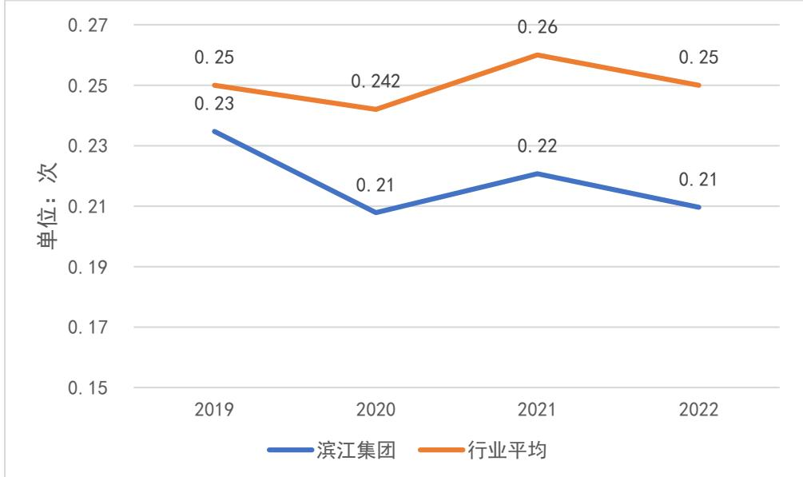
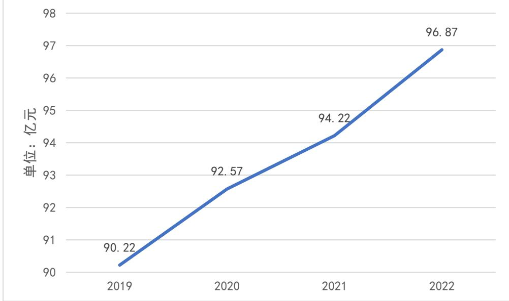
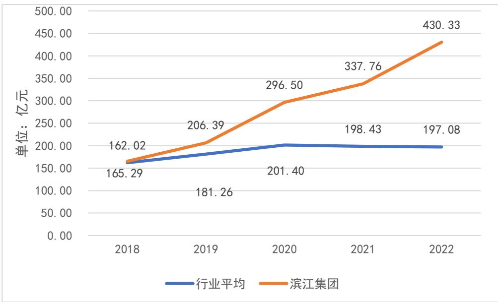
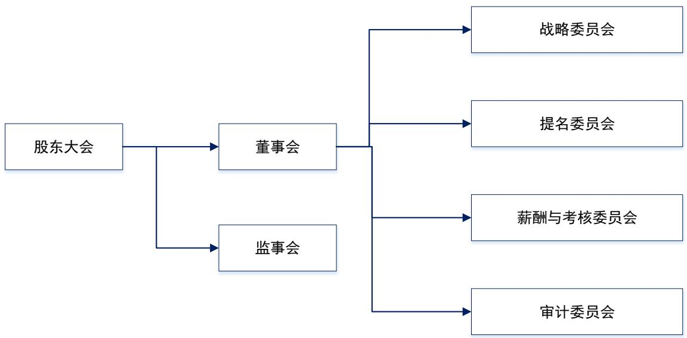
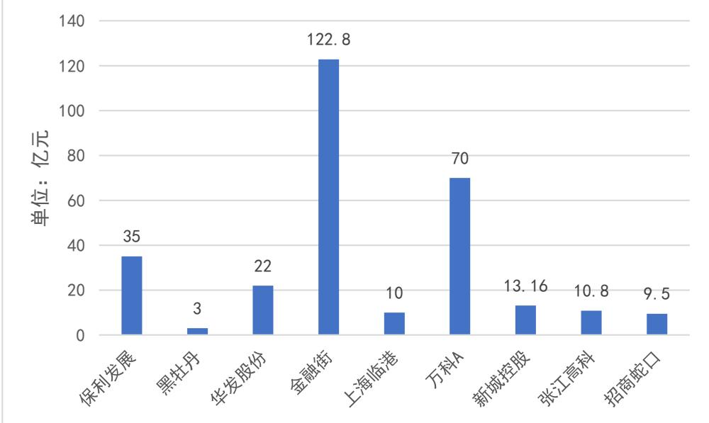
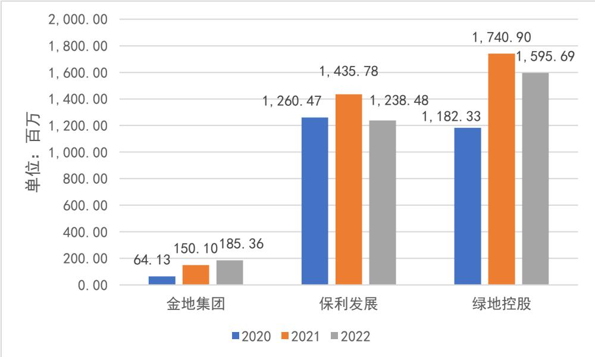
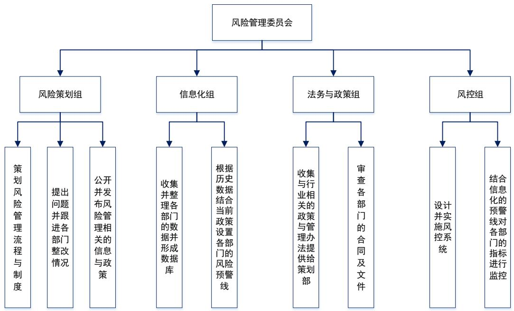
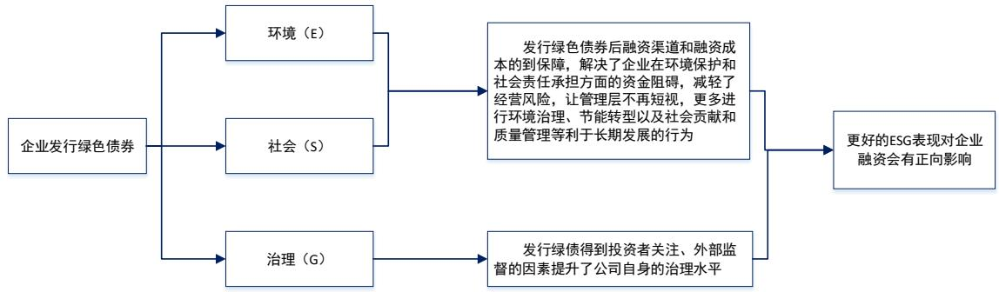

# 第四章 滨江集团融资风险管理问题分析

# 4.1 滨江集团公司简介及融资模式分析

# 4.1.1 滨江集团公司简介

杭州滨江房产集团股份有限公司（以下简称滨江集团）是一家成立于1992年的民营企业。目前，滨江集团的主营业务是房地产，同时涉及与房地产相关的行业。公司最主要的开发项目为商品住宅楼，公司以长三角为业务核心区，累计开发了商品房项目278个，共有5000 万平方米的土地被滨江集团开发，公司开发的金色海岸、武林壹号、万家花城、金色黎明等项目成为了公司的名片，也成为了当地商品住宅的范例。公司开发的楼盘由于地处长三角地区售价较高，所以滨江集团为其开发的楼盘项目进行了专门设计，体现了小区的品质。楼盘强调配套设施的全面，建筑用材优质，房屋销售人员服务专业水平高，给业主一个良好的购房与住房体验。滨江集团的足迹已经涉及到了长三角地区的 50 多个城市，但发展的重点仍然是公司的总部所在地杭州，公司一半以上的项目仍然是在杭州。滨江集团正努力向杭州周边地区拓展业务，对于宁波、温州等经济情况较好的地区是公司的重点开拓目标，公司 $2 5 \%$ 的项目落地于这些浙江省内的二线城市。同时，滨江集团也在寻求向上海、江西、江苏等邻近省市拓展业务，近几年成功开发了一些商业楼盘，取得了不错的回报。

滨江集团的融资情况在近年来表现良好，根据统计数据显示截止到 2023 年12 月，滨江集团股权融资余额达到 2.52 亿元，11月的日均买入额度为0.12 亿元，这一数据在沪深股市中名列前茅，体现了投资人对于滨江集团的认可。自“三道红线”政策出台以来，滨江集团均处于绿线的状态，没有超过限制标准。近几年受疫情影响很多企业的盈利状况受到了影响，滨江集团也不例外，虽然从营业收入来看逐年增高，但其净利润自2019 年到 2022 年期间经历了上下波动，目前2022年为下降的趋势。

表4-12019 年-2022 年滨江集团经营状况  

<table><tr><td>年份</td><td>营业收入（亿元）</td><td>营业成本（亿元）</td><td>净利润（亿元）</td></tr><tr><td>2019</td><td>249.55</td><td>161.96</td><td>39.73</td></tr><tr><td>2020</td><td>285.97</td><td>208.63</td><td>35.48</td></tr><tr><td>2021</td><td>379.76</td><td>285.47</td><td>49.21</td></tr><tr><td>2022</td><td>415.02</td><td>342.49</td><td>39.04</td></tr></table>

数据来源：Wind数据库

# 4.1.2 滨江集团融资方式分析

滨江集团融资方式主要包括内源融资与外源融资，内源融资包括自有资金、应付账款与预收账款，外源融资包括债权融资的银行贷款与发行债券及股权融资。

# （1）自有资金

滨江集团的自有资金主要来自于企业自身积累的资金，是企业拥有并可自由支配的资金，包括公司利润、自有资本等，是房地产企业发展的重要支撑。滨江集团2018-2022年自有资金数据统计见下表4-2。

表4-22018年-2022年滨江集团自有资金  

<table><tr><td></td><td>2018</td><td>2019</td><td>2020</td><td>2021</td><td>2022</td></tr><tr><td>实收资本（亿元）</td><td>31.11</td><td>31.11</td><td>31.11</td><td>31.11</td><td>31.11</td></tr><tr><td>资本公积 （亿元）</td><td>23.09</td><td>21.98</td><td>21.65</td><td>21.81</td><td>21.00</td></tr><tr><td>盈余公积（亿元）</td><td>9.98</td><td>10.75</td><td>11.37</td><td>11.97</td><td>15.16</td></tr><tr><td>未分配利润（亿元）</td><td>87.89</td><td>101.72</td><td>120.22</td><td>142.94</td><td>170.26</td></tr><tr><td>所有者权益合计（亿元）</td><td>193.14</td><td>224.12</td><td>280.45</td><td>373.87</td><td>527.17</td></tr></table>

数据来源：Wind数据库

根据表4-2，滨江集团自有资金数据统计分析可以看出，企业的自有资金自2018 年至2022 年呈持续增加趋势，说明公司在不断发展，利润亦呈现出稳步增长的态势，然而滨江集团目前的自有资金尚不足以支撑大型房地产项目的全面开发。为确保企业持续稳健的发展，集团需要积极探索并借助多元化的融资方式，以满足项目开发对资金的需求。

# （2）应付账款

应付账款指的是企业在采购商品或接受服务后，所产生的尚未支付的费用，它是内源融资的一种表现形式。滨江集团 2018-2022 年应付账款数据统计见下表4-3所示:

表4-32018 年-2022 年滨江集团应付账款  

<table><tr><td></td><td>2018</td><td>2019</td><td>2020</td><td>2021</td><td>2022</td></tr><tr><td>应付账款 （亿元）</td><td>26.18</td><td>31.67</td><td>42.04</td><td>34.11</td><td>36.99</td></tr><tr><td>负债总额 （亿元）</td><td>682.38</td><td>1072.13</td><td>1439.71</td><td>1743.39</td><td>2234.59</td></tr><tr><td>应付账款占负债比（%）</td><td>3.84%</td><td>2.95%</td><td>2.92%</td><td>1.96%</td><td>1.66%</td></tr></table>

数据来源：Wind数据库

分析上表可以看出，虽然滨江集团近五年应付账款呈上升趋势，但应付账款在总负债中的占比有所下降，从2018年的 $3 . 8 4 \%$ 降低至2022年的 $1 . 6 6 \%$ 。这一变化表明公司在近年来可能正在增加其他类型的融资方式。

# （3）预收款项

预收账款指的是在购房时企业预先向购房者收取的资金，是企业的负债。滨江集团在 2018-2022 年的预收账款、合同负债数据统计见表4-4。

表4-4 2018年-2022 年滨江集团预收账款  

<table><tr><td></td><td>2018</td><td>2019</td><td>2020</td><td>2021</td><td>2022</td></tr><tr><td>预收账款（亿元）</td><td>252.47</td><td>555.96</td><td>0.39</td><td>0.60</td><td>0.42</td></tr><tr><td>负债总额（亿元）</td><td>682.38</td><td>1072.13</td><td>1439.71</td><td>1743.39</td><td>2234.59</td></tr><tr><td>预收账款占负债比（%）</td><td>37.00%</td><td>51.86%</td><td>0.03%</td><td>0.03%</td><td>0.02%</td></tr></table>

数据来源：Wind数据库

表4-52018年-2022年滨江集团合同负债  

<table><tr><td></td><td>2018</td><td>2019</td><td>2020</td><td>2021</td><td>2022</td></tr><tr><td>合同负债（亿元）</td><td>0.00</td><td>0.00</td><td>728.14</td><td>935.71</td><td>1303.62</td></tr><tr><td>负债总额（亿元）</td><td>682.38</td><td>1072.13</td><td>1439.71</td><td>1743.39</td><td>2234.59</td></tr><tr><td>合同负债占负债比（%）</td><td>0</td><td>0</td><td>50.58%</td><td>53.67%</td><td>58.34%</td></tr></table>

数据来源：Wind数据库

根据表4-4与4-5可以看出，由于会计准则的变化，合同负债从2020年开始被计入，且滨江集团 2018 年至2022 年预收款项于合同负债总额逐年增多，但总体趋势稳定。此外预收账款、合同负债占负债总额的比例近年来维持在 $50 \%$ 左右，数额占负债整体资金较大。

# （4）股权融资

股权融资是指企业通过发行股票的方式，吸收股东的资金来实现企业发展和扩大经营规模的资金筹集方式。当企业面临资金压力大、自有资金等内源融资方式和债权融资难以达到资金需求或企业发展目标的需要时，可以通过股权融资可以迅速的筹集到大量资金，与此同时，股权融资还可以帮助公司完成资本结构的多元化，有效的分散公司的融资风险。截止 2023 年年末，滨江集团总股本31.11亿股，其中已上市流通A股 26.82亿股。

# （5）银行借款

项目建设需要筹集大量的资金，银行贷款是房地产企业获取资金最重要的渠道，滨江集团的主要融资渠道也是银行借款，滨江集团 2018-2022 年银行借款数据统计见表4-6。

表4-62018年-2022 年滨江集团银行借款  

<table><tr><td></td><td>2018</td><td>2019</td><td>2020</td><td>2021</td><td>2022</td></tr><tr><td>银行借款余额（亿元）</td><td>165.29</td><td>206.39</td><td>296.50</td><td>337.76</td><td>430.33</td></tr><tr><td>负债总额（亿元）</td><td>682.38</td><td>1072.13</td><td>1439.71</td><td>1743.39</td><td>2234.59</td></tr><tr><td>银行借款余额占比（%）</td><td>24.22%</td><td>19.25%</td><td>20.59%</td><td>19.37%</td><td>19.26%</td></tr></table>

数据来源：Wind数据库

根据上表可知，滨江集团的银行借款呈现逐年上升趋势，占负债总额的比例相对稳定在 $20 \%$ 左右，由此可见，滨江集团对银行借款的依赖是比较大的。

# （6）债券融资

相较于股票融资，债券融资在财务上具有诸多优势，债券融资可以帮助缓解企业的资金压力，因此在资本市场上债券融资往往更受企业的青睐。从表 4-7可以看出，滨江集团在2018 年至2022 年间，应付债券占负债总额的比例明显呈逐年下降趋势，结合银行贷款来看，企业应更多选择债券融资的形式以分散风险。

表4-72018年-2022 年滨江集团应付债券  

<table><tr><td></td><td>2018</td><td>2019</td><td>2020</td><td>2021</td><td>2022</td></tr><tr><td>应付债券 （亿元）</td><td>77.86</td><td>58.81</td><td>48.78</td><td>69.51</td><td>39.95</td></tr><tr><td>负债总额（亿元）</td><td>682.38</td><td>1072.13</td><td>1439.71</td><td>1743.39</td><td>2234.59</td></tr><tr><td>应付债券比例（%）</td><td>11.41%</td><td>5.49%</td><td>3.39%</td><td>3.99%</td><td>1.79%</td></tr></table>

数据来源：Wind数据库

# 4.2 滨江集团融资风险识别的不足

《企业内部控制基本规范》中指出：企业在进行外部风险识别时，应当关注产业政策、融资环境、市场竞争等经济影响因素。下面主要按照股权与债权两大融资渠道，对融资风险的外部风险识别的不足进行分析。目前滨江集团的融资风险识别的程序上较为严谨，不足主要体现在方法上。

# 4.2.1 股权融资风险识别的不足

滨江集团在进行股权融资风险识别时，存在对外部环境中市场购买力的情况评估不足的问题，因此缺乏足够的风险意识，具体体现在对未来的情况盲目乐观与对自身存货周转关注不够。通过研究企业公布的消息，如表4-8 所示，可以发现，企业所讨论的议题基本围绕着房地产市场不断发展这一前提所进行。基本没有涉及到市场衰退这一话题，使得企业在2019-2022 年盲目乐观扩大股权融资规模。但在当时房地产市场是存在衰退风险的，近年来很多地区的房价出现了幅度较大的下跌，长三角地区的人口虽然整体呈现上涨态势，但受特殊情况影响例如疫情的影响，人们的平均收入有所减少，购房意愿持续降低，这些都使得房产市场的风险不断提升。从滨江集团的存货周转情况来看滨江集团的存货周转率从 2019 年开始始终低于行业平均，如表 4-9 所示，造成这种情况的原因在于房地产行业的特殊性，每年都会有公司出现极端情况拉高行业平均值。在此情况下，可以选择中位数与滨江集团的存货周转率进行比较如图 4-1所示，滨江集团不仅低于行业平均水平，还低于行业的中位数，说明滨江集团在2019 年到 2022 年的存货周转情况并不好，对于市场端的供需情况判断有偏差。

滨江集团在此情况下应当考虑减小股权融资的规模，以此，来应对当前可能产生的市场衰退。相比于债权融资，股权融资的资本成本负担较重，可能为企业带来更加严重的困难，应当更加谨慎的对待。2023 年开始政策有所回调，随着需求增加企业应扩大融资规模，但滨江集团在政策紧缩期 2019-2022 年的融资决策是有风险的，从企业释放乐观消息过多这一行为可以看出，滨江集团希望投资者对于公司的前景有一个较好的估计，但这样会造成投资者期望过高，企业对于投资人的期望管理不足，缺乏足够的沟通，这会对企业融资产生影响，在企业无法满足投资人过高的预期时，投资人会产生强烈的不满情绪，进而对企业的声誉产生负面影响。企业应加强对市场走势与自身存货周转情况的关注，以加强对风险的防范。

表4-82018-2022 年滨江集团关于地产行业发展趋势的评估情况  

<table><tr><td></td><td>2019</td><td>2020</td><td>2021</td><td>2022</td></tr><tr><td>乐观估计次数（次）</td><td>28</td><td>19</td><td>19</td><td>20</td></tr><tr><td>悲观估计次数（次）</td><td>2</td><td>4</td><td>4</td><td>6</td></tr></table>

数据来源：券商机构报道整理所得

表4-9存货周转率与行业平均值对比  

<table><tr><td></td><td>2019</td><td>2020</td><td>2021</td><td>2022</td></tr><tr><td>滨江集团 （亿元）</td><td>0.23</td><td>0.21</td><td>0.22</td><td>0.21</td></tr><tr><td>行业平均 （亿元）</td><td>9.54</td><td>5.11</td><td>5.35</td><td>11.76</td></tr></table>

数据来源：Wind数据库

  
图4-1存货周转率与行业中位数对比（单位：亿元）  
数据来源：Wind数据库

# 4.2.2 债权融资风险识别的不足

滨江集团银行贷款情况如图4-2 所示，2022 年企业的银行贷款为 96.87亿元，从表中近4 年的数据可以看出企业的银行贷款数量不断上升，上升幅度虽然不大但一直在增加。面对 2019-2022 年不断走低的房地产市场与较大的融资约束，滨江集团仍然在增加贷款金额，这一策略体现了企业对于贷款利率以及宏观政策风险识别的缺失。在这样的背景下仍然需要提高银行贷款的数额，可能是由于企业经营情况所造成的后果，也可能是由于资金的使用不当所产生的影响。从上文对于滨江集团发展历史的介绍可以得知，滨江集团立足于长三角地区，以杭州为中心拓展其业务范围。目前企业正在向更多的地区拓展业务，就需要更多的资金支持，贷款融资也成为了企业解决资金问题的一种手段。而2019-2022 年的市场情况不适于拓展业务，新开发的楼盘很可能由于回收资金不足导致烂尾，这些情况对于企业会产生严重危害。银行贷款如果无法按期偿还会影响企业的信用记录，滨江集团因为贷款融资风险识别不足出现违约情况，会对企业未来的获得贷款能力产生负面影响。而且在目前市场利率上升的背景下，增加银行贷款数额本身就是对于贷款融资风险识别不足表现。

同时还应考虑浮动利率的风险，在目前楼市趋冷的背景之下，企业存在大量的债券融资余额，对于经营活动负面影响较大。企业很可能出现现金流下降，导致无法按期还债，产生债务融资风险。我国的利率整体呈现波动态势，2022年由于特殊因素，政府为提振经济推出了较为宽松的经济政策，市场利率较低，债券融资的成本也有所降低。随着 2023 年第二季度以来经济恢复情况较好，内生动力不断增强。利率情况开始恢复正常水平，企业债券融资的成本不断提高，相较于 2022 年企业进行债券融资的成本有所上升。随着国民经济的进一步恢复，为防止出现经济过热，国家有可能进一步提高市场利率，而滨江集团明显没有准备应对这一局面。说明企业对于目前的国家经济态势缺乏全面客观的评估，对于债权融资在未来所面临的利率波动风险识别不足。

  
图4-2滨江集团银行贷款数额（单位：亿元）  
数据来源：Wind数据库

从整体行业来看亦是如此，如图4-3所示，滨江集团近五年的银行贷款余额均高于行业平均水平，行业平均水平在2020 年受到“三道红线”政策的影响有所下降，并逐渐保持平稳，但滨江集团还处于稳步上升的趋势，说明该部分风险还应更加重视。

  
图4-3 滨江集团银行贷款余额与行业对比  
数据来源：Wind数据库

# 4.3 滨江集团融资风险评估的不足

房地产企业融资风险评估过程复杂，着手点较为宽泛，需要探索、识别并比较不同的风险点位。准确地把握和分析风险是更好地识别和控制风险的前提，而风险点位需要从多个角度去考虑，将风险的识别、风险后果以及风险带来的影响程度进行全面分析。风险评估是房地产企业融资风险管理的关键环节，它的效用可以从风险评估的决策与风险评估的检测两个方面来检验。此外，由于房地产企业的风险评估面临诸多非市场因素的宏观影响，如 2023 年出台的认房不认贷政策，风险评估风险管理需要把风险评估作为中枢，各环节的风险才都能够有效地控制。目前滨江集团对于融资风险评估在程序与方法上均存在不足。

# 4.3.1 缺乏定性和定量相结合的评估机制

从程序上来看，风险评估必须做到全面、准确、客观、公正，需要定性与定量相结合，二者相互补偿，相互促进。其中定性分析是通过引航企业运行的大方向，加强效率并结合实际情况；定量分析是为了准确地确定风险发生的概率和后果。在滨江集团融资风险评估程序方面应包含风险评估决策，风险评估决策是指在应对融资风险时，企业对可能存在的风险进行定性评估和定量分析，并制定相应的策略来控制风险的过程。这包括对不同类型的风险进行评估，包括市场风险、非市场风险，它涉及到企业在风险评估后的一系列策略，如调整融资金额、投资策略、调整企业融资结构等模式，以应对企业的融资风险。通过对这些风险进行有效评估和分析，并制定相应的策略来控制风险，可以有效地降低房地产企业融资中的风险。风险评估结果将直接影响到融资活动的安全性，如是否拥有足够的现金流以应对集中的债务，是否会因股权稀释导致企业的运行和决策不能高效进行。

因此，为了确保融资活动的安全性，必须进行有效的评估和检测。通过对滨江集团的风险评估情况进行调查，可以发现当前滨江集团风险评估仅有对一些常见指标的定性分析，并没有专门应对融资渠道的融资风险的评估决策与体系。其可能导致企业无法对当前融资风险进行量化，过大的风险意味着融资结构不合理，并且对企业的现金流造成影响。

# 4.3.2 企业融资风险的评估关注点较为单一

从方法上来看，目前滨江集团风险评估的方法上存在关注点不够全面的问题。例如，滨江集团对企业 ESG 评价对于融资活动的影响关注就尚未充分。该评价体系引自国外的理念，是第三方平台认证的，非营利组织创建的评价体系，该体系从环境、社会、公司治理三个维度出发，将商业模式与可持续发展的目标相融合相统一。随着评价体系引入的时间不断增加，投资者对于企业是否能做到绿色环保、有利于社会、响应政策等因素的关注正在逐步上升，极大地影响了企业的融资决策。为此，一些企业凭借响应 2019 年出台的绿色债券模式，在 ESG 评价体系中占据了一定的优势。因此目前滨江集团的整体风险评估仅关注财务指标可能有所保守，应更多关注当前的非财务指标以及宏观的政策与经济形势，将其与财务指标相结合，建立专门的融资风险评估体系以评估企业的融资风险。

# 4.4 滨江集团融资风险控制的不足

# 4.4.1 内部风险控制不完善

滨江集团在风险管理方面呈现分散态势。据滨江集团年报披露，公司依规设有股东大会、董事会、监事会三个权力机构，并配置了财务部、企划营销部、人力资源部、成本管理部、总裁办公室、投资发展部等职能部门。同时，成立了战略委员会、提名委员会、薪酬与考核委员会、审计委员会，但未设立专门的风险管控部门。如图 4-4 所示。风险评估工作交给了审计委员会来负责，这样不健全的组织架构不利于开展风险管控工作，容易使企业的风险管理责任不明确，使每个部门都片面地强调风险管理的重要性，片面的风险管理可能出现形式主义，缺少统一协调。

  
图4-4滨江集团组织架构

# 4.4.2 融资渠道单一

从方法上来看，滨江集团的融资来源较为单一，主要以银行信贷为主，所占比重很大。根据近两年滨江集团所披露的年报来看，当前集团的银行贷款分别占有息负债总额的 $7 3 . 8 \%$ 和 $8 0 . 4 \%$ ，从2018年开始，集团利息支出的增长率就高达 $1 9 4 . 4 5 \%$ ，且于2022 年，集团的已获利息倍数由 $1 0 . 7 \%$ 下降至 $6 . 4 \%$ ，风险程度开始上升。从债务期限角度来看，滨江集团到 2022 年底为止，其短期负债所占比例为 $2 7 . 2 7 \%$ ，其短期举债的方式存在着较大的还款风险，房地产企业需要拥有足够的现金，以应对经常出现的短期负债,如果可用的资金供给不够，那么房地产公司将会迅速陷入财务危机。

2023 年公司股东对于未来的行业发展产生了一些分歧，公司大股东香港中央结算有限公司等几个主要股东认为未来楼市仍然具有良好的前景，认为应当积极开拓市场，购买更多的土地开发楼盘，以此来获得更多的利润。但以杭州滨江投资控股有限公司和戚金兴为主的大股东反对这一观点，认为未来长三角地区的房地产市场将会出现需求下降的局面，希望公司调整战略方向进行战略收缩。这一分歧对于滨江集团 2023 年的经营产生了重大影响，公司的多次对外表态态度摇摆不定，投资人对于企业的发展方向捉摸不定，股权融资遇到了一定的影响。而企业目前缺乏有效弥合这种分歧的手段，只能依靠相关的股东会议进行沟通。由于董事长戚金兴的观点与部分股东不同，一些大股东也在要求在滨江集团的董事会中占有更多的席位，以此来获得公司的控制权。目前，滨江集团持股最高的两位股东杭州滨江投资控股有限公司和戚金兴持股比例为$5 7 . 3 5 \%$ ，超过了 $50 \%$ 拥有极大的控制权。其他股东希望能够稀释一定的控制权，否则不愿意加大股票投资。这使得滨江集团必须在股权融资与公司控制权稀释程度中做一个平衡，既能够满足股东的希望，又可以保证公司朝着正确的方向前进，然而两大股东的决策可能限制了进一步扩大股权融资规模。

在此情况下，企业可以考虑通过发行绿色债券的方式来缓解企业的偿债压力，与普通债券和银行信贷相比，国家更支持企业发行绿色债券，并且对于江苏一带的企业，目前对成功发行绿色债券的非金融企业有年度实际支付利息的$30 \%$ 进行贴息的政策，通过“真金白银”降低其发行成本。根据“绿色债券发行指引”可以看出，企业发行绿色债券的难点主要在于企业的绿色项目需通过评估认证，并且相比普通债券，绿色债券向外界披露信息的周期更短。目前很多房地产企业从 2021 年开始，已加入发行绿色债券的行列，如图 4-5 所示，目前金融街与万科两大企业已分别发行了122.8 亿元与70亿元的绿色债券，截至目前滨江集团还未发行过绿色债券。

  
图4-5房地产行业绿色债券发行总额  
数据来源：Wind数据库

# 4.4.3 风控技术的研发投入不足

其方法上的不足还体现在风控技术的研发方面。在 2023 年两会《政府工作报告》中指出了房地产项目的设计研发与管理在其整个生命周期中占据举足轻重的地位，对项目成果具有深远影响。唯有高度重视并不断发展房地产的设计研发与管理环节，方能从根本上推动房地产业的稳健发展，进而促进整个行业的经济增长。结合国家目前数字化转型目标来看，房地产数字化转型的第一步就是信息化，实现内部管理的信息化与业财融合，通过收集用户数据、现金流动、历史财务指标等，不仅可实现降本增效的管理目标，还可进行风险的监控与预警。国内外当前常用的风险控制方式都是结合大数据形成自身的数据库，结合企业以往的数据进行总结、整理，形成自身的风险控制体系。当前国内房地产企业对于研发并不重视，大多数房地产企业与滨江集团相同，目前均未产生研发费用，目前国内做的比较好的公司是保利发展与绿地控股，如图4-6所示。以研发投入最高的绿地控股为例，其在 2022 年年报无形资产明细中披露截至目前关于软件的总研发投入高达 1543万元，2022 年关于信息系统得内部开发支出高达78万元。

滨江集团目前缺乏有效的数字化转型、有效的监督与管理、相应的技术人员，导致其无法有效地进行信息化转型，无法建立起有效的风险监控框架，从而无法准确对风险进行识别、评估与控制。

  
图4-6房地产企业研发支出  
数据来源：Wind数据库

# 第五章 滨江集团融资风险管理方案的对策

# 5.1 滨江集团融资风险识别的对策

通过融资风险的概念来看，融资风险应包括外部风险与内部风险，滨江集团的风险识别的方法应综合考虑外部风险与内部风险，为后续的风险评估阶段打下基础。

# 5.1.1外部风险

外部主要指企业在融资时面临的宏观环境方面的风险，结合房地产行业特点与滨江集团进行总结，首先是市场风险，企业在进行债权融资时会受到当前贷款利率的直接影响，其不仅影响企业的融资规模，同样影响投资者的判断。贷款利率的上升直接会影响到企业融资的资本成本，结合房地产行业特点来看，由于对于融资的需求较大，房地产企业更倾向于使用中长期贷款。市场购买力同样影响着行业的发展与企业的存续，在滨江集团股权融资风险识别时缺少了对于市场购买力的关注，导致了利好消息多次释放，可能对企业融资产生影响。通货膨胀的现象愈发严重，货币价值持续下降，时刻影响着居民的消费水平与意愿，因此应关注人均可支配收入与消费，关注市场的购买力。最后，对房地产行业影响最大的当属宏观政策，宏观政策影响着房地产企业的融资规模、战略发展与整体市场环境等多个方面。针对宏观政策的影响，可以通过整理当前政策并咨询经济学领域的教授对于当前政策进行打分，来判断房地产行业当前政策的走势。选取的风险识别指标整理得到表5-1。

表5-1宏观环境  

<table><tr><td>指标类别</td><td>指标</td></tr><tr><td rowspan="5">宏观环境</td><td>中长期贷款利率</td></tr><tr><td>全国居民人均可支配收入</td></tr><tr><td>全国居民人均消费支出</td></tr><tr><td></td></tr><tr><td>房地产行业政策打分</td></tr></table>

# 5.1.2 内部风险

（1）融资水平方面

在资本成理论下，企业需关注自身的加权平均资本成本，及时调整自身融资战略。企业的信用评级对于融资也十分重要，信用评级越高，会正向作用于企业的股权与债权融资，反之亦然。当前越来越多的投资者开始关注企业的ESG 表现，ESG表现与企业的环保意识逐渐成为企业的“明信片”，成为了企业融资的“晴雨表”企业需加强对自身ESG 表现的关注以提高融资得到水平，拓宽融资的渠道。此外，针对股权融资，企业还需关注自身的每股融资净现金流与股票收益率的情况。整理得到体现融资水平的指标，见表5-2。

表5-2融资水平  

<table><tr><td>指标类别</td><td>指标</td></tr><tr><td></td><td>加权平均资本成本 每股融资净现金流</td></tr><tr><td>融资水平</td><td>企业ESG评级</td></tr><tr><td></td><td>企业信用评级</td></tr><tr><td></td><td>Beta日收益率与A股指数比</td></tr></table>

（2）盈利能力方面

盈利能力对企业融资风险的影响体现在利润是否稳定，盈利能力强可保证企业债务的及时清还，迅速补偿风险造成的各类损失。房地产行业依赖资金流，大量的融资需要源源不断的资金流入以保证企业的正常运营，因此房地产企业的盈利情况对于房地产行业尤为重要，滨江集团应关注净资产收益率、总资产报酬率等体现企业盈利能力的指标，见表5-3。

表5-3资本盈利能力  

<table><tr><td>指标类别</td><td>指标</td></tr><tr><td rowspan="5">资本盈利能力</td><td>净资产收益率</td></tr><tr><td>总资产报酬率</td></tr><tr><td>营业利润率</td></tr><tr><td>成本费用率</td></tr><tr><td>现金保障倍数</td></tr></table>

（3）发展能力方面

发展能力是指企业在持续生产经营的状态下能否保持稳定，是否具有较强的应变性，通过对企业发展能力的评估，可以判断企业是否具备抵御风险的能力，通常来说发展能力强的企业更能与时俱进并且有着较强的融资水平与应对风险的经验。对此滨江集团在关注常用指标如营业收入增长率、总资产增长率之外还应关注企业的研发能力，纵观国内外对于风险控制的方法中，多次提及利用新技术来监控风险，并且房地产行业目前十分注重绿色环保材料的应用，有利于提高企业自身环保意识，从而拓宽融资渠道与融资规模，综上整理得到表5-4。

表5-4企业发展能力  

<table><tr><td>指标类别</td><td>指标</td></tr><tr><td rowspan="5">企业发展能力</td><td>营业收入增长率</td></tr><tr><td>总资产增长率</td></tr><tr><td>研发投入占营业收入比</td></tr><tr><td>利润增长率</td></tr><tr><td>资本保值增值率</td></tr></table>

（4）营运方面

在营运方面房地产行业应关注企业的资金利用率，企业进行融资后应对资金合理的使用，以达到资金利用率最大化，从而为企业带来更高的价值以应对融资风险。房地产行业以销售商品房为主营业务，经营的高效尤为重要，因此滨江集团作为房地产企业应关注自身的存货周转率、总资产周转率等体现营运能力的指标，见表5-5。

表5-5资金利用率  

<table><tr><td>指标类别</td><td>指标</td></tr><tr><td rowspan="5">资金利用率</td><td>存货周转率</td></tr><tr><td>总资产周转率</td></tr><tr><td>应收账款周转率</td></tr><tr><td>流动资产周转率</td></tr><tr><td>营运资金周转率</td></tr></table>

# （5）偿债能力方面

企业的偿债方式可以按期限分为长期融资与短期融资，对于资本结构的安排会直接决定企业的融资风险，长期融资方式一般比较稳定，相比于短期融资来说需偿付的利息更多，过多的长期负债会增大企业的融资风险，但在有税MM 理论下，长期负债的抵税效果更好。对此，在偿债能力方面，滨江集团应关注资产负债率防止付息压力过大，同时也是遵守“第一道红线”的政策，还应关注现金流动负债比例、现金速动比率与带息负债比率的等体现企业偿债能力的指标，见表 5-6。

表5-6资金偿债能力  

<table><tr><td>指标类别</td><td>指标</td></tr><tr><td rowspan="5">资金偿债能力</td><td>资产负债率</td></tr><tr><td>现金流动负债比率</td></tr><tr><td>现金速动比率</td></tr><tr><td>带息负债比率</td></tr><tr><td>利息保障倍数</td></tr></table>

# 5.2 滨江集团融资风险评估的对策

由风险识别确定风险的范围后，构建融资风险独立的风险评估体系对于完善滨江集团的风险评估程序与方法同样十分重要。在风险范围确定的基础上，将所识别的指标进行整理，通过定量的方式对各个指标进行计算与筛选，从而建立面向滨江集团融资风险独立的风险评估体系。

# 5.2.1 融资风险评估体系构建思路

本文的风险评估过程主要包括以下几个步骤：首先，初步选取指标并构建风险评估指标体系；其次，估算这些初步指标的影响力度；随后，进行指标的筛选工作；紧接着，评估所构建指标框架的稳定性；其后，为筛选出的指标分配权重；最终，利用所选指标的权重和各自的得分来计算总评分。

在进行风险评估指标的选择时，本文基于宏观环境、企业融资能力、资金偿债能力、资本盈利能力、资金利用率以及企业发展能力这六个维度，初步选出了30 个不同的变量，用以评估滨江集团的融资风险。在建立了针对滨江集团的融资风险评估体系后，采用了熵值法来确定各评价指标的权重。熵值法是一种在财务风险分析中常用于评估指标权重的方法，它也同样适合于融资风险评估的研究中。

熵值法的基本原理如下：考虑有p个评估对象和q个评价指标，形成了一个初始指标数据矩阵。对于特定的指标，如果不同数据间的差异越大，则该指标在总体评价中的作用越显著，其权重也相应越高。相反，如果一个指标的所有数据值几乎相同，则该指标在总评中的作用将会被忽略。熵权法的具体计算过程如下：

假设在滨江集团中第i个年份的第j个评价指标为 $\mathbf { X } _ { \mathrm { i j } }$ , $\mathrm { i } = 1 , 2 , 3 , \cdots , \mathrm { m } , \ \mathrm { j } =$ 1,2,3,…,n。在滨江集团中，组成的评价指标矩阵为 $\mathrm { X } = \{ \mathrm { x _ { i j } } \} _ { \mathrm { m \times n } }$ ，将标准化得到决策矩阵。

$$
z _ { i j } = \frac { x _ { i j } - m i n ( x _ { i j } ) } { m a x ( x _ { i j } ) - m i n ( x _ { i j } ) }
$$

评价指标标准化后，根据熵权法计算的权重，滨江集团中第i个年份的第j个评价指标的特征比例如下：

$$
f _ { i j } = \frac { z _ { i j } } { \sum _ { i = 1 } ^ { m } z _ { i j } }
$$

第j个评价指标的信息熵值为

$$
A _ { j } = - { \frac { 1 } { l n m } } { \sum } _ { i = 1 } ^ { m } R _ { i j } l n R _ { i j }
$$

$$
R _ { i j } = \frac { 1 + f _ { i j } } { 1 + \sum _ { i = 1 } ^ { m } f _ { i j } }
$$

第j个评价指标的差异化系数为

$$
e _ { j } = 1 - A _ { j }
$$

第j个评价指标的权重为

$$
w _ { j } ^ { 1 } = \frac { e _ { j } } { \sum _ { j = 1 } ^ { n } e _ { j } }
$$

熵权法通过计算各指标的信息熵来确定权重，避免了主观判断的干扰，提高了评价的客观性。熵权法能够综合多个指标对评价对象进行全面的评估，特别适用于复杂系统的性能评价。随着数据的变化，计算出的权重会自动调整，反映出不同时间和条件下各指标的重要性变化。

依据前述熵值法确定的指标权重，对评价指标进行筛选，以减小主观因素对指标选取的影响。本文引入功效系数法，进行滨江集团融资风险评估指标的标准化打分。参照房产业内的五个领军企业——万科集团、保利发展、金地集团、绿地控股和新城控股的相关指标值作为评分基准，运用百分比方法进行评分，以此来计算滨江集团在各个评估指标上的融资风险分数。分数较高意味着指标性能较优，融资风险较低；反之，分数较低则表示指标性能不佳，融资风险较高。

功效系数法，也被称为效用系数法或成本效益分析，是一种用于评估项目、政策或投资的经济学方法。这种方法通过对比项目的成本与其带来的收益来判断项目的可行性和效率。功效系数法广泛应用于公共政策制定、基础设施项目、环境影响评估、健康经济学等多个领域。它帮助政府、企业和其他组织在资源分配时做出更加明智的决策。

功效系数法提供了一种全面评估项目影响的方法，不仅仅限于财务成本和收益。通过将成本和收益量化，帮助决策者更清晰地理解项目的总体影响。同时，功效系数法还可以用来比较不同的项目或政策选择，找出成本效益比最高的方案。通过贴现未来的收益和成本，更准确地反映项目的长期价值，从而提供了一个透明的框架，便于利益相关者理解和评估决策过程。

依据功能系数法的原则，本文所选的评估指标按照其属性的差异，被分为三个种类：区间型指标、极大型指标和极小型指标。这三类指标在标准化过程中采用的计算公式各有区别，具体如下：

$$
\left\{ \begin{array} { c } { ( 1 - \frac { | d - t | } { | t - n _ { b } | } ) \times 4 0 + 6 0 , \ d > \ t } \\ { 1 0 0 , \qquad b < d < t } \\ { ( 1 - \frac { | d - b | } { | b - n _ { b } | } ) \times 4 0 + 6 0 , \ d < b } \end{array} \right.
$$

极大型变量 $\begin{array} { r } { \mathbf { \Sigma } = \left\{ \begin{array} { l l } { \frac { | d - n | } { | s - n | } \times 4 0 + 6 0 , } & { d < s } \\ { 1 0 0 , } & { d \geq s } \end{array} \right. } \end{array}$

其中，d代表实际值，t代表上限值， $\mathrm { n _ { b } }$ 代表不允许值下限，b代表下限值，n代表不允许值，s代表标准值。

Z 评分模型通过计算得出企业融资风险的综合评分，从而直接展现企业融资风险的程度。综合评分的计算方法如下：

$$
\sum _ { i = 1 } ^ { n } Z = w _ { i } \times z _ { i }
$$

其中， $\mathbf { w _ { i } }$ 表示通过熵值法得到的不同指标对评估目标影响力的权重， $\mathbf { z _ { i } }$ 表示经过功效系数法处理后的指标标准值。

# 5.2.2 构建融资风险评估指标体系

根据风险识别的优化部分对滨江集团融资风险的内容，可以将选取的指标分为六个大类，宏观环境、企业融资能力、资金偿债能力、资本盈利能力、资金利用率、企业发展能力。六大维度分别包含以下评价指标，见表5-7。其中企业ESG 评级与信用评级均为9 个层级，将按照1-9从低到高对其进行量化，房地产行业政策打分区间为0-9 由低到高表示政策风险。

表5-7风险评估指标表  

<table><tr><td>指标类别</td><td>指标</td><td>指标类别</td><td>指标</td></tr><tr><td rowspan="4">宏观环境</td><td>中长期贷款利率</td><td></td><td>营业收入增长率</td></tr><tr><td>全国居民人均可支配收</td><td>企业发展能力</td><td>总资产增长率</td></tr><tr><td>入</td><td></td><td></td></tr><tr><td>全国居民人均消费支出</td><td></td><td>研发投入占营业收入比</td></tr></table>

续表5-7风险评估指标表  

<table><tr><td>指标类别</td><td>指标</td><td>指标类别</td><td>指标</td></tr><tr><td rowspan="7">融资水平</td><td>房地产行业政策打分</td><td></td><td>利润增长率</td></tr><tr><td>加权平均资本成本</td><td></td><td>资本保值增值率</td></tr><tr><td>每股融资净现金流</td><td></td><td>存货周转率</td></tr><tr><td>企业ESG评级</td><td></td><td>总资产周转率</td></tr><tr><td>企业信用评级</td><td>资金利用率</td><td>应收账款周转率</td></tr><tr><td>Beta日收益率与A股指数比</td><td></td><td>流动资产周转率</td></tr><tr><td>净资产收益率</td><td></td><td>营运资金周转率</td></tr><tr><td rowspan="5">资本盈利能力</td><td>总资产报酬率</td><td></td><td>资产负债率</td></tr><tr><td>营业利润率</td><td></td><td>现金流动负债比率</td></tr><tr><td>成本费用率</td><td>资金偿债能力</td><td>现金速动比率</td></tr><tr><td>现金保障倍数</td><td></td><td></td></tr><tr><td></td><td></td><td>带息负债比率</td></tr><tr><td></td><td>营业利润增长率</td><td></td><td>利息保障倍数</td></tr></table>

# 5.2.3 基于熵值法的指标权重确定

通过结合风险识别过程将银行贷款、股权融资及债权融资多种融资渠道的风险整合，本文选取了滨江集团2018-2022 五年的数据，考虑到同期可比的因素，统一选取了五年年末的数据，根据滨江集团年报、证券机构及统计局的数据整理得到了以下29 个指标的原始数据，见表 5-8，其中房地产政策指标由五位经济学专家进行0-9打分，最终由平均值确定。

表5-8原始数据  

<table><tr><td>指标 类别</td><td>指标名称</td><td>2018年</td><td>2019年</td><td>2020年</td><td>2021年</td><td>2022年</td></tr><tr><td rowspan="3">宏观 环境</td><td>中长期贷款利率（%）</td><td>4.9</td><td>4.9</td><td>4.9</td><td>4.9</td><td>4.9</td></tr><tr><td>全国居民人均可支配收入（元）</td><td>28228</td><td>30733</td><td>32189</td><td>35128</td><td>36883</td></tr><tr><td>全国居民人均消费支出（元） 房地产行业政策打分</td><td>19853 4.43</td><td>21559 4.06</td><td>21210</td><td>24100</td><td>24538</td></tr><tr><td rowspan="5">企业 融资 能力</td><td>加权平均资本成本（%）</td><td>4.6532</td><td>4.2463</td><td>1.71 4.5114</td><td>2.83 4.3691</td><td>3.59 4.0997</td></tr><tr><td>每股融资净现金流（%）</td><td>6.0896</td><td>1.0218</td><td>4.1167</td><td>3.3846</td><td>7.1188</td></tr><tr><td>企业ESG评级（分）</td><td>4</td><td>5</td><td>6</td><td>5</td><td>5</td></tr><tr><td>企业信用评级（分）</td><td>8.5</td><td>8.5</td><td>9</td><td>9</td><td></td></tr><tr><td>Beta 日收益率与A股指数比（%)</td><td>1.1193</td><td>1.2038</td><td>1.0357</td><td>0.5098</td><td>9 1.1209</td></tr></table>

续表5-8原始数据  

<table><tr><td>指标 类别</td><td>指标名称</td><td>2018年</td><td>2019年</td><td>2020年</td><td>2021年</td><td>2022年</td></tr><tr><td rowspan="6">资金 偿债 能力</td><td>资产负债率（%)</td><td>77.9396</td><td>82.7101</td><td>83.6963</td><td>82.3418</td><td>80.9119</td></tr><tr><td>现金流动负债比率（%）</td><td>-0.2969</td><td>0.0308</td><td>-0.0281</td><td>0.0059</td><td>0.0284</td></tr><tr><td>现金速动比率（%）</td><td>0.5783</td><td>0.4130</td><td>0.3619</td><td>0.3355</td><td>0.3589</td></tr><tr><td>带息负债比率（%)</td><td>35.6329</td><td>27.5432</td><td>27.0309</td><td>24.2936</td><td>23.2356</td></tr><tr><td>利息保障倍数（%)</td><td>7.3919</td><td>7.1159</td><td>6.6398</td><td>10.7230</td><td>6.4324</td></tr><tr><td>净资产收益率 （%)</td><td>8.2398</td><td>10.2501</td><td>13.3249</td><td>15.5452</td><td>16.9607</td></tr><tr><td rowspan="5">资本 盈利 能力</td><td>总资产报酬率 （%)</td><td>6.6376</td><td>5.7895</td><td>3.7369</td><td>3.8725</td><td>2.5776</td></tr><tr><td>营业利润率（%）</td><td>20.1092</td><td>21.7143</td><td>16.8800</td><td>17.7625</td><td>12.8196</td></tr><tr><td>成本费用率（%)</td><td>19.7435</td><td>19.9771</td><td>14.7844</td><td>15.5885</td><td>10.3958</td></tr><tr><td>现金保障倍数（%）</td><td>-442.2348</td><td>65.9728</td><td>-88.9894</td><td>17.0584</td><td>133.5608</td></tr><tr><td>营业利润增长率</td><td>44.1884</td><td>27.6142</td><td>-10.9169</td><td>39.7419</td><td>-21.1267</td></tr><tr><td rowspan="6">资金 利用 率</td><td>存货周转率 (%)</td><td>0.3494</td><td>0.2347</td><td></td><td>0.2207</td><td>0.2096</td></tr><tr><td>总资产周转率（%)</td><td></td><td></td><td>0.2078</td><td></td><td></td></tr><tr><td>应收账款周转率（%）</td><td>0.2857</td><td>0.2298 64.9846</td><td>0.1896 61.8880</td><td>0.1979 79.9827</td><td>0.1701 89.4947</td></tr><tr><td>流动资产周转率 （%）</td><td>80.3775</td><td>0.2491</td><td>0.2068</td><td>0.2190</td><td></td></tr><tr><td></td><td>0.3157</td><td>0.7316</td><td>0.7230</td><td></td><td>0.1885</td></tr><tr><td>营运资金周转率（%）</td><td>0.8278</td><td></td><td></td><td>0.8189</td><td>0.7231</td></tr><tr><td rowspan="5">企业 发展 能力</td><td>营业收入增长率（%）</td><td>53.3028</td><td>18.1811</td><td>14.5957</td><td>32.7993</td><td>9.2846</td></tr><tr><td>总资产增长率（%）</td><td>45.3286</td><td>48.0548</td><td>32.7021</td><td>23.0853</td><td>30.4404</td></tr><tr><td>研发投入占营业收入比（%）</td><td>0</td><td>0</td><td>0</td><td>0</td><td>0</td></tr><tr><td>利润增长率 (%)</td><td>36.4626</td><td>26.0395</td><td>-10.7038</td><td>38.7030</td><td>-20.6729</td></tr><tr><td>资本保值增值率（%）</td><td>106.8801</td><td>108.5596</td><td>110.8767</td><td>112.0307</td><td>114.3613</td></tr></table>

在初始数据表中，不同指标之间由于单位和规模的差异，不能直接进行比较。为了方便比较和分析，需要对这些数据进行标准化，本文采用了去除量纲的手段。这样处理后，正指标和负指标都表现出相似的趋势，使得它们可以相互比较。正向指标的标准化公式如公式（5-11）所示，负向指标的标准化公式如下：

$$
z _ { i j } = \frac { m a x ( x _ { i j } ) - x _ { i j } } { m a x ( x _ { i j } ) - m i n ( x _ { i j } ) }
$$

通过标准化处理得到下表5-9。

表5-9标准化处理  

<table><tr><td>指标类别</td><td>指标名称</td><td>2018年</td><td>2019年</td><td>2020年</td><td>2021年</td><td>2022年</td></tr><tr><td rowspan="4">宏观</td><td>中长期贷款利率</td><td>4.9</td><td>4.9</td><td>4.9</td><td>4.9</td><td>4.9</td></tr><tr><td>全国居民人均可支配收入</td><td>0</td><td>0.2894</td><td>0.4577</td><td>0.7972</td><td>1</td></tr><tr><td>全国居民人均消费支出</td><td>0</td><td>0.3641</td><td>0.2896</td><td>0.9065</td><td>1</td></tr><tr><td>房地产行业政策打分</td><td>1</td><td>0.0673</td><td>0</td><td>0.9135</td><td>0.9615</td></tr><tr><td rowspan="5">企业融资 能力</td><td>加权平均资本成本</td><td>1</td><td>0.2649</td><td>0.7438</td><td>0.4867</td><td>0.0000</td></tr><tr><td>每股融资净现金流</td><td>0.8312</td><td>0</td><td>0.5076</td><td>0.3875</td><td>1</td></tr><tr><td>企业ESG评级</td><td>0</td><td>0.5</td><td>1</td><td>0.5</td><td>0.5</td></tr><tr><td>企业信用评级</td><td>0</td><td>0</td><td>1</td><td>1</td><td>1</td></tr><tr><td>Beta日收益率与A股指数比</td><td>0.8782</td><td>1</td><td>0.7578</td><td>0</td><td>0.8805</td></tr><tr><td rowspan="5">资金偿债 能力</td><td>资产负债率</td><td>0</td><td>0.8287</td><td>1</td><td>0.7647</td><td>0.5163</td></tr><tr><td>现金流动负债比率</td><td>0</td><td>1</td><td>0.8203</td><td>0.9241</td><td>0.9927</td></tr><tr><td>现金速动比率</td><td>1</td><td>0.3191</td><td>0.1087</td><td>0</td><td>0.0965</td></tr><tr><td>带息负债比率</td><td>1</td><td>0.3475</td><td>0.3061</td><td>0.0853</td><td>0</td></tr><tr><td>利息保障倍数</td><td>0.2236</td><td>0.1593</td><td>0.0483</td><td>1</td><td>0</td></tr><tr><td rowspan="7">资本盈利 能力</td><td>净资产收益率</td><td>0</td><td>0.2305</td><td>0.5831</td><td>0.8377</td><td>1</td></tr><tr><td>总资产报酬率</td><td>1</td><td>0.7911</td><td>0.2855</td><td>0.3189</td><td>0</td></tr><tr><td>营业利润率</td><td>0.8195</td><td>1</td><td>0.4565</td><td>0.5557</td><td>0</td></tr><tr><td>成本费用率</td><td>0.0244</td><td>0</td><td>0.5420</td><td>0.4580</td><td>1</td></tr><tr><td>现金保障倍数</td><td>0</td><td>0.8826</td><td>0.6135</td><td>0.7977</td><td>1</td></tr><tr><td>营业利润增长率</td><td>1</td><td>0.7462</td><td>0.1563</td><td>0.9319</td><td>0</td></tr><tr><td>存货周转率</td><td>1</td><td>0.1898</td><td>0</td><td>0.091</td><td>0.0124</td></tr><tr><td rowspan="5">资金利用 率</td><td>总资产周转率</td><td></td><td></td><td></td><td>0.2405</td><td>0</td></tr><tr><td>应收账款周转率</td><td>1</td><td>0.5162</td><td>0.1685</td><td>0.6554</td><td>1</td></tr><tr><td>流动资产周转率</td><td>0.6697</td><td>0.1122</td><td>0 0.1439</td><td>0.2395</td><td>0</td></tr><tr><td></td><td>1</td><td>0.4768</td><td></td><td></td><td></td></tr><tr><td>营运资金周转率</td><td>1</td><td>0.0813</td><td>0</td><td>0.9148</td><td>0.0010</td></tr></table>

续表5-9标准化处理  

<table><tr><td rowspan="2">指标 类别</td><td rowspan="2">指标名称</td><td rowspan="2">2018年</td><td rowspan="2">2019年</td><td rowspan="2">2020年</td><td rowspan="2">2021年</td><td rowspan="2">2022年</td></tr><tr><td></td></tr><tr><td></td><td>营业收入增长率</td><td>1</td><td>0.2021</td><td>0.1207</td><td>0.5342</td><td>0</td></tr><tr><td>企业</td><td>总资产增长率</td><td>0.8908</td><td>1</td><td>0.3851</td><td>0</td><td>0.2946</td></tr><tr><td>发展</td><td>研发投入占营业收入比</td><td>0</td><td>0</td><td>0</td><td>0</td><td>0</td></tr><tr><td>能力</td><td>利润增长率</td><td>0.9623</td><td>0.7867</td><td>0.1679</td><td>1</td><td>0</td></tr><tr><td></td><td>资本保值增值率</td><td>0</td><td>0.2245</td><td>0.5342</td><td>0.6885</td><td>1</td></tr></table>

在数据标准化处理结果的基础上，根据公式5-6 分别计算出各个指标的熵值、差异系数以及相对权数，结果如表所示：

表5-10熵权指标对应表  

<table><tr><td>指标 类别</td><td>指标名称</td><td>熵值</td><td>差异系数</td><td>权重</td><td>权重均值</td></tr><tr><td>宏观 环境</td><td>中长期贷款利率 全国居民人均可支配收入 全国居民人均消费支出 房地产行业政策打分</td><td>0.4591 0.5575 0.5068 0.1877</td><td>0.5409 0.4425 0.4932 0.8123</td><td>0.0317 0.0259 0.0289 0.0476</td><td>0.0336</td></tr><tr><td>企业 融资 能力</td><td>加权平均资本成本 每股融资净现金流 企业ESG 评级 企业信用评级 Beta日收益率与A股指数比</td><td>0.5732 0.5376 0.6460 0 0.2710</td><td>0.4268 0.4624 0.3540 1 0.7290</td><td>0.0250 0.0271 0.0208 0.0586 0.0427</td><td>0.0349</td></tr><tr><td>资金 偿债 能力 资本</td><td>资产负债率 现金流动负债比率 现金速动比率 带息负债比率 利息保障倍数 净资产收益率 0.4978</td><td>0.4363 0.1508 0.5166 0.5839 0.4809</td><td>0.5637 0.8492 0.4834 0.4161 0.5191</td><td>0.0332 0.0498 0.0283 0.0244 0.0304</td><td>0.0332</td></tr></table>

续表5-10熵权指标对应表  

<table><tr><td>指标类别</td><td>指标名称</td><td>熵值</td><td>差异系数</td><td>权重</td><td>权重均值</td></tr><tr><td rowspan="4">资本盈利能力</td><td>营业利润率</td><td>0.5266</td><td>0.4734</td><td>0.0278</td><td></td></tr><tr><td>成本费用率</td><td>0.4848</td><td>0.5152</td><td>0.0302</td><td></td></tr><tr><td>现金保障倍数</td><td>0.3668</td><td>0.6332</td><td>0.0371</td><td></td></tr><tr><td>营业利润同比增长率</td><td>0.3568</td><td>0.6432</td><td>0.0377</td><td></td></tr><tr><td rowspan="5">资金利用率</td><td>存货周转率</td><td>0.3652</td><td>0.6348</td><td>0.0372</td><td></td></tr><tr><td>总资产周转率</td><td>0.6115</td><td>0.3885</td><td>0.0228</td><td></td></tr><tr><td>应收账款周转率</td><td>0.4913</td><td>0.5087</td><td>0.0298</td><td>0.0322</td></tr><tr><td>流动资产周转率</td><td>0.6054</td><td>0.3946</td><td>0.0231</td><td></td></tr><tr><td>营运资金周转率</td><td>0.1816</td><td>0.8184</td><td>0.0480</td><td></td></tr><tr><td rowspan="5">企业发展能力</td><td>营业收入增长率</td><td>0.5674</td><td>0.4326</td><td>0.0254</td><td></td></tr><tr><td>总资产增长率</td><td>0.5160</td><td>0.4840</td><td>0.0284</td><td></td></tr><tr><td>研发投入占营业收入比</td><td>0</td><td>1</td><td>0.0586</td><td>0.0353</td></tr><tr><td>利润增长率</td><td>0.3264</td><td>0.6736</td><td>0.0395</td><td></td></tr><tr><td>资本保值增值率</td><td>0.5762</td><td>0.4238</td><td>0.0249</td><td></td></tr></table>

根据计算结果显示，滨江集团融资风险影响因素按组合权重大小排序如下表所示，在选取的 30 个融资风险评估指标中，企业信用的影响因素最大，其次是研发支出总额占营业收入的比例，其原因可能在于在银行借款、债权融资与股权融资的三类房地产企业融资渠道的风险点中都提到了企业信用，所以企业信用在风险指标体系中的占比最高。同样研发对于风险识别以及风险控制两个环节的影响很大，影响了企业融资风险管理的多个环节，因此同样有着较高的权重。对于权重较低的有企业 ESG 表现与总资产周转率，其原因可能在于，房地产行业近些年虽销量不高，但整体的库存量趋于稳定，整体对房地产企业的影响不大，对于企业ESG 表现来讲，房地产行业ESG 信息披露情况相比于全行业来说尚处于发展阶段，行业的关注度还不够，近年来绿色建筑认证逐渐被企业所重视，但还需加快脚步，积极驱动 ESG 转型，以提高全行业的可持续发展能力。

表5-11指标权重排序  

<table><tr><td colspan="4">组合权重较高指标</td><td colspan="4">组合权重较低指标</td></tr><tr><td>排 序</td><td>指标名称</td><td>指标类别</td><td>组权合重</td><td>排 序</td><td>指标名称</td><td>指标类别</td><td>组合 权重</td></tr><tr><td>1</td><td>企业信用</td><td>企业融资能 力</td><td>0.0586</td><td>18</td><td>总资产增长率</td><td>企业 发展能力</td><td>0.0284</td></tr><tr><td>2</td><td>研发支出总额占 营业收入比例</td><td>企业发展能 力</td><td>0.0586</td><td>19</td><td>速动比率</td><td>资金 偿债能力</td><td>0.0283</td></tr><tr><td>3</td><td>现金流动负债比率</td><td>资金偿债能 力</td><td>0.0498</td><td>20</td><td>营业利润率</td><td>资本 盈利能力</td><td>0.0278</td></tr><tr><td>4</td><td>营运资本周转率</td><td>宏观环境</td><td>0.0480</td><td>21</td><td>每股融资活动现金净流 量</td><td>企业 融资能力</td><td>0.0271</td></tr><tr><td></td><td>5房地产行业政策打分</td><td>宏观环境</td><td>0.0476</td><td>22</td><td>全国居民人均可支配收 入</td><td>宏观环境</td><td>0.0259</td></tr><tr><td>6</td><td>Beta 日收益率与 A股指数比</td><td>企业融资能 力</td><td>0.0427</td><td>23</td><td>总资产报酬率</td><td>资本 盈利能力</td><td>0.0256</td></tr><tr><td>7</td><td>利润增长率</td><td>企业发展能 力</td><td>0.0395</td><td>24</td><td>营业收入增长率</td><td>企业 发展能力</td><td>0.0254</td></tr><tr><td>8</td><td>营业利润增长率</td><td>资本盈利能 力</td><td>0.0377</td><td>25</td><td>加权平均资本成本</td><td>企业 融资能力</td><td>0.0250</td></tr><tr><td>9</td><td>存货周转率</td><td>资金利用率</td><td>0.0372</td><td>26</td><td>资本保值增值率</td><td>企业 发展能力</td><td>0.0249</td></tr><tr><td>10</td><td>现金保障倍数</td><td>资本盈利能 力</td><td>0.0371</td><td>27</td><td>带息负债比率</td><td>资金 偿债能力</td><td>0.0244</td></tr><tr><td>11</td><td>资产负债率</td><td>资金偿债能 力</td><td>0.0331</td><td>28</td><td>流动资产周转率</td><td>资金 利用率</td><td>0.0231</td></tr><tr><td>12</td><td>中长期贷款利率</td><td>宏观环境</td><td>0.0317</td><td>29</td><td>总资产周转率</td><td>资金 利用率</td><td>0.0228</td></tr><tr><td>13</td><td>利息保障倍数</td><td>资金偿债能 力</td><td>0.0304</td><td>30</td><td>企业ESG 评级</td><td>企业 融资能力</td><td>0.0208</td></tr><tr><td>14</td><td>成本费用利润率</td><td>资本盈利能 力</td><td>0.0302</td><td></td><td></td><td></td><td></td></tr><tr><td>15</td><td>应收账款周转率</td><td>资金利用率</td><td>0.0298</td><td></td><td></td><td></td><td></td></tr><tr><td>16</td><td>净资产收益率</td><td>资本盈利能 力</td><td>0.0294</td><td></td><td></td><td></td><td></td></tr><tr><td>17</td><td>全国居民人均消费支 出</td><td>宏观环境</td><td>0.0289</td><td></td><td></td><td></td><td></td></tr></table>

经过排序后筛选出的变量再进行权值计算，得到最后的融资风险指标权重表包含宏观背景方面的房地产企业政策打分，企业融资能力方面的企业信用评级与 Beta 日收益率与 A股指数比，资金偿债能力方面的资产负债率与现金流动负债率，资本盈利能力方面的成本费用率、现金保障倍数与营业利润增长率，资金利用率方面的资产周转率与营运资金周转率，企业发展能力方面的研发投入占营业收入比和利润增长率等12个指标，其最终权值如下：

表5-12筛选之后的融资风险指标权重表  

<table><tr><td>指标类别</td><td>指标名称</td><td>熵值</td><td>差异系数</td><td>权重</td><td>权重均值</td></tr><tr><td>宏观背景</td><td>房地产行业政策打分</td><td>0.1877</td><td>0.8123</td><td>0.0916</td><td>0.0916</td></tr><tr><td>企业融资能力</td><td>企业信用 Beta日收益率与A股指数比</td><td>0 0.2710</td><td>1 0.7290</td><td>0.1127 0.0822</td><td>0.0975</td></tr><tr><td>资金偿债能力</td><td>资产负债率</td><td>0.4363</td><td>0.5637</td><td>0.0635</td><td>0.0796</td></tr><tr><td rowspan="2">资本盈利能力</td><td>现金流动负债比率</td><td>0.1508</td><td>0.8492</td><td>0.0957</td><td rowspan="2"></td></tr><tr><td>成本费用率</td><td>0.4848</td><td>0.5152</td><td>0.0581</td></tr><tr><td rowspan="2"></td><td>现金保障倍数</td><td>0.3668</td><td>0.6332</td><td>0.0714</td><td rowspan="2">0.0673</td></tr><tr><td>营业利润增长率</td><td>0.3568</td><td>0.6432</td><td>0.0725</td></tr><tr><td>资金利用率</td><td>存货周转率 营运资金周转率</td><td>0.3652</td><td>0.6348</td><td>0.0715</td><td>0.0819</td></tr><tr><td rowspan="2">企业发展能力</td><td>研发投入占营业收入比</td><td>0.1816</td><td>0.8184</td><td>0.0922</td><td rowspan="2">0.0943</td></tr><tr><td></td><td>0</td><td>1</td><td>0.1127</td></tr><tr><td></td><td>利润增长率</td><td>0.3264</td><td>0.6736</td><td>0.0759</td><td></td></tr></table>

# 5.2.4 基于功效系数法与Z计分模式的融资风险评估

依据房地产业中五家领军企业——万科集团、保利发展、金地集团、绿地控股、新城控股的各项指标数值，本文通过引入功效系数法，计算滨江集团的各项指标值得到各项的得分值以此进行评价。在确定正向区间型变量的满意值下限时，参考了2018 年至 2022 年五个领军企业的相关变量平均数据，而对于满意值上限的设定，则采用了该变量表现出色的平均数据。对于负向区间型变量，其满意值下限的设定则采取了该变量表现优异的平均数据，满意值上限则是采用了变量的常规平均值。同时，不允许值上限以及不允许值下限分别设定为这五年中所有相关指标的最大值和最小值。具体如下表展示：

表5-13区间型标准值  

<table><tr><td rowspan="2">区间型 变量</td><td rowspan="2">不允许值 下限</td><td colspan="5">标准值下限/标准值上限</td><td rowspan="2">不允许值 上限</td></tr><tr><td></td><td></td><td></td><td></td><td>2018年2019年2020年2021年2022年平均值</td></tr><tr><td rowspan="3">资产负债率77.9396</td><td></td><td></td><td></td><td></td><td></td><td>77.043376.592177.639278.7631 75.7732 77.1622</td><td rowspan="3">83.6963</td></tr><tr><td></td><td></td><td></td><td></td><td></td><td></td></tr><tr><td></td><td></td><td></td><td></td><td></td><td>86.216886.496084.965785.3334 84.2158 85.4455</td></tr></table>

在2018 年至2022 年的五年期间，对五个领军企业的表现指标取平均值，对评分型指标范围取区间平均数，将此平均值定义为极大型变量的理想值；同期内所有指标的最低值被视为不允许值。详细的设定见下表：

表5-14极大型标准值  

<table><tr><td rowspan="2">极大型变量</td><td colspan="7">标准值下限/标准值上限</td></tr><tr><td>2018年</td><td>2019年</td><td>2020年</td><td>2021年</td><td>2022年</td><td>平均值</td><td>不允许值</td></tr><tr><td>房地产行业政策打分</td><td>4.4300</td><td>4.0600</td><td>1.7100</td><td>2.8300</td><td>3.5900</td><td>4.500</td><td>1.7100</td></tr><tr><td>企业信用评级</td><td>8.7000</td><td>8.7000</td><td>8.7000</td><td>8.700</td><td>8.7000</td><td>8.7000</td><td>8.5000</td></tr><tr><td>Beta 日收益率与A股指数比</td><td>1.3800</td><td>1.0229</td><td>1.0157</td><td>0.8607</td><td>1.2193</td><td>1.0997</td><td>0.5098</td></tr><tr><td>现金流动负债比率</td><td>0.0234</td><td>0.0580</td><td>0.0276</td><td>0.0333</td><td>0.0346</td><td>0.03540</td><td>-0.2969</td></tr><tr><td>现金保障倍数</td><td>78.6131</td><td>131.4173</td><td>78.1483</td><td></td><td></td><td></td><td>186.1156353.0528 165.4694 -442.2348</td></tr><tr><td>营业利润同比增长率</td><td>42.8808</td><td>25.2207</td><td>7.1899</td><td>-23.3020</td><td>-36.2592</td><td>3.1461</td><td>-21.1267</td></tr><tr><td>存货周转率</td><td>0.3394</td><td>0.3501</td><td>0.3725</td><td>0.4166</td><td>0.4142</td><td>0.3786</td><td>0.2078</td></tr><tr><td>营运资金周转率</td><td>1.4210</td><td>1.8290</td><td>2.2620</td><td>2.3546</td><td>4.7825</td><td>2.5298</td><td>0.7230</td></tr><tr><td>研发投入占营业收入比</td><td>0.0260</td><td>0.0720</td><td>0.2040</td><td>0.198</td><td>0.1960</td><td>0.1392</td><td>0</td></tr><tr><td>利润增长率</td><td>41.2003</td><td>24.6395</td><td>7.4317</td><td>-25.9441</td><td>-39.5502</td><td>1.5554</td><td>-20.6729</td></tr></table>

将2018 年-2022 年5 年间五家领军企业指标良好值的平均值设定为极小型变量的满意值；将5 年间各指标的最大值设定为不允许值。具体设定如表所示：

表5-15极小型标准值  

<table><tr><td rowspan="2">极小型变量</td><td colspan="5">标准值下限/标准值上限</td><td rowspan="2">不允许值</td></tr><tr><td>2018年</td><td>2019年</td><td>2020年</td><td>2021年</td><td>2022年 平均值</td></tr><tr><td>成本费用率</td><td>20.3531</td><td>18.6604</td><td>15.5310</td><td>10.0382</td><td>6.0394 14.1244</td><td>19.9771</td></tr></table>

随后，将为融资风险评分的各个区间设置相应的评级标准，详见下表。将之前计算得到的分数与这些标准进行匹配，以此来评估滨江集团的融资风险情况。

表5-16风险评估标准划分表  

<table><tr><td>判断标准</td><td>评价等级</td></tr><tr><td>Z≥90</td><td>低风险</td></tr><tr><td>80≤Z&lt;90</td><td>较低风险</td></tr><tr><td>70 ≤Z &lt;80</td><td>中等风险</td></tr><tr><td>60 ≤Z &lt; 70</td><td>较高风险</td></tr><tr><td>Z&lt;60</td><td>高风险</td></tr></table>

若得分高于或等于90分，则融资风险被视为低；得分在 80 到90分之间，融资风险相对较低；得分在70 到 80 分之间，融资风险被认为是中等；得分在60到70分之间，融资风险较高；得分低于60分，融资风险高。

表5-17风险评估指标评价表  

<table><tr><td>准则层</td><td>指标层</td><td>权重2018年2019年2020年2021年2022年</td><td></td><td></td><td></td><td></td><td></td><td>平均分</td></tr><tr><td>宏观环境</td><td>房地产行业政策 打分</td><td></td><td>0.0916 98.9964 93.6918</td><td></td><td>60</td><td></td><td>76.0573 86.9534 83.1398 83.1398</td><td></td></tr><tr><td rowspan="2">融资水平</td><td>企业信用评级</td><td>0.1127</td><td>60</td><td>60</td><td>100</td><td>100</td><td>100 84</td><td>87.5656</td></tr><tr><td>Beta 日收益率与 A股指数比</td><td>0.0822</td><td>100</td><td>100</td><td>95.6553</td><td>60</td><td>100 91.1311</td><td></td></tr><tr><td rowspan="2">资金偿债 能力</td><td>资产负债率</td><td>0.0635</td><td>100</td><td>100</td><td>100</td><td>100</td><td>100 100</td><td>94.7406</td></tr><tr><td>现金流动负债比 率</td><td>0.0957</td><td>60</td><td></td><td></td><td></td><td>99.4445 92.3550 96.4513 99.1548 89.4811</td><td></td></tr><tr><td rowspan="3">资本盈利 能力</td><td>成本费用率</td><td></td><td>0.0581 61.5968</td><td>60</td><td>95.4891 89.9934</td><td></td><td>100 81.4158</td><td></td></tr><tr><td>现金保障倍数 营业利润</td><td>0.0714</td><td>60</td><td></td><td></td><td></td><td>93.4510 83.2511 90.2314 97.8997 84.9666</td><td>84.5825</td></tr><tr><td>同比增长率</td><td>0.0725</td><td>100</td><td>100</td><td>76.8251</td><td>100</td><td>60 87.3650</td><td></td></tr><tr><td rowspan="2">资金利用率 企业发展</td><td>存货周转率</td><td></td><td>0.0715 93.1699 66.2941</td><td></td><td>60</td><td>63.0174 60.4103 68.5783</td><td></td><td>64.7524</td></tr><tr><td>营运资金周转率</td><td>0.0922 62.3197 60.1887</td><td></td><td></td><td>60</td><td>62.1220 60.0022 60.9265</td><td></td><td></td></tr><tr><td rowspan="2">能力</td><td>研发投入占 营业收入比</td><td>0.1127</td><td>60</td><td>60</td><td>60</td><td>60</td><td>60</td><td>60 73.7940</td></tr><tr><td>利润增长率</td><td>0.0759</td><td>100</td><td>100</td><td>77.9394</td><td>100</td><td>60 87.5879</td><td></td></tr><tr><td rowspan="3"></td><td>得分</td><td></td><td></td><td></td><td></td><td>78.0144 81.4808 79.3787 82.2558 81.6116</td><td></td><td>80.5483</td></tr><tr><td>融资风险评级</td><td></td><td>中等</td><td>较低</td><td>中等</td><td>较低</td><td>较低</td><td>较低风险</td></tr><tr><td></td><td>风险</td><td></td><td>风险</td><td>风险 风险</td><td>风险</td><td></td><td></td></tr></table>

把单项指标的权重和得分进行相乘并加和，即可得出滨江集团每年度融资风险评估的综合得分，分别是78.0144、81.4808、79.3787、82.2558、81.6116分。依照上述的评价等级进行描述与划分，企业融资风险状况如下:中等风险、较低风险、中等风险、较低风险、较低风险。综上计算结果，按融资风险评级排序由高到低的结果为：

资金利用率 $>$ 企业发展能力 $>$ 宏观环境 $>$ 资本盈利能力 $>$ 融资水平 $>$ 资金偿债能力。5 年中有两年处于中风险水平，其余三年均处于80 分以上但分数并不高，接近中等风险。公司在今后的融资管理工作中重点注意企业资金利用率中的存货周转率和营运资金周转率两个指标，企业发展能力中的研发投入占营业收入比也需要灵活处理，最后还应着重关注宏观政策的变化。

# 5.3 滨江集团融资风险控制的对策

对于滨江集团来说，风险控制对策在程序方面目前需要设立风险管理委员会，对整体业务进行风险的控制，以保证融资、投资、主营业务、日常流程等环节顺利进行。在风险控制的方法上需拓宽自身的融资渠道，对于绿色债券的关注度还需提高，同时还应提高自身的信息化水平，加强数字化转型，利用现代技术手段实现对风险的监控与防范。

# 5.3.1 设立风险管理委员会

在《企业内部控制基本规范》中“企业建立与实施内部控制应遵循制衡性原则”。规范中提到“内部控制应当在治理结构、机构设置及权责分配、业务流程等方面形成相互制约、相互监督，同时兼顾运营效率”。在问题分析中提到，滨江集团目前并未设立风险管理委员会，而是分散在了各部门，有悖于业务、流程等监督。滨江集团可以通过添加一个独立的风险管理委员会实现对于风险的集中管理，分为策划组、信息组、风控组与法务政策7组如图5-1所示。

  
图5-1风险委员会结构图

风险管理委员会可为滨江集团融资风险管理提供相关的政策与管理办法并收集相关的历史数据，设立指标预警线并监督管理。

# 5.3.2 拓宽企业融资渠道

目前房地产行业整体融资方式都集中在债权融资中的银行信贷与债券发行两种方式上，很少关注绿色债券，上文分析中指出目前房地产行业发行绿色债券的企业并不多，由于其需要企业向外界披露次数多、资金必须用于环保项目，使发行绿色债券的门槛高于发行普通债券。

从政策视角审视，我国自2021年便对房地产企业实施了绿色建筑相关政策。在2月发布的《关于加快建立健全绿色低碳循环发展经济体系的指导意见》以及 3 月发布的《国民经济和社会发展第十四个五年规划和 2035 年远景目标纲要》两个文件中，强调了绿色社区创建行动对于社会发展十分重要，同时呼吁大力发展绿色建筑的措施。此外，还应建立绿色建筑统一标识制度，推动社区基础设施绿色化以及既有建筑节能改造，推广绿色建材、装配式建筑和钢结构住宅，建设低碳城市等内容。在《绿色债券发行指引》规定，发行绿色债券的企业不受发债指标限制，为符合资质的绿色房企发债提供了相对宽松的准入条件，突破了企业融资过程中的财务指标限制及资产负债要求。在此基础上，发行绿色债券的募集资金占项目总投资的比例放宽至 $80 \%$ ，绿色融资为稳定企业现金流提供了一定保障，从而缓解了企业面临“三道红线”中资产负债率的压力。

从融资效率角度看，研究表明企业发行绿色债券可以通过提高企业的ESG表现从而促进企业的融资效率，如图 5-2 所示，发行绿色债券分别提升企业环境、社会与治理三方面表现，在信号传递理论的作用下，投资者对企业提高信心，会提高企业的融资效率。

  
图5-2绿色债券对融资的影响路径图

因此，滨江集团应响应政策，加大研发力度，向绿色建筑进行转型，增加绿色债券的融资方式，避免过高的银行信贷对企业现金流带来过大的压力。

# 5.3.3加大数字化转型与人才培养力度

在《企业内部控制基本规范》中指出“企业应当建立重大风险预警机制和突发事件应急处理机制，明确风险预警标准，对可能发生的重大风险或突发事件，制定应急预案、明确责任人员、规范处置程序，确保突发事件得到及时妥善处理”。风险管理委员会的信息组与风控组设立后，如何进行研发与培训也尤为关键，企业需加大研发与人才培养的力度，通过大数据监控的方式对风险识别的指标进行管理，对筛选出的风险高的指标着重关注，以做到对评估完的风险进行控制，完善融资风险管理的闭环。上述的系统开发以及应用都需要风险管理人才具备足够的专业知识与技术手段，随着企业不断加强信息化，企业需加强人员的培训，将新技术与风险控制相结合，传统的融资风险管理技术已无法满足滨江集团及众多房地产企业的需求，通过信息化降低人工成本，提高风险管理的效率的方式更契合当前的时代。同时，企业实现数字化转型是国家近几年的热点，对于房地产企业来说，数字化转型与企业ESG的影响类似，都可以加强信息的透明化，降低企业的融资约束，从而提升企业的融资效率。滨江集团通过加大投入研发与人才培养不仅是提高企业自身融资风险管理水平，同时还是响应信息化时代国家对企业数字化转型的目标。
