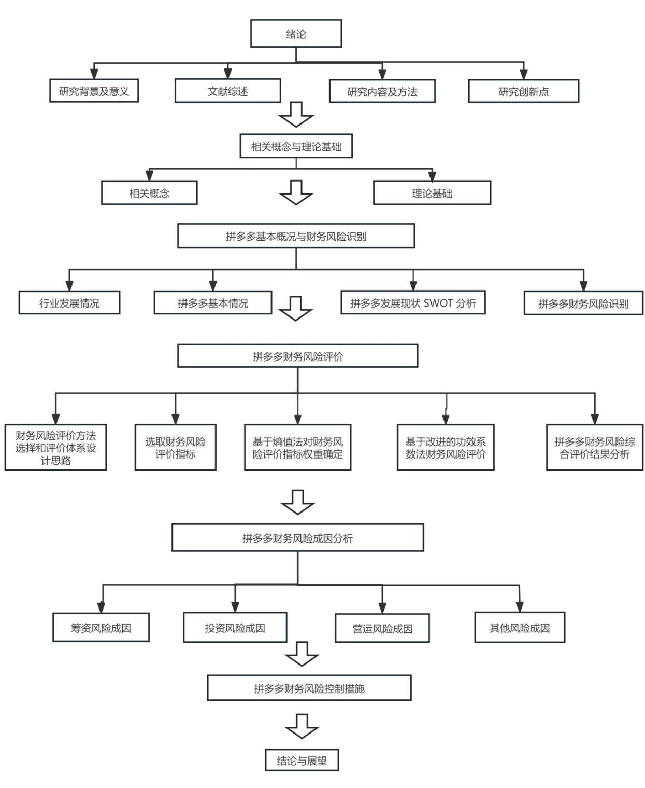

# 第1章绪论

# 1.1研究背景及意义

# 1.1.1研究背景

随着互联网的快速崛起，电商行业在全球范围内呈现出快速发展的态势，中国作为全球最大的电子商务市场之一，电商行业的市场规模不断扩大，为众多企业带来了巨大的发展机遇。党中央与国务院对电子商务领域展现深度关切与大力扶持态度，于2020 年《政府工作报告》框架内，明文纳入推动电商稳健前行之系列举措。此举旨在营建包容性强的营商氛围，同步升级物流配套基础架构，精准施力护航电子商务业之健康成长。在这一背景下，全国各地纷纷响应国家政策号召，结合本地实际情况，制定了各自的电子商务发展规划与措施，电商企业更加蓬勃发展。然而，随着电商行业的快速发展，一些问题也随之暴露出来，如假冒伪劣商品、侵犯知识产权、数据安全等问题日益突出，对此政府对电商行业的监管也在持续加强，合规建设不断完善，出台一系列法律法规以规范市场秩序，也会对一些过度粗暴的广告形式进行管制，政策的变动和限制也会对企业产生一定程度的风险。

财务风险在企业财务管理的范畴内占有显著地位，它影响着任何企业的日常经济活动，因此其对企业的影响是不可忽视的，尤其在电子商务领域，应该给予这一风险足够的关注。随着众多企业踏入电子商务的舞台，电商领域正持续增长其规模，与此同时，各电商企业的竞争压力也变得更为尖锐。每年都有数家电商公司宣告崩溃，大量的失败源于资金的中断导致的财务风险增加，其控制这种风险的能力受限，最后可能走向破产的道路。鉴于电商企业与传统企业在多个方面存在显著差异，我们不能简单地复制传统企业在运营中如何应对财务风险和危机的策略。因此，有必要对导致电商企业财务风险的各种因素进行深入地分析。因此本文针对目前电商企业所面临的各种财务风险进行研究，分析其产生的主要因素及其危害程度。通过深入分析产生的财务风险，我们可以采取适当的策略来避免或分散这些风险，从而控制或最大程度地降低这些风险，进而协助企业降低其损失。本文从财务角度分析了拼多多面临的财务风险及成因，提出相应的防范措施。拼多多是社交电商的代表企业，但随着社交电商市场的增长，新兴直播电商等多种电商形式的竞争，拼多多必须高度关注其财务管理，构建合适的财务风险评估体系，有效地识别财务风险，并防范其带来的负面后果，以确保企业的稳定发展。

# 1.1.2 研究意义

（1）理论意义

财务风险被视为风险研究的核心部分，它不仅关系到企业自身的生存与发展，同时也影响着社会稳定以及国家政策的制定。随着现代企业制度的不断完善，企业的财务风险管理也逐渐向科学化和规范化方向迈进，这要求企业必须建立科学的财务风险管理体系。目前，针对财务风险的研究虽已广泛运用实证方法，且一套完整的财务风险评估体系也已构建，但学者们在大量文献梳理中却发现，以具体案例为分析对象的相关研究成果仍显稀缺。同时，对财务风险的研究大都局限于单个方面或者某个层面。大部分研究主要集中在房地产行业和传统公司的财务风险上，而针对电商企业的研究则相对较少。并且关于风险的单独识别和控制的研究则比较丰富，很少能真正从财务风险管理的整体策略角度进行深入探讨。因此本文将结合电商行业的特点，对其进行财务风险的研究。选取拼多多作为研究案例，对所面临的财务风险进行了深入的识别。在初步识别的基础上，我们构建了一个财务风险评估模型，全面分析了风险的程度，并深入探讨了风险的成因。通过这种方式，我们进一步研究了如何有效地控制财务风险，确保企业能够健康、稳定地发展，进一步扩展了关于电商行业财务风险的理论探讨。

# （2）现实意义

我国经济高速发展，企业对资金需求越来越大，而财务风险管理更是其中必不可少的一部分。面对当今社会经济的快速变迁与企业内外环境的交织复杂性，财务风险管理的疏忽或不力易致企业深陷财务困境，削弱运营效能，累积沉重债务，乃至大幅提升破产风险，对内损害股东权益，对外危及债权人利益。故此，强化财务风险的有效管控已成为投资界与企业管理层关注的焦点议题。电子商务作为我国经济增长的新引擎，虽孕育无数创新与创业机遇，但其竞争之激烈、资金需求之巨大，较之传统企业更为显著。电商企业一旦在财务风险面前决策失当，将直面生存危机。因而，财务风险防控乃电商企业发展征程中不可或缺的关注重点。本文选取电商典范拼多多为剖析对象，旨在通过深度财务分析，精准识别各类风险因子，评估其潜在威胁程度，探析成因机理，并据此提出针对性强、操作性强的对策建议。此举旨在唤醒企业全面财务风险管理意识，助力其前瞻性地防范财务风险，提升应对市场波动的防御能力。研究成果不仅有利于拼多多自身强化风险管理体系，亦可为其他电商同行提供参照范本，共同推动我国电商产业持续、健康、稳定前行。

# 1.2文献综述

# 1.2.1 财务风险定义相关研究

相较于我国，国外在财务风险领域的探究起步较早。早在19 世纪美国学者威廉爱德华就提出了财务风险的概念。财务风险指的是财务活动在未来可能出现的与预期不符的实际结果，这种风险在财务管理的每一个步骤中都是客观存在的。Wachowicz（2009）基于之前学者的研究，认为相较于债务风险，财务杠杆更有可能导致企业承受更大的财务风险[1]。Bogodistov Y，Wohlgemuth V（2017）对财务风险的界定在于，当公司遭遇以下情形时，它被认为是财务风险，即其账面净值呈现为亏损状况；由于公司未能如期完成还款和付息，因此无法满足还款职责；由于企业业务运营不佳，已向法庭提交了破产申请，在公司经过破产处理后，仍未完成相关的责任和义务的情况[2]。GorbunovV（2018）从资产折现的视角来探讨企业的财务风险。他持有的观点是，当企业面临财务风险时，其资产的折现能力可能会受到影响[3]。Simona Franzoni（2019）认为，企业财务风险定义标准应根据各行业实际而定，并无固定统一标准[4]。CultreraL（2022）认为企业面临的不确定因素越多，企业财务风险管理就显得越重要[5]。Zhang Shirui（2023）认为财务风险是指由于公司内部的不稳定因素和外界环境的作用，企业在财务管理过程中可能会面临财务状况的变动[6]。

经过深入分析和研究我国相关文献，刘恩禄，汤谷良（1989）这两位学者最早提出了关于财务风险的定义，他们将财务风险视为企业在遭遇经济损失时所承担的风险[7]。邹绍辉，吴樊（2023）提出企业在债务筹资时失去偿还能力所带来的财务风险，这样会对普通股的股东利益带来负面影响，他们进一步建议建立财务风险评估系统，以此来避免和管理这些财务风险[8]。宋晓缤，王苑琢，孙莹等(2022)认为财务风险是指在企业运营过程中出现的现金流断流问题，这会导致企业无法正常运作，从而使企业借来的贷款无法按时偿还，进一步增加了偿债的风险[9]。李彬彬，王虹（2022）持有的观点是，企业在进行财务操作时，由于其周边环境的变动，可能会对企业的财务状况产生不利影响，导致企业的真实盈利与预期收益不一致，从而引发企业的财务风险[10]。漆颖斌（2023）认为财务风险实际上是财务与风险的结合，它是可衡量的，并且风险与收益之间存在正向关系，这种关系在各种财务活动中可能会干扰财务的正常运作[1]。

# 1.2.2 财务风险评价相关研究

财务风险评价的相关理论最早可以追溯到上世纪的二三十年代，由Fitzpatriek（1932）提出，通过运用单一变量法进行财务风险评价，但最终得出的财务风险并没有像预期的那样详尽地反映出来[12]。由此多变量模型开始受到关注，Altman(1968)提出Z-score 模型，选取指标通过这个模型得到的判别分（Z值）能够很好地预测出了公司财务风险[13]。Molgedey（2000）通过应用熵权法构建了企业财务风险的评估体系，从而得到的评估结果更为准确[14]。Hsieh T，MH- Wang（2011）选取了危机房地产公司作为主要研究目标，并采用了熵值法与功效系数法的融合来进行财务风险的评估[15]。Holzhauer(2016)运用主成分分析法对数据实施降维处理，旨在揭示贡献率显著的共性因子，并据此构建起用于评估财务风险程度的因子分析评价模型[16]。OláHJ等（2019）使用Z值、一般非分层对数线性模型等方法对中小企业进行分析评价，研究发现，在所有财务风险来源中，盈利不足给企业带来的负面影响最为显著[17]。SunX（2021）利用预测能力强、并且能有效处理复杂非线性难题的BP 神经网络财务预警模型对上市公司的财务风险进行了系统研究与评价，发现神经网络模型在意外情况时能做出最准确的预测[18]。

在科技演进与时代变迁背景下，我国研究者对财务风险评价方法的运用日益精进。邹蔚，陈梦雪，李卫飞等学者（2019）展开的一项研究中，巧妙结合因子分析与聚类分析技术，将制造业企业各项财务指标细致划分至不同层面，并严谨量化各项指标的权重。由此，一套完整且精准的财务风险评估框架应运而生，有效地揭示了制造业所面临的各类财务风险全貌[19]。赵腾和杨世忠（2019）在对企业进行财务风险评价工作时，并选择了熵权法作为评估手段。经过深入研究，他们发现该企业的营运风险是最为显著的，并据此提出了针对性的预防措施[20]。黄秋艳（2022）以保险业实际数据为依托，运用熵值法与功效系数法双管齐下，对互联网保险公司所面临的当下环境下的财务风险进行了系统性的揭示与辨识[21]。王拉娣、韩江旭（2020）以熵值法与TOPSIS 法为工具，针对房地产上市公司的特性，搭建了针对性的财务风险评估模型，旨在助力此类企业有效抵御各类财务风险挑战[22]。祝杨（2021）在大智移云背景下，借助大数据技术，整合企业内部架构、市场动态及行业数据资源，运用神经网络算法创新性地创建了一套企业财务风险全方位评测框架[23]。龙志，陈湘州（2022）运用AHP 分析法从定性和定量的角度确定权重，并运用改进后功效系数法进行风险评价更具优越性[24]。黄盈盈，贺美兰（2021）借助熵值法及功效系数法手段，对有色金属产业实施深度财务风险探查，全方位揭示其隐含的财务脆弱点[25]。王竹泉，宋晓缤，王苑琢（2020)明确指出了当前短期财务风险评估标准在过度预警风险及对瞬时风险反应迟钝两方面的固有缺陷，进而创新性地构建出一套兼容资产现状与资金流动视角的短时效财务风险综合性评判系统[26]。王贺敏，刘明玮（2022）基于大数据背景下对财务风险方法的应用展开了详细的比较，并提出熵权法可以有效的避免人为主观赋权的误差[27]。罗述苹，蔡花艳等（2023）将非财务指标行业因素等选入财务风险评价体系中，这使得房地产集团的风险问题能够更为全面[28]。

# 1.2.3财务风险控制相关研究

关于财务风险的控制，国内外的研究者们也展现出了各自的研究趋势。国外学者Alexandre（2006）指出，财务风险犹如企业活动脉络中的无形之手，渗透于各个运作阶段与组成单元他倡导实施精准定制的风险管理方案，旨在全方位把控企业整体财务风险[29]。Osypenko（2015）在聚焦工业企业的背景下，明确提出增强内部财务控制架构乃应对财务风险挑战的关键路径[30]。NguyenA（2018）从定量和定性研究中收集数据揭示政府的政策支持可以一定程度上降低财务风险[31]。Jaroslav（2017）设计了一套财务风险预警体系，旨在全方位、科学地驾驭企业各类风险[32]。Milagros（2018）他深入剖析企业运营实况，从融资活动与日常运营双重视角，为企业财务风险管理提供了针对性策略[33]。Maryna A S，Amelnytska M（2021）在文中提出可以通过拒绝进行风险水平过高的金融交易、避免使用大量的贷款、避免过度使用流动性较低的流动资产以及不将短期的自由的货币资产用于短期金融投资等方法来规避财务风险[34]。

对于我国国内学者而言，对于研究财务风险控制的手段和措施的相关内容较为丰富。李阳一（2019）对企业并购产生的财务风险进行了分析和识别，并从并购前、并购中和并购后三个方面提出合理规避企业财务风险和减少企业并购带来财务风险影响的方法[35]。李心地（2021）认为人工智能技术有能力提升公司处理财务信息的效率，并能迅速地识别出潜在的财务风险[36]。苏琳琳（2021）研究大数据视角下企业健全的内部控制能更好地应对财务风险[37]。朱俞青，黄方玉(2022)对江苏省内的家族企业群体进行了深入探究，其研究结论指出，通过适度增大董事会规模，能够显著提升企业在重大决策过程中的精准度。此外，二人倡导采用“内部审计机制与外部监管力量相融合”的策略，旨在构筑一道坚实防线，以有效抵御上市公司遭遇的各类财务风险[38]。杭慧芹，许苏兰（2022）在数字化转型背景下对企业财务风险进行识别，提出企业应提高数字化管理的能力，紧抓数字化建设带来的契机对财务风险进行规划和防范[39]。柳德才，梁晓冉，陈宇奥(2022)从跨境并购财务风险的角度提出从提高财务风险意识和打造专业风控团队等方面针对性的制定财务风险控制措施[40]。

# 1.2.4电商企业财务风险相关研究

对于我国电商企业的财务风险研究也在不断丰富发展。冯高飞（2016）选取苏宁云商与阿里巴巴战略结盟个案，针对此类合作背景下的独特财务风险进行了深度剖析，并从控制运营开支、规划退出机制等维度，对我国电商行业中联盟策略的制定提供了针对性见解[41]。王子西（2018）对农资电商特有的财务风险进行分析，发现存在物流运输问题，种植业分散问题、信任风险等使得财务风险的概率增大，并对此提出针对性对策[42]。黄敏（2018）探讨了互联网企业在财务风险控制方面的研究成果，揭示了互联网企业的特征固定资产较少，无形资产较多，流动比率较高[43]。董学力（2018）研究中揭示的阿里集团并购优酷土豆过程中遭遇的各类财务风险。该案例分析以阿里与优酷土豆的并购为实证背景，深度探讨了此类互联网企业并购所面临的财务风险挑战，并据此构建了针对性的风险管控策略[44]。王昕（2019）强调，电商企业在应对财务风险方面展现出与传统企业的显著差异，且这种差异的管理得益于大数据技术的革新性支持，它为电商企业构筑稳健的财务风险管理架构提供了坚实基础[45]。秦燕坤（2022）认为电商企业内部控制对于企业的健康运营是至关重要的。他选择了电商行业的领军企业京东进行深入研究，通过探究其内部控制模式，深入了解其企业组织构架、组织方式以及资源整合等方面，进而为电商行业内部控制的改进提供了建议[46]。

# 1.2.5文献述评

综上所述，无论是国内还是国外的学者，在财务风险的理论研究方面都已经达到较为深入和全面的阶段。受到工业革命的启示，国外在这方面的研究已经起步颇早，主要集中于实证性研究和案例分析。针对实际背景下的财务风险，学者们广泛考察了多种评估模型，如单变量法、Z-score 模型、人工神经网络模型及功效系数法等，这些模型在识别与量化财务风险中展现出显著效果。国内研究者在借鉴国际理论成果的基础上，针对中国国情与企业特性，逐步构建并完善了适用于本土企业的财务风险管理体系。然而，文献回顾揭示出研究重点普遍倾向于对房地产等传统行业的财务风险剖析，而在互联网经济高速崛起的当下，电子商务企业，尤其是迅速壮大的拼多多等新兴电商巨头，其独特的财务风险特征尚未得到充分关注与专业解析。鉴于电商领域财务风险管理研究的相对匮乏，本文以电商产业为切入点，选定拼多多作为典型研究案例，运用熵值法赋予各风险因素权重，并结合经过改良的功效系数法进行风险评估。最终，论文旨在提出一套针对性强、操作性强的风险防控策略，以应对电商企业在新时代背景下所面临的特殊财务挑战。

# 1.3研究内容

本研究聚焦于电商企业财务风险管理主题，通过对典型代表拼多多的财务风险实例深入解读与系统拆解。探讨范畴囊括如下关键维度：

第一章：绪论。本文阐述了对研究背景及意义后，对财务风险管理国内外研究现状的深度剖析，研究内容与方法和创新点展开介绍。

第二章：相关概念及理论基础。阐明财务风险和财务风险管理的内涵和相关理论。

第三章：拼多多基本概况与财务风险识别。首先了解了行业的发展现状及电商行业特有的财务风险，其次了解了拼多多的基本情况，对拼多多进行 SWOT分析，最后阐述企业的财务状况，从纵向和横向分别进行研究。先从总体出发，对拼多多 2018-2022 年的财务数据进行纵向对比分析，然后根据企业年报通过财务比率分析法从筹资风险、投资风险、营运风险等方面与京东、阿里巴巴进行对比分析，发现其存在的财务风险。

第四章：拼多多财务风险评价。企业财务风险评估流程如下：首先，对财务指标进行初步选取，运用 Pearson 相关性分析手段对备选指标进行筛选，旨在构建一套科学的财务风险评价体系。接着，采用熵值法精准计算各指标在体系中的权重分配。后续步骤中，引入功效系数法，以此对企业财务风险进行全面衡量。最终，依据评价结果清晰划分风险等级，并展开深度解读与剖析。

第五章：拼多多财务风险成因分析。从筹资风险、投资风险、营运风险、其他风险四个方面对拼多多财务风险成因进行分析。

第六章：拼多多财务风险的控制对策。根据对财务风险成因的分析，从筹资风险控制、投资风险控制、营运风险控制、其他风险控制四个方面提出控制对策。

第六章：结论与展望。全面总结本研究的成果，同时也指出研究的不足。并针对今后研究方向做了预测。

本文的研究框架图如图1.1 所示：

  
图1.1研究框架图  
Fig.1.1 Research Framework Diagram

# 1.4研究方法

（1）文献研究法

本文通过收集阅读了国内外关于财务风险管理的文献，将其主要研究发现做了系统的整合和概述，并结合自己的深入思考，为本研究深入探讨拼多多的财务风险提供了坚固的理论支撑。

# （2）案例分析法

本文选择在一片红海中突围的黑马电商企业拼多多作为案例研究对象，通过分析企业的实际状况，识别存在的财务风险，构建财务风险评价体系，根据风险成因提出相应的财务风险防范建议。

# 1.5研究创新点

在选取研究对象方面，目前对于财务风险管理的研究多以房地产行业、医药行业、制造业等为研究对象，对电商行业的研究较少。本文首先分析了电商行业特有的财务风险，并选择电商行业中具有典型代表性的拼多多为研究对象，研究拼多多财务风险管理的，对其他电商企业具有参考意义。在财务风险评价体系运用相关性分析进行指标的选取排除构建财务风险评价指标体系，通过熵值法进行指标权重的确定，通过改进功效系数法来进行风险评价，可以全面客观地判断企业的财务风险。
