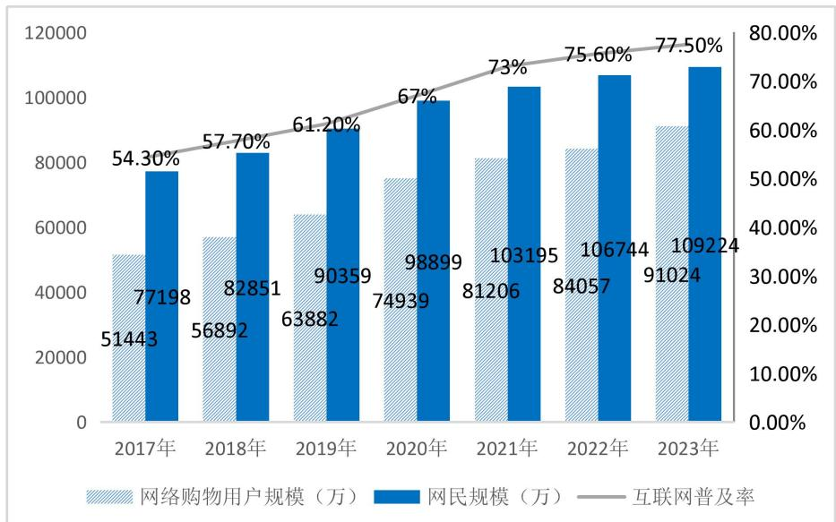
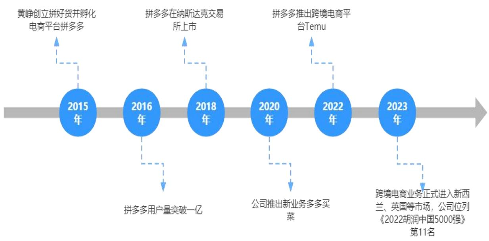
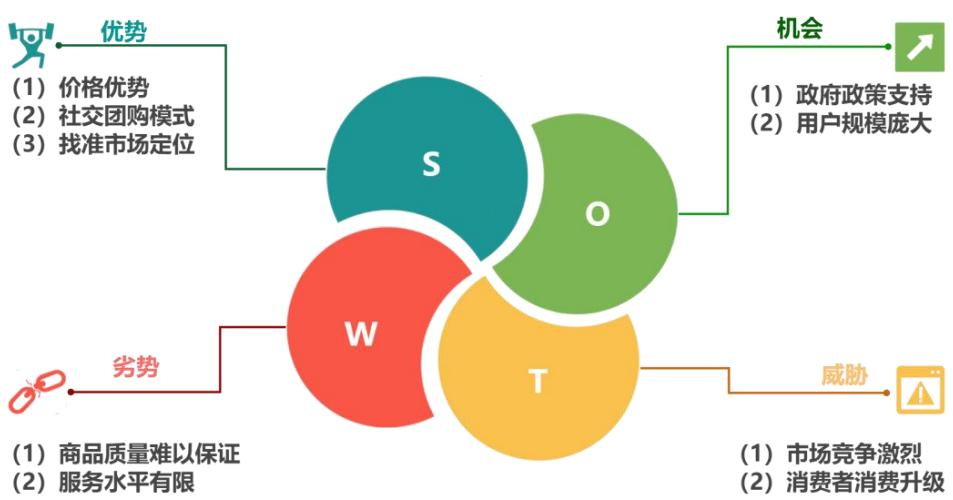

# 第3 章 拼多多基本概况与财务风险识别

# 3.1行业发展情况

# 3.1.1电商行业发展现状

随着国内互联网的发展，我国电商经历了从无到有，越来越多的人们加入到电子商务交易中来，根据最新发布的《中国互联网络发展状况统计报告》，截至2023 年 12 月，中国网民规模已达到10.92 亿人，互联网普及率为 $7 7 . 5 \%$ 。到2023年，如网络购物和电商直播这样的数字消费仍在持续增长，我国的网络购物用户数量已经达到了9.15 亿，与前一年相比，增长了超过 6000 万。由图 3.1所示逐年递增的趋势清晰地揭示了我国互联网领域三大关键指标的强劲势头：网民总量、在线购物参与者的数量以及互联网普及率，无一不在稳步攀升。经历了二十多年的成长，电商公司在各种挑战中持续进步，并随着市场的持续完善，目前已经步入了一个充满创新的发展时期。在新的环境下，新零售电商平台等分割更倾向于进行更为精细或大规模的市场竞争。从一方面看，跨境电商在“一带一路”倡议引领下积极开辟海外新兴市场，而国内综合网购平台则同步拓宽服务边界，深入渗透至农村腹地，涉足母婴用品、日常生活服务及美容美妆等多元细分行业。从另一个角度看，电子商务公司之间形成了紧密的合作关系，同时增强了线上和线下的资源融合，共同构建了一个涵盖多个行业、多个领域和多个维度的生态系统。由于新冠疫情对居家生活的影响，消费者在观看直播、本地即时消费以及社区团购方面的习惯已经逐步形成，这也导致了直播电商平台和社区团购平台市场的逐渐崛起。综合电商平台的市场份额可能会逐步被直播电商平台、新零售电商平台等所瓜分。

  
图3.1网民规模、网络用户规模和互联网普及率图

Fig.3.1 The size of netizens, the size of internet users and the Internet penetration rate char1

# 3.1.2电商企业特殊性分析

（1）交易方式不同

随着网络技术的发展以及电子商务模式的创新，很多电商平台应运而生。电商企业主要通过互联网等电子渠道进行销售和交易，整个交易过程都可以通过互联网来完成，这种方式消除了时间和地点的束缚，使得交易更为便捷和高效。而传统企业则主要通过实体店面进行销售和交易，有固定的开店营业时间，而且不能做到一站式购买齐全。

（2）资产结构不同

电商企业固定资产比重相对较小，而其无形资产所占的比例则相对较大。这主要是因为电商企业的独特性质导致，它们所提供的产品和服务种类多样，产品生命周期相对较短。因此，为了进行产品的持续研发、技术的升级和创新，电商企业需在新产品研发和技术更新等方面持续注入资金，这导致无形资产所占的比重较高。电商平台企业倾向于运用轻资产策略来运作其业务，核心在于依托服务供给而非重资产持有。其业务模式围绕线上交易市场构建，涵盖商品销售代理与企业营销支持等多元服务项目。实体资产配置相对有限，集中体现在必要的办公硬件配备、专业设备投资及仓储物流设施之上。通过构建柔性供应链的商业管理平台，这些企业能够提供附加增值服务，从而降低生产成本，实现资金的快速回收，以及提高资源的使用效率。相较于传统企业大规模构建厂房与购置各类生产设备导致固定资产在其总资产中占据显著份额，这些企业呈现出较低的固定资产占比特性。

# （3）经营成本不同

电商企业通过线上平台进行交易不仅避免了店面的租金成本，还能减少许多中间环节，从而降低了客户与产品之间的分销成本，减少了资源在各个环节的消耗和损耗，进一步降低了运营成本，为其创造了更多的盈利机会。而与此不同，传统的电商企业在实体店面的租金、人工成本等方面，都需要经过批发商、零售商等多个环节来确保产品能够顺利送达消费者手中。在营销策略方面，部分电商公司采用了网络营销策略来进行宣传和推广。他们充分利用社交媒体资源，成功地培养了大量的粉丝。通过利用这些粉丝的“流量”，电商企业不仅可以节省广告和宣传的费用，还能提高其运营效率，从而达到了很好的宣传效果，真正做到了双赢。这些措施极大地减少了电商公司在时间和人力资源上的花费，从而提升了公司的运营效率并增强了其市场竞争力。

# （4）财务处理不同

在网络这一特殊的虚拟环境中，电商交易采用了无纸化的操作方式，允许在线生成交易单据和自动划转电子货币。数字购销协议与电子销售单据构成了电商财务体系的基石，实现了数据的实时云端互联，财务资料瞬间可达，网络平台集成财务信息一站式检索源头。此举显著提升了数据流通速率，使得财务报告更新与企业经济状况洞察几乎同步进行。相较于实体企业的纸质流程，电子单据全生命周期管理，涵盖生成、存档、流转、电子签批乃至修订，展现出迥异的操作逻辑。尽管电子凭据在空间占用、传输便捷度及查询效率上占优，但其无形特质亦滋生篡改风险，一旦无痕改动，将丧失作为合法税务证明的效力。电商企业在营收确认环节遭遇独特挑战，自动化交易处理机制结合高频退换货现象，致使收入确认复杂化，不确定性陡增，进而折损会计信息的可靠性。传统的收入确认准则在电商场景下显得格格不入。

# 3.1.3电商企业财务风险

（1）筹资风险

尽管电商企业对资金的需求持续上升，但很多电商企业在筹集资金的过程中表现得并不理想，电商企业存在着融资成本过高以及融资难的问题，资金需求与融资供给之间存在一定的缺口，导致电商企业无法及时获得充足的资金支持其正常运营。为了应对这些挑战，众多的电商企业开始探索采用互联网金融的方式来筹集资金。其中，电商企业通过第三方支付平台向商业银行申请贷款成为最常用的方式之一。对传统企业而言，银行贷款被视为一种普遍的资金筹集方式。由于电子商务企业具有信息透明性强、交易成本低以及交易成本低等特点，因此可以更多地采用银行贷款。然而，由于电商企业面对的市场前景充满不确定性和巨大的风险，再加上它们主要从事轻资产运营，因此很难从银行获得贷款。同时，在这样的背景下，电商企业需要借助股权融资、债务融资等多个途径来筹措所需的资金。推动企业实现迅猛增长，仅依赖于公司内部资本积累或局限性显著的政府补贴，并非切实可行之举。受到多重因素的综合作用，经营过程中的资金可能会面临收支失衡的问题，这进一步提高了财务的风险。

（2）投资风险

在电商企业面临同质化问题的背景下，选择合适的投资项目显得尤为重要。一个富有创意的优质项目可以为企业带来丰厚的回报，但这也可能导致公司资金链的崩溃，甚至走向衰败。在最近的几年中，像阿里和京东这样的电商大公司正积极地在线下扩展他们的门店。无论是在线下布局还是在平台建设方面，项目的初期投资都非常巨大。电商大公司不仅资金雄厚，而且具有很强的吸引投资的能力，这使得他们在财务上的压力相对较小，从而确保了项目的可行性。尽管众多电商公司紧密跟随这一发展趋势来完善他们的 020 策略，但他们往往忽略了对自身的深入反思，这最终导致了资金链的严重断裂。决定投资哪个项目、何时进行投资以及与哪些人合作都是决定企业投资是否成功的关键因素，因此电商公司需要做出明智的决策，以减少财务风险的可能性。

# （3）营运风险

企业的营运资金管理是财务管理的核心环节。如果企业在营运资金管理上存在疏漏，例如应收账款和存货的周转速度太慢，这可能导致企业的资金被过度使用，从而增加财务风险。电子商务公司面临的运营风险主要集中在供应链管理的不稳定性和成本负担上。供应链对资金流动的稳定性有着直接的影响。电商企业通常是通过线上渠道来选择供应商，但由于供应商提供的货物质量参差不齐，当电商企业的识别能力不足时，将假货送到消费者手中可能会对企业的信誉和声誉造成负面影响，同时也会加剧经济纠纷，给财务带来损失。为了实现盈利和达成其经营目标，电商企业在初始阶段需要大量的资金投入，这包括网站建设、产品研发以及物流基础设施的搭建。尽管他们的固定开支相对较高，但由于市场环境的复杂性和行业竞争的不断加剧，这些企业在未来的收益和回报方面面临着更高的风险。如果不能有效地收回运营成本，他们将缺乏足够的资金来保证企业的正常运营。

# （4）其他风险

虽然电子商务经历了快速的增长，但相应地，法律和法规的架构仍需进一步完善和优化。由于互联网的开放性和其虚拟性，为那些犯罪分子提供了捕捉机会；这些人通过法律或系统的漏洞，修改他人的信息以获取非法的好处，而且在网络购物时，也常会出现消费者信息被外泄的情况。各企业应当加强对黑客侵入的警惕，确保消费者数据不被泄露等危险情况。此外，当用户通过互联网进行商品或服务的购买时，他们往往不能完全掌握商品的真实性，经常遭遇与卖方的承诺不符的商品或服务质量问题，有时甚至出现伪劣产品，这严重伤害了消费者权益。此外，由于信用风险管理不足，许多电商公司面临着信用风险的风险，为电商带来了不小的困扰。电子商务环境下的信用问题相较于传统交易模式更不容易被及时捕捉到，这种情况导致企业遭受的财务风险相对较高，因此问题的频发成为一个突出的现象。

# 3.2 拼多多基本情况

# 3.2.1拼多多公司简介

拼多多是由黄峥在2015 年创立的隶属於上海寻梦信息技术有限公司的一家以内容和社交为核心的“新电商模式”的第三方社交电商平台，并于2018 年7月26日在美国纳斯达克市场公开上市，发行价为19 美元，凭借高达240 亿美元的市值，一跃成为国内的第三大电商平台。拼多多，初创之时即定位为农产品零售平台，其后深度耕耘农业领域，创新性地推出了以拼团为核心的农产品零售新模式。该平台产品线丰富多元，涵盖食品、鞋履、箱包、家用电器、美妆产品、日用品以及医药等多个类别，始终关注并响应消费者的实际需求，尤其在消费者日常生活必需品方面，常推出优惠举措，以此塑造企业正面的品牌形象。在运营策略上，拼多多巧妙地将娱乐元素与分享精神渗透其中，旨在为用户提供兼具高品质与合理价格的商品，同时营造出趣味盎然的互动购物氛围。其标志性购物流程如下：用户在平台上挑选心仪商品后，可向亲友发起拼团邀请，一旦拼单达成，参与者皆能享受到低于单品购买价格的团购优惠。这种模式不仅让顾客得以实惠购置优质商品，还巧妙地促进了用户之间的社交互动，借由共享购物体验，强化了人际关系网络。

# 3.2.2拼多多发展历程

拼多多起源于2015 年4月，彼时拼好货公司创立，专注于运用微信朋友圈拼单模式自营生鲜品项。仅数月后的9月，拼多多品牌公众号横空出世，深谙社交网络裂变之术，短短两周内粉丝数量即突破百万大关。历经一年发展，至2016 年9 月，拼多多与拼好货强强联手，合并后用户总量破亿，并在随后的2017 年第一季度果断剥离自营业务，战略转向以低价策略深耕下沉市场，巧妙避开与电商巨头阿里、京东的直接交锋，用户基数以每年近亿人的增速迅猛增长。终于在 2018年7月26 日，拼多多以每股19 美元的价格在美国纳斯达克交易所敲响上市钟声。步入2020 年，拼多多进一步拓展业务边界，推出生鲜团购平台“多多买菜”。至2022 年，拼多多已成功与极兔速递、中国邮政等多家物流企业实现系统级对接，优化了包裹签收流程，并通过大额补贴策略，有力地吸引了众多代收点加盟合作。在2022 年推出跨境电商平台“Temu”，在2023 年拼多多跨境电商业务正式进入澳大利亚、新西兰、英国等市场，并且公司位列《2022 胡润中国 500 强》第11 名。

  
图3.2拼多多发展历程  
Fig.3.2 The development of Pinduoduo

# 3.3拼多多发展现状 SWOT 分析

# 3.3.1内部优势分析（S)

（1）价格优势

拼多多的核心竞争力在于低价，目前，我国有 5.64亿人处在中低收入水平，三、四线城市及农村中有大量中老年群体，他们平时的主要购买商品是生活用品且重视性价比。拼多多采用拼单模式，有大量订单迅速涌入，并采取 C2M 商业模式，绕开品牌将消费者与厂家之间无缝对接，避免了品牌溢价，大规模制造分摊降低成本，使得有能力不断提供物美价廉的商品给消费者。拼多多还采取官方补贴来降低价格，销售量的大幅度增加，而且薄利多销的方式也能大大地保障商家的利益。

# （2）社交团购模式

拼多多的核心购物模式区别于传统电商，开创了一种新的社交拼团的购物模式。通过社交分享和邀请家人好友进行拼团参加购物，让消费者成为流量节点，不仅为拼多多带来流量，降低了宣传成本，而且拼多多还抓住消费者的获利心理实行好友助力享免单、0元砍价免费拿、凑团购享优惠等活动，通过低成本活动刺激用户购物欲望，维持大量活跃用户，强化消费者对平台的粘性，同时通过用户社交圈吸引新流量。

（3）找准市场定位

尽管我国是一个农业强国，农村的电子商务却始终没有看到明显的增长。代表性的电商平台如阿里巴巴和京东主要专注于一线和二线城市的发展，但对于利润不高的农产品和人均消费相对较低的底线城市居民，他们并没有给予足够的关注。拼多多在激烈的电商竞技场中，巧妙地避开了与行业巨擘如京东、阿里的正面交锋，同时降低了与众多中小电商平台在商品与服务上的雷同竞争态势。其成功秘诀在于对长尾理论的精妙运用，战略聚焦于被传统电商相对忽视的下沉市场，这片蓝海蕴藏着庞大的低收入消费者群体，他们的消费需求长久以来未得到充分满足。拼多多精准切入，激活了这一长尾市场潜力，从而在巨头林立的电商格局中独辟蹊径，实现了异军突起。

# 3.3.2 内部劣势分析（W)

（1）商品质量难以保证

拼多多平台的商品质量问题持续存在，源于其对低价策略的坚持，这体现在其宽松的商家准入机制，吸引了大批生产假冒伪劣商品及信誉低下的商户入驻。平台上的商品质量问题成为了消费者投诉的焦点，其中涵盖了对拼多多虚假宣传的指责、对激进营销手法的反感以及对所购商品品质低劣要求退款的诉求。种种迹象揭示，尽管面临大量用户投诉，拼多多在解决商品质量这一根本问题上成效尚不显著。近期五粮液在声明中直接表示，拼多多多家店铺销售的五粮液产品为假冒产品。而且拼多多曾被多个品牌方指出未获授权，如好利来、国台酒以及冈本等众多品牌表明在拼多多平台销售的任何店铺，均未获得公司的合法授权，公司无法保证所售商品的真实性、可靠性和安全性。这也造成了消费者对拼多多产生信任危机，用户可能会担心购买到假货或低质量商品流失一部分客户，对拼多多今后的发展十分不利。

# （2）服务水平有限

相较于其他电商平台，拼多多的服务水平相对有限。首先是售后服务，拼多多的售后服务解决率仅为 $51 \%$ ，消费者经常遇到客服不专业、电话难以接通和举证困难等问题。尽管平台不断尝试提升服务质量，但用户仍旧难以获得满意的解决方案，使得拼多多的售后服务体系显得不够完善，削弱了用户对平台的信任。其次是物流服务，快递业务要依靠第三方，退换货的售后服务保障制度不健全。拼多多现在还没形成自己的物流配送系统，在各地也不能看到自己的服务站点。对比于京东超市和天猫等，拼多多在客户取件、货品代收代存等方面都比不上其他各大电子商务平台。

# 3.3.3外部机会分析（0)

（1）政府的政策支持

电子商务因互联网浪潮而勃兴，凭借其无界、高效、低耗的优势，成为新时代备受瞩目的商业形态，赢得中央高层的热切关注。为推动农村电子商务的革新与繁荣，我国政府自 2020 年起已制定并实施一系列政策措施。当年的《政府工作报告》中，电子商务健康发展之重任赫然在列，旨在通过详尽的政策文本扫除行业前行中的种种壁垒。与此同时，国家积极构建宽松的环境，强化物流基础设施，扩大对外合作界面，旨在确保电子商务在稳健中走向长远发展。

（2）用户规模庞大

随着智能手机的普及，物流快递系统的完善，便捷的网上购物成了越来越多人首选的购物方式，足不出户就可以享受互联网带来的便利，而且随着智能工具的普及，网络购物不只是年轻人的代表，一些中老年人也学会了在网络购物，成了占比很大的消费群体，为电商企业增加了大量的用户。我国农村地区的网络零售发展尤为迅速，其增速甚至远超我国城市地区，这已经充分证明国内低线地区购买力得到释放，低端消费市场扩大。而且中国的社交媒体用户规模庞大，这为拼多多提供了广阔的市场。通过不断改进和创新，拼多多可以进一步发展其社交电商模式，开拓新的用户群体和细分市场。而且直播电商的发展趋势明显，拼多多可以抓住本次机会，进入新电商时代。

# 3.3.4外部威胁分析（T)

# （1）市场竞争激烈

随着经济的发展和互联网技术的进步，电商行业迅速发展，吸引了越来越多的企业进入这个领域，竞争激烈，同行业内的其他企业也进行转型升级，商品的同质化现象严重，价格战频繁出现，企业的利润空间被压缩。随着社交电商市场的增长，竞争对手如京东淘宝等也在推出类似的产品和服务，他们拥有更强的品牌认知和市场资源，可能抢占拼多多的市场份额，所以拼多多想要在竞争激烈的市场上保持领先地位是一种挑战。而且抖音快手等也推出直播电商会抢占拼多多一些市场。

# （2）消费者消费升级

随着我国社会的发展，大家的生活水平越来越高，一些传统的消费观念发生了改变，消费者越来越注重品质和服务体验，而拼多多在这方面相对较弱，拼多多的消费对象很多是低收入人群，而且拼多多的商品质量低下，假货风波不断，这可能使用户转向其他平台，寻找更好的购物体验。

根据上文对拼多多的 SWOT分析可知，拼多多虽然站在了电商行业发展的风口，在行业内已经确立了一定的优势地位，发展前景良好，也有外部政策的支持，但是其在发展过程当中已经暴露出不少问题，比如产品质量下，服务水平有限等。因此，面对这些问题加上行业的激烈竞争，拼多多更要重视财务风险的分析，对企业的发展现状进行不断改善，以此来确保拼多多的可持续发展，持续提高竞争力。

  
SWOT分析  
图3.3拼多多SWOT分析图  
Fig.3.3 Pinduoduo SWOT analysis chart
