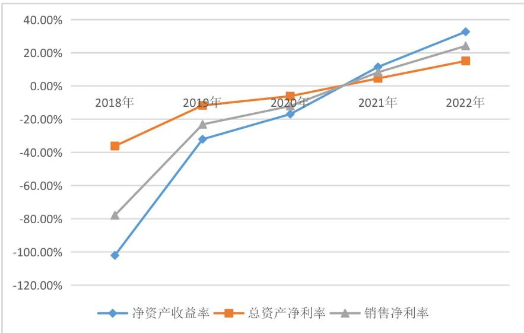
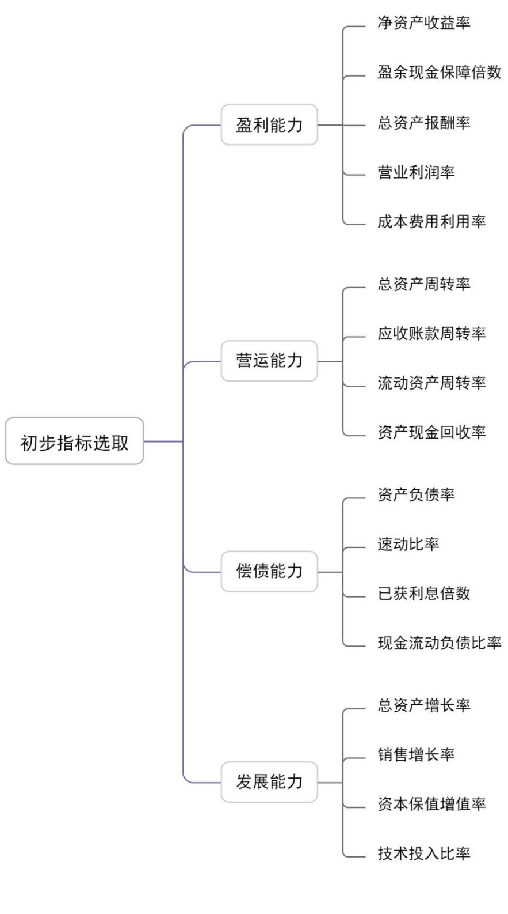
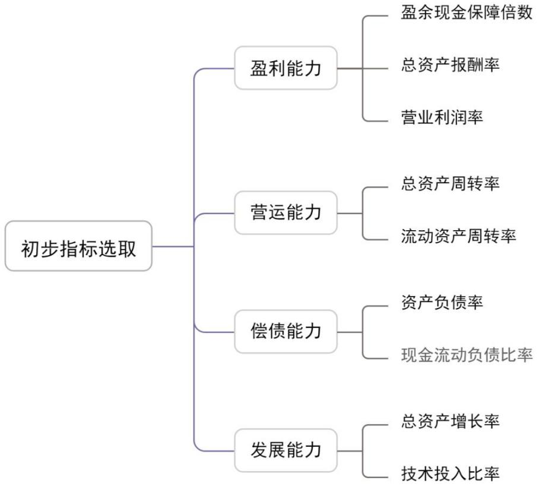
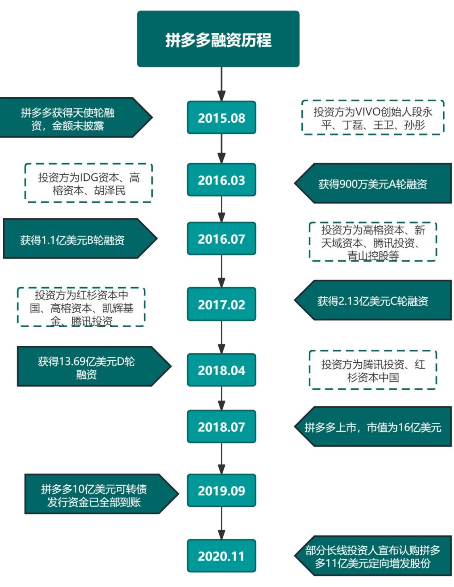

# 3.4拼多多财务风险识别

在财务风险管理流程中，首先要做的是准确地识别风险，并将这些分析结果作为财务风险管理的科学根据。拼多多目前所从事的是电子商务行业。由于这个行业的特点，收益分配的风险往往不是行业内部主要的财务风险因素。为此，这一部分利用了各种财务指标，特别集中在拼多多的筹资风险、投资风险和营运风险这三个方面进行深入探索。通过比较企业财务指标与同行业其他两家企业的情况，并对这些财务指标的发展趋势进行总结，我们试图识别拼多多目前和未来财务风险的存在以及它们可能出现的原因。这些信息对企业制定未来的防范策略提供了重要的基础。

# 3.4.1筹资风险识别

企业的筹资风险来源于其筹资的方式、筹资资金量的多少及与企业的偿还债务的能力也息息相关。由表3.1可知拼多多的债务筹资规模在2018 年到2022 年一直高于权益筹资规模。过度举债有可能性会引发财务风险，假如一个公司的偿债能力在短时间内发生了较大程度的降低，或者是出现了资不抵债的情况，那么就会使得公司的财务风险增加，从而造成公司的财务危机，严重的话还会造成公司破产。截止到 2022 年，拼多多负债为1193 亿元，所有者权益为1178 亿元，负债和所有者权益基本持平，拼多多从主要以外部债务筹资为主，到逐渐加大权益筹资。

表3.1拼多多债务筹资与权益筹资对比  
Table3.1 Pinduoduo debt financing and equity financing comparison   

<table><tr><td>项目/年份</td><td>2018年</td><td>2019年</td><td>2020年</td><td>2021年</td><td>2022年</td></tr><tr><td>债务筹资（亿元）</td><td>243.6</td><td>514.1</td><td>987.3</td><td>1061</td><td>1193</td></tr><tr><td>权益筹资（亿元）</td><td>188.2</td><td>246.5</td><td>601.8</td><td>751.1</td><td>1178</td></tr><tr><td>债务筹资/权益筹资</td><td>1.3</td><td>2.1</td><td>1.6</td><td>1.4</td><td>1.0</td></tr></table>

数据来源：拼多多2018-2022 年年报整理计算

充足的流动资产可以提高企业的偿债能力、降低财务风险，但是从其流动资产的结构来看，由表3.2 可知限制性现金占流动资产总额的比例较大，2018 年限制性现金占据流动资产总额 $4 0 . 5 5 \%$ ，2019年到2021年占比都为 $3 5 \%$ 以上，到2022年下降到 $2 6 . 7 \%$ ，但总体还是有较高占比，去掉这部分限制性现金，拼多多的偿债能力就会下降，短期偿债能力较弱。

表3.2 拼多多限制性现金与流动资产  
Table3.2 Pinduoduo restricted cash and current assets   

<table><tr><td>项目/年份</td><td>2018年</td><td>2019年</td><td>2020年</td><td>2021年</td><td>2022年</td></tr><tr><td>限制性现金及其他(流动）（亿元）</td><td>163.8</td><td>275.8</td><td>524.2</td><td>596.2</td><td>579.7</td></tr><tr><td>流动资产（亿元）</td><td>403.9</td><td>730</td><td>1495</td><td>1609</td><td>2166</td></tr><tr><td>限制性现金在流动资产占比（%）</td><td>40.55</td><td>37.78</td><td>35.06</td><td>37.05</td><td>26.76</td></tr></table>

数据来源：拼多多2018-2022 年年报整理计算

鉴于拼多多企业经营特点，其流动资产结构中存货占比较低，因此选取流动比率来进行短期偿债能力的研究。流动比率是指企业的流动资产对其所承担的债务承担能力。流动比率数值一般通常大于2为宜。从表格3.2可以看出，在2018-2022年之间，拼多多的流动性比率是1.66、1.60、1.78、1.72、1.85，都不到2，即使随着时间推移，状况也得到了提高，但是仍然很小。从这一点来看，拼多多目前的流动资产难以清偿其流动债务，因此其短期内面临着一定债务危机。

长期偿债能力选择资产负债率和权益乘数来进行分析，在近五年中，由图3.4和表3.3 可以看出，拼多多的资产负债率在不断降低，但是总体来说，它的负债率还是很高的，平均负债率超过了 $50 \%$ 。高资产负债比率使得拼多多在面对高额利息的情况下，很可能会带来更大的财务风险。权益乘数与长期偿债能力呈反比，即比率越小，偿还长期债务能力越强。从图3.4和表3.3 可以看出，2019 年达到最高值 3.09 之后，在 2019 年和 2022 年之间，拼多多的权益乘数逐渐降低，但是整体都在2 以上。从这两项数据上来看，尽管拼多多的长期偿债能力得到了一定提高，但仍处在一个比较低的层次上。

表3.3拼多多偿债能力指标  
Table3.3 Pinduoduo solvency index   

<table><tr><td>指标/年份</td><td>2018年</td><td>2019年</td><td>2020年</td><td>2021年</td><td>2022年</td></tr><tr><td>流动比率</td><td>1.66</td><td>1.60</td><td>1.78</td><td>1.72</td><td>1.85</td></tr><tr><td>权益乘数</td><td>2.29</td><td>3.09</td><td>2.64</td><td>2.41</td><td>2.01</td></tr><tr><td>资产负债率（%）</td><td>56.14</td><td>67.59</td><td>62.13</td><td>58.55</td><td>50.33</td></tr></table>

数据来源：拼多多2018-2022 年年报整理计算

  
图3.4 拼多多2018-2022年偿债能力变动情况  
Fig.3.4 Changes in Pinduoduo's solvency from 2018 to 2022

横向来看拼多多的主要竞争对手阿里巴巴和京东偿债能力情况。如表3.4 中我们可以看出，最近五年，拼多多的流动比率比京东、阿里巴巴要高，而且还在不断地增长，这意味着拼多多自身虽然面临着一些短期债务危机，但比起京东、阿里巴巴来说，它的短期债务偿还能力要好。在长期偿债能力方面，从表3.4可以看出，拼多多的资产负债率一直高于阿里巴巴有些年份几乎是阿里巴巴的两倍，与京东相比，除了2018 年和 2022 年拼多多也始终超过京东。由此指标可见拼多多长期债务偿还能力低于这两个企业。拼多多的权益乘数在京东和阿里巴巴之间，拼多多和京东偿债能力相差不大，但与阿里巴巴相比有一定差距，财务风险相对较大。

表3.4对比企业偿债能力指标  
Table3.4 Contrast the enterprise short-term solvency index   

<table><tr><td>指标</td><td>企业</td><td>2018年</td><td>2019年</td><td>2020年</td><td>2021年</td><td>2022年</td></tr><tr><td rowspan="3">流动比率</td><td>拼多多</td><td>1.66</td><td>1.60</td><td>1.78</td><td>1.72</td><td>1.85</td></tr><tr><td>京东</td><td>0.87</td><td>0.99</td><td>1.35</td><td>1.35</td><td>1.32</td></tr><tr><td>阿里巴巴</td><td>1.89</td><td>1.30</td><td>1.91</td><td>1.70</td><td>1.66</td></tr><tr><td rowspan="3">权益乘数</td><td>拼多多</td><td>2.29</td><td>3.09</td><td>2.64</td><td>2.41</td><td>2.01</td></tr><tr><td>京东</td><td>3.5</td><td>3.17</td><td>2.25</td><td>2.38</td><td>2.79</td></tr><tr><td>阿里巴巴</td><td>1.96</td><td>1.96</td><td>1.74</td><td>1.80</td><td>1.79</td></tr><tr><td rowspan="3">资产负债率（%)</td><td>拼多多</td><td>56.14</td><td>67.59</td><td>62.13</td><td>58.55</td><td>50.33</td></tr><tr><td>京东</td><td>63.27</td><td>61.26</td><td>47.52</td><td>50.30</td><td>53.95</td></tr><tr><td>阿里巴巴</td><td>38.72</td><td>36.23</td><td>33.00</td><td>35.89</td><td>36.17</td></tr></table>

数据来源：拼多多、阿里巴巴、京东 2018-2022 年年报整理计算

# 3.4.2 投资风险识别

（1）拼多多投资活动分析

在企业进行投资活动的过程中，常常会遭遇多种风险因素，尤其是在收益不确定的情况下，更有可能加大了风险。为保证公司的可持续发展，公司会从自身的需要出发进行一系列的投资活动。通过投资活动产生的现金流量表分析拼多多的投资风险。从表3.5 可以看出，拼多多的投资所产生的现金流在 2018 年是-75.49亿元，但在 2020 年增加到-383.6 亿元，并且2019 年的现金流比 2018 年增加了近4 倍。2021 年和 2022 年虽然有所放缓，但仍然很高。与其他电子商务平台相比，拼多多的投资活动所带来的现金流量更为丰厚，并且购买和建设的无形资产以及其他种类的资产在其投资支出中所占的比重也是最高的。虽然近几年国家已经发布了多项激励措施以支持电子商务行业的成长，但对于企业来说，更加需要对其经营活动进行规范化。拼多多在创业初期，公司把大部分的钱都投入到了广告宣传和给商业和用户的各类补贴上。若将来无法保证其收益，则该公司整体收益将遭受重创，从而可能导致财务上的风险。

表3.52018-2022 年拼多多投资活动现金流量表  
Table3.5 Pinduoduo investment activity cash flow statement 2018-2022   

<table><tr><td>项目/年份</td><td>2018年2019年2020年2021年2022年</td><td></td><td></td><td></td><td></td></tr><tr><td>购买固定资产（亿元）</td><td>-0.27</td><td>-0.27</td><td>-0.43</td><td>-32.87</td><td>-6.357</td></tr><tr><td>处置固定资产（万元）</td><td>3.900</td><td>47.50</td><td>5.100</td><td>39.40</td><td>4.000</td></tr><tr><td>投资支付现金（亿元）</td><td>-77.01</td><td>-531.3</td><td>--</td><td>--</td><td>-35.82</td></tr><tr><td>债务偿还（亿元）</td><td>1.248</td><td>0.35</td><td>-2.380</td><td>--</td><td>--</td></tr><tr><td>其他投资活动产生的现金流量净额（亿元）</td><td>--</td><td>--</td><td>--</td><td>4.450</td><td>--</td></tr><tr><td>投资业务其他项目（亿元）</td><td>0.55</td><td>248.0</td><td>-380.8</td><td>-327.2</td><td>-181.4</td></tr><tr><td>投资活动产生的现金流量净额（亿元）</td><td>-75.49</td><td>-283.2</td><td>-383.6</td><td>-355.6</td><td>-223.6</td></tr></table>

数据来源：拼多多2018-2022 年年报整理计算

# （2）拼多多投资回报分析

本文选取净资产收益率和总资产报酬率这两个主要的财务指标来对拼多多投资回报进行分析。净资产收益率是一种反映公司净利润和股东总权益的比率，它代表着由股东的平均股权价值创造出来的利润，是一种判断企业获利的主要手段。衡量一个公司的盈利状况。一般而言，净资产收益率愈高，获利愈多，其金融风险愈低。从表格 3.6 中可以看出，在2018-2020 年期间，拼多多的净资产收益率都是负数，而且它的投资回报率依然很小，但是在2021 年至2022 年，它的净资产收益率一直都是正值的。

总资产报酬率是指公司所得到的全部薪酬与其总资产总数的比例，它能够反映公司运用该资产创造利润的能力。一般来说，企业的总资产报酬率愈高，企业的资金运营效益愈好，企业的获利愈高，企业的投资风险愈低。销售净利率是指企业实现净利润与销售收入的对比关系，用以衡量企业在一定时期的销售收入获取的能力。是公司实际取得的净收益和销售收入之间的一个比较，它用以公司在某一段时间内销售收入的能力。由图 3.5 和表 3.6 可知，拼多多的总资产报酬率的上升和下降的趋势几乎与其销售净利率相吻合，尽管在 2018-2020 年度拼多多总资产回报率都呈负值，但是总体上仍然呈现出了大幅上升的态势，2021 年和 2022 年的总体增长率都是积极的。这与拼多多的发展策略有很大的关系，在刚开始的时候，他们注重的是用户数量和市场份额，以及其他一些“烧钱”的手段。从这些资料来看，尽管最近几年，拼多多利用自己的资产获取利润的能力正在逐步增强，但它的投资收益的能力还需要进一步提高。

表3.62018-2022年拼多多投资回报分析表  
Table3.6 Pinduoduo investment return analysis form 2018-2022   

<table><tr><td>指标/年份</td><td>2018年</td><td>2019年</td><td>2020年</td><td>2021年</td><td>2022年</td></tr><tr><td>净资产收益率 （%)</td><td>-102.03</td><td>-32.06</td><td>-16.93</td><td>11.48</td><td>32.70</td></tr><tr><td>总资产净利率（%)</td><td>-36.17</td><td>-11.69</td><td>-6.11</td><td>4.57</td><td>15.08</td></tr><tr><td>销售净利率 （%)</td><td>-77.87</td><td>-23.12</td><td>-12.07</td><td>8.27</td><td>24.16</td></tr></table>

数据来源：拼多多2018-2022 年年报整理计算

  
图3.5拼多多2018-2022年投资回报分析变动情况Fig.3.5 Pinduoduo 2018-2022 investment return analysis changes

横向来看拼多多的主要竞争对手阿里巴巴和京东投资回报情况。据表3.7可知，2018-2020 年间，拼多多的净资产收益率、销售净利率以及总资产净利率均为负数且小于京东和阿里巴巴，阿里巴巴居于首位，京东次之；在2021 年后，拼多多的净资产收益率、销售净利率以及总资产净利率转为正数且超过京东和阿里巴巴。综合五年来看，拼多多的三个指标都呈上升趋势，阿里巴巴和京东则有些许下降。这说明拼多多前期投入的大量成本，在后来等到了回报。拼多多主要靠广告收入拉动营收，这体现出其收入来源较为单一。拼多多目前的三个主要收入来源是广告收入、佣金收入以及利息收入，而 $80 \%$ 以上的营业收入源于广告收入，这主要依靠平台的客流量以及平台保有订单量，而平台的客流量又需要大量的广告投入，若用户购买量下降，那么就会直接使拼多多失去主要的收入来源。

表3.72018-2022 年各企业投资回报分析表  
Table3.7 Contrast the enterprise investment return analysis form 2018-2022   

<table><tr><td>指标</td><td>企业</td><td>2018年</td><td>2019年</td><td>2020年</td><td>2021年</td><td>2022年</td></tr><tr><td rowspan="3">净资产收益率 （%)</td><td>拼多多</td><td>-102.03</td><td>-32.06</td><td>-16.93</td><td>11.48</td><td>32.7</td></tr><tr><td>京东</td><td>-4.46</td><td>17.21</td><td>36.68</td><td>-1.80</td><td>4.92</td></tr><tr><td>阿里巴巴</td><td>19.85</td><td>20.42</td><td>23.93</td><td>17.76</td><td>6.57</td></tr><tr><td rowspan="3">总资产净利率 （%）</td><td>拼多多</td><td>-36.17</td><td>-11.69</td><td>-6.11</td><td>4.57</td><td>15.08</td></tr><tr><td>京东</td><td>-1.42</td><td>5.07</td><td>14.47</td><td>-0.97</td><td>1.78</td></tr><tr><td>阿里巴巴</td><td>10.04</td><td>9.54</td><td>12.32</td><td>9.54</td><td>2.78</td></tr><tr><td rowspan="3">销售净利率（%)</td><td>拼多多</td><td>-77.87</td><td>-23.12</td><td>-12.07</td><td>8.27</td><td>24.16</td></tr><tr><td>京东</td><td>-0.61</td><td>2.06</td><td>6.62</td><td>-0.47</td><td>0.93</td></tr><tr><td>阿里巴巴</td><td>24.54</td><td>21.59</td><td>27.54</td><td>19.98</td><td>5.52</td></tr></table>

数据来源：拼多多、阿里巴巴、京东 2018-2022 年年报整理计算

# 3.4.3营运风险识别

营运能力反映的是公司资金的周转情况，能够对公司的运营水平、管理水平及营业状况进行反映。如果公司的资金流转情况好，那么公司的运营和管理就会变得更好。对营运风险的辨识，可以通过对营运能力的有关指数的分析来确定。总资产周转率表明了企业的资金使用效率，分析出企业全部资产的流转速度，对企业来说是一项重要的财务指标。对于一个企业来说只有这个周转时间越短，企业速度越快，才能够做大规模，获取利润。流动资产周转率是一个公司流动资产的流动状况，如果它流动得好，就说明这个公司的资产利用率高，所面对的风险也比较低。从表格 3.8 中可以看出，2018 年到 2022 年这五年里，拼多多的总资产周转率和流动资产周转率虽然呈小幅度上升趋势，但总体都很低，这意味着，拼多多在利用总资产上的效率并不高，流动资产的周转情况较差，而且经营的效率也比较低。

表3.82018-2022年拼多多营运能力指标表  
Table3.8 Pinduoduo 2018-2022 operating capacity indicators table   

<table><tr><td>指标/年份</td><td>2018年 2019年</td><td>2020年</td><td>2021年 2022年</td></tr><tr><td>总资产周转率（次）</td><td>0.46 0.51</td><td>0.51 0.55</td><td>0.62</td></tr><tr><td>流动资产周转率（次）</td><td>0.49 0.53</td><td>0.53 0.61</td><td>0.69</td></tr></table>

数据来源：拼多多2018-2022 年年报整理计算

由表3.9 可知，由于拼多多总资产周转率在京东与阿里巴巴中间，这就意味着其在回收资金方面要稍逊于京东，因而会产生较高的不良债务，进而会对其日常的资金周转、偿还能力产生一定的冲击。这主要是因为京东公司在过去几年所建设的物流和仓库体系中所形成的高存货管理，同时也体现出京东的运营实力更强。而拼多多物流体系不健全，没有属于自己的物流体系。拼多多的流动资产周转率与京东和阿里巴巴相差较大，远远低于两者，说明拼多多的资金利用率较低，营运风险较高。

表3.9 2018-2022 年对比企业营运能力指标横向分析表  
Table3.9 2018-2022 comparative enterprise operating capacity indicators horizontal analysis table   

<table><tr><td>指标</td><td>企业</td><td>2018年</td><td>2019年</td><td>2020年</td><td>2021年</td><td>2022年</td></tr><tr><td rowspan="3">总资产周转率（次）</td><td>拼多多</td><td>0.46</td><td>0.51</td><td>0.51</td><td>0.55</td><td>0.62</td></tr><tr><td>京东</td><td>2.35</td><td>2.46</td><td>2.19</td><td>2.07</td><td>1.92</td></tr><tr><td>阿里巴巴</td><td>0.41</td><td>0.45</td><td>0.45</td><td>0.48</td><td>0.5</td></tr><tr><td rowspan="3">流动资产周转率（次）</td><td>拼多多</td><td>0.49</td><td>0.53</td><td>0.53</td><td>0.61</td><td>0.69</td></tr><tr><td>京东</td><td>4.20</td><td>4.73</td><td>3.99</td><td>3.56</td><td>3.22</td></tr><tr><td>阿里巴巴</td><td>1.14</td><td>1.43</td><td>1.39</td><td>1.30</td><td>1.33</td></tr></table>

数据来源：拼多多、阿里巴巴、京东 2018-2022 年年报整理计算

# 第4章 拼多多财务风险评价

电子商务行业是一个新兴的行业，正面对着快速变化的发展趋势。要想让拼多多持续并稳定的发展，就必须妥善处理各种可能出现的财务风险。在前文中，我们从筹资风险、投资风险和营运风险三个维度对拼多多的财务风险进行了深入的识别和分析。基于这些分析，我们将拼多多的实际情况与影响其财务风险的四大核心能力结合起来，从而得出了一个相对准确和可靠的财务风险评估指标。在本章中，我们主要采用了熵值法和功效系数法的综合应用，以评估财务风险的程度。

# 4.1财务风险评价方法选择和评价体系设计思路

# 4.1.1财务风险评价方法的选择

（1）单变量判定评价法。

单变量判定评价法是一种依赖于单一变量来预测企业财务风险状态的评估手段。如果某一指标的波动范围超出了适当的范围，那么这可能意味着公司面临着相当大的财务风险。单变量判定法只需利用一个单独的变量就能对公司的财务风险进行评估，这使得该方法的操作过程变得更为简洁。然而，正是由于仅通过单一的指标就能评估财务风险的现状，这种方法因此具有一定的局限性。此外，根据选择的不同指标，我们可以得到各异的结论，因此这种方式不能完整地展现公司的财务风险情况。

（2）多元线性判别模型

涉及到单变量判定评价方法只针对一种因素，提出了一种多元线性判别模型，以弥补这一不足。在这种方法中，我们会选择多个财务指标作为研究变量。在以往的研究中，许多专家对各个指标进行了相应的评价。根据各指标的具体值及加权重，构造多元线性函数，对上市公司的财务风险进行评价。与单变量判定法相比，该评估方式是将多个因素结合起来，提高了评估的精度。但对于样本量较少

的数据，精度会下降。

（3）神经网络模型

神经网络模型是一个由多个相互关联的神经元组成的复杂系统，通过对各环节之间的信息进行正向的反馈修正，从而实现对企业财务风险的动态评估。这种预测模型对企业的财务风险预测有比较准确的预测能力，但是实际应用中所需的数据量很大，而且计算过程比较繁琐。

# （4）功效系数法

改进的功效系数法将原有的两级指标分为五个等级，即较差，较低，平均，良好，优秀5 个等级。这样的分级，可以提高最终评估的准确性。按照它的计算公式，利用电脑对它进行打分，从而使它变得更容易操作。此外，企业还可以根据自己的运营情况，从多个层次选择不同的指数来对研究目标进行评分，从而能够更好地将企业的财务风险的总体情况展现得更为充分，最终得出的结论具有较高的可靠性。因此，下面将用基于改进功效系数法来评估拼多多的财务风险。

# 4.1.2财务风险评价体系设计思路

本文财务风险评价体系设计思路如图4.1所示：首先，本文结合企业本身的经营发展特征，从盈利能力、营运能力、偿债能力和发展能力等角度，结合企业业绩标准值中的财务指数，初步选择了18 个备选指标。其次，为防止关联程度较高的指标重复对评估的结果造成干扰，通过Pearson 关联分析将9 项指标留在了最后，然后通过熵值法计算出各指标的权重。最后，利用改进的功效系数法，对财务风险进行综合评估和计算。

  
图4.1财务风险评价体系设计思路图  
Fig.4.1 Financial risk assessment system design roadmap

# 4.2 选取财务风险评价指标

# 4.2.1财务风险评价指标的选取原则

财务指标构成了财务风险评价模型的核心，选择合适的财务指标直接影响到财务风险分析的精确度和实用性。为了确保拼多多的财务风险研究能够达到预期的效果并具有研究价值，我们在选择财务风险指标时必须遵循特定的标准：

（1）全面性原则。所选择的评价指标应当全方位地展现企业的运营状况，并能从宏观和整体的角度展现企业的财务状况。另外，随着时间的推移，企业的财务状况会呈现出各种不同的发展模式，这就意味着财务指标需要能够准确地反映出不同时间段内企业的财务风险状况。

（2）可行性原则。在选择指标时，必须确保这些指标是基于企业财务报告中的数据来计算的，而不是基于主观或臆断的非财务性质的指标。分析时，应选择那些可获得的财务指标，以方便财务工作人员更好地收集数据。

（3）代表性原则。选择本研究的指标时，我们应基于现有的财务风险研究和相关参考资料，挑选那些具有较高可信度和实用性的指标进行深入分析。考虑到所在行业的独特性，我们应有针对性地选择那些具有较强代表性的财务指标进行深入探讨。

（4）真实性原则。为了对企业的财务风险做出公正的评估，我们必须从企业的财务报告中选择真实且可信的数据进行分析，或者从权威的财经网站中搜集相关信息。确保财务信息的真实性是对公司财务风险进行有效评估的关键环节之一。

# 4.2.2 财务风险评价指标的初步选取

当前，现有关于公司财务风险评价方面的研究结果比较多，本论文主要是参照王竹泉、宋晓缤等人提出的关于公司财务风险评价的相关指标体系，并借鉴国资委颁布的《企业绩效评价标准值》进行了分析。本文还结合电商行业独有特点，最终通过从盈利、营运、偿债和发展的角度考虑，初步筛选了以下18 个指标作为评价依据。如图4.2所示：

  
图4.2财务风险初步评价指标体系  
Fig.4.2 Preliminary Evaluation Index System of financial risk

# 4.2.3 基于 Pearson 相关性分析的财务风险评价指标筛选

本文为了防止一些相关性较高的指标运用于功效系数法影响评价结果，运用SPSS26.0 软件利用 Pearson 相关性分析方法，将成对指数之间的相关系数进行比较，相关系数可以在某种意义上反应出一个变量间的紧密关系，其值较大则说明两个变量的相似性较大，且相互替换的程度较高。去除一些具有非常高相似性的指标，对用于评价财务风险的指标进行筛选。

# （1）盈利能力风险指标筛选

表4.1盈利能力指标 Pearson 相关性分析表  
Table4.1 Profitability metrics Pearson Correlation Analysis Table   

<table><tr><td colspan="2"></td><td>净资产 收益率</td><td>盈余现金保 障倍数</td><td>营业利润 率</td><td>总资产报 酬率</td><td>成本费用利 用率</td></tr><tr><td rowspan="2">净资产收益 率</td><td>Pearson相关性</td><td>1</td><td>.438</td><td>.862</td><td>.998**</td><td>.885*</td></tr><tr><td>Sig.（双尾）</td><td>/</td><td>.461</td><td>.061</td><td>.000</td><td>.046</td></tr><tr><td rowspan="2">盈余现金保 障倍数</td><td>Pearson相关性</td><td>.438</td><td>1</td><td>.430</td><td>.455</td><td>.370</td></tr><tr><td>Sig.（双尾）</td><td>.461</td><td>/</td><td>.469</td><td>.442</td><td>.540</td></tr><tr><td rowspan="2">营业利润率</td><td>Pearson相关性</td><td>.862</td><td>.430</td><td>1</td><td>.888*</td><td>.993*</td></tr><tr><td>Sig.（双尾)</td><td>.061</td><td>.469</td><td>/</td><td>.044</td><td>.001</td></tr><tr><td rowspan="2">总资产报酬 率</td><td>Pearson相关性</td><td>.998**</td><td>.455</td><td>.888*</td><td>1</td><td>.984**</td></tr><tr><td>Sig.（双尾）</td><td>.000</td><td>.442</td><td>.044</td><td>/</td><td>.002</td></tr><tr><td>成本费用利</td><td>Pearson相关性</td><td>.885*</td><td>.370</td><td>.993**</td><td>.984**</td><td>1</td></tr><tr><td>用率</td><td>Sig.（双尾）</td><td>.046</td><td>.540</td><td>.001</td><td>.002</td><td>/</td></tr></table>

注：\*\*在0.01级别（双尾），相关性显著；\*在0.05 级别（双尾），相关性显著。

由上表4.1 可知净资产收益率和总资产报酬率的相关系数为 0.998，它们两两之间高度相关，不能同时选取，相较而言总资产收益率更加能全面地反映拼多多的全部资产的获益能力。故保留总资产收益率。营业利润率与成本费用率的相关系数为0.993，两者高度相似，不能同时选取。相对于成本费用利润率，营业利润率能够比较完整地体现出拼多多的获利能力，因此剔除掉成本费用利润率。最终，盈余现金保障倍数、营业利润率和总资产报酬率是盈利能力指标中筛选留下的评价指标。

# （2）营运能力风险指标筛选

表 4.2营运能力指标 Pearson 相关性分析表  
Table4.2 Pearson Correlation Analysis Table for Operational Capability Indicators   

<table><tr><td></td><td></td><td>总资产周转 率</td><td>应收账款周 转率</td><td>流动资产周转 率</td><td>专资产现金回收 率</td></tr><tr><td rowspan="2">总资产周转率</td><td>Pearson相关性</td><td>1</td><td>.986**</td><td>.878</td><td>.553</td></tr><tr><td>Sig.（双尾）</td><td>/</td><td>.002</td><td>.050</td><td>.333</td></tr><tr><td rowspan="2">应收账款周转 率</td><td>Pearson相关性</td><td>.986**</td><td>1</td><td>.493</td><td>.390</td></tr><tr><td>Sig.（双尾）</td><td>.002</td><td>/</td><td>.399</td><td>.517</td></tr><tr><td rowspan="2">流动资产周转 率</td><td>Pearson相关性</td><td>.878</td><td>.493</td><td>1</td><td>.935*</td></tr><tr><td>Sig.（双尾）</td><td>.050</td><td>.399</td><td>/</td><td>.020</td></tr><tr><td rowspan="2">资产现金回收 率</td><td>Pearson相关性</td><td>.553</td><td>.390</td><td>.935*</td><td>1</td></tr><tr><td>Sig.（双尾）</td><td>.333</td><td>.517</td><td>.020</td><td>/</td></tr></table>

注：\*\*在0.01 级别（双尾），相关性显著；\*在0.05 级别（双尾），相关性显著。

由上表4.2 可知，应收账款周转率与总资产周转率，它们两两之间高度相关，不能同时选取，通过上面的财务识别分析发现拼多多总资产周转率较低，企业的资金周转能力出现问题，故选取总资产周转率。流动资产周转率与资产现金周转率的相关系数为0.935，两者高度相似，不能同时选取，相对于资产现金周转率相比，流动资产周转率能够更好的反应拼多多的资金利用率情况。最终，流动资产周转率和总资产周转率是营运能力指标中筛选留下的评价指标。

# （3）偿债能力风险指标筛选

表4.3偿债能力指标 Pearson相关性分析表  
Table4.5 Solvency Indicators Pearson Correlation Analysis Table   

<table><tr><td colspan="2"></td><td>资产负债 率</td><td>现金流动负债 比率</td><td>速动比率</td><td>已获利息倍 数</td></tr><tr><td rowspan="2">资产负债率</td><td>Pearson相关性</td><td>1</td><td>-.674</td><td>-.954*</td><td>-.612</td></tr><tr><td>Sig.（双尾）</td><td>/</td><td>.212</td><td>.021</td><td>.273</td></tr><tr><td>现金流动负债比</td><td>Pearson相关性</td><td>-.674</td><td>1</td><td>.818</td><td>.460</td></tr><tr><td rowspan="2">率</td><td>Sig.（双尾）</td><td>.212</td><td></td><td>.090</td><td>.435</td></tr><tr><td>Pearson相关性</td><td>-.954*</td><td>.818</td><td>1</td><td>.655</td></tr><tr><td>速动比率</td><td>Sig.（双尾）</td><td>.021</td><td>.090</td><td></td><td>.231</td></tr></table>

（续表4.3）  

<table><tr><td></td><td></td><td>资产负债 率</td><td>现金流动负债 比率</td><td>速动比率</td><td>已获利息倍 数</td></tr><tr><td rowspan="2">已获利息倍数</td><td>Pearson相关性</td><td>-.612</td><td>.460</td><td>.655</td><td>1</td></tr><tr><td>Sig.（双尾）</td><td>.273</td><td>.435</td><td>.231</td><td></td></tr></table>

注：\*\*在0.01 级别（双尾），相关性显著；\*在0.05 级别（双尾），相关性显著。

由上表4.3 可知，资产负债率与速动比率的相关性较高，不能同时选取，由前文财务分析可知拼多多资产负债率较高，反映出较大的偿债风险，所以选择资产负债率。其余指标相关性较弱，根据拼多多具体情况最终资产负债率和现金流动负债比率是偿债能力指标中筛选留下的评价指标。

# （4）发展能力风险指标筛选

表4.4发展能力财务风险评价指标 Pearson 相关性分析表  
Table4.4 Pearson correlation analysis table is used to evaluate the financial risk of development capability   

<table><tr><td colspan="2"></td><td rowspan="2">总资产增 长率</td><td rowspan="2">销售增长 率</td><td rowspan="2">技术投入比 率</td><td rowspan="2">资本保值增值 率</td></tr><tr><td rowspan="2">总资产增长率</td><td rowspan="2"></td></tr><tr><td>Pearson相关性 1</td><td>.931*</td><td>.703</td><td>-.301</td></tr><tr><td rowspan="2">销售增长率</td><td>Sig.（双尾）</td><td></td><td>.022</td><td>.185</td><td>.622</td></tr><tr><td>Pearson相关性</td><td>.931*</td><td>1</td><td>.764</td><td>-.343</td></tr><tr><td rowspan="2">技术投入比率</td><td>Sig.（双尾）</td><td>.022</td><td></td><td>.133</td><td>.572</td></tr><tr><td>Pearson相关性</td><td>.703</td><td>.764</td><td>1</td><td>.138</td></tr><tr><td rowspan="2">资本保值增值</td><td>Sig.（双尾）</td><td>.185</td><td>.133</td><td></td><td>.825</td></tr><tr><td>Pearson相关性</td><td>-.301</td><td>-.343</td><td>.138</td><td>1</td></tr><tr><td>率</td><td>Sig.（双尾）</td><td>.622</td><td>.572</td><td>.825</td><td></td></tr></table>

注：\*在0.05级别（双尾），相关性显著。

由表4.4 显示，总资产增长率与销售增长率的皮尔逊相关系数为0.931，显著相关，总资产增长率更能反应企业的长期发展水平，所以保留总资产增长率，拼多多的技术投入比率对于一个电商企业来说十分重要。最终选取总资产增长率和技术投入比率作为该公司营运能力的风险评价指标。

按照拼多多财务风险评价指标筛选程序，本文构建的财务风险评价指标体系如图4.3所示：

  
图4.3拼多多财务风险评价指标体系  
Fig4.3 Pinduoduo Financial Risk Evaluation Index system

# 4.3基于熵值法对财务风险评价指标权重确定

熵值法，作为一种立足于客观视角的赋权方法，采用特定的数学工具来衡量不同数据所展现的信息量。当数据的信息量更大时，其熵值会更低，而其中所包含的信息的有效性更高时，它在整个指标体系中的权重也会相应增加。数据转化为的信息量越少，其熵值就越高，而其中所包含的信息的有效性就越低，因此在指标体系中的权重就越小。在权重分配过程中，熵值法的应用能显著减少难以管理的人为因素的影响，从而确保财务指标体系的科学性和客观性。

假设时间跨度为n 年的且拥有m 个财务评价指标， $\mathrm { X _ { i j } }$ 为该公司第i年的第j项指标（i=1,2,3,…,n；j=1,2,3,…,m）。

第一步，原始数据矩阵创建。

$$
X = { \left| \begin{array} { l l l l } { A _ { x } } & { A _ { y } } & { \cdots } & { A _ { z } } \\ { B _ { x } } & { B _ { y } } & { \cdots } & { B _ { z } } \\ { \cdots } & { \cdots } & { \cdots } & { \cdots } \\ { C _ { x } } & { C _ { y } } & { \cdots } & { C _ { z } } \end{array} \right| }
$$

第二步，标准化处理。

正向指标

$$
X _ { i j } = \frac { X _ { i j } - \operatorname* { m i n } \{ X _ { j } \} } { \operatorname* { m a x } \{ X _ { j } \} - \operatorname* { m i n } \{ X _ { j } \} }
$$

负向指标

$$
Y _ { i j } = \frac { \operatorname* { m a x } \left\{ X _ { _ { j } } \right\} - X _ { i j } } { \operatorname* { m a x } \left\{ X _ { _ { j } } \right\} - \operatorname* { m i n } \left\{ X _ { _ { j } } \right\} }
$$

标准化之后的矩阵

$$
X = { \left| \begin{array} { l l l l } { A _ { x } } & { A _ { y } } & { \cdots } & { A _ { z } } \\ { B _ { x } } & { B _ { y } } & { \cdots } & { B _ { z } } \\ { \cdots } & { \cdots } & { \cdots } & { \cdots } \\ { C _ { x } } & { C _ { y } } & { \cdots } & { C _ { z } } \end{array} \right| }
$$

第三步，计算比重 $\mathrm { { P _ { i j } } }$ 。

$$
P _ { i j } = \frac { y _ { i j } } { \sum _ { i = 1 } ^ { n } 2 a }
$$

第四步，计算熵值 $\mathrm { e _ { j } }$

$$
e _ { j } = - K \sum _ { i = 0 } ^ { n } p _ { i j } \ln \left( p _ { i j } \right)
$$

第五步，计算第j项差异性。

$$
g _ { j } = 1 - e _ { j }
$$

第六步，计算第j项指标的权重。

$$
W _ { j } = \frac { g _ { j } } { \sum _ { j = 1 } ^ { m } g _ { j } }
$$

（1）财务指标原始数据

表4.5拼多多2018-2022年财务风险评价指标原始数据  
Table4.7 Pinduoduo 2018-2022 financial risk assessment indicators of the original data   

<table><tr><td>一级指标</td><td>编号</td><td>二级指标</td><td>2018年</td><td>2019年</td><td>2020年</td><td>2021年</td><td>2022年</td></tr><tr><td rowspan="3">盈利能力</td><td>X1</td><td>总资产报酬率 （%)</td><td>-36.17</td><td>-11.69</td><td>-6.11</td><td>4.57</td><td>15.08</td></tr><tr><td>X2</td><td>营业利润率（%)</td><td>-0.82</td><td>-0.28</td><td>-0.16</td><td>0.07</td><td>0.11</td></tr><tr><td>X3</td><td>盈余现金保障倍数</td><td>-0.76</td><td>-2.13</td><td>-3.93</td><td>3.71</td><td>1.54</td></tr><tr><td rowspan="2">营运能力</td><td>X4</td><td>总资产周转率（次)</td><td>0.46</td><td>0.51</td><td>0.51</td><td>0.55</td><td>0.62</td></tr><tr><td>X5</td><td>流动资产周转率 （次）</td><td>0.42</td><td>0.53</td><td>0.61</td><td>0.69</td><td>0.97</td></tr><tr><td rowspan="2">偿债能力</td><td>X6</td><td>资产负债率 (%)</td><td>56.14</td><td>67.59</td><td>62.13</td><td>58.55</td><td>50.33</td></tr><tr><td>X7</td><td>现金流动负债比率</td><td>0.32</td><td>0.32</td><td>0.34</td><td>0.31</td><td>0.41</td></tr><tr><td rowspan="2">发展能力</td><td>X8</td><td>总资产增长率 (%)</td><td>224.42</td><td>76.15</td><td>108.91</td><td>14.03</td><td>30.85</td></tr><tr><td>X9</td><td>技术投入比率 （%)</td><td>12.84</td><td>11.58</td><td>9.57</td><td>7.95</td><td>4.42</td></tr></table>

数据来源：根据拼多多2018-2022 年度财务报表数据整理计算

# （2）财务风险评价指标数据的标准化处理

根据公式4-2和4-3对财务风险评价指标数据的标准化处理。

表4.6拼多多2018-2022年财务指标标准化数值  
Table4.6 Pinduoduo 2018-2022 financial indicators standardized val   

<table><tr><td>财务指标</td><td>指标性质</td><td>2018年</td><td>2019年</td><td>2020年</td><td>2021年</td><td>2022年</td></tr><tr><td>总资产报酬率</td><td>正向指标</td><td>0.0001</td><td>0.4778</td><td>0.5866</td><td>0.7950</td><td>1.0001</td></tr><tr><td>营业利润率</td><td>正向指标</td><td>0.0001</td><td>0.5807</td><td>0.7098</td><td>0.9571</td><td>1.0001</td></tr><tr><td>盈余现金保障倍数</td><td>负向指标</td><td>0.4150</td><td>0.2357</td><td>0.0001</td><td>1.0001</td><td>0.7161</td></tr><tr><td>总资产周转率</td><td>正向指标</td><td>0.0001</td><td>0.3126</td><td>0.3126</td><td>0.5626</td><td>1.0001</td></tr><tr><td>流动资产周转率</td><td>正向指标</td><td>0.0001</td><td>0.2001</td><td>0.3456</td><td>0.4910</td><td>1.0001</td></tr><tr><td>资产负债率</td><td>负向指标</td><td>0.6635</td><td>0.0001</td><td>0.3164</td><td>0.5239</td><td>1.0001</td></tr></table>

（续表4.8）  

<table><tr><td>财务指标</td><td>指标性质</td><td>2018年</td><td>2019年</td><td>2020年</td><td>2021年</td><td>2022年</td></tr><tr><td>现金流动负债比率</td><td>正向指标</td><td>0.1001</td><td>0.1001</td><td>0.3001</td><td>0.0001</td><td>1.0001</td></tr><tr><td>总资产增长率</td><td>正向指标</td><td>1.0001</td><td>0.2954</td><td>0.4511</td><td>0.0001</td><td>0.0800</td></tr><tr><td>技术投入比率</td><td>正向指标</td><td>1.0001</td><td>0.8505</td><td>0.6117</td><td>0.4193</td><td>0.0001</td></tr></table>

# （3）财务指标比重的计算

基于公式4-5 和 EXCEL 软件计算出指标比重，具体如表 4.7 所示

表4.7拼多多2018-2022年财务指标比重计算Table4.7 Pinduoduo 2018-2022 financial indicators calculated proportion  

<table><tr><td>财务指标</td><td>指标性质</td><td>2018年</td><td>2019年</td><td>2020年</td><td>2021年</td><td>2022年</td></tr><tr><td>总资产报酬率</td><td>正向指标</td><td>0.0000</td><td>0.1671</td><td>0.2051</td><td>0.2780</td><td>0.3497</td></tr><tr><td>营业利润率</td><td>正向指标</td><td>0.0000</td><td>0.1788</td><td>0.2185</td><td>0.2947</td><td>0.3079</td></tr><tr><td>盈余现金保障倍数</td><td>负向指标</td><td>0.1753</td><td>0.0996</td><td>0.0000</td><td>0.4225</td><td>0.3025</td></tr><tr><td>总资产周转率</td><td>正向指标</td><td>0.0000</td><td>0.1429</td><td>0.1429</td><td>0.2571</td><td>0.4571</td></tr><tr><td>流动资产周转率</td><td>正向指标</td><td>0.0000</td><td>0.0982</td><td>0.1697</td><td>0.2411</td><td>0.4910</td></tr><tr><td>资产负债率</td><td>负向指标</td><td>0.2650</td><td>0.0000</td><td>0.1264</td><td>0.2092</td><td>0.3994</td></tr><tr><td>现金流动负债比率</td><td>正向指标</td><td>0.0667</td><td>0.0667</td><td>0.2000</td><td>0.0001</td><td>0.6665</td></tr><tr><td>总资产增长率</td><td>正向指标</td><td>0.5475</td><td>0.1617</td><td>0.2469</td><td>0.0001</td><td>0.0438</td></tr><tr><td>技术投入比率</td><td>正向指标</td><td>0.3470</td><td>0.2951</td><td>0.2123</td><td>0.1455</td><td>0.0000</td></tr></table>

# （4）财务指标熵值、差异性及权重的计算

基于公式4-6、4-7 计算出熵值以及差异系数，然后通过公式4-8 计算出指标体系中各个指标的权重值，具体如表4.8 所示。

表4.8 拼多多财务指标熵值、差异性及权重  
Table4.8 Pinduoduo financial index entropy value, difference and weight   

<table><tr><td>财务指标</td><td>熵值</td><td>差异系数</td><td>权重值</td></tr><tr><td>总资产报酬率</td><td>0.8373</td><td>0.1627</td><td>0.0788</td></tr><tr><td>营业利润率</td><td>0.8470</td><td>0.1530</td><td>0.0741</td></tr></table>

（续表4.8）  

<table><tr><td>财务指标</td><td>熵值 差异系数</td><td>权重值</td></tr><tr><td>盈余现金保障倍数</td><td>0.7836 0.2164</td><td>0.1049</td></tr><tr><td>总资产周转率</td><td>0.7851 0.2149</td><td>0.1041</td></tr><tr><td>流动资产周转率</td><td>0.7590 0.2410</td><td>0.1168</td></tr><tr><td>资产负债率</td><td>0.8124 0.1876</td><td>0.0909</td></tr><tr><td>现金流动负债比率</td><td>0.5929 0.4071</td><td>0.1973</td></tr><tr><td>总资产增长率</td><td>0.6881 0.3119</td><td>0.1512</td></tr><tr><td>技术投入比率</td><td>0.8309 0.1691</td><td>0.0819</td></tr></table>

通过对表4.8 的整理汇总，得出了拼多多财务风险评价指标的权重值，具体指标权重值如表4.9所示。

表4.9拼多多财务指标权重值  
Table4.9 Pinduoduo financial indicators weight value   

<table><tr><td>一级风险评价指标</td><td>权重值</td><td>二级风险评价指标</td><td>权重值</td></tr><tr><td rowspan="3">盈利能力</td><td rowspan="3">25.78%</td><td>总资产报酬率</td><td>7.88%</td></tr><tr><td>营业利润率</td><td>7.41%</td></tr><tr><td>盈余现金保障倍数</td><td>10.49%</td></tr><tr><td rowspan="2">营运能力</td><td rowspan="2">22.09%</td><td>总资产周转率</td><td>10.41%</td></tr><tr><td>流动资产周转率</td><td>11.68%</td></tr><tr><td rowspan="2">偿债能力</td><td rowspan="2">28.82%</td><td>资产负债率</td><td>9.09%</td></tr><tr><td>现金流动负债比率</td><td>19.73%</td></tr><tr><td rowspan="2">发展能力</td><td rowspan="2">23.31%</td><td>总资产增长率</td><td>15.12%</td></tr><tr><td>技术投入比率</td><td>8.19%</td></tr></table>

# 4.4基于改进的功效系数法财务风险评价

# 4.4.1评价标准值的确定

本文以国资委出版的 2018-2022 年《企业绩效评价标准值》为评价标准，对于电商企业的零售统计方面存在一定难度，所以本文最后以综合零售业的标准值为参考。下表为2022 年综合零售业的标准值，2018-2021 年的标准值在附录。

表4.10 2022 年综合零售企业绩效标准值  
Table4.10 2022 comprehensive retail enterprise performance standards value   

<table><tr><td></td><td>项目</td><td>优秀值</td><td>良好值</td><td>平均值</td><td>较低值</td><td>较差值</td></tr><tr><td rowspan="3">盈利能力</td><td>总资产报酬率</td><td>14</td><td>8.2</td><td>6.3</td><td>-1.4</td><td>-7.8</td></tr><tr><td>营业利润率</td><td>10.7</td><td>5.2</td><td>3.2</td><td>0.4</td><td>-6.9</td></tr><tr><td>盈余现金保障倍数</td><td>1.7</td><td>1</td><td>0.6</td><td>-0.4</td><td>-1.9</td></tr><tr><td rowspan="2">营运能力</td><td>总资产周转率</td><td>1.8</td><td>1.2</td><td>1.1</td><td>0.2</td><td>0.1</td></tr><tr><td>流动资产周转率</td><td>3</td><td>2.5</td><td>2.1</td><td>0.8</td><td>0.2</td></tr><tr><td rowspan="2">偿债能力</td><td>资产负债率</td><td>53</td><td>58</td><td>63</td><td>73</td><td>88</td></tr><tr><td>现金流动负债比率</td><td>22.8</td><td>13.7</td><td>4.5</td><td>-1.8</td><td>-12.8</td></tr><tr><td rowspan="2">发展能力</td><td>总资产增长率</td><td>15.8</td><td>10.9</td><td>6.8</td><td>-3.2</td><td>-9</td></tr><tr><td>技术投入比率</td><td>1.8</td><td>1.6</td><td>1.4</td><td>1.2</td><td>1</td></tr></table>

此外，财务绩效定量评价标准被分为五个等级：优秀、良好、平均和较差值。每个等级的标准系数分别是1.0、0.8、0.6、0.4、0.2。当低于 0.2 的较差值时，该等级的系数为0，而单一指标的得分也为0。当某一指标得分高于或等于1优秀值时，该等级的系数为1，并且该指标的得分是该指标的权重

改进后的功效系数法具体公式如下：

本档基础评分值 $\underline { { \underline { { \mathbf { \Pi } } } } } =$ 指标权重 $\times$ 本档标准系数值调整分 $=$ 功效系数值 $\times$ （上档基础评分值-本档基础评分值）

上档基础评分 $\underline { { \underline { { \mathbf { \delta \pi } } } } } $ 指标权重 $\times$ 上档标准系数值功效系数 $\mathbf { \sigma } =$ （该指标实际值-本档标准值)/（上档标准值-本档标准值）

指标类评分值 $= \Sigma$ 分类内各项基本指标评分值

# 4.4.2 评价等级说明

本文参考众多学者的研究成果以及《中央企业综合绩效评价实施细则》，将财务风险等级分为五个层次，具体情况说明见表。如表4.11所示：

表4.11财务风险等级状态划分表  
Table4.11 Financial Risk Rating Status Classification Table   

<table><tr><td>综合得分范 围</td><td>风险程度</td><td>情况描述</td></tr><tr><td>0-30</td><td>重大风险</td><td>财务风险很大，状况尤为异常，需特别注意</td></tr><tr><td>30-50</td><td>较大风险</td><td>财务风险偏大，存在多项异常指标</td></tr><tr><td>50-70</td><td>一般风险</td><td>存在财务风险，有部分不正常指标</td></tr><tr><td>70-85</td><td>较小风险</td><td>财务风险相对较小，营运相对合理，个别地方需调改</td></tr><tr><td>85-100</td><td>极小风险</td><td>微弱风险财务风险很小，公司营运正常</td></tr></table>

# 4.4.3评价结果的计算

本文为拼多多构建财务风险评价模型旨在为其评估财务风险状况，监测企业日常经营管理活动中存在的问题并提出防范建议。本文选取 2018-2022 年的相关数据进行财务风险评价体系的应用及分析。依据功效系数法的计算步骤，及国资委颁布的2018-2022 年《企业绩效考核评价标准值》文件中所对应的各指标，对拼多多2018 年至 2022 年的财务风险评价指标评分值进行计算，详细数据及评分结果如表4.12-4.16 所示：

表4.122018年拼多多财务风险评分表  
Table4.12 Pinduoduo financial risk rating form 2018   

<table><tr><td colspan="7">实际 类别财务指标</td><td rowspan="2">功效系基础调整单项指标指标组综合评</td><td rowspan="2">评分 分</td></tr><tr><td></td><td>总资产报</td><td>值 -36.17</td><td>权重 数 7.88 9.27</td><td>分 0.00</td><td>分 14.62</td><td>评分值</td></tr><tr><td rowspan="2">盈利 能力</td><td>酬率 营业利润</td><td>-0.82</td><td>7.41</td><td>-0.48</td><td>-0.71</td><td>0.00 0.00</td><td>3.25</td><td></td></tr><tr><td>率 盈余现金</td><td>-0.76 10.49</td><td></td><td></td><td>0.00</td><td></td><td></td><td></td></tr><tr><td rowspan="4">营运 能力</td><td>保障倍数 总资产周</td><td></td><td>10.41</td><td>0.55 0.51</td><td>2.10 2.08</td><td>1.15</td><td>3.25</td><td></td></tr><tr><td>转率 流动资产</td><td>0.46 0.42</td><td>11.68 0.19</td><td>0.00</td><td>1.07 0.45</td><td>3.15 0.00</td><td>3.15</td><td>49.03</td></tr><tr><td>周转率 资产负债</td><td>56.14</td><td>9.09</td><td>0.67</td><td>7.27</td><td>1.22</td><td>8.49</td><td>19.31</td></tr><tr><td>率 现金流动 负债比率</td><td>0.32</td><td>19.73</td><td>0.74</td><td>7.89</td><td>2.92</td><td>10.82</td><td></td></tr><tr><td rowspan="2">发展 能力</td><td>总资产增 长率</td><td></td><td></td><td>224.42 15.12-21.44 15.12</td><td></td><td>2-64.84</td><td>15.12</td><td>23.31</td></tr><tr><td>技术投入 比率</td><td>12.84</td><td>8.19</td><td>-6.13</td><td>8.19-10.05</td><td></td><td>8.19</td><td></td></tr></table>

表4.132019年拼多多财务风险评分表  
Table4.13 Pinduoduo financial risk rating form 2019   

<table><tr><td>类别</td><td>财务指标</td><td>实际 值</td><td>权重</td><td>数</td><td>分</td><td>分</td><td>功效系基础调整单项指标 评分值</td><td>指标组综合评 评分</td><td>分</td></tr><tr><td rowspan="3">盈利 能力</td><td>总资产报 酬率</td><td>-11.69</td><td>7.88</td><td>10.63</td><td>0.00</td><td>16.75</td><td>0.00</td><td></td><td></td></tr><tr><td>营业利润 率</td><td>-0.28</td><td>7.41</td><td>0.46</td><td>1.48</td><td>0.68</td><td>2.16</td><td>2.16</td><td></td></tr><tr><td>盈余现金 保障倍数</td><td>-2.13</td><td>10.49</td><td>1.94</td><td>0.00</td><td>4.06</td><td>0.00</td><td></td><td></td></tr><tr><td rowspan="3">营运 能力</td><td>总资产周 转率</td><td>0.51</td><td>10.41</td><td>0.01</td><td>2.08</td><td>0.03</td><td>2.11</td><td>2.11</td><td rowspan="3">42.42</td></tr><tr><td>流动资产 周转率</td><td>0.53</td><td>11.68</td><td>0.08</td><td>0.00</td><td>0.18</td><td>0.00</td><td></td></tr><tr><td>资产负债 率</td><td>67.59</td><td>9.09</td><td>0.64</td><td>3.64</td><td>1.17</td><td>4.80</td><td>14.84</td></tr><tr><td rowspan="2"></td><td>现金流动 负债比率</td><td>0.32</td><td>19.73</td><td>0.54</td><td>7.89</td><td>2.14</td><td>10.04</td><td></td><td></td></tr><tr><td>总资产增 长率</td><td>76.15</td><td>15.12</td><td>-2.45</td><td>15.12</td><td>-7.40</td><td>15.12</td><td>23.31</td><td></td></tr><tr><td>能力</td><td>技术投入 比率</td><td>11.58</td><td>8.19</td><td>-5.43</td><td>8.19</td><td>-8.90</td><td>8.19</td><td></td><td></td></tr></table>

表4.142020年拼多多财务风险评分表  
Table4.14 Pinduoduo financial risk rating form 2020   

<table><tr><td></td><td>类别财务指标</td><td>实际 值</td><td>权重</td><td>系数</td><td>分</td><td>分</td><td>功效基础 调整单项指标 指标组综合评 评分值</td><td>评分</td><td>分</td></tr><tr><td rowspan="3">盈利</td><td>总资产报 酬率</td><td>-6.11</td><td>7.88</td><td>2.04</td><td>0.00</td><td>3.21</td><td>0.00</td><td></td><td></td></tr><tr><td>营业利润 率</td><td>-0.16</td><td>7.41</td><td>-0.80</td><td>0.00</td><td> -1.19</td><td>0.00</td><td>0.00</td><td></td></tr><tr><td>盈余现金 保障倍数</td><td>-3.93</td><td>10.49</td><td>3.57</td><td>0.00</td><td>7.50</td><td>0.00</td><td></td><td></td></tr><tr><td rowspan="3">营运 能力</td><td>总资产周 转率</td><td>0.51</td><td>10.41</td><td>0.30</td><td>2.08</td><td>0.62</td><td>2.71</td><td>2.71</td><td rowspan="3">42.25</td></tr><tr><td>流动资产 周转率</td><td>0.61</td><td>11.68</td><td>0.08</td><td>0.00</td><td>0.19</td><td>0.00</td><td></td></tr><tr><td>资产负债 率</td><td>62.13</td><td>9.09</td><td>0.29</td><td>5.45</td><td>0.53</td><td>5.99</td><td>16.23</td></tr><tr><td rowspan="2">能力</td><td>现金流动 负债比率</td><td>0.34</td><td>19.73</td><td>0.60</td><td>7.89</td><td>2.35</td><td>10.24</td><td></td><td></td></tr><tr><td>总资产增 长率</td><td>108.91 15.12</td><td></td><td></td><td></td><td>-6.84 15.12 -20.67</td><td>15.12</td><td></td><td>23.31</td></tr><tr><td>能力</td><td>技术投入 比率</td><td>9.57</td><td>8.19</td><td>-4.32</td><td>8.19</td><td>-7.07</td><td>8.19</td><td></td><td></td></tr></table>

表4.15 2021 年拼多多财务风险评分表  
Table4.15 Pinduoduo financial risk rating form 2021   

<table><tr><td></td><td>类别财务指标</td><td>实际 值</td><td>权重</td><td>数</td><td>分</td><td>分</td><td>功效系基础调整单项指标指标组综合评 评分值</td><td>评分</td><td>分</td></tr><tr><td rowspan="3">盈利 能力</td><td>总资产报 酬率</td><td>4.57</td><td>7.88</td><td>0.41</td><td>4.73</td><td>0.64</td><td>5.37</td><td></td><td></td></tr><tr><td>」营业利润 率</td><td>0.07</td><td>7.41</td><td>0.49</td><td>2.96</td><td>0.72</td><td>3.69</td><td>19.55</td><td></td></tr><tr><td>盈余现金 保障倍数</td><td>3.71</td><td></td><td></td><td></td><td>10.49 -1.65 10.49-3.46</td><td>10.49</td><td></td><td></td></tr><tr><td rowspan="3">营运 能力</td><td>总资产周 转率</td><td></td><td>0.5510.41</td><td>0.08</td><td>4.16</td><td>0.17</td><td>4.34</td><td>8.95</td><td></td></tr><tr><td>流动资产 周转率</td><td>0.69</td><td>11.68</td><td>0.98</td><td>2.34</td><td>2.28</td><td>4.61</td><td></td><td>66.94</td></tr><tr><td>资产负债 率</td><td>58.55</td><td>9.09</td><td>0.95</td><td>5.45</td><td>1.73</td><td>7.18</td><td></td><td>15.50</td></tr><tr><td rowspan="2">能力</td><td>现金流动 负债比率</td><td>0.31</td><td>19.73</td><td>0.11</td><td>7.89</td><td>0.42</td><td>8.31</td><td></td><td></td></tr><tr><td>总资产增 长率</td><td>14.031</td><td>15.12</td><td>0.88</td><td>12.10</td><td>2.66</td><td>14.76</td><td></td><td>22.95</td></tr><tr><td>能力</td><td>技术投入 比率</td><td>7.95</td><td>8.19</td><td>-3.42</td><td>8.19</td><td>-5.60</td><td>8.19</td><td></td><td></td></tr></table>

表4.16 2022 年拼多多财务风险评分表  
Table4.16 Pinduoduo financial risk rating form 2022   

<table><tr><td>类别</td><td>财务指标</td><td>实际 值</td><td>权重</td><td>功效系基础 数</td><td>分</td><td>调整 分</td><td>单项指标 评分值</td><td>指标组 评分</td><td>综合评 分</td></tr><tr><td rowspan="3">盈利</td><td>总资产报 酬率</td><td>15.08</td><td>7.88</td><td>-0.08</td><td>7.88</td><td>-0.12</td><td>7.88</td><td></td><td></td></tr><tr><td>营业利润 率</td><td>0.11</td><td>7.41</td><td>0.96</td><td>1.48</td><td>1.42</td><td>2.91</td><td>20.80</td><td></td></tr><tr><td>盈余现金 保障倍数</td><td>1.54</td><td>10.49</td><td>0.77</td><td>8.39</td><td>1.62</td><td>10.01</td><td></td><td></td></tr><tr><td rowspan="3">营运 能力</td><td>总资产周 转率</td><td>0.62</td><td>10.41</td><td>0.47</td><td>4.16</td><td>0.97</td><td>5.14</td><td>10.12</td><td rowspan="3">72.59</td></tr><tr><td>流动资产 周转率</td><td>0.97</td><td>11.68</td><td>0.13</td><td>4.67</td><td>0.31</td><td>4.98</td><td></td></tr><tr><td>资产负债 率</td><td>50.33</td><td>9.09</td><td>0.05</td><td>9.09</td><td>0.09</td><td>9.09</td><td>18.37</td></tr><tr><td rowspan="2"></td><td>现金流动 负债比率</td><td>0.41</td><td>19.73</td><td>0.35</td><td>7.89</td><td>1.38</td><td>9.28</td><td></td><td></td></tr><tr><td>总资产增 长率</td><td>30.85</td><td>15.12</td><td>-0.95</td><td>15.12</td><td>-2.88</td><td>15.12</td><td></td><td>23.31</td></tr><tr><td>能力</td><td>技术投入 比率</td><td>4.42</td><td>8.19</td><td>-1.46</td><td>8.19</td><td>-2.38</td><td>8.19</td><td></td><td></td></tr></table>

# 4.5 拼多多财务风险综合评价结果分析

根据功效系数法对拼多多2018 到 2022 年的财务风险进行评价，对其得分进行汇总如表4.17 所示。

表4.17拼多多2018-2022年财务风险评分汇总表  
Table4.17 Pinduoduo 2018-2022 financial risk score summary table   

<table><tr><td>年份</td><td>盈利能力 综合得分</td><td>营运能力综合 得分</td><td>偿债能力综合 得分</td><td>发展能力综合 得分</td><td>总得 分</td><td>等级</td></tr><tr><td>2018</td><td>3.25</td><td>3.15</td><td>19.31</td><td>23.31</td><td>49.03</td><td>较大风险</td></tr><tr><td>2019</td><td>2.16</td><td>2.11</td><td>14.84</td><td>23.31</td><td>42.42</td><td>较大风险</td></tr><tr><td>2020</td><td>0</td><td>2.71</td><td>16.23</td><td>23.31</td><td>42.25</td><td>较大风险</td></tr><tr><td>2021</td><td>19.55</td><td>8.95</td><td>15.50</td><td>22.95</td><td>66.94</td><td>一般风险</td></tr><tr><td>2022</td><td>20.80</td><td>10.11</td><td>18.37</td><td>23.31</td><td>72.58</td><td>较小风险</td></tr></table>

由表4.17 可以看出拼多多近五年的综合得分虽然有所波动但总体呈现上升趋势。其中2019 年和2020 年拼多多的综合评分只有42，财务风险状况并不乐观，2021 年至2022 年综合得分逐渐升高，2022 年的综合得分最高为 72.58，虽存在发生风险的可能性但财务风险较低。整体来看拼多多财务风险向好发展但由于企业产品销售费用较高、投资亏损、经营受疫情影响明显及面临市场调整压力较大等多种因素的存在使得拼多多2018 年至2022 年五年间均存在不同程度的财务风险。2020 年到 2022 年拼多多进入一个全新的高速发展时期，它有着良好的发展潜力和适度的财务风险。但是，在这个过程中，很多的竞争对手也在不断地增加着投资，电商领域的竞争也在变得越来越激烈。通过对盈利、营运、偿债和发展能力的风险进行评分中，发现也存在一些单项指标出现异常。

在盈利上，从2018 年到2022 年，拼多多的评估得分分别是3.25，2.16，0，19.55，20.80。从 2018 年到 2020 年，这个数值都是很小的，尤其在 2020 年数值为0，有很高的风险级别，这个状况显示出，从2018 年到 2020 年，拼多多的盈利都很低。由于拼多多前期投入大量广告费用营销费用，自身对成本费用的管理不善和缺乏对外部资金的控制，等因素造成企业盈利能力不佳，营业利润率和总资产报酬率等指标显示企业投资风险较大。但 2021 年到 2022 年拼多多盈利能力有一定的提高，但总体也存在投资风险。

营运能力方面，拼多多2018 年至2022 年的评价结果依次为3.15、2.11、2.71、8.95、10.11，拼多多的营运能力风险也是在2018 年到 2022 年数值较低，2020 年到 2022 年处于中等水平。拼多多前期的营运风险较大，尤其单个指标流动资产周转率出现异常数值较低，拼多多的资产利用率较低。一方面由于拼多多平台服务和假货风波不断导致拼多多声誉受损，还有拼多多没有自己的物流体系，资金周转速度慢，出现营运风险。

偿债能力方面，从2018 年到2022 年，拼多多的评估得分分别是19.31、14.84、16.23、15.5，整体得分属于中上，风险级别也比较适中。但是，在单个指标上，资产负债率的得分偏低，这意味着公司的偿债能力比较普通，需要对其资产负债结构等进行一些调整和强化。

在发展能力上，从2018 年到2022 年，拼多多的评价得分分别是23.31、23.31、23.31、22.95、23.31，整体得分很高，风险水平也很低，这说明，拼多多是一个在电商领域中处于领先地位的公司，其公司的规模正在不断地扩大，将来的发展潜力也会更大。

总之，在对拼多多四个方面的财务风险进行了统计和评价后，得出了以下结论：公司发展能力较强，意味着公司有较高的成长预期，盈利能力、营运能力和偿债能力的整体得分相对较低，一些指标出现异常，与之对应也存在一些投资风险、营运风险和偿债风险，需要对成因进行剖析，并提出适当的对策来改进。

# 第5 章拼多多财务风险成因分析

# 5.1筹资风险成因

# 5.1.1筹资渠道单一，筹资成本高

从融资结构角度看，拼多多的融资结构不合理。由图5.1拼多多的融资历程可知拼多多在 2019 年以前主要采用股权融资的方式，虽然股权融资不需要支付高额利息，但取得的融资额，均作为可转换优先股核算，上市之后，投资者行使转换权利，将所有募集的资金作为股本核算，造成股权稀释，资本结构不合理。而直到2019 年9 月之后，拼多多发行可转换债券，2019 年9 月之前，拼多多的负债均来自商业信用，2019 年则是可转换债券，无短期借款，拼多多在整个融资过程中，一直没有实施短期债务融资，因此，“拼多多”债务融资期限相对不合理。对于迅速崛起的“拼多多”公司来说，仅仅依赖长期的债务融资可能会导致融资成本持续上升，这对其未来的进一步扩展是不利的。另外，由于依赖于低成本的竞争优势，吸引到的用户忠诚度相对较低，并且缺乏稳定的客户基础。如果投资者长时间面临亏损，他们可能会选择减少或甚至撤回投资。

# 5.1.2偿债能力弱，限制性现金占比大

从债务偿还能力角度研究拼多多的财务风险，发现在其经营过程中，由于拼多多自身盈利水平和其自身的偿付能力均有很大的不确定性。所以，如果公司没有足够的资金，或者没有足够的资本，就会引发公司的筹资风险。电商行业竞争激烈拼多多要想在这场残酷的价格战中保住自己的市场占有率，需要有足够的资本来支撑它的庞大的财务运作。根据拼多多的现金报表，我们可以看到，在2019 年和 2022 年，随着负债的迅速增加，其利率水平也随之提高，这也导致了一些财务风险。其次，通过对流动资产的结构分析来看，限制性现金占据了相当大的比例在 $6 0 \%$ 以上，拼多多是一家致力于便利买卖双方的购物平台，根据拼多多的运作，由于买方和卖方通常都是采取现金方式进行结算，限制性现金就是从买家那里收到的现金，并保留在银行监管的账户中，用于支付给商户的资金，这部分现金的流动性较差，因为是属于给商户的，对债

务的偿还有一定的影响。

  
图5.1拼多多融资历程  
Fig.5.1 Pinduoduo financing process

# 5.2投资风险成因

# 5.2.1营销费用较高

拼多多自成立以来以低价和病毒式广告营销这样的创新运营模式，营销费用巨大，拼多多的年度支出大大超过了其收益，导致其长时间面临亏损。为了更好地与其它电商公司企业进行竞争，维持已有的市场占有率，同时也要吸引更多的顾客。它必须不断投入大量的金钱，拼多多的“百亿补贴”除了对用户进行补贴之外，对商户也进行了相应的补贴。正是由于在各种补贴和市场推广方面进行了巨额投资，所以其拥有的活跃人数要比其他电商企业要高得多。然而，背后的原因是拼多多不得不承担昂贵的市场营销成本，导致其营业成本持续居高。尽管拼多多希望通过早期的投资来实现长期的发展，但其盈利始终处于较低，这极易引发财务危机。

# 5.2.2 收入来源较少

拼多多的收益主要可以划分为三大类：在线市场的服务、交易的服务以及商品的销售。在线市场的服务和交易服务是拼多多主要依赖商家收取的广告和服务费用，它们构成了拼多多的主要经济来源。拼多多通过直接向消费者销售商品所获得的收益，在2021 年公布的财务报告中，这部分收益所占的比例相对较小。与同行业其他电商企业京东、阿里巴巴将电子商务、金融业、物流服务、云计算技术等全方位发展，线上线下同时抓起，相比之下拼多多的收入来源较少，而且有些投资失败没有抓住机遇，比如在疫情期间拼多多线下推广“快团团”也没起多少水花就销声匿迹了。对比其他电子商务平台，拼多多无论是在资本还是营销上都要付出比较大的代价，而在资产和资金支出上，拼多多也是一年比一年高。拼多多在开展投资业务时，没有对目前的财务状况进行全面分析，对资本的使用不够合理、有效，从而造成了巨大的投资风险。比如拼多多对综艺节目冠名和赞助上投入很多，然而，这种投资并没有给公司带来显著的销售收入增长，反而使得拼多多费用增加。毫无疑问，拼多多将在一定程度上进行一些投资，以加强自己的核心竞争力。但是，在衡量投入和产出之间的比例时，拼多多也有必要重新思考一下。

# 5.3营运风险成因

# 5.3.1资产利用率低下

通过深入分析拼多多的财务风险，发现与营运风险有关的财务指标有问题时，公司的管理水平就会受损，营运效率也会降低，同时企业面临的财务风险也会随之上升。拼多多的流动资产周转率一直处于较低水平，与京东和阿里巴巴相差很大，拼多多的资金利用率较低，拼多多为了提高品牌的竞争力，吸引更多的用户增加其市场份额，在其经营过程中投入了大量的资金，但并没有达到预期效果，而且因此拼多多的发展遇到瓶颈。拼多多通过营销手段获得流量后再向用户收费，这样的赢利策略确实能为其带来相对较高的收益，但却不能确保有足够的利润潜力以及持续的长期盈利能力。而且随着拼多多应收账款的逐年提升，而拼多多的产品质量问题频发，退货现象经常出现，所以拼多多坏账风险增加，使得在竞争激烈的市场中经营风险进一步增大。

# 5.3.2 物流系统不完善

随着电商行业的快速发展，网上购物的全面普及，物流运输是必不可少的一个环节，同质商品，物流速度的快慢成了消费者的首要考虑因素，对于电商企业的重要性不言而喻。如今电商行业的“物流战”也十分激烈。京东拥有自建的物流体系，能实现短距离1天内到货的承诺这方面是它的一大优势，阿里巴巴的专门的菜鸟物流体系也比较健全，与之相比拼多多由于缺乏一个专业的物流系统，导致物流成本上升，而物流服务的收益却低于其成本，这使得企业的应收账款无法及时回收，从而增加了运营风险。而且拼多多很多农产品需要冷链运输，拼多多缺少专门的冷链体系导致订单的流失，和物流运输质量不能保证。

# 5.4其他风险成因

# 5.4.1信用风险较高

尽管拼多多的低价策略吸引了很多消费者进行购买，但由于拼多多过度追求低价，而且对商户的准入门槛较低，商品质量得不到保证，很多购买者购买了质量低劣的假冒产品，导致他们觉得在拼多多购买的商品“缺臂少腿”。一时之间，拼多多被众人戏称为“拼夕夕”，这导致公司形象受损、用户流失等问题，这对公司的长远发展是不利的。由于拼多多的商品质量低下，假货风波不断，售后服务差等问题，引来了大量消费者的投诉。在最新的消费者投诉平台黑猫投诉上数据显示由表 5.1可知拼多多投诉量累计近981367 条，比京东和淘宝的投诉量多了20 多万，而且拼多多的售后处理服务也不好，已完成投诉量才115714，完成率$1 1 . 7 \%$ 与京东 $6 9 . 4 9 \%$ 的完成率相差很远。这些情况都会降低消费者对其拼多多的信任度，有可能造成客户的流失和信用风险。

表5.1拼多多、京东、淘宝投诉量对比  
Table5.1 Pinduoduo, JD.com, Taobao comparison of the number of complaints   

<table><tr><td></td><td>拼多多 京东</td><td>淘宝</td></tr><tr><td>累计投诉量</td><td>981367 733306</td><td>740779</td></tr><tr><td>已完成投诉量</td><td>115714</td><td>509629 17084</td></tr></table>

数据来源：黑猫投诉官网

# 5.4.2 技术风险较高

对于电商企业来说一切通过互联网平台来进行交易，所以技术的研发必不可少。对拼多多的研发费用进行分析，由表 5.2 可知拼多多的研发费用一直在不断增长，但与京东和阿里巴巴相比有一定差距。我们需要更加关注软件中可能出现的财务风险的技术层面的问题。2019 年，因为一些技术原因，拼多多为其顾客提供了一张价值100 元的不设门槛的优惠券。但是这个问题是在9 个小时之后被发现的之后，这个平台修正了漏洞，并且把类似的优惠券从货架上撤了下来。因为这项规定的漏洞，这使得拼多多折损了上千万的优惠券。此外，拼多多通过网络平台，在确保购物的便捷性的同时，也提高了客户信息被泄露的风险，从而增加了客户遭受欺诈和信息被盗的可能性。

表5.2拼多多、京东、阿里巴巴研发费用对比  
Table5.2 Comparison of R&D expenses of Pinduoduo, JD.com, and Alibaba   

<table><tr><td></td><td>2018年</td><td>2019年</td><td>2020年</td><td>2021年</td><td>2022年</td></tr><tr><td>拼多多（亿元）</td><td>243.6</td><td>514.1</td><td>987.3</td><td>1061</td><td>1193</td></tr><tr><td>京东（亿元）</td><td>188.2</td><td>246.5</td><td>601.8</td><td>751.1</td><td>1178</td></tr><tr><td>阿里巴巴 （亿元）</td><td>1.3</td><td>2.1</td><td>1.6</td><td>1.4</td><td>1.0</td></tr></table>

# 第6章 拼多多财务风险控制措施

# 6.1筹资风险控制措施

# 6.1.1拓宽筹资渠道

拼多多的筹资多以股权融资和发行可转换债券这两种方式为主，筹资方式较少往往会使财务风险增加。拼多多可以根据自身的经营状况，选择一些其他的新的筹资方法以达到分散风险的目的。一方面通过发挥社交电商企业运营模式本身存在的资源优势，来吸引新的优秀投资者、发行新股、追加投资等权益性筹资的方式增大企业筹资规模。另一方面拼多多的负债均来自商业信用和可转换债券，由于长期依赖股权融资，拼多多对于短期借款较少，拼多多可以利用自身优势通过加强与银行之间的合作在一定程度内取得利息较低的银行贷款，解决股权融资较多的不合理资本结构，也能分担一些筹资风险。拼多多可以完善筹资财务风险管理机制，这样可以一定程度减少由融资规模不合理造成的财务风险的可能性。

# 6.1.2 调整资本结构

拼多多由于其电商企业的独特性，其资金结构中的限制性现金比例相对较高，这对企业资产的流动性和偿还借款的能力有很大的影响，因此，拼多多应当重新调整其在流动资产中限制性现金的占比。而且与传统企业相比，拼多多作为一家电商企业，其非流动资产所占的比例相对较小，这意味着公司很难通过抵押其长期资产来获得长期的贷款。因此，拼多多有可能通过增加长期贷款或发行债券来拓展其融资途径，并进行资本结构的调整。为了更有效地管理公司的筹资风险，拼多多可以构建一个全面的融资风险评估体系，并对该体系进行持续的实时监控，以便更好地遏制风险带来的不良影响。

# 6.2 投资风险控制

# 6.2.1控制营销费用

拼多多为了进一步拓展其市场并吸引更多用户，在广告和营销上进行了大量的投资。但随着如今消费升级，和同行业企业竞争激烈，同行企业纷纷开拓低价领域和模仿社交拼团模式，拼多多的优势越发不突出，高额的营销投资所带来的回报也相对有限。对此拼多多可以借助扶贫救农政策，通过打造农产品品牌，打造新的利润点。另外，为了降低销售成本，可以通过提高营销成本的使用效率，以较低的成本实现大规模的推广。拼多多可以减少综艺广告赞助的投资，利用当前的短视频和小红书等资源进行内容营销，更能满足当前大众的需求。目前，年轻一代已经变成了网购消费的主力军，拼多多应该深入了解年轻人的消费喜好和需求，根据他们的喜好，进行精准的营销。

# 6.2.2 扩大收入来源

现阶段，拼多多的收益渠道相对有限，仅仅依赖于从商家那里收取佣金是不足以弥补高投资与低利润之间的巨大缺口的。为了扩大市场规模，拼多多必须通过多种途径来获得更多收益，其中最重要的就是进行营销创新和商业模式升级。在未来的发展过程中，拼多多可以借鉴阿里、天猫、腾讯三大互联网巨头的成功经验，利用大数据技术提升产品价值，从而提高自身竞争力。拼多多可以多元化运营，拓展新型业务，拓展新的盈利渠道。拼多多在电商方面具有一定的影响力，也是一个巨大的潜在客户群体，因此，拼多多应当充分利用其在用户数量方面的优势，深入探索用户的其他潜在需求，并考虑除了在线购物外的其他可能的收入来源，例如开发具有针对性的金融产品，以吸引更多的用户在平台上购买。拼多多还可以通过提供定制化商品和服务的购物体验来增加收入。

# 6.3营运风险控制

# 6.3.1提高资产利用率

拼多多在很大程度上受到卖家库存供应的影响。如果卖家的库存周转率不是很高，那么拼多多的总资产周转率将会降低。拼多多可以加强与卖家的合作，共同优化采购计划，提高库存周转率，并通过积极的营销策略来促进销售。再者，拼多多主要侧重于轻资产，因此应当重视流动资产的管理，以减少企业资产的闲置现象，加快资产周转速度，降低资金占用，并致力于提升资金使用的效益。再次，拼多多应多采用赊销方式扩大销量，并对应收账款进行有效控制。最终，拼多多应当对公司的应收账款实施适当的管理和控制，以提升产品的品质并降低退货率，进而降低坏账的风险。

# 6.3.2完善物流体系

拼多多有必要拓宽其物流技术设备的应用领域，以增强物流的承载力。首先，我们可以考虑与第三方的快递公司建立合作关系，因为拼多多的消费需求巨大，快递的数量也很多，这使得我们有机会与快递公司进行价格谈判，从而建立稳固的合作伙伴关系。接下来，拼多多或许可以考虑收购二线和三线的快递公司，并在此基础上构建自己的物流网络。尽管初期的投资相对较大，但这将增强企业在物流环节的管理和控制能力，从而为拼多多提供更高质量的服务。这对拼多多的长远发展具有积极意义，因为许多农产品在拼多多都需要冷链物流服务，因此建立专门的冷链物流系统在整个物流体系中显得尤为关键。

# 6.4其他风险控制

# 6.4.1把控产品质量，提升售后服务

拼多多的商品质量良莠不齐，这不仅损害了公司的声誉，还带来了信用风险。拼多多致力于摆脱伪劣低价平台的形象，并提升公司的品牌实力，而关键在于关注产品的品质。首先，应当从商品的供应商着手，制定完备的入驻商家机制，适当增加平台的准入门槛，并在多个方面加强商户经营资格的评估，以便吸引具备高度信誉和优质商品的商家进驻该平台。为了减少拼多多的信用风险，有必要对制造假货和劣质产品的行为实施严苛的惩罚措施，从而维护消费者权益。其次，拼多多的售后服务相比较于阿里巴巴和京东来说还存在一定的短板，所以拼多多还应着重提高售后服务上的质量，建立一个完善的售后服务体系，加强对客服人员职业技能培训，及时对消费者的投诉做出反馈和解决，提升用户复购率。最后，拼多多应加强企业内部控制管理，建立一个科学且合理的内部控制体系，推进公司的财务风险管理，增强企业管理的效率。

# 6.4.2 强化网络技术支撑

在电商企业中，不仅要满足消费者多样化的需求，还应强化其核心硬件技术，确保技术为平台提供流畅且安全的运作支持。拼多多需要加强其技术研发活动，邀请有专业知识的技术专家定期为拼多多的系统进行保养，并组建一个专业的团队，以减少因操作导致的技术错误。拼多多为了预防优惠券事件的出现，必须建立交易的异常预警机制，以便对不正常的交易进行提前警告，并迅速地识别问题来进行应对和解决。作为网络交易平台，页面设计极为关键，它能够为消费者提供优质的购物体验。最后，拼多多必须对网络信息的安全性问题给予极度关注，并通过采用高端的加密技术及防火墙等保护手段，确保其网站不受黑客侵入或者数据丢失的威胁，确保消费者在购物时心安。
