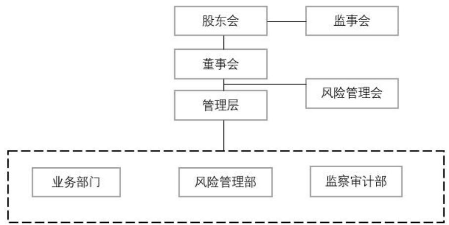

# 第三章A 公司客户信用风险管理现状及问题分析

# 3.1A公司简介

A公司于1999 年11月正式成立，主营业务为图书出版物的零售领域。作为中国早期建立的B2C 购物平台之一，它始终遵循“提供更多的选择和更低的价格”的原则，致力于为消费者带来丰富的图书选项和有竞争力的价格。公司以商品品类丰富多样、价格合理实惠著称。公司致力于增强购物的便捷性，精简购物流程，加快配送速度，并不断优化服务质量，以确保顾客能够获得一个愉悦的购物体验。同时也积极利用电子商务平台开展线上线下一体化的营销活动。经历了多轮的战略调整后，该公司的经营模式已从完全自营转变为自营加第三方企业的联营入驻，其经营范围也从最初的图书零售扩展到了综合百货销售。

随着电子商务行业的快速崛起及国内电商市场的不断成熟与完善，公司逐渐意识到传统零售渠道的优势并开始尝试向新渠道进行扩张，以寻求更大的发展空间。现阶段，A公司已经将其业务范围扩展到了图书音像制品、数码电子产品、美妆服饰和日常生活用品等多个方面，实现了商品种类的多样化。随着电子商务时代的到来，公司不断加大对电商平台建设的投入，积极推进全渠道运营。2010年12月8日，A公司成功地在美国纽约证券交易所上市，这标志着它成为了第一个在美国上市的基于纯线上业务的中国B2C 在线商城。在上市的第一天，该公司的股价表现非常出色，开盘价高达24.5 美元，比发行价上涨了 $53 \%$ ，甚至一度达到了30.08 美元的高点，市盈率突破了百倍，创下了当时中国概念股市市盈率的最高记录，市值一跃超过23 亿美元。在短暂的繁荣之后，A公司的股价经历了剧烈的下跌，一度降至4.81美元，降幅高达 $8 6 . 8 \%$ ，随后的股价更是长时间停留在大约10 美元的低位。这让投资者们对公司未来发展产生担忧，认为其经营前景堪忧。在2015年7月9日，面对市场的压力，A公司公布了其核心领导团队提交的初步非强制性私有化提议。在2016 年的9月21日，A公司成功地从纽约证券交易所退出市场，并转型为一家由私人控股的企业。A公司，作为中国最早建立的B2C 购物平台之一，尽管在最近几年还在运营中，但其整体业绩只能说是勉强达到及格标准，未能满足市场的普遍期望。目前国内电商平台的竞争日趋激烈，电商巨头纷纷进入网络领域，对传统实体零售商形成巨大冲击。

A公司的2023 年全渠道销售额达百亿元人民币，全年销售整体增速为 $5 \%$ ,抖音店铺增长超 $30 \%$ ，拼多多店铺增长 $1 1 \%$ 。2021-2023 年三年间，收入复合增速 $7 2 . 2 \%$ ，毛利率逐步提升至 $22 \%$ 左右，但 2023年前三季度收入增速下降为 $52 \%$ ,毛利率大幅下降至 $1 5 . 6 \%$ 。费用率2023 年以来基本稳定在 $2 1 - 2 2 \%$ 。其中配送费用为 $12 \mathrm { - } 1 3 \%$ ，销售费用为 $3 . 5 \%$ 左右;技术和内容费用 $2 . 5 \%$ 左右。从总体财务数据上来看 2021、2022 年虽然盈利，但 2023 年前三季度再次亏损。

虽然A公司作为全球规模最大的中文在线书店，在我国的图书零售领域占据了超过一半的市场份额，但作为一个多功能的在线购物平台，其市场份额相对较低。根据网经社电子商务研究中心发布《2023 年AppStore 中国免费榜（购物）TOP100》中数据，A公司国内整体电商平台客户端下载量排名 23，在综合电商领域排名第九位，不仅落后于拼多多、淘宝、京东等老牌一线平台，还落后于小米商城、苏宁易购、唯品会等平台[52]。

而根据 2023 年电诉宝受理的全年真实用户投诉案例大数据分析，A公司所被投诉的内容主要存在于涉嫌存在虚假发货问题、物流问题、网络欺诈、虚假促销、退款问题、霸王条款等问题。曾出现商家尚未按时发货但是消费者显示完整物流信息且确认收货的情况，甚至出现平台商家利用A公司店铺平台进行诈骗活动的行为[53]。导致A公司在其核心业务：图书销售方面也无法再保持绝对领先，根据“一带一路”TOP10影响力社会智库网经社电子商务研究中心2023 年的发布的《五大电商平台买书评测报告》中表明，从价格、正品保障、售后服务、物流时效、优惠力度五个方面对淘宝，京东，拼多多，抖音，当当这五大电商平台进行多维度评测，得出拼多多得4.4分，排名第一；京东得4.3分，排名第二；抖音得4.1 分，排在第三；淘宝得3.5 分，排名第四；当当得3 分，仅排名第五[54]。如何改善平台客户体验，加强平台管理，进一步一提升营业额和市场占有率，成为了A公司现阶段所面临最严重的问题。

# 3.2A 公司客户信用风险管理体系

# 3.2.1 A 公司组织架构

A公司组织架构设计包括董事会、CEO、COO、职能支持中心、服务链管理中心、数据信息中心、产品中心、运营中心、市场中心等六大核心中心，各个部门各司其职共同推动公司的稳定发展。

董事会作为公司的最高决策机构，由一群经验丰富的行业专家和资深管理者组成。他们不仅具备深厚的商业洞察力和战略眼光，还对公司业务有着深入的了解。董事会定期召开会议，对公司的关键决策和策略规划进行审查，以确保公司的成长方向与市场的需求和竞争状况高度匹配。

首席执行官（CEO）承担了多重角色，他是董事会与各个部门之间沟通的桥梁。作为CEO，需要负责执行董事会的各项决策，并全权负责公司的日常运营。此外，CEO 还需要密切关注市场的最新动态和竞争状况，以及时调整公司的战略方向和业务运营模式，以更好地适应市场的变化。

公司运作基础部门为各大职能支持中心。它包含了行政管理部、人力资源部和财务部等多个部门，各部门分别对公司的日常行政活动、员工招聘与培训以及资金管理等任务负责。这些子部门以其高效的运作方式，为公司的其他业务提供了稳定而可靠的支持。

服务链管理中心是企业物流、仓储、配送等供应链管理任务的核心所在。该机构主要职责是整合供应商、仓储设施以及物流公司等多个资源，确保产品能够准时、按量且按照质量准时到达客户。服务链管理中心通过优化物流流程、增进配送效益等措施，持续减少运营开销以增加客户满意度。

数据信息中心负责公司全部的数据管理和分析。其主要职责包括搜集、保存、解析和挖掘各种公司数据，并为决策提供支持，同时提供业务优化建议。

运营中心负责全面管理公司的仓储物流，并承担客户售后服务接待、订单处理、追踪和结算等职责。该中心负责协调公司所有运营活动，确保公司能够高效有序的运行。此外，运营中心还负责与用户互动并进行沟通，积极汇集用户反馈和建议，为公司产品和服务质量提供改进方向。

市场中心的主要任务是推进公司的品牌宣传和市场拓展活动。它通过各种营销手段和渠道，提升公司的知名度和影响力。市场中心负责制定并执行市场推广计划，组织各种线上线下活动，并与寻找合作方建立合作关系，共同探索市场新机会。

  
图3-1A公司组织架构图

# 3.2.2 A 公司客户信用风险管理机构设置及权责划分

A公司根据自身的业务需求和运营实际情况，已经建立了一整套风险管理组织结构，其中明确规定了董事会、监事、管理层、风险管理部、监察审计部以及其他相关业务和管理部门在执行责任时的具体职责和任务（见图3-2）。

  
图3-2A公司信用风险管理组织架构

（1）管理层职责

在A公司的管理层得主要任务是统筹风险管理得整体工作。需要依据董事会的风险管理策略和政策，制定公司的风险管理策略、流程和方法，并定期检查和监控执行情况。此外，他们需要全面了解公司得风险管理现状，并定期向董事会提交风险管理报告，建立公司内部的风险管理制度，以全面控制和管理公司内部得各项业务，保证风险管理工作得以有效实施。

# （2）执行机构的职责

在风险管理的执行方面，A公司分为事前、事中和事后管理流程，分别由业务部、风险管理部以及监察审计部负责，这些部门负责日常的风险管理任务和监督。其中，业务部承担着对公司所有业务活动进行事前管理的职能。A公司在其各个业务部门都指定了负责风险管理工作的人员并提供培训工作，保障风险管理部门建立的内部控制机制以及各种制度、流程和方法得到妥善的执行；对部门进行风险的分析和评估；根据评估结果采取适当措施降低风险损失等。对可能出现的风险事件提出预警报告。在获得批准之后，制订并执行部门的风险管理策略；加强对重点风险源的监控与控制。在高风险事件发生之后，应迅速实施相应的危机处理措施；需要及时上报关于风险的监控、事件以及管理的成果，并周期性地向风险管理部门进行汇报。

A公司的事中管理由风险管理部来具体执行。其主要任务包括：对风险管理的政策、策略和核心流程进行研究并提出建议；构建公司的主要风险指标框架，并为风险监测部门提供指导，同时发布风险预警信息；进行风险管理体系建设完善计划研究；日常对公司的风险进行评估并提交报告；对公司的风险管理体系进行了有效性分析，并给出了相应的补救方案；对公司员工进行风控培训。

A公司风险管理体系事后管理由审计部负责，负责对每年出现的重大风险问题以及公司风险管理结构的完整性和有效性进行审计评价、报告和监管。审计人员可以利用公司内部控制制度评价报告，通过分析企业风险管理制度中存在的不足和缺陷，提出改进建议。

在A公司的客户信用风险管理执行体系中，各个部门设计了不同的管理功能，以下是各个部门的管理功能。

（1）风险管理部

风险管理团队是A公司客户信用风险管理链条中最重要的一环，其下设在运营中心，主要负责制定和执行客户信用管理政策，进行数据的管理和分析，评估和审核客户的信用申请，指导销售部门执行公司的信用管理规定、催收帐款、预防客户欠款风险和减少公司货款损失。

风险管理团队通过深入研究市场环境和客户特性，制定出相应的风险管理政策，帮助规范公司的风险管理流程，防范潜在的信用风险。在执行过程中，团队也会根据市场部门和业务数据的反馈对企业风控机制进行调整和优化。数据管理与分析也是信用风险管理团队的主要工作之一。通过对客户信用数据、交易记录等信息的收集、整理和分析，构建客户信息数据库，团队客户的信用状况进行评估，为公司的管理决策提供支持。此外，风险管理团队还会与销售部门沟通，指导其执行公司的风险管理规定。他们会对销售部门的风险管理工作进行监督和检查，确保其严格遵守公司的政策要求，并协助销售部门处理客户的问题，确保公司的利益得到最大程度的保障。

# （2）数据中心

负责开发和维护日常公司风险管理系统，接收和存储运用中心所提供的客户信息，配合风控部门建立客户数据库并提供技术支持

# （3）运营中心

主要负责吸引新的客户和订单，搜集并分享客户的基本和财务数据，配合风控部门和数据中心构建客户资料库。通过对客户信用状况的分析和评估，发现潜在问题，采取适当措施防范信用风险。在出现风险预警的情况下，应及时通知风险控制部门介入，以实现及时的控制。通过对应收帐款的管理可以帮助企业实现快速响应市场变化，减少库存积压。当客户的应收账款出现逾期情况时，有责任

紧随其后进行货款的催收工作。

# （4）法务部

法务部将负责提供法律支持，这包括但不仅限于合同的复审、业务合规性的审查，以及在逾期账款出现纠纷且未得到解决的情况下，由信用团队和销售团队进行跟进和催收，如果没有取得任何有效结果，将会启动法律诉讼程序。
