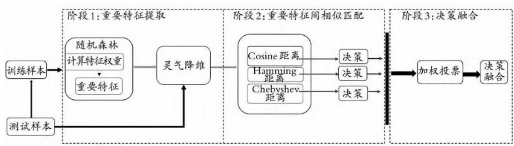
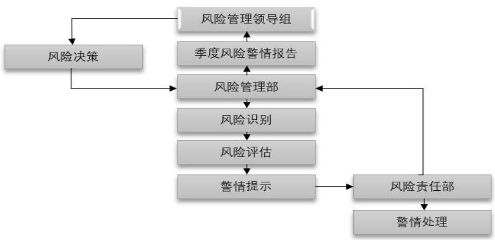
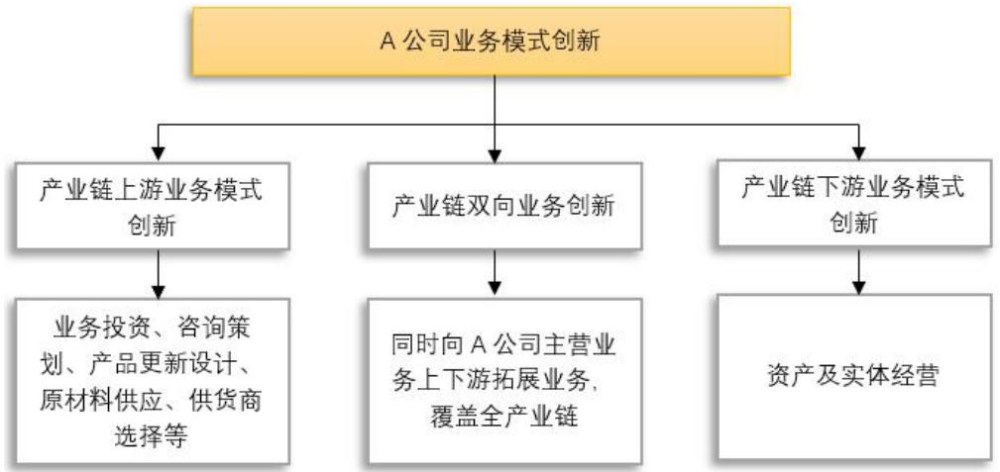

# 3.3A 公司客户信用风险评估流程

# 3.3.1 客户基础信息收集

客户信用风险管理流程的首要步骤是客户基础信息的收集。为了构建完整的客户信息视图，平台会通过App、网页引流等多种渠道和方式主动和被动的对客户基础信息收集。

在主动收集方面，用户在注册时被要求提供个人信息，包括姓名、身份证号码、联系电话、电子邮件地址等，建立客户的使用账号，同时形成一份独立的客户档案。这些信息构成了用户的基本身份认证，确保了后续交易的可追溯性和安全性。

在被动收集方面，APP 端通过跟踪用户的购物历史、点击行为和交易记录等方式，实时记录用户的行为数据。其中购物历史记录包括用户购买的商品、购买频率和金额等信息。这些数据为公司提供了深入了解客户购物习惯和偏好的基础。

除了个人身份信息外，在客户通过授权的情况下APP 端还会记录用户的地址信息和支付方式等，有助于方便用户后续的使用，同时还可以记录客户的支付偏好，同时为后续风险管理提供参考依据。为了确保数据的真实性和有效性，平台会在用户注册时进行验证，包括短信验证、邮箱验证、人机验证等，确保用户信息真实有效，减少虚假信息对后续工作的影响，提高数据库可信度。

# 3.3.2 数据处理

一旦客户基础信息在 APP 端被收集，这些数据会被传送至公司的信息技术部，该部门主要负责对这些非结构化的数据进行全面处理，保证数据的质量和可用性。

数据处理的第一步是数据清洗，通过自动化算法和人工审核，排除数据中的重复项、错误信息以及不完整的记录。第二步是针对客户基础信息的格式化，确保所有数据都符合公司内部设定的标准格式。这包括统一的日期格式、地址格式

等，以方便后续的统计和比较分析。

整理数据的过程涉及到将不同数据源的信息进行整合。将来自APP 端、线上平台、实体店等多个渠道收集到的客户信息融合成一个全面、一致的客户信息视图。

通过整合来自不同渠道或系统的客户信息，公司可以获得更全局的视角，深入了解客户的多维度行为和特征。这样的整合不仅有助于提升客户体验，也为风险控制部提供了更全面的数据基础。

这个整合后的客户信息视图是公司实施客户信用风险管理策略的基础，为公司提供了更全面、准确的客户画像。这有助于提高信用评估的精准度，使公司更有效地预测客户潜在的信用风险。

# 3.3.3 客户信息数据库构建

经过信息技术部的清洗和整合，整理完毕的客户数据将被存储到一个专门的客户信息数据库中。这个数据库的设计旨在保存客户的基础信息，同时还能满足数据及时更新和补充。

该公司的客户信息数据库是一个动态存储系统，能够根据客户的交易活动、购物行为和支付记录等实时更新，准确反映了客户当前状态。这个数据库具备高效的数据查询和处理能力，采用的数据库管理系统，可以在大量客户数据中快速准确地检索和分析信息。为了保障数据的安全性和完整性，客户信息数据库实施了访问控制和加密机制。只有经过授权的人员才能访问和修改数据库，以确保客户敏感信息不被非法获取。

这个客户信息数据库不仅是信用风险管理的核心数据仓库，也为公司的其他业务提供了重要的参考。通过综合分析客户的历史行为和当前状态，公司可以更好地了解客户需求，优化运营策略，实现精细化的用户管理。

在客户信息数据库的基础上，公司可以建立用户画像，利用这些画像进行个性化推荐、定制化服务，提高客户满意度，并进一步巩固客户忠诚度。因此，这个数据库不仅是信用风险管理的支持工具，更是公司整体运营的智能化基石。

# 3.3.4 内部信息平台整合

A公司搭建了一个内部信息平台，是一个关键的数据集成和共享枢纽，将来自不同业务部门和渠道的客户数据整合在一个集中的、可访问的平台上。这个平台的存在促进了公司内部各部门之间的紧密协作和信息共享。这个内部信息平台扮演着一个连接各业务单元的桥梁角色，从风险控制部、信息技术部到运营部，每个部门都可以共享并访问客户数据，为他们的业务决策提供全面而实时的信息支持。该平台采用数据仓库 $+$ 云服务器的架构，以支持大规模数据存储和处理需求。通过这种方式，公司能够在一个集中的地方存储大量的客户信息，为综合性的数据分析提供基础。

内部信息平台提供用户信息管理界面，以便员工能够直观地访问和理解客户数据。界面可以根据用户的角色和权限进行定制，使不同部门的员工能够获取到他们所需的信息的同时保护客户隐私不被泄露。

利用此平台，风险控制部门可以实时获取的顾客信用评价数据，信息技术部门可以了解数据的质量和系统的功能表现，而运营部门则根据客户的具体行为进行精细化运营。这种全面的数据共享和集成后台有助于提高公司对客户信用风险的整体把控水平，使得各部门更有能力迅速响应市场变化和客户需求。

# 3.3.5 客户信用风险量化评估

风险控制部利用内部信息平台提供的数据，利用风险评估模型和算法对客户的信用状况进行量化评估。在模型的搭建过程中首先进行特征工程阶段，它涉及特征的提取、选择和转换三个主要方面。在特征提取阶段，根据评估需求和数据特点，从原始数据中提炼出对信用风险评估有重要影响的关键特征。在特征选择阶段，通过相关性分析、方差分析等方法，筛选出对模型性能贡献最大的特征，排除冗余或无关特征，以提高模型的预测精度。在特征转换阶段，A公司根据模型需求，对特征进行必要的变换，如离散化、标准化或归一化，以增强模型的泛化能力。

接下来是模型的构建与训练。在决策树模型的构建中，利用提取和选择后的特征集作为输入，通过递归地选择最优特征进行分割，生成决策树的各个分支，直至满足预定义的停止条件。在随机森林模型的构建中，采用 bootstrap 抽样方法从训练数据中随机抽取样本，并在每个决策树的节点中仅考虑部分随机选择的特征进行分割，以增加树之间的差异性。通过构建足够数量的决策树并集成它们的预测结果，形成具有强大预测性能的随机森林模型。

完成模型构建后，需要对其进行评估和优化。通过交叉验证、留出法等方法对模型性能进行全面评估，计算准确率、召回率、F1值等指标，来检测和评估模型的表现。同时，对模型的预测结果进行分析和回溯，找出可能存在的问题和误差来源，并据此对模型进行优化调整。优化过程包括调整模型参数、改变特征选择方法和尝试不同的模型结构等多种方式，以提高预测精度和稳定性。

最后，A公司将优化后的模型应用于实际的客户信用风险评估中，同时对其应用效果进行监控，关注模型的表现，定期评估其性能，及时进行数据更新和模型迭代。而根据市场环境和客户特征的变化，也会对模型的训练产生较大的影响，因此A公司也会基于此类数据特征对模型进行更新和维护，以确保其始终保持较高的预测性能。

此外，风险控制部也会与外部信用评估机构合作，获取客户例如芝麻分、微信信用分等外部数据以获取更多客观的信用信息，从而提高评估的全面性和精准性。通过综合内外部数据，风险控制部能够更全面地了解客户的信用状况，为公司制定有效的风险管理策略提供支持。

  
图3-3模型评估流程

在最终的评估结果中，A公司将客户分为了从S 级到D 级的不同信用等级，每个等级代表了客户的信用质量。并且针对不同质量的客户在营销水平、服务质量上会有一定的差异。

表3-1A公司客户服务对策  

<table><tr><td rowspan=1 colspan=1>信用等级</td><td rowspan=1 colspan=1>对策</td></tr><tr><td rowspan=1 colspan=1>S级</td><td rowspan=1 colspan=1>提供高级别的VIP服务，包括专属客服、定制化商品或服务、优先权利等。定期推送个性化的优惠和促销活动。</td></tr><tr><td rowspan=1 colspan=1>A级</td><td rowspan=1 colspan=1>持续提供稳定的服务和产品，关注提高忠诚度和转化率。推送针对兴趣爱好或购买历史的个性化推荐。</td></tr><tr><td rowspan=1 colspan=1>B级</td><td rowspan=1 colspan=1>提供标准化的服务和产品，鼓励再次购买。通过折扣券、积分活动等方式吸引再次购买，并鼓励加入会员或订阅服务。</td></tr><tr><td rowspan=1 colspan=1>C级</td><td rowspan=1 colspan=1>限制享受一些优惠活动或服务，加强风险监控，防止潜在欺诈行为。采取措施保护其他客户和平台利益。</td></tr><tr><td rowspan=1 colspan=1>D级</td><td rowspan=1 colspan=1>限制在平台上的活动，采取措施保护其他客户和平台利益。可能会暂停账户或甚至封禁账户等处罚措施。</td></tr></table>

# 3.4A 公司客户信用风险管理的问题

公司在正在面临市场占有率下降、销售利润下降和客户投诉增多等方面的问题。为了优化业务水平，提高营业额和市场占有率，企业需要从客户信用风险管理角度进行评估和分析，寻找其存在的问题，从而进行整体优化改良。

# 3.4.1 客户信用风险管理体系不健全

结合A公司的组织结构和职能划分，其中问题在于风险控制部仅仅是运营部门下设的一个分支机构，这导致了其在公司架构中的地位和权限相对较低。由于缺乏足够的独立性和权威性，风险控制部难以对公司的整体业务线进行全面的信用风险把控。

由于风险控制部作为运营部门的附属机构，其在获取和分析客户信用信息时受到一定的限制，运营部门在日常工作中会更加关注业务的开展和和成交量的数据而忽视了客户信用风险的评估和管理。这导致风险控制部无法获取到全面、准确的客户信用信息，影响了风险评估的准确性和有效性。

风险控制部在决策和执行风险管理措施时还会受到上级部门或业务部门的干扰和影响。由于其地位相对较低，风险控制部在和其他业务部门出现冲突时难以坚持其独立的风险评估结果和风险管理建议，甚至出现被迫妥协或放弃对某些高风险客户的控制和管理。

如果出现这种情况，公司的客户信用风险管理将受到极大的限制和干扰，难以发挥其应有的作用。不仅如此，由于风险控制部缺乏足够的权限和等级，其他部门之间的沟通和协作有的时候也存在一些障碍，其他部门对风险控制部的建议和措施出现过出现阳奉阴违的情况，忽视了风控部的风险提示和预警。这种沟通不畅和协作不力的情况更会进一步削弱公司的客户信用风险管理能力。

此外，A公司还缺乏对信用风险的全面认识和深刻理解。信用风险不仅仅是一个单一的风险点，而是与公司的业务发展、客户关系、资金流动等多个方面紧密相连。因此，仅仅从单一的角度去管理信用风险是远远不够的，需要建立全流程的信用风险管理体系。全流程的信用风险管理体系指在客户信息搜集、存储、信用评估、风险控制到风险预警等全方位的信用风险管理体系，每一步都应有明确的管理制度和流程，确保风险管理的连续性和有效性。但是A公司公司没有建立全方位的信用风险管理框架，而是只关注了其中的某些环节，导致管理过程的不完整和不系统。

公司也未能建立起一个全面的数据分析体系，未能充分挖掘客户信息中蕴含的潜在风险信号，从而限制了对信用风险的深入了解和把控。导致企业在制定风险管理策略时无法充分参考客户信息资源。客户数据包含了丰富的信用评估要素，这些都能为风险管理提供有力依据。由于缺乏对客户信息的深入挖掘和分析，企业在制定策略时往往基于主观判断或经验，导致策略与实际情况脱节，难以有效应对风险。

由于受管理层决策的影响，该企业的风险管理意识相对薄弱。无论是高层管理人员还是基层员工，都缺乏对客户信用风险管理重要性的认识和理解。这种弱化的风险管理意识加剧了各部门之间在风险管理方面沟通与合作的不畅，日常经营中对风险的忽视，增加了潜在信用风险的发生概率。

综上所述，该公司的信用风险管理体系存在缺陷，管理框架不完善。在这种情况下，公司的客户信用风险管理将难以发挥其应有的作用，对公司的业务稳定和发展前景构成潜在威胁。因此，公司应重新审视风险控制的战略地位，建立健全完善的风险评估体系，并确保其发挥应有的作用。

# 3.4.2 客户信用风险评估能力不足

A公司该企业在客户信用风险管理上存在在信用风险管理评估能力不足的问题。

第一，根据传统的随机森林和决策树模型在处理复杂的客户数据时的特性，通常采用“一刀切”的方式处理所有数据。随着客户交易行为的多样化和复杂化，数据特征之间的关系也变得更加复杂，因此该类型模型无法适应数据中的噪声和异常值，从而影响模型的性能和精度，致使风险评估的结果不够精确。而数据规模的不断扩大也会带来更多的困难，传统的随机森林和决策树模型需要大量的计算资源和时间来训练模型，将会大幅度提高训练和迭代成本，限制其在处理大规模数据时的应用。导致传统的随机森林和决策树模型在处理复杂的客户数据时会显得力不从心。

第二，这类模型的可解释性相对较差。在信用风险评估领域模型的输出结果需要能够给出明确的解释，以便于业务人员和风险管理人员理解。但是随机森林和决策树模型在输出决策结果时，会出现难以给出直观、易于理解的解释结果的现象。这会导致业务人员在理解和应用模型结果时存在一定的困难，也会导致模型应用范围的受限。

第三，现有的模型无法充分利用现有数据中的时间序列特性。客户的交易数据往往具有较强的时间序列属性，现有的模型对这些时间序列特性缺乏足够的处理能力，无法充分利用这些数据中的信息。如果能有效地利用这些特性，可以更好地捕捉数据中的长期依赖关系，从而更准确地评估客户的信用水平。

当前在现阶段行业中比较先进平台的信用风险评估模型已经采用了更复杂的算法和技术，包括深度学习模型、集成学习方法等，以更精准地刻画用户信用风险。其中，具有代表性的模型包括：

深度神经网络（DNN）：深度学习技术能够从大量的高维数据中提取层次化的抽象特征，构建更复杂的非线性映射关系，从而更精准地刻画用户信用风险。

长短时记忆网络（LSTM）：特别适合于处理时间序列数据的深度学习算法，可以有效捕获序列数据中的长期依赖关系，并应用到客户行为预测中。

集成方法进阶（XGBoost,CatBoost等）：这些基于梯度提升的集成算法在处理稀疏特征、处理类别特征和避免过拟合方面具有更高的效率与更强的能力。

此外，为了提升模型的可解释性，最新的方法强调自动化特征选择和模型透明度的构建。更为常见的是基于 SHAP 值进行特征重要性分析，结合简单模型如逻辑回归以获得可理解的输出。另外，一些先进的信用风险评估模型还采用了对抗学习和鲁棒优化等方法，以提高模型在复杂和噪声环境中的性能。这些方法可以更好地应对欺诈行为、恶意攻击等挑战，提高模型的鲁棒性和准确性。

# 3.4.3 评估结果应用不足

A公司在客户信用风险管理方面也存在无法充分利用评估结果进行有效的利用的问题。尽管企业在客户数据收集和整理方面付出了努力，通过APP 端主动和被动地收集了大量客户信息，包括个人信息、购物历史、交易记录等也建立了客户信息数据库，但在实际的风险管理工作中，这些宝贵的客户信息资源并未得到有效利用。

在获得了大量客户信息和信用风险评估结果后，但是A公司未能将这些信息用于开展有针对性的客户信用管理措施。不同客户具有不同的信用状况和风险特征，因此需要针对不同客户制定个性化的信用管理措施。但是该企业在日常经营工作中往往采取一刀切的方式，对所有客户采用相同的风险管理策略和标准。公司担心坏账问题不可控，从而仅仅是在客户服务或优惠券发放中进行了一定的区分，没有根据信用评级对客户实施信用额度授信，让客户采用信用消费或先用后付等形式，提前锁定市场份额，从而支撑销售和市场占有率。这导致了公司没有发挥出手中数据的实际价值，用以提升客户使用满意度和降低风险。

企业在日常风险管理工作中也未能有效的利用客户信息资源对风险事件进行实时监控和预警。客户信用状况是动态变化的，需要持续关注和更新。由于企业客户信息资源关注不足，有时会无法及时获取和更新客户的信用信息，导致风险管理工作存在滞后和盲区。这增加了潜在风险的发生概率，也降低了企业对风险的应对能力。

# 第四章 行业客户信用风险管理经验分析

在电子商务迅猛发展的当下，B2C模式作为企业与个人消费者间商品或服务交易的主要渠道，其诚信体系建设情况对于整个行业的健康发展至关重要。本文选取了电子商务行业龙头企业，详细分析了其在客户信用风险管理中的优势和做法，为A公司和电子商务平台的客户信用风险管理体系的搭建和能力的提升提供了经验。

# 4.1 电子商务平台信用管理制度构建

在电子商务平台的信用风险管理中，制度建设作为顶层策略，对于诚信体系的进步起到了不可或缺的引导角色。随着我国网络购物市场规模不断扩大，电子商务信用问题日益凸显。为确保电商平台能够稳定运作并充分保护买家和卖家的权益，各大电商平台都制定了一系列详细的管理措施，包括商家的入驻资格、商品信息的发布、商品质量的管理、解决争议和纠纷以及营销管理等方面[5]。

在B2C 商业模式中，像淘宝网、京东商城、亚马逊、eBay 这样的主流电商平台都建立了一套完整的管理规则。这些规则不仅要求商家在入驻时提交真实的营业执照、企业法人身份证等资质证明，以确保商家信息的真实性，还针对品牌店铺提出了更为严格的要求，为了打击伪劣产品并维护知识产权，需要提交如商标注册书和授权书等相关文件。

电商平台对其产品的质量也进行了严格的管理，为此制订了一系列严格的准则和操作方法。商户在销售过程中，有义务严格遵循平台上公布的商品规定，并确保所出售的商品品质达标。如果检测到商品质量受损，平台会根据既定标准对商户作出调整，从而保障消费者的合法权益。网站在商品信息的公布和描述上要求商家提供确切和详尽的产品详情，并严格禁止任何虚假的宣传或误导消费者。这将帮助消费者做出更加明智的购物选择，从而减缓由于信息不对称带来的潜在危险[56]。

在解决交易问题时，电商平台始终遵循以事实为主和证据至上的原则，以确保为买家和卖家提供一个公正且公平的争议解决方法。该平台利用调解、仲裁等手段，能有效应对交易期出现的各式难题，确保市场秩序与稳定性。

除此之外，在商业广告和营销策略方面，电子商务平台也有着非常严苛的准则。商业实体有义务严格按照国家的法律规章以及各种平台上的广告推广手段来操作，严禁发布不实的广告作品或者从事恶意的市场竞争活动。这样做有助于维持市场内的公正竞争格局，进而推动电子商务行业向健康发展的方向进步。

通过对各大电子商务平台的制度建设进行全面的分析，我们可以观察到它们在建立诚信体系方面已经形成了一个相对完善的制度框架。这套制度覆盖了商家、产品、知识产权、品牌以及交易纠纷等多个领域，为平台的稳定运行和交易双方权益的保护提供了强有力的制度支持[57]。

不仅这套制度包含公司内部的各个部门，还包括第三方支付机构、消费者协会、信用评级公司以及其他相关组织一同对客户信用风险进行的约束和监督。这些建立的制度对商家的行为进行了规范，确保了商家和商品信息的真实性，也为消费者创造了一个安全且可靠的购物场所。这些制度安排在促进交易双方建立信任关系和推动电子商务诚信体系的发展方面起到了十分重要的作用。

# 4.2 淘宝网客户信用风险管理经验分析

电子商务平台所采用的信用管理模式组成了一个全面的体系，包括信用调查、信用评估、信贷授权以及其他各种信用服务等多个方面。信用管理系统的核心思想是通过建立一个科学且合理的信用评估体系，对客户的信用状况进行全方位和客观的调查，并根据客户的信誉状况为其提供合适的信用服务。

# 4.2.1 优秀客户信用管理系统

淘宝网以其卓越的信用风险管理能力和创新的实践，为整个行业树立了标杆。首先，淘宝网在客户信用风险管理方面的优势体现在其强大的数据整合与分析能力上。淘宝网拥有海量的用户数据，包括交易记录、用户行为、评价反馈等，这些数据为信用评估提供了丰富的素材[⁸]。通过对这些数据进行深度挖掘和关联分析，淘宝网能够建立起一套全面而准确的信用评估模型。这一模型不仅考虑了用户的交易历史，还融入了用户的社会属性、网络行为等多个维度，从而实现了对用户信用的全面评价。在此之上淘宝网在技术手段上不断创新，提升了信用评估的准确性和效率。淘宝网采用了先进的机器学习和人工智能技术，构建了基于协同过滤推荐模型、神经网络模型、关联规则挖掘模型等方式的智能信用评估模型，能够实时更新客户的信用评分，并对异常交易进行预警。这种智能化的信用评估方式不仅提高了评估的准确性，还大大降低了人为因素的干扰，使信用评估更加客观、公正。

淘宝网在业务场景的丰富性上也为客户信用风险管理提供了大量的数据支持。淘宝网借助阿里巴巴体系下丰富的全领域业务布局来获取用户数据，其数据来源不仅拥有电商业务，还涉及金融、物流等多个领域。

这种跨业务场景的信用管理使得淘宝网能够更全面地了解客户的信用状况，为信用评估提供更多的信息和依据。例如，在金融领域，淘宝网通过对客户的支付、借贷等行为进行分析，能够更准确地评估客户的信用状况；在物流领域，通过对客户的发货、收货等行为进行监控，能够及时发现潜在的风险问题。

# 4.2.2 完善的客户信用评价体系

在拥有了全方位的数据收集基础上淘宝网建立了一套完善的信用评估体系。这个体系涵盖了用户的交易历史、行为记录、评价反馈等多个维度，通过对这些信息的综合分析和评估，能够得出一个相对准确的信用评分。平台在客户信用风险管理的流程中采用这个评分作为基础。

淘宝网还拥有非常有力的风险监控系统和风险预警机制，平台利用技术手段和大数据支撑对交易行为进行实时监控，一旦发现异常交易或可疑行为，系统会立即进行风险预警并采取相应的处理措施。这种实时监控和预警机制能够及时发现并处理潜在的风险问题，保障用户的权益和平台的稳定运营。

淘宝网的信用评估是一个综合、多维度的过程。以下是淘宝网进行信用评估的主要步骤和考虑因素[59]：

（1）交易历史与行为分析：淘宝会记录并分析用户的交易历史，包括购买和销售的商品、交易金额、交易频率等。还会考虑用户的购物行为，如是否经常给予评价、是否积极参与平台活动等。

（2）用户评价与反馈：在客户进行的评价之后淘宝会将评价内容作为依据来进行客户信用评估。淘宝会考虑买家和卖家之间的相互评价，以及用户对交易的满意度。积极、正面的评价通常有助于提升用户的信用等级。

（3）违规记录与处理：如果用户存在违规行为，如欺诈、售假、恶意评价等，淘宝会进行相应的处理并记录在案。这些违规记录会对用户的信用评估产生负面影响。

（4）实名认证与认证信息：淘宝要求用户进行实名认证，并提供相关的认证信息。淘宝网需要对用户信息的真实性进行核验，保证数据真实有效，提高数据的可靠性。

（5）其他因素：除了以上因素外，淘宝还会考虑其他非交易因素，如用户的活跃度、与其他用户的互动情况等，来综合评估用户的信用状况。

基于以上因素，淘宝会为用户生成一个信用等级或信用分数。这个等级或分数会在用户的个人页面中展示，供其他用户参考。淘宝还会根据用户的信用状况提供相应的权益和服务，如信用贷款、优先客服等。

淘宝网实施了用户信用奖惩机制，针对不同信用评级结果采取不同的措施。对于信用良好的用户，平台给予奖励，例如提高信用额度、享受优先服务等；而对于信用不良的用户，平台则采取相应的惩罚措施，如限制交易、降低信用等级等。通过采取相对应的奖惩机制，客户会感受到平台对信用水平的重视程度，推动客户在日常使用中更加注意自己的信用相关行为，从而维护了平台的信用秩序，提高了安全性。

这种差异化的服务也可以提升用户体验，提高用户粘性，对于信用良好的用户，平台提供的奖励措施和优先服务能够增强他们的忠诚度和满意度；而对于信用不良的用户，平台通过限制交易等措施能够保护其他用户的权益，维护平台的公平性和公正性。这种差异化的服务策略使得用户能够享受到更个性化、高质量的购物体验。

由于平台对用户的信用状况有清晰、准确的了解，能够筛选出优质客户，从而平台有能力为其提供更为个性化、优质的服务。有特色的个性化服务吸引了更多信用水平优秀的客户群体，使得商家更愿意在淘宝平台上开展交易。同时，消费者也更倾向于在信用评估机制完善的平台上购物，因为他们可以更加放心地进行交易。更多的交易提供了更多的数据，能够让淘宝网对客户信用水平有更加精确的评估，形成良性循环。由此淘宝的交易规模屡创新高，成为行业交易规模最大的平台之一。

淘宝网的信用风险管理也促进了平台的可持续发展。通过维护良好的信用秩序和降低交易风险，平台吸引了更多的商家和消费者入驻，扩大了用户规模和市场份额。客户信用风险管理也为平台提供了更多的商业机会和创新空间，其业务和销售模式可以反哺其集团旗下的其他板块，推动了整体的持续发展和创新。

# 4.3 拼多多客户信用风险管理经验分析

信用风险管理作为企业管理中重要的组成部分之一并不是独立存在的，如果仅仅是为了做风险管理而做的话就失去了构建有效客户信用风险管理体系的根本意义，其需要服务与业务、产品销售和商业模式创新，从而才能发挥其本质作用，提升业务水平，综合提高企业核心竞争力。

拼多多作为中国领先的社交电商平台，近年来在客户信用管理方面取得了显著成果。其充分利用先进的信用评估系统，不仅提升了用户购物体验，也为商家提供了更加安全、高效的交易环境。特别是拼多多在其强大信用管理能力的基础上联动业务模式创新，推动业务链条发展，助力销售，支撑市场占有率。尤其是信用消费和赊销业务方面的积极探索与实践，展现了其对于客户信用管理的深刻

理解和创新应用。

# 4.3.1 信用消费业务的拓展

拼多多在业务模式上大力开展信用消费业务，建立了先进信用评估系统为其开展信用消费奠定了基础。该系统通过综合运用大数据、人工智能等先进技术，对用户的历史交易记录、支付行为、购物偏好等多维度信息进行深度挖掘和分析，从而得出精准、全面的信用评分。这一评分不仅反映了用户的信用状况，还为平台提供了开展信用消费和赊销业务的可靠依据[6°]。

基于这一信用评估系统，拼多多大力开展信用消费业务。对于信用评分较高的用户，拼多多提供一定额度的信用消费额度，用户可以在平台上先消费后付款。鉴于拼多多是以消费降级、小额低价的方式进行发展，其一部分消费者群体的现金流不是十分充裕，因此这种消费方式既满足了用户的即时购物需求，又降低了用户的购物门槛和经济压力。采用此种方式可以有效提前锁定用户，有效占领市场。同时，拼多多还通过优化信用消费流程，简化申请手续，提高审批效率，为用户提供了更加便捷、高效的信用消费体验。通过开展信用消费拼多多不仅提升了用户体验和平台粘性，还促进了业务的快速增长。

拼多多在开展信用消费时，由于有大量的应收账款存在，导致其坏账风险较高，对平台的客户信用风险控制能力是一个巨大的挑战。曾经拼多多出现过大量使用不当理由的客户申请仅退款不退货而登上新闻，此类风险事件标志着信用风险管理对其业务的重要性。拼多多为了解决这个问题，建立了相应的信用评估结果风险预警机制，对用户的信用评分进行实时监测和分析，使其能够及时发现潜在的信用风险，如欺诈行为、恶意退货等，并采取相应的风险防控措施。这种风险预警机制能够帮助拼多多对风险信号进行提前识别和对交易中的风险问题进行有效处理，保障交易能够安全和顺利进行。不仅如此，拼多多还于外部第三方数据机构和监管机构合作，保证信用评估体系能够有效运行[61]。

# 4.3.2 优化上下游供应链管理

拼多多通过信用评估结果优化供应链管理，实现了更高效可靠的商品流通和配送，为用户和商家提供了更好的购物和交易体验。

拼多多会对入驻平台的商家进行信用评估，确保合作伙伴的质量。通过对供应商的信用状况进行深入了解，拼多多能够筛选出具有良好信誉和稳定供货能力的店铺作为合作伙伴。在进行信用评估时会考虑店铺的资质和规模、历史交易记录、用户评价等多维度数据。与信用评估等级高的店铺合作，能够降低商品质量风险，提高供应链的稳定性。

拼多多充分利用了信用评估结果来优化其仓储和库存管理。通过对用户信用评估结果的分析，尤其是针对其自营店铺或者官方店铺，拼多多能够预测不同用户的购物需求和偏好，从而精准地规划库存和仓储布局。对于信用评分较高的用户，拼多多增加热门商品的库存量，以满足其高效购物需求；而对于信用评分较低的用户，则相应调整库存量，降低滞销和库存积压的风险。这种基于信用评估结果的库存管理策略使得拼多多的仓储和库存更加合理高效，提升了供应链的响应速度和运营效率。

拼多多还能够根据信用评估结果对其物流配送体系进行优化，以优化用户使用体验。根据用户的信用评分和购物记录，拼多多会为信用评级高的用户量身定制个性化的配送方案，如选择合适的配送时间和方式，为客户提供更加便利的交易服务。拼多多还与物流公司合作，根据信用评估结果调配配送资源，提高配送效率和服务质量。例如，对信用评分较高的用户，拼多多优先安排配送，确保订单更快送达；而对信用评分较低的用户，则加强订单监控和管理，保障配送过程的可靠性和安全性。

综上所述，拼多多在信用评估结果的实际商业应用方面展现出了多样化的方法和策略。拼多多通过开展信用消费、精准营销、优化供应链管理以及业务创新等措施提升了用户体验和平台粘性，也促进了业务的快速增长和可持续发展。体现了拼多多在客户信用风险管理能力中对业务场景的应用方面的独特优势和创新精神。

# 第五章A 公司客户信用风险管理能力提升措施

# 5.1 提高客户信用风险管理战略高度

# 5.1.1 客户信用风险管理意识的加强

A公司需要从公司层面明确信用风险管理的重要性，并将其纳入整体战略和日常运营中。更新管理理念，提升信用管理在战略上的重视程度，加强信用风险管理意识有助于企业建立完善的风险评估体系，及时发现并应对潜在风险。这可以降低坏账率，减少经济损失，提升企业的整体风险抵御能力，确保业务的稳健发展。企业还能够借此树立良好的商业形象，提升企业声誉水平，从而增强市场竞争力。加强信用风险管理意识不光对企业自身有利，也能够促进整个市场的健康发展，通过规范市场秩序，打击恶意逃债、欺诈等不法行为，可以维护市场公平和公正，保障消费者的合法权益。

公司应将信用风险管理视为核心工作，确保所有员工都充分认识到这类工作的重要性。企业可通过定期组织信用风险管理培训，邀请业内专家授课等方式来提升员工对信用风险的认识和应对能力。还可以通过内部培训、案例分享等方式，加强员工对信用风险管理政策的理解和执行能力。企业更需要将信用风险管理纳入到企业文化建设中，通过制定相关规章制度、设立奖惩机制等方式，引导员工自觉遵守信用风险管理规定，形成全员参与、共同维护的良好氛围。

# 5.1.2 加强企业客户信用风险管理人才储备

随着业务规模的扩大和技术水平的创新，企业面临着越来越复杂的客户信用风险，加强人才储备企业将会拥有更多具备专业知识和技能得高水平人才以应对接下来的发展。这些人才拥有建设企业信用体系的能力，能够帮助企业实现具备高水平的客户信用风险管理能力的目的，企业可以更好地实现稳健、持续的发展。

这就要求企业能够根据人才需求与定位，制定详细的人才引进计划。企业人事部门牵头，通过招聘网站、人才市场、猎头公司等渠道发布招聘信息，积极寻找符合条件的信用风险管理人才。企业还可以与高校、研究机构等建立合作关系，实现产学研相结合，共同培养信用风险管理领域的专业人才。为了有能力留住优秀的客户信用风险管理人才，企业需要提供具有竞争力的薪资待遇、福利待遇，还需要有完善的激励机制和晋升通道。

# 5.2完善客户信用风险管理体系

基于前文分析，A公司存在风险评估体系不健全得问题，在客户信用风险管理上无法形成有效闭环。为了提高客户信用风险管理能力，A公司必须完善客户信用风险管理体系，从制度上保证客户信用风险管理的有效运行。

# 5.2.1 明确客户信用风险管理组织架构的层次与职责

A公司应当把信用风险管理组织架构的层次明确下来，确保每个层级都有规定的职责范围。

决策层由公司高层领导组成，负责制定信用风险管理战略和政策，以及审批重大信用决策。执行层由信用管理部门和其他相关业务部门组成，负责实施具体的信用风险管理措施，包括客户信用评估、信用额度授予、风险监控等。监督层由内部审计或风险管理部门担任，负责对信用风险管理工作的执行情况进行监督和评估，确保各项措施得到有效执行。

表5-1A公司信用风险管理组织架构  

<table><tr><td colspan="1" rowspan="1">层级</td><td colspan="1" rowspan="1">组成</td><td colspan="1" rowspan="1">职责</td></tr><tr><td colspan="1" rowspan="3">决策层</td><td colspan="1" rowspan="3">公司高层领导</td><td colspan="1" rowspan="1">制定信用风险管理战略、政策和原则</td></tr><tr><td colspan="1" rowspan="1">审批重大信用风险决策</td></tr><tr><td colspan="1" rowspan="1">监控信用风险管理整体绩效，及时调整策略</td></tr><tr><td colspan="1" rowspan="4">管理层</td><td colspan="1" rowspan="4">信用管理部门负责人及其他相关部门中层管理人员</td><td colspan="1" rowspan="1">根据决策层的战略指导，制定具体的信用风险管理措施和操作流程</td></tr><tr><td colspan="1" rowspan="1">协调各部门间的信用风险管理活动，确保信用风险管理工作的顺利进行</td></tr><tr><td colspan="1" rowspan="1">定期向决策层报告信用风险管理情况</td></tr><tr><td colspan="1" rowspan="1">监督执行层的工作质量和效率</td></tr><tr><td colspan="1" rowspan="5">执行层</td><td colspan="1" rowspan="5">信用管理部门的专业人员、业务部门的信用风险管理专员等</td><td colspan="1" rowspan="1">执行信用评估、信用额度授予、风险监控等具体工作</td></tr><tr><td colspan="1" rowspan="1">收集和分析客户信用信息并及时更新客户信用信息，确保信息的准确性和完整性</td></tr><tr><td colspan="1" rowspan="1">信用评估模型的建立、维护和迭代优化</td></tr><tr><td colspan="1" rowspan="1">处理信用风险事件</td></tr><tr><td colspan="1" rowspan="1">监控客户信用风险变化，并向上级报告信用风险状况</td></tr><tr><td colspan="1" rowspan="3">监督层</td><td colspan="1" rowspan="3">内部审计部门</td><td colspan="1" rowspan="1">对信用风险管理工作的合规性、有效性进行监督和评估</td></tr><tr><td colspan="1" rowspan="1">定期审查和审计信用风险管理流程并提出改进建议</td></tr><tr><td colspan="1" rowspan="1">发现和纠正信用风险管理中的违规行为确保信用风险管理工作的透明度和公正性</td></tr></table>

通过构建清晰的信用风险管理组织架构并明确各层级的职责，A公司可以确保信用风险管理工作的有序进行，提高管理效率，降低信用风险。同时，也有助于增强公司内部各部门之间的沟通与协作，形成合力共同应对客户信用风险。

# 5.2.2 确保客户信用风险管理部门独立性

为加强信用风险管理工作的专业性和独立性，A公司需要设立独立得信用风险管理部门，将其作为公司组织架构的重要组成部给予足够的权限和资源。

该部门直接向公司高层汇报，其领导团队应当由具有丰富风险管理背景和深刻行业洞察力的专业人士组成，成员应具备信用评估、风险分析、信贷审批等方面的专业知识。独立的信用风险管理部门需要具备一定程度上的决策自主权，使其能够独立于其他业务和运营部门，进行客观、全面的风险评估。

通过明确部门职责和高效的沟通机制，信用风险管理部门会长期服务于公司整体的利益，统筹公司整体信用风险管理流程，最终促进公司长期可持续发展。

表5-2信用风险管理部门职责  

<table><tr><td rowspan=1 colspan=1>主要职责</td><td rowspan=1 colspan=1>具体內容</td></tr><tr><td rowspan=1 colspan=1>信用评估与审批</td><td rowspan=1 colspan=1>该部门负责制定和执行客户信用评估标准和方法，完善和优化信用风险评估模型，及时关注行业内最新前沿技术及时迭代模型，对潜在和现有客户进行全面的信用评估，并根据评估结果决定是否授予信用额度及具体额度大小。同时，负责审批信用相关的交易和业务，确保风险控制在可接受的范围内。</td></tr><tr><td rowspan=1 colspan=1>风险监控与预警</td><td rowspan=1 colspan=1>该部门负责建立和维护风险监控系统，实时监测客户信用状况的变化，包括交易状况、还款记录等。一旦发现潜在风险，及时发出预警并采取相应的风险控制措施，防止信用风险扩大。</td></tr><tr><td rowspan=1 colspan=1>政策制定与更新</td><td rowspan=1 colspan=1>根据市场变化和公司战略调整，该部门负责修订和完善信用风险管理政策、制度和流程，确保其与公司的整体发展目标和风险承受能力保持一致。</td></tr><tr><td rowspan=1 colspan=1>跨部门协调与沟通</td><td rowspan=1 colspan=1>作为信用风险管理的核心部门，该部门需要与其他业务部门保持密切沟通，协调信用风险管理工作的实施，确保各部门在信用风险管理方面的协同作战。</td></tr><tr><td rowspan=1 colspan=1>培训与知识分享</td><td rowspan=1 colspan=1>负责组织和开展信用风险管理相关的培训和知识分享活动，提高全体员工的信用风险管理意识和能力。</td></tr></table>

# 5.3优化客户信用风险评估体系

在建立了完善的客户信用风险管理体系的基础之上，还需要对A公司的客户信用风险评估体系进行优化，通过优化其客户信用风险评估体系，让A公司有能力对客户进行高效、准确、实用的客户信用风险评估和管理。在优化内部客户信用风险评估体系的过程中企业需要从整体视角进行调整和构建，包括建立标准化客户信用风险评估流程、优化客户信息数据库和对评估模型的优化与迭代等。

# 5.3.1 建立标准化客户信用风险评估流程

在深入识别客户信用风险之前，首要的任务是全面分析那些可能引发风险的相关因素，并基于这些分析作出初步的风险推断。对于关键风险给予重视并进行深入分析，持续不断地收集各类有助于风险判断的证据，确保对每一个风险点都能进行准确的识别。

表5-3客户信用风险识别  

<table><tr><td rowspan=1 colspan=1>管理阶段</td><td rowspan=1 colspan=1>风险点</td><td rowspan=1 colspan=1>关注信息</td></tr><tr><td rowspan=1 colspan=1>业务前</td><td rowspan=1 colspan=1>信息不对称风险</td><td rowspan=1 colspan=1>客户信用</td></tr><tr><td rowspan=2 colspan=1>业务中</td><td rowspan=2 colspan=1>支付风险</td><td rowspan=1 colspan=1>购买情况</td></tr><tr><td rowspan=1 colspan=1>退单情况</td></tr><tr><td rowspan=3 colspan=1>业务后</td><td rowspan=3 colspan=1>财务风险</td><td rowspan=1 colspan=1>逾期情况</td></tr><tr><td rowspan=1 colspan=1>完结情况</td></tr><tr><td rowspan=1 colspan=1>评价情况</td></tr></table>

A公司需要建立一套标准化的风险评估流程，这样可以使不同业务领域和部门间施行统一的风险评估标准。有助于形成全公司范围内的风险数据集成，来提高风险评估得准确性和可比性。标准化流程还可以减少主观性因素的影响，使风险评估更为客观和科学。

（1）客户信息搜集与存储

A公司可以采取多渠道、全方位的客户信息收集策略。通过自身电商平台客户交易记录，A公司能够获取客户在购买商品或服务时的行为，如购买频率、购买金额、退货率等能够能够反映客户的消费习惯和信用状况的数据。并且通过客服部门积极与客户建立联系，采用问卷调查、访谈等方式收集客户反馈，了解客户对公司的满意度和忠诚度。

A 公司还需要与第三方信用数据机构合作，获取客户的征信报告等信用评估数据，包括信贷记录、还款情况等数据，也可以辅助评估客户的信用风险水平，还能从另一个角度检验公司信用风险评估准确性。

（2）客户信用风险评估

A公司需要基于历史数据和业务需求，选择合适的评估指标和算法，构建信用评估模型，对客户数据进行深入分析，最终得出客户的信用等级和风险评估结果。A公司需要对模型进行及时迭代优化，以实现评估得自动化和标准化。

# （3）客户信用风险控制

根据客户的信用等级和风险评估结果，A公司采用制定差异化的客户信用风险控制策略。对于不同信用评估等级的客户，设定不同的交易限额和风险控制措施，确保业务风险与收益得均衡。A公司需要建立相应的风险对策机制，对违约、欺诈等风险事件进行迅速响应和处理，降低直接损失。A公司还可以设立风险准备金制度，为公司提供一定的风险保障。

# （4）风险监控预警机制

A公司应当从公司层面出发，由管理层和风控部牵头构建风险预警指标体系。通过建立实时监控系统，对公司风险状况进行及时察觉、持续跟踪，保证潜在风险出现时能够迅速处理，提高企业对风险的敏感性和应对能力。使公司能够在风险发生前、后都能及时采取预防性和遏制性的措施，最大限度的减少潜在损失。

为实现对客户信用状况的实时监控和预警，A公司需要利用建立起的客户信息大数据库和适应的机器学习模型建立风险预警系统。该系统将对客户信息数据进行实时分析，设定风险预警阈值，当客户信用状况出现异常波动时自动触发预警。收到预警信息后，风控部有能力进行快速核查和分析，并根据实际情况调整交易条件，采取暂停服务或其他风险控制措施。风险控制部门还应当建立季度风险警情报告机制，通过风险管理部门与其他有关部门合作，共同收集关于内部和外部环境的变动、客户交易情况的波动等信息，定期出具风险警报报告。风险管理部门和审计部门需要定期组织对风险监控预警机制的适用性进行评估，确保这个机制能够适应公司的具体情况和市场风险。基于评估的反馈及时给出改进的建议并做出相应的调整，进一步增强机制的实用性和适应性。具体风险监控预警流程如图5-1所示。

  
图5-1A公司风险监控预警流程

# 5.3.2 优化客户信息数据库

客户信息搜集与存储是客户信用风险评估体系的基础，对于确保评估的准确性、全面性和效率性具有重要意义。现有的用户数据库是公司宝贵的资源，其中蕴含着丰富的客户信用信息。需要对其进行优化和深入挖掘，深化和拓宽客户信息数据库的深度和广度。

（1）数据收集与整合

多渠道数据收集：除了传统的APP 信息获取、日常的交易记录等公开信息以外，要加强多方位全面收集客户信息，例如日常收货地址、学历、购买商品价格区间、支付习惯等。通过于企业外的第三方公司合作，从社交媒体、电商平台、公共数据库等多元化渠道收集例如是否办理信用卡、出行方式选择等客户信息。这些渠道可以提供关于客户行为、兴趣、社交网络等多方面的信息，能够建立更加全面、准确的用户画像。

数据整合与关联：数据部门需要把不同来源的数据进行整合，将交易数据、征信数据、社交媒体数据等进行关联和匹配，形成完整的客户信息视图，使得在评估时能够综合考虑各方面的信息。

（2）数据库结构设计与优化

字段选择与优化：风控部和数据部门根据评估需求，选择合适的字段来存储客户信息。对于不必要的字段，可以进行删除或合并，以减少数据库的冗余和复杂性。对于敏感字段，如客户ID、交易金额等，需要进行加密和保护，保证数据安全

索引设计与优化：为常用的查询字段建立索引库，这样可以提高日常使用查询效率。定期分析和优化索引的使用情况，避免索引过多或过大导致的数据库性能下降。

# （3）数据库性能调优

硬件升级：根据数据库的性能需求和储存数据的实际情况，企业需要对硬件设备进行定期评估和维护，设置硬件预警线，在将要达到预警线时及时升级服务器的硬件配置，提升数据库的整体性能和处理能力。

查询优化：对数据库查询语句进行优化，避免使用复杂的嵌套查询和不必要的联合查询。同时，可以利用数据库的查询优化器和分析工具，对查询语句进行自动优化和建议。

# （4）数据备份与恢复

在优化过程中，需要确保数据的备份和恢复机制得到完善。定期备份数据库，并建立灾难恢复计划，以防止数据丢失或损坏对信用风险评估体系造成严重影响。

# 5.3.3 优化评估模型

在当今数字化时代，随着数据量的爆炸式增长和技术的快速发展，是对于电子商务平台这种纯线上交易的应用场景来说，传统的评估方法很难满足复杂多变的客户信用风险评估需求。这就要求企业及时优化信用风险评估模型，引入更加先进高效的技术和评估方法。[65]。

在客户信用风险评估领域，深度学习技术以其强大的数据处理能力和模型自适应性，逐渐展现出显著的优势。对于电子商务平台而言，客户信用风险评价尤为重要，深度学习技术能够有效地处理电子商务平台中海量的客户数据，从而更准确地评估客户的信用风险。

具体优势如下：

（1）自动特征提取与复杂关系建模

深度学习技术能够自动从原始数据中提取高层次的特征表示，无需依赖人工特征工程。在电子商务平台中，客户数据通常包括交易记录、浏览行为、评价信息等多维度信息，深度学习模型能够自动学习这些特征之间的复杂关系，并构建出能够反映客户信用风险的深层次特征表示。

（2）强大的非线性建模能力

客户信用风险的评估往往会涉及多个因素之间的非线性关系，传统的线性模型比较难以分析衡量这些关系。深度学习模型会通过引入非线性激活函数和多层网络结构，构建出强大的非线性建模能力，更准确地描述出客户信用风险的变化规律。

（3）大规模数据处理能力

电子商务平台的日常经营通常会产生有海量的客户数据，包括大量的交易记录、用户行为日志等。深度学习模型能够较为有效的处理大规模的数据集，并从中提取出有用的信息。通过利用这些全方位客户数据，深度学习模型能够全面地评估客户的信用风险。

# （4）具有较强的自适应性

深度学习模型具有强大的自适应性，其优势在于能够根据不同的数据和场景自动调整模型参数和结构，具有适应电子商务平台上的客户信用风险的动态变化地能力。深度学习模型还具有一定的鲁棒性，能够抵抗数据噪声和异常值的干扰，提高评估的稳定性。

这些优势使得深度学习技术成为电子商务平台客户信用风险评价的有力工具，有助于提高评估的准确性和效率。

客户信用风险管理并非一蹴而就的过程，在引入适当的评估方法后，还需要积极收集来自业务部门和客户的意见和建议，对模型进行优化和调参，以进一步提高模型的性能。包括选择合适的网络结构、激活函数、损失函数等，以及通过超参数调优来找到最优的模型配置。此外，还可以利用正则化技术、批量归一化等方法来防止过拟合和提高模型的泛化能力。此外，随着技术的不断进步，新的信用风险管理工具和方法不断涌现。公司应保持对新技术的关注和敏感，及时引入并应用到自身的信用风险管理中。

# 5.4深挖信用风险管理成果价值

客户信用风险管理是公司整体管理体系下的重要组成部分，但是管理体系的建立和成果的输出需要服务于公司整体业务，为公司业务的增长、利润率的提升做出贡献，因此在公司对客户进行了有效的信用风险评估之后需要能够有效的与业务层面进行结合落地，反哺业务层面的拓展与创新才能真正发会客户信用风险管理能力的优势，作用于业务层面和销售层面，综合提高企业核心竞争力。

# 5.4.1业务模式拓展

由于我国人口增长速度的减缓和城市化进程的放缓等多重因素的共同影响，零售电商市场的需求正在发生本质的变化，企业需要根据市场的动态变化，结合信用风险管理能力对其业务模式进行创新，这样可以提高企业的运营效率，增加盈利能力，并减轻现金流的压力。作为以 B2C 业务为主的电子商务平台，其产业链是由选品、运输、配送、售后等诸多环节构成的，如图 5-2 所示，A公司的产品和服务会影响整个产业链，因此可以通过信用评估结果优化供应链管理，实现了更高效、更可靠的商品流通和配送，这使得电商企业的业务创新能够在整个产业链上扩展，并成为公司业务发展的新方向。

  
图5-2A公司业务模式拓展链

为了拓宽服务范围并满足用户在不同场景下的购物需求，A公司需要积极与其他线上或线下商家建立合作伙伴关系，为消费者共同推出跨场景的信用消费服务。用户可以在合作商家处使用平台提供的信用消费额度进行购物或享受服务来享受无缝衔接的购物体验。通过与合作伙伴的合作和共同推广，可以吸引潜在用户，扩大品牌影响力。这种跨场景的信用消费模式提升了平台的综合实力和市场竞争力，为用户带来了更多选择和便利，进一步推动了平台的发展。

# 5.4.2 加入定制化信用额度与灵活授权

在电子商务平台的业务运营中，可以引入了定制化信用额度的策略。通过信用风险评估模型的输出结果，为每个用户生成个性化的信用额度建议。用户只需在平台内简单申请，经过风控平台审核与评估后，便可获得相应的信用消费授权。这种授权机制不仅满足了不同消费者的购物需求，更使得购物过程变得更加灵活和便捷。通过为每位用户量身定制信用额度，能够更精准地锁定高价值用户，有效提高用户粘性和转化率，为平台的长期发展奠定坚实基础。

在引入信用消费等业务场景的过程中，会增加公司现金流压力、坏账风险和供应商收款账期等风险，是对平台信用风险管理能力的挑战，A公司需要要注重风险控制与管理，确保业务的稳健发展。并且能够及时对客户的信用水平进行监控和动态调整，及时发现风险预警信号并做出反应。同时，平台还应制定严格的还款政策，对逾期未还款的消费者进行催收和处理。

为了满足不同消费者的资金需求和还款习惯，A公司可以为高信用水平的客户提供多样化的还款方式，包括一次性还款、分期还款和延期还款等。用户可以根据自己的实际情况选择合适的还款方式，确保在约定的时间内完成还款。与之搭配的可以设立多种激励机制，如提前还款折扣、按时还款积分奖励等，以鼓励用户按时还款并保持良好的信用记录。这些激励机制能够一定程度上提高用户的还款意愿，降低了逾期风险，提高了对企业财务水平和现金流情况，进一步提升了企业竞争力和抗风险能力

为了进一步增强用户的忠诚度和粘性，可以将信用消费与现有的会员体系进行了有机结合。A公司通过为会员提供专属的信用消费权益，如更高的信用额度、更优惠的还款政策以及专属的会员服务等，吸引更多用户加入会员体系。这种结合能够提升会员的消费体验，使会员感受到与非会员的区别，得到差异化服务，这样体系会变得更加有吸引力和竞争力。会员还可以通过累积积分和升级会员等级，可以进一步提升自己的信用消费权限和优惠幅度，从而形成一个良性循环，促进用户的长期消费和平台的持续发展。

# 第六章 客户信用风险管理的启示

随着信息技术的迅猛发展，电子商务行业正面临着前所未有的机遇与挑战。客户信用风险管理作为电子商务平台运营的核心环节，其重要性日益凸显。为加强公司对信用风险的应对能力，特别是在面对环境的激变时，必须在风险管理方面做出前瞻性的设计。依托信息化建设，如何构建以客户信用风险管理为导向、以增加客户服务价值为目标、以完善客户治理为目的的客户信用风险控制管理模式，已成为电子商务平台提升竞争力、实现可持续发展的关键。

# 6.1 对行业发展的启示

# 6.1.1 构建行业信用文化

电子商务行业作为全球经济的重要引擎，其快速发展改变了传统的商业模式，引领着新一轮的商业变革。但是客户信用风险问题逐渐凸显，对行业的健康发展构成潜在威胁。电子商务行业需要强化信用风险管理意识、构建行业信用文化来应对行业的整体风险。

强化行业信用风险管理意识有助于提升电子商务行业的整体形象和信誉。在消费者日益注重购物体验和信誉度的今天，一个具有良好信用管理体系的电子商务行业能够赢得消费者的信任和忠诚，能提升整个行业的形象和声誉。有助于增加客户体验吸引更多的客户参与到行业中来，从而增强行业的市场竞争力和发展的驱动力，推动行业的良性发展。

信用文化的形成需要行业内各企业共同遵守信用规则，形成相互信任、合作共赢的良好氛围。在这样的环境下，企业间的竞争将更加公平、有序，行业内的资源配置也将更加合理与高效。这样能够推动行业内企业之间的合作与共赢，形成良好的商业生态，奠定了企业长期、稳定发展的基础。

在全球化的背景下，电子商务行业已经成为一个国际性的市场。在这样的市场中，信用成为企业间合作的重要基础。一个具有良好信用文化的电子商务行业，将更容易获得国际市场的认可和信任，从而在国际竞争中占据有利地位，可以提升我国电子商务行业的国际竞争力。

# 6.1.2 加强行业信息共享与联动

在电子商务行业的客户信用风险防控体系中，信息孤岛现象一直是一个难以忽视的问题。信息孤岛会导致企业内部各部门之间、企业与外部机构之间信息流通不畅，更使得整个行业在客户信用风险防控上缺乏统一、高效的应对机制。在这一大背景下，加强信息共享与联动，提升行业风险防控能力显得非常重要，具有深远的启示意义。

在风险日益复杂多变的今天，单一企业对于做到对客户的信用风险进行识别和评估风险的成本较高。通过加强信息共享与联动，行业内的企业可以共同构建风险数据库、风险预警系统等，实现风险信息的实时共享和联动处置。通过共享客户信用信息、交易数据等关键信息，企业能够更深入地了解客户的信用状况、交易习惯以及潜在风险，做出更加明智的决策。行业这种做法能够帮助所有企业及时发现和应对潜在风险，提升整个行业的风险防控效率和水平，降低行业系统性风险，提升企业的市场竞争力。

在高度竞争的市场环境下，企业间的合作与共赢成为行业发展的必然趋势。通过加强信息共享与联动，企业可以更加深入地了解彼此的需求和优势，开展更加紧密的合作与协作。并且在信息共享的基础上，企业可以更加清晰地了解彼此的优势和需求，进而开展更加紧密的合作关系。这种合作模式可以提升整个行业的运营效率和服务水平，也能够推动行业在技术、产品、服务等方面的创新与发展。

加强信息共享与联动、提升行业风险防控能力对电子商务行业具有深远的宏观启示意义。因此，电子商务行业应积极探索和实践信息共享与联动的新模式、新机制，为行业的健康、稳定发展提供有力保障。

# 6.2 构建智慧管理体系

# 6.2.1 明确客户信用风险管理目标与原则

管理目标的设定应紧密结合企业的战略发展目标和市场环境。具体而言，智慧客户信用风险控制管理的主要目标应包括：一是降低信用风险发生率，减少因客户违约而带来的经济损失；二是提高风险管理效率，通过智能化手段实现对客户信用风险的快速识别与处置；三是优化客户服务体验，通过精准评估客户信用状况，为客户提供更加个性化的服务。

为了实现这些目标，需要确立一系列的管理原则。首先是风险导向原则，即制度的设计和实施应始终以风险为核心，全面识别、评估和控制客户信用风险。其次是数据驱动原则，强调利用大数据、人工智能等先进技术对客户信用数据进行深度挖掘和分析，为风险管理提供有力支持。第三是智能化决策原则，倡导通过智能化手段实现客户信用风险的自动识别和预警，提高决策效率和准确性。最后是动态调整原则，要求根据市场环境和业务变化，动态调整信用风险管理策略和措施，确保制度始终保持有效性和适应性。

在明确管理目标与原则的基础上，需要进一步构建智慧客户信用风险控制管理制度的框架和具体内容。制定详细的管理规定和流程，明确各部门在客户信用风险管理中的职责，建立信用风险管理委员会等组织架构，确保制度在公司内部能够顺利实施和有效运行。

通过明确管理目标与原则，企业为智慧客户信用风险控制管理制度的构建奠定坚实基础，有效应对客户信用风险带来的挑战，保障了企业的平稳发展。

# 6.2.2 提升全员客户信用风险管理意识

客户信用风险管理意识涵盖了企业对客户信用风险的警觉性、对客户风险管理措施的执行力以及对客户信用风险文化的认同感等多个方面。一个具备高度客户信用风险管理意识的企业，往往能够主动识别潜在风险，积极采取措施进行防范和控制。

具体而言电子商务平台可以做到以下几点来培养企业的信用风险管理意识

（1）提高认识，强化意识

全行业应充分认识到客户信用风险管理在保障企业稳健运营、降低经济损失、提升市场竞争力等方面的重要作用。将客户信用风险管理纳入企业长期发展战略，明确其在企业经营管理中的核心地位。并通过企业内部宣传、培训、案例分享等方式，普及信用风险管理知识，提高员工对信用风险管理的认识和理解。同时，倡导诚信经营、合规操作的理念，形成全员参与、共同维护风险管理文化的良好氛围。

（2）建立长效机制，持续培养

企业需要实际情况和业务发展需求，来制定长期的信用风险管理意识培养计划。明确培养目标、内容、方式和时间安排，确保培养工作的系统性和连贯性。采用多种培养方式和手段，如在线课程、专题讲座、研讨会、实践演练等，以满足不同员工的学习需求。定期评估员工的信用风险管理意识水平，关注他们的成长和进步。建立有效反馈机制，鼓励员工提出意见和建议，不断的优化培养方案。

（3）强化激励与约束，确保落实

企业应建立完善的激励与约束机制，对于在信用风险管理方面表现突出的员工，应给予物质和精神上的奖励，以激发他们的积极性和创造力。对于忽视或违反信用风险管理规定的员工，应给予相应的惩罚和警示，以维护风险管理的严肃性和权威性。建立健全信用风险管理工作的监督和考核机制，定期对各部门和员工的信用风险管理工作进行检查和评估。通过考核结果的反馈和应用，推动信用风险管理意识的深入落实和持续改进。

# 6.2.3 加强数据安全管理

数据安全是所有电子科技类行业的红线，如果发生了客户信息泄露、滥用等情况，不仅仅对行业的声誉是一个很大的打击，也有可能触犯国家的相关法律法规，企业陷入更深的泥潭之中。

保障数据安全需要建立完善的数据管理制度，从制度上、流程上保证数据的安全性。建立数据责任制度，明确各部门和人员在数据管理中的职责和权限，确保数据的准确性和完整性。这就需要采用可靠的加密算法和安全证书，对数据进行加密存储和传输，防止数据泄露和非法访问。同时建立密钥管理制度，对加密密钥进行严格管理和保护，从物理层面防止密钥泄露和滥用。

企业应建立严格的访问控制机制，确保只有经过授权的人员能够访问和使用客户信用数据；建立数据使用审批制度，对数据的使用进行审批和记录，确保数据的合规性和安全性；实施多因素身份验证和权限认证，对访问人员进行身份验证和权限审核，所有记录进行留痕操作，防止未经授权的访问和数据泄露。

在数据备份和恢复方面，企业应制定建立数据恢复机制，对数据进行定期测试和演练，确保在紧急情况下能够迅速恢复数据，保障业务的连续性定期对客户信用数据进行备份，确保数据在丢失或损坏时能够迅速恢复。除了技术层面的保障外，还需要加强员工数据安全意识。企业应定期开展数据安全培训活动，提高员工对数据安全的认识和重视程度。培训内容可以包括数据安全政策、数据泄露风险、安全操作规范等，使员工了解数据安全的重要性，并掌握正确的数据操作方法。

# 6.2.4 完善风险预警系统

在搭建智慧客户信用风险控制管理体系的过程中，需要优化风险处理流程。通过精细化、系统化的流程优化和策略制定，企业能够更迅速、准确地识别客户信用风险，制定应对措施，并有效执行，让客户信用风险事件的发生对企业正常运营的影响降到最低。

企业需建立风险预警系统，该系统应实时监测客户信用数据的变化，涵盖客户交易行为、财务状况、行业环境等多维信息。设定合理的风险阈值和预警规则，自动识别潜在风险信号，并触发预警机制。预警通知应及时准确地发送给相关部门和人员，确保他们及时获取风险信息，为后续的风险应对提供决策支持。

针对不同类型和级别的风险事件，企业需要指定差异化的对应策略。对于高风险事件，应优先采取紧急措施进行风险控制，如暂停交易、冻结账户等，以防止风险进一步扩散。针对已发生的风险事件，企业应制定风险缓释方案，包括与客户协商解决方案、提供担保或寻求第三方支持等，以减轻风险对企业运营的影响。企业还应根据风险性质和级别，建立风险分类和优先级排序机制，确保高风险事件得到优先处理。

在此基础之上为了进一步提升风险应对能力，企业还需要建立跨部门的风险管理团队或工作小组，确保各部门在风险处理过程中能够形成合力，提高应对效率。小组通过定期召开会议、共享风险信息、制定协同工作计划等方式，加强部门间的沟通与协作。建立流程监控机制，对风险处理流程的执行情况进行定期评估和改进。

# 6.3 建立全流程客户信用风险评估体系

完善的信用评估体系可以通过收集和分析客户的信用信息，对客户的信用状况进行全面、准确的评估。能够使企业及时发现潜在风险客户，避免与信用状况不佳的客户进行交易，从而降低坏账风险和经济损失。

# 6.3.1.建立全方位的客户数据库

重视基础数据的收集并形成有效的数据库，是确保信用评估准确性的基础。只有掌握了客户的基本信息、财务状况、历史交易记录等数据，才能对客户的信用状况进行准确评估。

要实现信用风险实时监控，关键是基础数据的实时更新和收集。通过实时收集客户的最新数据，企业可以及时发现客户的信用风险变化，并采取相应的风险控制措施。

（1）标准化数据收集：行业内部可以制定相对统一的数据收集标准，各个企业在进行基础数据收集的时候能够采用标准化的格式，这样可以减少数据重复收集的成本和数据处理的难度，提高了数据的可比性和可用性。

（2）多元化数据来源：在保证数据来源合法合规的基础上，除了客户自身提供的数据外，行业还应积极开拓多元化的数据来源渠道，如公共信息平台、行业协会等，全方位的客户数据来源能够为行业带来更准确的客户画像和信用风险信息。

（3）建立数据共享机制：为了实现数据的有效共享和利用防止信息孤岛，行业内部可以建立数据共享机制。通过共享平台或合作协议等方式，企业可以共享彼此的基础数据资源，打破数据壁垒，促进行业良心发展。

（4）强化数据质量控制：在数据收集、存储和使用过程中，企业应加强数据质量控制，建立完善的数据校验机制、定期清理冗余和错误数据等措施。

（5）引入先进技术工具：在客户信用评估领域，相对滞后的评估方法往往对数据的挖掘和使用不够充分，导致评估结果可能不够准确和全面。电子商务行业作为信息技术应用的领先行业，应当积极开发和引用更加先进的技术工具来辅助企业更高效地处理和分析大量数据，提高数据库的利用价值和效率。

# 6.3.2 实施个性化的信用服务

个性化的信用服务策略强调以客户为中心，根据客户的实际风险情况和业务需求，提供定制化的服务方案。这种策略打破了传统的一刀切的风险管理模式，通过深入了解客户的信用状况和需求，行业可以统一标准为客户量身打造一系列具有吸引力的管理方案，更加符合客户的实际需求，有助于提升客户满意度和忠诚度，从而建立更加稳固的客户关系。行业可以形成独特的市场竞争优势，有助于行业将整体蛋糕做大，从而利好整体大环境。

差异化的客户风险管理策略还有助于行业优化资源配置，提高风险管理效率。通过对不同客户进行差异化的风险管理，行业可以更加合理地整体分配风险管理资源，避免资源的浪费和重复投入。促进各个企业之间的协同合作，形成合力，共同应对风险挑战。

针对信用等级较高的优质客户，电子商务平台可以推出联合VIP会员服务。这些会员可以同时获得多家电子商务平台的如购物折扣、优先配送、专属客服等一系列会员特殊服务。这些会员通常具有较好的信用水平和经济水平，将类人群吸引起来形成聚落效应，能够大大增加优质客户群体的粘性，进一步激发客户的购物热情，促进客户的长期忠诚。

对于信用等级适中但具有发展潜力的客户，此类客户通常有稳定收入但现金流并不充裕，行业可以提供其在多个平台的灵活的信用额度调整服务。根据客户的购物历史、还款记录以及行业趋势等因素，可以动态调整客户的信用额度，以满足其日益增长的购物需求。这种灵活的信用额度管理能够提升其购物体验和消费能力，也能够在多平台的支持下降低单个平台的违约风险。还可以结合客户的信用等级，提供差异化的还款方式和期限，例如对于信用等级较高的客户，平台可以提供更长的还款期限和更灵活的还款方式，如分期付款、延期还款等。这样可以减轻客户的现金流压力，带来行业更多的业务量和利润，也能够降低逾期和坏账风险。

除了上述服务外，电子商务行业还可以进一步拓展个性化的信用服务范围。例如，针对有特定需求的客户群体，如企业用户、海外买家等，可以推出定制的信用服务方案，满足其独特的购物和融资需求。利用大数据和人工智能技术，对客户的信用行为进行深度挖掘和分析，从而为客户提供更加精准、个性化的信用服务建议。

