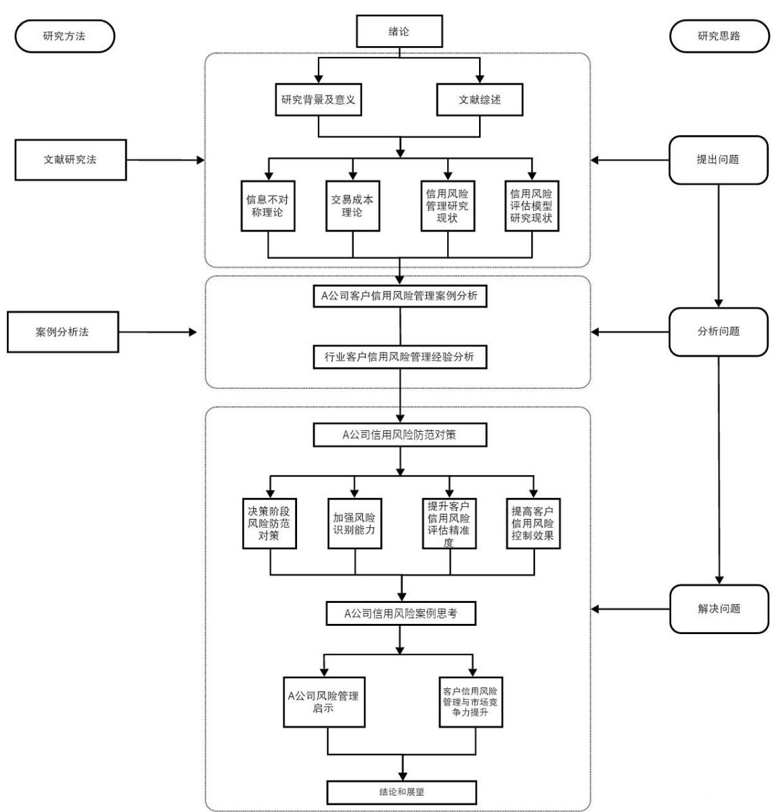

# 第一章 绪论

# 1.1研究背景与意义

# 1.1.1研究背景

在市场经济存在客户信用风险是正常的，也是必然的。各行各业对于客户信用风险这一经济活动中的常态问题都极为审慎[]。从我国多年来的发展趋势来看，各种经济活动中不确定性的增加和风险因素的扩大无疑是一个重要变化趋势[2]。电子商务交易作为经济活动的重要组成部分同样面临着潜在的客户信用风险。目前，电子商务行业客户信用风险研究已经成为国内外众多专家学者关注的焦点，并且已经取得了不少有价值的研究成果。伴随着电商行业的不断演进，存在许多领域值得深入研究。尤其是从信息不对称的视角出发，电子商务行业面临着明显的客户信用风险问题[3]。在过去的几年中，电子商务的在线平台也经历了深刻的转型，电子商务的应用已经渗透到社会生活中的各个层面。伴随着技术的不断创新，网络的建设成本大幅下降，基础设施的建设速度加快，电子商务的运营状况也得到了显著的提升[4]。此外，在当今的电子商务市场中，安全技术低、法律不完整的现象的出现大大增加了交易成本，如产品质量和运输方式，甚至更有可能出现在线交易欺骗[5]。因此，风险越来越严重，逐渐成为电子商务发展的极大障碍。当前，电子商务客户信用风险问题突出，严重影响了电子商务的发展和经济效益的提高。为了维护一个和谐、公平的网络环境，我们需要从多个角度来审视信用风险，从管理和制度层面等相关领域入手，建立电子商务信用机制。因此基于这种情况，对电子商务企业客户信用风险进行分析是有其必要性的。

# 1.1.2 研究意义

（1）理论意义

从理论探讨的视角出发，资本在市场经济中被视为信用的核心，它在某种程度上有助于信用的形成并催生新的资本形态。但是信用风险具有流动性和隐蔽性的特点，在经济活动过程中，由于交易距离遥远而产生的间接和不确定因素增加了交易成本。信用的存在对电子商务的发展起着重要作用。在电子商务交易过程中，买家和卖家之间存在着虚拟现实的距离，这使得风险成为电子商务活动中不可或缺的因素。同时，对电子商务公司客户信用风险进行分析，也有助于丰富现

有理论研究。

# （2）实践意义

从实际市场研究的视角出发，电子商务交易的行为充满了不确定因素。由于在线平台的交易者能够充分利用地域优势来进行交易，增加了不确定性。除此之外，这种信用的缺失有可能导致参与者经济利益受损而带来风险。在监测手段不够完善的情况下，消费者的个人隐私和合法权益可能无法得到充分的保护和维护。这些行为主要表现为虚假身份、产品虚假陈述、取消保修和公开欺诈[6]。作为一个平台的运营者，技术工具在某种程度上被采用以增强安全管理，但在不安全的环境中，信息不对称会对企业和个人造成不同程度的损害。因此，面对电子商务交易中出现的信用风险问题，我们有必要从根本上进行深入的审查。基于上述的背景，我们需要深入了解这些风险的深层原因，从而修正逆向选择的误区、减少道德上的风险，并对电子商务的信用风险进行全方位的审查。通过分析深入研究电子商务中的信用风险，对于制定适应中国特色和机制的信用风险预防措施具有深远的实际价值。

# 1.2文献综述

# 1.2.1国外研究现状

（1）信用管理的相关研究

美国信用管理研究的起源可以追溯到1924 年，当时贝克曼教授发表了《信用和追账的理论与实践》。这标志着信用管理从简单的实际操作逐渐升华为理论的高度。随着时间的推移，这一领域经历了多次理论演进，其中 Bartels Robert在1964 年提出了一种融合营销管理与信用风险业务的创新信用管理理念，这为达成更广范围的销售目标开辟了新的途径[7]。考虑到经济全球化的加速趋势，Lawrence 认为，国际公司在决策时必须重视信用风险评估对公司的潜在影响[8]。研究表明，在制定信用管理决策时，不同的公司更倾向于使用各自的偏好方法。这种情况可能会使企业在做信用管理决策时产生错误的判断。因此，如何有效地实施国际信用管理是当前中国企业面临的重要课题，由此提出了一套专门为国际跨国企业设计的信用管理理念。

信用管理的理论框架在众多实际应用场景中，已经在各种不同的行业和领域得到了广大的采纳和应用。例如，Emeny OnU指出银行在农业贷款中更加关注客户的社会背景与经济特征，而中小型企业通过贷款资格审查从而加强了信用管理能力[9]。信用管理对企业现金流等方面产生深远影响，有助于避免信用交易风险，提高应收账款的回款效率。Abayomi研究了信用管理在中小型企业中的重要性。他指出，信用管理直接关系到中小企业的绩效提升，特别是在处理坏账管理等问题上[10]。进一步的研究表明，很多中小企业的管理层对于信用管理的核心理念并不十分了解，这也是信用风险普遍存在的重要原因。Wu 的研究进一步突出了信用管理在企业现金流中的决定性作用。信用交易作为一种新型交易方式在我国发展迅速，而企业应收账款是企业重要的流动资产之一[]。高效的信用管理有助于企业规避在信用交易过程中可能出现的风险，还能提升应收账款回款的效率，并确保企业有充足的现金流来维持其日常运营活动。

GrzegOrZ提出了一种全新的方法，旨在帮助中小规模企业转变其信用风险的管理模式，进而确保对应收账款的严格管理[12]。这个创新机制为公司构建了一种更为灵活和高效的信用管理方式，以适应商业领域多变的环境。Li的研究重点在于银行的商业活动上，并指明了银行的主导收益主要源于信贷风险领域[13]。随业务规模逐渐扩张，信用危机的风险也在持续上升。他构建了一个新的适应银行贷款管理的模型，该模型采用统计技巧、优化策略和机器化学习方法来帮助银行增强对信用风险的规避和管理水平。这项研究不只是在理论方面带来新颖思考，而且在现实场景中它也显得具有很大的实践价值。这些研究均突出了信用管理观点经久不衰的特性和其广泛应用的价值，尤其是在中小型企业以及银行业务的实际运用中[14]。经过深度研究与不断的技术创新，我们发现信用管理理论已为企业提供了多方面的实用工具和策略，旨在应对日益复杂的商业状况以及持续变化的信用风险。

# （2）信用风险评估相关研究

国际学者在信用风险研究领域主要聚焦于风险识别这一方向。在国内，关于信用风险评估的实证研究较少。在对企业信用风险进行评估的过程中，Fitzpatrick通过深入的调查和分析，选取了19 家公司的相关数据作为研究对象，并构建了一个单变量分析模型[15]。研究发现，在对企业信用风险进行评估时，股东权益与负债以及净利润与股东权益的财务关系表现得相当出色。

Beaver 的研究在企业信用评估这一领域运用了单变量的研究手法，该研究主要集中在企业信用评估的各项指标上[16]。这种方法通过特定的评价指标，可以准确地评估企业的运营状况，并为每一项指标设定合适的标准值，进而为信用评价提供更加详细的方向。这种研究方法强调了在制定信用评估体系时，对于特定指标的有针对性考量的重要性。另一方面，Fantazzini和 Figini 的研究则聚焦于德国大量小微型企业的信用风险评估。通过对相关数据的深入分析，研究得出逻辑回归模型在小微型企业信用评估中更为合适的结论[17]。此模型的优点是它能够综合考虑多种因素，从而为我们提供更为精确的预期数据。因此，对微小型企业进行信用风险评估时，使用逻辑回归模型被认为是一种更高效的策略。Laura Vigno的研究成果为小型和小企业信用风险管理提供了一种用于判别分析的方法以及信用预警的模型体系。该模型的执行是为了在早期识别出可能的危险性，从而协助微型企业能够及时地施行相应行动来避免潜在的经济损害[18]。综观全局，这些研究呈现出多种不同的方法和策略，以突出在信用评估这一领域里如何灵活地采用多样化的研究工具和模型，旨在提升评估准确性和应用价值。

（3）关于电子商务信用风险评估体系的相关研究

电子商务的信用风险评估体系实际上是从普通企业的信用风险评估中衍生出来的，但两者之间有着显著的不同之处。电子商务信用是一种以“信用”为核心的新型商业信用形式，其信用特征决定了电子商务信用风险评估指标体系必须从一般企业信用风险评估向基于网络经济环境下电子商务信用风险评估转变。Resnick 持有的观点是，电子商务的信用风险评估体系在本质上是信誉管理的一部分[19]。电商公司通过搜集、分析和发布交易用户的行为数据，从而建立和维护用户之间的信赖关系。

约翰·穆迪于1909 年首次采用简单符号表示不同牌号铁路债券的优劣等级随着时间的推移，信用评级逐渐成为金融市场的一项重要实践[20]。

19 世纪 70 年代，随着国际商业银行对客户信用风险管理的加强，商业银行的客户信用评级作为一种新的管理理念开始逐步受到重视[21]。这标志着对信用评级的理论和实践开始进入全新的探索阶段，以更好地理解和管理客户的信用风险。商业银行在信用评级方面的研究还在初步探索中，还没有建立起一个完整且独立的理论框架。这突显了在信用评级领域依然存在许多待解决的理论和实践问题，需要进一步深入研究和探讨。在这方面，美国穆迪公司、标准普尔公司以及代表国际商业银行的J.P.摩根等机构的深入有效研究具有典型意义[2]。明斯基（HymanMinsky）首次提出了信用创造机构的理念，他强调了金融中介所面临的难题可能会影响到经济的每一个环节，从而导致宏观经济的不稳定和危机[23]。明斯基认为金融中介的困境是导致经济危机的重要因素之一，而金融中介机构本身也存在着一些问题，因此需要对其进行改革，以保证金融体系稳定发展。

信用评级在金融体系中发挥着重要作用，而不同领域的信用评估体系存在差异，需要根据具体业务特点进行调整[24]。改进客户风险评估方法与金融脆弱性有关，而信用评级的实践起源于过去一个世纪，并逐渐成为金融市场的标配。商业银行客户信用评级等新管理理念在探索阶段，而先进的技术手段在银行业中得到了应用[25]。最后，一些理论观点强调了信用风险的宏观经济影响以及在金融危机中的预见性问题。

# 1.2.2国内研究现状

（1）信用管理的相关研究

在国内，信用管理的研究相对较晚开始，并且主要是在金融行业内进行的。近年来，我国学者开始注重于企业信用管理的研究并取得了一定成果。伴随着我国经济的迅猛增长和企业对市场竞争日益增强的关心，学界逐步意识到信用管理在商业活动中的核心地位。

在早期的研究中，谢旭强调，通过加强对客户信用的管理，我们能够有效地避免可能出现的赊账风险，同时也能提升应收账款回款的效率[26]。然而，随着我国企业广泛采用信用交易作为主要的商业交易方式，韩金玉和薛玉玲指出，尽管信用交易提高了企业的综合竞争力，但也伴随着潜在的风险。他们指出了许多企业在信用管理上所面临的挑战，如缺少经验丰富的信用管理专家和不完善的信用管理结构，并因此给出了加强信用管理人才培训和体系完善的意见[27]。随着市场经济的持续壮大，信用交易逐步崭露头角，成为主流的交易方式，同时企业对于信用管理的关注也在不断加强。伊晶秋指出，特别是工商企业要在激烈市场竞争中保持竞争优势，必须加强和完善信用管理体系建设[28]。殷建红与胡俏指出，跨国公司在其运营过程中需要考虑到国家级的信用管理、客户信用管理以及合同信用管理[29]。跨国集团的经营与国家之间存在着复杂而微妙的关系。国家级的信用管理对跨国企业的运营产生了最大的影响，这涉及到地方政府的政策、银行制度、法律框架以及经济状况等多个方面。

电商行业的快速发展也引起了专家学者的关注，何慧文和裴振文建议构建科学的电商信用评价体系。在移动社交网络的大背景下，他们构建了一个电商信用评估的信用框架，融合了电信和互联网的数据，为我国的信用管理带来了更深入的研究[30]。这些研究共同强调了信用管理在我国商业运作中的不可或缺的作用，并提出了在面对不断变化的市场环境和竞争压力时，建设完善的信用管理体系对企业长期健康发展的迫切需求。这需要加强信用管理人才的培养，改进管理体系，并密切关注不同行业、特别是电商领域的实际信用管理需求，以确保企业能够灵活应对市场变化，降低信用风险，提升竞争力[31]。

（2）关于电子商务信用风险评估体系的相关研究在国内，电子商务信用风险评估体系的研究主要集中在两个核心领域：

第一个是对信用风险评估指标体系的构建进行探讨，侧重于如何构建合理且高效的客户信用风险管理体系，而第二个方面是对信用风险评估模型的应用进行研究，更侧重如何使用更为先进的模型来预测和监控信用评分。

裴俊选择B2C 电子商务作为他的研究焦点，对影响买家和卖家信用的各种因素进行了详尽的分析，从而进一步完善了信用风险的评估指标体系。裴俊通过对买家的调查问卷分析得到影响卖家信用水平的关键因素——信用评分值。他采用了模糊评价法来计算卖家的信用分数，这为B2C 交易的决策过程提供了强有力的依据[32]。

从另一方面来讲，郭亦涵对国内的几家主流 C2C 电商平台进行了深入的比较研究，并据此构建了一个涵盖产品、服务、信息以及物流质量四大评价标准的电子商务信用风险评价模型[33]。这项研究也深入讨论了在各个指标间分配权重的方法，为评价体系的建立提供了一个更为有序和全面的手段。丛振江采用一种非技术性的分析视点，对中国几个主流的 C2C 电子商务平台的信用风险评估方式进行了深度的探索和讨论[34]。他持有观点，评估信用时不只是要深入了解信用本身的问题，还要密切关注可能影响信用风险大小的各类要素。他对信用风险评估中的关键因子进行了总结，这些因子对评价的结果有着影响，其中包括在一个时期的交易总额和与信用风险评估相关的数据。丛振江透过这一独特非技术性的角度，为我们理解信用风险评估的核心影响要素提供了独到的洞见。

# 1.2.3研究综述

根据现有的研究资料，信用风险的相关研究主要集中在信用管理、信用风险评估和电子商务信贷三个方面。这几个部分分别从不同的视角对信用风险的概念与特征、影响因素及风险控制方法等问题进行了分析和阐述，并对接下来研究的发展趋势提供了方向。显然，随着电子商务的飞速进展，对信用风险评估体系的研究也在不断增加，这包括对信用风险评估的指标体系和模型进行更深入的研究。目前来说，对电子商务客户信用风险评估体系的研究相对较少，研究者大多关注中小企业及个人信用风险评估系统，而对电子商务的信用风险评估研究很少，因此，对于电子商务企业客户信用风险进行相关分析，是有一定的价值的。

# 1.3 研究内容与方法

# 1.3.1 研究内容

本文以电子商务企业客户信用风险管理能力提升为研究对象，着重分析了当前A公司电子商务企业信用风险管理的现状与问题，对A企业在客户信用风险管理上进行了全面和系统的探讨。并借鉴行业优秀企业的先进经验，提出了A公司的客户信用风险管理能力提升措施，并对电子商务行业总结了几点启示。

全文分为七部分:第一部分介绍当前电子商务企业客户信用风险管理的大致情况，并列出本文的研究方法和研究思路。第二部分介绍了关于信用风险管理的相关概念和理论。第三部分分析A公司客户信用风险管理现状与存在问题，剖析A 企业在客户信用管理方面所面临的需求和有待解决的问题。第四部分对电子商业市场占有率高、发展速度较快的企业的客户信用风险管理经验进行分析。第五部分基于A企业客户信用管理现状提出A公司客户信用风险管理能力提升的相关措施。第六部分在对A 公司客户信用风险管理能力提升分析的基础上进行案例思考，总结可对行业借鉴的启示和意义。第七部分是总结部分。

# 1.3.2 研究方法

(1)文献分析方法。以电子商务企业、客户信用风险等为关键词，在CNIK等国内外数据库进行文献检索，收集相关文献资料。在归纳客户信用风险管理相关文献研究的基础上，阐述客户信用管理的概念及其特点：再通过梳理电子商务企业客户信用风险评价的相关文献研究，理清本文的研究脉络和框架，分析影响电子商务企业客户信用风险的评价体系，这将作为构建指标体系的理论依据。

(2)案例分析法。本文深入到A公司内部进行交流探讨，对A公司实际情况进行深入分析，并结合案例分析和理论基础，提出A公司客户信用风险管理能力提升措施。

# 1.4 技术路线与创新之处

# 1.4.1 技术路线

本文的技术路线主要为：

  
图1-1 技术路线图

# 第二章信用风险管理相关概念和理论

# 2.1相关概念

# 2.1.1信用和信用风险

信用风险被称为 Credit Risk。近年来，通过新型金融工具来管理信用风险的信用衍生品得到了迅猛的发展[35]。信用风险属于主要的金融风险类型之一，也常被人们称作违约风险。在西方国家，信用风险是指金融机构因借款人违约所产生的损失或利益。这是指由于交易对方没有履行合同中的义务，有可能导致出现潜在的经济损失风险，即受托方可能无法按时偿还本金和利息，从而导致信贷机构的预期和实际收入之间出现误差[36]。随着经济进入现代市场经济的发展阶段，风险已经变成了一个不受民众意愿影响的客观经济现象。

风险的三个方面包括[37]：1.风险是可能发生的损失；风险源自于不确定性，与人们已知的事项密切相关，然而与当前的客观事实并无直接联系。风险也可被解读为受到不稳定性条件影响时，可能遭受的经济损失或收益级别。在各种经济事务中，人们经常遭遇多种不确定的元素，其中风险是最为常见的，因为它对公司的运营及其进一步发展带来了深远的冲击。2.风险可定义为任何行为环境中普遍存在的不稳健因素；风险的实质是在某些不可预见的事件出现时可能引发的后果。风险是指实际发生的情况与事先预期的情况不吻合，这可能涵盖了多种情境，如概率和实际结果的出入、以及未知概率与已有结果的不同。在电子商务的范畴里，各种不确定性因素导致风险的出现，这些不确定性也包括了电子商务交易面对的各种不确定条件。信用风险，在所有经济风险的类别中是最为集中和关键的，它对于电子商务的长期繁荣发挥了不可或缺的角色。传统的金融理论往往没有给予“信用风险”这一术语足够的深入探讨；但在电子商务背景下，信用风险已逐渐演变成该领域主要的风险管理议题之一。风险的核心所在是其不确定性，即有一种既不能预知又必须提前预测的潜在威胁。3.风险也可以被解释为实际成果与预期成果之间的偏离或偏离的程度。在当今电子电商的背景下，信用风险得到了全新的诠释。在电子商务中，信用风险被视作一种创新的交易行为模式。在电子商务领域里，信用风险被视作是一个涵盖了信任度、可用性、可信度和安全性这些多方面的综合概念。因为电子商务市场具备虚拟性，买卖双方的信用观念（伦理、道德和文化）、信誉和信用度无法得到真实反映；总的来说，它表现为电子商务活动中不稳定的信用状况。特别是，它指的是双方将在多大程度上执行电子商务领域的市场协议的不确定性，这包括直接和间接方式。与面对面交易相比，在线交易具有空间和时间分离，资金和物流也明显超过了时间和空间限制。

该现状造成了明确或暗示的协议在某种层面上具有公平性，进一步提升了电子商务背景下所面临的信用风险。在电商领域，最显著的信用风险主要是卖家与买家之间所面临的风险[38]。在这一想象的场景中，首先消费者进行付款，随后销售方再开始发货。如果卖家未能在规定时间交付货物或未能准时交付，那么他们将受到违约的定义。对购买者来说，这个做法可能带来信誉上的挑战，即，卖方是否能够准确地、计划有序地并保证物品的品质和数量都被准确地交付给买方。卖家面临的信用风险实际上是展示了卖家的信用状态如何塑造并影响其购买商品的行为方式。各个主体在面临信用危机时，展示出的行为各有差异。在电子商务的背景下，消费者和商家都可能面临信用风险[39]。例如，一些消费者团体可能借助信用卡在线进行恶意透支或者伪制信用卡，以此手法欺骗其制品的销售单位。在这个场景中，卖家需支付一定比例的违约费用，来预防潜在买家犯下违约的风险。第三方的交易场所也可能面临信用问题的威胁。

# 2.1.2 信用风险管理

风险管理是企业的核心竞争力，企业的价值创造通常是通过管理风险来实现的风险管理目的是使风险和收益之间的配比达到最优化[40]。

风险管理既是一种管理工具和技术，又是一个贯彻和执行发展战略的过程。是一个自上而下，又是一个自下而上的过程，需要总部从整体角度出发制定统一的发展战略与风险偏好，确定目标收益和风险限额，然后再自上而下进行整体目标的分解成为具体目标。风险管理应根据公司自身的风险承受能力确定国家、地区、行业及每个客户可给予的授信额度与信用敞口的大小，并要有弥补潜在风险的措施[41]。用户风险管理的关键宗旨是构建一个最理想的顾客竞争策略。通过向高品质的客户、有竞争力的行业和区域分配资金和资源，该机制能够推出高性能的信用产品，并采用最佳的配置与统一的方法来管理与处理信贷风险相关的资源，确保它们的安全性、流动性与有效性。最终目标是确保商业银行在竞争激烈的市场中保持领先地位。在严格遵循金融的法律和规章框架内，客户风险控制需要从各个层面全面地应用各式信用风险管理方法，这样能够将高风险到低风险的信用风险资源有效替代，同时也能持续地用高品质的信用风险资源替代低品质信用风险资源、最优质的信用风险资源取代次优质的信用风险资源[42]。这种策略的实施有助于提高企业的整体资产质量和经营效益。商业银行在避免客户风险方面所采取的核心战略为从非营利组织客户群体中剥离，并与那些信誉受到不良的客户切断商业往来。这一战略性决策有助于保障商业银行的经济健康，并降低与潜在风险客户相关的潜在损失。在深入评价客户的经营状态、可能的违约风险和他们的利润贡献之后，动态整体评估方式的采纳显得更为重要和迫切[43]。这种综合性的分析方法有助于商业银行更加全面地了解客户群体，及时识别潜在风险并采取相应措施，从而提升整体风险管理水平。因此，研究如何有效地管理客户风险不仅是当前的紧迫任务，也是确保企业在日益变化的市场环境中保持竞争优势的关键课题。

# 2.2 信用风险管理相关理论

# 2.2.1 信息不对称理论

信息的不对等理论主要展示了在市场经济背景下，不同的参与者对于信息有着不同的认知和掌握，这种认识的差异也使他们在市场上的地位呈现不同[4]。各大企业间的这种关系也是这样的。通常，掌握大量信息的人往往处于一个有利的地位，相对而言，信息较为稀少的人们却常常被置于不利的位置。

该理论由约瑟夫·斯蒂格利茨、乔治·阿克尔洛夫和迈克尔·斯彭斯这三位美国经济学家共同提出。他们进行了深入探究关于市场上买家和卖家之间的信息对称问题，卖方对该产品的细节信息的熟悉程度通常优于买家。由于在商业环境中，买家与卖家都是比较脆弱的角色，因此卖家不得不不断搜集有价值的信息。因此，那些能够获取更多信息的方有能力向那些信息稀缺的群体提供信赖的资讯，以此来追求盈利。在交流交易中，缺乏信息的一方会竭尽所能地从对方那里获得必要的资讯，目的是减少信息不均的问题。在这一研究基础之上，我们进一步探索了在信息不平衡条件下如何有效运用信号策略来做出交易决策，以及这种信息不对称如何影响企业的绩效和市场的效率。或许，从某个角度看，市场信号能够作为一种补偿信息不均衡的高效方式。

信息不对称被认为是市场经济的固有缺陷，为了减少其对经济的负面影响，政府应积极发挥其在市场体系中的关键作用。该理论为众多的市场动态，如股票市场的震荡、就业和失业的问题、信用风险的分布、商品市场推广策略以及市场份额的波动等现象，提供了深刻而有力的阐释和分析。此外，它也作为一个新的经济分析模型出现——信息不对称理论，专门针对“市场功能失常”和“政府功能失效"进行详细探究。作为现代信息经济学的核心理念，信息不对称理论在许多行业里都得到了广泛的接受和实践应用,从传统的农产品市场到现代的金融市场，

都可见其影响。

当信息不对称理论作用在市场上时，其产生的效果是深远的。这不只是强调了信息在市场经济中的核心地位，也进一步深化了关于由于信息获取路径和数量的不同而带来的各种风险和利益的研究。该理论的探索包括了商品交易、劳动交易市场以及金融交易等众多方面。

阿克尔洛夫是最早研究信息不对称现象的学者之一，在1970 年，他发表了文章《次品问题》，首次引入了“信息市场”这一概念。他将焦点集中于二手车的市场交易，详细阐述了买家和卖家对于车辆状态了解差异所造成的内在矛盾，以及这些矛盾是如何引发市场运行效率的下滑。阿克尔洛夫的学术探讨给我们在理解信息不对称情况上提供了强大的理论基础。

市场交易因信息的不对称现象而面临许多实际和复杂的问题与挑战。交易成本上升的主要原因是信息资料不完整，这使得交易的双方普遍没有足够的自信心。虽然如此，这并不代表无法寻找到一个解决方案。举二手车的交易市场为例作为参考，销售者可以通过一直专注供应高品质车辆来树立自己的声誉，这有助于增强买家的信任感并削减整个交易的费用。购物者可以采纳更加仔细的计划和方法来辨认并筛选可能的“垃圾车”，这样可以减少由于信息不均衡而可能产生的风险。通过对该理论深度探究，我们能够更加全面地掌握市场的操作机制，优化交易战略，同时提升市场的运营效率。政府和市场监管机构同样有机会从这个理论中取经，以制订更为合理且高效的政策措施，进一步推动市场经济健康而持续的发展[45]。

在金融信用风险市场中，信息不对称主要表现为预先和事后的问题。前者可能导致银行或贷款机构面临逆向决策的需求，而后者可能引发道德上的风险。银行在事前所遇到的信息不对称主要表现在对贷款客户的盈利状况和运营状况不够清晰，这样的状况导致银行不能准确把握贷款项目的具体投资情况。后期，由于信息的不对等性，银行在放款后不能持续性的观察借款公司营运的稳定性，也不知道实际控制者的道德状况是否受到影响。

在信息非对称的信用风险市场上，由于中小企业是直接地参与其项目的日常经营和信用风险管理，它们往往比银行更了解项目的真实情况、贷款是否具备及时还款的能力以及自身的还款动机也可能出现问题。这种信息不对称现象对银行的贷款决策提出了挑战。

银行为了能够对冲信息不对称所带来的潜在风险随时，通常采用会提高贷款利率作为风险补偿。虽然这么做的初中是为了筛选出一些优质的企业，但是最中也会导致企业的逆向选择。因为随着贷款利率的增加，风险相对较低的项目借贷成本会超过能够承担的上限，促使其选择不进行贷款。而高风险项目的高收益率能够支持其覆盖贷款成本，导致高风险项目会进行积极贷款。

随着折中逆向选择的出现贷款市场的平均风险水平上升，迫使贷款利率进一步上升。这就会出现一个现象：信用风险市场上利率水平越高，申请贷款的中小企业平均质量越低。这种逆向选择现象增加了银行贷款风险，使得银行更倾向于谨慎对待中小企业贷款申请。

由于借款时约定的利率水平较高，中小企业在得到贷款之后有可能会受到高利润的诱惑，改变原先在贷款合同中约定的资金用途，投资于高风险、高收益的项目，以追求更大的利润。这种道德风险的发生，违背了银行经营所强调的安全性原则，增加了银行的不良贷款率和经营风险。

# 2.2.2 交易成本理论

科斯最初提出了“交易成本”的概念，他认为交易成本是指在市场交易中，由于信息不对称所导致的风险或成本。科斯的交易定义涵盖了辨识和传达交易信息所需的费用、谈判费用、签署合同费用，以及确保合同执行所需的审查费用等方面。之后交易成本理论成为西方主流经济学的基石之一，并对后来的新古典经济学产生了重要影响。随着理论的发展，交易成本的定义已经扩展到了不仅包括科斯所提及的谈判执行费用，还涵盖了代理费用以及交易过程中的制度性开支。谈判和执行成本涉及双方在交易过程中的协商、合同签订以及后续执行和监督等环节所产生的费用。尽管对交易成本的确切定义存在一些分歧，但随着研究的深入和实践经验的积累，未来能够对其有更全面和精确的理解。[46]

在新制度经济学的领域里，交易主体的行动被认为是基于两个核心前提：有限理智和机会主义。有限理性是指因为个体能力受到了限制，加上信息的不完整性，交易行为只得选择少数备选策略。这样的限制使得做决策时遇到困难，导致交易的成本上升。机会主义行为源于个体的自私动机，交易实体有时会采取信息不对称或其他手段来最大化自身的利益，这可能增加欺诈、违约等风险，从而加重交易效率和成本[47]。

鉴于这两个预设条件，交易成本理论提出了治理结构与交易特性之间相互作用。治理结构指的是组织内部或是不同组织间为了同步并管理交易活动而制定的一组规章制度和程序。一旦公司的治理构架能有效减小交易成本，并与其交易特性形成良好的匹配，其绩效通常有可能实现提升[48]。

# 第三章A 公司客户信用风险管理现状及问题分析

# 3.1A公司简介

A公司于1999 年11月正式成立，主营业务为图书出版物的零售领域。作为中国早期建立的B2C 购物平台之一，它始终遵循“提供更多的选择和更低的价格”的原则，致力于为消费者带来丰富的图书选项和有竞争力的价格。公司以商品品类丰富多样、价格合理实惠著称。公司致力于增强购物的便捷性，精简购物流程，加快配送速度，并不断优化服务质量，以确保顾客能够获得一个愉悦的购物体验。同时也积极利用电子商务平台开展线上线下一体化的营销活动。经历了多轮的战略调整后，该公司的经营模式已从完全自营转变为自营加第三方企业的联营入驻，其经营范围也从最初的图书零售扩展到了综合百货销售。

随着电子商务行业的快速崛起及国内电商市场的不断成熟与完善，公司逐渐意识到传统零售渠道的优势并开始尝试向新渠道进行扩张，以寻求更大的发展空间。现阶段，A公司已经将其业务范围扩展到了图书音像制品、数码电子产品、美妆服饰和日常生活用品等多个方面，实现了商品种类的多样化。随着电子商务时代的到来，公司不断加大对电商平台建设的投入，积极推进全渠道运营。2010年12月8日，A公司成功地在美国纽约证券交易所上市，这标志着它成为了第一个在美国上市的基于纯线上业务的中国B2C 在线商城。在上市的第一天，该公司的股价表现非常出色，开盘价高达24.5 美元，比发行价上涨了 $53 \%$ ，甚至一度达到了30.08 美元的高点，市盈率突破了百倍，创下了当时中国概念股市市盈率的最高记录，市值一跃超过23 亿美元。在短暂的繁荣之后，A公司的股价经历了剧烈的下跌，一度降至4.81美元，降幅高达 $8 6 . 8 \%$ ，随后的股价更是长时间停留在大约10 美元的低位。这让投资者们对公司未来发展产生担忧，认为其经营前景堪忧。在2015年7月9日，面对市场的压力，A公司公布了其核心领导团队提交的初步非强制性私有化提议。在2016 年的9月21日，A公司成功地从纽约证券交易所退出市场，并转型为一家由私人控股的企业。A公司，作为中国最早建立的B2C 购物平台之一，尽管在最近几年还在运营中，但其整体业绩只能说是勉强达到及格标准，未能满足市场的普遍期望。目前国内电商平台的竞争日趋激烈，电商巨头纷纷进入网络领域，对传统实体零售商形成巨大冲击。

A公司的2023 年全渠道销售额达百亿元人民币，全年销售整体增速为 $5 \%$ ,抖音店铺增长超 $30 \%$ ，拼多多店铺增长 $1 1 \%$ 。2021-2023 年三年间，收入复合增速 $7 2 . 2 \%$ ，毛利率逐步提升至 $22 \%$ 左右，但 2023年前三季度收入增速下降为 $52 \%$ ,毛利率大幅下降至 $1 5 . 6 \%$ 。费用率2023 年以来基本稳定在 $2 1 - 2 2 \%$ 。其中配送费用为 $12 \mathrm { - } 1 3 \%$ ，销售费用为 $3 . 5 \%$ 左右;技术和内容费用 $2 . 5 \%$ 左右。从总体财务数据上来看 2021、2022 年虽然盈利，但 2023 年前三季度再次亏损。

虽然A公司作为全球规模最大的中文在线书店，在我国的图书零售领域占据了超过一半的市场份额，但作为一个多功能的在线购物平台，其市场份额相对较低。根据网经社电子商务研究中心发布《2023 年AppStore 中国免费榜（购物）TOP100》中数据，A公司国内整体电商平台客户端下载量排名 23，在综合电商领域排名第九位，不仅落后于拼多多、淘宝、京东等老牌一线平台，还落后于小米商城、苏宁易购、唯品会等平台[52]。

而根据 2023 年电诉宝受理的全年真实用户投诉案例大数据分析，A公司所被投诉的内容主要存在于涉嫌存在虚假发货问题、物流问题、网络欺诈、虚假促销、退款问题、霸王条款等问题。曾出现商家尚未按时发货但是消费者显示完整物流信息且确认收货的情况，甚至出现平台商家利用A公司店铺平台进行诈骗活动的行为[53]。导致A公司在其核心业务：图书销售方面也无法再保持绝对领先，根据“一带一路”TOP10影响力社会智库网经社电子商务研究中心2023 年的发布的《五大电商平台买书评测报告》中表明，从价格、正品保障、售后服务、物流时效、优惠力度五个方面对淘宝，京东，拼多多，抖音，当当这五大电商平台进行多维度评测，得出拼多多得4.4分，排名第一；京东得4.3分，排名第二；抖音得4.1 分，排在第三；淘宝得3.5 分，排名第四；当当得3 分，仅排名第五[54]。如何改善平台客户体验，加强平台管理，进一步一提升营业额和市场占有率，成为了A公司现阶段所面临最严重的问题。

# 3.2A 公司客户信用风险管理体系

# 3.2.1 A 公司组织架构

A公司组织架构设计包括董事会、CEO、COO、职能支持中心、服务链管理中心、数据信息中心、产品中心、运营中心、市场中心等六大核心中心，各个部门各司其职共同推动公司的稳定发展。

董事会作为公司的最高决策机构，由一群经验丰富的行业专家和资深管理者组成。他们不仅具备深厚的商业洞察力和战略眼光，还对公司业务有着深入的了解。董事会定期召开会议，对公司的关键决策和策略规划进行审查，以确保公司的成长方向与市场的需求和竞争状况高度匹配。

首席执行官（CEO）承担了多重角色，他是董事会与各个部门之间沟通的桥梁。作为CEO，需要负责执行董事会的各项决策，并全权负责公司的日常运营。此外，CEO 还需要密切关注市场的最新动态和竞争状况，以及时调整公司的战略方向和业务运营模式，以更好地适应市场的变化。

公司运作基础部门为各大职能支持中心。它包含了行政管理部、人力资源部和财务部等多个部门，各部门分别对公司的日常行政活动、员工招聘与培训以及资金管理等任务负责。这些子部门以其高效的运作方式，为公司的其他业务提供了稳定而可靠的支持。

服务链管理中心是企业物流、仓储、配送等供应链管理任务的核心所在。该机构主要职责是整合供应商、仓储设施以及物流公司等多个资源，确保产品能够准时、按量且按照质量准时到达客户。服务链管理中心通过优化物流流程、增进配送效益等措施，持续减少运营开销以增加客户满意度。

数据信息中心负责公司全部的数据管理和分析。其主要职责包括搜集、保存、解析和挖掘各种公司数据，并为决策提供支持，同时提供业务优化建议。

运营中心负责全面管理公司的仓储物流，并承担客户售后服务接待、订单处理、追踪和结算等职责。该中心负责协调公司所有运营活动，确保公司能够高效有序的运行。此外，运营中心还负责与用户互动并进行沟通，积极汇集用户反馈和建议，为公司产品和服务质量提供改进方向。

市场中心的主要任务是推进公司的品牌宣传和市场拓展活动。它通过各种营销手段和渠道，提升公司的知名度和影响力。市场中心负责制定并执行市场推广计划，组织各种线上线下活动，并与寻找合作方建立合作关系，共同探索市场新机会。

  
图3-1A公司组织架构图

# 3.2.2 A 公司客户信用风险管理机构设置及权责划分

A公司根据自身的业务需求和运营实际情况，已经建立了一整套风险管理组织结构，其中明确规定了董事会、监事、管理层、风险管理部、监察审计部以及其他相关业务和管理部门在执行责任时的具体职责和任务（见图3-2）。

  
图3-2A公司信用风险管理组织架构

（1）管理层职责

在A公司的管理层得主要任务是统筹风险管理得整体工作。需要依据董事会的风险管理策略和政策，制定公司的风险管理策略、流程和方法，并定期检查和监控执行情况。此外，他们需要全面了解公司得风险管理现状，并定期向董事会提交风险管理报告，建立公司内部的风险管理制度，以全面控制和管理公司内部得各项业务，保证风险管理工作得以有效实施。

# （2）执行机构的职责

在风险管理的执行方面，A公司分为事前、事中和事后管理流程，分别由业务部、风险管理部以及监察审计部负责，这些部门负责日常的风险管理任务和监督。其中，业务部承担着对公司所有业务活动进行事前管理的职能。A公司在其各个业务部门都指定了负责风险管理工作的人员并提供培训工作，保障风险管理部门建立的内部控制机制以及各种制度、流程和方法得到妥善的执行；对部门进行风险的分析和评估；根据评估结果采取适当措施降低风险损失等。对可能出现的风险事件提出预警报告。在获得批准之后，制订并执行部门的风险管理策略；加强对重点风险源的监控与控制。在高风险事件发生之后，应迅速实施相应的危机处理措施；需要及时上报关于风险的监控、事件以及管理的成果，并周期性地向风险管理部门进行汇报。

A公司的事中管理由风险管理部来具体执行。其主要任务包括：对风险管理的政策、策略和核心流程进行研究并提出建议；构建公司的主要风险指标框架，并为风险监测部门提供指导，同时发布风险预警信息；进行风险管理体系建设完善计划研究；日常对公司的风险进行评估并提交报告；对公司的风险管理体系进行了有效性分析，并给出了相应的补救方案；对公司员工进行风控培训。

A公司风险管理体系事后管理由审计部负责，负责对每年出现的重大风险问题以及公司风险管理结构的完整性和有效性进行审计评价、报告和监管。审计人员可以利用公司内部控制制度评价报告，通过分析企业风险管理制度中存在的不足和缺陷，提出改进建议。

在A公司的客户信用风险管理执行体系中，各个部门设计了不同的管理功能，以下是各个部门的管理功能。

（1）风险管理部

风险管理团队是A公司客户信用风险管理链条中最重要的一环，其下设在运营中心，主要负责制定和执行客户信用管理政策，进行数据的管理和分析，评估和审核客户的信用申请，指导销售部门执行公司的信用管理规定、催收帐款、预防客户欠款风险和减少公司货款损失。

风险管理团队通过深入研究市场环境和客户特性，制定出相应的风险管理政策，帮助规范公司的风险管理流程，防范潜在的信用风险。在执行过程中，团队也会根据市场部门和业务数据的反馈对企业风控机制进行调整和优化。数据管理与分析也是信用风险管理团队的主要工作之一。通过对客户信用数据、交易记录等信息的收集、整理和分析，构建客户信息数据库，团队客户的信用状况进行评估，为公司的管理决策提供支持。此外，风险管理团队还会与销售部门沟通，指导其执行公司的风险管理规定。他们会对销售部门的风险管理工作进行监督和检查，确保其严格遵守公司的政策要求，并协助销售部门处理客户的问题，确保公司的利益得到最大程度的保障。

# （2）数据中心

负责开发和维护日常公司风险管理系统，接收和存储运用中心所提供的客户信息，配合风控部门建立客户数据库并提供技术支持

# （3）运营中心

主要负责吸引新的客户和订单，搜集并分享客户的基本和财务数据，配合风控部门和数据中心构建客户资料库。通过对客户信用状况的分析和评估，发现潜在问题，采取适当措施防范信用风险。在出现风险预警的情况下，应及时通知风险控制部门介入，以实现及时的控制。通过对应收帐款的管理可以帮助企业实现快速响应市场变化，减少库存积压。当客户的应收账款出现逾期情况时，有责任

紧随其后进行货款的催收工作。

# （4）法务部

法务部将负责提供法律支持，这包括但不仅限于合同的复审、业务合规性的审查，以及在逾期账款出现纠纷且未得到解决的情况下，由信用团队和销售团队进行跟进和催收，如果没有取得任何有效结果，将会启动法律诉讼程序。

# 3.3A 公司客户信用风险评估流程

# 3.3.1 客户基础信息收集

客户信用风险管理流程的首要步骤是客户基础信息的收集。为了构建完整的客户信息视图，平台会通过App、网页引流等多种渠道和方式主动和被动的对客户基础信息收集。

在主动收集方面，用户在注册时被要求提供个人信息，包括姓名、身份证号码、联系电话、电子邮件地址等，建立客户的使用账号，同时形成一份独立的客户档案。这些信息构成了用户的基本身份认证，确保了后续交易的可追溯性和安全性。

在被动收集方面，APP 端通过跟踪用户的购物历史、点击行为和交易记录等方式，实时记录用户的行为数据。其中购物历史记录包括用户购买的商品、购买频率和金额等信息。这些数据为公司提供了深入了解客户购物习惯和偏好的基础。

除了个人身份信息外，在客户通过授权的情况下APP 端还会记录用户的地址信息和支付方式等，有助于方便用户后续的使用，同时还可以记录客户的支付偏好，同时为后续风险管理提供参考依据。为了确保数据的真实性和有效性，平台会在用户注册时进行验证，包括短信验证、邮箱验证、人机验证等，确保用户信息真实有效，减少虚假信息对后续工作的影响，提高数据库可信度。

# 3.3.2 数据处理

一旦客户基础信息在 APP 端被收集，这些数据会被传送至公司的信息技术部，该部门主要负责对这些非结构化的数据进行全面处理，保证数据的质量和可用性。

数据处理的第一步是数据清洗，通过自动化算法和人工审核，排除数据中的重复项、错误信息以及不完整的记录。第二步是针对客户基础信息的格式化，确保所有数据都符合公司内部设定的标准格式。这包括统一的日期格式、地址格式

等，以方便后续的统计和比较分析。

整理数据的过程涉及到将不同数据源的信息进行整合。将来自APP 端、线上平台、实体店等多个渠道收集到的客户信息融合成一个全面、一致的客户信息视图。

通过整合来自不同渠道或系统的客户信息，公司可以获得更全局的视角，深入了解客户的多维度行为和特征。这样的整合不仅有助于提升客户体验，也为风险控制部提供了更全面的数据基础。

这个整合后的客户信息视图是公司实施客户信用风险管理策略的基础，为公司提供了更全面、准确的客户画像。这有助于提高信用评估的精准度，使公司更有效地预测客户潜在的信用风险。

# 3.3.3 客户信息数据库构建

经过信息技术部的清洗和整合，整理完毕的客户数据将被存储到一个专门的客户信息数据库中。这个数据库的设计旨在保存客户的基础信息，同时还能满足数据及时更新和补充。

该公司的客户信息数据库是一个动态存储系统，能够根据客户的交易活动、购物行为和支付记录等实时更新，准确反映了客户当前状态。这个数据库具备高效的数据查询和处理能力，采用的数据库管理系统，可以在大量客户数据中快速准确地检索和分析信息。为了保障数据的安全性和完整性，客户信息数据库实施了访问控制和加密机制。只有经过授权的人员才能访问和修改数据库，以确保客户敏感信息不被非法获取。

这个客户信息数据库不仅是信用风险管理的核心数据仓库，也为公司的其他业务提供了重要的参考。通过综合分析客户的历史行为和当前状态，公司可以更好地了解客户需求，优化运营策略，实现精细化的用户管理。

在客户信息数据库的基础上，公司可以建立用户画像，利用这些画像进行个性化推荐、定制化服务，提高客户满意度，并进一步巩固客户忠诚度。因此，这个数据库不仅是信用风险管理的支持工具，更是公司整体运营的智能化基石。

# 3.3.4 内部信息平台整合

A公司搭建了一个内部信息平台，是一个关键的数据集成和共享枢纽，将来自不同业务部门和渠道的客户数据整合在一个集中的、可访问的平台上。这个平台的存在促进了公司内部各部门之间的紧密协作和信息共享。这个内部信息平台扮演着一个连接各业务单元的桥梁角色，从风险控制部、信息技术部到运营部，每个部门都可以共享并访问客户数据，为他们的业务决策提供全面而实时的信息支持。该平台采用数据仓库 $+$ 云服务器的架构，以支持大规模数据存储和处理需求。通过这种方式，公司能够在一个集中的地方存储大量的客户信息，为综合性的数据分析提供基础。

内部信息平台提供用户信息管理界面，以便员工能够直观地访问和理解客户数据。界面可以根据用户的角色和权限进行定制，使不同部门的员工能够获取到他们所需的信息的同时保护客户隐私不被泄露。

利用此平台，风险控制部门可以实时获取的顾客信用评价数据，信息技术部门可以了解数据的质量和系统的功能表现，而运营部门则根据客户的具体行为进行精细化运营。这种全面的数据共享和集成后台有助于提高公司对客户信用风险的整体把控水平，使得各部门更有能力迅速响应市场变化和客户需求。

# 3.3.5 客户信用风险量化评估

风险控制部利用内部信息平台提供的数据，利用风险评估模型和算法对客户的信用状况进行量化评估。在模型的搭建过程中首先进行特征工程阶段，它涉及特征的提取、选择和转换三个主要方面。在特征提取阶段，根据评估需求和数据特点，从原始数据中提炼出对信用风险评估有重要影响的关键特征。在特征选择阶段，通过相关性分析、方差分析等方法，筛选出对模型性能贡献最大的特征，排除冗余或无关特征，以提高模型的预测精度。在特征转换阶段，A公司根据模型需求，对特征进行必要的变换，如离散化、标准化或归一化，以增强模型的泛化能力。

接下来是模型的构建与训练。在决策树模型的构建中，利用提取和选择后的特征集作为输入，通过递归地选择最优特征进行分割，生成决策树的各个分支，直至满足预定义的停止条件。在随机森林模型的构建中，采用 bootstrap 抽样方法从训练数据中随机抽取样本，并在每个决策树的节点中仅考虑部分随机选择的特征进行分割，以增加树之间的差异性。通过构建足够数量的决策树并集成它们的预测结果，形成具有强大预测性能的随机森林模型。

完成模型构建后，需要对其进行评估和优化。通过交叉验证、留出法等方法对模型性能进行全面评估，计算准确率、召回率、F1值等指标，来检测和评估模型的表现。同时，对模型的预测结果进行分析和回溯，找出可能存在的问题和误差来源，并据此对模型进行优化调整。优化过程包括调整模型参数、改变特征选择方法和尝试不同的模型结构等多种方式，以提高预测精度和稳定性。

最后，A公司将优化后的模型应用于实际的客户信用风险评估中，同时对其应用效果进行监控，关注模型的表现，定期评估其性能，及时进行数据更新和模型迭代。而根据市场环境和客户特征的变化，也会对模型的训练产生较大的影响，因此A公司也会基于此类数据特征对模型进行更新和维护，以确保其始终保持较高的预测性能。

此外，风险控制部也会与外部信用评估机构合作，获取客户例如芝麻分、微信信用分等外部数据以获取更多客观的信用信息，从而提高评估的全面性和精准性。通过综合内外部数据，风险控制部能够更全面地了解客户的信用状况，为公司制定有效的风险管理策略提供支持。

  
图3-3模型评估流程

在最终的评估结果中，A公司将客户分为了从S 级到D 级的不同信用等级，每个等级代表了客户的信用质量。并且针对不同质量的客户在营销水平、服务质量上会有一定的差异。

表3-1A公司客户服务对策  

<table><tr><td rowspan=1 colspan=1>信用等级</td><td rowspan=1 colspan=1>对策</td></tr><tr><td rowspan=1 colspan=1>S级</td><td rowspan=1 colspan=1>提供高级别的VIP服务，包括专属客服、定制化商品或服务、优先权利等。定期推送个性化的优惠和促销活动。</td></tr><tr><td rowspan=1 colspan=1>A级</td><td rowspan=1 colspan=1>持续提供稳定的服务和产品，关注提高忠诚度和转化率。推送针对兴趣爱好或购买历史的个性化推荐。</td></tr><tr><td rowspan=1 colspan=1>B级</td><td rowspan=1 colspan=1>提供标准化的服务和产品，鼓励再次购买。通过折扣券、积分活动等方式吸引再次购买，并鼓励加入会员或订阅服务。</td></tr><tr><td rowspan=1 colspan=1>C级</td><td rowspan=1 colspan=1>限制享受一些优惠活动或服务，加强风险监控，防止潜在欺诈行为。采取措施保护其他客户和平台利益。</td></tr><tr><td rowspan=1 colspan=1>D级</td><td rowspan=1 colspan=1>限制在平台上的活动，采取措施保护其他客户和平台利益。可能会暂停账户或甚至封禁账户等处罚措施。</td></tr></table>

# 3.4A 公司客户信用风险管理的问题

公司在正在面临市场占有率下降、销售利润下降和客户投诉增多等方面的问题。为了优化业务水平，提高营业额和市场占有率，企业需要从客户信用风险管理角度进行评估和分析，寻找其存在的问题，从而进行整体优化改良。

# 3.4.1 客户信用风险管理体系不健全

结合A公司的组织结构和职能划分，其中问题在于风险控制部仅仅是运营部门下设的一个分支机构，这导致了其在公司架构中的地位和权限相对较低。由于缺乏足够的独立性和权威性，风险控制部难以对公司的整体业务线进行全面的信用风险把控。

由于风险控制部作为运营部门的附属机构，其在获取和分析客户信用信息时受到一定的限制，运营部门在日常工作中会更加关注业务的开展和和成交量的数据而忽视了客户信用风险的评估和管理。这导致风险控制部无法获取到全面、准确的客户信用信息，影响了风险评估的准确性和有效性。

风险控制部在决策和执行风险管理措施时还会受到上级部门或业务部门的干扰和影响。由于其地位相对较低，风险控制部在和其他业务部门出现冲突时难以坚持其独立的风险评估结果和风险管理建议，甚至出现被迫妥协或放弃对某些高风险客户的控制和管理。

如果出现这种情况，公司的客户信用风险管理将受到极大的限制和干扰，难以发挥其应有的作用。不仅如此，由于风险控制部缺乏足够的权限和等级，其他部门之间的沟通和协作有的时候也存在一些障碍，其他部门对风险控制部的建议和措施出现过出现阳奉阴违的情况，忽视了风控部的风险提示和预警。这种沟通不畅和协作不力的情况更会进一步削弱公司的客户信用风险管理能力。

此外，A公司还缺乏对信用风险的全面认识和深刻理解。信用风险不仅仅是一个单一的风险点，而是与公司的业务发展、客户关系、资金流动等多个方面紧密相连。因此，仅仅从单一的角度去管理信用风险是远远不够的，需要建立全流程的信用风险管理体系。全流程的信用风险管理体系指在客户信息搜集、存储、信用评估、风险控制到风险预警等全方位的信用风险管理体系，每一步都应有明确的管理制度和流程，确保风险管理的连续性和有效性。但是A公司公司没有建立全方位的信用风险管理框架，而是只关注了其中的某些环节，导致管理过程的不完整和不系统。

公司也未能建立起一个全面的数据分析体系，未能充分挖掘客户信息中蕴含的潜在风险信号，从而限制了对信用风险的深入了解和把控。导致企业在制定风险管理策略时无法充分参考客户信息资源。客户数据包含了丰富的信用评估要素，这些都能为风险管理提供有力依据。由于缺乏对客户信息的深入挖掘和分析，企业在制定策略时往往基于主观判断或经验，导致策略与实际情况脱节，难以有效应对风险。

由于受管理层决策的影响，该企业的风险管理意识相对薄弱。无论是高层管理人员还是基层员工，都缺乏对客户信用风险管理重要性的认识和理解。这种弱化的风险管理意识加剧了各部门之间在风险管理方面沟通与合作的不畅，日常经营中对风险的忽视，增加了潜在信用风险的发生概率。

综上所述，该公司的信用风险管理体系存在缺陷，管理框架不完善。在这种情况下，公司的客户信用风险管理将难以发挥其应有的作用，对公司的业务稳定和发展前景构成潜在威胁。因此，公司应重新审视风险控制的战略地位，建立健全完善的风险评估体系，并确保其发挥应有的作用。

# 3.4.2 客户信用风险评估能力不足

A公司该企业在客户信用风险管理上存在在信用风险管理评估能力不足的问题。

第一，根据传统的随机森林和决策树模型在处理复杂的客户数据时的特性，通常采用“一刀切”的方式处理所有数据。随着客户交易行为的多样化和复杂化，数据特征之间的关系也变得更加复杂，因此该类型模型无法适应数据中的噪声和异常值，从而影响模型的性能和精度，致使风险评估的结果不够精确。而数据规模的不断扩大也会带来更多的困难，传统的随机森林和决策树模型需要大量的计算资源和时间来训练模型，将会大幅度提高训练和迭代成本，限制其在处理大规模数据时的应用。导致传统的随机森林和决策树模型在处理复杂的客户数据时会显得力不从心。

第二，这类模型的可解释性相对较差。在信用风险评估领域模型的输出结果需要能够给出明确的解释，以便于业务人员和风险管理人员理解。但是随机森林和决策树模型在输出决策结果时，会出现难以给出直观、易于理解的解释结果的现象。这会导致业务人员在理解和应用模型结果时存在一定的困难，也会导致模型应用范围的受限。

第三，现有的模型无法充分利用现有数据中的时间序列特性。客户的交易数据往往具有较强的时间序列属性，现有的模型对这些时间序列特性缺乏足够的处理能力，无法充分利用这些数据中的信息。如果能有效地利用这些特性，可以更好地捕捉数据中的长期依赖关系，从而更准确地评估客户的信用水平。

当前在现阶段行业中比较先进平台的信用风险评估模型已经采用了更复杂的算法和技术，包括深度学习模型、集成学习方法等，以更精准地刻画用户信用风险。其中，具有代表性的模型包括：

深度神经网络（DNN）：深度学习技术能够从大量的高维数据中提取层次化的抽象特征，构建更复杂的非线性映射关系，从而更精准地刻画用户信用风险。

长短时记忆网络（LSTM）：特别适合于处理时间序列数据的深度学习算法，可以有效捕获序列数据中的长期依赖关系，并应用到客户行为预测中。

集成方法进阶（XGBoost,CatBoost等）：这些基于梯度提升的集成算法在处理稀疏特征、处理类别特征和避免过拟合方面具有更高的效率与更强的能力。

此外，为了提升模型的可解释性，最新的方法强调自动化特征选择和模型透明度的构建。更为常见的是基于 SHAP 值进行特征重要性分析，结合简单模型如逻辑回归以获得可理解的输出。另外，一些先进的信用风险评估模型还采用了对抗学习和鲁棒优化等方法，以提高模型在复杂和噪声环境中的性能。这些方法可以更好地应对欺诈行为、恶意攻击等挑战，提高模型的鲁棒性和准确性。

# 3.4.3 评估结果应用不足

A公司在客户信用风险管理方面也存在无法充分利用评估结果进行有效的利用的问题。尽管企业在客户数据收集和整理方面付出了努力，通过APP 端主动和被动地收集了大量客户信息，包括个人信息、购物历史、交易记录等也建立了客户信息数据库，但在实际的风险管理工作中，这些宝贵的客户信息资源并未得到有效利用。

在获得了大量客户信息和信用风险评估结果后，但是A公司未能将这些信息用于开展有针对性的客户信用管理措施。不同客户具有不同的信用状况和风险特征，因此需要针对不同客户制定个性化的信用管理措施。但是该企业在日常经营工作中往往采取一刀切的方式，对所有客户采用相同的风险管理策略和标准。公司担心坏账问题不可控，从而仅仅是在客户服务或优惠券发放中进行了一定的区分，没有根据信用评级对客户实施信用额度授信，让客户采用信用消费或先用后付等形式，提前锁定市场份额，从而支撑销售和市场占有率。这导致了公司没有发挥出手中数据的实际价值，用以提升客户使用满意度和降低风险。

企业在日常风险管理工作中也未能有效的利用客户信息资源对风险事件进行实时监控和预警。客户信用状况是动态变化的，需要持续关注和更新。由于企业客户信息资源关注不足，有时会无法及时获取和更新客户的信用信息，导致风险管理工作存在滞后和盲区。这增加了潜在风险的发生概率，也降低了企业对风险的应对能力。

# 第四章 行业客户信用风险管理经验分析

在电子商务迅猛发展的当下，B2C模式作为企业与个人消费者间商品或服务交易的主要渠道，其诚信体系建设情况对于整个行业的健康发展至关重要。本文选取了电子商务行业龙头企业，详细分析了其在客户信用风险管理中的优势和做法，为A公司和电子商务平台的客户信用风险管理体系的搭建和能力的提升提供了经验。

# 4.1 电子商务平台信用管理制度构建

在电子商务平台的信用风险管理中，制度建设作为顶层策略，对于诚信体系的进步起到了不可或缺的引导角色。随着我国网络购物市场规模不断扩大，电子商务信用问题日益凸显。为确保电商平台能够稳定运作并充分保护买家和卖家的权益，各大电商平台都制定了一系列详细的管理措施，包括商家的入驻资格、商品信息的发布、商品质量的管理、解决争议和纠纷以及营销管理等方面[5]。

在B2C 商业模式中，像淘宝网、京东商城、亚马逊、eBay 这样的主流电商平台都建立了一套完整的管理规则。这些规则不仅要求商家在入驻时提交真实的营业执照、企业法人身份证等资质证明，以确保商家信息的真实性，还针对品牌店铺提出了更为严格的要求，为了打击伪劣产品并维护知识产权，需要提交如商标注册书和授权书等相关文件。

电商平台对其产品的质量也进行了严格的管理，为此制订了一系列严格的准则和操作方法。商户在销售过程中，有义务严格遵循平台上公布的商品规定，并确保所出售的商品品质达标。如果检测到商品质量受损，平台会根据既定标准对商户作出调整，从而保障消费者的合法权益。网站在商品信息的公布和描述上要求商家提供确切和详尽的产品详情，并严格禁止任何虚假的宣传或误导消费者。这将帮助消费者做出更加明智的购物选择，从而减缓由于信息不对称带来的潜在危险[56]。

在解决交易问题时，电商平台始终遵循以事实为主和证据至上的原则，以确保为买家和卖家提供一个公正且公平的争议解决方法。该平台利用调解、仲裁等手段，能有效应对交易期出现的各式难题，确保市场秩序与稳定性。

除此之外，在商业广告和营销策略方面，电子商务平台也有着非常严苛的准则。商业实体有义务严格按照国家的法律规章以及各种平台上的广告推广手段来操作，严禁发布不实的广告作品或者从事恶意的市场竞争活动。这样做有助于维持市场内的公正竞争格局，进而推动电子商务行业向健康发展的方向进步。

通过对各大电子商务平台的制度建设进行全面的分析，我们可以观察到它们在建立诚信体系方面已经形成了一个相对完善的制度框架。这套制度覆盖了商家、产品、知识产权、品牌以及交易纠纷等多个领域，为平台的稳定运行和交易双方权益的保护提供了强有力的制度支持[57]。

不仅这套制度包含公司内部的各个部门，还包括第三方支付机构、消费者协会、信用评级公司以及其他相关组织一同对客户信用风险进行的约束和监督。这些建立的制度对商家的行为进行了规范，确保了商家和商品信息的真实性，也为消费者创造了一个安全且可靠的购物场所。这些制度安排在促进交易双方建立信任关系和推动电子商务诚信体系的发展方面起到了十分重要的作用。

# 4.2 淘宝网客户信用风险管理经验分析

电子商务平台所采用的信用管理模式组成了一个全面的体系，包括信用调查、信用评估、信贷授权以及其他各种信用服务等多个方面。信用管理系统的核心思想是通过建立一个科学且合理的信用评估体系，对客户的信用状况进行全方位和客观的调查，并根据客户的信誉状况为其提供合适的信用服务。

# 4.2.1 优秀客户信用管理系统

淘宝网以其卓越的信用风险管理能力和创新的实践，为整个行业树立了标杆。首先，淘宝网在客户信用风险管理方面的优势体现在其强大的数据整合与分析能力上。淘宝网拥有海量的用户数据，包括交易记录、用户行为、评价反馈等，这些数据为信用评估提供了丰富的素材[⁸]。通过对这些数据进行深度挖掘和关联分析，淘宝网能够建立起一套全面而准确的信用评估模型。这一模型不仅考虑了用户的交易历史，还融入了用户的社会属性、网络行为等多个维度，从而实现了对用户信用的全面评价。在此之上淘宝网在技术手段上不断创新，提升了信用评估的准确性和效率。淘宝网采用了先进的机器学习和人工智能技术，构建了基于协同过滤推荐模型、神经网络模型、关联规则挖掘模型等方式的智能信用评估模型，能够实时更新客户的信用评分，并对异常交易进行预警。这种智能化的信用评估方式不仅提高了评估的准确性，还大大降低了人为因素的干扰，使信用评估更加客观、公正。

淘宝网在业务场景的丰富性上也为客户信用风险管理提供了大量的数据支持。淘宝网借助阿里巴巴体系下丰富的全领域业务布局来获取用户数据，其数据来源不仅拥有电商业务，还涉及金融、物流等多个领域。

这种跨业务场景的信用管理使得淘宝网能够更全面地了解客户的信用状况，为信用评估提供更多的信息和依据。例如，在金融领域，淘宝网通过对客户的支付、借贷等行为进行分析，能够更准确地评估客户的信用状况；在物流领域，通过对客户的发货、收货等行为进行监控，能够及时发现潜在的风险问题。

# 4.2.2 完善的客户信用评价体系

在拥有了全方位的数据收集基础上淘宝网建立了一套完善的信用评估体系。这个体系涵盖了用户的交易历史、行为记录、评价反馈等多个维度，通过对这些信息的综合分析和评估，能够得出一个相对准确的信用评分。平台在客户信用风险管理的流程中采用这个评分作为基础。

淘宝网还拥有非常有力的风险监控系统和风险预警机制，平台利用技术手段和大数据支撑对交易行为进行实时监控，一旦发现异常交易或可疑行为，系统会立即进行风险预警并采取相应的处理措施。这种实时监控和预警机制能够及时发现并处理潜在的风险问题，保障用户的权益和平台的稳定运营。

淘宝网的信用评估是一个综合、多维度的过程。以下是淘宝网进行信用评估的主要步骤和考虑因素[59]：

（1）交易历史与行为分析：淘宝会记录并分析用户的交易历史，包括购买和销售的商品、交易金额、交易频率等。还会考虑用户的购物行为，如是否经常给予评价、是否积极参与平台活动等。

（2）用户评价与反馈：在客户进行的评价之后淘宝会将评价内容作为依据来进行客户信用评估。淘宝会考虑买家和卖家之间的相互评价，以及用户对交易的满意度。积极、正面的评价通常有助于提升用户的信用等级。

（3）违规记录与处理：如果用户存在违规行为，如欺诈、售假、恶意评价等，淘宝会进行相应的处理并记录在案。这些违规记录会对用户的信用评估产生负面影响。

（4）实名认证与认证信息：淘宝要求用户进行实名认证，并提供相关的认证信息。淘宝网需要对用户信息的真实性进行核验，保证数据真实有效，提高数据的可靠性。

（5）其他因素：除了以上因素外，淘宝还会考虑其他非交易因素，如用户的活跃度、与其他用户的互动情况等，来综合评估用户的信用状况。

基于以上因素，淘宝会为用户生成一个信用等级或信用分数。这个等级或分数会在用户的个人页面中展示，供其他用户参考。淘宝还会根据用户的信用状况提供相应的权益和服务，如信用贷款、优先客服等。

淘宝网实施了用户信用奖惩机制，针对不同信用评级结果采取不同的措施。对于信用良好的用户，平台给予奖励，例如提高信用额度、享受优先服务等；而对于信用不良的用户，平台则采取相应的惩罚措施，如限制交易、降低信用等级等。通过采取相对应的奖惩机制，客户会感受到平台对信用水平的重视程度，推动客户在日常使用中更加注意自己的信用相关行为，从而维护了平台的信用秩序，提高了安全性。

这种差异化的服务也可以提升用户体验，提高用户粘性，对于信用良好的用户，平台提供的奖励措施和优先服务能够增强他们的忠诚度和满意度；而对于信用不良的用户，平台通过限制交易等措施能够保护其他用户的权益，维护平台的公平性和公正性。这种差异化的服务策略使得用户能够享受到更个性化、高质量的购物体验。

由于平台对用户的信用状况有清晰、准确的了解，能够筛选出优质客户，从而平台有能力为其提供更为个性化、优质的服务。有特色的个性化服务吸引了更多信用水平优秀的客户群体，使得商家更愿意在淘宝平台上开展交易。同时，消费者也更倾向于在信用评估机制完善的平台上购物，因为他们可以更加放心地进行交易。更多的交易提供了更多的数据，能够让淘宝网对客户信用水平有更加精确的评估，形成良性循环。由此淘宝的交易规模屡创新高，成为行业交易规模最大的平台之一。

淘宝网的信用风险管理也促进了平台的可持续发展。通过维护良好的信用秩序和降低交易风险，平台吸引了更多的商家和消费者入驻，扩大了用户规模和市场份额。客户信用风险管理也为平台提供了更多的商业机会和创新空间，其业务和销售模式可以反哺其集团旗下的其他板块，推动了整体的持续发展和创新。

# 4.3 拼多多客户信用风险管理经验分析

信用风险管理作为企业管理中重要的组成部分之一并不是独立存在的，如果仅仅是为了做风险管理而做的话就失去了构建有效客户信用风险管理体系的根本意义，其需要服务与业务、产品销售和商业模式创新，从而才能发挥其本质作用，提升业务水平，综合提高企业核心竞争力。

拼多多作为中国领先的社交电商平台，近年来在客户信用管理方面取得了显著成果。其充分利用先进的信用评估系统，不仅提升了用户购物体验，也为商家提供了更加安全、高效的交易环境。特别是拼多多在其强大信用管理能力的基础上联动业务模式创新，推动业务链条发展，助力销售，支撑市场占有率。尤其是信用消费和赊销业务方面的积极探索与实践，展现了其对于客户信用管理的深刻

理解和创新应用。

# 4.3.1 信用消费业务的拓展

拼多多在业务模式上大力开展信用消费业务，建立了先进信用评估系统为其开展信用消费奠定了基础。该系统通过综合运用大数据、人工智能等先进技术，对用户的历史交易记录、支付行为、购物偏好等多维度信息进行深度挖掘和分析，从而得出精准、全面的信用评分。这一评分不仅反映了用户的信用状况，还为平台提供了开展信用消费和赊销业务的可靠依据[6°]。

基于这一信用评估系统，拼多多大力开展信用消费业务。对于信用评分较高的用户，拼多多提供一定额度的信用消费额度，用户可以在平台上先消费后付款。鉴于拼多多是以消费降级、小额低价的方式进行发展，其一部分消费者群体的现金流不是十分充裕，因此这种消费方式既满足了用户的即时购物需求，又降低了用户的购物门槛和经济压力。采用此种方式可以有效提前锁定用户，有效占领市场。同时，拼多多还通过优化信用消费流程，简化申请手续，提高审批效率，为用户提供了更加便捷、高效的信用消费体验。通过开展信用消费拼多多不仅提升了用户体验和平台粘性，还促进了业务的快速增长。

拼多多在开展信用消费时，由于有大量的应收账款存在，导致其坏账风险较高，对平台的客户信用风险控制能力是一个巨大的挑战。曾经拼多多出现过大量使用不当理由的客户申请仅退款不退货而登上新闻，此类风险事件标志着信用风险管理对其业务的重要性。拼多多为了解决这个问题，建立了相应的信用评估结果风险预警机制，对用户的信用评分进行实时监测和分析，使其能够及时发现潜在的信用风险，如欺诈行为、恶意退货等，并采取相应的风险防控措施。这种风险预警机制能够帮助拼多多对风险信号进行提前识别和对交易中的风险问题进行有效处理，保障交易能够安全和顺利进行。不仅如此，拼多多还于外部第三方数据机构和监管机构合作，保证信用评估体系能够有效运行[61]。

# 4.3.2 优化上下游供应链管理

拼多多通过信用评估结果优化供应链管理，实现了更高效可靠的商品流通和配送，为用户和商家提供了更好的购物和交易体验。

拼多多会对入驻平台的商家进行信用评估，确保合作伙伴的质量。通过对供应商的信用状况进行深入了解，拼多多能够筛选出具有良好信誉和稳定供货能力的店铺作为合作伙伴。在进行信用评估时会考虑店铺的资质和规模、历史交易记录、用户评价等多维度数据。与信用评估等级高的店铺合作，能够降低商品质量风险，提高供应链的稳定性。

拼多多充分利用了信用评估结果来优化其仓储和库存管理。通过对用户信用评估结果的分析，尤其是针对其自营店铺或者官方店铺，拼多多能够预测不同用户的购物需求和偏好，从而精准地规划库存和仓储布局。对于信用评分较高的用户，拼多多增加热门商品的库存量，以满足其高效购物需求；而对于信用评分较低的用户，则相应调整库存量，降低滞销和库存积压的风险。这种基于信用评估结果的库存管理策略使得拼多多的仓储和库存更加合理高效，提升了供应链的响应速度和运营效率。

拼多多还能够根据信用评估结果对其物流配送体系进行优化，以优化用户使用体验。根据用户的信用评分和购物记录，拼多多会为信用评级高的用户量身定制个性化的配送方案，如选择合适的配送时间和方式，为客户提供更加便利的交易服务。拼多多还与物流公司合作，根据信用评估结果调配配送资源，提高配送效率和服务质量。例如，对信用评分较高的用户，拼多多优先安排配送，确保订单更快送达；而对信用评分较低的用户，则加强订单监控和管理，保障配送过程的可靠性和安全性。

综上所述，拼多多在信用评估结果的实际商业应用方面展现出了多样化的方法和策略。拼多多通过开展信用消费、精准营销、优化供应链管理以及业务创新等措施提升了用户体验和平台粘性，也促进了业务的快速增长和可持续发展。体现了拼多多在客户信用风险管理能力中对业务场景的应用方面的独特优势和创新精神。

# 第五章A 公司客户信用风险管理能力提升措施

# 5.1 提高客户信用风险管理战略高度

# 5.1.1 客户信用风险管理意识的加强

A公司需要从公司层面明确信用风险管理的重要性，并将其纳入整体战略和日常运营中。更新管理理念，提升信用管理在战略上的重视程度，加强信用风险管理意识有助于企业建立完善的风险评估体系，及时发现并应对潜在风险。这可以降低坏账率，减少经济损失，提升企业的整体风险抵御能力，确保业务的稳健发展。企业还能够借此树立良好的商业形象，提升企业声誉水平，从而增强市场竞争力。加强信用风险管理意识不光对企业自身有利，也能够促进整个市场的健康发展，通过规范市场秩序，打击恶意逃债、欺诈等不法行为，可以维护市场公平和公正，保障消费者的合法权益。

公司应将信用风险管理视为核心工作，确保所有员工都充分认识到这类工作的重要性。企业可通过定期组织信用风险管理培训，邀请业内专家授课等方式来提升员工对信用风险的认识和应对能力。还可以通过内部培训、案例分享等方式，加强员工对信用风险管理政策的理解和执行能力。企业更需要将信用风险管理纳入到企业文化建设中，通过制定相关规章制度、设立奖惩机制等方式，引导员工自觉遵守信用风险管理规定，形成全员参与、共同维护的良好氛围。

# 5.1.2 加强企业客户信用风险管理人才储备

随着业务规模的扩大和技术水平的创新，企业面临着越来越复杂的客户信用风险，加强人才储备企业将会拥有更多具备专业知识和技能得高水平人才以应对接下来的发展。这些人才拥有建设企业信用体系的能力，能够帮助企业实现具备高水平的客户信用风险管理能力的目的，企业可以更好地实现稳健、持续的发展。

这就要求企业能够根据人才需求与定位，制定详细的人才引进计划。企业人事部门牵头，通过招聘网站、人才市场、猎头公司等渠道发布招聘信息，积极寻找符合条件的信用风险管理人才。企业还可以与高校、研究机构等建立合作关系，实现产学研相结合，共同培养信用风险管理领域的专业人才。为了有能力留住优秀的客户信用风险管理人才，企业需要提供具有竞争力的薪资待遇、福利待遇，还需要有完善的激励机制和晋升通道。

# 5.2完善客户信用风险管理体系

基于前文分析，A公司存在风险评估体系不健全得问题，在客户信用风险管理上无法形成有效闭环。为了提高客户信用风险管理能力，A公司必须完善客户信用风险管理体系，从制度上保证客户信用风险管理的有效运行。

# 5.2.1 明确客户信用风险管理组织架构的层次与职责

A公司应当把信用风险管理组织架构的层次明确下来，确保每个层级都有规定的职责范围。

决策层由公司高层领导组成，负责制定信用风险管理战略和政策，以及审批重大信用决策。执行层由信用管理部门和其他相关业务部门组成，负责实施具体的信用风险管理措施，包括客户信用评估、信用额度授予、风险监控等。监督层由内部审计或风险管理部门担任，负责对信用风险管理工作的执行情况进行监督和评估，确保各项措施得到有效执行。

表5-1A公司信用风险管理组织架构  

<table><tr><td colspan="1" rowspan="1">层级</td><td colspan="1" rowspan="1">组成</td><td colspan="1" rowspan="1">职责</td></tr><tr><td colspan="1" rowspan="3">决策层</td><td colspan="1" rowspan="3">公司高层领导</td><td colspan="1" rowspan="1">制定信用风险管理战略、政策和原则</td></tr><tr><td colspan="1" rowspan="1">审批重大信用风险决策</td></tr><tr><td colspan="1" rowspan="1">监控信用风险管理整体绩效，及时调整策略</td></tr><tr><td colspan="1" rowspan="4">管理层</td><td colspan="1" rowspan="4">信用管理部门负责人及其他相关部门中层管理人员</td><td colspan="1" rowspan="1">根据决策层的战略指导，制定具体的信用风险管理措施和操作流程</td></tr><tr><td colspan="1" rowspan="1">协调各部门间的信用风险管理活动，确保信用风险管理工作的顺利进行</td></tr><tr><td colspan="1" rowspan="1">定期向决策层报告信用风险管理情况</td></tr><tr><td colspan="1" rowspan="1">监督执行层的工作质量和效率</td></tr><tr><td colspan="1" rowspan="5">执行层</td><td colspan="1" rowspan="5">信用管理部门的专业人员、业务部门的信用风险管理专员等</td><td colspan="1" rowspan="1">执行信用评估、信用额度授予、风险监控等具体工作</td></tr><tr><td colspan="1" rowspan="1">收集和分析客户信用信息并及时更新客户信用信息，确保信息的准确性和完整性</td></tr><tr><td colspan="1" rowspan="1">信用评估模型的建立、维护和迭代优化</td></tr><tr><td colspan="1" rowspan="1">处理信用风险事件</td></tr><tr><td colspan="1" rowspan="1">监控客户信用风险变化，并向上级报告信用风险状况</td></tr><tr><td colspan="1" rowspan="3">监督层</td><td colspan="1" rowspan="3">内部审计部门</td><td colspan="1" rowspan="1">对信用风险管理工作的合规性、有效性进行监督和评估</td></tr><tr><td colspan="1" rowspan="1">定期审查和审计信用风险管理流程并提出改进建议</td></tr><tr><td colspan="1" rowspan="1">发现和纠正信用风险管理中的违规行为确保信用风险管理工作的透明度和公正性</td></tr></table>

通过构建清晰的信用风险管理组织架构并明确各层级的职责，A公司可以确保信用风险管理工作的有序进行，提高管理效率，降低信用风险。同时，也有助于增强公司内部各部门之间的沟通与协作，形成合力共同应对客户信用风险。

# 5.2.2 确保客户信用风险管理部门独立性

为加强信用风险管理工作的专业性和独立性，A公司需要设立独立得信用风险管理部门，将其作为公司组织架构的重要组成部给予足够的权限和资源。

该部门直接向公司高层汇报，其领导团队应当由具有丰富风险管理背景和深刻行业洞察力的专业人士组成，成员应具备信用评估、风险分析、信贷审批等方面的专业知识。独立的信用风险管理部门需要具备一定程度上的决策自主权，使其能够独立于其他业务和运营部门，进行客观、全面的风险评估。

通过明确部门职责和高效的沟通机制，信用风险管理部门会长期服务于公司整体的利益，统筹公司整体信用风险管理流程，最终促进公司长期可持续发展。

表5-2信用风险管理部门职责  

<table><tr><td rowspan=1 colspan=1>主要职责</td><td rowspan=1 colspan=1>具体內容</td></tr><tr><td rowspan=1 colspan=1>信用评估与审批</td><td rowspan=1 colspan=1>该部门负责制定和执行客户信用评估标准和方法，完善和优化信用风险评估模型，及时关注行业内最新前沿技术及时迭代模型，对潜在和现有客户进行全面的信用评估，并根据评估结果决定是否授予信用额度及具体额度大小。同时，负责审批信用相关的交易和业务，确保风险控制在可接受的范围内。</td></tr><tr><td rowspan=1 colspan=1>风险监控与预警</td><td rowspan=1 colspan=1>该部门负责建立和维护风险监控系统，实时监测客户信用状况的变化，包括交易状况、还款记录等。一旦发现潜在风险，及时发出预警并采取相应的风险控制措施，防止信用风险扩大。</td></tr><tr><td rowspan=1 colspan=1>政策制定与更新</td><td rowspan=1 colspan=1>根据市场变化和公司战略调整，该部门负责修订和完善信用风险管理政策、制度和流程，确保其与公司的整体发展目标和风险承受能力保持一致。</td></tr><tr><td rowspan=1 colspan=1>跨部门协调与沟通</td><td rowspan=1 colspan=1>作为信用风险管理的核心部门，该部门需要与其他业务部门保持密切沟通，协调信用风险管理工作的实施，确保各部门在信用风险管理方面的协同作战。</td></tr><tr><td rowspan=1 colspan=1>培训与知识分享</td><td rowspan=1 colspan=1>负责组织和开展信用风险管理相关的培训和知识分享活动，提高全体员工的信用风险管理意识和能力。</td></tr></table>

# 5.3优化客户信用风险评估体系

在建立了完善的客户信用风险管理体系的基础之上，还需要对A公司的客户信用风险评估体系进行优化，通过优化其客户信用风险评估体系，让A公司有能力对客户进行高效、准确、实用的客户信用风险评估和管理。在优化内部客户信用风险评估体系的过程中企业需要从整体视角进行调整和构建，包括建立标准化客户信用风险评估流程、优化客户信息数据库和对评估模型的优化与迭代等。

# 5.3.1 建立标准化客户信用风险评估流程

在深入识别客户信用风险之前，首要的任务是全面分析那些可能引发风险的相关因素，并基于这些分析作出初步的风险推断。对于关键风险给予重视并进行深入分析，持续不断地收集各类有助于风险判断的证据，确保对每一个风险点都能进行准确的识别。

表5-3客户信用风险识别  

<table><tr><td rowspan=1 colspan=1>管理阶段</td><td rowspan=1 colspan=1>风险点</td><td rowspan=1 colspan=1>关注信息</td></tr><tr><td rowspan=1 colspan=1>业务前</td><td rowspan=1 colspan=1>信息不对称风险</td><td rowspan=1 colspan=1>客户信用</td></tr><tr><td rowspan=2 colspan=1>业务中</td><td rowspan=2 colspan=1>支付风险</td><td rowspan=1 colspan=1>购买情况</td></tr><tr><td rowspan=1 colspan=1>退单情况</td></tr><tr><td rowspan=3 colspan=1>业务后</td><td rowspan=3 colspan=1>财务风险</td><td rowspan=1 colspan=1>逾期情况</td></tr><tr><td rowspan=1 colspan=1>完结情况</td></tr><tr><td rowspan=1 colspan=1>评价情况</td></tr></table>

A公司需要建立一套标准化的风险评估流程，这样可以使不同业务领域和部门间施行统一的风险评估标准。有助于形成全公司范围内的风险数据集成，来提高风险评估得准确性和可比性。标准化流程还可以减少主观性因素的影响，使风险评估更为客观和科学。

（1）客户信息搜集与存储

A公司可以采取多渠道、全方位的客户信息收集策略。通过自身电商平台客户交易记录，A公司能够获取客户在购买商品或服务时的行为，如购买频率、购买金额、退货率等能够能够反映客户的消费习惯和信用状况的数据。并且通过客服部门积极与客户建立联系，采用问卷调查、访谈等方式收集客户反馈，了解客户对公司的满意度和忠诚度。

A 公司还需要与第三方信用数据机构合作，获取客户的征信报告等信用评估数据，包括信贷记录、还款情况等数据，也可以辅助评估客户的信用风险水平，还能从另一个角度检验公司信用风险评估准确性。

（2）客户信用风险评估

A公司需要基于历史数据和业务需求，选择合适的评估指标和算法，构建信用评估模型，对客户数据进行深入分析，最终得出客户的信用等级和风险评估结果。A公司需要对模型进行及时迭代优化，以实现评估得自动化和标准化。

# （3）客户信用风险控制

根据客户的信用等级和风险评估结果，A公司采用制定差异化的客户信用风险控制策略。对于不同信用评估等级的客户，设定不同的交易限额和风险控制措施，确保业务风险与收益得均衡。A公司需要建立相应的风险对策机制，对违约、欺诈等风险事件进行迅速响应和处理，降低直接损失。A公司还可以设立风险准备金制度，为公司提供一定的风险保障。

# （4）风险监控预警机制

A公司应当从公司层面出发，由管理层和风控部牵头构建风险预警指标体系。通过建立实时监控系统，对公司风险状况进行及时察觉、持续跟踪，保证潜在风险出现时能够迅速处理，提高企业对风险的敏感性和应对能力。使公司能够在风险发生前、后都能及时采取预防性和遏制性的措施，最大限度的减少潜在损失。

为实现对客户信用状况的实时监控和预警，A公司需要利用建立起的客户信息大数据库和适应的机器学习模型建立风险预警系统。该系统将对客户信息数据进行实时分析，设定风险预警阈值，当客户信用状况出现异常波动时自动触发预警。收到预警信息后，风控部有能力进行快速核查和分析，并根据实际情况调整交易条件，采取暂停服务或其他风险控制措施。风险控制部门还应当建立季度风险警情报告机制，通过风险管理部门与其他有关部门合作，共同收集关于内部和外部环境的变动、客户交易情况的波动等信息，定期出具风险警报报告。风险管理部门和审计部门需要定期组织对风险监控预警机制的适用性进行评估，确保这个机制能够适应公司的具体情况和市场风险。基于评估的反馈及时给出改进的建议并做出相应的调整，进一步增强机制的实用性和适应性。具体风险监控预警流程如图5-1所示。

  
图5-1A公司风险监控预警流程

# 5.3.2 优化客户信息数据库

客户信息搜集与存储是客户信用风险评估体系的基础，对于确保评估的准确性、全面性和效率性具有重要意义。现有的用户数据库是公司宝贵的资源，其中蕴含着丰富的客户信用信息。需要对其进行优化和深入挖掘，深化和拓宽客户信息数据库的深度和广度。

（1）数据收集与整合

多渠道数据收集：除了传统的APP 信息获取、日常的交易记录等公开信息以外，要加强多方位全面收集客户信息，例如日常收货地址、学历、购买商品价格区间、支付习惯等。通过于企业外的第三方公司合作，从社交媒体、电商平台、公共数据库等多元化渠道收集例如是否办理信用卡、出行方式选择等客户信息。这些渠道可以提供关于客户行为、兴趣、社交网络等多方面的信息，能够建立更加全面、准确的用户画像。

数据整合与关联：数据部门需要把不同来源的数据进行整合，将交易数据、征信数据、社交媒体数据等进行关联和匹配，形成完整的客户信息视图，使得在评估时能够综合考虑各方面的信息。

（2）数据库结构设计与优化

字段选择与优化：风控部和数据部门根据评估需求，选择合适的字段来存储客户信息。对于不必要的字段，可以进行删除或合并，以减少数据库的冗余和复杂性。对于敏感字段，如客户ID、交易金额等，需要进行加密和保护，保证数据安全

索引设计与优化：为常用的查询字段建立索引库，这样可以提高日常使用查询效率。定期分析和优化索引的使用情况，避免索引过多或过大导致的数据库性能下降。

# （3）数据库性能调优

硬件升级：根据数据库的性能需求和储存数据的实际情况，企业需要对硬件设备进行定期评估和维护，设置硬件预警线，在将要达到预警线时及时升级服务器的硬件配置，提升数据库的整体性能和处理能力。

查询优化：对数据库查询语句进行优化，避免使用复杂的嵌套查询和不必要的联合查询。同时，可以利用数据库的查询优化器和分析工具，对查询语句进行自动优化和建议。

# （4）数据备份与恢复

在优化过程中，需要确保数据的备份和恢复机制得到完善。定期备份数据库，并建立灾难恢复计划，以防止数据丢失或损坏对信用风险评估体系造成严重影响。

# 5.3.3 优化评估模型

在当今数字化时代，随着数据量的爆炸式增长和技术的快速发展，是对于电子商务平台这种纯线上交易的应用场景来说，传统的评估方法很难满足复杂多变的客户信用风险评估需求。这就要求企业及时优化信用风险评估模型，引入更加先进高效的技术和评估方法。[65]。

在客户信用风险评估领域，深度学习技术以其强大的数据处理能力和模型自适应性，逐渐展现出显著的优势。对于电子商务平台而言，客户信用风险评价尤为重要，深度学习技术能够有效地处理电子商务平台中海量的客户数据，从而更准确地评估客户的信用风险。

具体优势如下：

（1）自动特征提取与复杂关系建模

深度学习技术能够自动从原始数据中提取高层次的特征表示，无需依赖人工特征工程。在电子商务平台中，客户数据通常包括交易记录、浏览行为、评价信息等多维度信息，深度学习模型能够自动学习这些特征之间的复杂关系，并构建出能够反映客户信用风险的深层次特征表示。

（2）强大的非线性建模能力

客户信用风险的评估往往会涉及多个因素之间的非线性关系，传统的线性模型比较难以分析衡量这些关系。深度学习模型会通过引入非线性激活函数和多层网络结构，构建出强大的非线性建模能力，更准确地描述出客户信用风险的变化规律。

（3）大规模数据处理能力

电子商务平台的日常经营通常会产生有海量的客户数据，包括大量的交易记录、用户行为日志等。深度学习模型能够较为有效的处理大规模的数据集，并从中提取出有用的信息。通过利用这些全方位客户数据，深度学习模型能够全面地评估客户的信用风险。

# （4）具有较强的自适应性

深度学习模型具有强大的自适应性，其优势在于能够根据不同的数据和场景自动调整模型参数和结构，具有适应电子商务平台上的客户信用风险的动态变化地能力。深度学习模型还具有一定的鲁棒性，能够抵抗数据噪声和异常值的干扰，提高评估的稳定性。

这些优势使得深度学习技术成为电子商务平台客户信用风险评价的有力工具，有助于提高评估的准确性和效率。

客户信用风险管理并非一蹴而就的过程，在引入适当的评估方法后，还需要积极收集来自业务部门和客户的意见和建议，对模型进行优化和调参，以进一步提高模型的性能。包括选择合适的网络结构、激活函数、损失函数等，以及通过超参数调优来找到最优的模型配置。此外，还可以利用正则化技术、批量归一化等方法来防止过拟合和提高模型的泛化能力。此外，随着技术的不断进步，新的信用风险管理工具和方法不断涌现。公司应保持对新技术的关注和敏感，及时引入并应用到自身的信用风险管理中。

# 5.4深挖信用风险管理成果价值

客户信用风险管理是公司整体管理体系下的重要组成部分，但是管理体系的建立和成果的输出需要服务于公司整体业务，为公司业务的增长、利润率的提升做出贡献，因此在公司对客户进行了有效的信用风险评估之后需要能够有效的与业务层面进行结合落地，反哺业务层面的拓展与创新才能真正发会客户信用风险管理能力的优势，作用于业务层面和销售层面，综合提高企业核心竞争力。

# 5.4.1业务模式拓展

由于我国人口增长速度的减缓和城市化进程的放缓等多重因素的共同影响，零售电商市场的需求正在发生本质的变化，企业需要根据市场的动态变化，结合信用风险管理能力对其业务模式进行创新，这样可以提高企业的运营效率，增加盈利能力，并减轻现金流的压力。作为以 B2C 业务为主的电子商务平台，其产业链是由选品、运输、配送、售后等诸多环节构成的，如图 5-2 所示，A公司的产品和服务会影响整个产业链，因此可以通过信用评估结果优化供应链管理，实现了更高效、更可靠的商品流通和配送，这使得电商企业的业务创新能够在整个产业链上扩展，并成为公司业务发展的新方向。

  
图5-2A公司业务模式拓展链

为了拓宽服务范围并满足用户在不同场景下的购物需求，A公司需要积极与其他线上或线下商家建立合作伙伴关系，为消费者共同推出跨场景的信用消费服务。用户可以在合作商家处使用平台提供的信用消费额度进行购物或享受服务来享受无缝衔接的购物体验。通过与合作伙伴的合作和共同推广，可以吸引潜在用户，扩大品牌影响力。这种跨场景的信用消费模式提升了平台的综合实力和市场竞争力，为用户带来了更多选择和便利，进一步推动了平台的发展。

# 5.4.2 加入定制化信用额度与灵活授权

在电子商务平台的业务运营中，可以引入了定制化信用额度的策略。通过信用风险评估模型的输出结果，为每个用户生成个性化的信用额度建议。用户只需在平台内简单申请，经过风控平台审核与评估后，便可获得相应的信用消费授权。这种授权机制不仅满足了不同消费者的购物需求，更使得购物过程变得更加灵活和便捷。通过为每位用户量身定制信用额度，能够更精准地锁定高价值用户，有效提高用户粘性和转化率，为平台的长期发展奠定坚实基础。

在引入信用消费等业务场景的过程中，会增加公司现金流压力、坏账风险和供应商收款账期等风险，是对平台信用风险管理能力的挑战，A公司需要要注重风险控制与管理，确保业务的稳健发展。并且能够及时对客户的信用水平进行监控和动态调整，及时发现风险预警信号并做出反应。同时，平台还应制定严格的还款政策，对逾期未还款的消费者进行催收和处理。

为了满足不同消费者的资金需求和还款习惯，A公司可以为高信用水平的客户提供多样化的还款方式，包括一次性还款、分期还款和延期还款等。用户可以根据自己的实际情况选择合适的还款方式，确保在约定的时间内完成还款。与之搭配的可以设立多种激励机制，如提前还款折扣、按时还款积分奖励等，以鼓励用户按时还款并保持良好的信用记录。这些激励机制能够一定程度上提高用户的还款意愿，降低了逾期风险，提高了对企业财务水平和现金流情况，进一步提升了企业竞争力和抗风险能力

为了进一步增强用户的忠诚度和粘性，可以将信用消费与现有的会员体系进行了有机结合。A公司通过为会员提供专属的信用消费权益，如更高的信用额度、更优惠的还款政策以及专属的会员服务等，吸引更多用户加入会员体系。这种结合能够提升会员的消费体验，使会员感受到与非会员的区别，得到差异化服务，这样体系会变得更加有吸引力和竞争力。会员还可以通过累积积分和升级会员等级，可以进一步提升自己的信用消费权限和优惠幅度，从而形成一个良性循环，促进用户的长期消费和平台的持续发展。

# 第六章 客户信用风险管理的启示

随着信息技术的迅猛发展，电子商务行业正面临着前所未有的机遇与挑战。客户信用风险管理作为电子商务平台运营的核心环节，其重要性日益凸显。为加强公司对信用风险的应对能力，特别是在面对环境的激变时，必须在风险管理方面做出前瞻性的设计。依托信息化建设，如何构建以客户信用风险管理为导向、以增加客户服务价值为目标、以完善客户治理为目的的客户信用风险控制管理模式，已成为电子商务平台提升竞争力、实现可持续发展的关键。

# 6.1 对行业发展的启示

# 6.1.1 构建行业信用文化

电子商务行业作为全球经济的重要引擎，其快速发展改变了传统的商业模式，引领着新一轮的商业变革。但是客户信用风险问题逐渐凸显，对行业的健康发展构成潜在威胁。电子商务行业需要强化信用风险管理意识、构建行业信用文化来应对行业的整体风险。

强化行业信用风险管理意识有助于提升电子商务行业的整体形象和信誉。在消费者日益注重购物体验和信誉度的今天，一个具有良好信用管理体系的电子商务行业能够赢得消费者的信任和忠诚，能提升整个行业的形象和声誉。有助于增加客户体验吸引更多的客户参与到行业中来，从而增强行业的市场竞争力和发展的驱动力，推动行业的良性发展。

信用文化的形成需要行业内各企业共同遵守信用规则，形成相互信任、合作共赢的良好氛围。在这样的环境下，企业间的竞争将更加公平、有序，行业内的资源配置也将更加合理与高效。这样能够推动行业内企业之间的合作与共赢，形成良好的商业生态，奠定了企业长期、稳定发展的基础。

在全球化的背景下，电子商务行业已经成为一个国际性的市场。在这样的市场中，信用成为企业间合作的重要基础。一个具有良好信用文化的电子商务行业，将更容易获得国际市场的认可和信任，从而在国际竞争中占据有利地位，可以提升我国电子商务行业的国际竞争力。

# 6.1.2 加强行业信息共享与联动

在电子商务行业的客户信用风险防控体系中，信息孤岛现象一直是一个难以忽视的问题。信息孤岛会导致企业内部各部门之间、企业与外部机构之间信息流通不畅，更使得整个行业在客户信用风险防控上缺乏统一、高效的应对机制。在这一大背景下，加强信息共享与联动，提升行业风险防控能力显得非常重要，具有深远的启示意义。

在风险日益复杂多变的今天，单一企业对于做到对客户的信用风险进行识别和评估风险的成本较高。通过加强信息共享与联动，行业内的企业可以共同构建风险数据库、风险预警系统等，实现风险信息的实时共享和联动处置。通过共享客户信用信息、交易数据等关键信息，企业能够更深入地了解客户的信用状况、交易习惯以及潜在风险，做出更加明智的决策。行业这种做法能够帮助所有企业及时发现和应对潜在风险，提升整个行业的风险防控效率和水平，降低行业系统性风险，提升企业的市场竞争力。

在高度竞争的市场环境下，企业间的合作与共赢成为行业发展的必然趋势。通过加强信息共享与联动，企业可以更加深入地了解彼此的需求和优势，开展更加紧密的合作与协作。并且在信息共享的基础上，企业可以更加清晰地了解彼此的优势和需求，进而开展更加紧密的合作关系。这种合作模式可以提升整个行业的运营效率和服务水平，也能够推动行业在技术、产品、服务等方面的创新与发展。

加强信息共享与联动、提升行业风险防控能力对电子商务行业具有深远的宏观启示意义。因此，电子商务行业应积极探索和实践信息共享与联动的新模式、新机制，为行业的健康、稳定发展提供有力保障。

# 6.2 构建智慧管理体系

# 6.2.1 明确客户信用风险管理目标与原则

管理目标的设定应紧密结合企业的战略发展目标和市场环境。具体而言，智慧客户信用风险控制管理的主要目标应包括：一是降低信用风险发生率，减少因客户违约而带来的经济损失；二是提高风险管理效率，通过智能化手段实现对客户信用风险的快速识别与处置；三是优化客户服务体验，通过精准评估客户信用状况，为客户提供更加个性化的服务。

为了实现这些目标，需要确立一系列的管理原则。首先是风险导向原则，即制度的设计和实施应始终以风险为核心，全面识别、评估和控制客户信用风险。其次是数据驱动原则，强调利用大数据、人工智能等先进技术对客户信用数据进行深度挖掘和分析，为风险管理提供有力支持。第三是智能化决策原则，倡导通过智能化手段实现客户信用风险的自动识别和预警，提高决策效率和准确性。最后是动态调整原则，要求根据市场环境和业务变化，动态调整信用风险管理策略和措施，确保制度始终保持有效性和适应性。

在明确管理目标与原则的基础上，需要进一步构建智慧客户信用风险控制管理制度的框架和具体内容。制定详细的管理规定和流程，明确各部门在客户信用风险管理中的职责，建立信用风险管理委员会等组织架构，确保制度在公司内部能够顺利实施和有效运行。

通过明确管理目标与原则，企业为智慧客户信用风险控制管理制度的构建奠定坚实基础，有效应对客户信用风险带来的挑战，保障了企业的平稳发展。

# 6.2.2 提升全员客户信用风险管理意识

客户信用风险管理意识涵盖了企业对客户信用风险的警觉性、对客户风险管理措施的执行力以及对客户信用风险文化的认同感等多个方面。一个具备高度客户信用风险管理意识的企业，往往能够主动识别潜在风险，积极采取措施进行防范和控制。

具体而言电子商务平台可以做到以下几点来培养企业的信用风险管理意识

（1）提高认识，强化意识

全行业应充分认识到客户信用风险管理在保障企业稳健运营、降低经济损失、提升市场竞争力等方面的重要作用。将客户信用风险管理纳入企业长期发展战略，明确其在企业经营管理中的核心地位。并通过企业内部宣传、培训、案例分享等方式，普及信用风险管理知识，提高员工对信用风险管理的认识和理解。同时，倡导诚信经营、合规操作的理念，形成全员参与、共同维护风险管理文化的良好氛围。

（2）建立长效机制，持续培养

企业需要实际情况和业务发展需求，来制定长期的信用风险管理意识培养计划。明确培养目标、内容、方式和时间安排，确保培养工作的系统性和连贯性。采用多种培养方式和手段，如在线课程、专题讲座、研讨会、实践演练等，以满足不同员工的学习需求。定期评估员工的信用风险管理意识水平，关注他们的成长和进步。建立有效反馈机制，鼓励员工提出意见和建议，不断的优化培养方案。

（3）强化激励与约束，确保落实

企业应建立完善的激励与约束机制，对于在信用风险管理方面表现突出的员工，应给予物质和精神上的奖励，以激发他们的积极性和创造力。对于忽视或违反信用风险管理规定的员工，应给予相应的惩罚和警示，以维护风险管理的严肃性和权威性。建立健全信用风险管理工作的监督和考核机制，定期对各部门和员工的信用风险管理工作进行检查和评估。通过考核结果的反馈和应用，推动信用风险管理意识的深入落实和持续改进。

# 6.2.3 加强数据安全管理

数据安全是所有电子科技类行业的红线，如果发生了客户信息泄露、滥用等情况，不仅仅对行业的声誉是一个很大的打击，也有可能触犯国家的相关法律法规，企业陷入更深的泥潭之中。

保障数据安全需要建立完善的数据管理制度，从制度上、流程上保证数据的安全性。建立数据责任制度，明确各部门和人员在数据管理中的职责和权限，确保数据的准确性和完整性。这就需要采用可靠的加密算法和安全证书，对数据进行加密存储和传输，防止数据泄露和非法访问。同时建立密钥管理制度，对加密密钥进行严格管理和保护，从物理层面防止密钥泄露和滥用。

企业应建立严格的访问控制机制，确保只有经过授权的人员能够访问和使用客户信用数据；建立数据使用审批制度，对数据的使用进行审批和记录，确保数据的合规性和安全性；实施多因素身份验证和权限认证，对访问人员进行身份验证和权限审核，所有记录进行留痕操作，防止未经授权的访问和数据泄露。

在数据备份和恢复方面，企业应制定建立数据恢复机制，对数据进行定期测试和演练，确保在紧急情况下能够迅速恢复数据，保障业务的连续性定期对客户信用数据进行备份，确保数据在丢失或损坏时能够迅速恢复。除了技术层面的保障外，还需要加强员工数据安全意识。企业应定期开展数据安全培训活动，提高员工对数据安全的认识和重视程度。培训内容可以包括数据安全政策、数据泄露风险、安全操作规范等，使员工了解数据安全的重要性，并掌握正确的数据操作方法。

# 6.2.4 完善风险预警系统

在搭建智慧客户信用风险控制管理体系的过程中，需要优化风险处理流程。通过精细化、系统化的流程优化和策略制定，企业能够更迅速、准确地识别客户信用风险，制定应对措施，并有效执行，让客户信用风险事件的发生对企业正常运营的影响降到最低。

企业需建立风险预警系统，该系统应实时监测客户信用数据的变化，涵盖客户交易行为、财务状况、行业环境等多维信息。设定合理的风险阈值和预警规则，自动识别潜在风险信号，并触发预警机制。预警通知应及时准确地发送给相关部门和人员，确保他们及时获取风险信息，为后续的风险应对提供决策支持。

针对不同类型和级别的风险事件，企业需要指定差异化的对应策略。对于高风险事件，应优先采取紧急措施进行风险控制，如暂停交易、冻结账户等，以防止风险进一步扩散。针对已发生的风险事件，企业应制定风险缓释方案，包括与客户协商解决方案、提供担保或寻求第三方支持等，以减轻风险对企业运营的影响。企业还应根据风险性质和级别，建立风险分类和优先级排序机制，确保高风险事件得到优先处理。

在此基础之上为了进一步提升风险应对能力，企业还需要建立跨部门的风险管理团队或工作小组，确保各部门在风险处理过程中能够形成合力，提高应对效率。小组通过定期召开会议、共享风险信息、制定协同工作计划等方式，加强部门间的沟通与协作。建立流程监控机制，对风险处理流程的执行情况进行定期评估和改进。

# 6.3 建立全流程客户信用风险评估体系

完善的信用评估体系可以通过收集和分析客户的信用信息，对客户的信用状况进行全面、准确的评估。能够使企业及时发现潜在风险客户，避免与信用状况不佳的客户进行交易，从而降低坏账风险和经济损失。

# 6.3.1.建立全方位的客户数据库

重视基础数据的收集并形成有效的数据库，是确保信用评估准确性的基础。只有掌握了客户的基本信息、财务状况、历史交易记录等数据，才能对客户的信用状况进行准确评估。

要实现信用风险实时监控，关键是基础数据的实时更新和收集。通过实时收集客户的最新数据，企业可以及时发现客户的信用风险变化，并采取相应的风险控制措施。

（1）标准化数据收集：行业内部可以制定相对统一的数据收集标准，各个企业在进行基础数据收集的时候能够采用标准化的格式，这样可以减少数据重复收集的成本和数据处理的难度，提高了数据的可比性和可用性。

（2）多元化数据来源：在保证数据来源合法合规的基础上，除了客户自身提供的数据外，行业还应积极开拓多元化的数据来源渠道，如公共信息平台、行业协会等，全方位的客户数据来源能够为行业带来更准确的客户画像和信用风险信息。

（3）建立数据共享机制：为了实现数据的有效共享和利用防止信息孤岛，行业内部可以建立数据共享机制。通过共享平台或合作协议等方式，企业可以共享彼此的基础数据资源，打破数据壁垒，促进行业良心发展。

（4）强化数据质量控制：在数据收集、存储和使用过程中，企业应加强数据质量控制，建立完善的数据校验机制、定期清理冗余和错误数据等措施。

（5）引入先进技术工具：在客户信用评估领域，相对滞后的评估方法往往对数据的挖掘和使用不够充分，导致评估结果可能不够准确和全面。电子商务行业作为信息技术应用的领先行业，应当积极开发和引用更加先进的技术工具来辅助企业更高效地处理和分析大量数据，提高数据库的利用价值和效率。

# 6.3.2 实施个性化的信用服务

个性化的信用服务策略强调以客户为中心，根据客户的实际风险情况和业务需求，提供定制化的服务方案。这种策略打破了传统的一刀切的风险管理模式，通过深入了解客户的信用状况和需求，行业可以统一标准为客户量身打造一系列具有吸引力的管理方案，更加符合客户的实际需求，有助于提升客户满意度和忠诚度，从而建立更加稳固的客户关系。行业可以形成独特的市场竞争优势，有助于行业将整体蛋糕做大，从而利好整体大环境。

差异化的客户风险管理策略还有助于行业优化资源配置，提高风险管理效率。通过对不同客户进行差异化的风险管理，行业可以更加合理地整体分配风险管理资源，避免资源的浪费和重复投入。促进各个企业之间的协同合作，形成合力，共同应对风险挑战。

针对信用等级较高的优质客户，电子商务平台可以推出联合VIP会员服务。这些会员可以同时获得多家电子商务平台的如购物折扣、优先配送、专属客服等一系列会员特殊服务。这些会员通常具有较好的信用水平和经济水平，将类人群吸引起来形成聚落效应，能够大大增加优质客户群体的粘性，进一步激发客户的购物热情，促进客户的长期忠诚。

对于信用等级适中但具有发展潜力的客户，此类客户通常有稳定收入但现金流并不充裕，行业可以提供其在多个平台的灵活的信用额度调整服务。根据客户的购物历史、还款记录以及行业趋势等因素，可以动态调整客户的信用额度，以满足其日益增长的购物需求。这种灵活的信用额度管理能够提升其购物体验和消费能力，也能够在多平台的支持下降低单个平台的违约风险。还可以结合客户的信用等级，提供差异化的还款方式和期限，例如对于信用等级较高的客户，平台可以提供更长的还款期限和更灵活的还款方式，如分期付款、延期还款等。这样可以减轻客户的现金流压力，带来行业更多的业务量和利润，也能够降低逾期和坏账风险。

除了上述服务外，电子商务行业还可以进一步拓展个性化的信用服务范围。例如，针对有特定需求的客户群体，如企业用户、海外买家等，可以推出定制的信用服务方案，满足其独特的购物和融资需求。利用大数据和人工智能技术，对客户的信用行为进行深度挖掘和分析，从而为客户提供更加精准、个性化的信用服务建议。

# 第七章 结论与展望

# 7.1研究结论

电子商务平台中的客户信用风险管理是行业性难题，其管理水平将对平台竞争力产生重要影响。

本文针对电子商务企业客户信用风险管理问题，以A平台电商为例，对其在客户信用风险管理进行了系统调研分析。针对其出现的问题提出了以提升客户信用风险管理能力为核心，建设全面、科学的客户信用风险管理体系的改进建议。A平台需要依托数字化建设，构建以客户信用风险管理为导向、以增加客户服务价值为目标、以完善客户治理为目的的新型客户信用风险管理模式。通过加强客户信用风险管理体系建设，构建智慧客户信用风险管理体系；通过完善数字化客户信用风险评估体系，建立数字化、标准化的客户信用风险评估流程，实现全流程信用风险评估与应用。

基于对A平台和行业代表性平台的调研分析，对电子商务行业在在客户信用风险管理方面得出了几点启示：电子商务平台需要积极构建行业信用文化、加强行业信用信息共享与联动、构建智慧管理体系和建立全流程客户信用风险评估体系，以实现促进整体信用环境建设、加速行业良性发展的目标。

# 7.2 研究不足与展望

由于本人水平有限及研究时间紧张，因而本文中得出的主要观点和结论存在着一定的局限性和不足。一方面电子商务行业发展比较迅速，在现今AI和人工智能技术飞速发展的环境下可能会促进行业信用风险管理模式有一定的变化。另一方面由于电子商务行业企业对数据重视程度较高，因此本文收集的数据和资料相对不足。希望今后有机会能取得更多的数据和对新技术有更多的研究，提升自身水平，从而更好的对电子商务行业客户信用风险管理进行进一步研究。
