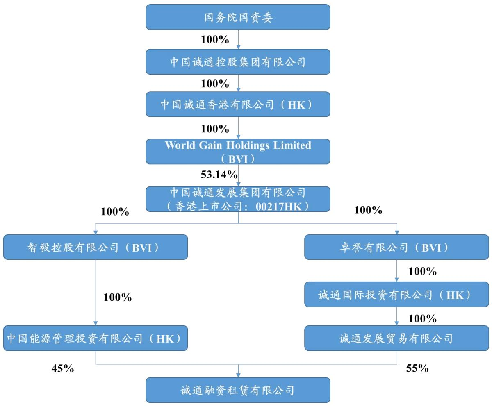
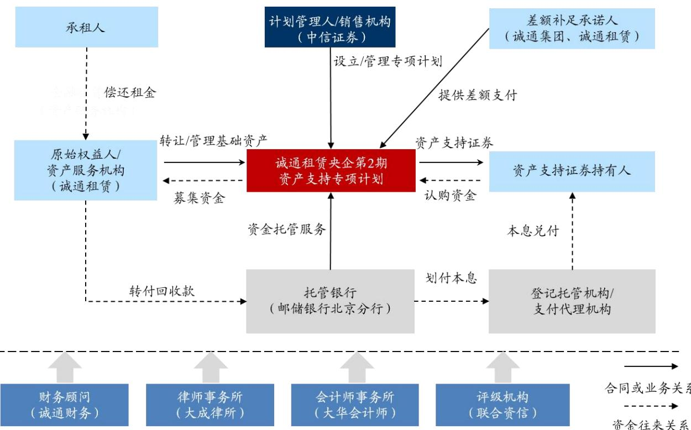

# 3诚通融资租赁资产证券化产品项目概况

# 3.1原始权益人概况

# 3.1.1公司介绍

诚通融资租赁有限公司作为是一家专业从事融资租赁业务的公司，公司主要业务涵盖了汽车、船舶、航空、医疗设备、工程机械等领域。诚通租赁公司与许多知名制造商和供应商建立了战略合作伙伴关系，因此拥有大量的融资租赁项目。公司还与多家金融机构建立了合作伙伴关系，确保了资金的充足性。此外，公司也拥有较为专业的风险控制和资金管理能力，其配备的一支高素质的风险管理团队能够较为及时识别和处理相关风险，来确保融资租赁业务的稳健运营。

在股权结构方面，诚通融资租赁有限公司的股东受到中国诚通发展集团有限公司的控制，由于国务院国资委是中国诚通发展集团有限公司的实际控制人，所以作为央企的信用评级通常较高，可以做到增强投资者的信心，从而进一步降低融资的成本。截至2022 年9月末，诚通融资租赁有限公司的股权结构如下图所示：

  
图3-1诚通租赁股权结构示意图

资料来源：《诚通租赁央企第2 期资产支持专项计划说明书》

# 3.1.2 公司实施资产证券化项目的动因

诚通租赁已成立有十余年，目前在业内已建立了坚实的基础。它一直致力于为客户提供一流的租赁解决方案，随着时间的推移，公司已经扩展了其业务覆盖面，并在金融租赁领域取得了可观的市场份额。然而，随着金融环境的快速变化，尤其是低利率的挑战和全球化带来的竞争压力，诚通开始考虑新的金融工具来维持其业务的可持续性。同时，近年来，资产证券化这一金融创新工具也在国内市场逐渐崭露头角，诚通租赁考虑资产证券化的时间，正是国内金融市场开放和创新的阶段。当时，随着经济的高速增长，众多企业和金融机构都在寻求更加高效、灵活的融资方式。而资产证券化，作为一种可以转移信用风险、提供更大流动性的工具，在国内开始受到广泛关

注。

近年来，诚通租赁的业务规模持续扩大，资产总额持续上升，结合自身特点，利用专项资产管理计划筹措资金成为了公司的常规融资手段，截至 2022 年 9 月末，诚通租赁分别发行过三单交易所ABS，2021 年发行“诚风启航-国君资管-诚通租赁第一期资产支持专项计划”，发行规模14.90 亿元，存续规模7.23 亿元，以及“中信证券-诚通租赁央企绿色资产支持专项计划”，发行规模14.80 亿元，存续规模7.45 亿元；2022 年发行“诚通租赁央企第1期资产支持专项计划”，发行规模 14.05 亿元，存续规模14.05 亿元。诚通租赁的资产证券化每期发行规模保持较稳定，可以看出资产证券化为诚通租赁提供了一个独特的机会，这不仅仅是一个简单的融资工具，更是一个能够让公司达到更广泛战略目标的方法，其实施资产证券化的动因具体体现在以下几个方面。

(1）增强资金流动性

诚通租赁业务的持续扩张和租赁业务的增长带来了丰厚的盈利，但同时也为企业资金带来了流动性挑战。随着租赁业务的增长，大量的资金被锁定在长期的租赁合同中，导致其短期的现金流出现压力。这种流动性压力，在日常经营活动中可能会导致公司面临支付难题，特别是在对接新的业务或应对突发事件时。资产证券化可以将这些长期的资产高效转化为流通性强的证券，满足企业日常运营和扩张的资金需求。诚通租赁曾在 2021 年凭借着成功发行资产支持证券获得了流动资金。可以看出表3-1 中2019-2021 年，诚通租赁筹资活动产生的现金流净额分别为1.57 亿元、7.55 亿元、37.36亿元，2021 年公司筹资活动现金流量净额相较于证券化前实现了显著提升，发行资产支持证券极大地缓解了企业的融资约束。通过发行资产支持证券，诚通租赁可以提高融资效率，实现筹资结构优化，为未来业务拓展和资金运作打下坚实基础。

单位：万元

表3-1诚通租赁发行ABS前后的现金流量情况  

<table><tr><td>项目</td><td>2021年末</td><td>2020年末</td><td>2019年末</td></tr><tr><td>筹资活动产生的现金流入</td><td>549,899.35</td><td>95,479.00</td><td>37,000.00</td></tr><tr><td>筹资活动产生的现金流出</td><td>176,305.83</td><td>19,961.51</td><td>21,278.69</td></tr><tr><td>筹资活动产生的现金流量净额</td><td>373,593.52</td><td>75,517.49</td><td>15,721.31</td></tr></table>

资料来源：《诚通租赁央企第2 期资产支持专项计划说明书》

# (2）改善资产负债表

当企业资产负债率较高时，公司的偿债能力将面临风险，一个健康的企业应当维持一个平衡的资产负债比例，资产证券化可以在一定程度上减少企业的整体负债水平，降低财务杠杆，从而提高权益负债比率，从而优化其资本结构，并为未来的投资和运营提供更大的空间。

根据诚通租赁的资产构成情况，由表3-2 可知，截至2019-2021 年末，诚通租赁总资产分别为10.16 亿元、19.52 亿元、59.58亿元，自成立以来资产规模增长迅速。其中，流动资产的诚通租赁的流动资产较少，以货币资金和一年内到期的非流动资产为主，增长在这三年中特别显著。与此相对照，非流动资产要由长期应收款构成，其金额也有所增加，但增长的速度与流动资产相比慢了许多。这意味着公司在资产证券化之后，其流动性得到了大幅提升，使得其应对市场波动的能力得到了增强。其次，根据负债构成情况，截至2019-2021 年末，诚通租赁总负债分别为6.96 亿元、15.78亿元、37.57亿元。总体负债随着业务增长规模也在增长，流动负债在 2019 年到 2021 年也增长了不少，但其在总负债中的占比从 2019 年的 $9 0 . 9 8 \%$ 下降到2021年的 $4 4 . 6 3 \%$ ，这说明公司的非流动负债增加了更多，2021 年与 2020 年相比增长了近8倍，这进一步证明了资产证券化带来的长期融资效果。最后，截至2019-2021 年末，诚通租赁资产负债率分别为 $6 8 . 4 5 \%$ 、 $8 0 . 8 1 \%$ 、 $6 3 . 0 5 \%$ ，可以看出经过资产证券化后公司资产负债率明显有所下降,对其高杠杆的资产负债结构有所改善。

表3-2诚通租赁发行ABS前后的资产和负债构成情况  
单位：万元  

<table><tr><td>项目</td><td>2021年末</td><td>2020年末</td><td>2019年末</td></tr><tr><td>流动资产</td><td>251,260.25</td><td>22,615.15</td><td>11,665.41</td></tr><tr><td>非流动资产</td><td>344,559.64</td><td>172,595.82</td><td>89,974.79</td></tr><tr><td>资产总计</td><td>595,819.89</td><td>195,210.96</td><td>101,640.20</td></tr><tr><td>流动负债</td><td>167,656.26</td><td>131,152.37</td><td>63,299.45</td></tr><tr><td>非流动负债</td><td>208,021.80</td><td>26,601.42</td><td>6,273.20</td></tr><tr><td>负债总计</td><td>375,678.06</td><td>157,753.79</td><td>69,572.65</td></tr><tr><td>资产负债率</td><td>63.05%</td><td>80.81%</td><td>68.45%</td></tr></table>

资料来源：《诚通租赁央企第2 期资产支持专项计划说明书》

# (4）有效转移风险

诚通租赁在租赁资产业务中存在承租人违约风险，并且还有多笔租赁合同为同一承租人持有，更增加了信贷风险的集中度。为了应对承租人可能违约带来的较大经济冲击，诚通租赁运用资产证券化策略，将其持有的多个融资租赁合同打包成证券，并分散到多个投资者手中。这一策略的核心在于将部分信用风险转移至投资者，以此来降低和分散原本可能集中在诚通的风险。通过这种方式，诚通租赁不仅成功地保障了自身的利益，确保了业务的持续稳定，同时也为投资者提供了一种具有吸引力的、分散化的投资机会，使得整个融资租赁市场的生态更为健康和稳定。

# (4）降低融资成本

传统的银行贷款，尽管为众多企业提供了融资的途径，但其成本也不可忽视，高昂的贷款利率、行政手续费和与之相关的负担组成的实际费用都会对公司的经营造成压力，成为制约企业灵活度的重要因素。在资本市场的动态背景下，诚通租赁对此进行了深刻的洞察，转而选择了资产证券化这一创新融资模式。在全球低利率的大环境下，资产证券化不仅提供了更低的边际融资成本，还显著减少了与融资相关的发行与管理成本。这种策略性的决策不仅反映了诚通对于宏观经济与资本市场的敏感度，更彰显了其对于优化资本结构、提高资金使用效率的追求。利用资产证券化，诚通成功地为自身融资活动注入了更大的灵活性，确保了企业在竞争激烈的市场环境中保持其核心竞争力。

结合以上四个方面的动因，从战略层面看，诚通租赁希望能通过资产证券化打开一个新的融资渠道，不仅仅是为了满足其即时的资金需求，还基于多方面的综合考虑，包括增强资金流动性、优化资本结构、有效地转移风险以及降低融资成本等角度，旨在为公司带来长期的利益，满足其持续发展的需求。更重要的是，这也是其在国内金融市场上建立与投资者关系、提高知名度和信誉的一个有效途径。

# 3.2产品要素

本文的案例为“诚通租赁央企第2期资产支持专项计划”，简称为“诚租央企2023-2”，于2023 年2 月 21日发行，属于企业资产支持证券，原始权益人为诚通融资租赁有限公司，资产类型为租赁资产，发行方式为私募发行。如表3-3 各产品要素概况所示，专项计划分为优先A3、A2、A3、A4和次级资产支持证券，总规模为人民币137,000.00万元，优先级资产支持证券的目标募集规模为132,200.00 万元，次级资产支持证券目标募集规模为人民币 4,800.00 万元，各级优先层证券于兑付兑息日按季付息，过手摊还本金，次级证券不参与期间分配，预期到期日分别为2023 年 10 月26 日、2024 年10月28日、2025 年10月27日、2026年07月27 日、2027 年10月26日。其中，优先级信用评级为AAA，发行利率分别为 $3 . 9 5 \%$ 、 $4 . 2 6 \%$ 、 $4 . 0 0 \%$ 和 $4 . 0 0 \%$ 。

表3-3项目要素概况表  

<table><tr><td>证券分层</td><td>02诚通A1</td><td>02诚通A2</td><td>02诚通A3</td><td>02诚通A4</td><td>02诚通C</td></tr><tr><td>发行金额 (万元)</td><td>35,000</td><td>45,000</td><td>36,200</td><td>16,000</td><td>4,800</td></tr><tr><td>分层占比 (%)</td><td>25.55</td><td>32.85</td><td>26.42</td><td>11.68</td><td>3.50</td></tr><tr><td>信用评级</td><td>AAA</td><td>AAA</td><td>AAA</td><td>AAA</td><td></td></tr><tr><td>预期到期日</td><td>2023-10-26</td><td>2024-10-28</td><td>2025-10-27</td><td>2026-07-27</td><td>2027-10-26</td></tr><tr><td>发行利率</td><td>3.95</td><td>4.26</td><td>4.00</td><td>4.00</td><td></td></tr><tr><td>还本方式</td><td>过手摊还</td><td>过手摊还</td><td>过手摊还</td><td>过手摊还</td><td>过手摊还</td></tr><tr><td>年付息次数 (循环/摊还)</td><td>4.00</td><td>4.00</td><td>4.00</td><td>4.00</td><td>4.00</td></tr></table>

资料来源：《诚通租赁央企第2 期资产支持专项计划说明书》

# 3.3基础资产池

诚通租赁的专项计划资产池基础资产选取了15 笔融资租赁合同，涉及承租人13户，并且均属于在基准日、专项计划设立日，资产原始权益人已按照融资租赁合同的约定在获取租赁物时完成付款,租赁物也已经交付给承租人使用的合格标准。资产池基准日本金余额为137,250.94 万元，基准日租金余额为148,942.65 万元，涉及的承租人共13个，与这些承租人所签署的租赁合同数量为15 份（部分承租人与公司签有多份租赁合同）。在所有的租赁合同中，单笔租赁合同的最高租金余额为16,485.81万元，平均租金余额为 9,929.51万元。合同本金总额 147,000.00 万元,其中单笔租赁合同的最高本金总额为 15,000.00 万元,平均本金总额为 9,800.00 万元。截至基准日 2022 年 10

月20日，资产池的统计信息如表3-4 所示:

表3-4资产池基本情况统计  

<table><tr><td>项目</td><td>数额</td></tr><tr><td>租金余额 (万元)</td><td>148,942.65</td></tr><tr><td>承租人数量</td><td>13</td></tr><tr><td>租赁合同笔数</td><td>15</td></tr><tr><td>单笔租赁合同最高租金余额(万元)</td><td>16,485.81</td></tr><tr><td>单笔租赁合同平均租金余额 页（万元)</td><td>9,929.51</td></tr><tr><td>合同本金总额 (万元)</td><td>147,000.00</td></tr><tr><td>单笔租赁合同最高本金总额 (万元)</td><td>15,000.00</td></tr><tr><td>单笔租赁合同平均本金总额 (万元)</td><td>9,800.00</td></tr><tr><td>本金余额 (万元)</td><td>137,250.94</td></tr><tr><td>单笔租赁合同最高本金余额 （万元）</td><td>15,000.00</td></tr><tr><td>单笔租赁合同平均本金余额 (万元)</td><td>9,150.06</td></tr><tr><td>保证金总额 (万元)</td><td>3,055.00</td></tr><tr><td>加权平均租金利率 (年)</td><td>4.80</td></tr><tr><td>本金余额最高的前五名承租人集中度 (%)</td><td>54.05</td></tr><tr><td>本金余额最高的承租人所在前五大地区集中度(%)</td><td>68.14</td></tr><tr><td>正常类租金余额(万元)</td><td>148,942.65</td></tr><tr><td>加权平均租赁合同期限(月)</td><td>43.15</td></tr><tr><td>加权平均租赁合同剩余期限(月)</td><td>38.98</td></tr><tr><td>单笔租赁合同最长剩余期限（月)</td><td>59.18</td></tr><tr><td>单笔租赁合同最短剩余期限（月）</td><td>23.18</td></tr></table>

资料来源：《诚通租赁央企第2 期资产支持专项计划说明书》

# 3.4交易结构

“诚通租赁央企第2 期资产支持专项计划”是由计划管理人中信证券接受认购人的委托后设立并进行管理的专项计划。在这项资产支持证券中，参与该产品发行的包括各级资产支持计划持有人、资产服务机构、信用增级机构、原始权益人、计划管理人、托管人和中介机构等，除此之外还包括差额补足承诺人，其参与主体情况如表 3-5所示：

表3-5项目主体参与方  

<table><tr><td>项目主体参与方</td><td>公司名称</td></tr><tr><td>原始权益人/资产服务机构/差额补足承诺人一</td><td>诚通融资租赁有限公司</td></tr><tr><td>差额补足承诺人二</td><td>中国诚通控股集团有限公司</td></tr><tr><td>计划管理人</td><td>中信证券股份有限公司</td></tr><tr><td>评级机构</td><td>联合资信评估股份有限公司</td></tr><tr><td>律师事务所/法律顾问</td><td>北京大成律师事务所</td></tr><tr><td>会计师事务所</td><td>大华会计师事务所 (特殊普通合伙)</td></tr><tr><td>托管银行</td><td>中国邮政储蓄银行股份有限公司北京分行</td></tr><tr><td>登记托管机构</td><td>中国证券登记结算有限责任公司上海分公司</td></tr></table>

资料来源：《诚通租赁央企第2 期资产支持专项计划说明书》

本项资产支持证券的交易流程是诚通租赁作为发起机构和委托人，与承租人订立租赁合同，进行正常的租赁交易。诚通租赁通过将基础资产委托给计划管理人中信证券设立资产支持专项计划，交易结构图如图3-2 所示。

  
图3-2专项计划交易结构
