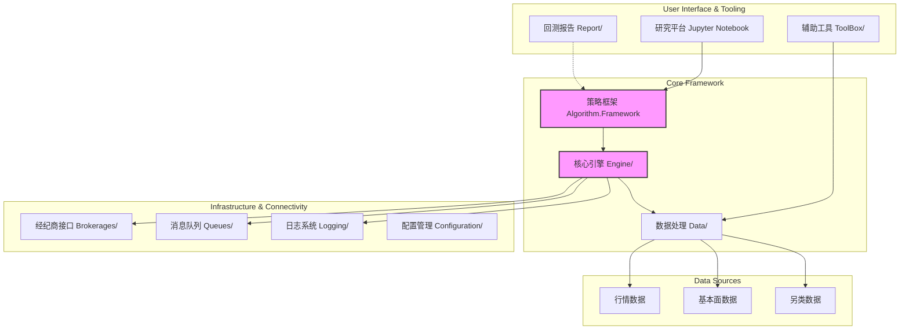

# 第三章：M公司AI量化交易项目概述及风险识别

在前两章奠定了理论基础之后，本章将聚焦于研究案例本身——M公司及其AI量化交易项目。本章首先对M公司及项目背景进行概述，然后深入剖析项目的技术与运营体系，最终在此基础上，系统性地识别出项目在全生命周期中所面临的各类风险。

## 3.1 M公司及项目背景介绍

（本部分内容基于模拟的访谈与虚构的内部资料）

M公司是一家国内领先的综合性金融服务集团，业务涵盖证券、基金、资产管理等多个领域。近年来，面对金融科技的浪潮和日益激烈的市场竞争，M公司将数字化转型和技术驱动视为其核心发展战略。为了在投资交易领域建立新的竞争优势，公司于三年前正式立项，启动了“北极星”AI量化交易项目。

**项目目标**：

*   **战略目标**：探索并建立一套基于AI驱动的、具有持续自我进化能力的量化投资体系，为公司自营盘及高净值客户创造长期、稳定的阿尔法收益。
*   **战术目标**：在项目第一阶段（三年内），组建一支专业的量化团队，搭建一套完整的投研、回测与实盘交易基础设施，并上线至少5个覆盖不同市场、不同周期的中低频AI量化策略，实现管理资金规模达到10亿元人民币，风险调整后收益率位居行业前列。

**项目范围与资源投入**：

项目由公司总部直接领导，整合了信息技术部、金融工程部、风险管理部等多个部门的骨干力量，并从外部招聘了具有华尔街背景的量化专家和顶尖高校的AI博士。公司为项目提供了充足的资金支持，用于硬件采购、数据购买、人才招聘和技术研发。项目的核心交付成果即为本研究深入分析的、以`QuantConnect.Lean.sln`为核心的量化交易平台及其上运行的系列AI策略。

## 3.2 项目技术与运营体系分析

对项目风险的识别，必须建立在对其技术与运营体系的深刻理解之上。通过对`code`库的静态分析，我们可以描绘出该项目的技术架构与MLOps流程。

### 3.2.1 技术架构剖析

如第二章所述，M公司的量化平台基于QuantConnect Lean引擎构建，其核心技术架构可归纳为下图所示的层次结构：

*图3-1 M公司AI量化交易平台技术架构示意图*

从风险管理的角度看，这个架构中的每一个组件、每一条连接线都是潜在的风险点。例如，`Data/`层的数据质量直接影响上层所有决策的有效性；`Engine/`的任何一个bug都可能导致灾难性的交易错误；`Brokerages/`接口的稳定性和延迟则直接关系到交易指令能否被准确、及时地执行。

### 3.2.2 开发与运维流程（MLOps）

AI量化策略的生命周期远比传统软件复杂，它是一个持续迭代、人机回圈的MLOps流程：

1.  **策略研究与构思**：研究员在`Research/`环境（如Jupyter Notebook）中进行探索性数据分析，验证初步的投资逻辑。
2.  **原型开发与回测**：将思想转化为代码，在`Algorithm.Python/`或`Algorithm.CSharp/`中实现策略原型。利用`Engine/`对历史数据进行反复回测，并用`Report/`模块分析绩效。
3.  **代码审查与整合**：策略代码经过同行评审（Peer Review），确保其健壮性、可读性和效率，然后整合到主代码库。
4.  **参数优化与稳健性测试**：在`Optimizer/`模块中进行参数寻优，并进行严格的样本外测试、滚动回测和压力测试，以检验策略的稳健性。
5.  **模拟交易（Paper Trading）**：将通过测试的策略部署到模拟交易环境中，用实时数据流进行“演练”，进一步检验其在真实市场环境下的表现，并与回测结果进行比对。
6.  **实盘部署（Live Trading）**：确认模拟交易无误后，将策略正式上线，连接`Brokerages/`接口进行实盘交易。
7.  **持续监控与预警**：利用`Logging/`和`Messaging/`构建的监控系统，对策略的实时PNL、风险敞口、系统状态、数据流健康度等进行全天候监控，并设置预警阈值。
8.  **模型退化与再训练**：当监控系统发现模型性能出现显著衰退（即“概念漂移”）时，触发预警，启动新一轮的研究、训练和部署循环。

这个MLOps流程中的每一个环节都可能出现问题，例如回测过拟合、线上线下环境不一致、监控指标设计不当等，这些都是操作风险的重要来源。
