# “保险＋期货”服务生猪养殖市场风险管理的定价机制与效应分析∗

徐媛媛 (南京林业大学经济管理学院,南京,210037)张 硕 (中国人民大学农业与农村发展学院,北京,100872)崔小年 (郑州商品交易所,郑州,450004)齐皓天 (西南大学经济管理学院,重庆,400715)

摘 要:本文立足养殖成本与市场价格双重视角,探讨“保险 $^ { \cdot + }$ 期货”服务中国生猪养殖市场风险管理的市场条件、方案设计与定价机制,并基于“价格保险”与“再保险”功能定位,全面探析“保险 $^ +$ 期货”风险管理效应。 研究发现:(1)波动率和保险周期是“保险 $^ +$ 期货”费率决定的主要变量,其中生猪项目费率仅在 个月周期内低于 $6 \%$ ;( )短周期、多批次承保更能适应畜牧养殖循环滚动生产的特点,但其风险转移效率和“再保险”功能发挥受到配套场内期权缺位、手续费与流动性等调仓成本的制约。 最后,提出以持续做好市场培育、强化业务风险控制、健全产品供给体系为基础推动“保险 $^ +$ 期货”服务生猪养殖业高质量发展。

关键词:生猪市场风险;保险 $^ +$ 期货;养殖成本;风险管理效应

# 一、引言

生猪是中国最重要的牲畜养殖品种,也是老百姓肉类消费的主要来源 生猪养殖上接农作物及饲料行业,下联肉类食品加工企业,是肉类产品生产供应链的重要一环,也是“菜篮子”工程的重中之重。 然而,由于生猪养殖链条长,信息传递周期久,生猪产业的稳定发展面临多重挑战,诸如养殖成本刚性抬升、猪肉价格起伏频繁、生产与消费存在错配以及产业调控固守 顺周期 思维等问题凸显(张利庠等,2020;辛翔飞等,2023)。 2014 年,中央一号文件首次提出“探索粮食、生猪等农产品目标价格保险试点”,以在价格波动向生产环节传导的过程中建立 阻断器 机制 自此 各地积极探索试点生猪价格指数保险,为养殖户提供市场风险保障工具。 2019 年,非洲猪瘟重创造成生猪产能缺口 在政策红利推动下养殖集团跑马圈地 竞相扩张市场份额,猪市逐步走向供过于求。 加之养殖成本居高不下,生猪养殖市场风险保障需求大幅增长,迫切需要多元的风险管理工具及模式拓展政策性农业保险的广度和深度。 2021 年1 月8 日,生猪期货在大连商品交易所(简称“大商所”)上市 $\textcircled{1}$ ,为建立更深层次广维度的收入保障机制、解决产业发展中风险转移与利益分配问题提供了市场化工具。同时,生猪“保险 $^ +$ 期货”项目应声落地并迅速延展,助力全国范围中小规模养殖户应对市场变化和不断增长的风险挑战,解决短期生产行为带来的“蛛网模型”紊乱现象,推动实现生猪产业“稳价”“保供”。

历史经验表明,生猪养殖高产目标的实现并不难,但保持长期稳定供应的难度与日俱增。 究其根源,产能调整的滞后性、远端产能的不确定性导致猪周期 难题久拖不决 长期困扰着产业链各环节稳定发展(胡向东等,2022)。 农业保险是重要的风险管理工具,而何种保险模式能够满足中国生猪养殖产业发展需要,还需要大量的探索实践。 自生猪价格保险试点以来,国内学者针对保险原理、操作要点、实施效果、风险问题等进行系统阐释(张峭等,2015;孙妍等,2019)。 有学者认为在生猪保险方案设计中不能忽视 猪周期 因为 猪周期”可能引发选择性投保问题(王聪等,2021),从而削弱生猪保险在保供稳价方面的作用(王克等,此外 部分学者还指出了传统农业保险供给体制下,生猪价格指数保险存在再保险渠道不完善(王亚辉等,2014)、目标价格设置不当(张燕媛等,2019)、趋势性和周期性因素干扰(马彪等,2018)等问题。 随着“保险 $+$ 期货”模式不断复制推广,项目成效获得广泛关注与认同,加快推动生猪期货上市、利用金融工具组合管理市场风险,成为生猪养殖产业积极布局的方向。

“保险 $^ +$ 期货”已有文献以定性研究为主,多聚焦于玉米、大豆等大宗作物与白糖、棉花等地方特色农产品探讨“保险 $^ +$ 期货”运行机制与实施效果(安毅等,2016;庹国柱等,2021)。 现有研究表明,“保险 $^ +$ 期货”存在目标价格随行就市、保险产品倒向定价等方面的模式通病 李铭等 徐媛媛等 并指出其运行效果受期货市场运行质量的影响( 辛立秋等,2018;朱俊生等,2017)。 在实证研 究 方 面, 郑 承 利 等 (2018) 和 余 方 平 等(2020)对不同结构场外期权进行定价并阐释如何基于保险产品设计实现降本增效与最优投保目标;徐媛媛等(2022)在定价基础上进一步量化了价格风险转移链条中的基差风险与对冲风险;潘方卉等(2022)基于市场关联机制论证了饲料成本“保险 $^ +$ 期货”模式对猪肉市场价格波动的稳定作用。 秉持“一品一策”思路,“保险 $^ +$ 期货”试点根据不同品种属性与产业特征制定了差异化的项目建设方案。在实践中 生猪 保险 $+$ 期货 除展现一般模式的共性与通病外,还具有“生产—市场”双向保障以及投保方式上“滚动—分批”改进特性。 因此,有必要对 保险 $^ +$ 期货 服务生猪养殖市场风险管理这一新命题进行系统性学理论证。 聚焦于养殖成本与市场价格双重视角,本文对生猪“保险 $^ +$ 期货”主要产品结构进行定价分析与成本核算,并基于“价格保险”与“再保险”功能定位评估“保险 $^ +$ 期货”风险管理效应,探索生猪“保险 $^ +$ 期货”提质增效的实现形式与路径选择。

# 二、“保险 $^ +$ 期货”服务生猪养殖风险管理市场条件

生猪产能的松紧取决于养殖利润,而利润则由生猪养殖的饲料成本和生猪出栏的市场价格共同决定 在生猪养殖过程中 玉米与豆粕是猪饲料的主要成分,用量占比分别为 $6 5 \%$ 和 $20 \%$ 左右①。2020 年以来,玉米供需整体呈现紧平衡局面,同时大豆进口依存度居高不下 不仅对粮食安全构成严重挑战,也直接威胁到畜产品稳产保供目标能否顺利实现和长期保持。 据国家粮油信息中心数据统计,2021 年玉米、豆粕价格上涨助推饲料成本不断攀升 其中自繁自养模式下育肥猪养殖成本达到20\~21 元/公斤,比2019 年非洲猪瘟重创前上涨了

$50 \%$ 以上,养殖户亟需价格风险管理工具锁定养殖成本②。 在生猪出栏入市时,养殖收益面临市场价格波动带来的风险挑战。 一方面,中小规模养殖户通常“随行就市”,被动承受价格波动风险,同时他们对供需变化的判断和行为模式带有非理性和盲目性 常常 追涨杀跌 高点补栏扩产 低点恐慌出栏),在“猪周期”趋势转换过程中充当市场反弹的垫脚石。 另一方面,规模猪场与养殖户限于经营规模、资本等因素,在“猪周期”下行阶段也不可能轻易退出或者快速收缩业务,亟需配套市场化风险保障机制助力实现产业兜底与动能激活。

生猪市场周期性和区域性失衡已然常态化,过去疾风暴雨式的危机管控模式不仅无法起到削峰填谷的作用,还可能成为推波助澜的“有形之手”。2021 年«关于促进生猪产业持续健康发展的意见»明确了现阶段中国生猪产业调控导向由“减”变“保”,通过引导市场预期、建立预警纠偏与储备调节机制等政策措施熨平 猪周期 波动 伴随顶层设计上生猪产业的政策调整,行业主体也从之前的扩张转为存量精细化管理,通过控制成本、提高效率,寻求利用衍生工具管理饲料原料及出栏生猪价格风险。 在此情形下,生猪期货合约挂牌上市不仅通过价格信号调节供需、引导资源配置,而且丰富了生猪市场风险管理工具箱,为养殖行业企业提供信息预报与风险保护机制。 然而,期货交易在数量与资金方面具有较高准入门槛,难以适应中国中小规模生猪养殖户众多的情形。 根据合约规格,一手生猪期货合约为 16 吨,按均价 18000 元/吨计算,其价值为 万元 需要缴纳 万元的保证金 $\textcircled{1}$ 。 此外,由于缺乏交易专业知识和风险管理技能,许多养殖户对于直接参与期货交易望而却步。

“保险 $^ +$ 期货”将产品前端设计为农户较为熟悉、便于理解的保险产品,依托农业保险基层组织与服务网络,推动期货市场的风险管理功能下沉农牧业生产一线,帮助养殖户合理调整养殖规模和饲养周期,以避免重复价格强监管下的超调效应。2021 年 1 月 8 日,“保险 $^ +$ 期货”模式依托生猪期货与中国生猪产业实现对接,完成了种植类与养殖类并存 粮棉糖肉蛋果胶八大农业板块全覆盖的跨越升级。 经历三年试点运行,生猪“保险 $^ +$ 期货”项目不断拓区扩面,以多样化的产品设计与灵活的实施方案,为优化生猪产能调控机制助力赋能。 据统计,自上市以来,大商所共支持开展生猪“保险 $^ +$ 期货”项目 549 个,涉及现货量 324 万头。 截至 2024年 月底 累计实现赔付 亿元 惠及农户万户次②。 结合案例回溯和实证分析,本文在对生猪“保险 $^ +$ 期货”主要产品进行定价与成本核算基础上,深入分析“保险 $^ +$ 期货”服务生猪养殖风险管理效应,以期探索“保险 $^ +$ 期货”服务生猪养殖业高质量发展的新路径。

# 三、“保险 $^ +$ 期货” 服务生猪养殖风险管理方案设计

# (一)生猪“保险 $^ +$ 期货”试点做法

“保险 $^ +$ 期货”项目由交易所立项支持并主导建设 广泛吸引保险公司 期货公司等市场主体的参与,有效保障了保险产品的供给能力,为投保人提供更优质的服务、更全面的风险保障∗。 图 1 展现了“保险 $+$ 期货”基本模式与业务流程,包含两套“保护体系”:一是保险公司向农户提供的价格保险产品,二是期货公司为保险公司提供的价格风险对冲服务。 保险承保工作是整个项目建设流程的开始,理赔到户是项目流程的结束,所涉及的整个业务流程遵循保险法、农业保险相关政策与条例以及保险公司内控制度规定。 相比于政策性保险,“保险 $+ .$ 期货”是一条“自下而上”的农业风险管理路径 形成了市场风险从养殖户到投资者的闭环转移,契合现代农业产业发展的风险管理需要,也为推动“政府—市场—农户”关系转型提供了市场化倾向的新视角。

生猪“保险 $^ +$ 期货” 针对销售价格与养殖成本提供 双重 收益保障 包含生猪价格保险和饲料价格保险两款保险产品,保障标的依次为生猪价格与猪饲料成本指数∗∗。 首先,生猪价格保险采用“看跌”保障结构,当结算价格低于目标价格时触发理赔 相当于提供最低生猪销售价格保证 减少养殖户在生猪出栏时面临的市场风险。 以河南平顶山市生猪价格“保险 $^ +$ 期货” 试点为例,2021 年 1月8 日,全国首张生猪“保险 $^ +$ 期货” 保单以 63. 6元 头∗的单位保费 为平顶山市叶县 宝丰县和汝州市 1600 头 生 猪 提 供 “ 保 险 价 格 2950 元 / 头(29.50 元/公斤)、为期一个月”的价格保障。 期间生猪期货价格持续下跌,平均收盘价格在25.45元/公斤,到期赔付 405 元/头,赔付率达 $6 3 6 . 3 \%$ 。 其次,猪饲料成本指数保险采用“看涨”保障结构,当结算价格高于目标价格时予以相应的经济补偿 保障养殖成本上涨的风险,使养殖户不会因饲料成本波动减少生猪饲养 以甘肃皋兰县猪饲料成本指数保险 $^ +$ 期货 试点为例 该项目以 元 吨的单位保费为皋兰县生猪养殖户 1.82 万吨的生猪饲料提供价格保障,期间饲料价格上涨触发理赔,到期赔付112.92 元/吨,赔付率达 $2 7 4 \% \textcircled { 2 }$ 。

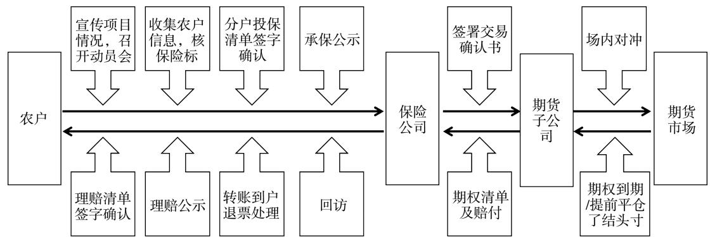  
图 1 “保险 $^ +$ 期货”基本模式与业务流程

在两款保险的基础上 一些项目通过 生猪价格看跌期权 $^ +$ 猪饲料成本看涨期权”双重保障方式,创新推出生猪养殖利润“保险 $^ +$ 期货”试点,将以往“保价格”的模式升级为“保利润”。 以辽宁灯塔市“生猪价格 $^ +$ 饲料成本”模式为例,2022 年 10月17 日,生猪养殖利润“保险 $^ +$ 期货”创新模式落地灯塔市,承保生猪规模5576 头、单位保费134. 52元/头,以生猪、玉米、豆粕按比例拟合确定目标养殖利润1984. 04 元/头。 伴随生猪价格出现较大幅度回调、猪饲料成本价格高位震荡上行,项目到期赔付 198. 26 元 / 头,赔付率达 $1 4 7 . 3 8 \% ^ { \textregistered }$ 。 比较而言 生猪养殖利润 保险 $^ +$ 期货 由生猪价格保险(看跌)与猪饲料成本指数保险(看涨)叠加组成,提供了更全面的风险保障,但其成本也相应更高。根据保险定义与内涵,生猪养殖利润保险应以生猪养殖利润为保险标的,当实际养殖利润低于目标养殖利润保险责任产生理赔 其中理赔标准为目标养殖利润减去实际养殖利润。 然而,通过大量案例梳理发现 目前的生猪养殖利润 保险 $^ +$ 期货 模式在定价与理赔过程中均采用对产品组合进行成本叠加、分开结算的方式,这导致无法精确锁定目标养殖利润。 原因在于,场外期权“风险中性”对冲策略要求三个期货品种同时进场、逆向对冲,从而在一定程度上割裂了生猪价格下跌与饲料价格上涨之间的天然对冲关系 导致定价效率不高 同时限制了保障效果的发挥。

# (二)生猪“保险 $^ +$ 期货”设计规范

“保险 $+$ 期货”存在目标价格随行就市的通病,加之生猪产业“周期性”的特征,入场时机对保障效果至关重要,也直接影响最终的赔付成效。 通常情况下,当生猪价格(或养殖成本)处于高点(或低点)时,参与“保险 $+$ 期货”项目的效果会更为显著;

反之,效果可能不佳。 在试点初期,可以通过设计带有敲出、锁定条款的期权结构来减轻入场时点的影响,并达成相对较好的赔付预期。 随着“保险 $^ +$ 期货 模式日渐成熟 试点建设逐渐强调其产品设计的通俗化、标准化与项目运行的规范化、制度化。首先,生猪项目试点年度方案不断强化保险保障功能 要求不能设置敲出 锁定等结构以及任何形式的保底 协议赔付条款 其次 为适应生猪产业全年多批次繁殖、滚动养殖的生产特点,单个项目的运行周期不超过6 个月;最后,在结算价格采集上,饲料成本保险采用保险周期全覆盖式采价,生猪价格保险则在保险周期最后一个月进行采价,以匹配生猪养殖中成本均摊与集中销售的特征。

在上述“刚性”条件约束下,“保险 $^ +$ 期货”试点建设难以通过方案设计来解决入场时点的决策难题。 然而,生猪“保险 $+$ 期货”以贴近产业特征为导向,在投保方式上展现出较大的灵活性,既贴合畜牧养殖循环滚动生产特点,又有助于提升生猪项目的运行质效。 具体而言,大商所将年度配额分配给多家期货公司,以滚动立项制保证项目实施时间上的灵活度∗ 同时允许采用分批投保策略 通过实时行情跟踪 及时调整承保策略 更迭下一批次的保险方案,从而实现梯度保障效应。 基于此,期货公司联合保险公司根据养殖户饲养周期和行情特点 合理把握各批次入场时机 尽可能提升保险保障水平,帮助养殖户规避出栏生猪价格风险、稳定养殖收益。

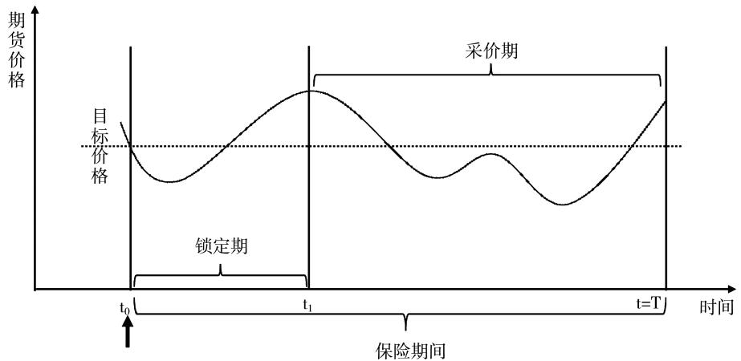  
注: $\mathbf { t } _ { 0 }$ 为项目入场、保险生效时点, $\mathbf { t } _ { 1 }$ 为结算价格开始采集的节点, $\mathfrak { t } _ { 1 } = \mathfrak { t } _ { 0 }$ 为保险周期全覆盖式 采价   
图 2 保险周期与采价周期

综上所述,相较于固定实施时间和运行周期的种植类“保险 $^ +$ 期货”项目,生猪项目保留了场外期权工具的投资属性 灵活性较强 加之生猪商品率高、比较效益高的品种属性,因此具有良好的商业化基础与发展前景,成为立体化农业保险体系的重要部分。 然而,与传统保险或再保险业务通过年度间风险平滑达到长期盈亏平衡的机制不同,生猪“保险 $+$ 期货”采用年度配额制,连续性、稳定性、系统性差,不具备在时间维度上风险分散的内在机制。 若政策红利不再,如何维持项目可持续性,是“保险 $^ +$ 期货”发展面临的现实问题和严峻考验。立足于生猪养殖业,“保险 $^ +$ 期货”成本核算与风险管理效应评估成为实现对标降本、提质增效的关键环节,对推动试点建设转向可持续发展轨道具有重要的理论与实践意义。

# 四、“保险 $^ +$ 期货”助力生猪养殖业风险管理定价机制

期权价格(即权利金)是“保险 $^ +$ 期货”定价的核心,受到标的期货价格、行权价格、期限、波动率等因素∗影响。 现阶段,保费定价偏高、权利金补贴负担较重是“保险 $^ +$ 期货” 降本增效与可持续发展的主要制约,有必要结合立项方案要求对生猪“保险 $+$ 期货” 定价影响因素及其作用机制进行分析论证。

# (一)定价方法

期权合约具有契约性质 赋予其买方以约定价格买进(看涨)或卖出(看跌)的权力,其价值在本质上是对未来预期赔付(即目标价格与结算价格之间相对差额)的折现估计。 “保险 $^ +$ 期货”签保时确定目标价格后,结算价格成为影响项目最终赔付的关键变量,若结算价格低于(看跌)或高于(看涨 约定的目标价格则触发赔付条款 结合价格变动及实际投保数量对参保农户进行赔付。 根据2023 年大商所“农民收入保障计划”,生猪“保险 $^ +$ 期货”关于结算价格限定了两种确定方式:一是收盘价格算术平均值,即为亚式采价;二是每日收盘价格与目标价格较小值(看跌)或较大值(看涨)算术平均值,即为增强亚式采价。 如图 3 所示,灰色曲线为模拟价格路径S ,黑色曲线为增强式采价路径,直线S 与 $\mathrm { S _ { \mathrm { ~ a ~ } } ^ { \prime } }$ 为亚式采价的结算价格,直线 $\mathrm { S _ { E a } }$ 与$\mathrm { S _ { \ E a } ^ { \prime } }$ 为增强亚式采价的结算价格。 可见,增强亚式采价通过限制其价格有效向上(看跌)或向下(看涨)边界的方式来提高期权被执行的概率(即$\mathrm { S _ { a } { > } S _ { E a } }$ , $\mathrm { S _ { \ a } ^ { \prime } { < } S _ { \ E a } ^ { \prime } \rangle }$ ,进一步提升了保障程度。

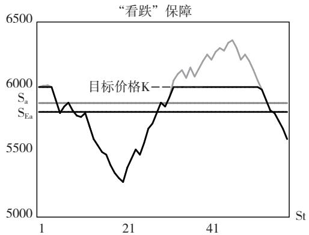  
图 3 两种保障结构下亚式与增强亚式结算价格

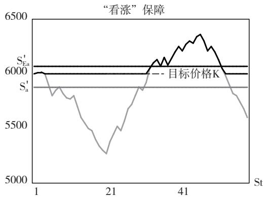

对于亚式、增强亚式等路径依赖型期权∗∗,期权定价是基于不同路径下平均回报得到期权价值估计的过程。 其中,蒙特卡罗模拟以概率论和数理统计为基础,通过模拟数万条价格路径来预测期权的平均回报,是“保险 $^ +$ 期货”实践中应用最广泛的定价方法。 基于此,本研究采用蒙特卡罗模拟方法模拟出 100000 条期货价格路径 $\mathrm { S } _ { \mathrm { t } }$ ,以不同路径下结算价格计算预期赔付,将其折现后再加固定比例通道费,即可获得“保险 $^ +$ 期货”保费。 亚式采价方式下,“看跌”与“看涨”保障结构对应组合 1 和组合2,保费计算见(1)(2)式;增强亚式采价方式下,“看跌”与“看涨”保障结构对应组合3 和组合4,保费计算见(3) (4) 式。 其中, $\mathbf { K } ( \mathbf { \Sigma } \mathbf { K } ^ { \prime } )$ 为看跌(涨)期权的执行价格,对应于相应保险产品的目标价格;T为期权期限,对应于相应保险产品的保险周期;r为无风险利率,以相应周期的上海银行间同业拆放利率( Shibor) 表示; $\gamma$ 为保险公司的通道费占比(默认为 $10 \%$ ) 。

组合 1: Pa ＝ $P _ { _ a } = \frac { 1 } { 1 \mathrm { ~ - ~ } \gamma } e ^ { - r T } m a x \left[ K - S _ { _ a } , 0 \right]$ ,∑S(t)  
其中, $S _ { a } = \frac { \mathbf { \Omega } ^ { n } } { \mathbf { \Omega } _ { n } }$ (1)组合 2: $P _ { a } ^ { c } = \frac { 1 } { 1 - \gamma } e ^ { - r T } m a x \left[ S _ { \ a } ^ { \prime } - K ^ { \prime } , 0 \right] ,$ ,∑S(t)  
其中 , $S _ { a } ^ { \prime } = \frac { n ^ { \prime } } { n ^ { \prime } }$ (2)组合 3: PEa ＝ $P _ { _ { E a } } = \frac { 1 } { 1 - \gamma } e ^ { - r T } m a x \left[ K - S _ { _ { E a } } , 0 \right] ,$ ,  
其中, $S _ { E a } = \frac { \displaystyle \sum _ { n } m i n [ S ( t ) , K ] } { n }$ (3)组合 4: $P _ { \phantom { } _ { E a } } ^ { c } = \frac { 1 } { 1 \ - \gamma } e ^ { - r T } m a x \ \left[ S _ { \phantom { } _ { E a } } ^ { \prime } \ - K ^ { \prime } , 0 \right] ,$   
其中 , $\left| { S ^ { \prime } } _ { E a } = \frac { \displaystyle { \sum _ { n ^ { \prime } } m i n [ S ( t ) , K ^ { \prime } ] } } { n ^ { \prime } } \right.$ (4)

# (二)模拟结果

1. 保费构成与影响机理。 保险费率相当于风险概率,对应赔付概率。 在农业保险合约设计下,保险费率取决于保险赔付概率,而与保额无关。 当保障水平为 $100 \%$ 时,“保险 $^ +$ 期货”的保额便是目标价格,那么不同目标价格对应的保险费率也理应相同。 从目标价格维度来看,图 4(a)表明每一种组合下,抛开可忽略的模拟误差,10 档目标价格均对应于同一费率,即保险费率基本不受目标价格的影响。 该结果符合农业保险的一般准则,也侧面印证了蒙特卡罗模拟对期权定价结果的稳健性。 波动率是影响保险费率的核心参数,波动率越高,风险溢价越大,保险费率也就越高。 同时,当市场行情处于极端波动(0. 5 及以上波动率)下,目标价格维度的模拟结果出现轻微浮动 图 进一步绘制不同保障水平下保险费率与波动率之间的正向关系,斜率表示保险费率对波动率的敏感程度。 保障水平越高,费率越高。 当保障水平为 $100 \%$ 时,保险费率随着波动率呈“线性”增长:波动率每增长$10 \%$ ,亚式采价下保险费率增长 $1 \%$ 、增强亚式采价下保险费率增长 $1 . 2 \%$ 。 当保障水平小于 $100 \%$ 时 保险费率与波动率之间除了一次关系外还有高次关系:费率敏感性随着波动率的降低而减小,其中高波动率时近乎“线性”,低波动率时逐渐趋向于 0。

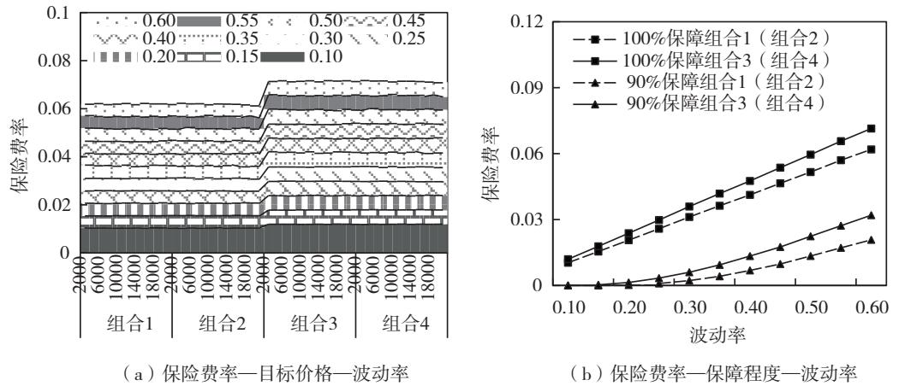  
注:固定变量 T 设为2 个月。 组合1\~4 是两种采价方式(亚式、增强亚式)与两种保障方向(看跌、看涨)的组合,分别对应于亚式看跌、亚式看涨、增强亚式看跌与增强亚式看涨。 下同  
图 4 保费费率与波动率之间的关系

保险周期是“保险 $^ +$ 期货”的要素之一,一般情况下,保险周期增长反映市场的不确定性和风险的增加,继而导致保险费率相应增高。 图 5 显示,在生猪 保险 $+$ 期货 个月的可选周期内 亚式与增强亚式结构保险的费率随着保险周期呈现不同程度的递增,但增速逐渐放缓。 除保险周期外,结算价格的采集周期(即图 2 采价期)也是“保险 $^ +$ 期货 产品设计的关键要素 并影响项目成本与赔付成效。 2023 年大商所明确要求生猪价格保险立项项目须将采价周期设置为保险周期的最后一个月,以促进赔付结算价格接近集中销售价格。 图 5(a)是整个保险期间采价的费率变化,图5(b)是保险期间最后一个月采价的费率变化。 通过比较发现,缩短采价周期将会减弱平均效应,提高结算价格的波动率,进而增加保险费率。

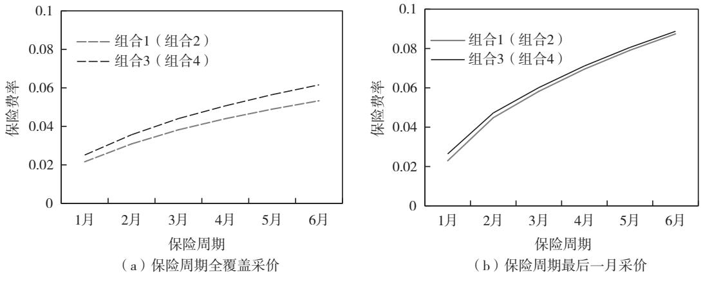  
注 固定变量 $\mathbf { \sigma } ^ { \sigma }$ 设为  
图 5 保费费率与保险周期、采价周期的关系

2. 实践论证与成本核算。 生猪“保险 $^ +$ 期货”通过生猪价格兜底与饲料成本控制 帮助养殖户抵御市场风险,改变经济单一补偿的机制,以“生产—市场”双重覆盖保障生猪行业的养殖效益,促进保险风险管理功能从保成本逐渐向保价格、保收入多元化推进。 图6 是生猪期货上市以来,生猪与饲料价格变动趋势图。 如果以猪粮比 $6 : 1$ 为生猪养殖的盈亏平衡点,当生猪价格降至饲料成本以下时,生猪养殖出现亏损。 若“保险 $^ +$ 期货”在此期间落地实施,则会“随行就市”确定亏损状态下的目标价格(或养殖利润),难以满足养殖户的风险保障需求并影响项目运行质效。 因此,在合理定价的基础上,设计出更贴近产业特征和风险保障需求的产品方案是试点可持续发展的内外部需求。

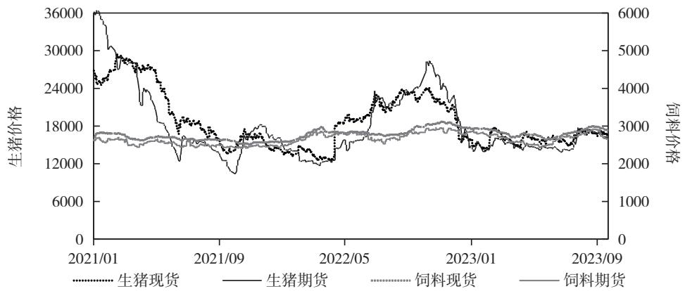  
图 6 生猪期货上市以来价格趋势与饲料成本变化

注 饲料期货价格为大商所猪饲料成本指数 饲料现货价格基于相同组成品种与调配比例 即玉米 豆粕 $= 0 . 6 8 : 0 . 2 )$ 计算而来 生猪 玉米 豆粕价格选自 年 月 日至 年 月 日期货主力合约的收盘价格(元/吨)

在定价分析之前,本文采用滚动时间窗口的历史波动率以及时变参数的 GARCH(1,1)波动率,估测“保险 $+$ 期货”定价环节中的价格波动率。 图 7(a)绘制了不同保险期限特定分位点历史波动率的锥形图,纵轴表示波动率,横轴表示长短不同的期限,折线代表不同分位数水平下的波动率情况。

显然,短期波动率跨度区间较大,稳定性小;长期波动率相对集中,稳定性强。 随着保险期限(跨度区间)的增长,波动性表现出较为明显的收敛性。 期货价格波动通常呈现非正态、有偏、肥尾等分布特征,平均波动率可能低估未来的波动率。 因此,期货公司倾向于以 $80 \%$ 或以上分位点的历史波动率为定价基准,使期权价格覆盖更多风险概率以预留盈利空间。 基于此,图 7( a)中阴影部分对应为不同保险周期内, $80 \%$ 分位点以上异常波动的风险敞口。 同时,GARCH(1,1)模型能够很好地刻画金融资产收益率序列的波动特性和厚尾现象,图 7(b)进一步描绘了整个样本期间 GARCH 波动率的分位分布,可见生猪与饲料价格的平均波动率处在$70 \% \sim 8 0 \%$ 分位,其中生猪价格的平均波动率为$0 . 3 6 2 , 8 0 \%$ 分位波动率为 饲料价格的平均波动率为 $0 . 1 4 4 , 8 0 \%$ 分位波动率为 0. 151。

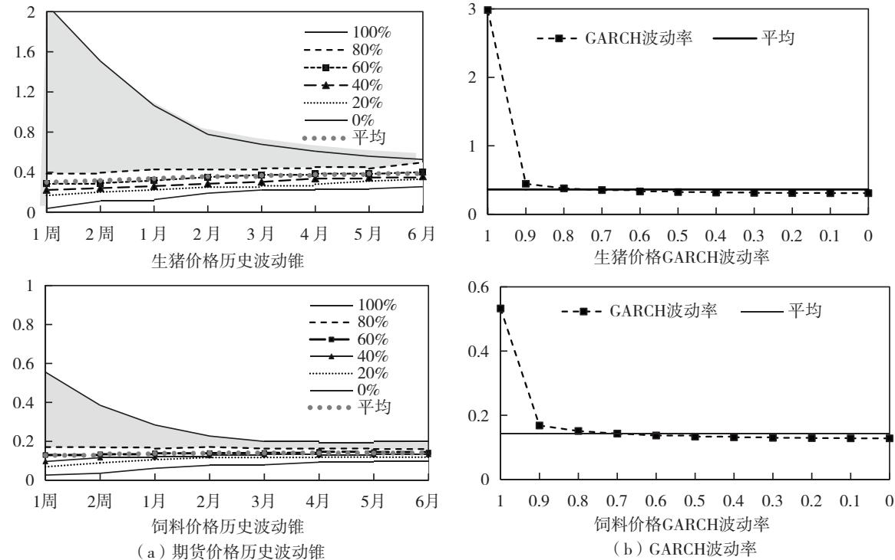  
图 7 期货价格历史波动锥(a)与 GARCH 波动率(b)

注:历史波动率表示为σ ＝ $\displaystyle \sigma _ { \mathrm { h v , n } } = \sqrt { \frac { \sum \left( \mathrm { R } _ { \mathrm { t } } - \mathrm { u } \right) ^ { 2 } } { \mathrm { n } - 1 } } \times \sqrt { 2 5 2 }$ ,其中 $\mathrm { R } _ { \mathrm { t } } = \mathrm { l n } ~ ( \frac { \mathrm { S } _ { \mathrm { t } } } { \mathrm { S } _ { \mathrm { t } - 1 } } ) ~ , \mathrm { u } = \frac { \mathrm { Z } _ { \mathrm { n } } \mathrm { R } _ { \mathrm { t } } } { \mathrm { n } }$ $\mathrm { S } _ { \mathrm { t } }$ 为 t 时刻期货价格, $\mathbf { u }$ 为平均收益率,n 窗口大小为保险期限。 GARCH 波动率方程为 $\scriptstyle \mathbf { \sigma } \mathbf { \sigma } _ { \mathrm { t } } ^ { 2 } = \psi + \varphi \ \varepsilon _ { \mathrm { t - 1 } } ^ { 2 } + \gamma \ \mathbf { \sigma } \mathbf { \sigma } \mathbf { \sigma } _ { \mathrm { t - 1 } } ^ { 2 }$ ,年化波动率为 $\overline { { \mathbf { \sigma } } } ^ { - } = \sqrt { 2 5 2 } \times \frac { 1 } { \mathrm { T - t } \mathrm { 1 } } ^ { \mathrm { ~ T ~ } } \mathbf { \sigma } ( \mathrm { s } )$ ds

以 波动率作为期权定价因子 图 展示了两种定价波动率下保险费率随保险周期变化的走势图。 图8(a)显示在可选保险周期内,生猪价格保险费率在 $3 \% \sim 1 1 \%$ 变动 其中仅 个月期限的保险费率不超过 $6 \%$ 。 依照立项要求,参保生猪重量默认为 100 公斤/头,如果“随行入市”的目标价格为 18000 元 / 吨(即 1800 元 / 头),那么 $1 \sim$ 2 个月亚式结构生猪价格保险的保费为 52 \~ 102元 头 增强亚式结构的保费为 $6 0 \sim 1 0 7$ 元 头 图显示在 月的保险周期 饲料项目的费率在 $1 \% \sim 3 \%$ ,远低于 $6 \%$ 。 若以料肉比 $3 : 1$ 推算,如果饲料目标价格 2800 元 / 吨( 即 840 元 / 头),那么1—6 月亚式结构饲料价格保险的保费分别为9. 14、13. 06、16. 16、18. 60、20. 70、22. 56 元 / 头,增强亚 式 保 险 的 保 费 分 别 为 10. 54、 15. 08、 18. 63、21. 42、23. 89、26. 06 元 / 头。

# 五、“保险 $^ +$ 期货”服务生猪养殖业风险管理效应分析

学术界和实务界对于“保险 $^ +$ 期货”功能定位与本源性问题存在的争议主要集中于两点:一是“保险 $^ +$ 期货”本质上是利用场外期权的“套期保值”,以农业保险基层组织与服务网络为依托推动小农户与大市场间有效衔接;二是“保险 $^ +$ 期货”核心在于发挥期货市场价格发现和套期保值两大基本功能,为农业保险提供签保理赔的价格参考和“再保险”渠道。 综合来看,“保险 $^ +$ 期货”以场外期权为本源,具有为农户提供“价格保险”亦或是为农业保险提供“再保险”服务的双重功能定位。

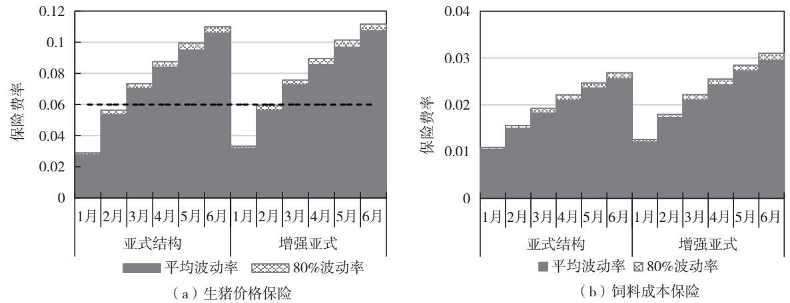  
注 两款保险产品结构均按照大商所项目方案要求设计 梯状图上部的阴影区域表示 $80 \%$ 波动率定价费率超出平均波动率定价费率(灰色区域)的风险溢价部分  
图 8 生猪价格保险费率(a)与饲料成本保险费率(b)

# (一)价格保险功能

“保险 $^ +$ 期货”以期货价格作为定价与理赔依据,与农业保险对未来价格波动的保障诉求相匹配。 作为价格指数类保险的创新形式,“保险 $^ +$ 期货”不可避免地存在基差风险———当期货价格变动无法瞄准现货价格走势,可能引发保险赔付不足以覆盖养殖户实际损失的风险。 因此,期货价格的公允性、代表性,是确保“保险 $^ +$ 期货” 发挥价格保险功能的基础与前提。 图 9 显示样本区间生猪与饲料市场的基差分布与箱线图,其中均值体现长期趋势、离散程度表示对长期趋势的偏离。 生猪“期货—现货”基差均值大于 0,但风险概率向左尾延伸,表明极端行情下,期货下跌幅度大于现货(或上涨幅度小于现货),可见“保险 $^ +$ 期货”能很好地弥补生猪价格大幅下跌产生的经济损失 尽管饲料期货价格始终低于现货价格,但“期货—现货”基差离散程度较小,因此基差风险相应较小。 同时,饲料市场基差分布重心右偏,即通常情况下,期货上涨幅度高于现货(或下跌幅度小于现货),那么“保险 $^ +$ 期货” 可较大程度覆盖饲料成本上涨

损失。

以信息份额∗作为期货价格发现功能的衡量指标 生猪期货与饲料期货在整个样本区间的信息份额为0.98 和0.91,基于滚动时间窗口的平均信息份额为 $70 \%$ 与 $57 \%$ 其中超出 区间 即期货发挥价格发现功能区间)占比为 $76 \%$ 和 $58 \%$ 。 由此可见,生猪、饲料期货市场具有较好的价格发现功能,能够为试点建设提供公允的价格信息。 图刻画了期货价格与现货价格之间的分位数相依性,表明期现价格同时处于某一状态的可能性。 在正态分布假设下,随着市场状况从一般( $\mathbf { q } = 0 . 5 )$ 走向极端( $\mathbf { q } { \longrightarrow } 0$ 或 1),期现价格相依性也会逐渐降低。 一般情况下( $\mathrm { q } = 0 . 5 )$ ,饲料市场期现价格相依性为 0. 67,高于生猪市场的 0. 53。 图 10( a) 显示期现价格在极端行情下的相依性显著超出了灰色区域表示的一般水平 表明生猪市场同涨共跌现象尤为明显。 图 10(b)显示相比于下尾相依性,饲料市场期现价格在极端上涨行情中具有更强的趋同效应。 如果一般( ${ \bf q } = { \bf 0 } . 5 )$ 对应普遍性,那么极端( $\mathbf q { \longrightarrow } 0$ 或 1) 反映短暂的存在。 进一步推理可得,生猪项目采用短周期、多批次的承保方式,能有效捕捉极端行情下现货市场价格波动风险,起到降本增效的效果。 相比之下,饲料成本保险适应于较长的保险周期,并对现货市场成本增量具有较好的经济补偿效应。

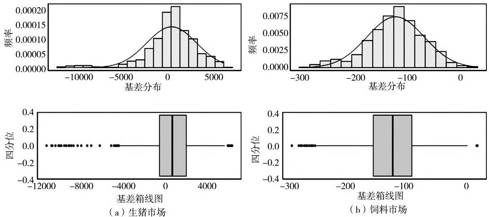  
注:期现基差为期货价格与现货价格的差值,即“期货价格—现货价格”

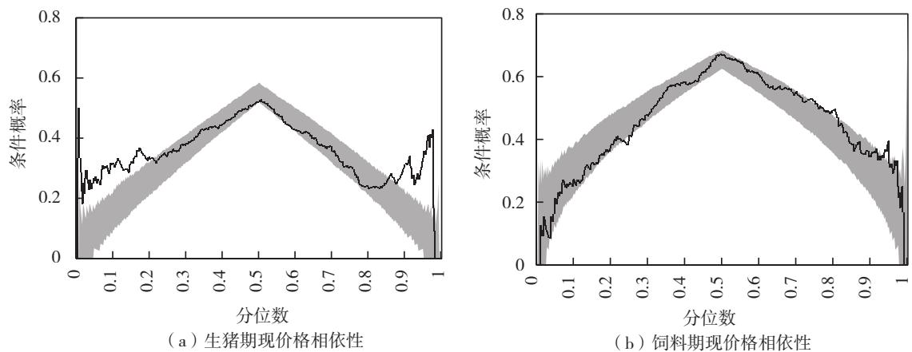  
图 9 生猪市场期现基差分布 (a) 与饲料市场期现基差分布 (b)

注 黑色曲线是基于相应市场样本数据所拟合的分位数依赖 阴影区域为正态分布假设下期货与现货价格分位数依赖的置信区间。 当分位数 $\mathrm { q } \in \left( 0 , 0 . 5 \right]$ ,下尾相依性λq $\mathsf { I } = \mathsf { P } ( \mathrm { X } \leqslant \mathsf { q } , \mathrm { Y } \leqslant \mathsf { q } ) / \mathsf { q }$ ;当分位数 $\mathbf { q } \in \left[ 0 . 5 , 1 \right)$ ,上尾相依性 $\mathrm { \Delta ) . _ { u } ^ { q } = \mathrm { P } }$ $( \mathrm { X { > } q , \mathrm { Y { > } q } ) / ( 1 { - } q ) }$

# 图 10 生猪市场期现价格相关性(a)与饲料市场期现价格相关性(b)

# (二)“再保险”功能

一般情况下,“再保险” 是对原保险的部分风险责任“再保险”。 面对系统性的价格风险,保险公司担心极端行情导致较大亏损,不愿意主动自留风险或根据市场情况自主安排风险管理路径,他们往往甘于“通道角色”并形成了路径依赖。 期货公司通过卖出期权承接保险公司全面风险责任后,依其风险内控要求,须在期货市场复制期权以维持风险中性。 本文基于“Delta 风险中性”理论与实践,进一步分析“保险 $^ +$ 期货”对保险风险的“再保险”功能 并探究如何最大限度实现风险转移 减少风险敞口。

图 11(a)显示随价格变化调整期货头寸以复制期权的对冲过程,其中 Delta 变化作为日内调仓的基准。 基于 Delta 风险中性原则,当期货价格变化导致 Delta 变化超出预设阈值,需要增减期货头寸来维持风险中性 原则上 场内对冲用期货头寸上的盈余能够抵消期权头寸所对应的亏损,但实际上 Delta 中性对冲涉及不断“追涨杀跌”,存在一定的风险敞口。 图 11( b) 进一步阐释了 Delta 对冲偏差产生的微观机理:期货价格 $\mathrm { A } _ { 0 }$ 变化到 $\mathrm { A } _ { \mathrm { t } }$ ,Delta中性对冲将会产生 $\mathrm { B _ { t } - B _ { 0 } }$ 的损失,并且该损失会随调仓间隔 $\mathrm { A } _ { 0 } { - } \mathrm { A } _ { \mathrm { t } }$ 的增大而平方级扩大。 因期权价格曲线的凸性,期货无法完全复制期权的非线性价值变动,对冲偏差由 Gamma 衡量。 高 Gamma 意味着期货价格的微小变化,将引起 Delta 的显著变化,进而拉大期货对冲的偏离程度

  
图 11 Delta 中性对冲过程(a)和对冲偏差(b)

图 12 显示无论是生猪项目还是饲料项目,Delta 中性对冲(灰色散点)都存在较大的风险敞口,并且到期结算越靠近目标价格越显著。 因此,试点建设要求承办期货公司具备一定的资本实力与风险承接能力,尤其是面对波动率迅速放大、市场趋势急速反转等情况,应提前对风险敞口进行压力测试和风险测算,督促其设立风险准备金,确保项目合规实施。 值得注意的是,当价格变动未触及索赔条款时,“保险 $+$ 期货”已完成风险中性对冲过程,且将大部分保费消耗在期货市场。 相比之下,价格朝“赔付” 方向变动的幅度越大,期货对冲的“再保险”效果越好,这也符合“再保险”的一般逻辑:赔付金额越高,意味着“再保险”需求越高,进而表明“保险 $^ +$ 期货”的风险管理效应越强。

然而,期货合约只能提供线性 Delta 对冲,不能完全适应期权 Gamma 风险的非线性特征。 在此情形下,择机买入相应场内期权是平衡 Gamma 风险敞口的有效策略。 图 12 显示相比于单纯的 Delta对冲过程,Delta－Gamma 对冲(黑色散点)能有效收紧对冲风险敞口 提高风险转移效率 进一步 以对冲组合价值与期权赔付的差值表示对冲偏差,比较分析两种对冲方式下的偏差的离散情况。 数据分析结果显示,生猪项目 Delta 对冲偏差的均值为0. 5489(标准差 140. 895),Delta－Gamma 对冲偏差的均值为 0. 170( 标准差 29. 112);饲料项目 Delta对冲偏差的均值为 0. 022( 标准差 8. 715),Delta －Gamma 对冲偏差的均值为 0. 006(标准差 1. 805)。由此可见,对冲偏差与价格波动率相关,其中生猪项目大于饲料项目,同时场内期权的运用将有助于收紧风险敞口,提升风险转移效率。 以上分析均假定相应品种场内期权已上市,且未考虑流动性等现实约束。 事实上,生猪期权合约尚未上市,且玉米、豆粕期权因流动性难以满足到期平仓需求,而未能规模用于“保险 $+$ 期货”的风险对冲。

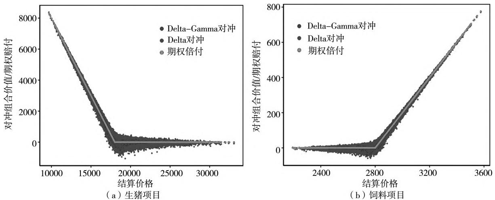  
注:默认生猪目标价格为18000 元/吨,饲料目标价格为2800 元/吨,保险周期为2 个月,Delta 与Delta－Gamma 对冲频率均为1次 / 日  
图 12 生猪项目对冲结果 (a)与饲料项目对冲结果 (b)

除非线性 Gamma 风险外,波动率也是影响对冲偏差的重要因素。 当市场行情变化过快时,Delta变化剧烈使得对冲偏离中性。 Delta 变化阈值设置的越小 期货价格波动导致的调仓频率越高 进而缩短图 11(b)中调仓间隔 $\mathrm { A } _ { 0 } - \mathrm { A } _ { \mathrm { t } }$ ,减少对冲损失$\mathrm { B _ { t } - B _ { 0 } }$ 。 因此,增加调仓频率有助于减小对冲偏差,提升风险转移效率。 图13 展现了随日度调仓频率由1 次/日增加到 10 次/日,对冲偏差的离散程度逐渐减少的过程 其中图 生猪项目对冲偏差的标 准 差 由 140. 895 逐 渐 减 少 至 45. 279, 图 13(b)饲料项目对冲偏差的标准差由 8. 715 逐渐减少至2.803。 不考虑交易成本、流动性约束等实际限制,增加调仓频率是有效降低风险敞口、充分发挥“再保险” 功能的重要举措。 然而,频繁调仓将会增加交易手续费 并且可能受到流动性约束而不断积累对冲磨损。 因此,实践中 Delta 变化阈值的设定需要考虑交易手续费、买卖价差等成本,在降低风险的内在需求与频繁调仓的成本约束之间进行权衡取舍。 另外,考虑到风险对冲过程中的磨损成本 期货公司在对场外期权报价时通常上调定价波动率,在一定程度上增加“保险 $^ +$ 期货” 运行成本。

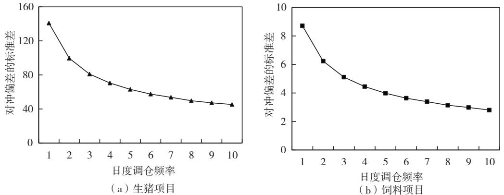  
图 13 不同调仓频率下生猪项目对冲偏差 (a)与饲料项目对冲偏差 (b)

# 六、政策建议

保险 $^ +$ 期货 试点建设将期货功能深度应用于农业保险领域,是构建多层次、立体化农业风险管理体系的重要环节 本文立足生猪价格与养殖成本两个视角,探讨“保险 $^ +$ 期货”服务生猪养殖市场风险管理市场条件、方案设计、定价机制及其风险管理效应。 研究发现:一是按照既定产品设计,预期波动率和保险周期是“保险 $^ +$ 期货”费率决定中的主要变量,对保险费率均具有正向作用。 其中,生猪价格保险费率约为饲料成本保险费率的 3倍,仅1—2 月保险周期的费率处在 $6 \%$ 以内。 二是生猪期现价格间较强的尾部相依性表明生猪项目短周期 多批次承保方式不仅适应畜牧养殖循环滚动生产的特点,而且有助于捕捉极端情况下猪市损失,提升价格风险保障功能与试点项目运行质效。三是 对冲与增加调仓有助于降低对冲风险敞口,提升风险转移效率和“再保险”功能,但会受到配套场内期权缺位、手续费与流动性等调仓成本制约。 基于此,本文提出如下建议。

第一 持续做好市场培育 将期货市场功能引向与试点发展要求相适应的良性循环,是“保险 $^ +$ 期货”降本增效的重要保证。 随着中国农业保险制度改革向纵深发展,“保险 $^ +$ 期货”将期货功能在农业保险中深度应用 高效融合 为农业保险提供签保理赔的价格参考与转移风险的“再保险”渠道,满足农业保险高质量发展的客观要求。 一方面,应做好生猪等新上市期货品种的市场培育工作,全面提升市场运行质量,增强期货价格与现货价格的关联性,以确保项目签保和理赔价格的公允性,并有效平滑期货价格波动,切实减少项目运行成本;另一方面,加快生猪等商品期权的上市进程,丰富风险对冲组合工具箱,拓宽金融惠农服务的广度与深度,同时完善做市商制度,增加合约流动性,减少频繁操作和复制场外期权所产生的磨损成本提升“保险 $+$ 期货”风险转移效率。

第二,强化业务风险控制。 “保险 $^ +$ 期货”项目建设流程长、参与主体多、资金金额大,严格的业务风险控制关系到整体项目的运行质效。 对于期货公司来说,生猪价格波动性强,致使期货对冲存在较大的风险敞口 极大考验期货公司的风险承接能力 因此 应加强对价格异常波动的监控 注意生猪价格上涨趋势反转为下跌趋势过程中的对冲风险,提前对风险敞口进行压力测试和风险测算,督促其设立风险准备金,避免出现“穿仓”等极端情境导致保险风险进一步恶化。 对于保险公司来说,保险公司仅充当了风险中性的交易经纪,在保险产品设计、费率厘定以及内部风险管理等方面还存在较大的优化空间。 因此,应促进保险公司回归其在产品开发与风险安排的主导作用,提升保险产品设计、对冲工具选择、与期货公司合作模式等方面的处置能力 探索期货期权转移农业保险风险的多元化路径。

第三,健全产品供给体系。 以贴近产业特征为导向,提升风险保障与服务供给能力是“保险 $^ +$ 期货”服务生猪养殖高质量发展的必由之路。 在疫病冲击 环保规制 非农就业等因素影响下 中国生猪养殖方式开始向规模化、集约化方向发展,养殖大户和企业养殖户所占比重不断攀升,但是,市场主体仍然以散养为主。 因此,应注重中小养殖户与规模养殖场的差异化风险保障需求,开发具有适度灵活性的专属产品,推动“保险 $^ +$ 期货”普惠性与选择性间有效平衡。 同时,现行的生猪养殖利润项目通常以猪饲料成本指数保险与生猪价格保险的组合形式呈现,通过成本叠加定价和分开结算理赔的方式,实现了生猪养殖成本控制和销售价格托底的双重收益保障 在此基础上 应进一步优化收益保障方案设计,发挥生猪价格下跌与饲料价格上涨的内在对冲机制,构建多层次产品供给和立体化风险防控体系。

# 参 考 文 献

1. 安 毅,方 蕊.我国农业价格保险与农产品期货的结合模式和政策建议.经济纵横,2016(7):64\~ 69  
2. 胡向东,石自忠,张合成.中国生猪市场调控政策:历史演变与未来选择.农业经济问题,2022(4):4\~ 14  
3. 李 铭,张 艳.“保险 $^ +$ 期货”服务农业风险管理的若干问题.农业经济问题,2019(2):92\~ 100  
4. 马 彪,李 丹.生猪价格指数保险中的系统性风险问题研究. 农业技术经济,2018(8):112\~123  
5. 潘方卉,王 宁,朱枨梓.饲料成本“保险 $^ +$ 期货”模式稳定猪肉市场价格波动的效果研究———基于非对称价格波动传导机制视角.中国农业资源与区划，2022（11）：155\~167  
孙 妍 陈建成 生猪利润保险产品设计与定价研究 保险研究  
7. 庹国柱,李 华.对于“保险 $+ _ { + }$ 期货”发展问题的思考.保险理论与实践,2021(1):28 \~ 35

8. 王 聪,刘 芳,何忠伟.美国生猪价格保险对中国生猪保险的启示.科技和产业,2021(6):197\~201

9. 王 克,张 峭,张旭光,聂 谦.猪周期、逆选择和我国生猪价格指数保险的发展.中国食物与营养,2016(11):42\~45

10. 王亚辉,彭 华.我国生猪价格指数保险综述.中国猪业,2014(10):10 \~ 16辛立秋 王 辉 保险 $^ +$ 期货 目标价格形成的有效性分析 基于农产品期货价格发现功能实证研究 价格月刊12 翔王祖刘晨阳王济民新阶段我国猪产业发展形势问题和对策农业经济问题2023(8):4×16

13. 徐媛媛,崔小年,王 聪,张 硕.“保险 $+ .$ 期货”模式能实现农产品市场风险管理闭环吗.保险研究,2022(7): $6 9 \sim 8 4 + 9 5$

14. 徐媛媛,李 剑,王林洁.“保险 $^ +$ 期货”服务地方优势特色农产品价格风险管理———运行机制、突出问题与政策融合空间.农业经济问题,2022(1):114 \~ 127

15. 余方平,刘 宇,王玉刚,尹 航.“保险 $^ +$ 期货”模式价格保险定价研究———以玉米为例.管理评论,2020(4):35\~47

16. 张利庠,罗千峰,韩 磊.构建中国生猪产业可持续发展的长效机制研究.农业经济问题,2020(12):50\~60

17. 张 峭,汪必旺,王 克.我国生猪价格保险可行性分析与方案设计要点.保险研究,2015(1):54\~61

18. 张燕媛,鞠光伟.政策性生猪价格保险制度改革:现实困境与补贴策略.农村经济,2019(7):89\~ 94

19. 郑承利,周星宇,张怡雅,陈 琨.鸡蛋期货价格保险设计以及农户最优投保选择———以湖北省为例.保险研究,2018(10):51\~64

# Pricing Mechanism and Effect Evaluation of “ Insurance ＋ Futures” in Managing Hog Breeding Market Risks

XU Yuanyuan,ZHANG Shuo,CUI Xiaonian,QI Haotian

Abstract:Based on the dual perspectives of breeding costs and market prices,this paper firstly explores the market conditions,scheme design and pricing mechanism of “insurance $^ +$ futures” serving in China’s risk management of hog breeding market. Risk management effects are further analyzed in view of the dual functional positioning of “price insurance” and “reinsurance”. The results suggest that volatility and insurance period are the crucial variables in determining the premium rates of “ insurance $^ +$ futures”, with the premium rate for hog insurance remaining below $6 \%$ only within a $2 -$ month period. Moreover,short－term and multi －batch underwriting adapts effectively to the characteristics of the circular rolling production of livestock breeding,but their risk transfer efficiency and “reinsurance” function are constrained by the absence of exchange － traded options,transaction fees,liquidity costs, etc. Finally,we propose continuously fostering market development,strengthening business risk control, and establishing a sound product supply system to promote the advancement of “insurance $^ +$ futures” in serving high－quality development of the hog breeding industry.

Keywords:Hog market risks;Insurance $^ +$ Futures;Breeding costs;Risk management effects

责任编辑:段艳艳