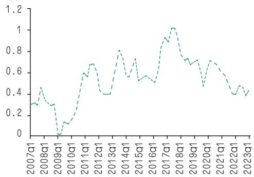
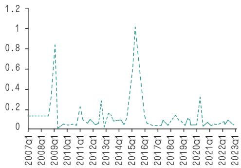
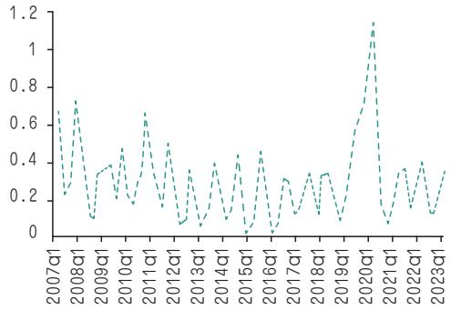
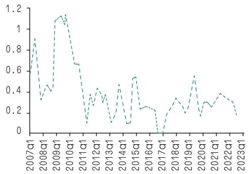
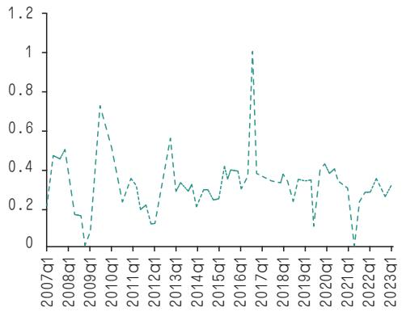
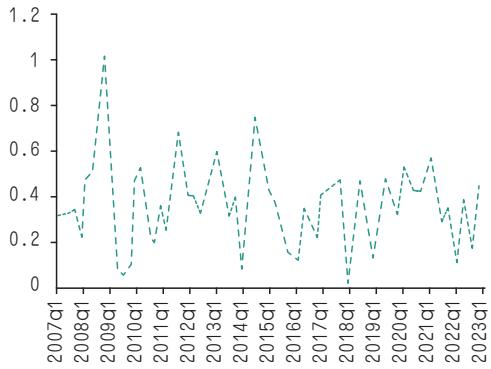
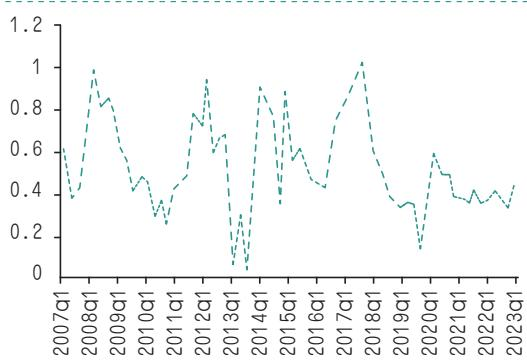
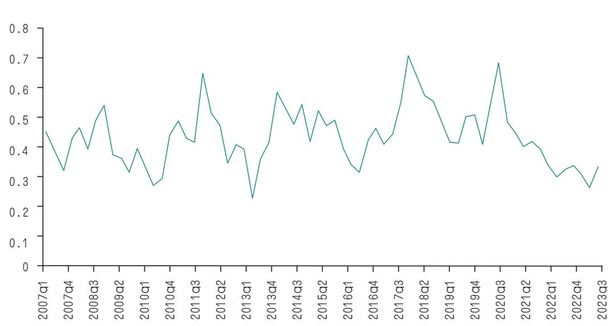

# 中国金融系统性风险：规模测定与特征演变

# 鲁 艺

摘 要 近年来，我国经济由高速增长模式逐步向高质量发展模式转变。在这一转型过程中，一些风险隐患逐渐显露，且由于金融化程度的不断加深，金融机构间关联日趋紧密，单个金融机构或金融市场的风险若不及时管控，则可能成为导火索引发系统性风险。为此，本文梳理了金融系统性风险测度方法，其中网络模型法基于对重要金融子市场构成的若干个网络模型的风险测度，进一步探析整体模型风险水平及网络模型间的风险联动和传导。结合指标变量法和网络模型法，本文对 2007—2023年我国金融系统性风险进行测定并分析其特征演变，针对现阶段部分市场的新特征提出相应政策建议。

关键词 金融系统性风险 风险规模测度 网络模型法 特征分析DOI:10.20134/j.cnki.fmr.2024.07.011

# 一、引言

2007 年美国次贷危机触发了一场席卷全球的金融动荡，给世界金融市场和经济带来巨大冲击，这也深刻体现出系统性金融风险的破坏力。随着金融市场不断发展壮大以及深化，单一主体的个别风险可能通过金融机构与金融市场的复杂关联传染演化成广泛的系统性风险，呈现出快速传播、影响广泛、破坏性强等特征。金融稳定委员会（FSB）将这类系统性风险解释为，由经济周期的波动、国家的经济政策调整或外部金融市场的不稳定等因素引起，可致使国家金融体系受到严重冲击，进而给金融体系和实体经济带来巨大的负面效应的一类风险。系统性金融风险不仅在国内不同金融机构间迅速蔓延，还会跨国际进行传染，如果对此类风险不加以重视防范，缺乏相应的监管及防范策略，则金融系统极有可能受到连锁反应冲击，甚至可能引发金融危机。

近年来随着我国经济发展模式的转变，以往高速增长阶段背后的风险隐患逐渐显露出来。我国政府高度重视这一问题，党的二十大报告明确表示要持续“强化金融稳定保障体系，牢牢守住不发生系统性风险底线”，可见防范和化解金融风险、维护金融安全仍是目前中央经济工作的重中之重，也是我国金融工作的永恒主题。伴随着我国金融改革的推进和金融创新持续发力，对于整个金融行业而言是机遇与挑战并存的，金融创新一方面会给金融市场注入活力，但另一方面也存在触发系统性风险的可能。在此背景下，如何准确识别潜在的系统性风险并进行评估，以及怎样有效地预防和解决此类系统性金融风险，已成为当前学术界关注的热门议题。

# 二、金融系统性风险界定

目前，学界主要从以下几个方面对金融系统性风险进行界定。 $\textcircled{1}$ 从风险发生广度 及 危 害 性 的 角 度，Benoit et al.（2017）认为，系统性金融风险产生的负面影响不仅仅作用于某一单个金融机构，而是能够使得众多市场主体同时遭受极大损失，并对整个宏观金融体系带来剧烈震荡和损坏，危害波及世界各国，对全球经济的发展产生巨大危害。 $\textcircled{2}$ 从风险传染性的角度，Yang et al.（2023） 认 为 系 统 性 金 融风险在整个金融领域乃至宏观经济体中展现出一种连锁作用，一旦某件事项触发风险，在各金融机构的紧密关联下，风险便可能激起一连串传染效应，迅速波及其他金融实体和体系；方意和王晏如（2023）将系统性金融风险概括归纳为，实体经济的外部冲击或金融部门的内部冲击，因金融机构之间以及金融市场之间过度的相互牵连而被放大，从而使整体金融领域的损失加深。 $\textcircled{3}$ 从金融市场功能的角度，Billio（2012）认为系统性的金融风险主要指在遇到紧急情况下会扰乱金融市场或机构的常规运作，进而引发特定方面的混乱或信息失衡，进一步导致金融系统的动荡，使得金融市场在资源配置方面的功能失效；何枫 等（2022）认为系统性金融风险最终表现形式为突发冲击引起的金融资产的协同崩盘，从而造成金融市场系统性崩溃。

基于以上研究，本文将金融系统性风险界定为由内外部因素冲击引起，牵涉流动性、杠杆、关联性等问题，并通过复杂交错的金融机构网络关联迅速扩散，危害范围极广，容易引发金融市场秩序混乱，以至对整个金融体系及实体经济产生深远的负面冲击与损害的潜在风险。

# 三、金融系统性风险测度

如何测度金融系统性风险是防范化解风险的重要环节，准确有效地测度风险规模，并通过分析风险指标波动情况可以提前预警金融系统性风险的发生，在很大程度上降低金融体系爆发危机的可能，从而保障整个金融体系的健康平稳运行。目前国内外学者主要有以下几种测度金融系统性风险的方法。

$\textcircled{1}$ 指标变量法。通过日常的风险监测以及以往研究经验，挑选出宏观风险评估指标，并根据横纵向对比设定一定数值波动范围，借助这些评估指标的数值波动，进行分析和判别整体风险水平以及波动情况。其优点在于通常这些宏观数据易获得且操作便捷，能够直观地比较实际测量值与标准值之间的差异。其局限在于可选择的指标变量众多，难以全面精确选择出能反映整个系统风险的指标组合。另外，指标变量仅仅反映出个别主体风险情况，并未体现出金融市场各机构间的关联性。

$\textcircled{2}$ 矩阵法。通过将风险发生后的危害严重程度和引起危害的概率，按其特点划分为不同级别，采用多维数据表格来构筑风险评估矩阵，从而对风险程度进行定性衡量。矩阵法的优点在于不是仅考虑单个机构的风险状况，而是考虑了在各个主体间关联下的整体风险水平，因此更具有现实意义。而矩阵法局限性在于，并未对风险因子及其影响规模进行具体的定量分析。

$\textcircled{3}$ 网络模型法。以各个金融部门间相互关联以及承担的风险敞口为基础，建立起复杂的网络模型以测度风险规模。使用网络模型法构建金融系统性风险指标，首先对金融子市场进行划分，选取几个重要指标作为代表，从而形成若干个网络市场，然后对所有的网络模型和模型中的各个子市场进行测算，进而探析整体模型风险水平和网络体系内各金融子市场之间联动及风险传导情况。网络模型法的优点为其连接了各个单独部门与整个金融体系的风险传染渠道，若任意部门遭遇风险，通过这种方式将能够迅速跟进到网络中的其它部门，从而有效防范风险进一步扩散和传染。

$\textcircled{4}$ 边 际 预 期 损 失 法（MES） 及 扩展。MES 主要是针对极端情况下最大损失发生时对平均损失的度量。Acharyaetet al.（2010）采用 MES 和 SES 等方法测算了单个金融机构对整个金融体系带来的期望损失。基于这一研究，Banulescu &Dumitrescu（2015）进一步提出成分期望损失（CES）法，通过测算评估单一风险进而估算整个系统的综合风险。MES 法的优势在于它能够衡量超出分位数范围的极端损失。其局限性在于着重强调了金融机构之间的关联性，而未充分考量金融机构自身规模与杠杆等要素对可能产生系统性风险的影响。

$\textcircled{5}$ 条件在险价值法（CoVaR）。CoVaR测算某特定金融子市场在其它子市场发生极端风险状况时的潜在损失风险，即在特定 VaR 指标水平上的条件在险价值。Adrian & Brun （2016） 运 用 CoVaR 模 型对时间维度进行分析，实证检验了未来$\triangle \ C o \ V a \mathrm { R }$ 的预测值和当前的△ CoVaR 具有很强的负相关性，证实了系统性风险呈现周期性变化特征。CoVaR 有效度量了连贯的市场风险，重点关注金融市场的尾部损失，测度了超出阈值的所有损失。

基于上述分析可知，指标变量法和网络模型法都是从结构上测量金融系统性风险，特别是网络模型法通过网络结构来筛选系统性重要部门，测算结果更容易体现出整个金融体系的风险动态情况。因此，在综合对比了主要的系统性金融风险评估方法后，本文采用指标变量法和网络模型法相结合测度中国各金融子市场和整体系统性金融风险。首先通过选取代表性指标测度各金融子市场的风险状况，计算得出各金融子市场的风险指数，再通过一定的加权方法来计算整个系统性的金融风险，考虑到各金融子系统市场间存在严重的相互影响，因此本文通过时变权重的方法计算整个系统金融风险的权重，具体计算公式为：

$$
\scriptstyle { F R S I _ { t } = \sum \left( Z _ { i t } \times S _ { i } / \sum S _ { i } \right) \times C _ { t } }
$$

其中，FRSIt 为系统性金融风险压力指数，即测度系统性金融风险的主要指标。Zit 为第 i 个金融子系统市场在某年季度 t的风险子指数。本文选取了对中国影响最大的 7 个金融子系统市场：银行市场、股票市场、债券市场、保险市场、房地产市场、外汇市场和货币市场。Si 为各金融子系统市场的权重，通过各金融子系统市场指数与GDP建立SVAR模型得到的各自对GDP 冲击的累积响应函数值来确定。 $C t$ 是各金融子系统市场指数之间相关系数矩阵。表 1 列示了各金融子市场选取的风险指标含义。

银行市场的风险主要体现在流动性风险水平上，考虑到银行间拆借行为在维护银行市场稳定中发挥了重要作用，本文选取3个月期银行间同业拆借利率与3个月期定期存款利率之差作为衡量指标，该值越大反映拆借成本越高，从而可能弱化拆借行为，降低银行抵御风风险的能力；股票市场的风险主要体现在波动率上升或者流动性水平降低等，本文选取我国上证指数 GARCH 波动率衡量股票价格波动，股票市场波动剧烈会引起市场的恐慌性抛售，影响股票市场功能的正常发挥；债券市场的风险主要体现在期限利差的波动上，本文选取剩余年限1年与剩余年限 10年国债收益率之差衡量期限利差，利差的波动会影响投资者持有长短期资产意愿与市场流动性；保险市场的风险主要体现在综合赔付变动上，本文选取当期原保险赔付额除以当期向前一年时间段原保险赔付额的最小值来衡量赔付变动情况①，保险机构负债端承压会增加经营压力，由于其覆盖面广、与市场联动性强，从而对金融市场甚至实体经济造成冲击；房地产市场风险主要体现在房产交易情况以及房价波动上，本文选取中国国房景气指数变化率衡量房地产市场活跃程度，房地产市场与金融机构和金融市场关联性极强，房产市场景气情况易对整个金融体系造成影响；外汇市场风险主要体现在本国货币币值波动上，本文选取人民币名义有效汇率指数变动率来衡量人民币汇率变动情况，汇率大幅波动导致的人民币剧烈贬值或升值会对资本项目和经常项目造成非正常的扰动，特别是发生恶性贬值情况下容易造成资本大幅流出，若处理不当易导致汇率进一步贬值的恶性循环，进而引发系统性金融风险甚至经济危机；货币市场风险主要体现在流动性水平和利率变动上，本文选取一周和一年期 SHIBOR 期限利差来衡量长短期资金拆借利差，危机越严重，持有短期容易变现资产的意愿越强烈，则利差越大，从而反映市场风险水平。

表1 各金融子市场风险指标  

<table><tr><td rowspan=1 colspan=1>市场</td><td rowspan=1 colspan=1>风险指标选取</td></tr><tr><td rowspan=1 colspan=1>银行</td><td rowspan=1 colspan=1>3个月期银行间同业拆借利率与银行3个月期定期存款利率之差</td></tr><tr><td rowspan=1 colspan=1>股票</td><td rowspan=1 colspan=1>中国上证指数GARCH 波动率</td></tr><tr><td rowspan=1 colspan=1>债券</td><td rowspan=1 colspan=1>中国剩余年限1年国债收益率与剩余年限10年国债收益率之差</td></tr><tr><td rowspan=1 colspan=1>保险</td><td rowspan=1 colspan=1>原保险赔付额除以一年滚动时间窗口最小值</td></tr><tr><td rowspan=1 colspan=1>房地产</td><td rowspan=1 colspan=1>中国国房景气指数变化率</td></tr><tr><td rowspan=1 colspan=1>外汇</td><td rowspan=1 colspan=1>人民币名义有效汇率指数变动率</td></tr><tr><td rowspan=1 colspan=1>货币</td><td rowspan=1 colspan=1>一周和一年期SHIBOR期限利差</td></tr></table>

数据来源：人民银行官网、中国债券信息网、外汇局官网、金融监管总局以及中国宏观经济数据库（CEIC）。

$$
\widehat { Z _ { i t } } { = } ( Z _ { i t } { - } Z _ { m i n } ) / ( Z _ { m a x } { - } Z _ { m i n } )
$$

同时，为了消除不同量级所造成的影响，本文按照方程（2）进行标准化处理后，各金融市场风险衡量指标均在0至1区间，且数值越大表示风险越高。本文选取了2007年第一季度至2023年第四季度的数据对我国金融系统性风险进行计算测定。

# 四、中国金融系统性风险特征分析

根据上文所述的测定方法计算出我国银行、股票、债券、保险等各金融子市场的风险指数（图 1\~7），并使用 Stata 得出各金融子系统市场风险指数相互之间的相关系数矩阵（表 2）。

根据各金融子市场风险指数以及市场间相关系数，通过对公式（1）的测算，得出 2007 年第 1 季度至 2023 年第 4 季度中国金融风险压力指数FRSI变化情况（图8）。

  
图1 银行市场风险指数

  
图2 股票市场风险指数

  
图4 保险市场风险指数

  
图3 债券市场风险指数

  
图5 房地产市场风险指数

  
图6 外汇市场风险指数

从图8可以看出自2007年以来，我国金融系统性风险整体呈现出“先降后升再降”的动态演化趋势，具体看来呈现如下区间变化特征。

$\textcircled{1}$ 2007 年一季度至 2008 年四季度：  
2007 年底美国房地产市场泡沫引发的次贷

危机及金融危机使我国股票市场、债券市场、外汇市场和宏观经济受到严重外部冲击，这些子市场的风险压力迅速攀升。债券市场（图3）和外汇市场（图6）在这一阶段达到峰值，随着其他金融子市场接连遭遇风险冲击，我国系统性金融风险迅速提升至较高风险水平。

  
图7 货币市场风险指数

$\textcircled{2}$ 2009 年一季至 2010 年四季度：为应对国内经济的严峻形势，我国 2008年底推出“四万亿计划”以扩大内需刺激经济，重点铺排基础设施建设、保障性住房和灾后重建等领域。在这一阶段，四万亿刺激计划的积极影响日益凸显，伴随着国内宏观经济的逐步回暖，各个金融市场的风险水平逐步降低，使得我国系统性金融风险逐步摆脱高位状态，转为维持在较低水平。

$\textcircled{3}$ 2011 年一季度至 2013 年四季度：我国银行市场（图 1）与货币市场（图 7）的风险水平受欧洲债务危机、我国地方政府债务压力以及影子银行的风险因素等而迅速增长，银行业主要是因为不良贷款率的上升导致风险压力水平提高，货币市场则是由于流动性过度升至较高风险状态，而该阶段我国股市、债市和汇市等均保持平稳状态，因此在多个市场风险平衡下，该阶段我国金融风险短暂升高后逐渐回落至低风险区域。

$\textcircled{4}$ 2014 年一季度至 2015 年二季度：这一时期随着我国股市步入牛市周期，股市泡沫逐渐膨胀，股票市场风险迅速集聚（图 2），在此时达到阶段峰值。股市泡沫持续到2015年上半年，随着大规模股灾的发生，股市泡沫因此破裂，股票市场风险才恢复至较低水平。受此期间股市泡沫风险的刺激，我国的系统性金融风险维持在一个相对较高的状态。

$\textcircled{5}$ 2015 年三季度至 2017 年三季度：由于2016年我国部分二线城市如厦门、合肥等房价暴涨，在该阶段我国房地产市场风险快速攀升（图 5），达到阶段峰值，但随即国内多地出台了一系列强力的调控措施，这些政策显著抑制了投资炒房现象，有效地缓解了房地产市场风险的急速上升。与此同时，发生股灾后我国对股市的监管也日益趋严，股市风险趋于平稳。因此该阶段我国系统性金融风险处于较低水平。

表2 各金融子系统市场指数相关系数矩阵  

<table><tr><td rowspan=1 colspan=1>市场</td><td rowspan=1 colspan=1>银行</td><td rowspan=1 colspan=1>股票</td><td rowspan=1 colspan=1>债券</td><td rowspan=1 colspan=1>保险</td><td rowspan=1 colspan=1>房地产</td><td rowspan=1 colspan=1>外汇</td><td rowspan=1 colspan=1>货币</td></tr><tr><td rowspan=1 colspan=1>银行</td><td rowspan=1 colspan=1>1</td><td rowspan=1 colspan=1>-0.1429</td><td rowspan=1 colspan=1>-0.8076</td><td rowspan=1 colspan=1>-0.0218</td><td rowspan=1 colspan=1>0.0304</td><td rowspan=1 colspan=1>0.0798</td><td rowspan=1 colspan=1>0.1774</td></tr><tr><td rowspan=1 colspan=1>股票</td><td rowspan=1 colspan=1>-0.1429</td><td rowspan=1 colspan=1>1</td><td rowspan=1 colspan=1>0.1687</td><td rowspan=1 colspan=1>0.0170</td><td rowspan=1 colspan=1>0.1423</td><td rowspan=1 colspan=1>0.2079</td><td rowspan=1 colspan=1>0.1275</td></tr><tr><td rowspan=1 colspan=1>债券</td><td rowspan=1 colspan=1>-0.8076</td><td rowspan=1 colspan=1>0.1687</td><td rowspan=1 colspan=1>1</td><td rowspan=1 colspan=1>0.0792</td><td rowspan=1 colspan=1>0.1530</td><td rowspan=1 colspan=1>-0.1796</td><td rowspan=1 colspan=1>−0.1424</td></tr><tr><td rowspan=1 colspan=1>保险</td><td rowspan=1 colspan=1>−0.0218</td><td rowspan=1 colspan=1>0.0170</td><td rowspan=1 colspan=1>0.0792</td><td rowspan=1 colspan=1>1</td><td rowspan=1 colspan=1>0.0505</td><td rowspan=1 colspan=1>0.0204</td><td rowspan=1 colspan=1>-0.1357</td></tr><tr><td rowspan=1 colspan=1>房地产</td><td rowspan=1 colspan=1>0.0304</td><td rowspan=1 colspan=1>0.1423</td><td rowspan=1 colspan=1>0.1530</td><td rowspan=1 colspan=1>0.0505</td><td rowspan=1 colspan=1>1</td><td rowspan=1 colspan=1>-0.3735</td><td rowspan=1 colspan=1>-0.0778</td></tr><tr><td rowspan=1 colspan=1>外汇</td><td rowspan=1 colspan=1>0.0798</td><td rowspan=1 colspan=1>0.2079</td><td rowspan=1 colspan=1>-0.1796</td><td rowspan=1 colspan=1>0.0204</td><td rowspan=1 colspan=1>-0.3735</td><td rowspan=1 colspan=1>1</td><td rowspan=1 colspan=1>0.2391</td></tr><tr><td rowspan=1 colspan=1>货币</td><td rowspan=1 colspan=1>0.1774</td><td rowspan=1 colspan=1>0.1275</td><td rowspan=1 colspan=1>-0.1424</td><td rowspan=1 colspan=1>−0.1357</td><td rowspan=1 colspan=1>−0.0778</td><td rowspan=1 colspan=1>0.2391</td><td rowspan=1 colspan=1>1</td></tr></table>

  
图8 2007 年第1 季度至2023 年第 4季度中国金融风险压力指数变化情况

$\textcircled{6}$ 2017 年四季度至 2018 年四季度：随着中美贸易摩擦爆发，美国对华多项出口商品大幅加征关税，受此外部不利因素的影响，我国外部金融市场风险的迅速上升，进而引起银行部门风险的蔓延以及证券市场的剧烈波动，对我国短期资本流动和人民币汇率稳定产生较大负面冲击。因此该阶段我国系统性金融风险再次攀升至高风险状态。

$\textcircled{7}$ 2019 年一季度至 2019 年三季度：我国政府高度重视系统性金融风险的防范化解，反复强调“守住不发生系统性风险的底线”，在此过程中，随着一系列金融风险防范、监管加强以及结构性降杠杆等系列金融改革制度陆续实施，该阶段我国系统性金融风险逐渐降低。

$\textcircled{8}$ 2019 年四季度至 2020 年二季度：受全球新冠肺炎疫情的严重冲击，我国实体经济受挫、消费降低等因素使得市场不确定性提高，各金融子市场出现激烈波动，其间债券、房地产以及保险市场（图 4）位于高风险水平，尤其是保险市场风险在此时达到峰值。该阶段我国系统性金融风险指数明显上升，进入高风险阶段。

$\textcircled{9}$ 2020 年三季度至 2023 年四季度：伴随国内疫情影响得到控制，逐渐复工复产提振了国内经济与消费活力，虽然仍面临着经济增速放缓、房地产市场压力上升、海外疫情形势严峻等多方面不利因素，但我国如今处于货币政策和宏观审慎政策双支柱调控的新阶段，在逆周期的货币政策和严格的监管政策的双重作用之下，我国的系统性金融风险整体呈现出下降趋势。

# 五、结论与建议

近年来，我国政府和金融监管机构积极出台各项政策防范化解系统性风险，取得了一定的阶段性效果，但目前我国金融市场监管中仍存在一些风险隐忧，特别是国内房地产市场仍处于整体低迷，而美联储降息预期一再落空，造成人民币汇率持续承压，故需尤为谨防房地产市场和外汇市场这两个金融子市场的风险变动情况。针对上述金融系统性风险分析，本文建议可从以下方面采取措施。

$\textcircled{1}$ 采用宏观审慎与货币政策“双支柱”的宏观调控政策维稳金融体系。自全球金融危机爆发后，监管机构逐渐意识到不能靠评估单一金融部门的稳定性来判断整个金融系统是否安全，因而需要探索一条在宏观层面能够有效预防及化解系统性金融风险威胁的路径，以实现金融市场的稳定。在传统货币政策构架中引入宏观审慎的政策手段，运用这两种政策互相搭配进行调控，结合了“货币政策与宏观审慎政策”的双支柱宏观调控政策，不仅加强了宏观经济管理的效果，在防范化解系统性金融风险方面也有着更强的政策效应。

$\textcircled{2}$ 结合多种方法测度金融系统性风险，配合货币政策加以防范。随着中国各类金融机构、交易场所以及金融产品趋于多样化，金融风险的管理难度逐渐增加。监管力度过强可能造成管理成本过高，耗损金融运营的效能，还可能阻碍金融和经济的发展。因此，本研究所采用的测度方法能够评估中国金融系统整体所面临的系统性风险程度，在通过综合定量分析得出金融风险度量指标上升时，应加强对金融机构的监督，并运用货币政策进行系统性风险的防控；反之，若风险指标较低，则可以适当放松对金融主体的限制，这样的措施既能在避免系统性风险爆发的同时，又能有效释放金融市场的活力。

$\textcircled{3}$ 健全金融监测体系，强化国际间金融监管合作。随着经济全球化的发展以及金融化水平不断加深，这对当前金融业监管提出了新的挑战，这迫使我们必须调整和完善旧有的金融监控框架，从时代发展和市场需求的高度去完善金融监管手段，构筑更为全面的金融监管网络，更有效地预防和应对系统性金融风险。同时，随着国际金融之间不断深化发展，各国的金融监管体系不能够孤立运作，我国应在构建适合国内实际情况的监管体系时，积极与国际金融风险监控机构进行广泛交流与协作，确保在全球化经济环境中能更迅速、高效地识别和处理潜在金融风险。

学术编辑：卢超群

# 参考文献

[1] 方意,王晏如.系统性金融风险：理论机制、预警体系与双支柱政策框架[J].贵州大学学报(社会科学版),2023,41(04):92-99.  
[2] 何枫,郝晶,谭德凯.中国金融市场联动特征与系统性风险识别[J].系统工程理论与实践,2022,42(02):289-305.  
[3] 李志辉,朱明皓,李源.我国金融机构的系统性风险溢出研究：测度、渠道与防范对策[J].金融研究,2023,(04):55-73.  
[4] 罗安邦,姚雪松,徐飞.中国金融风险的测度、成因及对策[J].全国流通经济,2021,(03):147-149.  
[5] 庞加兰,王倩倩,吴露露.金融开放背景下系统性金融风险测度与防范[J].征信,2021,39(05):84-92.  
[6] 石广平,刘晓星,段聪颖.系统性金融风险的度量及其时变经济效应研究[J].商业经济与管理,2022(03):87-100.  
[7] 孙树强.系统性金融风险测度、发展和演变：一个综述[J].金融市场研究,2020(10):14-28.  
[8] 谭中明,王逍,杨素敏.基于压力指数的系统性金融风险跨市场传导研究[J].经济论坛,2023,(07):139-152.  
[9] 陶玲,朱迎.系统性金融风险的监测和度量——基于中国金融体系的研究[J].金融研究,2016,(06):18-36.  
[10] 杨立勋,林嘉懿,孟上诗.中国金融压力指数及监测效能评估[J].上海经济研究,2024,(01):106-120.  
[11] 杨子晖,陈里璇,陈雨恬.经济政策不确定性与系统性金融风险的跨市场传染——基于非线性网络关联的研究[J].经济研究,2020,55(01):65-81.  
[12] 张晶,高晴.中国金融系统压力指数的设计及其应用[J].数量经济技术经济研究,2015,32(11):41-57.  
[13] 张勇,彭礼杰,莫嘉浩.中国金融压力的度量及其宏观经济的非线性效应[J].统计研究,2017,34(01):67-79.  
[14] 赵虎林.我国系统性金融风险的跨市场传染效应研究[J].统计与决策,2023,39(11):150-155.  
[15] 朱波,杨文华,邓叶峰.非利息收入降低了银行的系统性风险吗?——基于规模异质的视角[J].国际金融研究,2016,(04):62-73.  
[16] Achar ya V,Pedersen H,Philippon T.Measuring Systemic Risk[J].Review of Financial St udies,2017,30(1):2-47.  
[17] Billio M,Getmansky M,Pelizzon L.Dynamic risk exposures in hedge funds[J].Computational Statisticsand Data Analysis,2012,56(11):3517-3532.  
[18] Illing M,Liu Y.Measuring financial stress in a developed country:An application to Canada[J].Journal ofFinancial Stability,2006,2(3):243-265.  
[19] Ming-Yuan Y,Chengjin W,Zhen-Guo W,et al.Inf luential risk spreaders and their contribution to thesystemic risk in the cryptocurrency network[J].Finance Research Letters,2023,57  
[20] Vermeulen R,Hoeberichts M,Vašíček B,et al.Financial Stress Indices and Financial Crises[J].OpenEconomies Review,2015,26(3):383-406.

# Systematic Risk in China's Financial System: Scale Measurement and Characteristic Evolution

LU Yi

（China Financial Research Institute, Southwestern University of Finance and Economics）

Abstract  In recent years, China's economy has gradually shifted from a high-speed growth mode to a high-quality development mode. In this transformation process, some hidden risks are gradually revealed, and due to the deepening of the degree of financialization, the connection between financial institutions is becoming increasingly close. The risk of individual financial institutions or financial markets, if not controlled in a timely manner, may become a fuse that triggers the systemic risk. This paper combines the indicator variable method and the network model method to measure and analyze the evolution of China's financial systemic risk from 2007 to 2023, and puts forward corresponding policy recommendations for the new characteristics of some markets at this stage.

Keywords  Financial Systemic Risk, Risk Scale Measurement, Network Modeling Approach, Characteristic Analysis

JEL Classification  E44 G18 G29