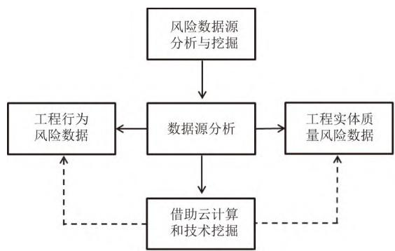
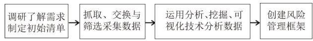

# 基于大数据技术水利工程的动态质量风险管理

邓聪[上海浦东路桥(集团)有限公司，上海市200135]

摘要：尽管大数据技术不仅被应用于水利工程领域，而且将成为智慧水利建设的重要技术基础，但是对于水利行业许多从业者而言，大数据技术仍停留在较为抽象的概念阶段。以水利工程质量风险管理为切入点，通过阐述、探讨与分析这一主要由质量风险管理框架和策略组成的大数据技术的应用点，以期为行业同仁了解水利工程中大数据技术运行机制提供一定参考。

关键词：大数据；水利工程；质量；风险；框架；策略中图分类号：TV698 文献标志码：B文章编号：1009-7716(2024)06-0222-03

# 0引言

2021年，国家发布水利《“十四五”期间推进智慧水利建设实施方案》，并重点强调水利数字化建设。大数据技术是水利数字化建设的重要支撑之一，在“十三五”期间，其已在水利工程中较大范围的推广与应用，如大坝运营"、安全风险管理[2]、平台建设[3]等，并取得了效果较为显著。

在各项应用中，基于大数据技术水利工程的质量风险管理研究相对成熟、系统，但鲜有对这些研究与应用成果进行总结与梳理。因此，课题组在大量调研与分析基础上，不仅重点阐述水利工程基于大数据的数据源与管理框架，还重点探讨由风险清单制订、数据采集和数据分析三部分组成动态质量风险管理体系以及相对应的质量风险管理策略，以期快速推动大数据在水利工程发展与应用。

# 1水利工程质量风险数据源与管理框架

# 1.1风险数据源的分析与挖掘

水利工程风险数据源的分析与挖掘两部分工作均主要围绕水利工程行为风险和水利工程实体质量风险展开，参加流程见图1。

# (1)数据源分析

由于水流工程建设的质量风险主要与两个方面有关，一方面与工程建设相关的行为相关，另一方面与工程实体质量有关，因而海量的质量风险数据也源自这两个方面：第一为工程行为风险数据，既包括招投标阶段对设计、施工及监理等单位的资质、业绩、人员等数据信息的收集，政府、协会及监理等机构对工程质量监督检查数据（是否认真履行检查检测职责、检测数据结构是否发现问题、问题是否得到解决与反馈），又包括建设和施工单位对工程质量自查自控数据（是否按要求应检尽检、认真仔细检），还与一线人员作业操作行为数据（是否符合标准规范要求）。第二为工程实体质量风险数据，主要指水利工程主要环节和关键部位的质量控制标准信息，如混凝土配合比、混凝土力学性能、养护时间等信息。

  
图1风险数据源的分析与挖掘流程图

基于上面两方面数据，并结合数据资源库的历史数据，大数据技术对这些数据进行筛选、清洗与综合分析，为政府相关部门和建设方做出决策，以及实时预警与控制工程质量风险提供可靠的依据，确保质量监督工作高效、省时、省力。

# (2)数据源挖掘

尽管数据主要来源于水利工程实体和行为两大方面，但这两个方面囊括了非常多的能生成与质量相关数据的风险要素。因此，面对水利工程中如此庞大、复杂且不稳定的质量风险要素，需要借助大数据超强的云计算能力和挖掘技术（统计、决策树、神经网络等），才能从海量、不全面、模糊的、有噪音且结构形式多样复杂（多以半结构和非结构化为主，包含少量结构化数据)的实际数据中，提取出对人类有潜在利用价值的信息和知识，通过发现内在规律并预测风险，最终实现高效管理水利工程质量风险的目的。

# 1.2风险管理框架创建

传统基于形成机理的风险识别方法可以识别一定数量的风险，但是比较有限，且无法准确反映实际风险状况。然而借助大数据技术就完全不同，其能够对与水利工程相关的大量数据信息进行收集、储存、清洗和分析，实时整理出符合实际情况的有价值的数据信息，以利于有关人员对质量风险进行控制。此外，依赖大数据技术挖掘有价值信息，还可实时对水利工程质量风险的发展变化做出判断与预测。总之，无论进行水利工程质量风险管控，还是质量风险预测，都需要建立以大数据技术为基础的风险管理运行流程或框架，才能保证数据信息收集、储存、分析与反馈的时效性与价值。基于大数据技术的质量风险管理框架主要包括风险清单制订、数据采集和数据分析三个方面（见图2）：（1）制订初始质量风险清单，经实地调查，了解与确定不同水利监管或应用单位与部门的质量管理需求，并结合文献调研与理论分析，制订初始质量风险清单。该部分工作是利用大数据技术开展水利工程质量风险管理的基础和关键，也是后期建立数据库的前提。（2)采集数据，采取抓取、交换等方式收集与水利工程质量风险相关的各类数据，基于初始风险清单，并根据数据特性特征筛选出有潜在价值的数据，筛选作业内容主要包括控制数据内容、采集频次、数据格式等。（3)分析数据，利用数据分析技术、数据挖掘技术、数据可视化技术等方法，结合初始质量风险清单，对所采集的有价值数据进行分析，及时分析与预警水利工程项目中的质量风险，并优化质量风险清单。

  
图2风险管理框架创建流程图

由于水利工程的质量风险因素不仅多，而且始终处于动态变化当中，因此，需要在初始风险清单（基于不同水利项目类型和建设阶段所创建质量风险指标集的汇总)基础上，随着项目持续推进，不断循环、细化与深化数据采集与数据分析，动态补充与优化风险清单子集，形成行之有效且无限契合实际质量风险状况的总清单。

# 2水利工程质量风险管理策略

# 2.1明确质量风险管理的主体与要求

质量风险管理主体，水利工程质量风险管理主体涉及政府、协会、建设、施工、监理等关联方，如施工单位对工程质量施行自建、互检和专检，监理依据法律法规、制度、合同和标准开展横向质量监督监管；工程建设方或法人依据相关制度并监理质量监督体系，建设全过程中不定期进行质量检查活动；质量管理监督单位根据水利工程项目实际情况特点，采用行政手段对工程质量进行纵向监督，而且是分深浅度与广度、有重点、抓关键的进行监督，确保施工关键环节达标、质量合格。

# 2.2创建动态质量风险管理体系

由于水利工程质量风险的生成因素始终处于动态发展变化中，因而相应的质量风险框架(或质量风险管理体系)或质量风险识别体系也为动态。为了质量风险管理体系尽可能地契合实际质量风险情况，须做好三个方面工作。

# (1)创建质量风险清单或指标体系

基于质量风险需求，结合试验数据、统计列表、调查、事件分析、文献等，利用大数据技术创建质量风险清单或质量风险指标体系，构成指标或风险因素包括技术风险设计、施工、检验、管理、自然与环境、经济、合同、人员和材料设备等。这一方面工作还包括统计相关风险因素指标频，设定监测与检查要点，根据项目推进进度分阶段、分节点增设或补充完善风险清单子集等。

# (2)加强质量风险管理数据采集力度

基于质量风险清单或指标体系，收集诸如设计缺陷、错误、遗漏、水灾、泥石流等各种对水利工程质量构成威胁危害因素的数据信息。数据采集主要包括两方面：a.指标量化，采用量化方式将质量风险清单中的指标量化，如对初始风险清单依据法律法规或标准参数进行量化处理，以便数据采集，又如依据历史数据对于非法竞标等指标进行离散化、赋权重等处理。b.存储与转化，将采集的各种信息量化后，通过数据交换传输到质量风险数据库。对于图像、视屏、文档等，可直接传输至数据库再进行间接量化。

完成数据采集处理与组合后，上传至质量控制系统进行质量风险评估分析。

(3)加强质量风险数据分析与优化管理，利用数据分析技术、数据挖掘技术、数据可视化技术等方法，如关联、分类、决策树、神经网络等，分析采集的数据信息，并对照质量风险清单进行风险分析与预测，结合实际数据不断优化更新质量风险清单。此外，在水利工程项目建设与运营过程中，质量监督单位始终对质量风险出现的原因、时间、地点、形式等因素予以重视，采用多维度层次结构、SPSS[4]等分析工具构建分层分析模型，对已不断壮大丰富的风险数据库中的数据进行多角度、多层次、多维度地分析，找出当前的主要因素（发生质量风险概率较大的因素）并给予重点关注，或调整优化质量风险清单（比对初始质量风险清单，找出前后引发质量风险的因素或指标的概率变化），或调整管理策略。

# 3结语

综上所述，基于大数据技术，水利工程质量风险管理工作不仅思路比较清晰，而且充分体现了大数据的技术数据量大、流转处理快、效率高等特点，确保了质量风险清单始终处于不断更新与优化状态。伴随着大数据技术的不断发展，同时结合云计算、物联网等其它信息技术，未来水利工程质量风险管理工作会变得更加快速、高效，与实际质量情况更加接近。当然大数据达到全面而精准应用水平仍有较长路要走，需要水利工程行业同仁共同努力，以尽快实现这一目标。

# 参考文献：

[1]牛广利，李天旸，黄跃文，等.大坝安全监测大数据平台构建及应用[C]/中国水利学会2018学术年会论文集，2018.  
[2] 徐朝辉.江苏省水利工程建设项目安全风险管理的信息化研究与实践[D].杭州：浙江工业大学，2016.  
[3]刘秋生，崔久丽.水利信息化建设中大数据的应用研究—评《水利工程建设管理信息化技术应用》[J].人民黄河，2021，43(12)：2.  
[4]陈安，薛娟.浅谈大数据视角下水利工程质量风险管理[J].中国水运：下半月，2019,19(8):148–149.

# （上接第221页）

道路改建工程中得到广泛的应用。

# 参考文献：

[J]崔海宾.老旧沥青公路路面结构层水稳再生施工技术[J]杨凌职业技术学院学报，2021,20(1):16–19[2]胡睿.水泥厂拌再生水稳碎石技术应用研究——以312国道镇江句

容段改扩建工程为例[J].大众标准化，2021(24)：227-229.  
[3] 聂欣,李向阳.水稳基层多次再生混合料的路用性能[J].山东交通学院学报，2020,28(3):56–60.  
[4]马勇.公路水稳再生基层材料组成设计与耐久性研究[J].工程建设与设计,2020(5):171–172,175.

proposed to ensure the smooth progress of UHPC wet joint pouring construction, effectively improve the efficiency of prefabricated assembly construction, and improve the quality of wet joint pouring. Keywords: ultrahigh performance concrete; wet joint; construction element; efficiency; quality

Analysis on Application of On-site Regeneration Construction Technology for Road Base Water Stabilization SUN Yunjie (219)

Abstract: With the increasing number of road reconstruction and extension projects, the treatment method of old road subgrade materials has become a key link in energy conservation, consumption reduction, pollution reduction and ecological environment improvement. In this context, the technology of on-site water stabilization and regeneration wil be comprehensively promoted and applied to the construction of road reconstruction and extension projects by using a fully mechanized construction process of integrated crushing, separation and mixing plus with all kinds of transportation, paving and rolling professional equipment. By demonstrating the differences between the different mix proportions of old materials, cement and mineral powder in the experimental sections, the most suitable dosage, ratio, crushing, mixing, paving, rolling time, rolling times and equipment are finally selected, which practically reach the goal to improve the quality of road construction, simplify the construction processes, shorten the construction periods and save the construction costs.

Keywords: road; reconstruction and extension; construction; water stabilization; on-site regeneration; construction technology; application; energy conservation; consumption reduction

Analysis on dynamic quality risk management of water conservancy projects based on big data technology

Abstract: although big data technology has not only been applied in the field of water conservancy projects, but also wil become an important technology for intelligent water conservancy construction. But for many practitioners in the water conservancy industry, the big data technology is still in the stage of abstract concept. Taking the quality risk management of water conservancy projects as the starting point, the big data technology which is mainly composed of quality risk management framework and strategies, is expounded, discussed and analyzed, in order to provide some reference for colleagues in the industry to understand the operation mechanism of big data technology in water conservancy projects.

Keywords: big data; hydraulic engineering; quality; risk; framework; strategy

Identification of Operation Risk of Utility Tunnel under PPP Mode ….

GuU Iuleng, wAinG nunze, onI Iujing ( zL) )

Abstract: With the rapid advancement of urbanization, the utility tunnel ushers in a blowout development, However, due to the high overall investment in the construction of utility tunnel (about 120 million RMB per kilometer) and the long cycle of capital returns, the PPP model has been widely used to alleviate the financial pressure. At present, there is relatively litle research on the operation and management of utility tunnel among stakeholders under the PPP model, and the depth of research is insufficient. The energy of all parties involved in the construction is mostly focused on the project proposal and construction period, and there is often less effort invested in the operation management and risk identification of utility tunnel. Combined with the failure cases, the operation risks of utility tunnel are preliminarily analyzed and identified in order to provide the effective support for the risk evaluation of utility tunnel operation, scientifically work out a reasonable risk response mechanism and improve the probability of successful implementation of such projects.