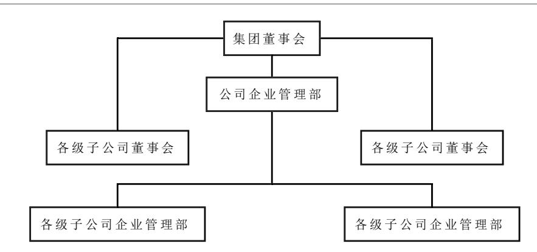
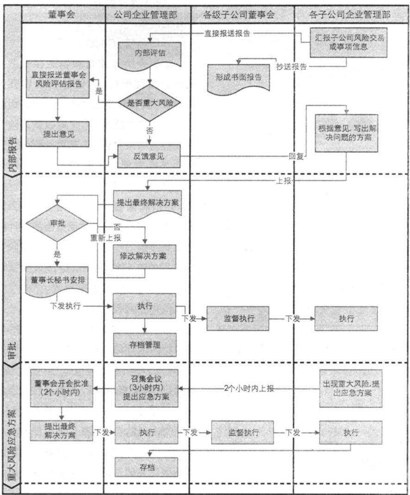
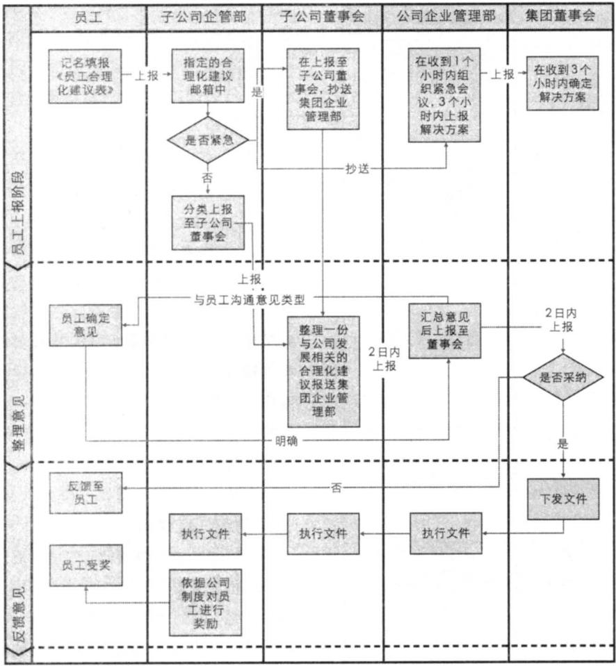

# M集团公司风 $\beta _ { \overline { { { \nu } } } } ^ { \triangle }$ 管理存在的问题及对策

王玉红 吴 焕

# 一、M 集团公司风险管理存在的问题

# （一）董事会风险意识薄弱

依据M集团公司的《危机与风险管理标准》，公司董事会是危机与风险管理的最高管理机构，企业管理部是危机与风险管理的职能部门。但董事会及经理班子未组织 建立风险管理体系，企业管理部也没有协助董事会建立风险管理体系。由于董事会风险管理意识不强，对风险管理重视度不够，从而使财务风险一直存在，例如，公司的机密文件没有加密流程，公司没有对涉足的新领域进行风险识别和风险资料的采集；没有对风险进行评估；没有对各子公司风险进行及时监督；等等。

# （二）公司风险文化流于形式

依据M集团公司的《危机与风险管理标准》，仅从宏观上规定应该建设一个什么样的团队及董事会的胜任能力，但却没有实质性地与人力资源部门及招聘环节接轨；标准规定一套，各部门具体执行一套，没有形成体系化管理。

# （三）内部沟通渠道不畅

M集团公司在《危机与风险管理标准》中没有考虑到员工沟通渠道在风险管理中的重要作用，没有规定员工如何在风险管理中发挥自身有效的作用，公司内部沟通渠道不畅。

# （四）评估标准受限

表 1  
风险专家调查列举法的风险识别表  

<table><tr><td rowspan=1 colspan=2>风险种类</td><td rowspan=1 colspan=1>集团面临主要风险</td></tr><tr><td rowspan=4 colspan=1>内部风险</td><td rowspan=1 colspan=1>技术风险</td><td rowspan=1 colspan=1>技术工艺发生根本性改进</td></tr><tr><td rowspan=1 colspan=1>生产风险</td><td rowspan=1 colspan=1>1.生产过程发生意外中断 2.生产计划失误，造成生产过程紊乱</td></tr><tr><td rowspan=1 colspan=1>人事风险</td><td rowspan=1 colspan=1>涉及公司人事管理方面的风险</td></tr><tr><td rowspan=1 colspan=1>财务风险</td><td rowspan=1 colspan=1>财务处理不当引发的风险</td></tr><tr><td rowspan=3 colspan=1>外部风险</td><td rowspan=1 colspan=1>环境风险</td><td rowspan=1 colspan=1>1．国家宏观经济政策变化，使公司受到意外的风险损失2.公司的生产经营活动与外部环境的要求相违背而受到的制裁风险</td></tr><tr><td rowspan=1 colspan=1>市场风险</td><td rowspan=1 colspan=1>1.公司对市场需求预测失误，不能准确地把握消费者偏好的变化2.竞争格局出现新的变化，如新竞争者进入所引发的公司风险 3.市场供求关系发生变化</td></tr><tr><td rowspan=1 colspan=1>国外政策风险</td><td rowspan=1 colspan=1>出口公司遇到国外政策变动风险</td></tr></table>

由于没有更为详细的风险评估指标及具体评估的操作流程，M集团公司业务层在面临公司风险时无从下手，应对风险的能力较弱。目前各部门仅是局限于税务风险、财务风险、国内市场风险的简单评估，缺乏对国外经济形势的分析及识别跨国风险的评估体系。

# （五）董事会对风 险 监 督力度不够，审计范围受限

在M集团公司《危机与风险管理标准》中规定应定期对危机与风险管理进行自查与检 查，及时发现缺陷并改进，其 检 查与检验报告报 送企业管理部，应定期与不定期组织监督与评价，并将评价结果上报董事会。但在实际操作中，这项管理标准形同虚设，从2009年3月13日此标准实施以来，没有一份风险评估报告结果上报至董事会，公司各部门与各子公司也没有对本部门及本公司的风险进行评估。同时，公司将政策风险范围仅限于国内政策风险，并没有考虑到国外风险，使审计范围受限。

# 二、加强M集团风险管理的建议

# （一）加强董事会风险管理职责

在风险管理框架中，董事会必须能识别目标和战略方案并将其分类为战略目标、经营目标、报告目标和遵循性目标四类。每一个业务单元、分部、子公司的领导也需要识别各自的目标，并与公司的总体目标相联系。一旦设定了目标，董事会就要识别风险以及影响风险的事项、评估风险并采取控制措施。

# 1. 风险识别

聘请专家对集团公司的风险进行识别，风险识别一方面可以通过感性认识和历史经验来判断,另一方面也可通过对各种客观的资料和风险事故的记录来分析,归纳和整理,从而找出各种明显和潜在风险及其损失的规律。风险识别是一项持续性和系统性的工作，风险管理者需要密切注意原有风险的变化,并随时发现新的风险。风险专家采用调查列举法对M集团公司面临的主要风险一一列举（如表1所示）。

  
图 1 重新梳理后的风险管理构架图

基于M集团公司面临的内部风险与外部风险两方面的分析，董事会应完善自身最高管理职责，重新梳理风险管理框架，要求企业管理部制定相关的风险管理制度，以应对目前集团面临的主要风险，便于及时提出风险解决方案及实施对策。经董事会重新梳理后的组织构架如图1所示。

在不增加任 何资源的情况下，经重新梳理后的基本框架是分为行政管理线及业务线，行政管理线是集团董事会直接领导公司企业管理部及各子公司董事会直接管理各子公司企业管理部，业务线是集团董事会直接管理公司企业管理部及公司企业管理部直接管理各子公司企业管理部。

# 2. 风险应对

充分发挥公司企业管理部的职责，逐步完善风险管理应对方案，主要流程分三个阶段：

第一阶段，内部报告阶段。此阶段主要是由各级子公司关注到本公司存在的一般风险，制定风险报告，详细描述风险产生原因、风险的类型，简单评估风险造成损失的概率、损失的范围及金额，依据公司《危机与风险管理标准》中的风险管理策略提出解决方案。方案一般应包括风险解决的具体目标，所需的组织领导、所涉及的管理及业务流程，所需的条件、手段等资源，风险事件发生前、中、后所采取的具体应对措施以及风险管理工具等，形成书面的风险管理报告上报M公司企业管理部同时抄送本公司的董事会。公司企业管理部根据子公司上报的风险管理报告，在2日内做出内部评估报告，对风险类型重新界定，确定是否属于重大风险，如不属于重大风险，需在1日内及时提出风险方案的修改意见，并于1日内反馈给子公司企业管理部，子公司企业管理部依据公司企业管理部提出的修改意见确定最终的解决方案后，上报公司企业管理部审议。

第二阶段，审批阶段。公司企业管理部审核子公司上报的风险最终应对方案，并上报集团董事会审批，董事会在5日内召集会议研讨公司企业管理部上报的风险应对方案，如2/3的董事会成员同意此风险应对方案，则由董事会秘书下发至公司企业管理部执行，公司企业管理部将董事会审议通过的子公司风险应对方案，下发至子公司企业管理部和子公司董事会执行。如果没有通过，则在3日内由集团企业管理部依据集团董事会的意见重新修改风险最终的解决方案，在1日内重新上报董事会审批，集团董事会将重新审批通过的风险最终应对方案，下发至子公司董事会及子公司企业管理部，由子公司董事会负责监督管理，子公司企业管理部对批准后的风险应对方案不折不扣地执行，并通过风险方案的执行不断完善公司的风险管理制度。

第三阶段，重大风险的应急方案。集团公司应本着从实际出发、务求实效的原则，以对重大风险、重大事件的管理和重要流程的风险管理为重点，积极开展全面风险管理工作。具备条件的公司应全面推进，尽快建立全面风险管理体系；其他公司应制定全面风险管理的总体规划、分步实施，可先选择财务管理、内部审计、法律事务、安全生产、环境污染、质量管理、招标管理、效能监察、应收账款管理等一项或多项业务开展风险管理工作，建立单项或多项风险管理子系统。通过积累经验、培养人才，逐步建立健全全面风险管理体系。

子公司出现重大风险应立即写出风险应急方案，在2个小时内上报公司企业管理部，集团企业管理部在收到子公司风险应急方案后3个小时内召开重大风险应对会议，提出应急方案，并在1个小时内上报集团董事会审批，集团董事会在2个小时内召开董事会，最终确定重大风险解决方案，集团董事会在30分钟内下发至子公司董事会及子公司企业管理部，子公司董事会监督执行。风险管理应对流程图如图2所示。

# （二）重塑公司风险文化

# 1. 宣传公司风险文化

第一，将经董事会批准通过的《危机与风险管理标准》制成宣传手册，宣传手册中需附加近几年国际及国内的重大风险案例，且在手册中写清如公司面临潜在的重大风险的危害性，且注明风险带来的与员工自身利益相关的问题，让员工充分认识风险对公司及自身的危害，保证员工始终站在公司角度来关注隐患。

  
图 2 风险应对流程图

第二，发放管理标准手册。由公司企业管理部将印制好的《危机与风险管理标准》下发至各级子公司的风险管理小组，由各级子公司的风险管理小组负责牵头组织各子公司员工领取《危机与风险管理标准》手册，保证人手一册，并做好领取登记记录。

第三，张贴风险管理手册，举行风险知识竞赛。公司企业管理部会同各级子公司在公司醒目位置张贴与全面风险有关的重要宣传标语，标语应朗朗上口、简短易记。举行风险知识竞赛，提高员工的参与意识。

# 2. 加强员工的道德建设

第一，事前道德调查。公司企业管理部在聘用员工之前，必须对应聘员工的诚实性进行测试且到该应聘单位做背景调查。必要时，请长期合作且诚信度高的咨询公司配合对应聘员工进行评估。

第二，事中道德考评。公司企业管理部在季末对正式员工陈述的述职报告进行忠诚度、诚实度测试，测试的方式可以采用访谈和问卷调查，为保证调查问卷得到最高董事会的支持，问卷调查结果将作为有力的反馈工具，合理设计调查问卷，确保问卷回答项便于回答（封闭式答案，如：同意/不同意；满意/不满意），设计问卷中应保留发表意见栏，以便于对象解释为什么选择某项答案，尤其是当对象选择的答案反映组织的薄弱环节时，调查问卷应保持在一个合理的长度内，内容不要过少或过多，要对调查问卷进行实地考察。必要时，可以将调查问卷交由独立的市场调查公司进行处理，将统计分析数据及有关意见反馈给人力资源部。

第三，充分发挥内部审计人员在道德调查中的作用。对组织道德恪守情况的识别方式除了通过在操作实践中发现违反法律法规的情况或者接到举报者的报告之外，还有内部审计。有时，即使常规性审计报告没有报告道德瑕疵现象，对以往审计发现或专项审计的再次检查也可能会从那些最初只是显露出微小瑕疵的事项中发现正在存在着的道德违反事项。

# （三）建立多维度收集公司管理信息的平台

# 1. 接受员工建议

为了增加员工沟通渠道，让员工没有顾虑地发表想法与合理化建议，由董事会批准，由企业管理部直接领导，对其他部门有效制约，通过保密制度的完善，有效保证员工自由建议权的充分发挥。

# 2. 筛选有效建议

将员工沟通途径分为员工上报、整理意见和反馈意见三个阶段（如图3所示）。由员工记名填报《员工合理化建议表》上报子公司企业管理部指定的合理化建议邮箱中，子公司企业管理部部长确认是否紧急，如紧急需立即上报至子公司董事会且抄送给公司企业管理部，由公司企业管理部 在收 到此建 议后1个小时内召开紧急会议，会议主要采用全封闭形式，与异地公司采用视频会议方式沟通，会议必须在2个小时内形成紧急事项的解决方案，并在1个小时内上报集团董事会批准，由集团董事会在3个小时内确定解决方案并紧急实施。如非紧急，由子公司企业管理部将员工建议进行按行政职能分类，分别整理上报至子公司董事会，由子公司董事会分类上报至公司企业管理部部长，由企业管理部部长整理后在2日内上报至公司企业管理部，公司企业管理部汇总意见后形成几个解决方案后上报集团董事会裁决，集团董事会收到意见及解决方案后确定是否采纳。

  
图3 员工沟通途径流程图

# 3. 意见反馈

对于紧急建议由集团董事会确定解决方案且紧急实施后，由公司企业管理部形成文件并督办各相关部门及时执行，在执行过程中及时与提出紧急合理化建议的员工保持联系，由相关部门在执行中提出反馈意见并在第一时间内上报至子公司董事会同时抄送给公司企业管理部。

对于非紧急的合理化建议，由子公司企业管理部分类至各行政职能部门，由各行政职能部门提出反馈意见，且由子公司企业管理部汇总意见后上报至子公司董事会，子公司董事会将汇总意

（四）建立独立并且责权分明的风险评估体系

# 1. 明确权力与责任分配

董事会负责监督和确定存在适当的风险管理流程，保证这些流程充分和有效，负责制定战略目标，确定组织可以接受的风险水平，定期收到风险管理过程的结果报告。内部审计部门负责运用风险管理方法和控制措施，对风险管理过程的充分性和有效性进行检查、评价和报告，提出改进意见，为董事会提供帮助。负责运用适当的审计程序收集足够的证据，从总体上对风险管理过程的充分性以及所选择风险管理方式的适当性发表意见。

见下发至子公司各行政职能部门，由子公司各行政职能部门将反馈意见分别上报子公司企业管理部，经子公司企业管理部整理汇总后反馈给子公司各行政职能部门，并及时将沟通后的结果反馈给提出建议的员工，以保证员工合理化建议及时得到反馈。如遇无法协调事宜，由子公司董事会直接上报至董事会裁决，以保证反馈流程无障碍。

如建议被采纳，经反馈后形成决议且制定成文件下发后，由公司企业管理部直接反馈给提出合理化建议的员工，依据公司制度对该员工进行奖励。如不采纳该员工建议，公司企业管理部在收到董事会不采纳此建议的当日内反馈给提出合理化建议的员工，提出书面感谢函，并鼓励该员工继续关注公司动态，以保护该员工提出合理化建议的积极性。

# 2. 制定风险评估工作流程

公司应对收集的风险管理初始信息进行风险评估。风险评估包括风险辨识、风险分析、风险评价三个步骤。进行风险辨识、分析、评价，应将定性与定量方法相结合。公司在评估多项风险时，应根据对风险发生可能性的高低和对目标的影响程度的评估，确定对各项风险的管理优先顺序和策略。公司应对风险管理信息实行动态管理，定期或不定期实施风险辨识、分析、评价，以便对新的风险和原有风险的变化重新评估。

（五）优化审计控制岗位职责，加强审计监督力度

# 1. 优化审计控制岗位职责

公司在董事会下设置独立的审计部，基于对M集团公司性质、规模及内部治理结构及相关规定的考虑，从优化内部审计机构方面设想，重新按审计管理控制岗位机构设置，通过审计管理控制岗位职责表（如表2所示）将审计管理职责具体描述清楚，该机构的设置可以保持内部审计人员的独立性。

# 2. 扩大审计范围

根据全面风险管理理论完善M集团公司的审计范围，扩大至市场竞争风险、国家政策变动风险、融资风险、国外政策风险等的审计，以保证公司价值最大化。

表 2  
审计管理控制岗位职责表  

<table><tr><td rowspan=1 colspan=2>审计管理控制岗位</td><td rowspan=1 colspan=1>主要职责</td><td rowspan=2 colspan=1>不相容职责</td></tr><tr><td rowspan=1 colspan=1>现控制</td><td rowspan=1 colspan=1>优化后控制</td><td rowspan=1 colspan=1>优化后</td></tr><tr><td rowspan=4 colspan=1>没有</td><td rowspan=4 colspan=1>董事会</td><td rowspan=1 colspan=1>审批公司内部审计管理制度</td><td rowspan=4 colspan=1>编制内部审计报告和工作计划</td></tr><tr><td rowspan=1 colspan=1>审批内部审计年度工作计划</td></tr><tr><td rowspan=1 colspan=1>审批内部审计重要审计报告</td></tr><tr><td rowspan=1 colspan=1>对重大舞弊、过失行为的处理进行裁决</td></tr><tr><td rowspan=6 colspan=1>没有</td><td rowspan=6 colspan=1>审计部</td><td rowspan=1 colspan=1>审核公司内部审计管理制度</td><td rowspan=3 colspan=1>参与具体审计项目</td></tr><tr><td rowspan=1 colspan=1>在授权范围内审批审计报告</td></tr><tr><td rowspan=1 colspan=1>审核审计部年度审计工作计划</td></tr><tr><td rowspan=1 colspan=1>监督和指导审计部开展审计工作</td><td rowspan=3 colspan=1>内部审计外评单位的选择</td></tr><tr><td rowspan=1 colspan=1>受理并处理审计争议和申诉</td></tr><tr><td rowspan=1 colspan=1>确定公司进行内审外评的实施单位</td></tr></table>

# 3. 增强内部审计监督力度

公司应对风险管理初始信息、风险评估、风险管理策略及风险管理解决方案的实施情况进行动态监督，根据变化情况和存在的缺陷及时加以改进。公司应建立风险管理信息沟通 渠道，确保信息沟通的及时、准确、完整，为风险管理监督与改进奠定基础。公司内部审计部门应至少每年一次对包括风险管理职能部门在内的各有关部门和业务单位能否按照有关规定开展风险管理工作及其工作效果进行监督评价，此项工作也可结合年度审计、任期审计或专项审计工作一并开展。

# 4. 子公司董事会建立定期向集团董事会报告机制

在适当情况下，内部审计部部长应与集团各级子公司董事会就风险和风险管理实务中的薄弱环节进行讨论，如果审计部部长认为子公司董事会接受的风险水平与集团董事会的风险管理战略和政策不一致，或该水平不能被集团董事会接受，审计部部长应就此事报告集团董事会解决，集团董事会负责对重大风险采取针对性行动，审计部部长负责评价这些行动。若子公司董事会出于某些原因决定不采取纠正行动并承担后果，审计部部长应就该情况及时向集团董事会报告。 ■

[ 本文为辽宁省教育厅课题《内部控制信息披露经济后果实现路径研究》（项目编号 ：W2011122）的阶段性研究成果 ]

（作者单位：东北财经大学会计学院／中国内部控制研究中心 盾安沈阳投资有限公司）

责任编辑 李斐然简讯

# 东北财经大学成立中德管理控制研究中心

近日，在东北财经大学召开的“中德管理控制研究中心揭牌仪式暨2012企业管理控制高层论坛”上，中德管理控制研究中心正式成立，成为国内首家管理控制方面的国际合作研究机构。该中心由东北财经大学会计学院与德国法伦达尔WHU-OttoBeisheim School of Management（奥托拜斯海姆管理学院）合作建立，并申报教育部科技司国际合作联合研究中心备选项目。

中德管理控制研究中心主要致力于管理控制基础理论和方法的研究，并强调在中国制度背景下管理控制的特殊性以及中德管理控制行为的比较。中德管理控制研究中心既重视理论研究的深入发展，也关注理论对于实践工作的推动作用。在理论研究方面，主要是积极争取国家级课题，开展国际合作研究；编辑出版年度研究报告；定期召开国际研讨会。在人才培养方面，定期组织博士研究生和管理控制相关课程的主讲教师赴德进行交流，同时还将邀请德方的资深教授开设管理控制专题讲座，对博士生和教师进行培训，以培养兼有中德管理控制知识的师资力量和博士。在应用合作方面，成立非官方的企业管理控制会员联盟，并吸纳企业加入，定期编辑管理控制研究通讯，向企业会员提供管理控制研究的最新动态，以协助其提高企业管理控制水平。东北财经大学会计学院张先治教授和WHU- 奥托拜斯海姆管理学院Utz Schäffer 教授负责中德双方的研究中心工作。

（刘媛媛供稿）