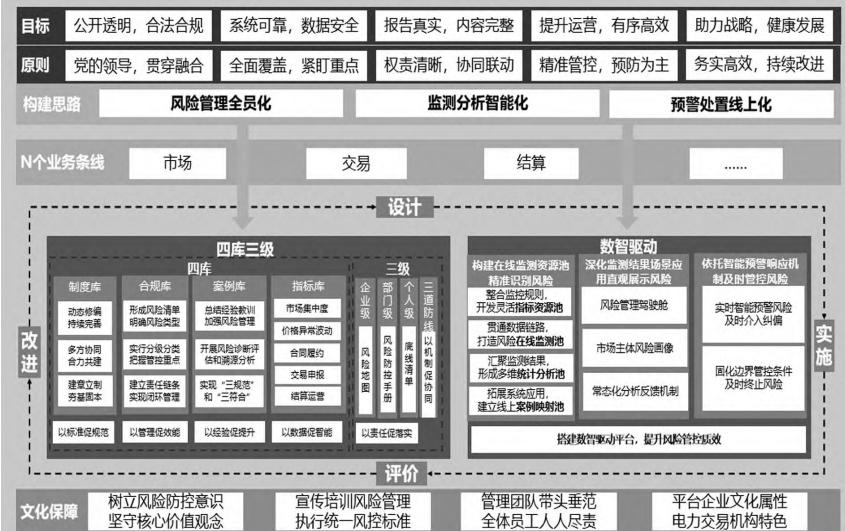
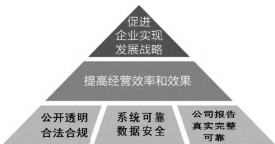
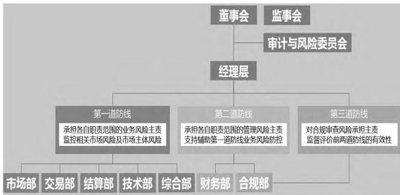
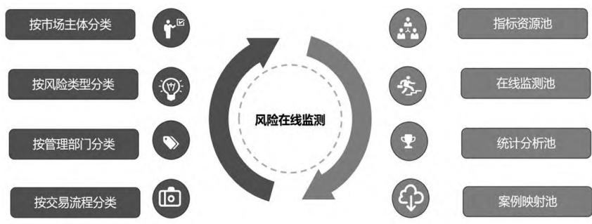
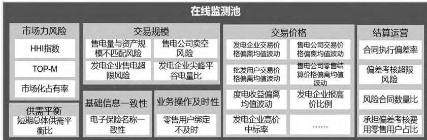

# 电力交易中心风险管理研究与实践

# -基于“四库三级 $+$ 数智驱动”的视角

王清刚 1 贵永 2 曾文源 3 刘立文 3 邓 松 3

1.中南财经政法大学会计学院 2.国网湖北省电力有限公司 3.湖北电力交易中心有限公司

【摘 要】我国电力市场化改革已进入深水区，电力交易的复杂性和不确定性陡增，电力交易机构亟须提升风险防控能力，化解风险挑战。文章以HB电力交易中心为例，全面梳理电力市场化交易风险，按照“目标 原则 框架 保障”的逻辑，以“风险管理全员化、监测分析智能化、预警处置线上化”为思路，融内控、风险与合规管理于一体，以“四库三级 $^ +$ 数智驱动”为核心，创新电力交易机构风险管理。通过建立健全制度库、风险库、案例库和指标库，夯实风险管理根基；通过“企业 部门 个人”三级风险分类，明确风险归属责任；通过数字驱动、智能应用，实现电力交易风险的在线监测、实时预警和及时处置。实施成效明显，具有很强的实践意义和推广价值。

【关键词】风险管理； 四库三级； 数智驱动； 电力交易中心【中图分类号】F234.3 【文献标识码】A 【文章编号】1004-5937（2024）16-0146-08

# 一、引言

电力交易机构是电力交易市场化改革的主阵地、政府监管的关键点和市场供需的汇聚地。近年来，市场主体对电力市场运行的合规性、透明度要求不断提高。随着电力市场快速发展，受配套政策滞后等因素影响，一些问题层出不穷，风险易发高发。一是体制机制不够健全，规则设计不尽完善，极易被不法市场主体通过规则漏洞或信息差来“钻空子”，导致资源错配，造成市场主体经济利益损失。是各主体对电力市场的期望值高，利益诉求各不相同，随着改革步伐的加快，市场主体利益博弈加剧，矛盾凸显，一旦处理不当，容易激化矛盾，引发群体性事件。三是随着电力市场的不断开放，市场环境日益复杂，部分市场主体盲目入市，违约和争议纠纷的风险隐患悄然而生。电力交易机构成立时间较短、直接面向电力市场、上下游关联企业众多，在风险防控方面面临着前所未有的巨大挑战。为推进电力市场有序健康发展，电力交易机构需要加强风险防控，规范稳健运营，保障国家电力市场化改革重大战略任务落地实施。

防范化解重大风险，守住不发生系统性风险的底线，是实现高质量发展的基本要求。作为平台型企业，电力交易机构规范运作水平关乎市场利益格局，备受市场主体、政府部门、监管部门等社会各界的关注。近年来，国家有关部委相继出台一系列政策文件，要求企业不断完善公司治理，强内控、防风险、促合规。电力交易市场规模持续扩大，交易频次不断提高，交易方式日益复杂多变。部分市场主体因经营风险意识不足、规则理解不充分、交易操作失误等原因，导致相关市场主体利益遭受损失。尤其是HB 省被纳入第二批现货试点省份以后，交易的复杂性及不确定性倍增。目前现货市场交易规则尚在不断完善，市场主体钻政策漏洞、不合规操作、纠纷、违约等情形时有发生，电力交易面临的市场主体违约风险、市场价格异常风险、舆情风险以及市场运营风险等被放大。为维护电力交易秩序，保护各市场主体合法权益，防范电力交易风险，发挥平台监管功能，避免发生大面积违约、跑路事件，消弭风险隐患，亟须构建具有平台企业属性、电力交易特色的风险防控体系，防止电力市场风险的渗透、积压与传导。

英美等国电力改革实践表明，电力市场化改革的主要风险在于现货市场上的价格操纵所导致的市场失灵[1]。曹建巍等[2]基于风险控制矩阵研究了混合所有制配电公司的风险管理问题。王子强等[3]研究了美国互联电力系统运营商PJM的风险管控策略，并与南方电网电力市场风险管理体系对比，提出“风险监测 $\longrightarrow$ 风险辨识 $\to$ 风险评估 风险控制”风险管控体系。韦德洪[4]以广西桂冠电力股份有限公司和桂东电力股份有限公司为例，采用资产规模、现金流量占比、资金结构、营业利润率等财务指标对公司财务健康状况进行“体检”。谢敬东等[5]通过建立市场力风险库，构建了电力市场的市场力风险评价指标和风险管理逻辑推演的专家系统，提出市场力风险监管体系。高政南等[6]采用层次分析法与熵权法的组合对电力市场风险进行了多维评价。王向阳等[7]总结了知识图谱在国网湖北电力公司内部审计实践中的应用，分析了人脑 $^ +$ 智脑组合提高审计效率，提升数据价值的途径。王艳华[8]认为面对电力市场化交易风险，电力企业需要优化风险分类体系、建立内控流程标准、构建分级授权框架、明晰职责权限界面、建立顺畅的信息交流机制、健全通用制度，持续提升风险管理能力。崔罡等[9]研究了国家电网有限公司风险、内控、合规一体化的管理架构及其运行经验，将风险管理、流程、制度、授权、评价全面融入业务管理，强化信息系统在线控制。

综上，国内外对于企业风险和合规管理进行了多角度全面系统的研究，为进一步研究奠定了良好的文献基础，但专题针对电力市场化交易风险和电力交易机构的风险管理研究却极为稀少。拾遗补阙，本文采用案例研究，以 HB 电力交易中心为例，融内控、风险与合规管理于一体，以“四库三级 $^ +$ 数智驱动”为核心，创新电力交易机构风险管理，实施成效明显，具有很强的实践意义和推广价值。

# 二、强化顶层设计，创新行业特色鲜明的风险管理体系

# （一）案例公司简介

HB电力交易中心有限公司（以下简称“HB 电力交易中心”）是第三家在国家电网公司系统内挂牌成立的股份制交易机构，注册资本1.7 亿元。作为省级唯一的电力交易机构，主要负责电力市场交易平台的建设、运营和管理，具体职能包括市场主体的注册和管理、组织省域内电力市场交易、管理交易合同、提供结算依据和服务、披露和发布电力市场信息、电力市场风险管理等。现有股东 12家，股东类型涵盖电网企业、发电企业、售电公司、电力用户、第三方交易机构等，市场代表性完整。截至2023年底，HB电力交易中心市场主体累计注册数量达到8 746 家，其中发电企业1560家，售电企业110家，电力用户7076家。HB电力交易中心自成立以来，按照政府批准的章程和规则为市场主体提供公平规范、高效优质的电力交易服务，积极开展电力市场建设和规则研究，主动提供咨询、培训等服务，在服务能源低碳转型、激发市场活力、提高交易效率、降低社会用能成本等方面发挥了重要作用。

# （二）明确电力交易机构风险管理的目标和原则

目标引领行动，原则指引方向。HB电力交易中心充分考虑自身业务特点和平台企业属性，首次将公开透明、系统可靠和数据安全引入风险管理目标，具体包括“公开透明，合法合规；系统可靠，数据安全；报告真实，内容完整；提升运营，有序高效；助力战略，健康发展”五个目标。管理交易系统网络风险是平台型企业风险管理的重要目标，HB 电力交易中心增加投入，从人员、技术、规程多个维度持续发力，确保了交易系统稳定可靠、数据安全，且具有可审计、可维护和可恢复等功能。HB 电力交易中心创新性地提出适应当前发展形势和行业特色的风险管理五项原则：“党的领导，贯穿融合；全面覆盖，紧盯重点；权责清晰，协同联动；精准监控，预防为主；务实高效，持续改进”，为电力交易机构实施风险管理指明方向，具有普遍的指导性。

# （三）“四库三级 $^ +$ 数智驱动”创新风险管理体系

全面梳理电力行业深化改革及数字化转型背景下电力交易机构面临的风险和挑战，深入分析公司运营的28个业务条线的监管要求和主要风险点，以“风险管理全员化、监测分析智能化、预警处置线上化”为思路，以“四库三级 $^ +$ 数智驱动”为核心，创新电力交易机构风险管理。如图1所示，建立制度库、风险库、案例库和指标库四库体系，全方位护航电力交易机构风险管理。考虑电力交易机构的行业属性，结合企业组织架构、授权体系和岗位职责，通过“企业 $\longrightarrow$ 部门 个人”三级风险分类框架，明确风险归属责任，筑牢风险防火墙。借助现代信息技术，通过数字驱动、智能应用，深挖数据关系，构建指标资源池，搭建预警指标库，对电力交易机构市场风险进行在线监测，实现事前智能预警和及时处置应对。在“四库三级 $^ +$ 数智驱动”框架下，通过监督评价和责任追究等常态化机制，及时发现风险管理中的问题和缺陷，明确责任，落实整改，完善PDCA闭环管理，不断改进风险防控短板，持续提升企业风险管理水平。

（四）培育风险管理文化，打造坚强支撑保障

风险防控不仅要有科学的制度流程、先进的工具技术，还要重视企业文化和人力资源等软环境的培育。HB电力交易中心非常重视培育风险管理文化，通过“树立风险防控意识，坚守核心价值观念；宣传培训风险管理，执行统一风控标准；管理团队带头垂范，全体员工人人尽责”等举措，不断提升管理团队和全体员工的管理素养，夯实企业风险防控根基，为 HB 电力交易中心战略实施和运营管理保驾护航。

  
图 1 HB 电力交易中心“四库三级 $^ +$ 数智驱动”全面风险管理框架图

# 三、明确目标和原则，为创新风险管理提供方向和指引

（一）厘清全面风险管理体系建设的认知误区

风险管理不是单纯的政策、制度、流程和表单，不是一项独立的职能管理或部门管理，而是全面风险管理，涉及全员、全业务、全过程和全方位。本文以提高运营的效率效果为核心，以风险实时监测为工具，按照管理制度化、制度流程化、流程信息化的要求，倡导全员参与、全面覆盖、全程追踪，注重控制实效，抓好风险管理的基础工作和关键环节，并通过监督评价，促进企业风险管理能力和水平的持续提升。

# （二）明确目标和定位，为 HB 电力交易中心风险管理指明方向

风险管理的目标不仅仅是“纠错防弊”，而是以提高运营的效率效果为核心，帮助企业实现发展战略。风险管理目标应匹配企业战略目标和运营目标，通过促进人、财、物、时间、技术、文化等资源的优化配置，以更优的效率效果实现其运营及战略目标。

作为平台型企业，电力交易机构连接着发电企业、电网企业、售电企业、电力用户等多种市场主体，利益关系和交易结构复杂。公开透明、合法合规为电力交易机构建立了最低行为准则，运营管理和市场交易必须符合法律法规和监管要求，防止欺诈行为，通过外规内化和内规外化，确保合规有效性。管理网络风险是平台型企业内部控制的重要目标，电力交易机构要确保信息系统可靠，运行稳定，数据安全，防止数据泄露和滥用。交易系统要具有可审计、可维护和可恢复等功能。企业报告必须真实、完整、可靠，没有重大漏报、错报或误导性陈述。

如图2所示，本文将合规目标、网络安全目标及报告目标作为电力交易机构风险管理的基础性目标，将提升公司运营的效率效果作为核心目标，以促进企业实现发展战略为最高目标。风险管理不是要捆住业务的手脚，不是要制衡和束缚业务活动的开展，而是要助力业务活动的开展，通过降低和管理企业运营中的不确定性，提高运营的效率效果，促进企业战略目标和运营目标的实现。将战略目标作为最高目标，为内部控制与风险管理向上拓展到治理层和“三重一大”事项①提供了依据。

  
图 2 电力交易机构全面风险管理目标结构

（三）构建特色鲜明的原则指导HB电力交易中心风险管理实践

为有效实现风险管理的目标和定位，HB电力交易中心设计和贯彻了行业特色鲜明的原则，用于指导内部控制与风险管理实践：

1.坚持党的领导，贯穿融合

充分发挥党组织的领导作用，落实全面依法治国有关要求，把党的领导贯穿风险管理全过程。以风险管控为导向，推动实现“三重一大”决策机制、风险管理、内部控制、合规管理、授权体系、绩效评价、内部审计、纪检监察等管理体系的贯通融合。

# 2.坚持全面覆盖，紧盯重点

遵循“横向到边、纵向到底”的原则，电力交易机构风险管理要实现全面覆盖、全员参与和全程追踪，将风控要求嵌入运营管理各领域各环节，贯穿决策、执行和监督全过程，落实到所有部门和全体员工，推动风险管理人人有责，人人尽责。同时，突出对重点领域、关键环节和重要人员的管理，在各领域各环节确定风险管理重点，聚焦重要业务、重点领域和高风险领域，紧盯重大风险。

3.坚持权责清晰，协同联动

按照“管业务必须管风险”的要求，明确业务单元、职能部门和监督部门职责，加强协同联动，将风险监测与合规审查纳入业务流程，严格落实风险管理责任，对违规行为严肃问责追责。

4.坚持精准监控，预防为主

坚持底线思维，立足防风险、治未病，强调关口前移、事前防范和过程控制。借助大数据和智能应用，实施精准监控，预防为主。通过惩防并重，管早管小，防控电力交易机构各类风险。

# 5.坚持务实高效，持续改进

建立健全符合电力交易机构特色与业务的全面风险管理体系，通过三级风险分类框架，明确风险管理主体责任，压紧压严压实部门和岗位的风险防控职责。充分利用大数据分析和智能应用工具，提高风险管理效能，并根据内外部监管环境和法律政策的变化，及时对全面风险管理体系进行持续改进。

# 四、建立健全“四库”体系，夯实风险管理根基

（一）贯通内外要求，完善制度库，以标准促规范

建章立制，夯基固本。按照管理制度化、制度流程化的要求，积极推动外规内化，规范各类活动的管理制度和办理程序。针对合规管理要求散见于各处，缺乏系统的“本地化”规章制度，采取“自下而上、自上而下”的方式梳理业务类型，制定规章制度体系框架、建设规划、分年修编计划，量身定制个性化制度清单，将外部政策规定及管理要求内化为公司制度，形成了以章程为核心，覆盖市场主体注册、交易组织、交易结算、信息披露、投诉举报、舆情管控及综合管理等方面的规章制度体系，打破专业管理与合规管理脱节现象。

动态修编，持续完善。针对电力市场涉诉事项快速增多情形，分别编制法律调查令、律师调查令以及商业信函应对规范，明确交易大厅、一二道防线等不同场景及全过程的应对策略，避免满足他方要求而导致自身被动陷入“不合规”困境。

多方协同，合力共建。针对电力市场风险事件，主动研究超额获利回收、强制出清机制等干预手段，积极向政府主管部门建言献策，力争将电力市场风险防控主张外拓，外化为电力市场顶层设计文件，防范电力市场投机或异常波动风险。立足 HB 电力交易中心政策性导向型企业特点，建立风险政策制度库，有机聚合与关联分散在各个专业的内外部监督规定，打通风险管理与业务间的专业壁垒，建立高效共享的信息交互机制，使风险管理人员熟悉前端业务，业务人员掌握合规要求，推动风险管理与业务合规深度双向融合。

# （二）四区闭环管理，建立风险库，以风控护运营

通过发放调查问卷、现场访谈、穿行测试、同业案例分析等方式，整理分析交易、结算、市场等业务板块风险信息及潜在风险行为及后果，建立电力交易风险清单，明确风险防控重点，为风险防控提供依据。实行分级分类，把握管控重点。抽取400多条合规风险数据，采取热力图分析、专家打分等方法，划分风险等级，明确风险管控重点方向。建立责任链条，实现闭环管理。从业务属性、合规风险类型、风险行为、违规责任或后果、合规义务、责任部门六个维度，构建“四区”合规库（业务信息区、风险信息区、合规义务区、管理责任区），将风险管理责任落实到部门，建立事前有防范、过程有控制、责任有落实的风险管理闭环机制，引导全员主动合规。

# （三）集合内外信息，形成案例库，以经验促提升

收集整理国内外同业及相关单位 58 个风险事件，编制并印发电力市场合规与风险管控案例库，有针对性地提出风险防控建议及注意事项，启示全员以典型案例为鉴，及时总结经验教训，加强风险管理，以“身边事教育身边人”“身边事警醒身边人”。针对电力市场纠纷等风险案例，建立专题会商机制，组织法律顾问、业务人员、合规风险管理人员等，开展风险诊断评估和溯源分析，借助法律顾问“外脑”，发挥智库作用，推动电力交易各项业务实现“三规范”（业务、流程、行为规范）和“三符合”（符合改革方向、监管要求、市场规则）。

（四）深挖数据关系，搭建预警指标库，以数据促智能

充分考虑电力交易业务特点和调研情况，贯通各业务条线数据资源，对汇聚在电力交易平台中的数据进行清洗、提取和分类存储，从市场集中度、价格异常波动、合同履约、交易申报、结算运营等方面，构建覆盖全市场主体、全时间维度的 60 多项风险预警指标，形成风险数据集市，打造风险智能预警“信息源”，为实现风险实时在线监控、实时预警和及时处置奠定了良好的基础条件。

# 五、通过三级风险分类明确责任，筑牢风险防火墙

（一）整合风险管理、内部控制与合规管理，以机制促协同

风险管理、内部控制与合规管理在目标、原则及管理工具上有同质性，为充分发挥资源协同效应，HB 电力交易中心吸纳整合风险管理、内部控制与合规管理的目标、原则、工具和流程等，从公司、部门和岗位操作三个层面构建了融合风险管理、内部控制与合规管理“三位一体”的全面风险管理体系。该体系以风险管控为导向，将电力交易机构的监管规则、管理理念和控制要求全面融入公司治理、企业文化、岗位授权、制度规范和业务流程，通过风险实时监测、动态预警、内控评价和缺陷改进等活动，积极推动运营管理从制度管理向体系化管理转变，从条块化管理向全流程管理转变，从传统的职能管理向全面风险管理转变。

HB电力交易中心为避免职能重复或交叉，在公司层面，公司党委发挥“把方向、管大局、促落实”的领导作用；董事会主要是定战略、作决策、防风险，执行“三重一大”事项的议事规则和决策程序；经理层聚焦谋经营、抓落实、强管理，完善风险管理日常运行机制，将风险管理及合规审查嵌入业务流程。在部门和员工个人层面，通过三级风险分类框架和三道防线组织体系，积极推动经营合规、风险可控、管理精益，大力保障公司决策科学、执行坚决、监督有力。

# （二）梳理业务链条，通过三级风险分类，以责任促落实

HB电力交易中心全面梳理排查业务模式、运作机制、主要流程和权责界面，对其全业务链条展开风险识别和风险分析，建立企业级、部门级风险防控手册和风险地图。梳理岗位个人底线行为，建立覆盖 7 个部门、28 个业务条线，560多个风险点，312条岗位的个人级底线清单，打造员工合规高压线，促进全员树立红线意识，明底线、知敬畏。通过“企业—部门—个人”三级风险分类标准和风险辨识工具，明确风险归属责任，压紧压严压实部门和岗位的风险防控职责。结合流程管控，将风险管控要求嵌入运营各领域各环节，贯穿决策、执行和监督全过程，落实到所有部门和全体员工，引导全员自主开展风险防控，变“被动合规”为“主动合规”。

# （三）构建三道风险防线，密织风险防护网，以协同促效能

在明确风险归属责任的基础上，HB 电力交易中心建立了如图 3 所示的风险管理三道防线。市场部、交易部、结算部等业务部门为第一道防线，既要管理好业务风险，又要监控好市场风险。作为第二道防线，合规、财务等职能部门既要管理好本领域的相关风险，又要助力第一道风险的防控。HB电力交易中心审计、纪检监察等相关监督职责由合规部承担，因此，合规部既要承担第二道防线上的合规审查职能，又要发挥第三道防线的监督职能，对第一道防线和第二道防线上的风险管理有效性进行监督评价。HB 电力交易中心在前端将合规审查嵌入业务流程，确保 $100 \%$ 审核率，有力促进第二道防线、第三道防线充分介入、反向融入第一道防线，确保公司运营和各项活动合法合规。通过跟踪问题整改情况，反向查找工作不足及存在风险，形成“以查促改”“以改促建”的动态机制。在后端借助风险在线监测资源池主动预警风险，积极反馈、监督业务风险，三道防线共同触发干预手段，共同完善管理制度、市场规则和交易流程。

  
图 3 HB 电力交易中心风险管理三道防线组织图

# 六、以数智驱动，强化在线监测，以大数据赋能风险管理

（一）广泛应用大数据，打造数智驱动风险管控新平台

借助 HB 电力交易平台和数据中台，深化四库的平台应用，深入研究电力交易相关政策及实施规则，通过调研访谈和问卷调查，设计建设了四个数据资源池，包括指标资源池、在线监测池、统计分析池和案例映射池。如图 4 所示，监测对象覆盖发电企业、售电公司、批发用户、电力交易中心等多主体；监测内容涵盖交易规模、交易价格、市场行为、逻辑校核、安全管控等方面；时间维度覆盖年、月、场次等多周期的监测评估预警指标体系，通过“四池”大数据支持风险决策，具备多种风险管理功能，实现了对电力交易市场风险的精准监控。

1.构建监测指标资源池，精准识别风险，描述风险

如图 5 所示，以预警指标库为基础，会同各业务专家共同梳理风险监测业务环节、业务点、业务逻辑等，灵活配置可拓展、可编辑、可修正、可调用、可终止等管理功能，实现了风险监测标准的在线查询与完善，解决了以往多头分散管理、缺乏系统归类整理、跟踪与更新不及时等问题。依据风险数据字典配置管理，录入风险指标信息；基于指标资源池建设在线监测模块，自 HB 电力交易平台获取交易风险指标实时数据，对风险指标、交易主体、预警信息进行实时监测，精准识别相关风险。帮助用户更好地识别、预测和处理市场风险，确保风险“看得见、管得住、控得了”。

  
图 4 HB 电力交易中心市场风险在线监测资源图

  
图 5 HB 电力交易中心市场风险在线监测资源池功能架构

通过指标配置管理，风险在线监测指标资源池可为在线监测提供指标选择、预警阈值判断、消息发送、市场干预、市场主体管理等多种运用场景。当市场出现重大异常情况时，按规则采取相应的市场干预措施，并及时通知相关责任主体。

# 2.贯通数据链路，打造风险在线监测池

整合贯通注册、交易、结算等各业务条线信息，通过关键数据跟踪、历史数据比对、浮动系数评估等手段，建立场景风险评估模型和七大主体监测中心，自动评估分析市场主体交易规模、交易价格、结算运营等方面的信息，实时监测、动态预警市场主体异常报价、串谋及操纵市场等潜在风险行为。例如，HB电力交易中心针对售电公司零售套餐签订和偏差考核情况，分别设置零售套餐结算方案异常和偏差考核超限提醒机制，及时识别、干预风险隐患，保障电力市场健康发展。

3.汇聚监测结果，形成多维统计分析池

整合各类风险在线监测底层数据，按指标类型、监测主体、时间跨度等多维度进行统计分析，直观展示风险在线监测结果及趋势，发挥“分析仪”和“方向盘”作用，便于快速定位和捕捉高频次风险，从而有针对性地制定风险防控策略。

4.拓展系统应用，建立线上案例映射池

将风险案例与在线监测指标进行映射匹配，方便业务人员通过风险案例查找监测指标，通过监测指标反向侦查市场案例。借助案例映射机制，促进业务人员跟进并了解市场风险及市场动态。

# （二）深挖数据逻辑，深化监测结果智能化应用

1.分析数据关系，理清监测结果智能化应用逻辑

获取电力交易机构平台交易、结算、合同、基础和保险信息，通过风险量化计算模型、关键数据跟踪、价格偏离均值波动计算模型以及历史数据分析对比，理清“指标配置 $\longrightarrow$ 在线监测 $\longrightarrow$ 预警通知 分析评估”的数据链路，实时监测电力市场的变化和交易情况，及时发现潜在风险事件，辅助电力交易用户快速了解风险详情，实现不同类型的电力交易风险的精细化管理。针对不同类型的风险制定相应的风险防范和管理策略，更好地助力管理人员进行事前风险监测预警、事中风险在线监测以及事后风险统计分析。

2.打造风险管理驾驶舱，直观展示相关信息

围绕四大类用户主体（发电企业、售电公司、电力用户、交易中心）、七大类风险类型（市场力风险、交易规模、交易价格、短期供需平衡、结算运营、基础信息一致性、业务操作及时性），以仪表盘、矩阵图、风险地图等可视化方式，形象直观展示风险在线监测结果，通过数据中台传输方式实时展示在电力交易大屏上，并支持穿透下钻，形成 HB电力交易中心风险全景视图，为领导决策和日常管理提供数据支持。

风险管理驾驶舱支持对单个市场主体风险情况进行分析和监测，形成该主体的风险画像。依托风险在线监测资源池，自动提取HB电力交易平台交易风险指标实时数据，对整个电力市场以及单个发电企业、售电公司、电力用户的风险行为进行精准画像，包含该主体基本信息、当前风险画像、历史风险趋势分析、年度风险指标监测、月度风险次数分析、月度考核分析以及企业参与交易的量价分析等。市场主体风险画像方便各风险监测员及风险管理专员快速预览、精准分析电力市场整体风险或单个市场主体风险，实现市场主体风险“一网查询、一窗尽览”。

3.依托智能预警响应机制，及时管控 风险

实时智能预警风险，及时介入纠偏。根据风险发生的可能性和危害程度，绘制风险等级“红黄蓝”三色图谱，并自动向内外部人员进行推送，提醒内外部人员及时关注，及时介入纠偏。建立各业务部门共同参与的风险监测员机制，协同风险管理专员共同维护、反馈与处置在线监测信息。当各项风险指标超出正常水平、预警信号亮出黄灯和红灯时，提示风险监测员启动风险预警管理流程，并将智能预警信息与风险监测员人工介入处置结果进行对比，根据风险偏好和风险评估结果变化，分析优化风险阈值，调整指标权重，提高智能预警的信度、效度。

固化边界管控条件，及时终止风险。针对多次预警、频繁发生的风险事件，会商业务部门，嵌入边界管控条件，当内外部行为触发边界管控条件时，则自动获取、智能拦截违反规则、超越权限、逾越程序等内外部风险行为，通过“嵌入式”事前防控，减少风险发生的可能性。例如，当售电公司的资产额度不满足交易条件时，则交易平台自动触发拦截机制。

# 4.建立分析反馈机制，加强分析结果输出应用

加强风险在线监测数据应用，按月编制《电力市场风险在线监测月报》，提示并反馈风险类型、风险分布、可采取的改进措施及建议等，并向交易中心全体人员进行推送，促进全员深化应用交易平台监测看板，优化交易机构监测运营机制。在线监测月报适时呈报政府主管部门，为政府决策提供参考借鉴。

# 七、培育企业文化，凝聚思想合力，厚植风控根基

HB 电力交易中心重视企业文化建设，重视制度、流程、技术及文化的耦合，围绕核心价值观企业上下达成一系列共识，通过营造浓厚文化氛围、创新宣讲教育方式、提升全员管理技能、管理团队带头垂范、培训指导市场主体防范交易风险等举措，不断提升管理团队和全体员工的管理素养，建立了具有平台企业属性和电力交易机构特色的风险管理文化，夯实企业风险防控根基。

# （一）聚焦意识提升，营造浓厚文化氛围

一是发挥党组织“战斗堡垒”作用，促进党建与风险文化建设有机融合。与电厂、售电公司、用户等市场主体开展“防风险、守底线”主题党日活动和支部共建活动，借助交易中心与市场主体的联络互通机制，通过红心结对、召开座谈会、调查问卷等方式将合规意识、风险文化延伸到电力市场的交易主体当中，让每一个市场参与者成为合规文化宣传的渠道和端口，使市场主体了解电力市场风险，增强风险防范意识和抵御能力。二是强化风险告知机制，切实筑牢思想防线。在市场主体入市交易前通过签署入市承诺书、发放风险告知书，使电力市场参与者充分了解并增强风险防范意识。收集、整理、归纳制度建设、流程管理、业务行为、机构管理等方面潜在的风险信息，按期编制合规风险提示书，并向内外部人员发放，提示全员加强风险管理，守住合法合规底线。三是丰富活动载体，提升风控文化渗透力。定期组织开展“风险文化周”活动，每周选取一个核心业务开展专项风险评估，组织相关部门就发现的问题进行研究讨论，共同制定整改策略，凝聚风险防控工作合力。开展合规建设年、合规强化年活动，通过宣贯合规理念、传达合规要求、订立合规承诺书等方式，营造人人知规、处处敬规、时时守规的文化氛围，使合规意识浸润人心。

# （二）聚焦理念培育，创新宣讲教育方式

一是通过交易大课堂、法律知识讲座、监管政策培训、风险知识宣贯等多种途径组织开展风险知识培训，以“学一堂微课、传一个理念”等创新形式，生动传递风险文化理念，传授风险管理要点，引导全员“普遍认知、广泛认同、全员践行”。二是选取身边人、身边事制作风险教育知识案例，利用交易平台知识库等功能，定期线上发布、精准推送风险知识，变“大水漫灌”的粗放宣教为有的放矢的“精准滴灌”，确保风险教育入脑入心、取得实效。三是组织开展约谈提醒，及时消除风险隐患。对市场主体开展专题风险警示谈话活动，通过一对一、面对面的风险警示谈话，及时遏制、纠偏市场主体出现的风险苗头，防止小隐患演变大问题。

# （三）聚焦技能提升，共建良好风控生态

是创新培育模式。打造与双一流院校联合培养的交易员培训新模式，邀请知名教授、资深专家通过理论传授、实操互动等方式对电力系统全链条市场主体开展培训，增进电力市场从业人员对电力市场政策的了解，避免其因政策理解偏差而产生或传导市场风险。二是开展模拟仿真训练。搭建电力交易平台仿真环境，开展电力交易模拟仿真实训，通过模拟仿真演练，帮助电力市场主体获得沉浸式的交易体验、积累交易经验，全面提高业务操作技能和市场反应能力，理性认识和应对电力市场风险。三是建立典型问题清单。梳理HB省近5年来100余家售电公司的注册情况，深入剖析注册环节存在的典型问题和风险行为，建立售电公司市场注册典型问题清单，及时向市场主体发布并提示风险，防范电力市场违约风险，保障多元市场主体合法权益。

# 八、研究总结和政策建议

（一）电力交易机构全面风险管理应注重顶层设计和框架体系构建

HB电力交易中心主动融入新发展格局，基于电力市场化改革需要，立足电力交易机构平台企业属性，依据法律法规、制度体系和监管要求，按照“目标 原则 $\longrightarrow$ 框架 保障”的逻辑，融内部控制、风险管理与合规管理于一体，以“四库三级 $^ +$ 数智驱动”为核心，构建了具有电力交易机构特色的全面风险管理体系。首次将公开透明、系统可靠和数据安全引入电力交易机构全面风险管理目标，创造性地提出“党的领导，贯穿融合；全面覆盖，紧盯重点；权责清晰，协同联动；精准监控，预防为主；务实高效，持续改进”五项基本原则等，具有重要的理论贡献，满足了电力交易机构监测和应对主要市场风险的需要，能为新形势下同类或类似机构实施风险管理提供先进适用的系统方案和操作路径，具有良好的推广应用价值。

# （二）有机整合风险管理、内部控制与合规管理

风险管理、内部控制与合规管理有着类似或交叉的目标、原则、要求和实践，三者应有机整合。本项成果基于电力交易机构的功能定位，全面梳理优化了 HB电力交易中心的业务模式、运作机制和权责界面，对其全业务链条展开风险识别与分析，统筹吸纳整合风险管理、内部控制与合规管理的目标、原则和工具等，构建了适用于电力交易机构的三位一体全面风险防控体系，大力推动电力交易机构经营合规、风险可控、管理精益。

# （三）电力交易机构风险管理应建章立制，统一业务和岗位操作标准

风险管理涉及全员、全业务、全过程和全方位。电力交易机构应依照企业合规管理办法、全面风险管理与内部控制规范体系要求，结合电力交易机构平台企业属性建章立制，以流程构建为基础，以关键控制点为重点，设计电力交易机构全面风险管理实施方案，明确总体建设目标和分阶段任务。按照管理制度化、制度流程化、流程信息化的要求，倡导全员参与、全业务覆盖，注重控制实效，抓好风险管理的基础工作和关键环节，并通过监督评价，促进企业风险管理能力和水平的持续提升。

（四）电力交易机构应通过风险分级分类，框架压紧压实风险管理责任

风险管理要从文件深入实践，必须通过与业务流程及部门和岗位职责相匹配的风险分级分类框架，全面梳理风险点，形成风险清单，明确风险归属责任，落实风险防控重点，分门别类地制定风险应对措施。通过业务部门、职能部门和监督部门三道风险防线，将风险管理职责压紧压严压实压细到业务活动各环节、业务流程各步骤、各责任部门和各工作岗位。

（五）电力交易机构风险管理应广泛借助数智技术和大数据应用

面对海量的交易数据、日益显现的市场风险和复杂严格的监管要求，电力交易机构传统的风险管控模式难以满足现实需求，亟须借助数智驱动赋能风险防控，对关键业务和重大风险需要构建风险量化计算模型和预警阈值，对相关风险进行实时监测、精准识别、自动预警并及时处置，实现风险的动态感知和智能响应，确保相关风险“看得见、管得住、控得了”。

（六）借助现代信息技术，推动风险信息可视化，助力风险决策

电力交易风险可能来自多种不同主体，多类风险因素复杂多变，且相互影响。作为平台型企业，电力交易机构应充分利用现代信息技术，可视化展示风险管理相关信息。可以从指标分类、市场主体、时间维度对监测指标数据进行分析，运用仪表盘、矩阵图、热点地图等图形化方式对风险管理相关信息进行可视化展示，帮助相关人员直观快捷地了解风险详情，能够实时跟踪监测、动态评估风险信息，将相关风险信息反馈至交易平台监测看板，助力风险决策。 $\bullet$

# 【参考文献】

［1］林卫斌，陈东，胡涛.垄断行业市场化改革的经济机理与潜在风险— 以电力行业为例［J］.经济学家，2010（11）：51-57.  
［2］曹建巍，吴慈生，张立刚.基于风险矩阵的混合所有制配电公司风险管理［J］.会计之友，2020（1）：147-151.  
［3］王子强，李豹，杜哲宇，等.PJM 电力市场风险管控措施及对南方区域的建议［J］.南方电网技术，2024（1）：28-37，68.  
［4］韦德洪.如何利用财务指标对公司进行“体检”——以桂冠电力和桂东电力为例［J］.会计之友，2022（7）：75-86.  
［5］谢敬东，黄溪滢，卢浩哲，等.电力市场中市场力风险防范方法的研究［J］.价格理论与实践，2020（12）：49-53，162.  
［6］高政南，周飞航，葛根塔娜，等.多维电力市场风险综合评价研究［J］.电力需求侧管理，2021，23（6）：26-30.  
［7］王向阳，席斌，胡 景懿，等.基于知识图谱的审计智能专家模式设计与应用——以国网湖北电力为例［J］.会计之友，2021（14）：140-145.  
［8］王艳华. 风险分析框架下的电力企业风险问题探析［J］.东南大学学报（哲学社会科学版），2020，22（S2）：116-119.  
［9］崔罡，胡志成，张庆亮，等.国家电网风险内控合规一体化运行体系的探索与实践［J］. 财务与会计，2021（23）：31-34.