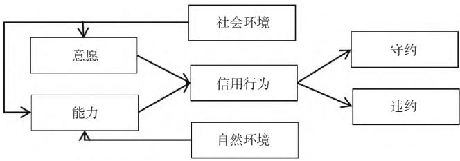

# 跨境电子商务风险形成机制及防范策略

强国兴

北京达辉律师事务所，北京 100020摘要：文章针对跨境电子商务经营存在的风险，重点探讨了信用信息风险、运营管理风险和网络结构风险的形成机制，并提出了相应的防范策略，以期帮助跨境电子商务企业更好地规避风险，实现稳健经营，从而促进该行业健康发展。

关键词：跨境电子商务；信用信息风险；运营管理风险；网络结构风险

分类号：F724.6

# 1 跨境电子商务经营存在的风险

# 1.1 信用信息风险

在跨境电子商务经营的过程中，信用信息风险主要包括企业信用风险、知识产权风险、信息安全风险和信息不对称风险 [1]。其中，企业信用风险主要体现在市场准入、交易归属等方面，受现有法律法规解决相关风险问题的框架，无法突破跨境电商高频化等特征的限制，其难以在跨境电子商务信用信息争端事件处理中发挥作用；知识产权风险是在跨境电子商务交易的过程中，涉及知识产权侵权等问题，对企业的合法权益与品牌形象造成损害，不仅会导致企业积压库存，而且会使企业成为知识产权人诉讼索赔的对象；信息安全风险主要源于计算机和互联网系统软硬件兼容性、稳定性，由于信息技术、网络软硬件更新周期短，跨境电子商务企业所运行的软硬件型号、版本混杂，增加了信息安全风险发生的概率；信息不对称风险则主要是因跨境品牌代理商对被代理品牌货源具有较强的依赖性，商品的制造、检验等均由品牌商负责，其对质量无实际的把控和质疑权利，即使对商品的合规性提出质疑，也无法结合现有的信息对商品质量进行检验和处理。

# 1.2 运营管理风险

目前，跨境电子商务经营存在的运营管理风险包括物流风险、滞销风险、支付风险、汇率风险。其中，物流风险源于跨境电子商务物流揽件具有特殊性，存在丢失率高、运输时间长的情况 [2]。从国际物流政策变动来看，国际物流模式和货运政策的优化晚于跨境电子商务的发展，因此其无法契合跨境电子商务的发展方向。同时，国际物流规则的修订以传统贸易为基础，使得境外跨境电子商务企业、境内服务商等承担了一定的物流风险；滞销风险主要是跨境电子商务出口企业在将货物运送到目的国海外仓后，通常面临无法如期完成销售目标而囤货滞销的困境；支付风险主要是跨境电子商务支付参与方不遵守相关支付契约，导致收款方未能及时、全额、顺利和无新增成本地收回交易款项，当然收款方因自身因素导致的收款风险除外。

# 1.3 网络结构风险

近些年，跨境电子商务经营发展中面临的网络结构风险主要包括入驻平台风险、代理关系风险、政策监管风险。其中，入驻平台风险主要指跨境电子商务企业在选择入驻平台时，可能会面临平台政策风险、平台内竞争风险、平台经营导致的品牌风险及数据安全风险，若跨境电子商务企业缺乏充分准备就盲目入驻电子商务平台，则极易出现企业人力资源缺乏等问题，对企业的平衡发展造成巨大破坏。代理关系风险指跨境电子商务企业与代理商或代理合作伙伴可能存在合作风险与合规风险。一方面，信息不对称为一些劣质境外品牌甚至是虚假境外品牌创造了风险发生的条件；另一方面，代理商通常代理多个品牌，存在与其他品牌的竞争风险，进而影响自身发展需求，并与企业产生竞争的关系，影响双方的合作。政策监管风险主要由两方面因素构成：第一，国际贸易法规政策造成的跨境电子商务经营风险，包括各国贸易法规差异、产品质量追溯主体认定、代码与条码机制固有缺陷；第二，政策监管造成的跨境电子商务经营风险，包括税率风险、检验建议、跨境电商经营正面清单。

# 2 跨境电子商务风险形成机制

# 2.1 风险形成要素

跨境电子商务风险形成要素有：第一，主体要素，包括信用信息风险、运营管理风险、网络结构风险；第二，工具要素，包括技术风险、安全风险；第三，环境因素，包括摩擦风险、市场风险、法律风险 [3]。

# 2.2 风险形成一般机制构架

根据风险形成要素建立跨境电子商务风险形成的一般机制架构，具体如图 1 所示。由图 1 可知，跨境电子商务风险形成一般机制的底层逻辑是社会环境、自然环境。其中，社会环境会对行为主体的意愿、能力产生影响；自然资源则对行为主体的能力产生影响。同时，行为主体的意愿和能力也会影响其信用行为，并决定行为主体是否“守约”。

  
图1　跨境电子商务风险形成一般机制架构

# 2.3 具体的风险形成机制

# 2.3.1 信用信息风险形成机制

社会环境和自然资源对参与跨境电子商务的主体的意愿和能力产生重要影响，进而影响其信用行为和信用状况。首先，社会环境的稳定性、法律制度、行业规范等因素会直接影响参与者的信用意愿和能力。若社会环境的规范性不足或地区的法制不健全，参与者则会面临更多的欺诈和违约行为，增加了信用信息风险。其次，自然资源的供给不确定性也会影响参与者的信用行为。例如，自然灾害、气候变化等因素会增加交易中发生风险的概率，买家或卖家极易因自然灾害等原因无法履行合约，进而形成信用风险。最后，跨境电子商务交易中参与者的信用意愿和能力直接影响其在跨境电子商务中的信用行为。若参与者缺乏诚信意识或者资金实力不足，则容易出现拖欠货款、欺诈等行为，增加了信用信息风险。另外，信用行为的表现，即“守约”和“违约”影响机制较为复杂，受到信用意愿、信用能力等多重因素的影响。其中，在信用意愿的驱使下，行为主体会追求物质利益最大化目标，进而出现本性违约；当违约获利大于守信获利与社会普遍违约获利时，则出现从众违约。在信用能力的影响下，行为主体因支付参与方的原因导致信用能力不足以守约支付，进而出现自致违约；当行为主体因不可抗力导致支付参与方信用能力不足以守约支付时，则出现他致违约[4]。尽管违约的影响机制不同，且违约是否“好”的评判标准不固定，但违约必会对跨境电子商务企业的经营发展产生一定的影响，增加其信用信息风险发生的概率。

# 2.3.2 运营管理风险形成机制

基于跨境电子商务企业经营发展的实践情况来看，其运营管理风险主要受社会环境、自然环境的影响。首先，社会环境的不稳定性会导致供应链中断，例如，政治动荡会在一定程度上降低供货商的生产和交付能力，进而导致跨境电子商务企业的产品供应不稳定，从而对跨境电子商务企业产品的交付能力及客户满意度产生不利影响。其次，自然环境要素引发的运营管理风险主要体现为自然资源的供给不确定性。一方面，自然资源供给不确定性给物流运输方带来极大挑战，如气候变化可能影响交通运输的顺畅性，导致货物延误或损坏等，增加了跨境电子商务企业的运营成本和客户投诉率。另一方面，自然资源的供给不确定性还会对跨境电子商企业的库存管理造成影响。

# 2.3.3 网络结构风险形成机制

与信用信息风险和运营管理风险的形成机制相比，网络结构风险形成机制较为简单。首先，社会环境的不稳定性增加网络遭受黑客攻击的风险。同时，部分跨境电子商务企业依托境外知名第三方电子商务平台进行销售，若社会环境不稳定，这些平台极易出现发展不稳定等问题，对跨境电子商务的经营产生不利影响。其次，自然资源的供给不确定性对数据安全造成影响，进而给跨境电子商务企业带来风险。尤其是面临自然灾害时，数据中心容易受损，进而造成数据丢失或泄露，不利于跨境电子商务企业可持续发展。

# 3 跨境电子商务风险防范策略

# 3.1 布局多元化渠道

布局多元化渠道可以有效降低跨境电子商务存在的风险，提高其业务的灵活性与适应性，为增强企业竞争力及实现可持续发展奠定坚实基础。首先，跨境电子商务企业可以通过多种渠道销售产品，如第三方电商平台、社交媒体平台等，扩大销售渠道的覆盖范围，降低单一渠道造成的风险。其次，跨境电商企业可以考虑引入线下实体店，提供线上线下一体化购物体验，以吸引更多的消费者。并且，跨境电商企业不应局限于一个跨境市场，可以拓展多个地区市场，分散风险，提高企业适应能力。因此，跨境电子商务企业应与不同类型的合作伙伴建立合作关系，如物流企业、跨境电商平台等，以共享资源，降低成本，增强企业的竞争力。最后，跨境电商企业应针对不同市场和消费者群体，提供定制化产品与服务。同时，了解消费者的需求和偏好，根据不同市场调整营销策略，从而提升销售效率及客户满意度。

# 3.2 了解目标地相关法律法规

了解目标地相关法律法规可以降低跨境电子商务中的法律风险，确保业务的合规性，维护企业声誉及利益。首先，在进入新跨境市场前，跨境电子商务企业应寻求专业的法律咨询，了解目标地相关法律法规和政策，帮助自身规避潜在法律风险。同时，应深入研究目标地法律环境，如消费者权益保护法、电子商务法、隐私保护法等。其次，跨境电子商务企业应根据目标地法律法规要求建立合规的流程和机制，确保相关业务的各项活动都符合当地法律要求，避免违法行为。然而，法律法规会发生动态变化，因此，跨境电子商务企业应持续监测目标地法律变化情况，以及时调整经营策略与合规措施，保持自身对法律环境的敏感性，避免因法律变化而导致的风险。

# 3.3 严格把关产品质量

严格把关产品质量可以降低跨境电子商务中因产品质量而产生的风险，提升消费者购买体验，增强企业产品的竞争力，推进其可持续发展。首先，跨境电子商务企业应选择可靠的供应商，与其建立稳定的合作关系，确保其能提供符合标准的产品。在产品采购过程中，跨境电子商务企业应建立严格的质量把控机制，对产品进行严格的检验与测试，降低因产品质量问题而出现的风险。其次，跨境电子商务企业应建立完善的质量管理体系，包括质量控制流程、质量标准、质量检测等，确保产品质量能得到有效控制，以及时发现和解决质量问题，提高产品的可靠性，降低企业风险。最后，跨境电子商务企业应建立完善的售后服务机制，及时响应与处理产品质量问题，提升消费者对产品及品牌的信任度。

# 3.4 加强合同管理

加强合同管理可以规避跨境电子商务中的合同风险，维护合作关系的稳定性与可持续性，确保业务顺利进行。首先，跨境电子商务企业应在签订合同前明确合同条款，包括产品规格、价格、付款方式等，避免发生歧义与纠纷。同时，建立完善的合同管理制度，包括合同审批、合同签订、合同执行与归档等，确保合同管理的规范性和有效性。其次，跨境电子商务企业应定期审查已签订的合同，确保各方履行合同条款，以及时采取相应措施，避免合同风险的发生。在合同签订的过程中，跨境电子商务企业应对合作方进行风险评估，并根据评估结果采取相应的风险管理措施。最后，跨境电子商务企业应在合同中明确争议解决方案，以及时、有效解决合同纠纷。

# 3.5 建立风险管理机制

建立完善的风险管理机制可以更好地规避与化解跨境电子商务中的各类风险，提升业务稳健性与可持续性。首先，跨境电子商务企业应组建专业风险管理团队，制定明确的风险管理政策和流程，确保风险管理工作有章可循。其次，跨境电子商务企业应建立风险预警机制，及时发现潜在风险，并针对不同风险情况制定相应的应对措施，降低风险的影响。最后，跨境电子商务企业应注重数据风险问题，对敏感数据与信息进行加密处理，并建立完善的数据备份与灾难恢复机制，确保数据安全。

# 4 结束语

跨境电子商务的发展为企业带来了新的商机和挑战，使得风险管理成为企业经营中不可或缺的重要环节。文章对信用信息风险、运营管理风险和网络结构风险的形成机制进行深入剖析，提出了布局多元化渠道、了解目标地相关法律法规、严格把关产品质量、加强合同管理和建立风险管理机制等防范策略，以规避风险，实现跨境电子商务企业的可持续发展，并为该行业的健康发展贡献力量。

# 参考文献

[1]	 张蓓，张雅竹，朱吉婵.食品安全风险伤害与风险交流对消费者风险感知的综合影响：以跨境电商为例[J].贵州财经大学学报，2024（1）：71-79.  
[2]	 蒋青秀.跨境电商企业风险分析及内部审计优化探析[J].上海商业，2023（12）：101-103.  
[3] 吴菲菲.电子商务背景下的跨境物流常见风险及规避[J].中国航务周刊，2023（47）：72-175.  
[4]	 黄利荣，田钧.电商平台跨境物流风险管理探讨[J].商业经济研究，2023（21）：105-107.