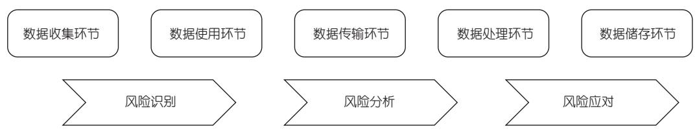
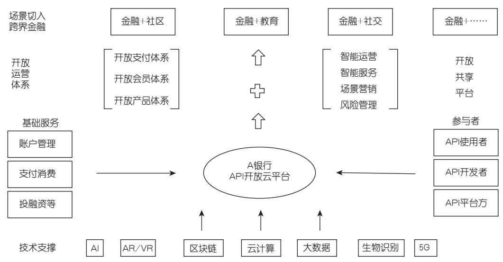

# 防患于未然：基于风险矩阵的 API 金融数据泄露风险管理

陈秀萍，李 振

摘 要 近年来 API 金融数据泄露事件时有发生，严重损害用户利益和金融安全。本文以 API开放银行数据泄漏风险管理为例，识别 API 在数据收集、使用、传输、处理和储存五大关键应用环节的风险因素，并运用风险矩阵，通过风险等级评价和Borda序数值两种方法构建了风险因素分级系统，进一步提出风险应对策略。研究发现，金融数据泄露风险因素主要有 41 种，其中高风险 16 种、中风险 20 种、低风险 5 种，在微观层面上可主要采用风险规避、风险降低、风险分担策略进行应对。

关键词 API 金融数据泄露 风险矩阵 风险管理 开放银行

DOI:10.20134/j.cnki.fmr.2024.07.013

# 一、引言

金融数据具有高价值性和高敏感性，对其共享可以降低金融活动交易成本、优化金融资源配置（黎四奇和王威，2023）。金融数据安全关系到国家安全、社会稳定、公众权益与金融市场稳定（肖洋和臧国全，2023）。应用程序接口（ApplicationProgramming Interface，API）作为金融数据开放的关键接口，是金融机构与第三方合作平台共享数据信息的重要桥梁（杨东和程向文，2019）。中国人民银行发布的《金融科技（FinTech）发展规划（2019 －2021 年）》指出，要借助 API 等工具，促进跨界合作的深化，推动金融业务的解构整合。然而，近年来，以 API 为基础的数据安全问题日益突出，对金融行业的风险管理提出巨大挑战。《中华人民共和国数据安全保护法》明确指出，要对数据实行分类分级保护，强化数据安全风险信息的获取、分析、研判和预警工作。在此背景下，分析金融行业存在的数据泄露主要风险因素，划分风险等级并提出应对措施变得极为重要。

API 是一组定义、程序及协议的集合，通过接口可以在不访问源代码的情况下实现不同软件的通信（陈长青 等，2021）。API 连接着企业和客户，是系统环境和组织机构之间数据交互和传输的重要工具。金融机构借助API与第三方平台共享数据，可以形成资源共享、场景融合、优势互补和相互赋能的开放生态（杨学科和安雪梅，2021）。随着 API 用户的指数级增长，黑客攻击、数据泄露等风险问题日益突出，已经引起了学术界的广泛关注（袁斌 等，2023 ；丁旭辉 等，2023 ；陈真 等，2023a，2023b）。金融机构拥有大量个人隐私数据，开放生态可能导致一系列的数据泄露、数据滥用、数据污染等问题（夏诗园和尹振涛，2022），然而目前却鲜有文献对 API金融数据风险管理问题进行系统论述。

API 作为数据开放平台重要的传输接口，使数据可灵活调用且敏捷部署的同时也降低了数据安全性。根据OWASP（2019）的研究，API 主要存在失效的对象级别授权、失效的用户身份验证、过度的数据暴露、缺乏资源和速率限制、失效的功能级授权等风险。2019 年 12 月，Facebook 爆发的 2.67 亿用户隐私数据泄露事件，即来源于 API 的安全漏洞 。与 API 相关的金融风险包括数据泄露风险、数据滥用风险、隐私合规风险等（夏诗园和尹振涛，2022）。针对 API 的网络攻击主要包括重放攻击、会话 Cookie 篡改、注入攻击、内容篡改、DDoS 攻击等，黑客通过各种方式暗自发出攻击，导致金融数据泄露（中国信通院，2020）。据近些年 API 攻击数据统计，API 遭受攻击主要体现在营销作弊、账号风险、数据窃取和流量欺诈四大场景。由于 API 连接交互涉及个人隐私数据、业务数据等各种类型，金融数据共享涉及多个服务提供、场景建设、交易发起等主体，数据泄露可能存在于数据的收集、使用、传输、处理和储存等环节（图1）。

基于上述分析，本文首先从数据收集、使用、传输、处理和储存五大环节识别金融数据泄露风险，总结出金融数据主要存在的风险问题。然后使用案例构建、专家咨询、交叉打分等方法，根据商业银行特征构建开放银行 A，明确开放银行 A 使用 API 开放数据的关键风险点，并使用风险等级评价和计算 Borda 序数值方法，对API 金融数据泄露风险进行量化分析，总结出 41 种风险问题，其中 16 种为高风险问题、20 种为中风险问题、5 种为低风险问题。最后，对高风险、中风险、低风险问题分别提出应对措施，以此形成闭环更新的风险管理体系，为完善金融数据风险监管提供参考依据。

# 二、文献述评

现有关于金融数据风险的文献主要集中在法理层面。例如，夏诗园和尹振涛（2022）通过分析金融数据宏观层面的主权风险和社会风险，中观层面的市场垄断风险，以及微观层面的主体隐私和利益受侵害风险，分别提出金融数据治理策略。黎四奇和王威（2023）通过剖析金融数据的权属问题、利益分配问题，提出金融数据开放共享的监管模式。吴江羽（2020）从金融数据权力保护维度和合法运营维度，梳理了金融科技背景下金融数据的监管逻辑路径。来小鹏和郭子訸（2024）采用层次分析法和模糊综合评价法，分析了金融数据跨境流动的法律风险。

  
图1 API金融数据泄露风险管理流程

从数据风险来源的角度，阿柔娜（2023）指出，数据隐私风险主要来源于物联网、区块链与信任，基于支持向量的机器学习引发的数据隐私风险，共享平台的数据隐私风险，医疗健康隐私风险，以及新冠疫情与应用程序的移动健康与溯源引发的数据隐私风险。万小博（2022）认为数据信息系统中数据泄露主要是信息“公示”、安全漏洞、API使用不当所导致。Heet al.(2023) 表明，银行通过开放 API 等技术，使金融数据流向监管相对薄弱的金融科技平台，可能催生数据垄断风险。

整体而言，对于金融数据泄露风险的管理，目前研究文献较少，并且鲜有文献从 API 的角度对金融数据泄露风险进行针对性分析。因此，本文采用风险矩阵的方法研究基于 API 的金融数据泄露风险，具有较大的理论价值和现实意义。

# 三、API 金融数据泄露风险识别

正确识别金融数据泄露风险因素是风险管理的第一步。本文将以API使用关键环节为主线，总结数据的收集、使用、传输、处理、储存五大环节中存在的41种风险因素。

# （一）收集环节的数据泄露风险

数据收集环节是金融数据开放的起点，也是潜在的安全风险来源。相较于传统数据收集方式，通过 API 接口收集数据更具有便利性和开放性。首先，数据提供者和接收者无需确定对方的真实身份，只需进行接口授权许可即可传输数据，因此无法保证双方的身份安全，给黑色产业留下可乘之机，黑产可以通过多种方式收集数据，如入侵后台、勾结内部人员暗中下载或导出用户数据，又或者通过 API 违规收集用户信息，并在暗网或地下黑市出售给其他竞争平台谋取暴利。其次，在 API的开发和部署过程中难免存在安全漏洞，恶意行为者可能利用这些弱点获取用户数据。例如，在缺乏身份验证的情况下，使用非 POST 请求、通过 Cookie 传递密码等手段进入接口，非法获取用户数据。

因此，数据收集环节主要存在以下风险因素：绕过身份验证、不法分子违规收集数据、内鬼暗地下载数据、黑市购买数据、API开发和部署漏洞等。

# （二）使用环节的数据泄露风险

数据使用环节涉及对收集的数据进行处理、分析和应用，可能会产生各种风险因素。首先，数据污染风险。数据无标签的属性使其在使用过程中容易遭到非法篡改、错误修改或植入恶意软件等攻击，导致数据的质量和完整性受损（夏诗园和尹振涛，2022）。其次，数据滥用风险。金融消费者使用小程序或者第三方软件办理金融业务的过程，实际上就是通过应用程序接口调用其他平台的数据。在此过程中，第三方机构可能在隐私协议等授权过程中获取搜集和查询信息的权利，趁机收集用户身份、联系方式、所处位置、支付密码等隐私信息，识别用户消费习惯、风险偏好和财务状况，再利用差异化定价、过度营销等手段滥用用户数据，操纵用户的消费行为。例如，部份机构未经用户同意销售或转让数据给其他黑客、犯罪组织等，侵犯用户隐私权益。最后，数据共享风险。在数据共享、委托处理和传输的过程中，缺乏数据安全合规能力的第三方数据处理机构，可能因操作不当直接损害金融机构的利益。

由于内外部数据标准不一，攻击者主要针对三种 API 进行攻击：注册接口、登录接口和密码找回接口。一方面，攻击者通过API利用动态代理IP进行低频慢速的攻击，以完成撞库、恶意注册、营销作弊、数据爬取、敏感 API 境外访问等高风险操作，或利用 API 进行短信轰炸、恶意网址跳转，而标准的数据保护方式 WAF 不具备这方面的检测功能（Jha et al.，2023）。另一方面，针对 API 上流动的数据安全问题，需要对 API 返回的内容进行分析，而标准 WAF 只部署了已知漏洞攻击的安全模型，对于传输过程中敏感数据分级加密尚无明确措施（蔡晓玲和詹庆东，2018）。

因此，数据使用环节主要存在以下风险因素：登录接口盗取密码、接入耗时长、被植入恶意软件、利用动态代理 IP 攻击、数据风险标准不一、数据清洗成本过高、API 管理无统一标准、非法篡改或错误修改数据、金融机构滥用个人数据、第三方金融机构不合规等。

# （三）传输环节的数据泄露风险

数据传输涵盖数据发送、传递和接收三个过程，具体而言就是通过网络等方式将数据从一个地方传递到另一个地方。API 作为关键 IT 资产，黑客会通过影子API、僵尸 API 对数据传输双方进行欺骗，导致数据泄露（陈真 等，2023b）。首先，数据发送是确保数据安全的第一步，主要存在因数据未加密、未授权访问和允许弱密码产生的金融数据泄露风险。如果数据发送者没有适当的访问控制机制，未经授权的用户就可能通过猜测或暴力破解的方式获取敏感数据。例如，不少传统企业建立线上平台时只为完成任务，忽略线上应用交互、数据传输的安全性，导致数据泄露。其次，在数据传递过程中可能存在网络窃听、中间人攻击、数据包重放等问题。攻击者可以通过截获数据传输的网络流量或在传输路径上插上恶意代理服务器，以获取或篡改数据，这会破坏数据的完整性和一致性。如果使用的传输协议不安全，例如，明文传输或弱加密算法，攻击者也可以轻松截获、解密数据、模拟合法请求以盗取数据。此外，在数据接收过程中可能存在数据接收端漏洞、内部员工管理难、API 资产确权难等问题，一些攻击者通过存在安全漏洞或错误配置的数据接收端窃取数据。从数据传输形式来看，随着组织架构的复杂化，企业数据资产的多元化，原有的权限授权管理方式难以约束员工或合作伙伴导致数据泄露。

因此，数据传输环节主要存在以下风险因素：数据未加密、未授权访问、允许弱密码存在、数据传输途中被篡改、网络窃听、中间人攻击、不安全的传输协议、数据包重放、内部员工行为问题、API 资产管理问题等。

# （四）处理环节的数据泄露风险

数据处理环节主要包括对数据进行计算、转换和操作。首先，在数据计算环节，主要存在恶意计算代码、不正确的算法实现、侧信道攻击等问题。在数据处理过程中，攻击者可能利用恶意计算代码窃取数据，或使用错误的计算模型导致敏感数据暴露。攻击者也可能通过观察计算过程中的计算时间、功耗或电磁辐射等侧信道信息，推断出敏感数据的信息，导致信息泄露。其次，在数据转换过程中，主要存在格式转换出错、数据映射和重定向、人为错误和失误、内部威胁及脱敏不规范等导致数据泄露的问题（Joseph，2018）。数据转换涉及将数据映射到不同的位置和系统，由于业务系统 API 变更较快，数据处理不及时，大量涉敏数据因尚未脱敏、类型过多、Airflow 未授权访问、Clickhouse未授权访问等缺陷，遭到被攻击者的恶意利用（陈真 等，2023a）。除此之外，由于金融数据管理制度不健全、金融数据治理有关法律法规不完善、缺乏数据开放全生命周期管理机制等问题，企业还面临着API 的缺陷难以检测，黑产攻击难以识别等问题。部分攻击者在攻防对抗中通过动态 IP、API 的逻辑组合等方式，伪装成正常的流量请求，绕过传统的风险检测规则和模型，对 API 进行低频、慢速攻击，也会引发数据泄露等风险问题。

因此，数据处理环节主要存在以下风险因素：缺乏统一的数据处理标准、恶意计算代码、不正确的算法实现、侧信道攻击、格式转换出错、数据映射和重定向、数据脱敏不规范、人为失误和组织失误、风险信息沟通渠道不畅通、业务操作及工作习惯、伪装成正常流量请求等。

# （五）储存环节的数据泄露风险

数据储存环节主要涉及将数据保存在存储系统中，以便后续使用和查询。首先，数据泄露风险随着数据储存时间的增加而提高。常见的数据存储类型有：文件、电子邮件和数据库记录。有的数据因法律规定组织机构会无期限地保留数据，导致他们面临较高的数据泄露风险。其次，数据泄露风险随着数据保存份数的增加而提高，即随着数据拷贝次数、数据扩散的增加而提高。一旦数据通过 API 传输就可能使得服务器上有数据副本，使黑客或未经授权的用户趁机下载数据。最后，数据泄露风险随着数据价值的增加而提高。对海量的客户隐私数据融合分析，能带来较大的商业价值（He et al.，2023），这促使犯罪分子有动机盗取客户隐私数据。例如，信用卡相关数据与医疗健康数据相比，信用卡相关数据更易成为犯罪分子的攻击目标。

因此，数据储存环节主要存在以下风险因素：储存数据价值较大、数据储存时间过长、储存渠道管理不规范、储存数据未分级分类、储存数据数量过多等。

# 四、基于风险矩阵的金融数据泄漏风险分析

在分析和总结金融机构使用 API 开放数据过程中面临的主要数据泄露风险因素的基础上，为更好地对风险进行分类分级管理，本文使用案例构建、专家咨询和交叉打分等手段，采用风险等级评价和计算Borda 序数值方法，对 API 的金融数据泄露风险进行量化分析。

# （一）风险矩阵与两种风险分析方法

从定义来看，风险矩阵是一种通过定义后果和可能性的范围，对风险进行展示和排序的工具（李素鹏，2013），通常以列表或图形的形式呈现风险识别和分析结果。为提高风险识别的可信度，本文在风险矩阵中，针对同一批风险因素分别通过风险等级评价和 Borda 序数值评价两种方法进行评价，并综合比较两种评价方法得出风险分析结果。

# 1. 风险等级评价方法及操作

风险等级评价方法由风险影响等级、风险发生概率和风险级别划分标准三个概念组成。本文的风险影响等级、风险发生概率和风险级别划分标准的定义分别见表1、表 2 和表 3。具体操作步骤为，专家组依据金融数据泄露案例的具体情况，根据表 1 和表 2，结合经验得出各风险因素的风险影响等级和风险概率范围以及对应的数值，根据表3判断风险级别。

表1 风险影响等级的定义  

<table><tr><td rowspan=1 colspan=1>风险影响等级</td><td rowspan=1 colspan=1>对应数值</td><td rowspan=1 colspan=1>解释说明</td></tr><tr><td rowspan=1 colspan=1>可忽略</td><td rowspan=1 colspan=1>1</td><td rowspan=1 colspan=1>风险事件发生时，未发生数据泄露</td></tr><tr><td rowspan=1 colspan=1>微小</td><td rowspan=1 colspan=1>2</td><td rowspan=1 colspan=1>风险事件发生时，发生部分数据泄露，风险管理系统轻松应对，影响较小</td></tr><tr><td rowspan=1 colspan=1>一般</td><td rowspan=1 colspan=1>3</td><td rowspan=1 colspan=1>风险事件发生时，发生大量数据泄露，冲击风险管理系统</td></tr><tr><td rowspan=1 colspan=1>严重</td><td rowspan=1 colspan=1>4</td><td rowspan=1 colspan=1>风险事件发生时，发生重大数据泄露事件，风险管理系统全面应对</td></tr><tr><td rowspan=1 colspan=1>关键</td><td rowspan=1 colspan=1>5</td><td rowspan=1 colspan=1>风险事件发生时，风险管理系统崩溃，给金融体系带来巨大影响</td></tr></table>

表2 风险发生概率的定义  

<table><tr><td rowspan=1 colspan=1>风险概率范围%</td><td rowspan=1 colspan=1>对应数值</td><td rowspan=1 colspan=1>解释说明</td></tr><tr><td rowspan=1 colspan=1>0~10</td><td rowspan=1 colspan=1>1</td><td rowspan=1 colspan=1>几乎不可能发生</td></tr><tr><td rowspan=1 colspan=1>11~40</td><td rowspan=1 colspan=1>2</td><td rowspan=1 colspan=1>发生的可能性极小</td></tr><tr><td rowspan=1 colspan=1>41~60</td><td rowspan=1 colspan=1>3</td><td rowspan=1 colspan=1>有可能发生</td></tr><tr><td rowspan=1 colspan=1>61~90</td><td rowspan=1 colspan=1>4</td><td rowspan=1 colspan=1>可能性较大</td></tr><tr><td rowspan=1 colspan=1>91~100</td><td rowspan=1 colspan=1>5</td><td rowspan=1 colspan=1>极可能发生</td></tr></table>

表3 风险级别对照表  

<table><tr><td rowspan=1 colspan=1>风险影响等级风险概率范围%</td><td rowspan=1 colspan=1>可忽略</td><td rowspan=1 colspan=1>微小</td><td rowspan=1 colspan=1>般</td><td rowspan=1 colspan=1>严重</td><td rowspan=1 colspan=1>关美建</td></tr><tr><td rowspan=1 colspan=1>0~10</td><td rowspan=1 colspan=1>低</td><td rowspan=1 colspan=1>低</td><td rowspan=1 colspan=1>低</td><td rowspan=1 colspan=1>中</td><td rowspan=1 colspan=1>中</td></tr><tr><td rowspan=1 colspan=1>11~40</td><td rowspan=1 colspan=1>低</td><td rowspan=1 colspan=1>低</td><td rowspan=1 colspan=1>中</td><td rowspan=1 colspan=1>中</td><td rowspan=1 colspan=1>高</td></tr><tr><td rowspan=1 colspan=1>41~60</td><td rowspan=1 colspan=1>低</td><td rowspan=1 colspan=1>中</td><td rowspan=1 colspan=1>中</td><td rowspan=1 colspan=1>中</td><td rowspan=1 colspan=1>高</td></tr><tr><td rowspan=1 colspan=1>61~90</td><td rowspan=1 colspan=1>中</td><td rowspan=1 colspan=1>中</td><td rowspan=1 colspan=1>中</td><td rowspan=1 colspan=1>中</td><td rowspan=1 colspan=1>高</td></tr><tr><td rowspan=1 colspan=1>91~100</td><td rowspan=1 colspan=1>中</td><td rowspan=1 colspan=1>高</td><td rowspan=1 colspan=1>高</td><td rowspan=1 colspan=1>高</td><td rowspan=1 colspan=1>高</td></tr></table>

# 2. Borda 序数值方法及操作

Borda 方法主要根据一定的评价标准，通过排序投票的方式对风险进行排序，进而打开风险矩阵中的风险结。要算 Borda序数值，首先要算出 Borda 数，计算公式为：

$$
\begin{array} { r } { b _ { i } { = } \sum _ { k = i } ^ { 2 } ( N { - } R _ { i k } ) } \end{array}
$$

其中， $N$ 为风险因素总个数； $i$ 为第 $i$ 个风险因素（ $1 { \le } i { \le } \mathrm { N } )$ ）； $b _ { i }$ 为第 $i$ 个风险的Borda 数； $k$ 为风险判断准则个数， $R _ { i k }$ 为风险 $i$ 在风险判断准则 $k$ 下的风险等级， $k { = } 1$ 代表风险影响，即 $R _ { i 1 }$ 为在风险影响判断准则下，高于第 $i$ 个风险发生概率的风险因素个数； $k { = } 2$ 代表风险概率，即 $R _ { i 2 }$ 为在风险概率判断准则下，比第 $i$ 个风险发生后果更为严重的风险因素个数。

Borda 序数值表示在风险总数 $N$ 中，大于节点风险 $i$ 对应Borda数的节点风险个数，计算公式为： $B _ { i } \mathrm { = } b _ { j } \mathrm { - } b _ { i } ( 1 \leq j \leq N , j \neq i )$ ，当 $B _ { i } { = } b _ { j } { - } b _ { i } { \geq } 1$ 时， $j$ 即为第 $i$ 个风险的 Borda序数值。

具体操作为，专家组对各风险因素进行排序，并根据 Borda 数计算公式，计算出每一专家“排序打分”得出的 Borda 数，再根据不同专家的打分情况，进行加总平均得到一个排序，最后根据这个排序得分算出 Borda 数以及 Borda 序数值。

# （二）基于 API 的金融数据泄露风险矩阵建立——以A银行为例

开放银行的金融数据共享是指第三方金融机构在客户授权的条件下，通过 API等技术访问客户数据，并提供个性化金融服务的过程（杨东和程向文，2019）。当前，开放银行在全球各地蓬勃发展，国内工商银行、建设银行、招商银行等都已建立 API 云开放平台。但 API 开放银行的迅速发展要求商业银行与外部生态系统直接连接，这可能使商业银行的系统和数据受到外部生态的攻击和侵袭。商业银行作为金融机构的主要组成部分，如果不加强风险管理，可能会引发商业银行体系“劣币驱逐良币”现象，诱发多种数据风险事件。因此，在整个金融体系，亟需定量分析开放银行数据泄露风险因素并提出应对措施。本文根据商业银行运营情况模拟构建开放银行 A，运用上述风险矩阵和 Borda序数值法对 A 银行数据泄露的主要风险因素进行评级，通过得出的风险等级为金融数据分级分类提供参考。

A 银行是一家国有大型商业银行，主要通过 API 开放平台将数字金融资产集中对外服务（图 2）。合作方可以通过平台提供的 API，便捷地使用该银行提供的数据、产品和服务，实现业务的快速创新，从而更好地为客户服务。当前 A 银行的开放服务可归纳为金融服务、行业服务、通用服务三类。其中，金融服务主要包括托管投资服务、金融风险服务、金融监管服务，对应开放的数据包括行内信贷信用评级、客户风险指标、行外金融资讯、银行账户黑名单、个人信用评分、可疑交易、大额报告等；行业服务主要包括教育、物业、宗教、景区、商务、政务服务，对应开放的数据包括生活缴费、医疗就诊，以及各级财政、机关事业单位在传统代理收支、日常机关财务、公共服务管理方面公布的数据；通用服务包括党建工会服务、财资服务、人力资源管理服务，对应开放的数据包括党员信息、企业的资金和信贷管理信息、企业的人力资源包括人员结构和薪酬信息。A银行的主要构建模块见图2。

基于上文分析得出开放银行 A 的 41个风险因素，通过发布调查问卷，搜集不同专家对各风险因素风险发生概率和风险结果影响的打分结果以及对所有风险因素的排序结果，最后根据风险等级评价方法和 Borda 序数值方法分别得到风险级别、Borda 数和 Borda 序数值（表 4）。 ①

  
图2 A银行API开放云平台

根据风险等级评价方法，数据收集环节存在绕过身份验证、API 开发和部署漏洞 2 个高风险因素，数据使用环节存在登录接口盗取密码、数据风险标准不一、非法篡改或错误修改数据、金融机构滥用个人数据 4 个高风险因素，数据传输环节存在数据未加密、未授权访问、允许弱密码存在、数据传输途中被篡改、内部员工行为问题 5 个高风险因素，数据处理环节存在缺乏统一的数据处理标准、数据脱敏不规范、伪装成正常流量请求 3 个高风险因素，数据储存环节存在储存数据价值较大、储存数据数量过多2个高风险因素。

根据 Borda 序数值方法得出的前 8 个高风险因素分布在A 银行 API 开放平台的数据收集、使用、传输、处理、储存等环节，其中，数据传输环节存在的数据泄露风险最多。经对比，Borda 序数值评价得出的高风险因素均存在于风险矩阵评价得出的高风险因素中。

由此，综合运用风险矩阵和计算Borda序数得出A银行数据泄露的风险评级结果，即 16 种高风险因素、20 种中风险因素、5种低风险因素，其中高风险因素中主要包括登录接口盗取密码、允许弱密码存在、非法篡改或错误修改数据、储存数据价值较大、数据脱敏不规范、数据未加密、伪装成正常流量请求、储存数据数量过多。

# 五、风险应对策略

接下来，本文将对高风险、中风险、低风险问题分别提出应对措施，以此形成闭环更新的风险管理体系。目前风险应对策略主要包括风险规避、风险降低、风险分担、风险接受四种，有研究通过建立风险发生概率和后果的二维选择象限（图 3）来确定风险应对方式（COSO，2004）。本文根据前述风险因素分析，针对不同层级的风险因素，结合风险应对策略选择象限理论，总结对应的金融数据风险应对措施，为决策者在风险评估的基础上选择合适的风险应对策略提供参考。

# （一）风险规避

风险规避是指主体在意识到某项活动风险损失的可能性较大时，主动放弃或改变以规避风险的风险应对方式。对风险的规避主要针对金融数据泄露的高风险因素，以下为应对策略。

第一，避免数据对高风险活动或项目开放。在数据传输之前，根据真实攻击特征，增加 API 在认证、授权、数据暴露等脆弱性的检测，如登录接口是否安全、是否存在弱密码、数据脱敏是否规范、数据是否加密等问题，动态更新 API 存在的漏洞。动态、自动化地梳理 API 上流动的敏感数据，对其进行分级分类，对不同层级的数据采用不同的安全措施，并结合外部情报对流量进行分析，不断更新 API 识别引擎，保证 API 资产梳理的准确性。对API 关联的账号资产进行梳理、分析，帮助客户应对账号共用、账号借用、账号盗用等各种类型的账号风险。

第二，面临不确定情况时选择放弃或终止活动。定期审查现有的数据处理活动和项目，及时进行风险评估，确保其仍符合数据安全和隐私保护的要求。基于广覆盖、高精准度的威胁情报，构建 API 访问的行为基线，根据攻击者使用的攻击资源，如攻击IP、工具、账号、行为等风险情报，利用机器学习等技术工具检测 API 访问序列中的异常行为，及时告警撞库、扫号、数据爬取、账号爆破、漏洞扫描等攻击风险，将风险从攻击精准感知到可控。在面临不确定因素时，权衡继续行动和放弃行动之间的利弊，必要时终止活动。

第三，将数据传输和处理活动转移至更安全的环境。持续梳理 API 资产，包括开放 API 数量、API 活跃状况、僵尸 API、影子 API 的安全风险信息。持续评估缺陷，将风险从未知到可测。在资产动态梳理的基础上，通过全网部署的代理蜜罐及情报，持续追踪攻击者利用新型 API 漏洞进行攻击的全过程，通过对新型攻击面和攻击特征的分析，持续迭代优化 API 漏洞检测引擎，确保及时发现 API 漏洞及各种隐藏风险点。对 API 安全缺陷自动化修复状态进行判定，闭环处理缺陷，若发现数据处理、传输或存储的环境存在风险，及时转移至安全的环境，提高安全运营效率。

# （二）风险降低

风险降低是指主体采取政策或措施降低风险发生概率或影响，或者同时降低两者的风险应对方式。要降低基于 API 的金融数据泄露风险，可采用加强 API 安全控制、加密数据传输、实施安全审计和监测等方式，发现潜在的数据泄露事件，从而达到提前干预的目的；或通过安全漏洞修补和更新、员工安全意识培训等方式，对API 平台进行及时更新。这是决策者主动干涉风险的行为，API 风险管理者可以采取降低风险策略来应对高、中风险等级的风险因素。

第一，强化 API 安全控制，确保 API的身份验证机制安全可靠，使用强大的认证和授权方式。从API开发、测试、发布、运维、迭代、下线等各阶段规范 API 接口安全管理能力，帮助银行优化升级风险管理技术，落地 API 全生命周期安全防护体系。管理 IP 资产和风险识别，及时有效地应对IP风险，限制对API的访问权限，定期审查和更新授权机制，并使用安全传输协议（如 HTTPS）来加密 API 请求和响应的数据传输，防止中间人攻击和数据窃取。

第二，实施安全审计和监测，建立监测系统，定期审计API的访问日志和活动，检测异常行为和潜在的安全威胁。对全流量进行账号识别、涉敏数据识别，并提取关键信息以完善审计日志，满足客户从账号调用、数据获取等不同维度的数据审计需求，帮助客户从账号异常行为及数据泄露情况还原攻击过程，从而有针对性地进行事件处理。

第三，对数据接口在不同领域的应用、部署、管理、防护进行规范。在网络攻击检测层面，针对 API 漏洞攻击、异常行为持续检测和全面可视化。对敏感信息进行加密，如对身份证号、部分姓名、银行卡号、交易号等特殊的敏感信息进行加密或做脱敏处理，以减少敏感信息的泄漏风险。

# （三）风险分担

风险分担是指各参与主体共担风险以降低风险发生概率或影响的风险应对方式。数据泄露的高风险和中风险事件通常涉及的数据泄露规模庞大、风险应对成本较高，因此可以引入第三方合作主体分担成本和风险。对于金融数据泄露风险，常采用签订数据共享协议、购买数据泄露保险、外包给第三方服务机构等方式来分担。

在对 API 资产进行梳理后，确定数据安全等级。对于传输业务、用户敏感数据的 API 接口，进行完备的安全审计，为关键数据购买数据保险，同时进行严格的安全限制，避免出现数据泄露后处理成本过高的问题。对于信用卡用户信息查询这类线上接口，签订数据共享协议，要求访问者通过手机短信验证码进行身份验证，确保访问者只能查询自己的信息，不能随意查询他人的信息。

多个程序通过 API 调用同一数据时，可将数据处理和存储等敏感操作外包给更专业的第三方服务机构，并签订数据保密协议，明确各方权责，以确保各方共担风险。对金融机构而言，在多方联合建模场景下，需要利用多个外部数据源提升模型精准度。采用多样化环境和多人共同合作处理的数据方式，实现数据碎片化加密，从而分散数据泄露风险。

此外，风险分担也要注意统一数据处理标准和 API 管理标准。避免同一数据在不同地方导出结果不一致的问题，比如个别国家登记册和EBA中央登记册所含信息之间存在差异，需要共同对 EBA 和国家登记册更新，保证提供数据一致性，避免错误的账户访问决定。

# （四）风险接受

风险接受是指商业银行提前发现，采取主动承担或不采取行动的风险应对方式。当前 API 在我国并未做到全面开放，有的数据即使不通过 API 泄露也会通过其他方式泄露，当风险因素的发生概率和影响较小时，过度采取风险管理手段会增加无谓成本，阻碍API开放金融机构的发展，因此有的数据泄露风险可以忽略。在这种情况下，建议决策者对风险采取风险接受的方式进行处置，明确风险承受成本和责任分担，以预防潜在的数据泄露风险。

除上述针对商业银行风险因素微观的、具体的应对策略外，也建议从以下几个方面加强金融数据泄露风险的管理。法律层面，进一步明确数据泄露相关法律责任；监管层面，探索监管统计体系，构建数据安全分级分类管理体系，明确金融数据流通范围规则，区分重要数据和一般数据，形成行业重要数据目录；技术层面，充分借助金融科技手段建立智能风控系统、自动化交易系统、智能监测系统、风险模型、预警模型、场景分析模型等，实时监测市场动态、交易活动和金融事件，提高风险识别有效跟踪等技术水平，提升数据全生命周期动态分级技术水平，防范化解金融数据泄露风险。

学术编辑：韦燕春

参考文献

[1] 阿柔娜.数据隐私风险的时序主题关联和演化路径研究[J].情报科学,2023,41(05):153-160.  
[ 2] 蔡晓玲,詹庆东.Web 2.0环境下的个人知识管理工具研究[J].情报理论与实践,2018,41(03):136-141.  
[ 3] 陈长青,郭春,崔允贺,等.基于API短序列的勒索软件早期检测方法[J].电子学报,2021,49(03):586-595.  
[4] 陈真,乞文超,贺鹏飞,等.云应用程序编程接口安全研究综述:威胁与防护[J].电子与信息学报,2023,45(01):371-382.  
[5] 陈真,乞文超,鲍泰宇,等.面向服务质量感知云API推荐系统的数据投毒攻击检测方法[J].通信学报,2023,44(08):155-167.  
[6] 丁旭辉,张琳琳,赵楷,等.基于静态和动态特征相结合的隐私泄露检测方法[J].计算机科学,2023,50(10):327-335.  
[ 7 ] 黎四奇,王威. 金融数据共享利益冲突平衡的法律进路[J].财经理论与实践,2023,44(05):138-145.  
[8] 李素鹏.风险矩阵在企业风险管理中的应用——详解风险矩阵评估方法[M].北京:人民邮电出版社,2013:97-110.  
[9] 来小鹏,郭子訸.金融数据跨境流动的法律风险量化分析与规制建议[J].金融监管研究,2024(04):1-19.  
[10] 万小博.信息系统常见数据泄露原因及应对策略分析[J].电子技术与软件工程,2022,11(09):13-16.  
[11] 吴江羽.金融科技背景下金融数据监管法律框架构建[J].西南金融,2020,472(11):76-85.  
[12] 夏诗园,尹振涛.数字经济下金融数据风险及治理研究[J].电子政务,2022,235(07):57-66.  
[13] 谢瑞强,朱雪忠.基于风险矩阵的技术许可违约风险管理研究[J].科学学研究,2023,41(02):286-295  
[14] 肖洋,臧国全.个人金融数据的敏感性识别与隐私计量研究[J].情报理论与实践,2023,46(09):105-114.  
[15] 杨东,程向文.以消费者为中心的开放银行数据共享机制研究[J].金融监管研究,2019,8(10):101-114.  
[16] 杨学科,安雪梅.开放银行实践:数据可携权及其监管逻辑[J].金融经济学研究,2021,36(02):132-142.  
[17] 袁斌,郑开民,万俊,等.物联网云服务中API滥用的风险分析与检测[J].中国科学:信息科学,2023,53(12):2355-2371.  
[18] 中国信通院.应用程序接口(API)数据安全研究报告(2020年)[R/OL].[2023-12-08].http://www.caict.ac.cn/kxyj/qwfb/ztbg/202007/P020200727599918681913.pdf.  
[19] COSO.Enterprise risk management integrated framework:Application techniques[R].New York:Committeeof Sponsoring Organizations of the Treadway commission,2004:16-34.  
[20] He Z G,Huang J,Zhou J D.Open banking:Credit market competition when borrowers own the data[J].Journal of Financial Economics,2023,147(02):449-474.  
[21] Jha S,Zhang Y G,Park B,et al.Data-driven web-based patching management tool using multi-sensorpavement structure measurements[J].Transportation Research Record,2023,2677(12):83-98.  
[22] Joseph R C.Data breaches:Public sector perspectives[J].IT Professional,2018,20(04):57-64.  
[23] OWASP.OWASP Top 10 API Security Risks [EB/OL].[2023-12-08].https://owasp.org/API-Security/.

# API Financial Data Breach Risks and Risk Management

CHEN Xiuping1 LI Zhen2

(1.Chongqing Technology and Business University Institute for Chengdu-Chongqing Economic Zone Development; 2.Beijing Institute of Mathematical Sciences and Applications)

Abstract  In recent years API financial data leakage incidents have occurred periodically, undermining financial security and seriously harming the interests of data users. This paper assesses API open banking data leakage risk management and identifies the risk factors in of key application aspects, namely data collection, use, transmission, processing and storage, It applies a risk matrix to construct a risk factor grading system through two methods of risk level evaluation and Borda ordinal value. Additionally, it puts forward risk response strategies. It is found that there are 41 financial data leakage risk factors, of which 16 are high-risk, 20 are medium-risk, and 5 are low-risk. These risks can be addressed by adopting risk avoidance, risk reduction, and risk sharing strategies at the micro level.

Keywords  API, Financial Data Breach, Risk Matrix, Risk Management, Open Banking

JEL Classification  G32 Y10 G21