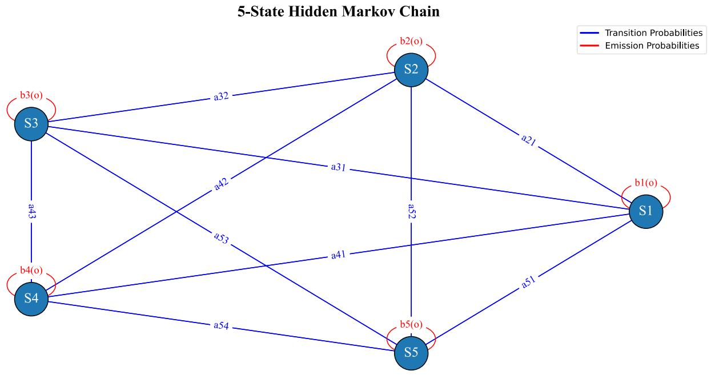
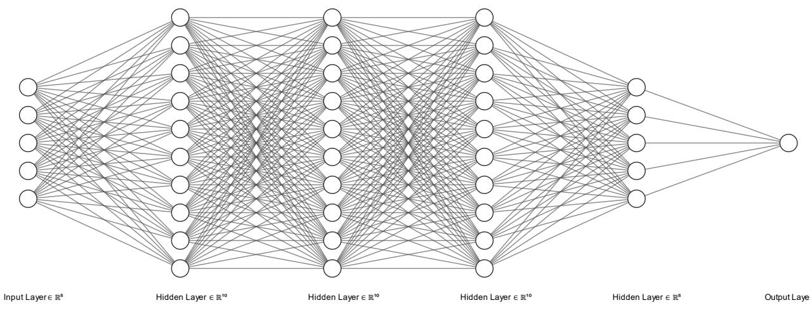
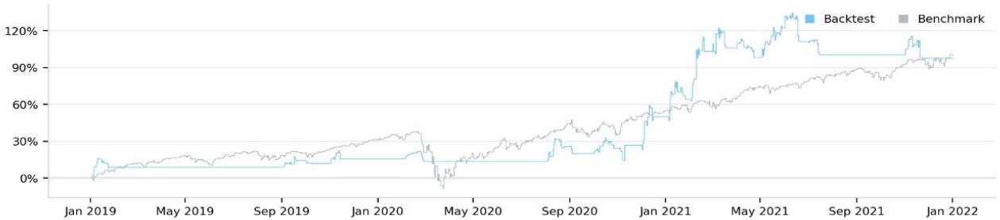

# AI-Powered Energy algorithmic Trading: Integrating Hidden Markov Models with Neural Networks

Tiago Monteiro

NOVA School of Science and Technology

tca.monteiro@campus.fct.unl.pt

# ABSTRACT

In quantitative finance, machine learning methods are essential for alpha generation. This study introduces a new approach that combines Hidden Markov Models (HMM) and neural networks, integrated with BlackLitterman portfolio optimization. During the COVID period (2019-2022), this dual-model approach achieved a $9 7 \%$ return with a Sharpe ratio of 0.992. It incorporates two risk models to enhance risk management, showing efficiency during volatile periods. The methodology was implemented on the QuantConnect platform, which was chosen for its robust framework and experimental reproducibility. The system, which predicts future price movements, includes a three-year warm-up to ensure proper algorithm function. It targets highly liquid, large-cap energy stocks to ensure stable and predictable performance while also considering broker payments. The dual-model alpha system utilizes log returns to select the optimal state based on the historical performance. It combines state predictions with neural network outputs, which are based on historical data, to generate trading signals. This study examined the architecture of the trading system, data pre-processing, training, and performance. The full code and backtesting data are available under the MIT license.

# 1 INTRODUCTION

Algorithmic trading profoundly influences financial markets by enabling rapid, precise execution of trading strategies beyond human capability.[1] Machine learning integration has further revolutionized this field, providing advanced techniques for pattern recognition and predictive modeling.[2]

QuantConnect, chosen for this study, offers extensive data access, powerful back-testing, and a robust algorithmic trading framework. This simplifies the development, testing, and deployment of trading strategies, making it ideal for this research. The comprehensive environment also ensures result replication, which is crucial for validating complex trading algorithms.

This study introduces a novel methodology that fuses the HMM and neural networks to create a dual-model alpha generation system. The aim is to leverage HMM's ability to capture temporal dependencies and market regimes, along with neural networks' capability to learn intricate patterns from historical price data.[3][4] The strategy uses Black-Litterman portfolio optimization combined with two risk management models, integrated with a dual-model alpha system.

The system employs a low-frequency buying strategy that is activated by converging signals from various AI models. A buy decision is made only when different model signals align, trade timing is refined, and broker payment considerations are incorporated to enhance trading efficiency and cost-effectiveness.

The primary objective is to develop an adaptable trading strategy that predicts price fluctuations and optimizes trading decisions. The results indicate the potential of this unified approach, with the algorithm achieving a $9 7 \%$ return and a Sharpe ratio of 0.992 during the COVID period (2019-2022)

# 2 BACKGROUND

HMMs, deep learning, and multi-model AI are crucial for optimizing algorithmic trading strategies. HMMs models systems with partially observable states, whereas deep learning utilizes neural networks to capture complex patterns. Multi-model AI integrates various machine learning models to improve robustness and accuracy.[5]

The application of HMMs in financial markets has evolved from simple regime-switching models to advanced volatility modeling methods.[6] Deep learning has progressed from basic neural networks to sophisticated architectures, such as LSTM, CNN, and transformer-based models.[7] Multi-model AI, employing ensemble methods, surpasses single ML algorithms in terms of robustness.[8] These theories form the basis for advanced trading strategies. HMMs provide insights into market regimes and volatility, deep learning models predict price movements, and multi-model AI enhances the overall robustness and predictive performance.

# 2.1 Previous Research

Previous research has highlighted the utility of HMMs in identifying market regimes and in volatility modeling. Additionally, deep learning techniques have shown potential for time-series forecasting and sentiment analysis.[9] Multi-model AI approaches, such as stacking and boosting, have improved prediction accuracy across various fields.[10] HMM studies often use regime-switching models and probabilistic analysis, whereas deep learning focuses on neural network architectures and training methods. Multi-model AI research combines different algorithms through ensemble techniques to leverage their unique strengths.

# 2.2 Challenges

Despite their advantages, HMMs face challenges in capturing the market complexity. Simple HMMs may not accurately interpret market dynamics because of their inability to capture both immediate and extended trends.[11] Deep learning models capture nonlinear relationships but require substantial data and computational resources. Although they often outperform traditional methods, their benefits can be modest and context-dependent, especially when data are limited or computational costs are high.[12] Multi-model AI approaches offer enhanced robustness and predictive performance but are more complex to implement.[13] Variability in data, methods, and implementation can lead to inconsistencies and reliability issues, complicating the reproduction.[14]

# 2.3 Research Gaps and Future Directions

Researchers often overlook the benefits of HMMs, deep learning, and multi-model AI in trading strategies owing to the lack of standardized frameworks for strategy standardization and data pre-processing. This absence complicates the creation of single and multi-model systems.[15] Bridging these gaps is essential to develop robust trading strategies capable of navigating complex financial markets. Future studies should explore integrating techniques to capture both linear and nonlinear market behavior, and investigate the impact of real-time market conditions on model performance.[16]

# 2.4 Tools and Hypotheses

QuantConnect facilitates advanced trading by supporting multi-model deployment using the LEAN opensource engine. It standardizes data and algorithm development, enhancing efficiency and reproducibility, while addressing current limitations.[17]

The development of the hypotheses depends on incorporating HMM, deep learning, and multi-model AI to optimize algorithmic trading strategies. A comprehensive literature review clarifies each approach's advantages and limitations, forming the following research questions: How does integrating HMM, deep learning, and multi-model AI affect the effectiveness of algorithmic trading strategies? What computational challenges does this integration present, and how can they be mitigated? How does the unified model perform under market conditions compared to the S&P 500, a standard benchmark for evaluating equity trading algorithms?

These hypotheses and research questions aim to develop an adaptive trading strategy that addresses the identified research gaps and leverages HMM, deep learning, and multi-model AI strengths.

  
Figure 1: Workflow of Algorithmic Trading System

This section explains how a dual-model system for generating trading signals is created using the HMM and neural networks. The QuantConnect platform was used in this project because it provides extensive market data and supports strategy development, testing, and deployment. Since 2013, it has been refined through over two million algorithms, ensuring reproducibility and transparency.[18] QuantConnect’s strong backtesting features help to verify that trading strategies are valid and reliable.

However, QuantConnect has some limitations, such as data availability, which might lead to missing market scenarios required for training deep learning models. Future studies could use distributed computing to address the computational limitations. This study covers aspects such as the model design, data management, training, signal generation, and portfolio strategies. A transparent and reproducible approach was used to confirm the reliability and effectiveness of the system.

Full code and backtesting data are available and licensed under the MIT license.

# 3.1 Universe Selection

This study used a dynamic universe with two filters to select tradable securities. The first filter evaluates liquidity through the dollar volume by selecting stocks with the highest total traded value to ensure high liquidity. The second filter focuses on energy sector stocks based on market capitalization, and identifies the top 20 companies in this sector. Larger companies typically exhibit more stable and predictable performance, beneficial for analysis.[19] This straightforward dynamic universe ensures robustness and clarity, making it efficient, easy to implement, and adaptable. Prioritizing liquidity and market capitalization forms a solid foundation for advanced models to operate effectively without unnecessary complexity.[20]

# 3.2 Alpha Generation

# 3.2.1 Model Architecture

The system employs the fusion of an HMM and a neural network based on PyTorch to examine the historical price data, generate trading insights, and facilitate their implementation.

# 3.2.1.1 Hidden Markov Model

  
Figure 2: HMM Architecture for Simulating Stock Price Fluctuations

The HMM is a stochastic framework for simulating stock price fluctuations. Trained by log returns, it identifies the underlying market conditions and predicts future states, providing a probability-based system for potential price changes. The model consists of five components, balancing complexity and performance, chosen through empirical analysis of historical price data and market regime clustering. The five hidden states represent various market conditions such as bull, bear, and transitional phases, offering a comprehensive market view. To enhance flexibility and accuracy, the HMM uses a "full" covariance type, allowing each state its own covariance matrix to improve data fitting. The model was run for up to 10 iterations during fitting to ensure convergence while maintaining computational efficiency. The best state for prediction was selected based on its historical mean return, allowing the model to choose the state that is most likely to indicate favorable market conditions.

The HMM can overfit past data, affecting prediction accuracy due to abrupt market changes. Future research should explore regularization techniques and hybrid models that combine HMM with unsupervised machine learning to better detect hidden patterns and navigate market transitions.

  
Figure 3: Neural Network Architecture for Detecting Complex Patterns in Historical Price Data

The neural network aims to detect complex patterns in the historical price data. Its architecture includes input, hidden, and output layers using ReLU for nonlinearity. The aim was to forecast future price levels using recent trend patterns, which were achieved by training with the Adam optimizer and mean squared error loss function on historical price sequences.

The input size is five, corresponding to the historical price steps used as features. The first hidden layer transforms these five features into 10 using ReLU activation. The next two hidden layers maintained ten features with ReLU activation. The fourth hidden layer reduces the feature size to five, and the output layer condenses them into a single predicted value. This structure gradually reduced the dimensionality of the final prediction. The hyperparameters involved a learning rate of 0.001 to ensure a stable convergence. The mean squared error loss function minimizes the difference between the predicted and actual values, making it suitable for regression tasks. The Adam optimizer adapted the learning rate for each parameter, enhancing convergence speed.[21] The model was trained for five epochs to balance the training time and risk of overfitting, making it practical for real-time applications.

Neural networks may face challenges in terms of hyperparameter tuning and overfitting. Addressing these challenges can be facilitated by cross-validation and automated hyperparameter optimization.

# 3.2.2 Data Management

Effective data management is crucial for optimizing model forecasting performance. The algorithm uses a rolling window to update the historical price data and enhance the model accuracy by training on the latest information. Data integrity was ensured through validation, adding only trade bars with valid closing prices, and using QuantConnect's infrastructure for data consistency. Feature extraction involves using log returns for the HMM and differences in closing prices for the neural network, ensuring that the models have timely data for predictions. Regular retraining and error handling ensured reliable insights across the market conditions.

# 3.2.3 Models Training

HMM training uses a Gaussian HMM with multiple components to capture diverse market regimes, recognize and adapt to various market patterns, and enhance the predictive capabilities. Neural network training occurs in mini-batches over multiple epochs and involves forward propagation, loss calculation, backpropagation, and parameter updates. This iterative process enables the network to learn from data, refine parameters, and improve accuracy. A three-year preparation period provides historical data to help models recognize patterns and understand market dynamics before making predictions.

Cross-validation and regularization techniques are essential for preventing overfitting and underfitting. Incorporating validation metrics and evaluation methods further enhances the model performance assessment.

# 3.2.4 Insight Generation

The dual-model system generates trading insights by integrating predictions from both the HMM and Neural Network. The HMM provides statistical predictions of price direction based on historical patterns, whereas the Neural Network uses deep learning to analyze sequences of closing prices for trends.

A trading signal is generated by combining these predictions; for example, a buy signal occurs when both models predict upward movements and a sell signal is triggered if both agree on a downward trend. If there was no consensus, the insights were considered flat.

Potential conflicts between model predictions can be mitigated using ensemble techniques, such as stacking, weighted voting, and gradient boosting, which enhance the prediction accuracy and resilience by leveraging the strengths of each model.

# 3.3 Portfolio Construction

Effective portfolio construction is crucial for the success of the algorithm. The Black-Litterman model was chosen for its innovative approach, combining expected returns and risk. Created by Fischer Black and Robert Litterman, this model merges investor views with market equilibrium for better asset allocation.[22] It offers more stable and realistic outcomes by integrating subjective insights with objective data, creating a flexible portfolio strategy.[23]

This model increases algorithm modularity, separating alpha generation from portfolio management. Unlike signal-based portfolio construction, it reduces the probability of inaccurate signals, preventing inefficient management and delays in achieving an optimal Sharpe ratio. By clearly dividing alpha generation and portfolio management, the Black-Litterman model improves system stability and reliability. It directs alpha model insights into risk management and execution models, enables the early detection of flawed predictions, and minimizes unnecessary trades and risks.

# 3.4 Risk management and execution models

This study integrates two risk management models to enhance the portfolio robustness. The selected models are the Maximum Drawdown Percent per security and the trailing-stop risk management model. The maximum drawdown percentage per security model sets a maximum allowable drawdown for each security, ensuring protection against substantial declines in value. This model protects investor capital by automatically exiting positions with excessive losses, thereby ensuring disciplined risk controls.

The trailing-stop model dynamically adjusts stop-loss levels to capture gains and protect against losses and locking in profits in trending markets. These risk management models, combined with the lean engine's execution model, ensure timely trade execution and capitalize on market opportunities. This approach supports robust prediction models and effective asset allocation, balancing the alpha generation with disciplined risk management.

# 4 RESULTS AND DISCUSSION

# 4.1 Key Statistics

Table 1: Key trading metrics   

<table><tr><td>Key statistics</td><td>Values</td></tr><tr><td>Runtime Days</td><td>1096</td></tr><tr><td>Drawdown</td><td>15.7%</td></tr><tr><td>Portefolio Turnover</td><td>2.93%</td></tr><tr><td>Probabilistic SR (Sharpe Ratio):</td><td>41%</td></tr><tr><td>CAGR (Compounded Annual Growth Rate):</td><td>25.5%</td></tr><tr><td>Capacity (USD)</td><td>$10M</td></tr><tr><td>Sortino Ratio</td><td>0.8</td></tr><tr><td>Information Ratio</td><td>0.0</td></tr></table>

This table presents the essential metrics used to evaluate the performance and risk of an investment portfolio. It covers "Runtime Days" over a period of 1096 days to assess performance sustainability and volatility. The "Drawdown" indicates a maximum loss from peak to trough of $1 5 . 7 \%$ , reflecting the risk of potential declines. A "Portfolio Turnover" of $2 . 9 3 \%$ signifies trading frequency, with lower figures suggesting a more passive management strategy aimed at minimizing transaction costs.

The risk-adjusted performance was assessed using several ratios. The "Probabilistic SR (Sharpe Ratio)" at $41 \%$ quantifies returns relative to risk, with higher ratios denoting more efficient risk management. The "CAGR (Compounded Annual Growth Rate)" stands at $2 5 . 5 \%$ , indicating a strong average growth rate beneficial for long-term investment strategies. Meanwhile, a "Sortino Ratio" of 0.8 highlights performance concerning downside risk, where values above 1 are preferred.

Further details include the "Capacity (USD)" at $\$ 10$ million, which represents the optimal investment level for strategy sustainability and achieving target returns. The "Information Ratio" at 0.0 suggests the portfolio's performance is on par with the benchmark S&P 500, typically aiming for values above 1 to denote superior risk-adjusted performance

# 4.2 Detailed Trading Metrics

Table 2: Detailed Trading Metrics   

<table><tr><td>Detailed Trading Metrics</td><td>Values</td></tr><tr><td>Total Orders</td><td>36</td></tr><tr><td>Average Win</td><td>7.61%</td></tr><tr><td>Average Loss</td><td>-2.98%</td></tr><tr><td>Start Equity</td><td>$100 000</td></tr><tr><td>End Equity</td><td>$ 197 641.13</td></tr><tr><td>Sharpe Ratio</td><td>0.992</td></tr><tr><td>Loss Rate</td><td>33%</td></tr><tr><td>Win Rate</td><td>67%</td></tr><tr><td>Profit-Loss Ratio</td><td>2.56</td></tr><tr><td>Alpha</td><td>0.156</td></tr><tr><td>Beta</td><td>0.129</td></tr><tr><td>Annual Standard Deviation</td><td>0.195</td></tr><tr><td>Annual Variance</td><td>0.038</td></tr><tr><td>Tracking Error</td><td>0.25</td></tr><tr><td>Treynor Ratio</td><td>1.391</td></tr><tr><td>Total Interactive Brokers Fees</td><td>$992.55</td></tr></table>

The metrics evaluate trading outcomes over a specified period, revealing a relatively low frequency, with only 36 trades. An average win rate of $7 . 6 1 \%$ and an average loss of $- 2 . 9 8 \%$ , with a $67 \%$ success rate, highlight the effectiveness of the strategy. The initial equity of $\$ 100,000$ increased to $\$ 197,641.13$ , indicating substantial gain. A Sharpe Ratio of 0.992 demonstrates a strong risk-return trade-off.

An Alpha of 0.156 suggests modest active returns, and a beta of 0.129 indicates lower market volatility than broader indices. An annual standard deviation of 0.195 and variance of 0.038 quantified the return variability. A tracking error of 0.25 shows how the portfolio's returns deviate from the benchmark, whereas a Treynor Ratio of 1.391 indicates strong risk-adjusted returns. Fees amounting to $\$ 992.55$ , are relatively small compared to the growth in equity.

These data indicate a robust trading strategy that can effectively manage risk. Optimizing hyperparameters and effectively pre-processing data can enhance model performance, reduce training time, and improve results. Extensive Monte Carlo simulations are necessary to ensure model reliability. This highlights the importance of rigorous data analysis and strategy refinement in trading, leading to more efficient performance and maximizing return on investments

# 4.3 Cummulative returns

# Cumulative Returns

  
Figure 4: Cumulative Returns Comparison (January 2019 - January 2022)

The "Cumulative Returns" chart depicts the comparative performance of a backtested investment strategy against a benchmark from January 2019 to January 2022. The x-axis shows the time period in months, while the y-axis represents cumulative returns as percentages. The backtest is marked by a light blue line and the benchmark by a gray line. The benchmark used for comparison was the S&P 500.

During this period, the strategy demonstrated periodic alignment and slight outperformance relative to the benchmark, with notable increases during the COVID-19 crisis around May 2020 and another surge in September 2021. Although there are instances of significant growth, the overall movement of the strategy tends to mirror that of the benchmark, especially in early 2019 and mid-2021, indicating a strong correlation with market movements rather than a continuous superior performance.

The strategy showed resilience during the COVID-19 crisis, maintaining its value and capitalizing on postcrisis growth. This contrasts with earlier periods, where growth was less consistent compared to the benchmark, indicating effective risk management and opportunity capture. An information ratio of 0 suggests that the strategy's risk-adjusted returns are equivalent to the benchmarks, reflecting alignment with the performance of the S&P 500. The strategy balances return potential and volatility management, optimizing growth under favorable conditions, with an average of nearly one order per month.

# 4.4 Advantages of the Approach

Utilizing the HMM alongside neural networks offers significant advantages for predictive modeling in financial markets. HMMs capture temporal dependencies crucial for sequential data like stock prices, while neural networks excel in recognizing complex patterns and relationships.[24][25] By combining these approaches, a more comprehensive and accurate prediction model is achieved, leveraging the strengths of both methodologies. This hybrid approach enhances the robustness by reducing the biases inherent in any single model, resulting in more reliable trading signals. Risk management strategies also play a crucial role in safeguarding against potential losses and improving the overall portfolio stability. The adaptability gained from merging HMMs and neural networks is essential for maintaining a high performance across different market conditions.

# 4.5 Future Research Directions

Future research should explore various approaches to enhance dual-model methodology by combining HMMs and neural networks.

# 4.5.1 Wavelet Transform for Enhanced Market Pattern Recognition

One potential approach is to apply a wavelet transform to the pre-processing data. Wavelet transform captures both time and frequency domain information, improving the ability of the model to recognize patterns in price data is crucial to ensuring its effectiveness.[26] This is crucial as it accounts for the dynamic nature of the market, making it more effective than static methods such as Pearson’s correlation coefficient.

# 4.5.2 Monte Carlo Simulations for Model Generalizability

The use of extensive Monte Carlo simulations across diverse temporal frames is another avenue of research. These simulations help analyse the generalizability of the model, evaluating its reliability and identifying instances of overfitting or incorrect market predictions.[27] This ensures the stability and utility of the algorithmic trading system in a real trading context.

# 4.5.3 Hyperparameter Tuning and Ensemble methods

Employing diverse neural network architectures through automated hyperparameter fine-tuning can enhance forecasting capabilities by finding the optimal architecture for a specific dataset.[28] Additionally, incorporating an ensemble machine learning method for HMM and neural network systems can enable the model to adapt dynamically to market fluctuations, improving overall alpha generation performance.[29]

# 4.5.4 Diversifying Equities for Growth and Stability

Increasing sector diversification is essential to enhance portfolio resilience. For example, incorporating the 25 largest stocks from high-potential sectors such as technology, biomedicine, pharmaceuticals, and energy can enhance diversification and access growth opportunities. This approach helps mitigate sector-specific risks, leverages the strengths of each sector, and potentially leads to more stable returns.

# 4.6 QuantConnect for Reproducibility

Quantconnect was chosen for its comprehensive framework and user-friendly design, which simplified research replication. Its extensive access to data, including both historical and real-time market information, guarantees precise training and testing of the model.

The integrated lean open-source algorithmic trading framework allows the implementation and testing of complex strategies, accelerating the development and validation of innovative models. This platform enhances research replicability, enabling other researchers and practitioners to validate and extend the findings, which is essential for the reliability and advancement of scientific research.

The integration of the HMM and neural networks in a dual-model approach has shown significant success in enhancing the accuracy and resilience of trading signals. During the COVID period (2019-2022), the dual-model system achieved a $9 7 \%$ return and a Sharpe ratio of 0.992, highlighting its practical potential. A three-year preparation period provides historical data to help models recognize patterns and understand market dynamics before making predictions. However, replicating these outcomes in complex financial markets is challenging. These results suggest that combining the HMM and neural networks can strengthen algorithmic trading by generating more precise and reliable signals. Additionally, integration of multiple risk models improves the robustness of the system.

This study underscores the benefits of combining HMMs and neural networks for signal trading. Future research could explore wavelet transform pre-processing, extensive Monte Carlo simulations, and adaptive machine learning methods to further improve model performance. Using QuantConnect can enhance the reproducibility of results. Comprehensive code and backtesting data are available under the MIT license, facilitating replicability and fostering further development by other researchers.

The full code and backtesting data are available here and licensed under the MIT license.

# REFERENCES

[1] M. P. Dananjayan, S. Gopakumar and P. Narayanasamy, “Unleashing the algorithmic frontier: Navigating the impact of algo trading on investor portfolios,” Journal of Information Technology Teaching Cases, July 2023, doi: https://doi.org/10.1177/20438869231189519.

[2] W. Afua, N. A. O. Ajayi-Nifise, G. Bello, S. Tubokirifuruar, N. O. Odeyemi and N. T. Falaiye, “Algorithmic Trading and AI: A Review of Strategies and Market Impact,” World Journal of Advanced Engineering Technology and Sciences, vol. 11, no. 1, pp. 258–267, February 2024, doi: https://doi.org/10.30574/wjaets.2024.11.1.0054.

[3] L. Oelschläger and T. Adam, “Detecting bearish and bullish markets in financial time series using hierarchical hidden Markov models,” arXiv (Cornell University), January 2020, doi: https://doi.org/10.48550/arxiv.2007.14874.

[4] C. El Morr, M. Jammal, H. Ali-Hassan and W. El-Hallak, “Neural Networks,” International Series in Management Science/Operations Research/International Series in Operations Research & Management Science, pp. 319–360, January 2022, doi: https://doi.org/10.1007/978-3-031-16990-8_11.

[5] P. Giudici, E. Raffinetti and M. Riani, “Robust machine learning models: linear and nonlinear,” International Journal of Data Science and Analytics, February 2024, doi: https://doi.org/10.1007/s41060- 024-00512-1.

[6] I. Gorynin, E. Monfrini and W. Pieczynski, “Pairwise Markov models for stock index forecasting,” Zenodo (CERN European Organization for Nuclear Research), August 2017, doi: https://doi.org/10.23919/eusipco.2017.8081568.

[7] F. M. Shiri, T. Perumal, N. Mustapha and R. Mohamed, “A Comprehensive Overview and Comparative Analysis on Deep Learning Models: CNN, RNN, LSTM, GRU,” arXiv.org, June 01, 2023. https://arxiv.org/abs/2305.17473.

[8] V. Aelgani and D. Vadlakonda, “Explainable Artificial Intelligence based Ensemble Machine Learning for Ovarian Cancer Stratification using Electronic Health Records,” International Journal on Recent and Innovation Trends in Computing and Communication, vol. 11, no. 7, pp. 78–84, September 2023, doi: https://doi.org/10.17762/ijritcc.v11i7.7832.

[9] P. Lara-Benítez, M. Carranza-García and J. C. Riquelme, “An Experimental Review on Deep Learning Architectures for Time Series Forecasting,” International Journal of Neural Systems, vol. 31, no. 03, p. 2130001, February 2021, doi: https://doi.org/10.1142/s0129065721300011.

[10] “Multi-model Approaches to Crop Yield Prediction: Evaluating the Efficacy of Ensemble Algorithms,” May 2024, doi: https://doi.org/10.62919/jhsh6543.

[11] L. Oelschläger and T. Adam, “Detecting bearish and bullish markets in financial time series using hierarchical hidden Markov models,” Statistical MoModelingp. 1471082X2110340, August 2021, doi: https://doi.org/10.1177/1471082x211034048.

[12] W. Jiang, “Time series classification: nearest neighbor versus deep learning models,” SN Applied Sciences, vol. 2, no. 4, March 2020, doi: https://doi.org/10.1007/s42452-020-2506-9.

[13] J. Wang, Q. Li and B. Zeng, “Multi-layer cooperative combined forecasting system for short-term wind speed forecasting,” Sustainable Energy Technologies and Assessments, vol. 43, p. 100946, February 2021, doi: https://doi.org/10.1016/j.seta.2020.100946.

[14] W.-B. Chen, X.-Y. Li and R. Kang, “Integration for degradation analysis with multi-source ADT datasets considering dataset discrepancies and epistemic uncertainties,” Reliability Engineering & Systems Safety, vol. 222, pp. 108430–108430, June 2022, doi:   
https://doi.org/10.1016/j.ress.2022.108430.

[15] W. Afua, N. A. O. Ajayi-Nifise, G. Bello, S. Tubokirifuruar, N. O. Odeyemi and N. T. Falaiye, “Algorithmic Trading and AI: A Review of Strategies and Market Impact,” World Journal of Advanced Engineering Technology and Sciences, vol. 11, no. 1, pp. 258–267, February 2024, doi: https://doi.org/10.30574/wjaets.2024.11.1.0054.

[16] Bharath et al., “Evaluating the Performance of Diverse Machine Learning Approaches in Stock Market Forecasting,” Lecture Notes in Computer Science, pp. 255–264, January 2023, doi: https://doi.org/10.1007/978-3-031-36402-0_23.

[17] A. Rashid, “Using a service oriented architecture for simulating algorithmic trading strategies,” November 2010, doi: https://doi.org/10.1145/1967486.1967650.

[18] Overview - Documentation QuantConnect.com, "Overview - QuantConnect.com." [Online].   
Available: https://www.quantconnect.com/docs/v2/writing-algorithms/algorithm-framework/overview.   
[Accessed: July 16, 2024].

[19] L. Sauberschwarz and L. Weiss, “How Corporations Can Win the Race Against Disruptive Startups,” Springer Berlin Heidelberg, 2017, pp. 155–167. doi: https://doi.org/10.1007/978-3-662-49275-8_18.

[20] T. S. Raković, “The Effect of Market Liquidity on the Company Value,” Springer, 2018, pp. 183– 196. doi: https://doi.org/10.1007/978-3-319-75907-4_12.

[21] B. Ajani and A. Bharadwaj, “Adaptive Moment Estimator (Adam) Optimizer in ITK v3,” The Insight Journal, June 2019, doi: https://doi.org/10.54294/gsd7s9.

[22] O. Cayirli, “The Black-Litterman Model: Extensions and Asset Allocation,” SSRN, October 2019, doi: https://doi.org/10.2139/ssrn.3464770.

[23] S.-W. Tzang, C.-H. Hung, Y.-S. Tsai and C.-P. Chang, “Black-Litterman Model and Momentum Strategy: Evidence of Taiwan Top 50 ETF,” Springer, 2020, pp. 490–497. doi: https://doi.org/10.1007/978-3-030-50399-4_47.

[24] M. M. Alwateer, E. Atlam, M. Farsi and M. Elmezain, “Hidden Markov Models for Pattern Recognition,” IntechOpen, 2023. doi: https://doi.org/10.5772/intechopen.1001364.

[25] R. Qamar and B. A. Zardari, “Artificial Neural Networks: An Overview,” Mesopotamian Journal of Computer Science, pp. 130–139, August 2023, doi: https://doi.org/10.58496/mjcsc/2023/015.

[26] H. Kwon et al., “Distillation Column Temperature Prediction Based on Machine-Learning Model Using Wavelet Transform,” in Computer Aided Chemical Engineering, Elsevier, 2022, pp. 1651–1656. doi: https://doi.org/10.1016/b978-0-323-85159-6.50275-x.

[27] R. Zillich, S. Chin and J. Mayrhofer, “Extrapolated High-Order Propagators for Path Integral Monte Carlo Simulations.” July 20, 2009. doi: https://doi.org/10.48550/arxiv.0907.3495.

[28] L. Wu, S. Picek and G. Perin, “I Choose You: Automated Hyperparameter Tuning for Deep Learning-Based Side-Channel Analysis,” IEEE Transactions on Emerging Topics in Computing, vol. 12, no. 2, pp. 546–557, April 2024, doi: https://doi.org/10.1109/tetc.2022.3218372.

[29] H. F. Ong and A. M. Ahmad, “Malay Language Speech Recogniser with Hybrid Hidden Markov Model and Artificial Neural Network (HMM/ANN),” International Journal of Information and Education Technology, pp. 114–119, January 2011, doi: https://doi.org/10.7763/ijiet.2011.v1.19.