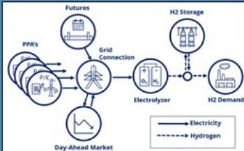
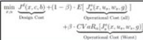
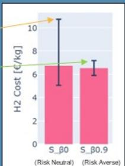
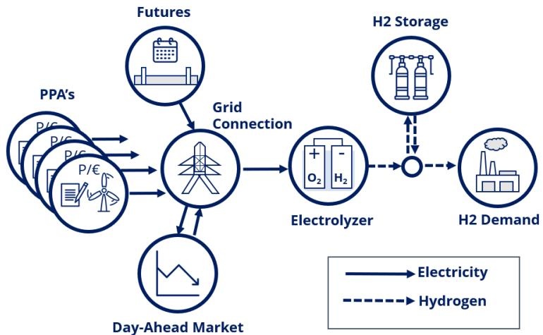
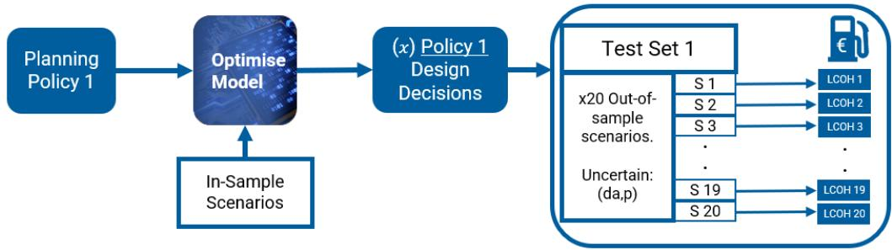
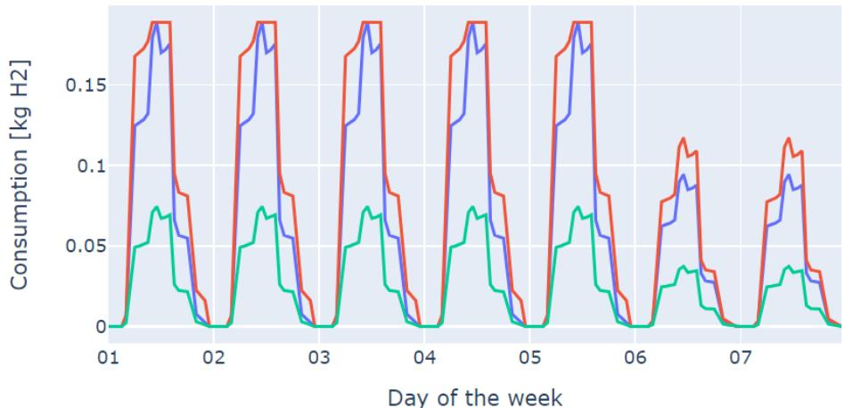
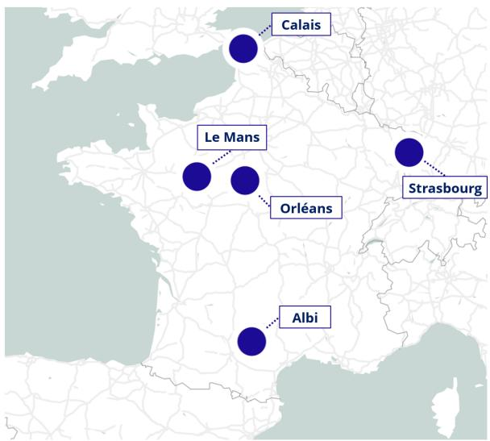
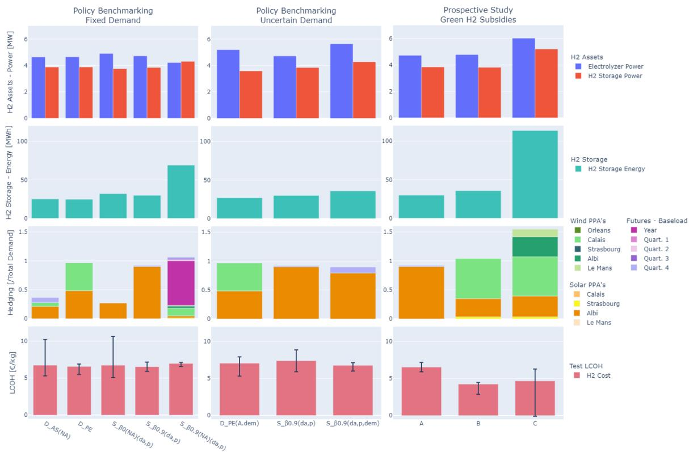
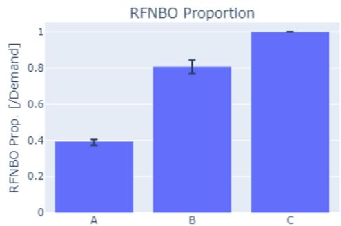

# Graphical Abstract 2 Long-term investment and energy procurement risk management under uncertainty for an electrolytic green hydrogen producer.

Owen Palmer $^ { a , b }$ , Hugo Radetb, Simon Camala, Robin Girarda

LQTG-TERM INVESTMENT AND ENERGY PROCUREMENT RISK MANAGEMENT UNDER UNCERTAINTY FOR AN ELECTROLYTIC GREEN HYDROGEN PRODUCER. O. Palmer, H. Radet, S. Camal, R. Girard

# Goal:

Examine quantitative planning methods to manage hydrogen sale costrisk using flexible equipment and energy hedging.

# Model:

2-stage stochastic capacity expansion model ofan electrolytic hydrogen producer supplying an industrial customer through a Hydrogen Purchase Agreement (HPA).

Market Focus-the producer can hedge energy procurementusing electricity futures and Power PurchaseAgreements (PPA's)

Comprehensie planning optimisation-asset sizing is optimised simultaneously along with energy procurementstrategy.

# Method:

Different planning methods (policies) are compared, examining the importance ofincluding:

Day-ahead market, Renewable Production,Demand

Which sources of uncertainty must be included in the optimisation? Is a stochastic model really necessary?

# -Risk aversion

Can risk aversion minimise the worst outcomes while maintaining good performance overall?

# -Energy arbitrage

Is limiting energy arbitrage to simplify modelling acceptable?

# -Green hydrogen subsidies

How are new green hydrogen subsidies likely to in fluence planning decisions?

High cost worst-case scenario

Lower cost worst-case scenario

#

Stochastic optimisation not necessarilyneeded uncertainty is absent.

# Demand uncertainty

leads to increased asset sizing needs and higher sale price, and should be considered carefully when defining HPA contract conditions.

Risk Aversion provides much more effective solutions than riskneutral and energyhedgingis importantfor avoiding cost overruns.

Including Energy Arbitrage in modeling provides more cost effective solutions.

Green Hydrogen Subsidies are likely to increase preferences for diversifiedrenewable PPA's.

# Highlights

Long-term investment and energy procurement risk management under uncertainty for an electrolytic green hydrogen producer.

Owen Palmer $^ { . a , b }$ , Hugo Radet $^ { b }$ , Simon Camal $\boldsymbol { a }$ , Robin Girard $^ { a }$

• Characterisation of uncertainties in renewable production, day-ahead market, and demand, in the context of electrolytic hydrogen production.   
• An energy market-focused 2-stage stochastic model of an electrolytic hydrogen production plant with co-optimisation of equipment sizing and multiple electricity hedging options.   
• Risk-averse planning methods are important for limiting the severity of high hydrogen sale prices.   
• Leaving the possibility for varying consumption in hydrogen offtake contracts necessitates stochastic modelling and potentially higher sale prices.   
• Green hydrogen subsidies are likely to promote interest in diversified PPA portfolios.

# Long-term investment and energy procurement risk management under uncertainty for an electrolytic green hydrogen producer.

Owen Palmer $^ { . a , b }$ , Hugo Radet $^ { b }$ , Simon Camal $^ { a }$ , Robin Girard $^ { a }$

$^ { a }$ Mines Paris - Centre PERSEE, $^ { b }$ Verso Energy,

# Abstract

Green hydrogen production by electrolysis is considered essential for global climate ambitions, however development of the industry is lagging behind expectations due to the perceived financial risk for individual projects. For new bilateral Hydrogen Purchase Agreements (HPA’s), green hydrogen project proponents will seek to manage operating cost risks using investment in flexible assets, and energy hedging - two sets of decisions that are usually considered separately, but are co-optimised in this study to form a comprehensive asset sizing and procurement strategy. A 2-stage market-focused stochastic program is developed to model a hydrogen producer supplying an industrial customer, including hydrogen storage, and energy hedging using Power Purchase Agreements (PPA’s) and power futures. The effects of uncertainty in renewable production, market prices, and hydrogen demand are studied. Several planning methods are tested on the model, benchmarking stochastic methods against simpler methods that are common in literature and in industry. Finally, the model is applied to several regulatory contexts discernible in the European green hydrogen classification rules (Renewable Fuel of Non-Biological Origin, RFNBO). The results show that in less complex cases, simple rule-based hedging methods can be effective, while in cases with demand uncertainty stochastic models are advantageous. The results also suggest that new green hydrogen subsidies are likely to stimulate demand for technologically and geographically diverse PPA portfolios.

Keywords: Hydrogen, renewable, energy, market, futures, stochastic, optimization, optimisation, risk, hedging, capacity, planning, uncertainty, power-to-gas, power-to-x, RFNBO, temporal correlation, Power purchase agreement, Hydrogen purchase agreement, PPA, HPA, wind, pv, solar,

# 1. Introduction

# 1.1. Context

As part of the energy transition and the fight against climate change, expanding the use of green hydrogen produced from water and renewable energy through electrolysis is considered to be a promising method of reducing emissions in many hard-to-decarbonize sectors of the economy. It may be used to replace fossil fuels as an energy vectors, as transportation fuels, and for producing reactive agents in certain industrial processes [1]. To reach its theoretical potential, the low-carbon hydrogen economy [1] requires a large amount of investment both in production facilities, and in fostering consumption use cases in industry. Development of the industry is lagging behind what is required to meet global climate ambitions due to the significant financial commitments required and the uncertainty involved in operating costs and demand growth [2].

Green hydrogen producers require long-term confidence in demand for their product to make their projects bankable and attract the necessary investment to cover the significant capital costs. The natural solution for this uncertainty is to find industrial customers willing to engage in bilateral offtake contracts, or Hydrogen Purchase Agreements (HPA’s) [3], wherein a future producer and a future consumer of hydrogen commit to exchanges of a certain quantity of hydrogen over an extended period. The producer’s motivation is therefore to find a suitable consumer to partner with.

Green hydrogen consumers require long-term confidence in competitive prices for green hydrogen. Unfortunately, production costs can vary greatly due their strong dependence on uncertain electricity procurement costs, which are dependent on variable renewable production and volatile energy market prices. As a result, for many HPA’s the hydrogen sale price is likely to be at least partially variable, rather than fully fixed. Potential consumers are unlikely to commit to a HPA if they cannot be reassured that the sale price will stay competitive over the life of the contract even in adverse energy market conditions. As such, the consumer’s motivation is to only commit to a HPA if the producer can provide evidence that the price risk is managed to an acceptable level.

The missing piece of the puzzle is therefore for potential green hydrogen producers to demonstrate their ability to maintain Levelised Cost of Hydrogen (LCOH) prices within a competitive range for the long-term, despite a strong presence of uncertainty in production costs.

  
Figure 1: Case study - H2 production model, overview diagram.

With this aim, promoters of these projects have several risk-management mechanisms at their disposal, which can be broadly categorised as asset sizing, or energy hedging. Asset sizing approaches may include oversizing of certain flexible assets (such as hydrogen storage) to allow increased utilisation of renewable sources, or to ride through market price peaks. Energy hedging is the procurement of electricity outside of the spot markets. The most commonly used hedging instruments to date being power futures (where electricity prices are locked in for block volumes with delivery at a future date) [4], and renewable Power Purchase Agreements (PPA’s) - non-standard contracts for which the most typical form (Pay-as-produced ) locks in a set price at which any and all production of a given park is bought by the consumer as it is generated [5].

Finally, noting the difficulties facing the nascent green hydrogen industry, many governments around the world have developed, or are in the process of developing subsidy schemes and incentives for green hydrogen producers. These include the Renewable Fuel of Non-Biological Origin (RFNBO) subsidy auctions in Europe [6], and the 45V tax credit in the US [7]. Eligibility for these two subsidy schemes is currently planned to include hourly timecorrelation of hydrogen production with renewable sources, and thus they are likely to impact optimal sizing and sourcing strategies.

The aim of this paper is to investigate quantitative planning methods in the context of green hydrogen production that manage risk through asset sizing and energy procurement strategies, in the context of a single price-taker producer. As such, this study borrows from existing literature in three thematic areas: (1) technico-economic analysis of hydrogen electrolysis plants, (2) capacity expansion planning under uncertainty, and (3) electricity futures trading under uncertainty,

# 1.2. Literature Gaps and Paper Objectives

A geographically broad green hydrogen feasibility study can be found in [8] comparing the attractiveness of different energy procurement modes (including PPA’s) for hydrogen production in different locations in Australia, although in a deterministic setting and without optimising capacities. The feasibility study [9] does include capacity expansion and compares several energy procurement configurations, although also in a deterministic setting. In [10] a capacity expansion model is proposed for a hydrogen refuelling station, again without the presence of uncertainty.

Solving capacity expansion decisions with the presence of uncertainty is commonly addressed by stochastic optimisation [11]. Some stochastic capacity expansion models exist in literature for hydrogen production (or similar energy-intensive industrial processes), although they generally do not take into account all of the uncertainties that are relevant for the problem studied in this paper, nor a complete set of energy sourcing methods likely to be used in this context. In [12] a stochastic capacity expansion model is proposed for electrolytic hydrogen system sizing with uncertainty in both solar production and hydrogen equipment CAPEX, although no grid/market connection is included and demand risk is not addressed. In [13], electrolysis plant and HVDC link capacities are optimised at a system level with both spot price and renewable production uncertainty, however neither demand uncertainty nor energy hedging is included. Outside the hydrogen domain, [14] proposes a capacity expansion model in the context of an industrial customer with uncertain demand and energy prices, although renewable production and energy hedging are not included. In [15] a stochastic capacity expansion model is used to optimise the market performance of a portfolio of PPA’s, although without demand uncertainty, futures hedging, or storage.

Some studies outside of the hydrogen domain address futures hedging for electro-intensive industrial consumers, however here energy hedging is studied in an operational manner, and capacity expansion is not included. A stochastic program for futures hedging for an energy intensive consumer is given in [16]. A more recent study applies a similar approach to the case of energy consumption hedging using power futures for a flexible air-separation unit [17].

One thesis that shall be considered in this study is that capacity sizing decisions affect optimal procurement decisions, and vice-versa, and so performing a comprehensive optimisation of both capacity planning and procurement strategy simultaneously is preferable. [18] is a rare example where both capacity installation and futures trading is combined, however its bi-level agent based modelling requires consequential assumptions about maximum capacities available to multiple market players, which is not appropriate for a single price-taker interested in hedging their risk.

A common feature of these aforementioned studies [16, 17, 18] is the explicit (or inherent) limitation (or suppression) of energy resale on the spot market in the model formulation. These techniques simplify analysis by removing the possibility of excessive arbitrage within the model. The term arbitrage is used in this article to refer to the procurement of energy with the express purpose of reselling that energy for profit, rather than using it to fulfil the underlying demand process [19, 18]1. In a capacity expansion risk-neutral optimisation this may result in decisions such as the installation of new generation sources to maximum allowable bounds (or the maximum allowable purchasing of energy futures) when the expected value of the revenue from the source is greater than the cost of procuring it. Modelling formulations that limit arbitrage shall be termed no-arbitrage formulations.

Another thesis that is considered in this paper is that these no-arbitrage formulations should not be used when selecting between different types of energy hedging products, as this removes necessary information for a complete view of the profile transformation cost of the hedging product (see the Supplementary Material for an explication of the profile transformation cost). An alternative approach commonly used in finance is instead to adjust the scenarios (eg. prices) so that arbitrage is arithmetically not possible, a state that is often referred to as arbitrage-free pricing [21]. A common technique for establishing arbitrage-free pricing is the construction of price-forward curves, where in their most simple form (using a risk-neutral measure), spot market scenarios are generated based on the assumption that their expectation will revert to currently known futures prices [21]. In [22] a model for dynamic futures hedging for a hydropower producer uses risk-neutral day ahead scenarios produced from known futures prices. In [23], the reverse is done: arbitrage-free futures prices are calculated based on the expectation of day ahead market simulations from two distinct spot price models, although in this case futures sales are used to hedge profit from acquired PPA’s. In practice power futures prices involve an uncertain and time-varying risk premium with respect to day-ahead prices [24, 25, 26], however modelling this premium requires making assumptions about market risk factors and their correlation to other variables that is likely to be unreliable and of limited value [22, 23]. Risk-neutral futures pricing is thus considered to be the most reliable technique for the purposes of this this article.

While noting the existence of these more complex energy hedging models, it should be noted that in industry simple rules-of-thumb are common, such as following pre-determined hedging ratios [4], and some research suggests these methods can be effective in certain contexts [27, 28]. This is the inspiration behind the definition of a heuristic risk-averse planning policy as a benchmark for the stochastic risk-averse methods proposed in this paper in Section 4.

Given the novelty of detailed green hydrogen classifications and associated subsidy schemes, literature examining their impact is scarce. To the authors’ knowledge there are no studies considering the impact of subsidies and green hydrogen eligibility rules in energy procurement strategy and capacity sizing for a single project proponent. A study examining the system level impacts of different hydrogen production time-matching and geographic configuration rules in the US is given in [29], and in [30] the effects of different hydrogen subsidies are considered at a system level in Europe.

# 1.3. Contributions

A summary of the key contributions of this paper are therefore follows:

• A characterisation of uncertainty in renewable production, day-ahead market prices, and demand, in the context of electrolytic hydrogen production.

• An energy market-focused 2-stage stochastic model of an electrolytic hydrogen production plant in the context of a HPA, with co-optimisation of plant capacities and multiple electricity sourcing options.

• A set of planning policies are defined that provide different solutions to the model, incorporating different approaches to the risk and uncertainty, and a methodology and a set of metrics for comparing their effectiveness (benchmarking) is proposed.

• A prospective analysis is carried out using the model to analyse the impact of green hydrogen classification rules on energy procurement decisions.

The structure of this paper is as follows: Section 2 provides an overview of the methodology used and the general model formulation. Section 3 describes the components of a case study project used throughout this paper, including uncertainty analysis and the mathematical model used. In Section 4, a set of planning policies are proposed for solving the model, and metrics for comparing their effectiveness are defined. Section 5 presents a benchmarking study in which the effectiveness of different planning policies are compared. In Section 6, a prospective study is carried out using the same model and methodology to analyse the impact of new green hydrogen subsidies in Europe.

  
Figure 2: Optimisation and test methodology depicted for Policy 1 and Test Set 1. To be replicated for all policies and Test Sets in the benchmarking study’s parts 1 and 2, and for each regulatory context A, B, C in the prospective study. $( d a , p )$ denotes the uncertainty included, indicating that day-ahead and production uncertainty are included in Test Set 1.

# 2. Methodology

# 2.1. Overview

The objective of the project developer is to obtain planning decisions (henceforth referred to as design decisions) that must be taken now that provide as low as possible LCOH prices on average across the life of a the project, whilst limiting the severity of LCOH price increases that may be possible in adverse conditions in the future. This will give the developer the best chance to convince a potential customer to engage in a HPA contract. These design decisions include equipment capacity sizing (for the electrolyzer, hydrogen storage, and grid connection) as well as energy hedging decisions (such as committing to PPA’s and buying electricity on the futures market).

The methodology followed for obtaining and then testing these design decisions is shown in Figure 2, and outlined as follows:

1. Define the model.   
2. Define the policy to be used to solve the model, and the uncertainties to be included in the in-sample scenario set.   
3. Use policy and the in-sample scenario set to optimise the model and obtain the design decisions of the solution.   
4. Simulate the design decisions on each scenario in the test set and obtain its performance [31].   
5. Repeat 2-4 for each policy to be studied.   
6. Compare the set of performance results for each policy using the solution comparison metrics [32].

# 2.2. Performance Metrics

The performance of a single scenario is measured by the LCOH for that scenario. The LCOH is defined as follows:

$$
L C O H _ { s } = \frac { J ^ { d } + J _ { s } ^ { o } } { M ^ { h 2 } \cdot \sum _ { h = 1 } ^ { H } w _ { s , h } ^ { h d , i n } } \quad [ \Theta / \mathrm { k g ~ H 2 } ]
$$

Where $J ^ { d }$ represents the annualised overnight costs of the design decisions, and $J _ { s } ^ { o }$ represents the net operational costs incurred for scenario $s$ due to market exchanges, PPA purchasing, demand curtailment penalties, and network charges. $w _ { s , h } ^ { h d , i n }$ represents the hydrogen demand process to be fulfilled by the model for scenario $s$ at hour $h$ using the units MWh. $M ^ { h 2 }$ is the hydrogen mass factor in $k g / M W h$ , and $H$ is the number of hour-long time steps in the scenario.

The overall performance of a solution obtained by a particular planning policy is then assessed based on its distribution of LCOH results for all scenarios in the test set. The final metrics used to asses the performance of a single policy are therefore: (a) mean LCOH across all test scenarios, and (b) worst case (highest) LCOH for a single scenario in the test set.

# 2.3. Objective Function

The same model and objective function are used for optimisation using each policy, and for testing of each policy’s solution on each test set (although in testing design decisions are fixed2).

The model is organised as a 2-stage stochastic linear program, with the design decisions $x$ as first stage decisions. The second stage ‘operational’ decisions $u _ { s , h }$ dictate the dispatching of the assets in one-hour timesteps $h$ for scenario $s$ , based on the design decisions and realisations of that scenario’s uncertain variables $w _ { s , h }$ . Power values are always given in MW with costs in €/MW, while energy values are given in MWh with costs in €/MWh.

The objective function minimises total annualised cost. The risk aversion factor $\beta$ is used to toggle the weighting between the expected value of the operational cost, and the expected value of the $\alpha$ quantile worst-case scenario(s) (obtained by using the CVaR [33] risk measure, with additional formulation details provided in the Supplementary Material):

$$
+ \beta \cdot \underbrace { C V a R _ { \alpha } [ J _ { s } ^ { o } ( x , u _ { s } , w _ { s } , g ) ] } _ { \mathrm { O p e r a t i o n a l ~ C o s t ~ ( W o r s t ) } }
$$

s.t.

$$
z _ { s , h + 1 } = f ( z _ { s , h } , x , u _ { s , h } , w _ { s , h } )
$$

$$
x \in \mathbb { X } , \quad u _ { s , h } \in \mathbb { U } _ { s , h } ( x , z _ { s , h } , w _ { s , h } )
$$

$$
\forall \quad h \in [ 1 . . H ] , \quad s \in [ 1 . . S ]
$$

This objective function formulation is similar to the one proposed in [16], but with a slight variation to ensure equal weighting between design versus operation costs, and easily adaptation to provide a number of common planning policies by changing the risk aversion parameter $\beta$ (as will be seen in Section 4).

  
Figure 3: Hydrogen demand weekly profiles. The standard demand scenario is shown in blue (unchanged throughout the year). The seasonally varying demand scenario is shown in red for spring, and green for summer.

# 3. Case Study

# 3.1. Model Components and Uncertainty

The model shown in Figure 1 represents a possible system configuration for production of green hydrogen to meet demand from a single industrial customer. Electricity used to produce the hydrogen may be procured from the day-ahead market, futures contracts, or from a selection of PPA’s.

# 3.1.1. Hydrogen Demand

A hypothetical demand for hydrogen was considered, for which the HPA specifies an exact annual consumption of 540t (18 GWh H2). Two different types of demand contracts were considered:

1. Strict contract (no demand uncertainty - standard demand profile only). 2. Flexible contract (limited demand uncertainty - standard demand profile or seasonal demand profile)

For the case of the strict contract, only the standard demand scenario is used for all in-sample and out-of-sample scenarios. For the second (flexible) contract, an element of demand uncertainty is adding the possibility of a seasonal demand scenario. In this second scenario, in addition to a fixed annual volume, the customer must still obey a strict maximum hourly limit, however daily, weekly, and monthly volumes vary in a seasonal pattern one might expect to occur for an industrial client (see Figure 3). Monthly consumption varies from a peak of $2 4 \%$ above average in March, to a low of 60% less than average in August.

For non-furniture of the required demand, a penalty of €10,000/MWh H2 is used in optimisation to strongly discourage planned use of this option, whilst for testing, curtailment is penalised at €1,000/MWh, which is commonly used as the electrical curtailment cost in other studies [34].

# 3.1.2. Hydrogen Equipment

Hydrogen is produced by an electrolyzer, passing directly by a compression stage. It may feed the demand as it is produced, or stored and delivered to the demand a later time. This model uses a simple linear efficiency to model the combined electrolyzer $^ +$ compressor component. This is an approximation of actual electrolysis dynamics which are non-linear, and include discontinuities due to minimum operating levels and run times [35].

Neither water flow limits nor water purchasing costs are taken into account.

# 3.1.3. Day-Ahead Market

Electricity price data for the French day-ahead market from 2013 to 2022 were obtained [36, 37]. These scenarios represent a range of average annual prices from 30€/MWh to 275€/MWh, with a mean of 70€/MWh.

Additional day ahead market scenarios were constructed using the historical day ahead curves as a base, and then manipulating them with respect to their yearly average price, seasonality amplitude, and daily spread. These new scenarios were constructed so that both the in-sample and the out-ofsample scenario sets have the same mean price as the original 10 years of data.

A strict separation between in-sample and out-of-sample scenarios is applied: even numbered years are used to create the in-sample scenarios, and odd-numbered years are used to create the out-of-sample scenarios.

# 3.1.4. Electricity Futures

The first instrument that can be used to hedge against high day-ahead prices are energy futures. The products modelled in this study are those with the longest maturity dates in the European market: calendar year (CAL) and quarterly products [36]. The European Energy Exchange (EEX) also offers two categories of delivery profiles: Baseload Futures, for which the quantity

<table><tr><td rowspan=1 colspan=1></td><td rowspan=1 colspan=1>ContractType</td><td rowspan=1 colspan=1>In-samplePrice(€/MWh)</td><td rowspan=1 colspan=1>Out-of-samplePrice(ε/MWh)</td><td rowspan=1 colspan=1>DeliveryStart(h$tart)</td><td rowspan=1 colspan=1>DeliveryEnd(hfnd)</td></tr><tr><td rowspan=5 colspan=1>Baseload</td><td rowspan=1 colspan=1>y</td><td rowspan=1 colspan=1>70</td><td rowspan=1 colspan=1>70</td><td rowspan=1 colspan=1>1</td><td rowspan=1 colspan=1>8760</td></tr><tr><td rowspan=1 colspan=1>q1</td><td rowspan=1 colspan=1>63</td><td rowspan=1 colspan=1>74</td><td rowspan=1 colspan=1>1</td><td rowspan=1 colspan=1>2191</td></tr><tr><td rowspan=1 colspan=1>$q2$</td><td rowspan=1 colspan=1>57</td><td rowspan=1 colspan=1>61</td><td rowspan=1 colspan=1>2191</td><td rowspan=1 colspan=1>4380</td></tr><tr><td rowspan=1 colspan=1>q3</td><td rowspan=1 colspan=1>87</td><td rowspan=1 colspan=1>65</td><td rowspan=1 colspan=1>4381</td><td rowspan=1 colspan=1>6570</td></tr><tr><td rowspan=1 colspan=1>q4</td><td rowspan=1 colspan=1>74</td><td rowspan=1 colspan=1>80</td><td rowspan=1 colspan=1>6571</td><td rowspan=1 colspan=1>8760</td></tr><tr><td rowspan=5 colspan=1>Peakload</td><td rowspan=1 colspan=1>y</td><td rowspan=1 colspan=1>77</td><td rowspan=1 colspan=1>77</td><td rowspan=1 colspan=1>1</td><td rowspan=1 colspan=1>8760</td></tr><tr><td rowspan=1 colspan=1>q1</td><td rowspan=1 colspan=1>69</td><td rowspan=1 colspan=1>81</td><td rowspan=1 colspan=1>1</td><td rowspan=1 colspan=1>2191</td></tr><tr><td rowspan=1 colspan=1>$q2</td><td rowspan=1 colspan=1>58</td><td rowspan=1 colspan=1>63</td><td rowspan=1 colspan=1>2191</td><td rowspan=1 colspan=1>4380</td></tr><tr><td rowspan=1 colspan=1>q3</td><td rowspan=1 colspan=1>94</td><td rowspan=1 colspan=1>70</td><td rowspan=1 colspan=1>4381</td><td rowspan=1 colspan=1>6570</td></tr><tr><td rowspan=1 colspan=1>q4</td><td rowspan=1 colspan=1>87</td><td rowspan=1 colspan=1>93</td><td rowspan=1 colspan=1>6571</td><td rowspan=1 colspan=1>8760</td></tr></table>

Table 1: Futures types and prices. Prices are calculated as the average price for the day-ahead market for the appropriate period across all scenarios in the in-sample set, and separately for the out-of-sample set. Peakload prices are calculated as the expectation of day ahead prices during peak hours during the same period.

of energy bought is delivered as a constant amount for every hour across the delivery period; and Peakload Futures, which provides constant power only during the hours 8am to 8pm.

In the context of long term decision making, even these long-maturity futures are only available up to three years in advance, which is clearly not sufficient for informing investment decisions for project lifetimes of up to 25 years. As such, in the context of this study, design decisions that select these products should be interpreted as a decision to employ an ongoing procurement strategy to systematically hedge consumption during the selected period as soon as these products become available, and to do so for every year of the project life. They are therefore static global hedging decisions [22].

Arbitrage-free futures prices were calculated as the average of the dayahead prices for the given delivery period in the relevant scenarios (see Table 1). Peakload futures prices are similarly calculated as the expectation of prices within peak hours within the given period.

# 3.1.5. Power Purchase Agreements (PPA’s)

The second group of energy hedging products considered is a set of renewable PPA’s. A selection of 9 PPA options was included in the model, representing 4 solar photovoltaic (PV) PPA’s and 5 wind PPA’s in different locations in metropolitan France. Data were obtained for 10 years 2013 to 2022 using the MERRA-2 dataset of Renewables Ninja [38, 39].

PPA prices are likely to have a variety of influences, such as varying profit margins, risk premiums, and of course the true Levelised Cost of Energy (LCOE) of the associated generator. In order to fix PPA prices for the model, first a worst-case LCOE for each site was calculated from the lowest yearly capacity factor (CF), as shown in Table 2. The LCOE’s were used as a guide to establish a rough ordering of PPA prices, which were then chosen arbitrarily to provide a range of reasonably competitive PPA options at levels coherent with recent average PPA prices reported for the European market (74€/MWh for solar and 100€/MWh for onshore wind [40]).

  
Figure 4: PPA locations.

A summary of capacity factors and prices for the PPA’s used is given in Table 2. Their calculated profile transformation costs for the standard demand scenario and historical day-ahead prices from 2013-2022 are also provided.

The even/odd year separation for in-sample/out-of-sample PPA production scenarios is applied as for the day-ahead scenarios.

# 3.2. Mathematical Model

The following equations form a fully-linear program of the model represented in Figure 1. The variables used are summarised in Table 4. In capacity expansion models, design decisions are sometimes made to be mixed integer decisions. In this paper, this is not the case - all design decisions are continuous within their allowed range. The objective of this study is to identify inherent dynamics in the system without imposing exogenous limitations such as minimum installation sizes.

Table 2: PPA details: capacity factors (CF) for 2013-2022, maximum LCOE in €/MWh corresponding to the worst capacity factor, price chosen arbitrarily for the case study in €/MWh, and average profile transformation cost for 2013-2022 in €/MWh (see Supplementary Material for an explanation of the profile transformation cost.   

<table><tr><td rowspan=1 colspan=2>PPA</td><td rowspan=1 colspan=1>Location</td><td rowspan=1 colspan=1>CFMin</td><td rowspan=1 colspan=1>CFMean</td><td rowspan=1 colspan=1>CFMax</td><td rowspan=1 colspan=1>MaxLCOE</td><td rowspan=1 colspan=1>ChosenPPAPrice</td><td rowspan=1 colspan=1>Profi leTransformCost</td></tr><tr><td rowspan=4 colspan=2></td><td rowspan=1 colspan=1>Le Mans</td><td rowspan=1 colspan=1>14.5%</td><td rowspan=1 colspan=1>15.0%</td><td rowspan=1 colspan=1>16.2 %</td><td rowspan=1 colspan=1>58</td><td rowspan=1 colspan=1>71</td><td rowspan=1 colspan=1>6.6</td></tr><tr><td rowspan=1 colspan=1>Calais</td><td rowspan=1 colspan=1>14.2 %</td><td rowspan=1 colspan=1>14.8 %</td><td rowspan=1 colspan=1>15.4%</td><td rowspan=1 colspan=1>59</td><td rowspan=1 colspan=1>72</td><td rowspan=1 colspan=1>7.0</td></tr><tr><td rowspan=1 colspan=1>Strasbourg</td><td rowspan=1 colspan=1>14.7 %</td><td rowspan=1 colspan=1>15.3 %</td><td rowspan=1 colspan=1>16.2%</td><td rowspan=1 colspan=1>57</td><td rowspan=1 colspan=1>68</td><td rowspan=1 colspan=1>5.5</td></tr><tr><td rowspan=1 colspan=1>Albi</td><td rowspan=1 colspan=1>16.0 %</td><td rowspan=1 colspan=1>16.8 %</td><td rowspan=1 colspan=1>17.5 %</td><td rowspan=1 colspan=1>52</td><td rowspan=1 colspan=1>66</td><td rowspan=1 colspan=1>5.6</td></tr><tr><td rowspan=5 colspan=2></td><td rowspan=1 colspan=1>Orleans</td><td rowspan=1 colspan=1>25.5%</td><td rowspan=1 colspan=1>27.7 %</td><td rowspan=1 colspan=1>31.4 %</td><td rowspan=1 colspan=1>54</td><td rowspan=1 colspan=1>70</td><td rowspan=1 colspan=1>13.4</td></tr><tr><td rowspan=1 colspan=1>Le Mans</td><td rowspan=1 colspan=1>27.1 %</td><td rowspan=1 colspan=1>29.3%</td><td rowspan=1 colspan=1>32.7 %</td><td rowspan=1 colspan=1>51</td><td rowspan=1 colspan=1>69</td><td rowspan=1 colspan=1>12.6</td></tr><tr><td rowspan=1 colspan=1>Calais</td><td rowspan=1 colspan=1>40.9 %</td><td rowspan=1 colspan=1>42.7 %</td><td rowspan=1 colspan=1>46.5 %</td><td rowspan=1 colspan=1>34</td><td rowspan=1 colspan=1>65</td><td rowspan=1 colspan=1>12.2</td></tr><tr><td rowspan=1 colspan=1>Strasbourg</td><td rowspan=1 colspan=1>15.1%</td><td rowspan=1 colspan=1>16.9%</td><td rowspan=1 colspan=1>19.5%</td><td rowspan=1 colspan=1>92</td><td rowspan=1 colspan=1>80</td><td rowspan=1 colspan=1>13.4</td></tr><tr><td rowspan=1 colspan=1></td><td rowspan=1 colspan=1>Albi</td><td rowspan=1 colspan=1>24.6 %</td><td rowspan=1 colspan=1>25.8 %</td><td rowspan=1 colspan=1>26.5 %</td><td rowspan=1 colspan=1>56</td><td rowspan=1 colspan=1>78</td><td rowspan=1 colspan=1>10.9</td></tr></table>

<table><tr><td colspan="4">Case Study Parameters</td></tr><tr><td>Electrolyzer +</td><td>Combined CAPEX</td><td>1.7 M</td><td>€/MW (Elec)</td></tr><tr><td>Compressor</td><td>Combined Eficiency</td><td>56%</td><td>MWh (H2) / MWh (Elec)</td></tr><tr><td></td><td>Lifetime</td><td>13</td><td>Years</td></tr><tr><td>H2 Storage</td><td>CAPEX (Energy)</td><td>75k</td><td>€/MWh</td></tr><tr><td></td><td>CAPEX (Power)</td><td>50k</td><td>ε/MW</td></tr><tr><td></td><td>Energy Eficiency</td><td>100%</td><td></td></tr><tr><td></td><td>Power Eficiency</td><td>100%</td><td></td></tr><tr><td></td><td>Usable Capacity</td><td>100%</td><td></td></tr><tr><td></td><td>Intial SOC</td><td>50%</td><td></td></tr><tr><td></td><td>Lifetime</td><td>25</td><td>Years</td></tr><tr><td>Network Connection</td><td>CAPEX</td><td>75k</td><td>€/MW</td></tr><tr><td></td><td>Lifetime</td><td>25</td><td>Years</td></tr><tr><td>Project</td><td>Discount Rate</td><td>5%</td><td></td></tr><tr><td>(Global Parameters)</td><td>Lifetime</td><td>25</td><td>Years</td></tr><tr><td></td><td>H2 Energy Density</td><td>33.33</td><td>kg H2 / MWh H2</td></tr><tr><td></td><td>Demand Curtailment Penalty</td><td>1,000</td><td>ε/MWh</td></tr></table>

Table 3: Case study - common parameters.

<table><tr><td colspan="4">Notation</td></tr><tr><td colspan="4">Indices</td></tr><tr><td>S</td><td>Scenario index</td><td>nez</td><td>Electrolyser + Compressor energy conversion</td></tr><tr><td>h</td><td>Hour of the year index</td><td>nhs−p,in</td><td>eficiency (MWh H2 / MWh elec)</td></tr><tr><td>i</td><td>Network access charge time-slot index</td><td></td><td>Hydrogen storage input power</td></tr><tr><td>q</td><td>Futures delivery period index</td><td></td><td>efficiency (MW H2 stored / MW H2 input)</td></tr><tr><td>a</td><td>PPA contract index</td><td>ηhs−p,out</td><td>Hydrogen storage discharge power efficiency (MW H2 output / MW H2 discharged)</td></tr><tr><td colspan="4"></td></tr><tr><td>Design Decisions xez−p</td><td></td><td>ηhs−e</td><td>Hydrogen storage energy efficiency</td></tr><tr><td>xhs−e</td><td>Electrolyser power (MW elec) Hydrogen storage energy (MWh H2)</td><td></td><td>(MWh H2 retained / MWh H2 original / hour)</td></tr><tr><td colspan="4"></td></tr><tr><td>xhs−p xnw −p</td><td>Hydrogen storage power (MW H2)</td><td>Cost Parameters</td><td></td></tr><tr><td>xBaF−e,q</td><td>Network connection power (Mw)</td><td>Cez</td><td>Annualised Electrolyser CAPEX (€/MW elec/year)</td></tr><tr><td></td><td>Baseload futures, purchased energy</td><td>Chs−e</td><td>Annualised Hydrogen Storage Energy</td></tr><tr><td>xPkF−e,q</td><td>for period q (MWh)</td><td>Chs−p</td><td>CAPEX (∈/MWh H2/year)</td></tr><tr><td></td><td>Peakload futures, purchased energy</td><td></td><td>Annualised Hydrogen Storage Power</td></tr><tr><td>xnw,i</td><td>for period q (MWh)</td><td>Cnw−p</td><td>CAPEX (€/MW H2/year)</td></tr><tr><td></td><td>Network access power subscription</td><td></td><td>Annualised Network Connection Power</td></tr><tr><td></td><td>for time-slot i (MW)</td><td></td><td>CAPEX (∈/MW/year)</td></tr><tr><td>xppa−p, a</td><td>PPA peak power contracted for park a (MWp)</td><td>CBaF−e,q</td><td>Baseload futures price for period q (@/MWh)</td></tr><tr><td></td><td></td><td>CPkF−e,q Bnw,i</td><td>Peakload futures price for period q (@/MWh) Network power subscription cost</td></tr><tr><td colspan="4">Operational Decisions (at hour h of scenario s)</td></tr><tr><td></td><td>Energy bought on the day-ahead market (MWh)</td><td></td><td>for time-slot i (€/MW/year)</td></tr><tr><td></td><td>Energy sold on the day-ahead market (MWh)</td><td>GPpa−e,a</td><td>PPA energy cost for park a (€/MWh)</td></tr><tr><td></td><td>Electrolyser dispatching (MW elec)</td><td>Ghd-curt</td><td>Hydrogen demand curtailement penalty (€/MWh H2)</td></tr><tr><td></td><td>Hydrogen storage input (MW H2)</td><td>Gr-e</td><td>Green hydrogen (RFNBO) subsidy (@/MWh H2)</td></tr><tr><td colspan="4"></td></tr><tr><td>uppa,curt,a s ,h</td><td>PPA dispatched power for park a (MW)</td><td></td><td></td></tr><tr><td></td><td>PPA curtailed power for park a (MW)</td><td>Design Bounds Xez−p</td><td></td></tr><tr><td>s , h</td><td>Hydrogen demand fulfilled (MW H2)</td><td></td><td>Electrolyser power upper bound (MW elec)</td></tr><tr><td></td><td>Hydrogen demand unmet (curtailed)</td><td>Xhs−e</td><td>Hydrogen storage energy upper bound (MWh H2)</td></tr><tr><td></td><td>(MW H2)</td><td>Xhs−p</td><td>Hydrogen storage power upper bound (MW H2)</td></tr><tr><td>u n,h</td><td>Power transferred to the site</td><td>Xnω−p</td><td>Network connection power upper bound (Mw)</td></tr><tr><td></td><td>from the network (MW)</td><td>X BaF−e,q</td><td>Baseload futures, purchased energy</td></tr><tr><td>δs,h</td><td>Subsidy-eligible hydrogen</td><td>X PkF−e,q</td><td>for period q upper bound (MWh)</td></tr><tr><td></td><td>produced (MWh H2)</td><td></td><td>Peakload futures, purchased energy</td></tr><tr><td></td><td></td><td>Xn,i</td><td>for period q upper bound (MWh)</td></tr><tr><td></td><td>Operational States (at hour h of scenario s)</td><td></td><td>Network access power subscription</td></tr><tr><td>$ h</td><td>Hydrogen storage state-of-charge (MWh H2)</td><td>Xppa−p,a</td><td>for time-slot i upper bound (Mw)</td></tr><tr><td></td><td></td><td></td><td>PPA peak power contracted for park a upper bound (Mwp)</td></tr><tr><td colspan="4">Operational Uncertain Parameters (at hour h of scenario s)</td></tr><tr><td>d</td><td>Day-ahead market price (@/MWh)</td><td></td><td></td></tr><tr><td>wppa,a s,h</td><td>PPA availability factor (% of peak power)</td><td>Objective Function Paramaters</td><td></td></tr><tr><td>hd, in</td><td>Hydrogen offtaker demand (MW H2)</td><td>α</td><td>CVaR quantile setting [0:1)</td></tr><tr><td></td><td></td><td>β</td><td>Risk aversion weighting [0:1]</td></tr></table>

Table 4: Mathematical notation used. The designations $p$ and $e$ denote power and energy values respectively.

For each scenario $s$ , operational (second stage) uncertainties are revealed (day ahead price $\boldsymbol { w _ { s , h } ^ { d a } }$ , PPA production $w _ { s , h } ^ { p p a , a }$ and hydrogen demand $w _ { s , h } ^ { h d , i n }$ ), and the dispatching of assets is solved deterministically.

# 3.2.1. Design Decision Bound Constraints

The following constraints impose the design decision upper bounds contained in the vector $X$ , which may represent limited availability of contracts, limited space to install physical assets, limited network capacity, etc:

$$
\begin{array} { r l } & { 0 \leq x ^ { a c - p } \leq X ^ { a c - p } } \\ & { 0 \leq x ^ { b s - c } } \\ & { 0 \leq x ^ { b s - p } \leq X ^ { b s - p } } \\ & { 0 \leq x ^ { a s - p } \leq X ^ { n s - p } } \\ & { 0 \leq x ^ { n s - p } \leq X ^ { n s - p } } \\ & { 0 \leq x ^ { B a r - c , q } \leq X ^ { B a r - c , q } } \\ & { 0 \leq x ^ { p k - c , q } \leq X ^ { p k - c , q } } \\ & { \forall \quad q \in \mathbb { Q } } \\ & { 0 \leq x ^ { p n - p , a } \leq X ^ { p n - p , a } } \\ & { \forall \quad q \in \mathbb { A } } \end{array}
$$

Upper bounds are never reached for any design decision in this paper.

# 3.2.2. Operational Decision Limit Constraints

The operational decisions $u$ and storage state of charge $z ^ { h s }$ are limited by the following constraints for all $h \in [ 1 . . H ]$ , and all $s \in [ 1 . . S ]$ :

$$
\begin{array} { r l } & { 0 \leq u _ { s , h } ^ { e z , i n } \leq x ^ { e z - p } } \\ & { 0 \leq u _ { s , h } ^ { h s , i n } \leq x ^ { h s - p } } \\ & { 0 \leq u _ { s , h } ^ { h s , o u t } \leq x ^ { h s - p } } \\ & { 0 \leq u _ { s , h } ^ { n w } \leq x ^ { h s - p } } \\ & { 0 \leq u _ { s , h } ^ { h d , i n } \leq w _ { s , h } ^ { h d } } \\ & { 0 \leq u _ { s , h } ^ { h d , c u r t } \leq w _ { s , h } ^ { h d } } \\ & { 0 \leq u _ { s , h } ^ { h d , c u r t } \leq w _ { s , h } ^ { h d } } \end{array}
$$

$$
\begin{array} { r l } & { 0 \leq u _ { s , h } ^ { p p a , a , o u t } \leq w _ { s , h } ^ { p p a , a } } \\ & { 0 \leq u _ { s , h } ^ { p p a , a , c u r t } \leq w _ { s , h } ^ { p p a , a } } \\ & { \forall a \in \mathbb { A } } \end{array}
$$

$$
0 \leq z _ { s , h } ^ { h s } \leq x ^ { h s - e }
$$

# 3.2.3. Energy Flux Constraints

The following operational constraints ensure an energy balance at each node for all $h \in \left[ 1 . . H \right]$ and all $s$ in [1..S]:

Hydrogen Balance Constraint

The electrolyzer is modelled as a single linear efficiency $\eta ^ { e z }$ . The energy balance at the hydrogen node is given as:

$$
u _ { s , h } ^ { e z , i n } \cdot \eta ^ { e z } + u _ { s , h } ^ { h s , o u t } = u _ { s , h } ^ { h s , i n } + w _ { s , h } ^ { h d , i n } - u _ { s , h } ^ { h d , c u r t }
$$

Electricity Balance Constraint

Next, electricity delivered to the electrolyzer is transferred across the connection to the larger network:

$$
u _ { s , h } ^ { n w } = u _ { s , h } ^ { e z , i n }
$$

Market Balance Constraint

Within the larger network, a balanced energy market perimeter is assumed (ie.

energy bought is balanced with energy used and sold):

$$
\begin{array} { r l r } {  { u _ { s , h } ^ { d a , o u t } + \sum _ { a = 1 } ^ { A } u _ { s , h } ^ { p a , o u t , a } } } \\ & { } & { + \sum _ { q \in \mathbb { Q } } m _ { h } ^ { q } \cdot \{ x ^ { B a F - e , q } / H _ { q } + p _ { h } \cdot x ^ { P k F - e , q } / ( H _ { q } / 2 ) \} } \\ & { } & { \quad \quad \quad \quad \quad \quad \quad \quad \quad = u _ { s , h } ^ { d a , i n } + u _ { s , h } ^ { n w } } \\ & { } & { \quad \mathrm { w h e r e } \quad p _ { h } = { \bf 1 } _ { \{ 8 \leq h \mathrm { m o d } 2 4 < 2 0 \} } } \\ & { } & { \quad \quad \quad \mathrm { a n d ~ } m _ { h } ^ { q } = { \bf 1 } _ { \{ H _ { e a n } ^ { q } \leq h \leq H _ { e n d } ^ { q } \} } . } \end{array}
$$

The unit function $p _ { h }$ activates Peakload Futures purchases only during the hours 8am to 8pm, and similarly, the unit function $m _ { h } ^ { q }$ ensures that futures product $q$ is only activated during its delivery period (see Table 1).

# PPA Internal Balance Constraint

PPA production can also be curtailed (it is assumed that the respective park is able to curtail its production in the case of negative day-ahead prices, for example):

$$
\begin{array} { r l } & { u _ { s , h } ^ { p p a , o u t , a } = w _ { s , h } ^ { p p a , a } \cdot x ^ { p p a - p , a } - u _ { s , h } ^ { p p a , c u r t , a } } \\ & { \forall \quad a \in \mathbb { A } . } \end{array}
$$

Note that any curtailed energy is still ’paid-for’ in the operational cost, thus the formulation is akin to a take-or-pay type PPA.

Storage State-of-charge

The hydrogen storage unit state-of-charge is modelled with the following state constraint:

$$
z _ { s , h + 1 } ^ { h s } = z _ { s , h } ^ { h s } \cdot ( 1 - \eta ^ { h s - e } ) + ( \eta ^ { h s - p , i n } \cdot u _ { s , h } ^ { h s , i n } - \frac { u _ { s , h } ^ { h s , o u t } } { \eta ^ { h s - p , o u t } } )
$$

The charging and discharging efficiencies are given by $\eta ^ { h s - p , i n }$ and $\eta ^ { h s - p , o u t }$ , and $\eta ^ { h s - e }$ is the energy storage auto-discharge loss rate per hour.

# 3.2.4. Green Hydrogen Subsidies

Green hydrogen subsidies are assumed to be only obtainable with the use of hour-by-hour temporally correlated renewable power (in the context of this study, this means power originating from renewable PPA’s). $\delta _ { s , h }$ is the certified-green quantity of hydrogen produced in MWh at hour $h$ and scenario $s$ .

$$
\begin{array} { l } { \delta _ { s , h } \leq ( \displaystyle \sum _ { a \in \mathbb { A } } u _ { s , h } ^ { p p a , o u t , a } ) \cdot \eta ^ { e z } } \\ { \delta _ { s , h } \leq u _ { s , h } ^ { e z , i n } \cdot \eta ^ { e z } } \\ { \forall \quad h \in [ 1 . . H ] , \quad s \in [ 1 . . S ] } \end{array}
$$

# 3.2.5. No-Arbitrage (NA) Constraint

When a non-arbitrage (NA) formulation is used for a particular planning policy, an additional constraint is added which eliminates resale of excess energy on the day-ahead market:

$$
u _ { s , h } ^ { d a , i n } = 0
$$

Energy resale is always allowed for testing (ie. Equation (30) does not apply in out-of-sample testing for any policy).

# 3.2.6. Design Costs

The design decisions attract design costs based on their respective price parameters in the vector $C$ .

$$
\begin{array} { r l } { J ^ { d } ( x , C , B ) } & { { } = x ^ { e z - p } \cdot C ^ { e z - p } + x ^ { h s - e } \cdot C ^ { h s - e } } \\ { } & { { } ~ + x ^ { h s - p } \cdot C ^ { h s - p } + x ^ { n w - p } \cdot C ^ { n w - p } } \\ { } & { { } ~ + \displaystyle \sum _ { q \in \mathbb { Q } } \{ x ^ { B a F - e , q } \cdot C ^ { B a F - e , q } + x ^ { P k F - e , q } \cdot C ^ { P k F - e , q } \} } \\ { } & { { } ~ + J ^ { d , n w } ( x , B ) } \end{array}
$$

Network access design charges $J ^ { d , n w } ( x , B )$ are defined as a linear function of the design decisions and network access cost parameters $B$ (additional details of the network access charge regime used are provided in the Supplementary Material).

CAPEX costs are annualised using the following formula, where $L T ^ { k }$ is the lifetime of asset $k$ and $\tau$ is the discount rate:

$$
C ^ { k } = C A P E X ^ { k } \cdot { \frac { \tau \cdot ( \tau + 1 ) ^ { L T ^ { k } } } { ( \tau + 1 ) ^ { L T ^ { k } } - 1 } }
$$

# 3.2.7. Operational Costs

Operational Costs are the net sum of revenues and costs on the day ahead market, power purchased from PPA contracts, penalties paid for non-served demand, network access energy costs, and green hydrogen subsidies.

Fixed parameters relating to operational costs include $G ^ { p p a - e , a }$ the energy cost for each PPA , the cost of penalties for curtailed hydrogen demand with the flat cost $G ^ { h d - c u r t }$ , network access time-of-use energy charges with the cost vector $G _ { h } ^ { n w - e }$ and the flat-rate green hydrogen subsidy

$$
J _ { s } ^ { o } ( x , u _ { s } , w _ { s } , G ) = \sum _ { h = 1 } ^ { H } \left\{ \begin{array} { l } { ( u _ { s , h } ^ { d a , o u t } - u _ { s , h } ^ { d a , i n } ) \cdot w _ { s , h } ^ { d a } } \\ { + \sum _ { a \in \mathbb { A } } \{ x ^ { p p a - p , a } \cdot w _ { s , h } ^ { p p a - p , a } \cdot G ^ { p p a - e , a } \} } \\ { + u _ { s , h } ^ { h d , c u r t } \cdot G ^ { h d - c u r t } + u _ { s , h } ^ { n w } \cdot G _ { h } ^ { n w - e } - \delta _ { s , h } \cdot G ^ { r - e } } \end{array} \right\}
$$

Hydrogen subsidies are not included in the policy benchmarking study (ie. $G ^ { r - e } = 0$ in Equation (33) for Section 5).

Table 5: Planning policy characteristics.   

<table><tr><td>Policy</td><td>Type</td><td>Risk Appetite</td><td>(β)</td><td>No-Arbitrage Formulation</td></tr><tr><td>1. D_AS(N A)</td><td>Deterministic</td><td>Neutral</td><td>*</td><td>Yes</td></tr><tr><td>2.D_PE</td><td>Deterministic/Rule-based</td><td>Averse</td><td>*</td><td>No</td></tr><tr><td>3. S−β0(NA)</td><td>Stochastic</td><td>Neutral</td><td>0</td><td>Yes</td></tr><tr><td>4.S_β0.9</td><td>Stochastic</td><td>Averse</td><td>0.9</td><td>No</td></tr><tr><td>5. S_β0.9(NA)</td><td>Stochastic</td><td>Averse</td><td>0.9</td><td>Yes</td></tr></table>

# 4. Planning Policies

# 4.1. Overview

This paper seeks to compare several planning policies [41] common in industry and academic literature for obtaining a solution to the model, as defined in the following section and summarised in Table 5.

# 4.2. Definitions

1. Average Scenario Policy $( D _ { - } A S ( N A ) )$

The reference case risk-neutral policy. A deterministic solution of the model with one input scenario representing an average case for the day-ahead market. The no-arbitrage formulation is applied (Equation (30) is active).

# 2. Pessimistic Expert Policy $( D _ { - } P E )$

A rule-based policy which can be considered to be a simple risk-averse policy: the total yearly hydrogen demand (electrical equivalent, 34 GWh), is procured using the least-cost PPA options. It is assumed the expert believes diversity to be important, and so acquires 50% of the required yearly production from a low-cost solar PPA and the remaining 50% from a low-cost wind PPA. This calculation is done using the average capacity factor of each park. The remaining design decisions of equipment sizing are made in a deterministic setting similarly to the Average Scenario Policy.

# 3. Stochastic Risk-Neutral Policy $( S _ { - } \beta 0 ( N A )$ )

A risk-neutral 2-stage stochastic program. Operational costs of each in-sample scenario have equal weighting (risk aversion weighting $\beta$ in Equation (2) is set to 0). The no-arbitrage formulation is applied (Equation (30) is active).

4. Stochastic Risk-Averse Policy (S β0.9)

A risk-averse 2-stage stochastic program, where the expected value of the operational costs and the operational cost of the worst-case scenario are given weightings of $1 0 \%$ and 90% respectively (risk aversion weighting $\beta$ in Equation (2) is set to 0.9).

5. Stochastic Risk-Averse No-Arbitrage Policy $( S _ { - } \beta 0 . 9 ( N A ) ,$ ) The same risk-averse policy with as the precedent, but with the no-arbitrage formulation applied (Equation (30) is active).

# 4.3. Solution Notation

To identify which sources of uncertainty have been included in the in-sample scenarios for a given optimisation the following suffixes are used: (da) for dayahead market, (p) for renewable production, and (dem) for demand.

For example, $S _ { - } \beta 0 . 9 ( d a , p )$ denotes a solution obtained using policy $S _ { - } \beta 0 . 9$ with day-ahead and renewable production uncertainty included in the in-sample scenarios, whereas $S _ { - } \beta 0 . 9 ( d a , p , d e m )$ denotes a solution of the same policy obtained with day-ahead, renewable production, and demand uncertainty included in the in-sample scenarios.

# 4.4. Policy Comparison Metrics

The classic metric, theValue of the Stochastic Solution (VSS, [32]) is defined as the difference in performance between a deterministic model, and its stochastic equivalent (typically on expected value). In the context of this study, avoiding bad outcomes is considered important, and so the measure is also applied to worst-case scenario results. In addition, three other similar metrics are proposed:

The Value of the Risk-Averse Solution (VRAS) is defined as the proportional difference in performance of a risk-neutral solution with its risk-averse equivalent.

The Value of the Arbitrage-Enabled Solution (VAES) is defined as the proportional difference in performance between solutions optimised using a no-arbitrage formulation, and solutions optimised with unlimited possibility for resale (arbitrageenabled).

The Value of the Stochastic Demand Solution (VS-Dem) used in Section 5.2, is defined as the proportional difference in performance between solutions optimised without demand uncertainty included in the in-sample scenarios, and solutions optimised with demand uncertainty included.

Table 6: Asset sizing decisions.   

<table><tr><td rowspan=1 colspan=1>Policy</td><td rowspan=1 colspan=1>ElectrolyzerCapacity(MW)</td><td rowspan=1 colspan=1>H2 StoragePower(MW)</td><td rowspan=1 colspan=1>H2 StorageEnergy(MWh)</td></tr><tr><td rowspan=1 colspan=1>D_AS(N A)</td><td rowspan=1 colspan=1>4.6</td><td rowspan=1 colspan=1>3.9</td><td rowspan=1 colspan=1>25.2</td></tr><tr><td rowspan=1 colspan=1>D_PE</td><td rowspan=1 colspan=1>4.6</td><td rowspan=1 colspan=1>3.9</td><td rowspan=1 colspan=1>24.8</td></tr><tr><td rowspan=1 colspan=1>S−β0(N A)(da, p)</td><td rowspan=1 colspan=1>4.9</td><td rowspan=1 colspan=1>3.7</td><td rowspan=1 colspan=1>32.1</td></tr><tr><td rowspan=1 colspan=1>S−β0.9(da, p)</td><td rowspan=1 colspan=1>4.7</td><td rowspan=1 colspan=1>3.8</td><td rowspan=1 colspan=1>29.9</td></tr><tr><td rowspan=1 colspan=1>S −β0.9(N A)(da, p)</td><td rowspan=1 colspan=1>4.2</td><td rowspan=1 colspan=1>4.3</td><td rowspan=1 colspan=1>69.1</td></tr><tr><td rowspan=1 colspan=1>DPE(A.dem)</td><td rowspan=1 colspan=1>5.2</td><td rowspan=1 colspan=1>3.6</td><td rowspan=1 colspan=1>27.0</td></tr><tr><td rowspan=1 colspan=1>S_β0.9(da, p, dem)</td><td rowspan=1 colspan=1>5.6</td><td rowspan=1 colspan=1>4.3</td><td rowspan=1 colspan=1>35.9</td></tr></table>

# 5. Policy Benchmarking Study

5.1. Part 1: Strict Hydrogen Purchase Agreement

# 5.1.1. Test Set-Up Overview

A policy comparison is first carried out assuming an offtake contract with strict conditions where the customer is not allowed to vary their consumption profile. Each policy in Section 4.2 was optimised on the appropriate standard demand in-sample set: x1 scenario for policies 1 and 2, and x10 scenarios for policies 3-5. They are then tested on the first out-of-sample set (Test Set 1) which also only uses the standard demand profile. The design decisions for capacity sizing are given in Table 6, hedging decisions in Table 7, and test results in Table 8. The results are summarised in Figure 5 (left column).

# 5.1.2. Results and Discussion

The cheapest solar PPA (Albi) is the most prominent PPA selected, despite being 1€/MWh more expensive than the Calais wind PPA. This can be explained by its much lower profile transformation cost (see the right hand column of Table 2).

Low solar production during winter is compensated for by several policies by opting to hedge using a modest baseload futures purchase in the fourth quarter of the year.

As expected, the risk-averse policies $D _ { - } P E$ , $S _ { - } \beta 0 . 9 ( d a , p )$ , and $S _ { - } \beta 0 . 9 ( N A ) ( d a , p )$ look to avoid high day-ahead market price exposure, and so opt for significantly greater hedging ratios than the risk-neutral policies $D _ { - } A S ( N A )$ and $S _ { - } \beta 0 ( N A ) ( d a , p )$

The risk-averse no-arbitrage policy $S _ { - } \beta 0 . 9 ( N A )$ takes a markedly different strategy for hedging to the other policies, opting for almost exclusively baseload futures rather than PPA’s. We can also see that this change in procurement strategy is heavily related to the hydrogen equipment decisions: its smaller electrolyser sizing leads to increased utilisation (a load factor of 93% as opposed to 83% for the other policies) and reduces electrolyser CAPEX, although it approximately doubles the storage capacity in order to use hydrogen produced during the night to ride through daily peak demand. This illustrates that different procurement strategies necessitate different equipment sizing decisions, and the need for co-optimisation of these decisions.

Table 7: Policy benchmarking study - Energy hedging decisions. BL=Baseload, PL=Peakload. Hedge ratio is the proportion of energy procurement from PPA’s and futures (on expected value for the in-sample scenarios) with respect to total yearly electricity demand.   

<table><tr><td rowspan=2 colspan=1>Policy</td><td rowspan=1 colspan=2>Contracted PPA&#x27;s (MWp)</td><td rowspan=2 colspan=1>Futures Purchasing(GWh)</td><td rowspan=2 colspan=1>HedgeRatio</td></tr><tr><td rowspan=1 colspan=1>Total</td><td rowspan=1 colspan=1>Selected Parks</td></tr><tr><td rowspan=2 colspan=1>D_AS(N A)</td><td rowspan=1 colspan=1>Solar: 5.2</td><td rowspan=1 colspan=1>5.2 (Albi)</td><td rowspan=1 colspan=1>BL: 2.9 (q4)</td><td rowspan=2 colspan=1>0.36</td></tr><tr><td rowspan=1 colspan=1>Wind: 0.62</td><td rowspan=1 colspan=1>0.62 (Calais)</td><td rowspan=1 colspan=1>PL:</td></tr><tr><td rowspan=2 colspan=1>D.PE</td><td rowspan=1 colspan=1>Solar: 11.9</td><td rowspan=1 colspan=1>11.9 (Albi)</td><td rowspan=1 colspan=1>BL:</td><td rowspan=2 colspan=1>0.97</td></tr><tr><td rowspan=1 colspan=1>Wind: 4.6</td><td rowspan=1 colspan=1>4.6 (Calais)</td><td rowspan=1 colspan=1>PL:</td></tr><tr><td rowspan=2 colspan=1>S−β0(NA)(da,p)</td><td rowspan=1 colspan=1>Solar: 6.5</td><td rowspan=1 colspan=1>6.5 (Albi)</td><td rowspan=1 colspan=1>BL:</td><td rowspan=2 colspan=1>0.28</td></tr><tr><td rowspan=1 colspan=1>Wind:</td><td rowspan=1 colspan=1></td><td rowspan=1 colspan=1>PL:</td></tr><tr><td rowspan=2 colspan=1>S−β0.9(da, p)</td><td rowspan=1 colspan=1>Solar: 21.2</td><td rowspan=1 colspan=1>21.2 (Albi)</td><td rowspan=1 colspan=1>BL: 0.5 (q4)</td><td rowspan=2 colspan=1>0.92</td></tr><tr><td rowspan=1 colspan=1>Wind:</td><td rowspan=1 colspan=1></td><td rowspan=1 colspan=1>PL:</td></tr><tr><td rowspan=2 colspan=1>S−β0.9(N A)(da, p)</td><td rowspan=1 colspan=1>Solar: 0.9</td><td rowspan=1 colspan=1>0.6 (Albi) ; 0.3 (Strasbourg)</td><td rowspan=1 colspan=1>BL: 26.6 (y)0.7 (q2); 0.8 (q3); 0.7 (q4)</td><td rowspan=2 colspan=1>1.06</td></tr><tr><td rowspan=1 colspan=1>Wind: 1.6</td><td rowspan=1 colspan=1>1.1 (Calais) ; 0.1 (Le Mans)0.4 (Albi)</td><td rowspan=1 colspan=1>PL:</td></tr><tr><td rowspan=2 colspan=1>D_PE(A.dem)</td><td rowspan=1 colspan=1>Solar: 11.9</td><td rowspan=1 colspan=1>11.9 (Albi)</td><td rowspan=1 colspan=1>BL:</td><td rowspan=2 colspan=1>0.97</td></tr><tr><td rowspan=1 colspan=1>Wind: 4.6</td><td rowspan=1 colspan=1>4.6 (Calais)</td><td rowspan=1 colspan=1>PL:</td></tr><tr><td rowspan=2 colspan=1>S−β0.9(da, p, dem)</td><td rowspan=1 colspan=1>Solar: 18.8</td><td rowspan=1 colspan=1>18.8 (Albi)</td><td rowspan=1 colspan=1>BL: 3.4 (q4)</td><td rowspan=2 colspan=1>0.90</td></tr><tr><td rowspan=1 colspan=1>Wind:</td><td rowspan=1 colspan=1></td><td rowspan=1 colspan=1>PL:</td></tr></table>

  
Figure 5: (Top row) electrolyzer and hydrogen storage power decisions; (Second row) H2 storage installed energy capacity; (Third row) futures and PPA hedging decisions (on average for in-sample scenarios); (Bottom row) Test LCOH results. Bars indicate mean values across all scenarios. Whiskers indicate maximum and minimum scenario LCOH. First column shows results for the policy benchmarking study Part 1: Strict Hydrogen Purchase Agreement and Test Set 1. Second column shows results for the policy benchmarking study Part 2: Flexible Hydrogen Purchase Agreement and Test Set 2. Third column show results for the green hydrogen prospective study for context’s A, B and C. and testing on Test Set 1.

Table 8: Test Set 1 Results   

<table><tr><td colspan="3">Test Set 1 Results</td></tr><tr><td>LCOH (€/kg)</td><td>Mean</td><td>Worst</td></tr><tr><td>D_AS(N A) D_PE</td><td>6.75 6.57</td><td>10.22 6.91</td></tr><tr><td>S−β0(N A)(da, p)</td><td>6.74</td><td>10.65</td></tr><tr><td>S−β0.9(da, p)</td><td>6.54</td><td>7.17</td></tr><tr><td>S−β0.9(N A)(da, p)</td><td>6.98</td><td>7.12</td></tr><tr><td></td><td></td><td></td></tr><tr><td>Policy Comparison Metrics VSS (Risk Neutral)</td><td>Mean</td><td>Worst</td></tr><tr><td>[D_AS(NA) - S−β0(NA)(da,p)] VSS (Risk Averse)</td><td>0.1 %</td><td>-4.2%</td></tr><tr><td>[D_PE - S−β0.9(da, p)] VRAS (Deterministic)</td><td>0.5%</td><td>-3.8%</td></tr><tr><td>[D_AS(NA) - D_PE] VRAS (Stochastic)</td><td>2.7%</td><td>32.4%</td></tr><tr><td>[S−β0(NA)(da,p) − S−β0.9(da, p)]</td><td>3.0%</td><td>32.7 %</td></tr><tr><td>VAES [S_β0.9(NA)(da,p) - S−β0.9(da, p)]</td><td>6.3%</td><td>-0.7%</td></tr></table>

Policy Performance

As was the case in [28], the low VSS indicates little to no value is obtained using a stochastic model in the absence of demand uncertainty.

On the other hand, with the very significant VRAS, the advantage of the riskaverse policies with respect to the risk-neutral policies is clear. The stochastic risk averse policy $S _ { - } \beta 0 . 9 ( d a , p )$ improves the mean performance of the risk-neutral $S _ { - } \beta 0 ( d a , p )$ by 3% on average, and by 33% for the worst case scenario performance. The rule-based risk-averse policy $D _ { - } P E$ has a similar performance improvement over the deterministic risk-neutral policy. $D _ { - } P E$ is the best performer overall on this test set, although given its use of simple heuristics this result should be considered as applicable only in a specific context.

The Value of the Arbitrage-Enabled Solution (VAES) is strong on mean performance (6.3%) and weak on worst-case performance (-0.7%). This is to be expected, as both policies $S _ { - } \beta 0 . 9 ( d a , p )$ and $S _ { - } \beta 0 . 9 ( d a , p ) ( N A )$ are equally risk-averse, however the no-arbitrage formulation will systematically underestimate hedging options with good re-sale value in the profile transformation cost, and so it finds less optimal solutions on average.

# 5.2. Part 2: Flexible Hydrogen Purchase Agreement

# 5.2.1. Test Set-Up Overview

The two best performing policies ( $D _ { - } P E$ and $S _ { - } \beta 0 . 9 _ { - }$ ) were then tested in the context of limited demand uncertainty, with the possibility of either the standard demand profile or the seasonal demand profile described in Section 3.1.1.

A new solution using the policy $D _ { - } P E$ is obtained by optimising the model with the same sourcing decisions, but this time using the hour-by-hour average of the two demand scenarios for the equipment optimisation. This ’averaged-demand’ version is denoted $D . P E ( A . d e m )$ .

$S _ { - } \beta 0 . 9 ( d a , p )$ is the same solution as for Part 1, and is simply re-tested on Test Set 2 to represent a demand-ignorant solution where the planner has erroneously ignored demand uncertainty (eg. they have mistakenly assumed a strict contract and discover at a later date that the contract conditions are flexible).

A new solution using the policy $S _ { - } \beta 0 . 9$ is also obtained. $S _ { - } \beta 0 . 9 ( d a , p , d e m )$ is uses the stochastic risk-averse formulation, but with demand uncertainty present in 15 in-sample scenarios: 8 of which use the standard demand profile, and 7 of which use the seasonal demand profile.

The solutions are tested on the second out-of-sample set (Test Set 2) which consists of 40 scenarios: 20 scenarios using the standard demand profile, and 20 scenarios with the seasonal profile.

A comparison of the sizing and hedging decisions for the solutions are also included in Tables 6 and 7. Test performance on Test Set 2 is described in Table 9. The results are summarised in the middle column of Figure 5.

# 5.2.2. Results and Discussion

Equipment Sizing & Procurement Strategies In general, we can see that uncertainty in demand can lead to increased asset sizes. Beginning with the new Pessimistic Expert (Averaged-Demand) solution $D _ { - } P E ( A . d e m )$ , a slight increase in electrolyser sizing results: going from 4.6 MW for the original $D _ { - } P E$ in Part 1 to 5.2 MW for $D _ { - } P E ( A . d e m )$ in Part 2.

An even more marked difference can be seen between the previous demandignorant solution $S _ { - } \beta 0 . 9 ( d a , p )$ , and the new demand risk-conscious solution $S _ { - } \beta 0 . 9 ( d a , p , d e m )$ . With respect to equipment sizing, a $2 0 \%$ increase in electrolyzer size is observed (from 4.7 MW for $S _ { - } \beta 0 . 9 ( d a , p )$ to 5.6 MW for $S _ { - } \beta 0 . 9 ( d a , p , d e m )$ . Hydrogen storage energy capacity increases by $2 0 \%$ . The effect of the particular seasonal

Table 9: Test Set 2 Results   

<table><tr><td colspan="3">Test Set 2 Results</td></tr><tr><td>LCOH (€/kg)</td><td>Mean</td><td>Worst</td></tr><tr><td>D_PE(A.dem)</td><td>7.06</td><td>7.92</td></tr><tr><td>S−β0.9(da, p)</td><td>7.40</td><td>8.87</td></tr><tr><td>S−β0.9(da, p, dem)</td><td>6.76</td><td>7.14</td></tr><tr><td>Policy Comparison Metrics</td><td>Mean</td><td>Worst</td></tr><tr><td>VSS [D_PE(A.dem) - S−β0.9(da, p, dem)]</td><td>4.2%</td><td>9.8%</td></tr><tr><td>VS-Dem [S−β0.9(da, p) − S−β0.9(da, p, dem)]</td><td>8.6%</td><td>19.5%</td></tr></table>

scenario used (low demand during summer) can be seen by a reduction in solar PPA, opting also for a much larger futures purchase for the fourth quarter.

# Policy Performance

In Part 1 it was shown that day-ahead market and production uncertainty are not sufficient to require stochastic modelling. However with the presence of demand uncertainty in Test Set 2, the VSS shows a clear improvement of $4 . 2 \%$ on average and 9.8% for the worst case when using a demand-risk conscious stochastic model. The importance of modelling demand uncertainty in particular is reinforced by the high Value of the Stochastic Demand solution (VS-Dem). For Test Set 2, opting for the demand conscious $S _ { - } \beta 0 . 9 ( d a , p , d e m )$ over the demand-ignorant $S _ { - } \beta 0 . 9 ( d a , p )$ results in an $8 . 6 \%$ improvement on average and $1 9 . 5 \%$ worst case improvement.

By comparing the performance of $S _ { - } \beta 0 . 9 ( d a , p )$ on Test Set 1, and $S _ { - } \beta 0 . 9 ( d a , p , d e m )$ on Test Set 2, it can be concluded that leaving conditions such as minimum and maximum daily volumes unrestricted in the HPA contract can increase CAPEX by $2 0 \%$ , and projected LCOH by approximately $3 \%$ . These results should, however, only be considered as demonstrative rather than prescriptive, since only two different demand profiles were tested.

# 6. Prospective study - green hydrogen subsidies

This section presents an application of the previous model a stochastic-riskaverse policy to perform a supplementary study on the impact of the proposed European green hydrogen classification rules and subsidies.

The rules that will be considered in this paper are two that have been incorporated into the classification of Renewable Fuel of Non-Biological Origin (RFNBO) in the EU [42]: geographic correlation (the electrical demand for hydrogen production must be within the same bidding zone as the renewable energy produced), and temporal correlation (renewable production and electrolyzer consumption must be strictly matched hour-to-hour, from 2030 onwards [42]).

In Europe, this classification determines eligibility for subsidies of up to $4 . 5 \mathrm { 6 } / \mathrm { k g }$ based on a reverse auction [6]3. Adherence to these rules in bidding zones with a high carbon content will be strictly enforced. The act does, however, provide some notable exceptions to certain aspects of these rules. For example, for bidding zones with a carbon intensity of less than 18gCO2/MJ (such as metropolitan France), electricity sourced from the grid without temporal correlation to renewable production can be considered to produce low-carbon hydrogen [42, 43]. This low-carbon classification is likely to be acceptable for many potential customers, however it will not be able to attract the subsidies that come with the RFNBO classification.

Some dynamics of the subsidy are illustrated using three case studies which represent three regulatory contexts which a differentiable within the rules.

# 6.1. Regulatory Context Definitions

Optimal sizing of assets and optimal allocation of energy procurement contracts was performed for the three contexts summarised in Table 10.

Context A. represents a project located in a low-carbon bidding zone such as metropolitan France. The hydrogen demand may therefore be fulfilled by both low-carbon hydrogen (with energy sourced from the day ahead market or futures), and/or RFNBO eligible hydrogen (sourced from renewable PPA’s with strict hourly temporal correlation). However, there is no incentive to produce RFNBO over low-carbon hydrogen in this first case.

Context B. is identical to Context A, but with the added incentive of a $3 6 / \mathrm { k g }$ subsidy for RFNBO classified hydrogen (ie. in Equation (33), $G ^ { r - e } = 1 0 0 \mathcal { C } / \mathrm { M W h }$ (cid:)

Table 10: Hydrogen production context summary.   

<table><tr><td rowspan=1 colspan=1>Context</td><td rowspan=1 colspan=1>RFNBO Subsidy(awarded)</td><td rowspan=1 colspan=1>Local Energy MixCarbon Density</td><td rowspan=1 colspan=1>HydrogenClassifi cations</td></tr><tr><td rowspan=1 colspan=1>A.</td><td rowspan=1 colspan=1>0</td><td rowspan=1 colspan=1>&lt;18gCO2/MJ</td><td rowspan=1 colspan=1>RFNBO+ LowCarbon</td></tr><tr><td rowspan=1 colspan=1>B.</td><td rowspan=1 colspan=1>3 /kg</td><td rowspan=1 colspan=1>&lt;18gCO2/MJ</td><td rowspan=1 colspan=1>RFNBO + LowCarbon</td></tr><tr><td rowspan=1 colspan=1>C.</td><td rowspan=1 colspan=1>3 ∈/kg</td><td rowspan=1 colspan=1>&gt;18gCO2/MJ</td><td rowspan=1 colspan=1>RFNBO Only</td></tr></table>

H2). Note that in the European context, this assumes that the producer has submitted a bid for a subsidy of 3€/kg and has been successful.

Context C. represents a project located in a carbon-intense bidding zone, where the demand must be fulfilled entirely by RFNBO eligible sources - that is, renewable PPA’s. Surplus energy may still be sold on the day-ahead market, however the energy used for all hydrogen produced must be $1 0 0 \%$ correlated with PPA production. A 3€/kg RFNBO subsidy is assumed as for Context B. and a minimum RFNBO constraint is applied for the minimum yearly proportion of green hydrogen is added:

$$
\begin{array} { r l } { } & { \displaystyle \sum _ { h = 1 } ^ { H } \delta _ { s , h } \geq C ^ { r } \cdot \sum _ { h = 1 } ^ { H } u _ { s , h } ^ { e z , i n } \cdot \eta ^ { e z } } \\ { } & { \forall \quad s \in \mathbb { S } } \end{array}
$$

Where ${ \mathit { C } } ^ { \prime \prime }$ is an exogenously defined RFNBO proportion minimum between 0 and 1. In this case, for $1 0 0 \%$ green hydrogen, $C ^ { r } = 1$ is used.

# 6.1.1. Test Set-Up Overview

Solutions for the three contexts A, B and C were obtained by optimising on the standard demand profile, 10 scenario in-sample set, and testing on the 20 scenarios of Test Set 1 (ie. a strict offtake contract is assumed, no demand uncertainty is included). A solution for each context is optimised using the stochastic risk-averse policy $S _ { - } \beta 0 . 9 ( d a , p )$ . The optimal hedging decisions are shown in Table 11 and performance for each context on Test Set 1 in Table 12 with respect to LCOH and total proportion of RFNBO produced. The results are displayed in the right-hand column of Figure 5.

# 6.1.2. Results and Discussion

Equipment Sizing & Procurement Strategies

For Context A., there is a strong preference for the lowest cost solar PPA simply to protect against market volatility. Hedging against lower solar production in winter is achieved using a futures purchase to cover the fourth quarter of the year. We can therefore expect the possibility of producing low-carbon hydrogen to add to demand in futures markets in low-carbon bidding zones for projects that are able to achieve LCOH competitiveness without subsidies.

Table 11: Prospective study - Energy procurement decisions. BL=Baseload, PL=Peakload. Hedge ratio is the proportion of energy procurement from PPA’s and futures (as expected for the in-sample scenarios) with respect to total yearly electricity demand.   

<table><tr><td rowspan=2 colspan=1>Context</td><td rowspan=1 colspan=2>Contracted PPA&#x27;s (MWp)</td><td rowspan=2 colspan=1>FuturesPurchasing(GWh)</td><td rowspan=2 colspan=1>HedgeRatio</td></tr><tr><td rowspan=1 colspan=1>Total</td><td rowspan=1 colspan=1>Selected Parks</td></tr><tr><td rowspan=2 colspan=1>A.</td><td rowspan=1 colspan=1>Solar: 21.2</td><td rowspan=1 colspan=1>21.2 (Albi)</td><td rowspan=1 colspan=1>BL: 0.5 (q4)</td><td rowspan=2 colspan=1>0.92</td></tr><tr><td rowspan=1 colspan=1>Wind:</td><td rowspan=1 colspan=1></td><td rowspan=1 colspan=1>PL:</td></tr><tr><td rowspan=2 colspan=1>B.</td><td rowspan=1 colspan=1>Solar: 8.4</td><td rowspan=1 colspan=1>7.5 (Albi) ; 0.9 (Strasbourg)</td><td rowspan=1 colspan=1>BL:</td><td rowspan=2 colspan=1>1.04</td></tr><tr><td rowspan=1 colspan=1>Wind: 6.4</td><td rowspan=1 colspan=1>6.4 (Calais)</td><td rowspan=1 colspan=1>PL:</td></tr><tr><td rowspan=2 colspan=1>C.</td><td rowspan=1 colspan=1>Solar: 9.4</td><td rowspan=1 colspan=1>8.5 (Albi) ; 0.9 (Strasbourg)</td><td rowspan=1 colspan=1>BL:</td><td rowspan=2 colspan=1>1.55</td></tr><tr><td rowspan=1 colspan=1>Wind: 13.5</td><td rowspan=1 colspan=1>6.3 (Calais) ; 1.9 (Le Mans)5.3 (Albi)</td><td rowspan=1 colspan=1>PL:</td></tr></table>

For B., the presence of a 3€/kg RFNBO subsidy for renewable-powered production removes the attractiveness of hedging using power futures, which are not eligible for RFNBO classification. Instead, to maximise benefits from the subsidy, the model chooses to diversify sources of PPA, opting for the addition of a second more expensive solar PPA (Strasbourg), and adding significant capacity from the least expensive wind farm available (Calais).

For C., the strict requirement for $1 0 0 \%$ RFNBO production leads to even stronger diversity in PPA selection, and significantly increased asset sizing of the electrolyzer and hydrogen storage for smoothing over troughs in renewable production. This results in a CAPEX cost that is significantly greater than for the solutions in the first two contexts.

From these results, it is clear that the incentive to produce higher quantities of RFNBO-eligible hydrogen (whether it be from a pure cost incentive in case B., or a hard constraint in case C.) is likely to drastically increase demand for more technologically and geographically diversified portfolios of PPA’s. This will allow producers to protect against renewable production uncertainty by combining complementary production uncertainties.

# Context Performance

The distributions of the LCOH for each context’s solution when simulated on Test Set 1 are represented in the bottom right plot of Figure 5. The attractiveness of the 3€/kg subsidy is clear with the lower LCOH for case B, and even a lower LCOH for case C., with its significantly increased CAPEX costs. The high variance of Context C.’s solution LCOH is due to integrating revenue from the sale of excess renewable production for high and low day-ahead market price scenarios.

Table 12: Prosepctive Study Results   

<table><tr><td colspan="3">Prospective Study - Test Results</td></tr><tr><td>LCOH (€/kg)</td><td>Mean</td><td>Worst</td></tr><tr><td>Context A</td><td>6.54</td><td>7.17</td></tr><tr><td>Context B</td><td>4.23</td><td>4.46</td></tr><tr><td>Context C</td><td>4.67</td><td>6.29</td></tr><tr><td>RFNBO (% of yearly production)</td><td>Mean</td><td>Lowest</td></tr><tr><td>Context A</td><td>40%</td><td>39%</td></tr><tr><td>Context B</td><td>81%</td><td>77%</td></tr><tr><td>Context C</td><td>100%</td><td>100%</td></tr><tr><td></td><td></td><td></td></tr></table>

  
Figure 6: RFNBO % proportion of yearly production. Bars indicate mean values across all scenarios. Whiskers indicate maximum and minimum scenario values.

Actual green hydrogen/RFNBO production is displayed in in Figure 6. The RFNBO proportion of 40% for Context A. shows that without a subsidy for RFNBO production, in low-carbon grids hydrogen production is likely to be predominantly low-carbon, rather than RFNBO.

# 7. Conclusion

Development of the low carbon hydrogen economy is being slowed down by the difficulty in passing the financial close stage of the project cycle, in large part due to the financial risk stemming from multiple uncertainties around cost and revenue in electrolysis projects. It is in addressing these risks that this study positions itself.

This study presents a market-focused capacity expansion model for optimising simultaneously equipment capacities and static hedging strategy for the production of hydrogen from electrolysis with the aim of minimising hydrogen sale cost (LCOH) to a single offtaker.

The methodology proposed in this paper combines risk-neutral futures pricing and risk-averse stochastic optimisation, and permits effective selection of hedging options within a capacity expansion model without artificially limiting arbitrage of hedging options (which was shown in Section 5.1.2 to produce inferior solutions).

The impact of uncertainty in renewable production, day-ahead market price, and demand was analysed. Due to the high amount of uncertainty in day-ahead market prices, planning methods incorporating risk-aversion were shown in Section 5.1.2 to be essential for ensuring a level of stability in LCOH. In the absence of demand uncertainty, deterministic methods combined with intuitive risk-averse heuristic decisions (such as complete hedging against the day-ahead market) can be effective.

On the other hand, in Section 5.2.2 it was seen that stochastic methods are necessary when demand uncertainty is present, and that this type of uncertainty results in increasing needs in equipment sizing and overall higher hydrogen sale prices. As such, in the negotiation phase of a HPA, both consumer and producer should consider what forms and levels of demand uncertainty are acceptable to both parties, with the knowledge that less strict contracts may necessitate increased sale prices to fund increased flexible asset CAPEX costs.

Finally, the model is applied to perform a prospective study examining the impact of the new European green hydrogen classification (RFNBO) and associated subsidies in three possible jurisdictional contexts. The findings presented in Section 6.1.2 show that where a high quantity of RFNBO production is necessary for project viability, producers will seek highly diversified portfolios of PPA’s with complementary production profile uncertainty.

This work is limited in its applicability to projects in real life due to its simplified two-stage structure, which does not allow for the evolution of uncertainties over the project life and the use of real options. The work to follow this article shall be to expand the model into a multi-stage formulation to perform this analysis.

The validity of the results could be improved by including the presence of shortterm production and price forecast uncertainties. Incorporating true electrolyzer dynamics could also have an impact on procurement strategies (potentially favouring less uncertain hedging instruments like futures). Uncertainty in futures price risk premiums could also be considered.

Finally, this methodology models the impact of HPA contract conditions in an indirect way. Future work could consider including offtake contract conditions within the optimisation problem, and consider other methods of sharing risk between the consumer and producer, such as price indexing.

In the interest of reproducibility of this work, all in-sample and out-of-sample scenario data are provided on Github:   
https://github.com/owen-verso/Long-term-investment-and-energy-procu rement-risk-management/.

# 8. Acknowledgements

This study was carried out as part of a collaboration between Mines Paris - PSL University and Verso Energy. The authors thank the Verso Energy Offers and Partnerships team for providing consultative support, especially Arthur Auxenfants, Jean-Baptiste Martin, Julien Guiet, and Augustin Rivoallan. Thanks also to Brice Robert, Administration and Finance, Verso Energy. The problem is implemented using proprietary modelling software Versys, Verso Energy.

# References

[1] International Energy Agency, The Future of Hydrogen: Seizing today’s opportunities, Tech. rep., International Energy Agency (IEA) (2019). URL https://www.iea.org/reports/the-future-of-hydrogen   
[2] International Energy Agency (IEA), Global Hydrogen Review 2023, Tech. rep. (2023). doi:10.1787/cb2635f6-en. URL https://www.iea.org/reports/global-hydrogen-review-2023   
[3] M. Lee, D. Saigon, Financing cost impacts on cost competitiveness of green hydrogen in emerging and developing economies, Tech. Rep. ENV/WKP(2023)19, Organisation for Economic Co-operation and Development (OECD) (2023). doi:https://doi.org/10.1787/15b16fc3-en.   
[4] G. E. Sanda, E. T. Olsen, S. E. Fleten, Selective hedging in hydrobased electricity companies, Energy Economics 40 (2013) 326–338. doi:10.1016/j.eneco.2013.06.018.   
[5] C. Mittler, M. Bucksteeg, P. Staudt, Review of Renewable Power Purchasing Agreement Types and Classification through Morphological Analysis, SSRN Electronic Journal (2023) 1–22doi:10.2139/ssrn.4626108.   
[6] European Commission, Commission launches first European Hydrogen Bank auction with €800 million of subsidies for renewable hydrogen production. (2023). URL https://ec.europa.eu/commission/presscorner/detail/en/ip_2 3_5982   
[7] US Department of Energy, Assessing Lifecycle Greenhouse Gas Emissions Associated with Electricity Use for the Section 45V Clean Hydrogen Production Tax Credit, Tech. rep. (2023). URL https://www.energy.gov/sites/default/files/2023-12/Assessin g_Lifecycle_Greenhouse_Gas_Emissions_Associated_with_Electrici ty_Use_for_the_Section_45V_Clean_Hydrogen_Production_Tax_Credi t.pdf   
[8] M. H. Ali Khan, R. Daiyan, Z. Han, M. Hablutzel, N. Haque, R. Amal, I. MacGill, Designing optimal integrated electricity supply configurations for renewable hydrogen generation in Australia, iScience 24 (6) (2021) 102539. doi:10.1016/j.isci.2021.102539.   
[9] M. Koleva, O. J. Guerra, J. Eichman, B. M. Hodge, J. Kurtz, Optimal design of solar-driven electrolytic hydrogen production systems within electricity markets, Journal of Power Sources 483 (March 2020) (2021) 229183. doi:10.1016/j.jpowsour.2020.229183.   
[10] S. Wu, J. Lin, J. Li, Y. Song, Electricity allocation strategy for on-site hydrogen refueling stations in the forward and spot markets, IET Renewable Power Generation 16 (12) (2022) 2532–2546. doi:10.1049/rpg2.12406.   
[11] L. A. Roald, D. Pozo, A. Papavasiliou, D. K. Molzahn, J. Kazempour, A. Conejo, Power Systems Optimization under Uncertainty : A Review of Methods and Applications, in: 22nd Power Systems Computation Conference, Porto, 2022, pp. 1–32. doi:https://doi-org.minesparispsl.idm.oclc.org/10.1016/j.epsr.2022.108725.   
[12] D. Coppitters, W. De Paepe, F. Contino, Surrogate-assisted robust design optimization and global sensitivity analysis of a directly coupled photovoltaicelectrolyzer system under techno-economic uncertainty, Applied Energy 248 (January) (2019) 310–320. doi:10.1016/j.apenergy.2019.04.101.   
[13] J. Li, J. Lin, Y. Song, J. Xiao, Coordinated Planning of HVDCs and Powerto-Hydrogen Supply Chains for Interregional Renewable Energy Utilization 13 (4) (2022) 1913–1929.   
[14] S. Mitra, J. M. Pinto, I. E. Grossmann, Optimal multi-scale capacity planning for power-intensive continuous processes under time-sensitive electricity prices and demand uncertainty. Part I: Modeling, Computers and Chemical Engineering 65 (2014) (2014) 89–101. doi:10.1016/j.compchemeng.2014.01.016.   
[15] P. Gabrielli, R. Aboutalebi, G. Sansavini, Mitigating financial risk of corporate power purchase agreements via portfolio optimization, Energy Economics 109 (March) (2022) 105980. doi:10.1016/j.eneco.2022.105980.   
[16] M. Carri´on, A. B. Philpott, A. J. Conejo, J. M. Arroyo, A stochastic programming approach to electric energy procurement for large consumers, IEEE Transactions on Power Systems 22 (2) (2007) 744–754. doi:10.1109/TPWRS.2007.895164.   
[17] Q. Zhang, A. M. Bremen, I. E. Grossmann, J. M. Pinto, Long-Term Electricity Procurement for Large Industrial Consumers under Uncertainty, Industrial & Engineering Chemistry Research 57 (9) (2018) 3333–3347. doi:10.1021/acs.iecr.7b04589.   
[18] S. J. Kazempour, A. J. Conejo, Strategic Generation Investment Considering Futures and Spot Markets, IEEE Transactions on Power Systems 27 (3) (2012) 1467–1476. doi:10.1109/TPWRS.2011.2182664.   
[19] A. J. Conejo, M. Carri´on, J. M. Morales, Decision making under uncertainty in electricity markets, Springer, 2010. doi:10.1109/pes.2006.1709323.   
[20] F. Delbaen, W. Schachermayer, The Mathematics of Arbitrage, Springer, 2008. doi:10.1007/978-3-540-31299-4.   
[21] F. E. Benth, J. S. Benth, S. Koekebakker, Stochastic Modeling of Electricity and Related Markets, advanced s Edition, World Scientific, 2008. doi:https://doi.org/10.1142/6811.   
[22] J. Dimoski, S. E. Fleten, N. L¨ohndorf, S. Nersten, Dynamic hedging for the real option management of hydropower production with exchange rate risks, OR Spectrum 45 (2) (2023) 525–554. doi:10.1007/s00291-023-00709-z. URL https://doi.org/10.1007/s00291-023-00709-z   
[23] B. Tranberg, R. T. Hansen, L. Catania, Managing volumetric risk of longterm power purchase agreements, Energy Economics 85 (2020) 104567. doi:10.1016/j.eneco.2019.104567. URL https://doi.org/10.1016/j.eneco.2019.104567   
[24] F. E. Benth, R. Biegler-K¨onig, R. Kiesel, An empirical study of the information premium on electricity markets, Energy Economics 36 (2013) 55–77. doi:10.1016/j.eneco.2012.12.001. URL http://dx.doi.org/10.1016/j.eneco.2012.12.001   
[25] F. S. Oliveira, C. Ruiz, Analysis of futures and spot electricity markets under risk aversion, European Journal of Operational Research 291 (3) (2021) 1132– 1148. doi:10.1016/j.ejor.2020.10.005. URL https://doi.org/10.1016/j.ejor.2020.10.005   
[26] N. Secomandi, B. Yang, Quadratic Hedging of Futures Term Structure Risk in Merchant Energy Trading Operations (2022). doi:10.2139/ssrn.3948689. URL https://ssrn.com/abstract=3948689   
[27] Y. Wang, C. Wu, L. Yang, Hedging with futures: Does anything beat the na¨ıve hedging strategy?, Management Science 61 (12) (2015) 2870–2889. doi:10.1287/mnsc.2014.2028.   
[28] O. Palmer, H. Radet, S. Camal, R. Girard, Risk-conscious asset sizing and energy procurement planning for an electrolytic hydrogen producer ., 2023 IEEE PES Innovative Smart Grid Technologies Europe (ISGT EUROPE) (2023) 1–6doi:10.1109/ISGTEUROPE56780.2023.10407681.   
[29] W. Ricks, Q. Xu, J. D. Jenkins, Minimizing emissions from grid-based hydrogen production in the United States, Environmental Research Letters 18 (1) (2023). doi:10.1088/1748-9326/acacb5.   
[30] A. Hoogsteyn, J. Meus, K. Bruninx, E. Delarue, Interactions and Distortions of Different Support Policies for Green Hydrogen (2024).   
[31] A. J. King, S. W. Wallace, Modeling with Stochastic Programming, Springer, 2012. doi:http://dx.doi.org/10.1007/978-0-387-87817-1.   
[32] J. Birge, F. Louveaux, Introduction to Stochastic Programming, Springer, 2010. doi:10.2307/3009973.   
[33] R. T. Rockafellar, S. Uryasev, Optimization of conditional value-at-risk, The Journal of Risk 2 (3) (2000) 21–41. doi:10.21314/jor.2000.038.   
[34] A. Jodry, R. Girard, P. H. A. N´obrega, R. Molinier, M. D. El Alaoui Faris, Industrial hydrogen hub planning and operation with multi-scale optimisation, Journal of Cleaner Production 426 (September) (2023) 138750. doi:10.1016/j.jclepro.2023.138750.   
[35] M. T. Baumhof, E. Raheli, A. G. Johnsen, J. Kazempour, Optimization of Hybrid Power Plants: When Is a Detailed Electrolyzer Model Necessary?, in: 2023 IEEE Belgrade PowerTech, IEEE, Belgrade, 2023, pp. 1–10. URL http://arxiv.org/abs/2301.05310   
[36] European Energy Exchange (EEX). URL https://www.eex.com/en/   
[37] ENTSOe, ENTSOe Transparency Platform (2022). URL https://transparency.entsoe.eu/   
[38] S. Pfenninger, I. Staffell, Long-term patterns of European PV output using 30 years of validated hourly reanalysis and satellite data, Energy 114 (2016) 1251–1265. doi:10.1016/j.energy.2016.08.060. URL http://dx.doi.org/10.1016/j.energy.2016.08.060   
[39] I. Staffell, S. Pfenninger, Using bias-corrected reanalysis to simulate current and future wind power output, Energy 114 (2016) 1224–1239. doi:10.1016/j.energy.2016.08.068. URL http://dx.doi.org/10.1016/j.energy.2016.08.068   
[40] M. Joinville, European PPA prices rebound in 3Q (2023). URL https://www.argusmedia.com/en/news/2500604-european-ppa-pri ces-rebound-in-3q   
[41] W. B. Powell, Sequential Decision Analytics and Modeling with Python Part II, Foundations and Trends in Technology, Information and Operations Management (2022) 15–16doi:10.1561/0200000103-II.Warren.   
[42] European Commission, Questions and Answers on the EU Delegated Acts on Renewable Hydrogen (2023). URL https://energy.ec.europa.eu/document/download/21fb4725-7b3 2-4264-9f36-96cd54cff148_en?filename=20240314DocumentonCertific ation.pdf   
[43] European Commission, Hydrogen and decarbonised gas market package. URL https://energy.ec.europa.eu/topics/markets-and-consumers/m arket-legislation/hydrogen-and-decarbonised-gas-market-package _en