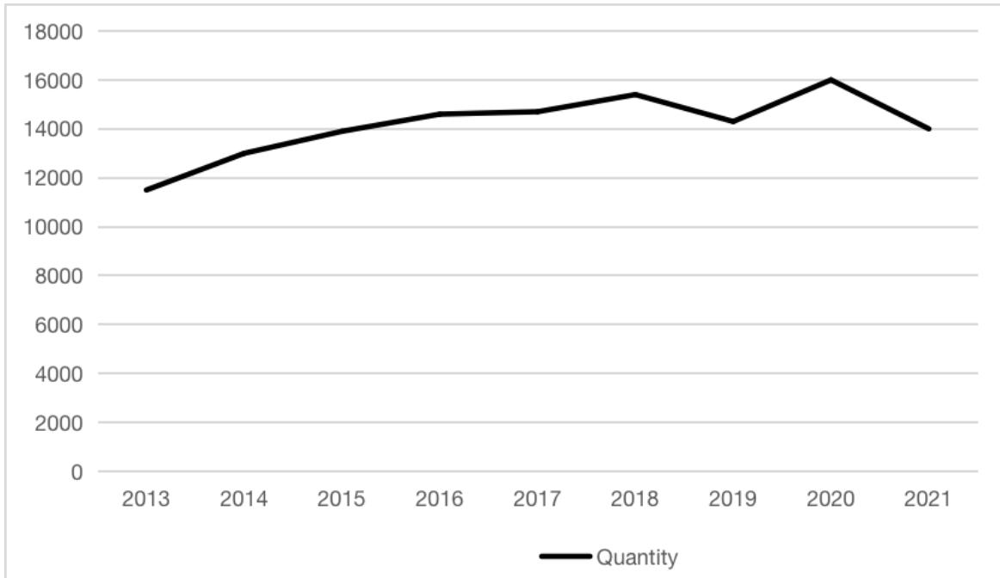
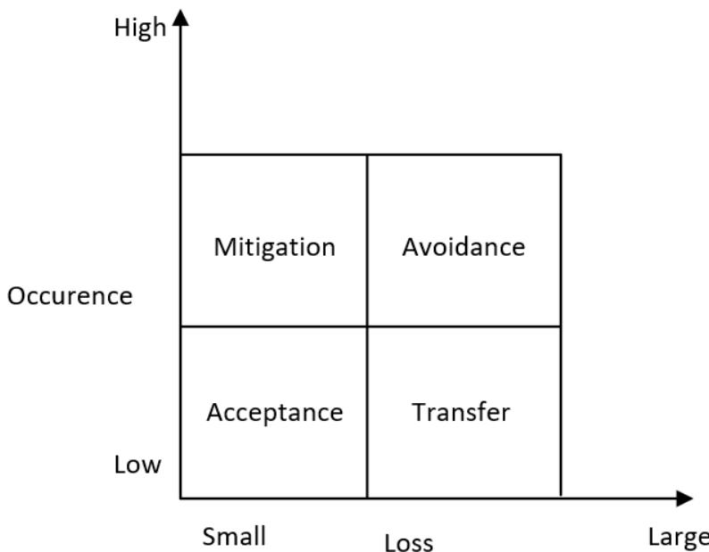

# Analysis on Risk Management of Software Outsourcing Project

Jiongjie Zhang\*

Department of Computer Science and Technology, Department of Software, Zhejiang University of Technology, Hangzhou, China

\*Corresponding author: 201906150129@zjut.edu.cn

Abstract. Nowadays many companies outsource the whole or part of software projects to other companies to reduce the cost of software projects and focus on the development of core competitive businesses. Due to the rapid update and iteration speed of information technology, the complexity of software projects is also increasing, and the risk factors in software outsourcing projects are also increasing. The existence of these risks can prolong the project cycle, or directly lead to project failure. At present, many software outsourcing companies do not pay much attention to project risk management, and cannot effectively identify, supervise and deal with risks, resulting in out of control or even failure of software outsourcing projects. This paper wil summarize the list of risk factors by studying the characteristics and status quo of today's outsourcing projects, and analyzing the possible analysis of each stage of software outsourcing projects. Use brainstorming, expert assessment, and qualitative analysis to evaluate and identify risk factors. Finally, from a practical point of view, this paper will put forward some suggestions for the future software outsourcing project risk management. I hope to achieve two purposes through the research of this paper. One is to contribute some research experience to the risk management of software outsourcing projects and guide the actual work of enterprises. Second, we should advocate innovative thinking and encourage more and better ideas to emerge.

Keywords: Software Project; Outsourcing Project; Risk Management.

# 1. Introduction

Software outsourcing (SO) refers to the activities in that companies outsource the whole or part of software projects to other companies to reduce the costs of information technology and business management of software projects and focus on the development of core competitiveness businesses. Software outsourcing refers specifically to software part outsourcing in information technology outsourcing. According to statistics from the Department of Trade in Services of the Ministry of Commerce, in 2013, China undertook 167, 424 service outsourcing contracts, with a total contract value of $\$ 95.49$ billion, a year-on-year increase of $5 5 . 8 \%$ [1]. Among them, software outsourcing accounts for more than $50 \%$ and is on the rise. Software outsourcing is beneficial for enterprises to rationally arrange resources, improve project development efficiency, and reduce human and financial resource costs.

Although my country's outsourcing business has developed rapidly, it is still in its infancy, and the control of software quality management is not enough, the overall level is relatively backward, and most businesses are at the low end of the outsourcing value chain. This paper will go deep into each stage of the software outsourcing project, analyze the possible risks in each stage, and give some suggestions, to provide a reference for the risk management of software outsourcing projects.

This paper divides software outsourcing projects into four stages: project initiation stage, early stage of project operation, the peak period of project development, and later stage of the project according to the time required for each stage, the difference in labor cost, and the differences in the main affairs involved. Starting from the characteristics, analyze the risks and countermeasures in combination with the actual situation.

# 2. Method

The main databases searched in this paper are CNKI, IEEE, ScienceDirect, etc. Among them, the main source of references is CNKI. Since this paper aims to analyze the risk factors and risk management methods existing in each stage of software outsourcing projects, when retrieving literature, words such as Risk Management, Software Outsourcing Project, and Offshore Outsourcing Project are used as keywords for retrieval. After careful statistics, from 2013 to 2021, the number of papers in software outsourcing projects and risk management-related fields is on the rise as a whole, which shows the rapid development of the outsourcing industry and the many problems that exist in it. The number of related papers from 2013 to 2021 is shown in Figure 1.

  
Figure 1. Number of related papers from 2013 to 2021

In this paper, the sub-points are set to each stage of the project, which is conducive to the decomposition of the content, and there will be no overlap between the contents. Why this article divides the project into four simple stages, rather than the waterfall model, agile development model, and other project stage models that are more practical enough. For those models in practical application, cross-stage work often occurs, or several stages form a small cycle, which is not conducive to the expression of the content of the article.

# 3. Results

# 3.1 Concepts Definition

First, back in the 1980s, there was a lot of interest in financial reporting, and articles like this were very compelling. When the time came to the 1990s, interest seemed to turn to audit again. Finally, the content of risk and risk management only began to be taken seriously in the mid-1990s [2]. Nowadays, risk management is often regarded as a management process, which includes the identification, evaluation, and prioritization of risks (defined in ISO 31000 as the effect of uncertainty on objectives). Risk management aims at avoiding analysis and minimizing loss as much as possible. During the life cycle of a project, risks can come from a variety of causes and can occur at any stage. Risk is both a challenge and an opportunity, and the ideal risk management is to solve the biggest crisis with the smallest resources.

Software outsourcing is an industry with great prospects in today's world. Whether it is a giant company or a small enterprise, a considerable number of companies choose to outsource their peripheral business to other companies, so that they can better develop their core competitiveness. Today, outsourcing has become an important decision for management to allocate resources more fully and efficiently, control costs, and focus on strategic and value-added activities. Software outsourcing has many benefits, such as reducing costs and being predictable; improving the development strategy of the IT industry; gaining access to more cutting-edge technologies and expertise. In short, outsourcing offers businesses multiple ways to use their resources more efficiently, manage their costs, and focus on core applications to increase the value of IT to business goals.

The risk management process requires the examination of all aspects of risk facing a corporation or other organization and outsourcing team. These risks are then measured, and methods of risk management to reduce or eliminate risk potential are chosen. These methods can take the form of financial risk transfer through insurance or contract, risk avoidance, self-insurance, or duplication of vulnerable functions and facilities [3]. After nearly two decades of rapid development in the international software outsourcing industry, some industry experts and pioneers put forward new supplements for the risk management of software outsourcing projects: a key process involved in outsourcing risk management is a priori evaluation of potential partners, not only in terms of expected cost (which includes exchange rate risk) but also in terms of other risks. These risks can include product failure, producing company failure (such as bankruptcy), and even political risk [4]. This soundbite mainly supplements the risks associated with international influence factors in international software outsourcing projects. In my opinion, outsourcing services wil change from onshore to onshore and offshore. In addition, nearshore has the advantage of a small-time zone difference and is easier to manage. Therefore, it is an inevitable trend to bring the risks related to international factors into the management category. Pattern due to the recent world war, Russia and Ukraine war to those with the international cooperation of the two countries has brought the huge impact, this paper thinks at least in the recent international software outsourcing project risk analysis, the war into account is understandable, such as local weather there is the risk of war, how the recent international image of the local government, etc.

# 3.2 Risk Analysis of Each Stage of Software Outsourcing Project

# 3.2.1 Project start-up phase

For project scale, project development cycle, the time point of software delivery, payment of personnel expenses, etc., risk management plans should be formulated in advance to monitor risks in real time. For example, misjudgment of project scale may lead to resource shortage during the peak period of project development; improper communication of personnel fee payment may lead to remuneration disputes in the later stage of the project. The quality of risk management in the project start-up phase will affect whether each step of the project can be carried out smoothly.

After signing the agreement, the employer will usually provide the project plan, relevant materials, personnel cost budget, software delivery time, and other information [5], for example, the financial department and the circulation department of an enterprise will infer the feasibility, working hours, time limit and other important information of the project based on a series of data obtained above in practical work, and usually report the real situation to customers. However, some enterprises, for the consideration of corporate strategy, may exaggerate the feasibility of the project to win the project, such as reducing the price of personnel costs, shortening the time limit, and so on. This will lead to a series of unexpected situations after the project starts.

# 3.2.2 Early stage of project operation

Whether the cooperation is smooth, whether the communication is carried out smoothly and effectively, and whether there is a different work content than expected are the main risk factors that should be paid atention to. In the start-up stage of the project, it is mainly the negotiation between the senior leaders of the contract-issuing enterprise and the contractor enterprise, while in the initial stage of the project operation, it is mainly the direct communication between the staff of both sides. Leaders and leaders, leaders and employees, employees and employees, the communication of these three dimensions may have poor information due to omission of information submission, which will bring many unnecessary troubles to the later work [6]. At the same time, if it is an offshore software outsourcing project, communication barriers caused by different languages may also hinder the progress of the project.

In communication, language and social and cultural differences are the primary factors. If the communicators on both sides have no experience of living in the other country, it is difficult to fully understand the intentions of the two sides only by relying on some writen information. A series of communication problems will be caused by the inability of the two sides to translate each other's languages in a trustworthy and elegant way and the different social factors taken into consideration by both sides. As for communication tools, trade secret risks and communication costs need to be considered. Mainstream software in the market is indeed a very good real-time communication tool, but the Internet has one of the biggest disadvantages, which is that trade secrets may be leaked to the Internet at any time, so sometimes we must choose face-to-face communication.

# 3.2.3 Project development peak period

Project schedule, product quality, resource cost, etc. are all very important risk factors at this stage. Whether the progress of the project can be controlled within the expected time, and whether the quality of the product can be guaranteed or even improved on top of this. At the same time, pay attention to the ratio of high-level technical personnel to ordinary technical personnel. More investment in high-level technical personnel will help to promote the progress of the project and improve product quality, but the increase in cost will become a problem. If too many ordinary technicians are used, deviations in project progress and product quality are easy to occur [7].

Schedule management mainly includes three aspects: job allocation, schedule control, and deviation correction [8]. Job assignment and schedule control should be properly arranged according to customer requirements. Prioritizing work is often a good tool. If the assignment of work is not reasonable, which leads to the loss of schedule control, it is easy to fail to deliver the results on time. Overtime can be used as a remedy for loss of schedule management, to adjust the schedule and catch up with the deadline. But overtime is a double-edged sword. Excessive overtime can be devastating to teamwork and trust, which can have an immeasurable negative impact on the entire project.

# 3.2.4 Late project

The risk of idle personnel, word-of-mouth evaluation, and follow-up cooperation caused by the reduction of investment personnel are risk factors that should be paid atention to in the later stage of the project. In the later stage of the project, the investment of personnel will gradually decrease, and there may be some risk of personnel placement. At the same time, the risk of word-of-mouth evaluation also requires companies to do a good job in public relations, strengthen customer relationships, and maintain a corporate image, which can also broaden the source of customers or pave the way for subsequent cooperation.

Projects are temporary, which means they have a clear beginning and end. Starting a large project will call on a lot of the company's manpower. Once the project is nearing the end, the number of transactions is reduced and the number of people needed is reduced, how to place a large number of employees wil become a thorny problem for the company. If the next project cannot be connected immediately, the idle employees will produce a large number of idle costs, which cannot be ignored for most small and medium-sized enterprises, or even lead to problems related to survival. Therefore, it can be seen that idle risk is a risk factor that software outsourcing companies must face and properly deal with.

# 3.2.4 Risk control and countermeasures

Risk response measures are different according to the probability of risk occurrence and the size of consequential loss. The risk response measures chart is shown in Figure 2.

  
Figure 2. Risk response measures chart [9]

(1) Risk mitigation measures can be taken for situations with high occurrence probability and small loss. (2) Risk avoidance measures can be taken for situations with high occurrence probability and large loss. (3) Risk transfer measures can be taken in the case of low occurrence probability and large loss. (4) Risk acceptance measures can be taken in the case of low occurrence probability and small loss.

According to the risk coping measures chart, the coping strategies for some risks are simply classified [10]. The risk response measures chart is shown in Table.1.

Table 1. Risk response strategy chart   

<table><tr><td rowspan=1 colspan=1>No.</td><td rowspan=1 colspan=1>Factor</td><td rowspan=1 colspan=1>Response Strategy</td></tr><tr><td rowspan=1 colspan=1>1</td><td rowspan=1 colspan=1>Exchange-rate Risk</td><td rowspan=1 colspan=1>Mitigation</td></tr><tr><td rowspan=1 colspan=1>2</td><td rowspan=1 colspan=1>Economics Risk</td><td rowspan=1 colspan=1>Avoidance</td></tr><tr><td rowspan=1 colspan=1>3</td><td rowspan=1 colspan=1>Politics Risk</td><td rowspan=1 colspan=1>Avoidance</td></tr><tr><td rowspan=1 colspan=1>4</td><td rowspan=1 colspan=1>Policy Risk</td><td rowspan=1 colspan=1>Acceptance</td></tr><tr><td rowspan=1 colspan=1>5</td><td rowspan=1 colspan=1>Talent Shortage Risk</td><td rowspan=1 colspan=1>Prevention</td></tr><tr><td rowspan=1 colspan=1>6</td><td rowspan=1 colspan=1>Labor Cost Risk</td><td rowspan=1 colspan=1>Transfer</td></tr><tr><td rowspan=1 colspan=1>7</td><td rowspan=1 colspan=1>Idle Personnel Risk</td><td rowspan=1 colspan=1>Prevention</td></tr><tr><td rowspan=1 colspan=1>8</td><td rowspan=1 colspan=1>Communication Risk</td><td rowspan=1 colspan=1>Mitigation</td></tr><tr><td rowspan=1 colspan=1>9</td><td rowspan=1 colspan=1>Schedule Management Risk</td><td rowspan=1 colspan=1>Reservation</td></tr><tr><td rowspan=1 colspan=1>10</td><td rowspan=1 colspan=1>Team Management Risk</td><td rowspan=1 colspan=1>Mitigation</td></tr><tr><td rowspan=1 colspan=1>11</td><td rowspan=1 colspan=1>Team Building Risk</td><td rowspan=1 colspan=1>Mitigation</td></tr><tr><td rowspan=1 colspan=1>12</td><td rowspan=1 colspan=1>Disclosure Risk</td><td rowspan=1 colspan=1>Prevention</td></tr><tr><td rowspan=1 colspan=1>13</td><td rowspan=1 colspan=1>Design Change Risk</td><td rowspan=1 colspan=1>Acceptance</td></tr><tr><td rowspan=1 colspan=1>14</td><td rowspan=1 colspan=1>Trust Risk</td><td rowspan=1 colspan=1>Prevention</td></tr><tr><td rowspan=1 colspan=1>15</td><td rowspan=1 colspan=1>New Technique Risk</td><td rowspan=1 colspan=1>Mitigation</td></tr><tr><td rowspan=1 colspan=1>16</td><td rowspan=1 colspan=1>Quality Risk</td><td rowspan=1 colspan=1>Prevention &amp; Mitigation</td></tr><tr><td rowspan=1 colspan=1>17</td><td rowspan=1 colspan=1>Feasibility Risk</td><td rowspan=1 colspan=1>Avoidance</td></tr></table>

The following are specific measures to deal with the risks.

(1) Plan Change Risk

The risks that may lead to plan changes are often caused by the imperfect design consideration at the initial stage of the project. Such risks are difficult to prevent or mitigate except for strengthening the design investment at the beginning, and can only be accepted. After all, many plan changes cannot be completely predicted by human beings in advance. For such risks, we need to formulate a set of emergency measures, such as defining the floating range of human resource costs based on previous experience and preparing certain reserve resources.

(2) Communication Risk

No matter what means of communication, the correct content to be expressed to the other side, and let the other side understand, this is effective communication. The following three methods can be adopted to defuse communication risks:

a. Do not agree to everything the customer asks for. Sometimes the customer is unable to accurately express their needs, everything to the customer's requirements, can only be a temporary pleasing to the customer if it cannot be completed afterward, or the customer found that the income is different from what they want, it will be a very annoying thing.

b. When you encounter a problem, you should first come up with your own opinion and then communicate with the other party. Making gratuitous inquiries without thinking will cause a huge barrier to communication.

c. Direct communication, not indirect communication. Even if the language is different, translation through a layman will also bring misunderstanding. Therefore, communicate as directly as possible and state the problem clearly. If necessary, such as the language barrier, you can use the assistance of a third party.

(3) Schedule management risk

Schedule management is also called time management, and quality management and cost management are called the three major elements of project management. In the process of software project development, it is likely to occur due to the lack of technical means, equipment downtime, data loss, and other reasons, resulting in the sacrifice of quality, and an increase in the cost to insure the progress of the situation. Schedule risks can be controlled by the experience and methods summarized in the PMP standard [11].

a. Use PDM (Precedence Diagramming Method) to create a schedule model and determine the   
implementation sequence of each activity. b. Reasonably estimate the required resources based on the activity list and resource calendar. c. Use PERT (Program Evaluation and Review Technique) to estimate the time required for each   
activity. d. Use CPM (Critical Path Method) to make a reasonable schedule. (4) Personnel idle risk

The adoption of software outsourcing by enterprises itself is a strategy for enterprises to transfer risks to outsourcing companies to avoid the risks brought by the stage of the project. The so-called coexistence of risks and benefits, for outsourcing companies, once they accept the project, is to accept the existence of such risks. If the outsourcing company cannot properly deal with this risk, it will have to pay a lot of costs for idle employees, such as wages. If there is a large number of idle employees frequently, or a large number of idle employees at one time, the company's revenue and survival, and development will have a negative impact. Here are three coping strategies:

a. Perform secondary outsourcing within the scope permitted by laws and regulations. At the beginning of the project, part of the business will be outsourced to other outsourcing companies by a certain proportion. Once the project is over, terminate the use of employees from other outsourcing companies, thereby transferring some of the risks to other companies. It should be noted that the number of secondary outsourcing employees should not be too large, because the secondary outsourcing employees are generally difficult to develop a sense of belonging and tend to have the idea of "I am here to help'", so they are unable to devote themselves fully. Therefore, the company's employees should be the main ones.

b. Considering the technical characteristics of idle workers, whether they can be transferred to other positions. C. Employees are assigned to other companies as secondary outsourcing employees.

# 4. Conclusions

This paper first introduces the development status of software outsourcing projects, especially in China. Because of the rapid development of software outsourcing projects and the lack of effective management of project risk, this paper aims to provide some guidance for future software outsourcing project risk management. This paper mainly consulting and analyzes a large number of literatures from 1995 to now, on the development and status quo of outsourcing project risk management to make a systematic summary, and combined with the current status quo, the various stages of the risk response measure.

Risk is often something to avoid, but that's why managing it properly means taking more opportunities than others. Moreover, outsourcing software project development is different from traditional software project development. Whether it is offshore, nearshore, or local outsourcing, the complexity of the management level is not as simple as $1 + 1 { = } 2$ , and there are often many things to consider. In the current situation of rapid development of outsourcing but lack of standardized management, the research in this paper can provide practical guidance on risk management. Unfortunately, due to the researcher's limited ability, this study may not have a comprehensive view of the dimension of risk management. At the same time, the research depth of software outsourcing projects still needs to be improved.

# References

[1] Chen L, Li X.L., Yu Jun, etc. Research on key issues of Software Outsourcing project Management [J]. Science and Technology Vision, 2021.   
[2] Power M. The risk management of everything [J]. The Journal of Risk Finance, 2004.   
[3] Downey J M. Risk of outsourcing-applying risk management techniques to staffing methods [J]. Facilities, 1995.   
[4] Olson D L, Wu D. Risk management models for supply chain: a scenario analysis of outsourcing to China [J]. Supply Chain Management: An International Journal, 2011.   
[5] Mishra D, Mahanty B. Business knowledge requirements and onsite-offshore work division in Indian software outsourcing projects [J]. Strategic Outsourcing: An International Journal, 2015.   
[6] Ji Y., Analysis and Enlightenment on The Failure cases of Software Outsourcing development in Japan [J]. Journal of Qingdao Polytechnic College, 2012, 25 (4): 75 - 78.   
[7] Gandhi S J, Gorod A, Sauser B. Prioritization of outsourcing risks from a systemic perspective [J]. Strategic Outsourcing: An International Journal, 2012.   
[8] Zhu F.W., Song J. B., Project Management [M]. Beijing: Tsinghua University publishing house co. td, 2012.   
[9] Project Management Institute. Project Standard for Project Risk Management [M]. Beijing: Publishing House of Electronics Industry, 2015.   
[10] Wang D. Research on risk Management of Y Enterprise's Mainframe outsourcing project to Japan [D]. Dalian Maritime University, 2016.   
[11] Project Management Institute. Project Management Body of Knowledge (PMBOK) [M]. Beijing: Publishing House of Electronics Industry, 2013.