# 论文神器 - 系统架构详细设计

## 1. 技术栈架构

### 1.1 技术栈全景图

```mermaid
graph TB
    subgraph Frontend["前端技术栈"]
        Vue[Vue 3.2.13<br/>Composition API]
        ElementPlus[Element Plus 2.7.8<br/>UI组件库]
        VueRouter[Vue Router 4.x<br/>路由管理]
        MDEditor[@kangc/v-md-editor<br/>Markdown编辑器]
        Axios[Axios 1.4.0<br/>HTTP客户端]
    end

    subgraph Build["构建工具链"]
        VueCLI[Vue CLI<br/>项目脚手架]
        Webpack[Webpack<br/>模块打包]
        Babel[Babel<br/>ES6+转译]
        PostCSS[PostCSS<br/>CSS处理]
    end

    subgraph Deploy["部署方案"]
        Docker[Docker<br/>容器化]
        Nginx[Nginx<br/>Web服务器]
        Vercel[Vercel<br/>Serverless]
    end

    subgraph Backend["后端服务"]
        TwoAPI[Two-API<br/>AI服务中转]
        OpenAI[OpenAI API]
        Gemini[Google Gemini]
        Claude[Anthropic Claude]
    end

    Vue --> ElementPlus
    Vue --> VueRouter
    Vue --> MDEditor
    Vue --> Axios

    Vue --> VueCLI
    VueCLI --> Webpack
    Webpack --> Babel
    Webpack --> PostCSS

    Webpack --> Docker
    Docker --> Nginx
    Webpack --> Vercel

    Axios --> TwoAPI
    TwoAPI --> OpenAI
    TwoAPI --> Gemini
    TwoAPI --> Claude

    style Frontend fill:#E3F2FD
    style Build fill:#FFF3E0
    style Deploy fill:#E8F5E9
    style Backend fill:#F3E5F5
```

### 1.2 依赖关系

```mermaid
graph LR
    subgraph Core["核心依赖"]
        Vue3[vue@3.2.13]
        VueRouter[vue-router@4.x]
    end

    subgraph UI["UI依赖"]
        ElementPlus[element-plus@2.7.8]
        ElementIcons[@element-plus/icons-vue]
        MDEditor[@kangc/v-md-editor]
        Prism[prismjs]
    end

    subgraph HTTP["网络依赖"]
        Axios[axios@1.4.0]
        EventSource[eventsource-parser]
    end

    subgraph Dev["开发依赖"]
        VueCLI[@vue/cli-service]
        Sass[sass]
        ESLint[eslint]
    end

    Vue3 --> VueRouter
    Vue3 --> ElementPlus
    ElementPlus --> ElementIcons
    Vue3 --> MDEditor
    MDEditor --> Prism

    Vue3 --> Axios
    Axios --> EventSource

    Vue3 --> VueCLI
    VueCLI --> Sass
    VueCLI --> ESLint

    style Core fill:#90EE90
    style UI fill:#87CEEB
    style HTTP fill:#FFD700
    style Dev fill:#DDA0DD
```

## 2. 组件架构

### 2.1 组件层次结构

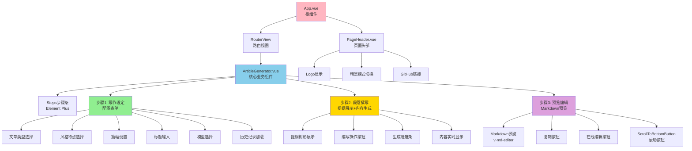

### 2.2 组件通信

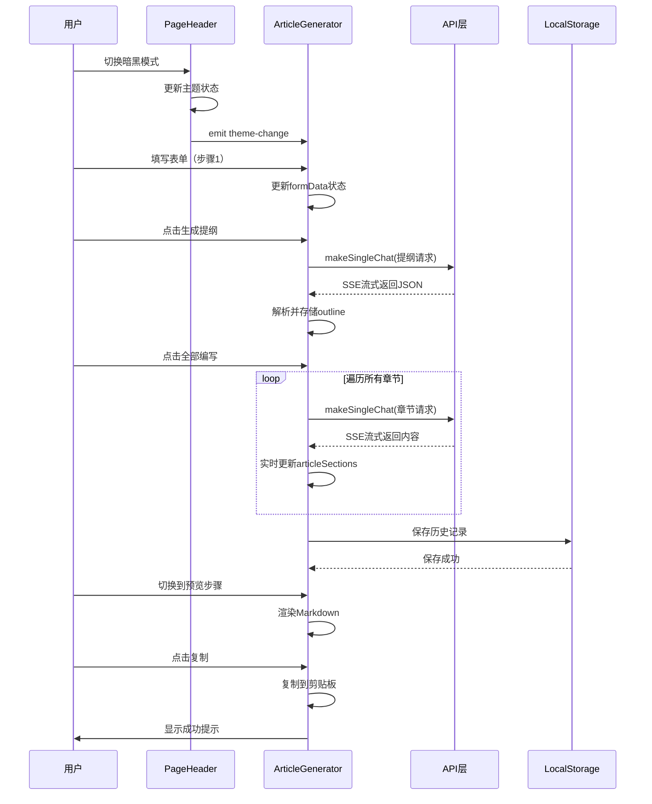

## 3. 数据架构

### 3.1 数据模型

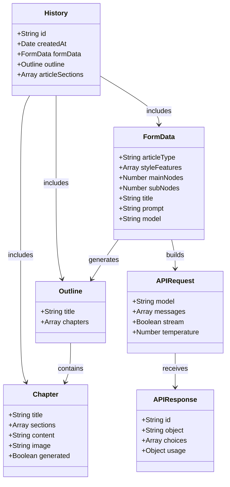

### 3.2 状态管理

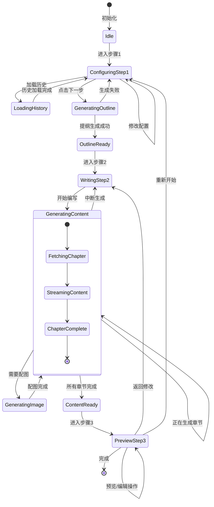

## 4. 模块架构

### 4.1 模块依赖图

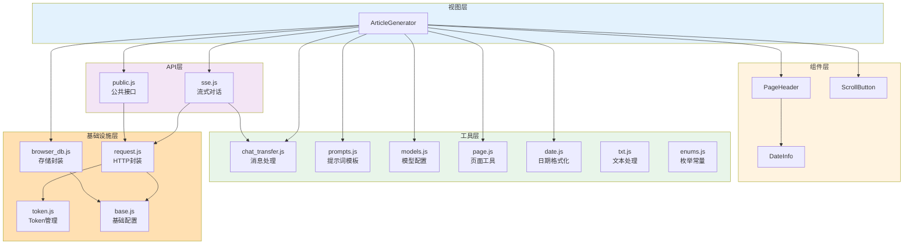

### 4.2 核心模块详解

#### utils/chat_transfer.js - 消息处理模块

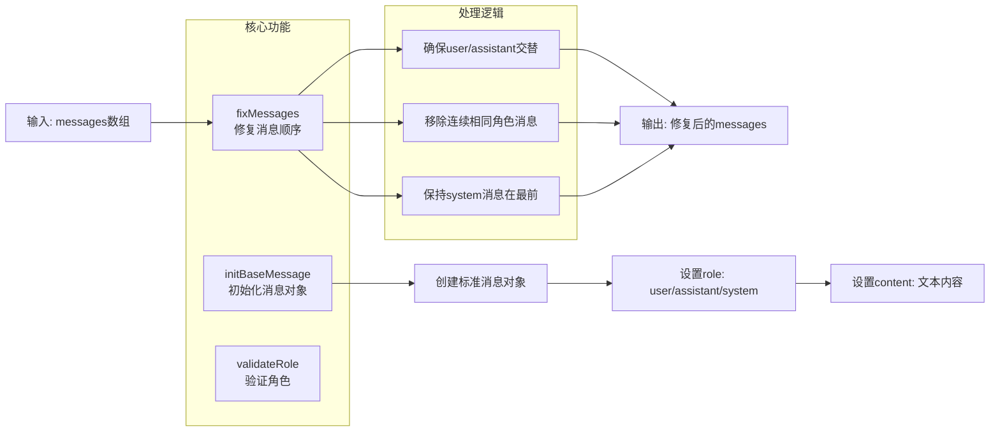

#### api/sse.js - SSE流式对话模块

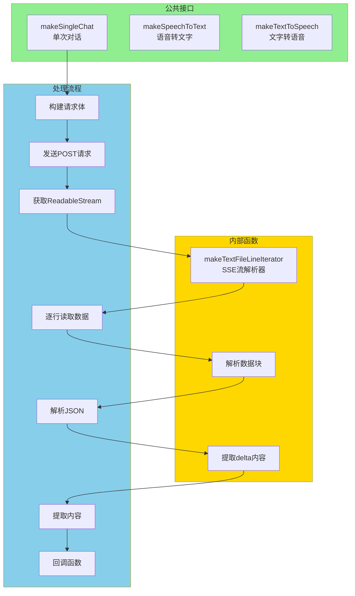

## 5. 安全架构

### 5.1 认证流程

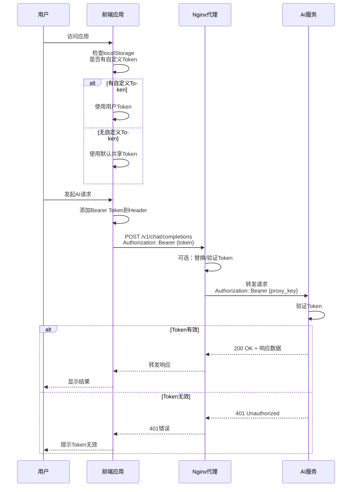

### 5.2 数据安全

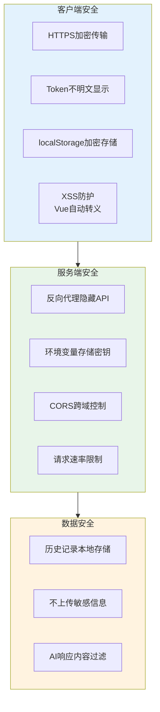

## 6. 性能架构

### 6.1 性能优化策略

```mermaid
mindmap
    root((性能优化))
        前端优化
            代码分割
                路由懒加载
                组件异步加载
            资源优化
                图片懒加载
                Gzip压缩
                CDN加速
            渲染优化
                虚拟滚动
                防抖节流
                Markdown增量渲染
        网络优化
            SSE流式传输
                降低首字延迟
                提升用户体验
            HTTP/2
                多路复用
                头部压缩
            缓存策略
                localStorage缓存
                浏览器缓存
                Service Worker
        后端优化
            反向代理
                请求合并
                连接池
            负载均衡
                多实例部署
                健康检查
```

### 6.2 缓存架构

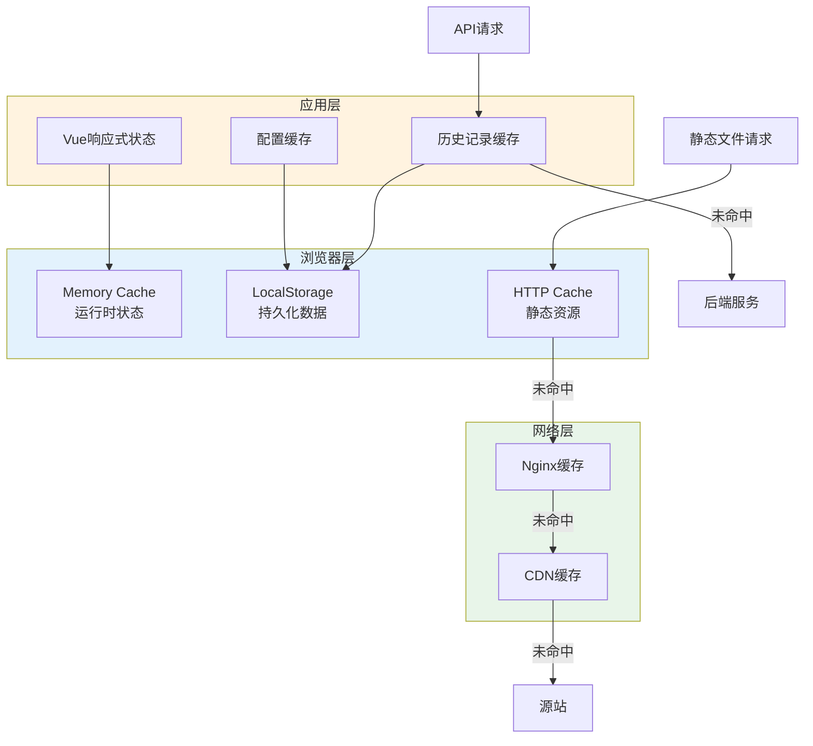

## 7. 可扩展架构

### 7.1 插件化设计

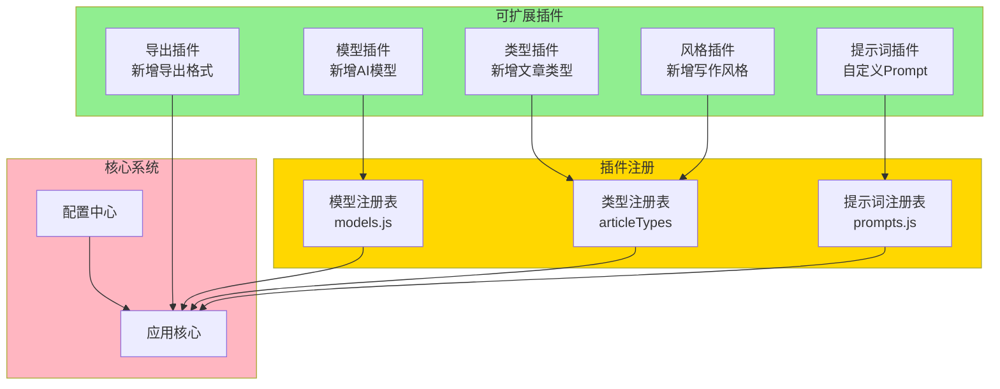

### 7.2 扩展点设计

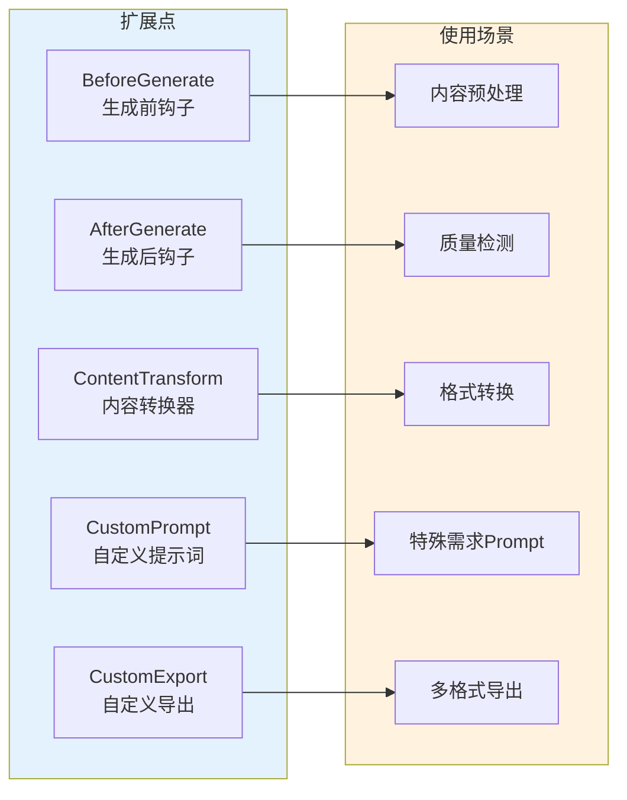

## 8. 监控架构

### 8.1 日志收集

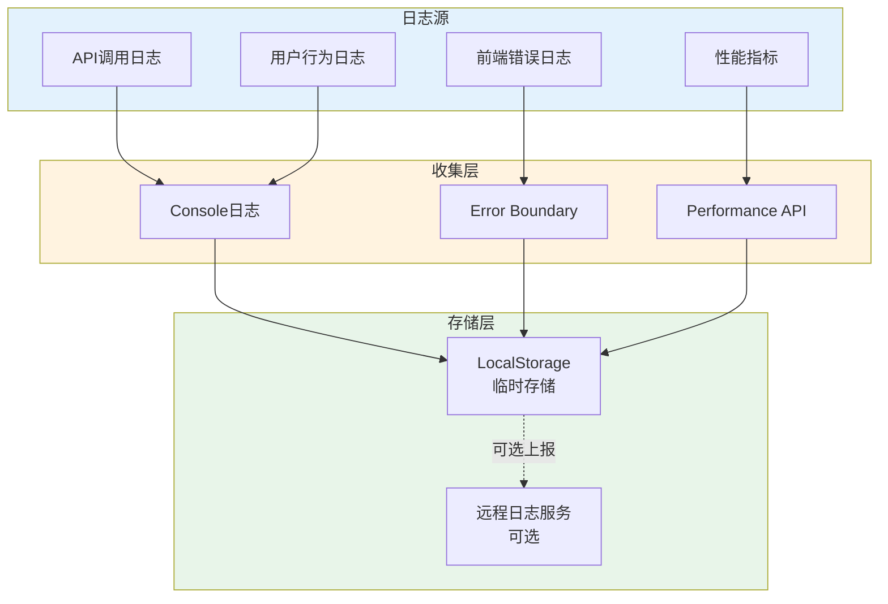

---

**文档版本**: v1.0
**更新时间**: 2025-11-08
**适用版本**: lunwenshenqi v1.x
