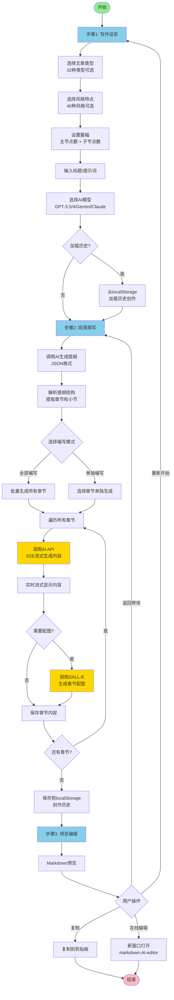
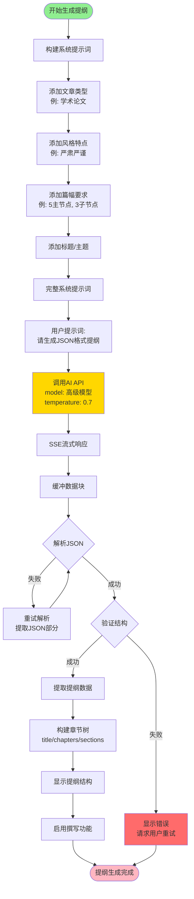
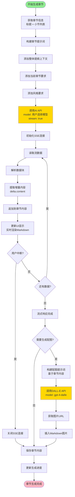
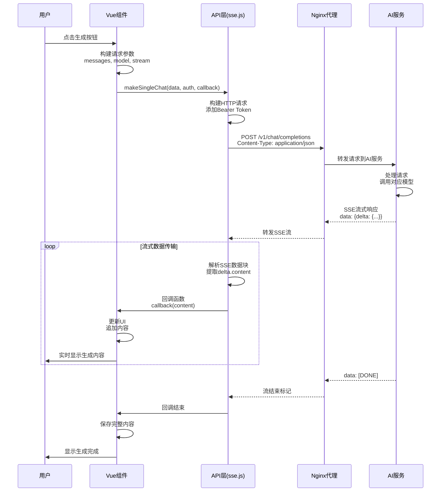
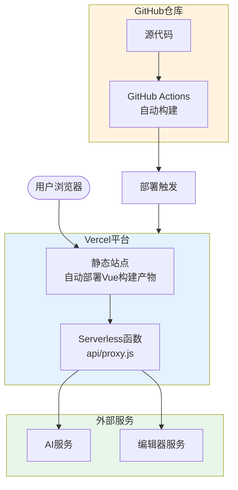
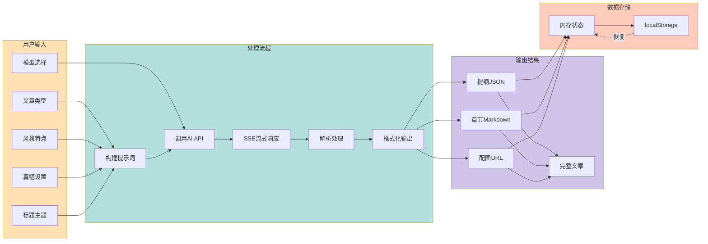
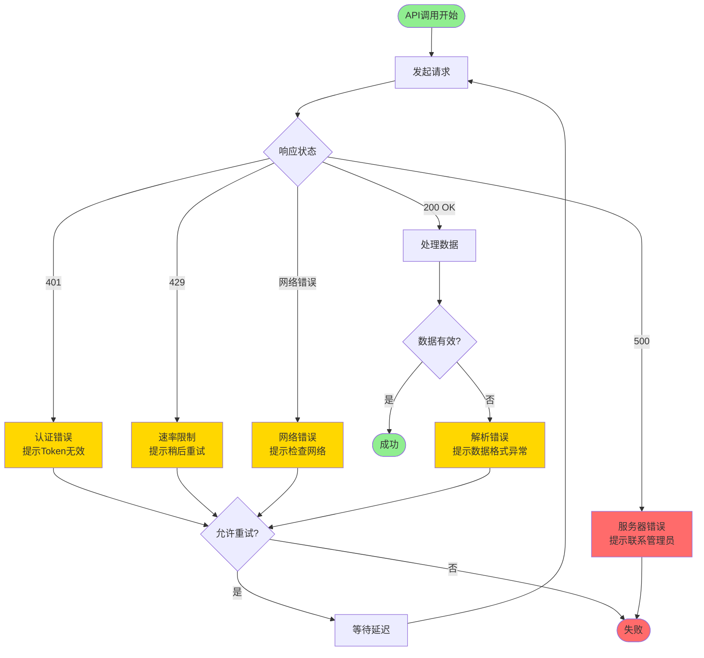

# 论文神器 - 流程图文档

本文档包含论文神器项目的核心业务流程图和系统架构图。

## 1. 核心业务流程

### 1.1 主流程：三步骤文章生成



### 1.2 提纲生成详细流程



### 1.3 章节内容生成详细流程



## 2. 系统架构流程

### 2.1 整体系统架构

```mermaid
flowchart TB
    subgraph Client["客户端层"]
        Browser[Web浏览器]
        VueApp[Vue 3 应用]
        Components[组件层<br/>ArticleGenerator<br/>PageHeader等]
    end

    subgraph Frontend["前端应用层"]
        Router[Vue Router<br/>路由管理]
        Utils[工具层<br/>chat_transfer<br/>prompts<br/>models]
        API[API接口层<br/>sse.js<br/>public.js]
        Storage[本地存储<br/>localStorage<br/>历史记录]
    end

    subgraph Proxy["代理层"]
        Nginx[Nginx反向代理<br/>或Vercel Proxy]
        ProxyAI[/v1/* → AI服务]
        ProxyEditor[/api/* → 编辑器]
    end

    subgraph Backend["后端服务层"]
        AIService[AI服务<br/>Two-API中转]
        OpenAI[OpenAI API<br/>GPT-3.5/4]
        Gemini[Google Gemini]
        Claude[Anthropic Claude]
        DALLE[DALL-E图片生成]

        EditorService[编辑器服务<br/>markdown-AI-editor]
    end

    Browser --> VueApp
    VueApp --> Components
    Components --> Router
    Components --> Utils
    Components --> API
    Components --> Storage

    API --> Nginx
    Nginx --> ProxyAI
    Nginx --> ProxyEditor

    ProxyAI --> AIService
    AIService --> OpenAI
    AIService --> Gemini
    AIService --> Claude
    AIService --> DALLE

    ProxyEditor --> EditorService

    Storage -.->|读取历史| Components
    Components -.->|保存历史| Storage

    style Client fill:#E3F2FD
    style Frontend fill:#FFF3E0
    style Proxy fill:#F3E5F5
    style Backend fill:#E8F5E9
```

### 2.2 API调用流程



### 2.3 数据存储流程

```mermaid
flowchart LR
    subgraph Generate["内容生成"]
        G1[生成提纲]
        G2[生成章节内容]
        G3[生成配图]
    end

    subgraph Memory["内存状态"]
        M1[currentOutline<br/>当前提纲]
        M2[articleSections<br/>章节内容数组]
        M3[generationProgress<br/>生成进度]
    end

    subgraph LocalStorage["本地持久化"]
        L1[history_list<br/>历史列表]
        L2[history_detail_{id}<br/>历史详情]
        L3[user_config<br/>用户配置]
    end

    G1 --> M1
    G2 --> M2
    G3 --> M2

    M1 --> Save1[保存操作]
    M2 --> Save1
    M3 --> Save1

    Save1 --> L1
    Save1 --> L2

    L1 --> Load1[加载操作]
    L2 --> Load1
    L3 --> Load1

    Load1 --> M1
    Load1 --> M2
    Load1 --> M3

    style Generate fill:#FFE0B2
    style Memory fill:#B2DFDB
    style LocalStorage fill:#D1C4E9
```

## 3. 部署架构

### 3.1 Docker部署架构

```mermaid
flowchart TB
    subgraph Docker["Docker容器"]
        subgraph Nginx["Nginx服务"]
            Static[静态文件服务<br/>/dist]
            Proxy1[反向代理<br/>/v1/* → AI服务]
            Proxy2[反向代理<br/>/api/* → 编辑器]
        end

        Config[环境变量配置<br/>proxy_url<br/>proxy_key<br/>editor_url<br/>ai_models]
    end

    subgraph Build["构建产物"]
        VueBuild[Vue构建<br/>npm run build]
        DistFolder[/dist文件夹<br/>index.html<br/>js/css/assets]
    end

    subgraph External["外部服务"]
        AIExt[AI服务<br/>OpenAI兼容API]
        EditorExt[编辑器服务<br/>suishouji.qiangtu.com]
    end

    VueBuild --> DistFolder
    DistFolder --> Static

    Config --> Nginx

    Proxy1 --> AIExt
    Proxy2 --> EditorExt

    User([用户浏览器]) --> Nginx

    style Docker fill:#E3F2FD
    style Build fill:#FFF3E0
    style External fill:#E8F5E9
```

### 3.2 Vercel部署架构



## 4. 数据流图

### 4.1 完整数据流



## 5. 错误处理流程



---

**文档版本**: v1.0
**更新时间**: 2025-11-08
**图表工具**: Mermaid
