# 论文神器 - 优化方案流程图

本文档包含学术论文生成优化方案的各种流程图和架构图。

## 1. 问题与解决方案总览

### 1.1 核心问题映射

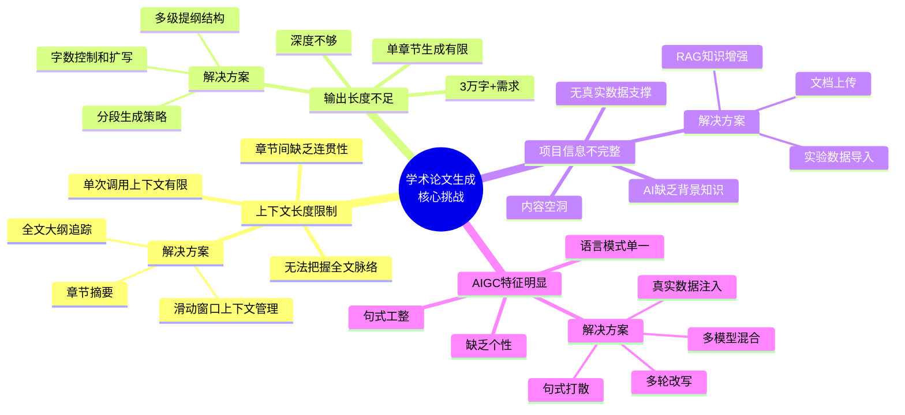

## 2. RAG知识增强方案

### 2.1 RAG整体架构

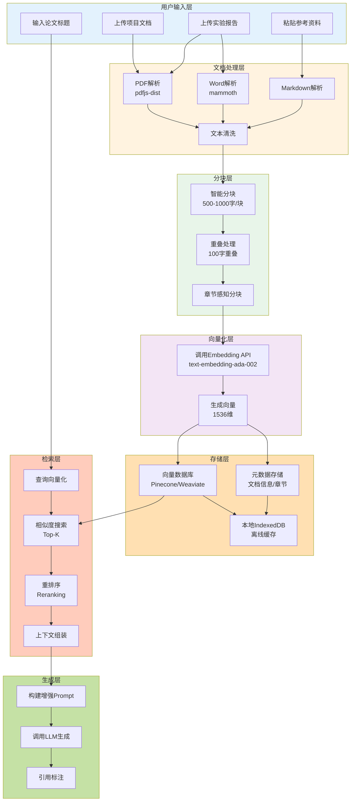

### 2.2 RAG检索流程

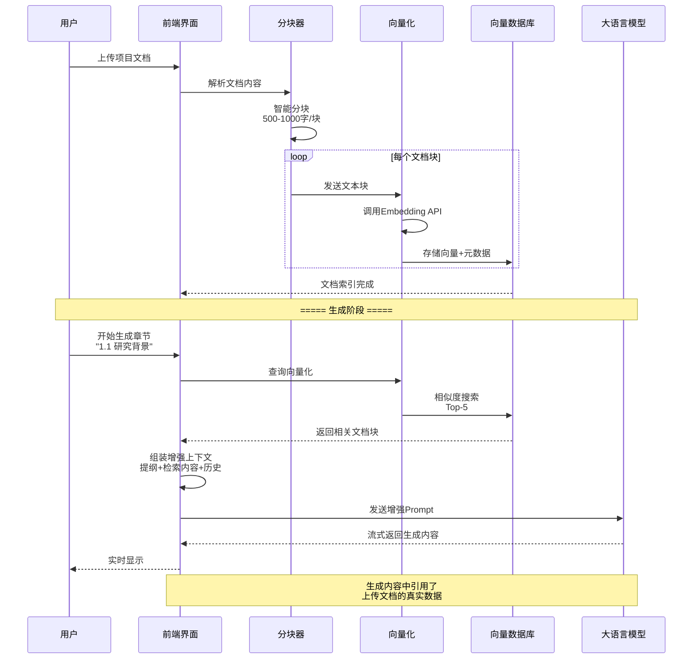

### 2.3 文档分块策略

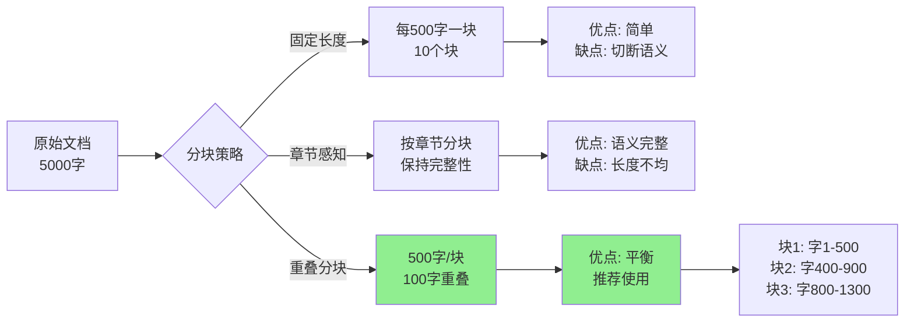

## 3. 多级提纲与分段生成

### 3.1 三级提纲结构

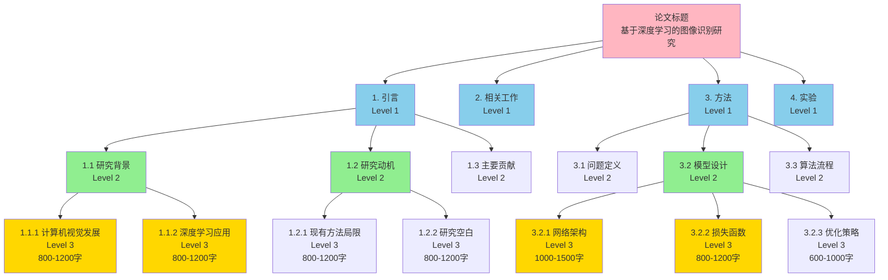

### 3.2 分段生成流程

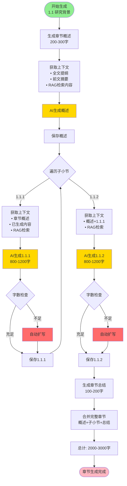

### 3.3 字数控制策略

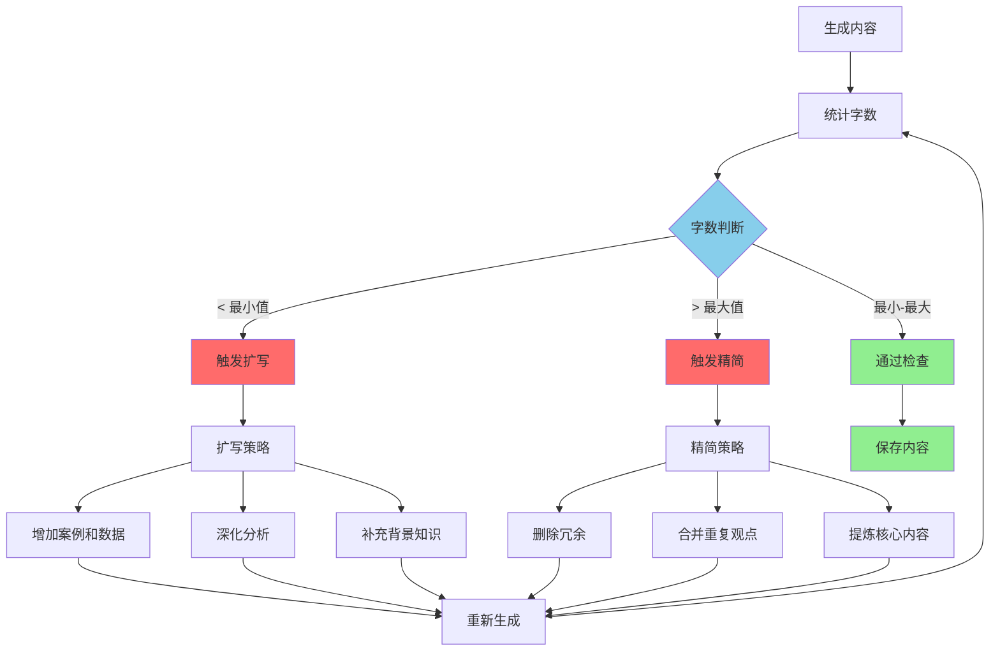

## 4. 滑动窗口上下文管理

### 4.1 上下文窗口设计

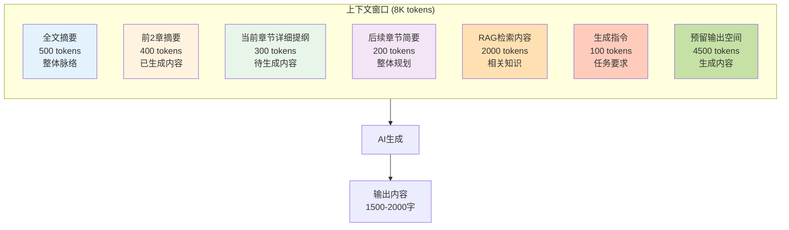

### 4.2 动态上下文管理流程

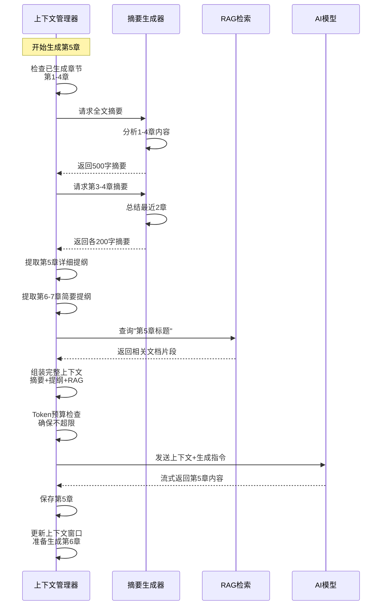

### 4.3 Token预算管理

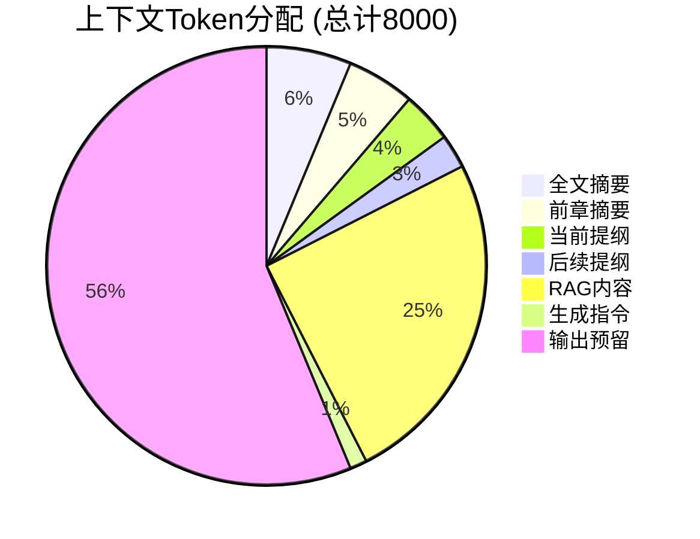

## 5. AIGC检测对抗策略

### 5.1 多轮改写流程

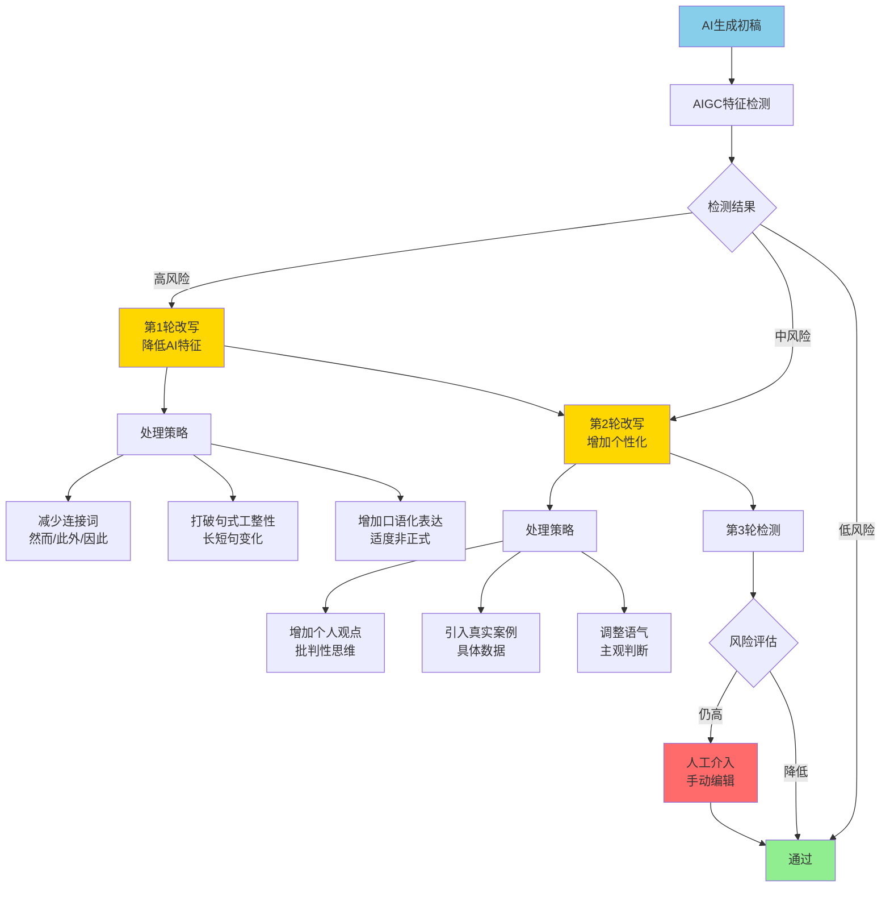

### 5.2 句式多样化策略

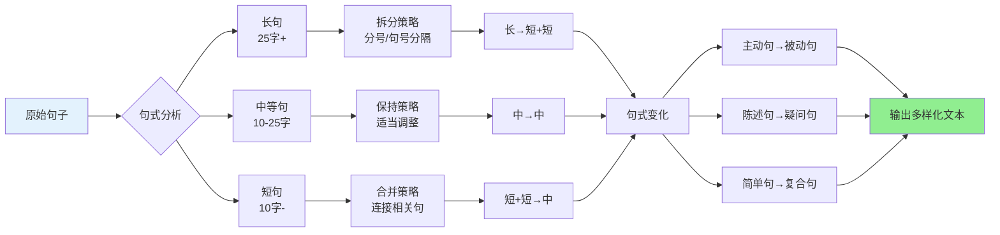

### 5.3 多模型混合策略

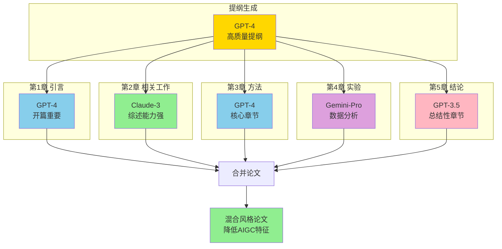

## 6. 质量评估与迭代优化

### 6.1 质量评估维度

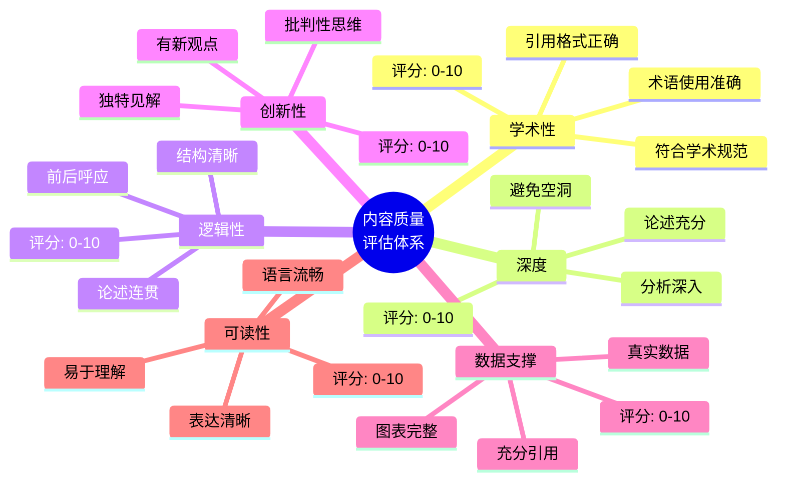

### 6.2 迭代优化流程

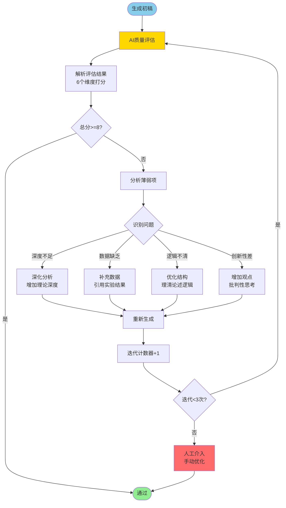

### 6.3 评估报告示例

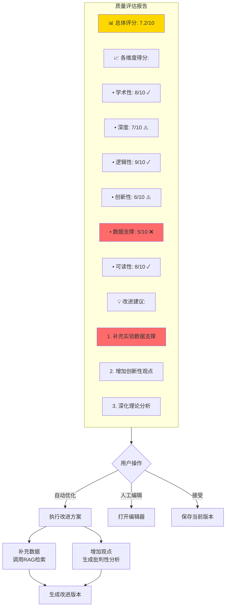

## 7. 完整优化方案对比

### 7.1 优化前后对比

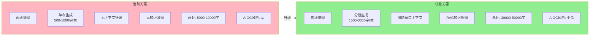

### 7.2 成本效益分析

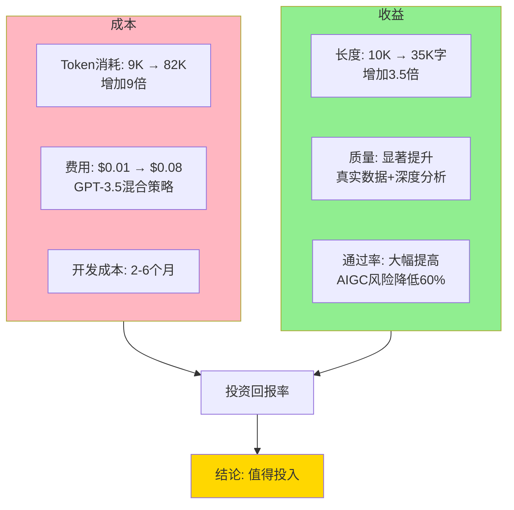

## 8. 实施路线图

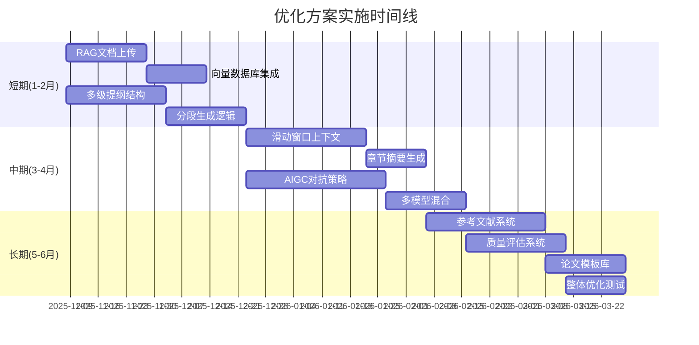

---

**文档版本**: v1.0
**更新时间**: 2025-11-08
**配合阅读**: [优化方案详细文档](./optimization-plan.md)
