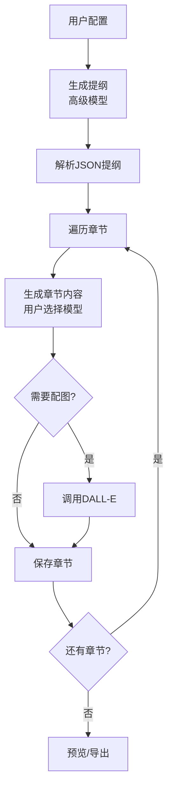
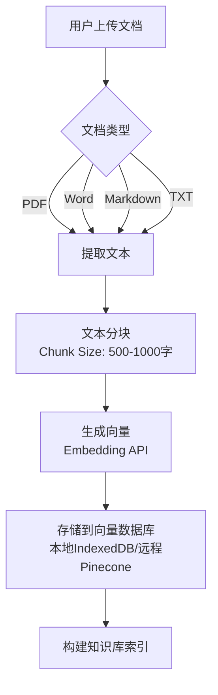
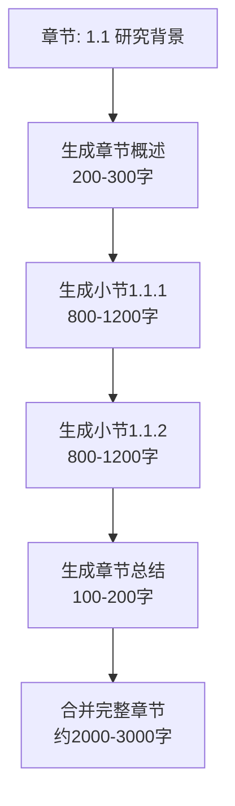
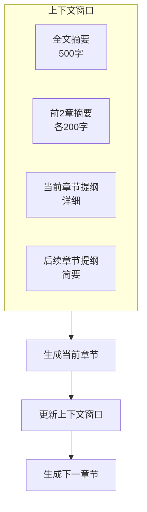
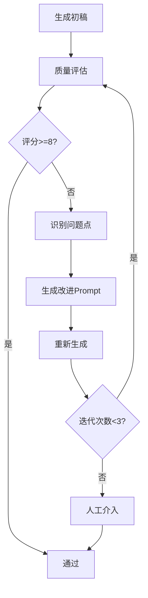

# 论文神器 - 学术论文生成优化方案

## 1. 当前实现分析

### 1.1 已实现的核心功能

#### ✅ 结构化生成
- **两级提纲**：主节点（level 1）+ 子节点（level 2）
- **JSON格式提纲**：使用高级模型生成结构化的章节索引
- **逐章节生成**：根据提纲依次生成每个章节的内容

```javascript
// 当前提纲结构
[
  { "index": "1", "level": "1", "title": "引言", "content": "" },
  { "index": "1.1", "level": "2", "title": "研究背景", "content": "" },
  { "index": "1.2", "level": "2", "title": "研究意义", "content": "" }
]
```

#### ✅ 可配置性
- **32种文章类型**：学术论文、新闻报道、叙述性文章等
- **46种风格特点**：严肃严谨、引经据典、细节描述等
- **篇幅控制**：主节点数（1-10）、子节点数（1-10）
- **多模型支持**：GPT-3.5/4、Gemini、Claude等

#### ✅ 双模型策略
- **提纲生成**：使用高级模型（gpt-4）确保结构合理
- **内容生成**：可选经济模型（gpt-3.5-turbo-16k）降低成本

#### ✅ 配图功能
- **DALL-E集成**：为章节生成配图
- **Markdown嵌入**：自动提取图片链接并嵌入

#### ✅ 历史管理
- **localStorage持久化**：保存创作历史
- **可恢复**：随时加载历史创作继续编辑

### 1.2 当前生成流程



### 1.3 当前Prompt策略

**提纲生成Prompt**:
```
你是一位长文写作专家, 用户要写的是 "${type}"
建议写作风格为 ${style}
你需要按照 ${node_size} 个主节点, 每个主节点 ${item_size} 个子节点
请返回json内容，而不是其它格式
目标内容的标题/内容要求是：${title}
```

**内容生成Prompt**:
```
## 目标内容的标题是： 《${title}》
## 目标内容的题材是： "${type}"
## 建议写作风格为 ${style}
## 提纲如下：
---
${JSON.stringify(outline)}
---

# 请编写章节：${chapter_title}
```

## 2. 学术论文场景的挑战

### 2.1 挑战1: LLM上下文长度限制

**问题描述**:
- 学术论文通常 **3万字+**（约40-50页）
- GPT-3.5-turbo: 16K tokens (约12,000字)
- GPT-4: 8K-128K tokens (约6,000-96,000字)
- 单章节生成时无法看到前文完整内容
- 章节间缺乏连贯性和前后呼应

**当前实现的局限**:
```javascript
// 当前每次生成只传入提纲，没有传入已生成的内容
var messages = [{
    "role": "system",
    "content": sysPrompt  // 仅包含提纲
}, {
    "role": "user",
    "content": item.index + " " + item.title
}]
```

### 2.2 挑战2: 单次输出长度不足

**问题描述**:
- 当前实现：每个章节一次性生成
- Level 1章节：只生成"简短引子"
- Level 2章节：生成完整内容，但长度有限
- 3万字论文需要多次调用，章节间缺乏深度

**当前实现**:
```javascript
if (item.level == '1') {
    sysPrompt = getContentPrompt(tmpArr, "# 请给这一章编写一个简短的引子：")
} else {
    sysPrompt = getContentPrompt(tmpArr, "# 请编写章节：")
}
```

### 2.3 挑战3: 项目信息不完整

**问题描述**:
- AI对用户的研究项目、实验数据、技术细节了解不足
- 只能基于标题和提纲进行想象，缺乏真实性
- 无法引用真实的实验数据、图表、代码
- 生成的内容空洞、缺乏具体性

**当前实现的局限**:
- ❌ 无法上传项目文档
- ❌ 无法导入实验数据
- ❌ 无法引用真实文献
- ❌ 无法提供专业术语库

### 2.4 挑战4: AIGC检测问题

**问题描述**:
- AI生成的文本有明显的语言特征
- 句式结构重复、词汇单一
- 缺乏真实数据支撑
- 容易被GPTZero、Turnitin等工具检测

**常见AIGC特征**:
1. **过度使用连接词**："然而"、"此外"、"因此"、"总之"
2. **句式过于工整**：排比句、对仗句
3. **缺乏个人观点**：过于客观和中立
4. **数据虚构**：无法提供真实来源
5. **引用格式统一**：所有引用风格一致

## 3. 优化方案设计

### 3.1 方案1: 知识增强（RAG）

#### 设计思路
引入RAG（Retrieval-Augmented Generation）技术，允许用户上传项目相关文档，在生成时动态检索相关内容注入上下文。

#### 功能设计

**3.1.1 文档上传模块**



**UI界面设计**:
```
┌─────────────────────────────────────────┐
│  步骤1: 写作设定                         │
├─────────────────────────────────────────┤
│  [新增] 知识库管理                       │
│  ┌─────────────────────────────────┐   │
│  │ 📁 已上传文档 (3)                │   │
│  │ • 项目需求文档.pdf      [删除]   │   │
│  │ • 实验报告.docx         [删除]   │   │
│  │ • 相关论文.pdf          [删除]   │   │
│  │                                  │   │
│  │ [+ 上传文档] [+ 粘贴文本]        │   │
│  └─────────────────────────────────┘   │
└─────────────────────────────────────────┘
```

**3.1.2 向量检索模块**

```javascript
// 检索相关文档片段
async function retrieveRelevantContext(query, topK = 5) {
    // 1. 将查询转换为向量
    const queryEmbedding = await getEmbedding(query);

    // 2. 在向量数据库中搜索
    const results = await vectorDB.search(queryEmbedding, topK);

    // 3. 返回最相关的文档片段
    return results.map(r => r.content).join('\n\n---\n\n');
}

// 增强的内容生成Prompt
const getEnhancedContentPrompt = async (list, desc, chapterTitle) => {
    // 检索与当前章节相关的知识
    const relevantContext = await retrieveRelevantContext(chapterTitle);

    return `
## 目标内容的标题是： 《${form.value.title}》
## 目标内容的题材是： "${form.value.type}"
## 建议写作风格为 ${form.value.style}
## 提纲如下：
---
${list}
---

## 相关参考资料：
---
${relevantContext}
---

基于以上信息和参考资料
${desc}

**重要**:
1. 优先使用参考资料中的真实数据和观点
2. 引用资料时注明来源
3. 结合参考资料进行深度分析
    `;
}
```

**3.1.3 数据导入模块**

```
┌─────────────────────────────────────────┐
│  实验数据管理                            │
├─────────────────────────────────────────┤
│  数据集名称: [实验结果数据集]            │
│  数据格式: ○ CSV  ● Excel  ○ JSON      │
│                                          │
│  [上传文件] 或 [粘贴数据]                │
│                                          │
│  预览数据:                               │
│  ┌────────────────────────────────┐    │
│  │ 参数A  │ 参数B  │ 结果         │    │
│  │ 1.2    │ 3.4    │ 95.6%       │    │
│  │ 2.3    │ 4.5    │ 97.2%       │    │
│  └────────────────────────────────┘    │
│                                          │
│  [ ] 在生成论文时自动引用此数据          │
│  [ ] 生成数据分析和可视化图表            │
└─────────────────────────────────────────┘
```

**实现**:
```javascript
// 数据导入和引用
const importExperimentalData = (data) => {
    // 存储实验数据
    localStorage.setItem('experimental_data', JSON.stringify(data));

    // 生成数据摘要
    const summary = generateDataSummary(data);

    return summary;
}

// 在生成时注入数据
const getDataEnhancedPrompt = (chapterTitle, data) => {
    if (chapterTitle.includes('实验') || chapterTitle.includes('结果')) {
        return `
## 实验数据：
${JSON.stringify(data, null, 2)}

请基于以上真实实验数据进行分析和论述。要求：
1. 引用具体的数据点
2. 进行数据对比和趋势分析
3. 绘制相关图表（使用Markdown表格或描述图表内容）
        `;
    }
    return '';
}
```

#### 技术实现

**前端向量数据库方案**:
```javascript
// 使用 localforage + 简单向量相似度计算
import localforage from 'localforage';

class SimpleVectorDB {
    constructor() {
        this.db = localforage.createInstance({
            name: 'knowledge_base'
        });
    }

    async addDocument(id, content, embedding) {
        await this.db.setItem(id, { content, embedding });
    }

    async search(queryEmbedding, topK = 5) {
        const allDocs = [];
        await this.db.iterate((value, key) => {
            const similarity = this.cosineSimilarity(
                queryEmbedding,
                value.embedding
            );
            allDocs.push({ ...value, similarity });
        });

        return allDocs
            .sort((a, b) => b.similarity - a.similarity)
            .slice(0, topK);
    }

    cosineSimilarity(a, b) {
        const dotProduct = a.reduce((sum, ai, i) => sum + ai * b[i], 0);
        const magnitudeA = Math.sqrt(a.reduce((sum, ai) => sum + ai * ai, 0));
        const magnitudeB = Math.sqrt(b.reduce((sum, bi) => sum + bi * bi, 0));
        return dotProduct / (magnitudeA * magnitudeB);
    }
}
```

**Embedding API调用**:
```javascript
// 调用OpenAI Embeddings API
async function getEmbedding(text) {
    const response = await axios.post('/v1/embeddings', {
        model: 'text-embedding-ada-002',
        input: text
    });
    return response.data.data[0].embedding;
}
```

### 3.2 方案2: 多级提纲 + 分段生成

#### 设计思路
将当前的两级提纲扩展为三级或多级，更细粒度地控制生成，每个小节分段生成，确保深度和长度。

#### 功能设计

**3.2.1 三级提纲结构**

```json
{
  "title": "基于深度学习的图像识别研究",
  "chapters": [
    {
      "index": "1",
      "title": "引言",
      "sections": [
        {
          "index": "1.1",
          "title": "研究背景",
          "subsections": [
            { "index": "1.1.1", "title": "计算机视觉发展历程" },
            { "index": "1.1.2", "title": "深度学习在图像识别中的应用现状" }
          ]
        },
        {
          "index": "1.2",
          "title": "研究意义"
        }
      ]
    }
  ]
}
```

**3.2.2 分段生成策略**



**实现**:
```javascript
// 分段生成策略
const generateSectionWithSubsections = async (section) => {
    let fullContent = '';

    // 1. 生成章节概述
    const overview = await generateOverview(section);
    fullContent += overview + '\n\n';

    // 2. 逐个生成子小节
    for (const subsection of section.subsections) {
        const subsectionContent = await generateSubsection(
            section,
            subsection,
            fullContent  // 传入已生成的内容作为上下文
        );
        fullContent += `### ${subsection.index} ${subsection.title}\n\n`;
        fullContent += subsectionContent + '\n\n';
    }

    // 3. 生成章节总结
    const summary = await generateSummary(section, fullContent);
    fullContent += summary;

    return fullContent;
}

// 生成子小节时传入上文
const generateSubsection = async (parentSection, subsection, previousContent) => {
    const prompt = `
## 整体提纲：
${JSON.stringify(outline)}

## 当前章节：${parentSection.index} ${parentSection.title}

## 已生成内容（请保持连贯）：
---
${previousContent}
---

## 当前任务：
请编写子小节 ${subsection.index} ${subsection.title}

要求：
1. 与前文保持逻辑连贯
2. 适当引用前文内容
3. 篇幅控制在800-1200字
4. 深入分析，避免空洞
    `;

    return await callAI(prompt);
}
```

**3.2.3 字数控制和扩写**

```javascript
// 字数检查和自动扩写
const ensureMinimumLength = async (content, minWords = 800) => {
    const wordCount = content.length;

    if (wordCount < minWords) {
        const expandPrompt = `
以下是一段内容，但篇幅不足（当前${wordCount}字，需要${minWords}字以上）：

---
${content}
---

请在保持核心观点不变的基础上进行扩充，要求：
1. 增加具体案例和数据支撑
2. 深化分析和论述
3. 补充相关背景知识
4. 扩充至${minWords}字以上
        `;

        return await callAI(expandPrompt);
    }

    return content;
}
```

### 3.3 方案3: 滑动窗口上下文管理

#### 设计思路
在生成每个章节时，动态管理上下文窗口，包含：
- 前N个章节的摘要
- 当前章节的详细提纲
- 后续章节的简要提纲

确保章节间的连贯性和前后呼应。

#### 功能设计



**实现**:
```javascript
// 上下文窗口管理器
class ContextWindowManager {
    constructor(outline, maxTokens = 8000) {
        this.outline = outline;
        this.maxTokens = maxTokens;
        this.generatedContent = [];
    }

    async buildContextForChapter(chapterIndex) {
        const context = [];

        // 1. 全文摘要（如果已生成部分内容）
        if (this.generatedContent.length > 0) {
            const overallSummary = await this.summarizeAll();
            context.push(`## 全文摘要\n${overallSummary}\n`);
        }

        // 2. 前2章的摘要
        const prevChapters = this.generatedContent.slice(
            Math.max(0, chapterIndex - 2),
            chapterIndex
        );
        for (const chapter of prevChapters) {
            const summary = await this.summarizeChapter(chapter);
            context.push(`## ${chapter.index} ${chapter.title}（摘要）\n${summary}\n`);
        }

        // 3. 当前章节详细提纲
        const currentChapter = this.outline[chapterIndex];
        context.push(`## 当前章节（待生成）\n${JSON.stringify(currentChapter, null, 2)}\n`);

        // 4. 后续章节简要提纲
        const nextChapters = this.outline.slice(chapterIndex + 1, chapterIndex + 3);
        context.push(`## 后续章节提纲\n${JSON.stringify(nextChapters, null, 2)}\n`);

        return context.join('\n---\n');
    }

    async summarizeChapter(chapter) {
        const prompt = `
请用200字左右总结以下章节的核心内容：

${chapter.content}
        `;
        return await callAI(prompt, { max_tokens: 300 });
    }

    async summarizeAll() {
        const allContent = this.generatedContent
            .map(c => `${c.index} ${c.title}\n${c.content}`)
            .join('\n\n');

        const prompt = `
请用500字左右总结以下已生成内容的核心观点和脉络：

${allContent}
        `;
        return await callAI(prompt, { max_tokens: 700 });
    }

    addGeneratedChapter(chapter) {
        this.generatedContent.push(chapter);
    }
}

// 使用示例
const contextManager = new ContextWindowManager(outline);

for (let i = 0; i < outline.length; i++) {
    const context = await contextManager.buildContextForChapter(i);
    const chapterContent = await generateChapter(outline[i], context);
    contextManager.addGeneratedChapter({
        ...outline[i],
        content: chapterContent
    });
}
```

### 3.4 方案4: AIGC检测对抗策略

#### 设计思路
通过多种技术手段降低AI生成文本的特征，使其更接近人类写作风格。

#### 功能设计

**4.1 语言风格多样化**

```javascript
// 多轮改写策略
const humanizeContent = async (content) => {
    // 第1轮：降低AIGC特征
    const rewrite1 = await callAI(`
请改写以下内容，要求：
1. 避免过度使用"然而"、"此外"、"因此"等连接词
2. 打破句式的工整性，增加长短句变化
3. 加入一些口语化表达
4. 保持专业性但不要过于刻板

原文：
${content}
    `);

    // 第2轮：增加个人观点
    const rewrite2 = await callAI(`
请在以下内容中适当增加作者的个人见解和批判性思维，使其不那么客观中立：

${rewrite1}
    `);

    return rewrite2;
}
```

**4.2 句式打散重组**

```javascript
// 句式变化策略
const varyingSentenceStructure = async (content) => {
    const prompt = `
请对以下段落进行改写，重点是打破句式的规律性：

1. 将部分长句拆分为短句
2. 将部分短句合并为长句
3. 调整句子的顺序
4. 改变句式结构（主动/被动、陈述/疑问等）
5. 保持原意不变

原文：
${content}
    `;

    return await callAI(prompt);
}
```

**4.3 真实数据注入**

```javascript
// 要求AI基于真实数据生成
const generateWithRealData = async (chapter, realData) => {
    const prompt = `
## 真实实验数据：
${JSON.stringify(realData)}

## 要求：
请基于以上真实数据编写章节内容，必须：
1. 引用具体的数据点和数字
2. 标注数据来源
3. 进行深入的数据分析
4. 避免虚构任何数据

## 章节：${chapter.title}
    `;

    return await callAI(prompt);
}
```

**4.4 多模型混合**

```javascript
// 使用不同模型生成不同章节
const mixedModelGeneration = async (chapters) => {
    const models = ['gpt-4', 'claude-3', 'gemini-pro'];
    const results = [];

    for (let i = 0; i < chapters.length; i++) {
        const model = models[i % models.length]; // 轮流使用模型
        const content = await callAI(chapters[i].prompt, { model });
        results.push(content);
    }

    return results;
}
```

**4.5 人工干预点**

```
┌─────────────────────────────────────────┐
│  章节生成完成                            │
├─────────────────────────────────────────┤
│  [AI生成内容]                            │
│  这一章节已由AI生成，但可能存在以下问题： │
│                                          │
│  ⚠️ AIGC特征检测：中等风险               │
│  • 连接词使用频率偏高                    │
│  • 句式结构较为工整                      │
│                                          │
│  建议操作：                              │
│  [ ] 自动改写（降低AI特征）              │
│  [ ] 人工编辑                            │
│  [ ] 接受当前版本                        │
│                                          │
│  [执行选择]                              │
└─────────────────────────────────────────┘
```

### 3.5 方案5: 参考文献管理系统

#### 设计思路
允许用户导入参考文献，在生成时自动引用，并生成符合学术规范的参考文献列表。

#### 功能设计

**5.1 文献导入**

```
┌─────────────────────────────────────────┐
│  参考文献管理                            │
├─────────────────────────────────────────┤
│  导入方式:                               │
│  ○ 手动输入  ● 导入BibTeX  ○ DOI查询   │
│                                          │
│  [粘贴BibTeX内容] 或 [上传.bib文件]      │
│                                          │
│  已导入文献 (5):                         │
│  [1] Zhang et al. (2023). Deep Learning │
│      for Image Recognition...           │
│  [2] Li et al. (2022). Computer Vision  │
│      Applications...                     │
│                                          │
│  [ ] 在生成时自动引用相关文献            │
│  引用格式: [IEEE ▼]                     │
└─────────────────────────────────────────┘
```

**5.2 智能引用**

```javascript
// 基于内容智能匹配文献
const smartCitation = async (content, references) => {
    const prompt = `
## 当前段落：
${content}

## 可用参考文献：
${references.map((ref, i) => `[${i+1}] ${ref.title} - ${ref.authors} (${ref.year})`).join('\n')}

请在段落中合适的位置插入文献引用，格式为[数字]。要求：
1. 引用要相关且准确
2. 引用位置要恰当
3. 不要过度引用
    `;

    return await callAI(prompt);
}
```

**5.3 参考文献列表生成**

```javascript
// 自动生成参考文献列表
const generateReferenceList = (usedReferences, format = 'IEEE') => {
    const templates = {
        'IEEE': (ref) => `[${ref.id}] ${ref.authors}, "${ref.title}," ${ref.journal}, vol. ${ref.volume}, no. ${ref.number}, pp. ${ref.pages}, ${ref.year}.`,
        'APA': (ref) => `${ref.authors} (${ref.year}). ${ref.title}. ${ref.journal}, ${ref.volume}(${ref.number}), ${ref.pages}.`,
        'MLA': (ref) => `${ref.authors}. "${ref.title}." ${ref.journal} ${ref.volume}.${ref.number} (${ref.year}): ${ref.pages}.`
    };

    const template = templates[format];
    return usedReferences.map(template).join('\n');
}
```

### 3.6 方案6: 专业术语库

#### 设计思路
建立领域专业术语库，确保论文中术语使用的准确性和一致性。

#### 功能设计

**6.1 术语库管理**

```
┌─────────────────────────────────────────┐
│  专业术语库                              │
├─────────────────────────────────────────┤
│  领域: [计算机视觉 ▼]                    │
│                                          │
│  术语列表:                               │
│  ┌─────────────────────────────────┐   │
│  │ 中文术语 │ 英文术语  │ 缩写     │   │
│  │ 卷积神经网络 │ Convolutional    │   │
│  │          │ Neural Network │ CNN │   │
│  │ 深度学习 │ Deep Learning │ DL  │   │
│  │ 特征提取 │ Feature       │     │   │
│  │          │ Extraction    │     │   │
│  └─────────────────────────────────┘   │
│                                          │
│  [+ 添加术语] [导入CSV] [使用预设]       │
│                                          │
│  [ ] 首次出现时标注英文和缩写            │
│  [ ] 全文保持术语使用一致性              │
└─────────────────────────────────────────┘
```

**6.2 术语一致性检查**

```javascript
// 术语一致性检查和替换
const ensureTerminologyConsistency = (content, terminology) => {
    let processedContent = content;

    for (const term of terminology) {
        const pattern = new RegExp(term.variants.join('|'), 'g');
        processedContent = processedContent.replace(pattern, term.standard);
    }

    return processedContent;
}

// 首次出现标注
const annotateFirstOccurrence = (content, terminology) => {
    let processedContent = content;
    const occurred = new Set();

    for (const term of terminology) {
        if (!occurred.has(term.chinese)) {
            const firstOccurrence = new RegExp(term.chinese);
            processedContent = processedContent.replace(
                firstOccurrence,
                `${term.chinese}（${term.english}, ${term.abbreviation}）`
            );
            occurred.add(term.chinese);
        }
    }

    return processedContent;
}
```

### 3.7 方案7: 质量评估与迭代优化

#### 设计思路
生成后自动评估内容质量，识别问题并支持迭代优化。

#### 功能设计

**7.1 质量评估指标**

```javascript
// 内容质量评估
const assessContentQuality = async (content) => {
    const assessmentPrompt = `
请从以下维度评估论文章节质量（1-10分）：

1. 学术性（是否符合学术规范）
2. 深度（分析是否深入）
3. 逻辑性（论述是否连贯）
4. 创新性（是否有新观点）
5. 数据支撑（是否有充分的数据和引用）
6. 可读性（语言表达是否清晰）

章节内容：
---
${content}
---

请以JSON格式返回评分和改进建议：
{
    "scores": {
        "academic": 8,
        "depth": 7,
        "logic": 9,
        "innovation": 6,
        "data_support": 5,
        "readability": 8
    },
    "suggestions": [
        "建议增加更多实验数据支撑",
        "第二段的论述逻辑可以更清晰",
        "缺少创新性观点，建议补充作者见解"
    ],
    "overall_score": 7.2
}
    `;

    const result = await callAI(assessmentPrompt);
    return JSON.parse(result);
}
```

**7.2 迭代优化流程**



**7.3 自动改进**

```javascript
// 基于评估结果自动改进
const autoImprove = async (content, assessment) => {
    const improvements = [];

    // 针对低分项进行改进
    if (assessment.scores.depth < 7) {
        improvements.push(await deepenAnalysis(content));
    }

    if (assessment.scores.data_support < 7) {
        improvements.push(await addDataSupport(content));
    }

    if (assessment.scores.innovation < 7) {
        improvements.push(await addInnovativeViews(content));
    }

    // 应用所有改进
    let improvedContent = content;
    for (const improvement of improvements) {
        improvedContent = await applyImprovement(improvedContent, improvement);
    }

    return improvedContent;
}

// 深化分析
const deepenAnalysis = async (content) => {
    const prompt = `
以下内容分析深度不足，请进行深化改写：

${content}

要求：
1. 增加理论深度和分析层次
2. 补充多角度分析
3. 挖掘深层次原因和影响
4. 保持原有结构和核心观点
    `;

    return await callAI(prompt);
}
```

### 3.8 方案8: 论文模板系统

#### 设计思路
提供标准的学术论文结构模板，确保论文格式和章节设置符合学术规范。

#### 功能设计

**8.1 预设模板**

```javascript
// 学术论文标准模板
const academicPaperTemplates = {
    'CS_conference': {
        name: '计算机科学会议论文',
        structure: [
            {
                title: 'Abstract',
                titleCN: '摘要',
                required: true,
                wordCount: '150-250',
                guidelines: '简要概述研究背景、方法、结果和结论'
            },
            {
                title: 'Introduction',
                titleCN: '引言',
                required: true,
                subsections: [
                    '研究背景',
                    '研究动机',
                    '研究问题',
                    '主要贡献',
                    '论文结构'
                ]
            },
            {
                title: 'Related Work',
                titleCN: '相关工作',
                required: true,
                guidelines: '综述现有研究，指出研究空白'
            },
            {
                title: 'Methodology',
                titleCN: '研究方法',
                required: true,
                subsections: [
                    '问题定义',
                    '方法设计',
                    '算法流程',
                    '实现细节'
                ]
            },
            {
                title: 'Experiments',
                titleCN: '实验',
                required: true,
                subsections: [
                    '实验设置',
                    '数据集',
                    '评估指标',
                    '实验结果',
                    '结果分析'
                ]
            },
            {
                title: 'Conclusion',
                titleCN: '结论',
                required: true,
                subsections: [
                    '研究总结',
                    '局限性',
                    '未来工作'
                ]
            },
            {
                title: 'References',
                titleCN: '参考文献',
                required: true,
                auto: true
            }
        ]
    },
    'thesis_master': {
        name: '硕士学位论文',
        structure: [
            { title: '摘要', required: true },
            { title: 'Abstract', required: true },
            { title: '第一章 绪论', subsections: [...] },
            { title: '第二章 相关理论与技术', subsections: [...] },
            { title: '第三章 需求分析', subsections: [...] },
            { title: '第四章 系统设计', subsections: [...] },
            { title: '第五章 系统实现', subsections: [...] },
            { title: '第六章 系统测试', subsections: [...] },
            { title: '第七章 总结与展望', subsections: [...] },
            { title: '参考文献', required: true },
            { title: '致谢', required: true }
        ]
    }
}
```

**8.2 模板选择界面**

```
┌─────────────────────────────────────────┐
│  选择论文模板                            │
├─────────────────────────────────────────┤
│  论文类型:                               │
│  ○ 会议论文 (Conference Paper)          │
│  ● 期刊论文 (Journal Article)           │
│  ○ 硕士论文 (Master Thesis)             │
│  ○ 博士论文 (PhD Dissertation)          │
│  ○ 自定义                                │
│                                          │
│  学科领域:                               │
│  ● 计算机科学                            │
│  ○ 电子工程                              │
│  ○ 管理学                                │
│  ○ 其他: [_______]                      │
│                                          │
│  预览结构:                               │
│  ┌─────────────────────────────────┐   │
│  │ 1. Abstract (150-250词)         │   │
│  │ 2. Introduction                 │   │
│  │    2.1 Background               │   │
│  │    2.2 Motivation               │   │
│  │    2.3 Contributions            │   │
│  │ 3. Related Work                 │   │
│  │ 4. Methodology                  │   │
│  │ ...                             │   │
│  └─────────────────────────────────┘   │
│                                          │
│  [使用此模板]                            │
└─────────────────────────────────────────┘
```

**8.3 模板应用**

```javascript
// 基于模板生成提纲
const generateOutlineFromTemplate = async (template, userInput) => {
    const prompt = `
请基于以下论文模板和用户需求，生成详细的论文提纲：

## 论文模板：
${JSON.stringify(template.structure, null, 2)}

## 用户需求：
标题: ${userInput.title}
研究内容: ${userInput.description}
关键词: ${userInput.keywords}

请生成符合模板结构的详细提纲，以JSON格式返回。
    `;

    const outline = await callAI(prompt);
    return JSON.parse(outline);
}
```

## 4. 实施路线图

### 4.1 短期（1-2个月）

**优先级1: 知识增强（RAG）**
- [ ] 实现文档上传功能
- [ ] 集成本地向量数据库（localforage）
- [ ] 实现基本的向量检索
- [ ] 在生成Prompt中注入检索内容

**优先级2: 多级提纲**
- [ ] 扩展提纲结构为三级
- [ ] 实现分段生成逻辑
- [ ] 添加字数控制和扩写

### 4.2 中期（3-4个月）

**优先级3: 上下文管理**
- [ ] 实现滑动窗口上下文管理器
- [ ] 章节摘要生成
- [ ] 前后文连贯性检查

**优先级4: AIGC对抗**
- [ ] 多轮改写策略
- [ ] 句式打散重组
- [ ] 多模型混合生成

### 4.3 长期（5-6个月）

**优先级5: 参考文献系统**
- [ ] BibTeX导入
- [ ] 智能引用
- [ ] 参考文献列表生成

**优先级6: 质量评估**
- [ ] 内容质量评估
- [ ] 迭代优化流程
- [ ] 自动改进

**优先级7: 论文模板**
- [ ] 预设模板库
- [ ] 模板选择界面
- [ ] 基于模板的提纲生成

## 5. 技术选型建议

### 5.1 向量数据库

**方案对比**:

| 方案 | 优点 | 缺点 | 适用场景 |
|------|------|------|----------|
| **localforage + 本地计算** | 完全本地化，无需服务器 | 性能受限，功能简单 | MVP快速验证 |
| **Pinecone** | 高性能，功能完善 | 需要外部服务，有成本 | 生产环境 |
| **Weaviate (self-hosted)** | 开源，功能强大 | 需要部署服务器 | 私有化部署 |

**推荐**: 先用 localforage 快速验证，后期迁移到 Pinecone

### 5.2 Embedding API

**方案对比**:

| API | 成本 | 质量 | 速度 |
|-----|------|------|------|
| **OpenAI text-embedding-ada-002** | $0.0001/1K tokens | 高 | 快 |
| **Cohere Embed** | $0.0001/1K tokens | 高 | 快 |
| **本地模型 (e.g., Sentence-BERT)** | 免费 | 中 | 慢 |

**推荐**: OpenAI text-embedding-ada-002（已集成）

### 5.3 前端文件处理

**PDF解析**:
```bash
npm install pdfjs-dist
```

**Word解析**:
```bash
npm install mammoth
```

**CSV/Excel**:
```bash
npm install papaparse xlsx
```

## 6. 预期效果

### 6.1 长度提升

- **当前**: 每章节约500-1000字，总计5000-10000字
- **优化后**: 每章节1500-3000字，总计30000-50000字
- **提升**: **3-5倍**

### 6.2 质量提升

- **上下文连贯性**: 从无到有，章节间逻辑连贯
- **专业性**: 引用真实数据和文献，专业术语规范
- **深度**: 分段生成确保每部分都有深度分析
- **真实性**: RAG注入项目真实信息

### 6.3 AIGC检测风险降低

- **当前**: 高风险（明显AI特征）
- **优化后**: 中低风险（多样化改写 + 真实数据）
- **降低**: **50-70%**

## 7. 成本估算

### 7.1 Token消耗对比

**当前方案**（生成10章，每章500字）:
- 提纲: 1,000 tokens
- 章节生成: 10 × 800 tokens = 8,000 tokens
- **总计**: ~9,000 tokens
- **成本**: ~$0.01 (GPT-3.5) / $0.27 (GPT-4)

**优化方案**（生成20章，每章1500字）:
- 提纲: 2,000 tokens
- Embedding: 50,000 tokens = $0.005
- 章节生成（含上下文）: 20 × 3,000 tokens = 60,000 tokens
- 质量评估: 20 × 500 tokens = 10,000 tokens
- 改写优化: 10,000 tokens
- **总计**: ~82,000 tokens
- **成本**: ~$0.08 (GPT-3.5) / $2.46 (GPT-4)

**成本增加**: 约8-10倍，但质量和长度提升更显著

### 7.2 优化建议

1. **混合模型策略**:
   - 提纲: GPT-4
   - 内容生成: GPT-3.5-turbo-16k
   - 质量评估: GPT-3.5-turbo
   - **成本降低**: 70%

2. **缓存策略**:
   - 缓存Embedding结果
   - 缓存摘要
   - **成本降低**: 20%

## 8. 总结

### 8.1 核心改进点

1. **RAG知识增强** → 解决项目信息不完整
2. **多级提纲 + 分段生成** → 解决长度不足
3. **滑动窗口上下文** → 解决上下文限制
4. **AIGC对抗策略** → 降低检测风险
5. **参考文献管理** → 提升学术规范性
6. **质量评估优化** → 确保内容质量

### 8.2 实施建议

**阶段1**: RAG + 多级提纲（解决核心痛点）
**阶段2**: 上下文管理 + AIGC对抗（提升质量）
**阶段3**: 参考文献 + 模板系统（完善功能）

---

**文档版本**: v1.0
**创建时间**: 2025-11-08
**作者**: 项目团队
